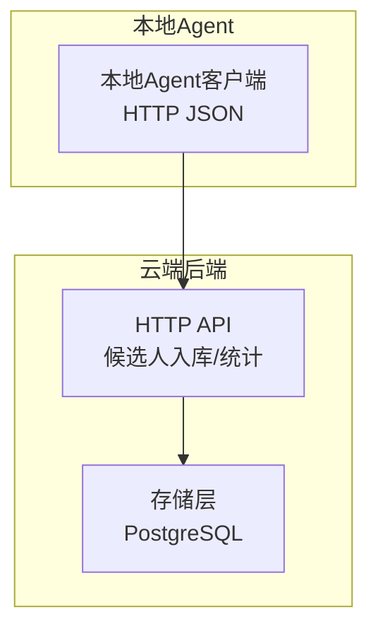
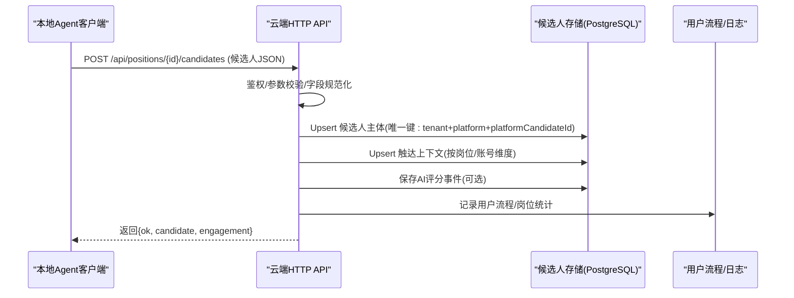
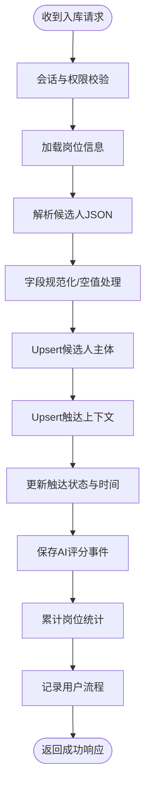
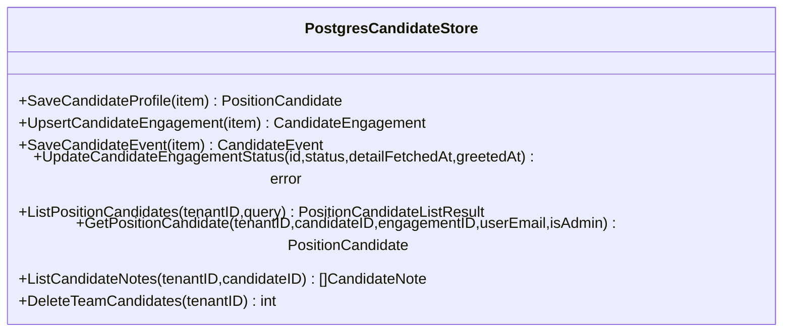
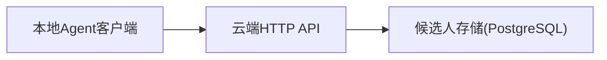

# 候选人数据摄入

<cite>
**本文引用的文件**
- [local_candidate_ingest.go](file://goodhr5/cloud/backend/internal/httpapi/local_candidate_ingest.go)
- [candidate_service.go](file://goodhr5/cloud/backend/internal/httpapi/candidate_service.go)
- [candidate_store_pg.go](file://goodhr5/cloud/backend/internal/httpapi/candidate_store_pg.go)
- [candidate_store.go](file://goodhr5/cloud/backend/internal/httpapi/candidate_store.go)
- [client.go](file://goodhr5/local-agent-go/internal/cloudapi/client.go)
- [client.go](file://goodhr5/local-agent-go/internal/integration/cloud/client.go)
- [cloud-control-local-agent-architecture.md](file://docs/cloud-control-local-agent-architecture.md)
</cite>

## 目录
1. [简介](#简介)
2. [项目结构](#项目结构)
3. [核心组件](#核心组件)
4. [架构总览](#架构总览)
5. [详细组件分析](#详细组件分析)
6. [依赖关系分析](#依赖关系分析)
7. [性能考量](#性能考量)
8. [故障排查指南](#故障排查指南)
9. [结论](#结论)
10. [附录：API 与协议规范](#附录api-与协议规范)

## 简介
本文件面向“候选人数据摄入系统”，聚焦本地 Agent 到云端的数据同步机制、批量处理能力、冲突解决策略，以及数据验证流程、错误处理机制、重试逻辑。文档同时给出 API 接口规范、数据传输协议、性能优化策略，并提供数据摄入流程图、异常处理示例和监控指标说明，帮助开发者理解并优化候选人数据同步流程。

## 项目结构
- 云端后端（Go）提供 HTTP API 接收本地 Agent 回传的候选人数据，并进行入库、统计汇总与事件记录。
- 本地 Agent（Go/新实现）负责从招聘平台抓取候选人信息，进行本地解析与结构化，再调用云端 API 上报结果与统计。
- 数据库层使用 PostgreSQL 持久化候选人主体、触达上下文与事件流水；查询与写入通过存储层封装。
- 架构文档明确了云端与本地的职责边界：云端保存任务元信息、统计摘要、配置和本地机器绑定信息；候选人详情、截图与 OCR 等原始数据保留在本地。

图表来源
- [client.go:236-290](file://goodhr5/local-agent-go/internal/cloudapi/client.go#L236-L290)
- [client.go:227-238](file://goodhr5/local-agent-go/internal/integration/cloud/client.go#L227-L238)
- [local_candidate_ingest.go:23-124](file://goodhr5/cloud/backend/internal/httpapi/local_candidate_ingest.go#L23-L124)
- [candidate_store_pg.go:24-161](file://goodhr5/cloud/backend/internal/httpapi/candidate_store_pg.go#L24-L161)

章节来源
- [cloud-control-local-agent-architecture.md:30-52](file://docs/cloud-control-local-agent-architecture.md#L30-L52)
- [cloud-control-local-agent-architecture.md:94-117](file://docs/cloud-control-local-agent-architecture.md#L94-L117)

## 核心组件
- 云端候选人入库接口：接收本地 Agent 的候选人 JSON，校验字段、去重入库、更新触达状态、累计岗位统计、记录 AI 评分事件与用户流程。
- 云端候选人存储：三表模型（候选人主体、触达上下文、事件流水），支持 upsert 冲突处理、分页查询、团队隔离。
- 本地 Agent 客户端：封装认证、JSON 序列化、超时控制、错误消息翻译与重试策略（完成态同步最多三次）。
- 数据验证与规范化：云端对请求体进行类型转换、空值处理、范围限制；本地客户端对参数进行前置校验。

章节来源
- [local_candidate_ingest.go:23-124](file://goodhr5/cloud/backend/internal/httpapi/local_candidate_ingest.go#L23-L124)
- [candidate_store_pg.go:24-161](file://goodhr5/cloud/backend/internal/httpapi/candidate_store_pg.go#L24-L161)
- [client.go:236-290](file://goodhr5/local-agent-go/internal/cloudapi/client.go#L236-L290)
- [client.go:227-238](file://goodhr5/local-agent-go/internal/integration/cloud/client.go#L227-L238)

## 架构总览
本地 Agent 将结构化后的候选人数据以 JSON 形式 POST 到云端岗位子资源接口。云端服务进行身份鉴权、参数校验、去重入库、触达上下文更新、统计累加与事件记录。数据库层通过唯一键与条件 upsert 避免重复写入，并维护最新触达时间戳。

图表来源
- [client.go:236-290](file://goodhr5/local-agent-go/internal/cloudapi/client.go#L236-L290)
- [client.go:227-238](file://goodhr5/local-agent-go/internal/integration/cloud/client.go#L227-L238)
- [local_candidate_ingest.go:23-124](file://goodhr5/cloud/backend/internal/httpapi/local_candidate_ingest.go#L23-L124)
- [candidate_store_pg.go:24-161](file://goodhr5/cloud/backend/internal/httpapi/candidate_store_pg.go#L24-L161)

## 详细组件分析

### 云端候选人入库接口
- 职责：接收本地 Agent 回传的候选人 JSON，解析并保存到云端简历库，更新触达状态，累计岗位统计，记录 AI 评分事件与用户流程。
- 输入：岗位 ID、候选人 JSON（包含基础信息、联系方式、期望薪资、教育经历、工作经历、证书、荣誉、项目经验、沟通评价、AI 评分与原因、原始文本、状态等）。
- 输出：成功时返回候选人主体与触达 ID；失败时返回错误码与消息。
- 关键逻辑：
  - 鉴权与会话校验。
  - 岗位存在性校验。
  - 请求体 JSON 解码与字段规范化。
  - 候选人主体 upsert（基于租户、平台、平台候选人ID的唯一键）。
  - 触达上下文 upsert（按岗位/账号维度）。
  - 更新触达状态与关键时间（详情获取时间、打招呼时间）。
  - 累计岗位扫描/跳过/失败计数。
  - 记录 AI 评分事件（详情分析与打招呼分析）。
  - 记录用户流程（首次处理简历、首次打招呼成功）。

图表来源
- [local_candidate_ingest.go:23-124](file://goodhr5/cloud/backend/internal/httpapi/local_candidate_ingest.go#L23-L124)
- [candidate_store_pg.go:24-161](file://goodhr5/cloud/backend/internal/httpapi/candidate_store_pg.go#L24-L161)

章节来源
- [local_candidate_ingest.go:23-124](file://goodhr5/cloud/backend/internal/httpapi/local_candidate_ingest.go#L23-L124)
- [candidate_store_pg.go:24-161](file://goodhr5/cloud/backend/internal/httpapi/candidate_store_pg.go#L24-L161)

### 云端候选人存储（PostgreSQL）
- 三表模型：
  - 候选人主体：保存简历结构化字段、AI 评分与原因、首次出现时间等。
  - 触达上下文：关联候选人、岗位、平台账号，记录状态与关键时间。
  - 事件流水：记录 AI 评分、人工备注等事件，附带输入输出与元数据。
- 冲突解决：
  - 候选人主体 upsert 基于唯一键（租户、平台、平台候选人ID），冲突时覆盖字段并更新时间戳。
  - 触达上下文 upsert 根据是否携带平台账号选择不同冲突目标，避免重复创建。
- 查询能力：
  - 分页列表查询，支持关键词搜索、岗位过滤、用户隔离。
  - 详情查询可限定触达上下文，并附带最近备注与事件。

图表来源
- [candidate_store_pg.go:24-161](file://goodhr5/cloud/backend/internal/httpapi/candidate_store_pg.go#L24-L161)
- [candidate_store_pg.go:163-230](file://goodhr5/cloud/backend/internal/httpapi/candidate_store_pg.go#L163-L230)
- [candidate_store_pg.go:232-293](file://goodhr5/cloud/backend/internal/httpapi/candidate_store_pg.go#L232-L293)
- [candidate_store_pg.go:295-323](file://goodhr5/cloud/backend/internal/httpapi/candidate_store_pg.go#L295-L323)
- [candidate_store_pg.go:325-394](file://goodhr5/cloud/backend/internal/httpapi/candidate_store_pg.go#L325-L394)

章节来源
- [candidate_store_pg.go:24-161](file://goodhr5/cloud/backend/internal/httpapi/candidate_store_pg.go#L24-L161)
- [candidate_store_pg.go:163-230](file://goodhr5/cloud/backend/internal/httpapi/candidate_store_pg.go#L163-L230)
- [candidate_store_pg.go:232-293](file://goodhr5/cloud/backend/internal/httpapi/candidate_store_pg.go#L232-L293)
- [candidate_store_pg.go:295-323](file://goodhr5/cloud/backend/internal/httpapi/candidate_store_pg.go#L295-L323)
- [candidate_store_pg.go:325-394](file://goodhr5/cloud/backend/internal/httpapi/candidate_store_pg.go#L325-L394)

### 本地 Agent 客户端（旧版 Go）
- 职责：封装云端 HTTP 调用，包括认证、JSON 编解码、超时控制、错误消息翻译。
- 关键方法：
  - 保存候选人：POST 到岗位子资源接口。
  - 上报已处理简历数：POST 累计新增数量。
  - 同步岗位统计：POST 扫描/跳过/失败计数。
  - 同步岗位状态：POST 运行状态与本次打招呼和跳过数量。
  - 发送失败通知：POST 失败邮件通知。
- 错误处理：统一提取云端错误消息，常见英文错误翻译为中文提示。

章节来源
- [client.go:236-290](file://goodhr5/local-agent-go/internal/cloudapi/client.go#L236-L290)
- [client.go:498-542](file://goodhr5/local-agent-go/internal/cloudapi/client.go#L498-L542)

### 本地 Agent 客户端（新版 Go）
- 职责：强类型云端客户端，提供更严格的请求/响应结构与默认值归一化。
- 关键方法：
  - 保存候选人：POST 到岗位子资源接口，要求候选人姓名非空。
  - 同步岗位统计：POST 扫描/跳过/失败计数。
  - 上报已处理简历数：POST 累计新增数量。
  - 同步完成状态：最多尝试三次，并要求云端确认完成邮件已发送。
  - 发送失败通知：POST 失败邮件通知。
- 重试逻辑：完成状态同步最多三次，间隔短暂等待，确保云端确认。

章节来源
- [client.go:227-238](file://goodhr5/local-agent-go/internal/integration/cloud/client.go#L227-L238)
- [client.go:187-209](file://goodhr5/local-agent-go/internal/integration/cloud/client.go#L187-L209)
- [client.go:240-264](file://goodhr5/local-agent-go/internal/integration/cloud/client.go#L240-L264)
- [client.go:288-306](file://goodhr5/local-agent-go/internal/integration/cloud/client.go#L288-L306)

### 数据验证与规范化
- 云端侧：
  - 请求体验证：JSON 解码失败返回 400。
  - 字段规范化：字符串去除空白、空值兜底、数值类型兼容（int/float）、数组字段安全反序列化。
  - 范围限制：已处理简历数上限 500，统计计数非负。
  - 状态推断：未显式状态默认为“已扫描”；若含详情或原始文本则标记详情获取时间；若状态为“已打招呼”则标记打招呼时间。
- 本地侧：
  - 参数前置校验：岗位 ID、候选人姓名等必填项检查。
  - 请求体构造：仅包含必要字段，减少无效传输。

章节来源
- [local_candidate_ingest.go:53-91](file://goodhr5/cloud/backend/internal/httpapi/local_candidate_ingest.go#L53-L91)
- [local_candidate_ingest.go:134-185](file://goodhr5/cloud/backend/internal/httpapi/local_candidate_ingest.go#L134-L185)
- [local_candidate_ingest.go:187-229](file://goodhr5/cloud/backend/internal/httpapi/local_candidate_ingest.go#L187-L229)
- [local_candidate_ingest.go:281-409](file://goodhr5/cloud/backend/internal/httpapi/local_candidate_ingest.go#L281-L409)
- [client.go:227-238](file://goodhr5/local-agent-go/internal/integration/cloud/client.go#L227-L238)

### 批量处理能力
- 单次入库：每个候选人独立请求，云端逐条处理并落库。
- 批量统计：
  - 已处理简历数：支持批量上报新增数量（上限 500）。
  - 岗位统计：支持累计扫描/跳过/失败计数。
- 建议：
  - 本地端按批次聚合统计上报，减少频繁小请求。
  - 大对象拆分：候选人详情与附件不上传云端，仅结构化字段与摘要。

章节来源
- [local_candidate_ingest.go:134-185](file://goodhr5/cloud/backend/internal/httpapi/local_candidate_ingest.go#L134-L185)
- [local_candidate_ingest.go:187-229](file://goodhr5/cloud/backend/internal/httpapi/local_candidate_ingest.go#L187-L229)
- [client.go:253-290](file://goodhr5/local-agent-go/internal/cloudapi/client.go#L253-L290)
- [client.go:187-209](file://goodhr5/local-agent-go/internal/integration/cloud/client.go#L187-L209)

### 冲突解决策略
- 候选人主体：基于租户、平台、平台候选人ID的唯一键进行 upsert，冲突时覆盖字段并更新时间戳，保留首次出现时间。
- 触达上下文：根据是否携带平台账号选择不同冲突目标，避免重复创建；状态与时间字段采用 COALESCE 保护已有值。
- 事件流水：追加写入，不覆盖历史事件，便于审计与回溯。

章节来源
- [candidate_store_pg.go:24-161](file://goodhr5/cloud/backend/internal/httpapi/candidate_store_pg.go#L24-L161)
- [candidate_store_pg.go:163-230](file://goodhr5/cloud/backend/internal/httpapi/candidate_store_pg.go#L163-L230)
- [candidate_store_pg.go:232-293](file://goodhr5/cloud/backend/internal/httpapi/candidate_store_pg.go#L232-L293)

### 错误处理与重试逻辑
- 云端错误：
  - 方法不允许、参数非法、岗位不存在、存储不可用等返回相应 HTTP 状态码与消息。
  - 写日志：入库链路日志记录成功与失败原因，便于追踪。
- 本地重试：
  - 完成状态同步最多三次，间隔短暂等待，确保云端确认完成邮件已发送。
  - 失败通知：直接 POST 失败邮件通知，记录日志与响应状态。
- 建议：
  - 本地端对网络错误与 5xx 错误实施指数退避重试。
  - 对 4xx 错误立即失败，避免无意义重试。

章节来源
- [local_candidate_ingest.go:23-124](file://goodhr5/cloud/backend/internal/httpapi/local_candidate_ingest.go#L23-L124)
- [client.go:240-264](file://goodhr5/local-agent-go/internal/integration/cloud/client.go#L240-L264)
- [client.go:498-542](file://goodhr5/local-agent-go/internal/cloudapi/client.go#L498-L542)

## 依赖关系分析
- 云端 API 依赖存储层进行数据持久化。
- 本地 Agent 客户端依赖云端 HTTP API 进行数据上报与状态同步。
- 存储层依赖 PostgreSQL 进行结构化数据存储与查询。

图表来源
- [client.go:236-290](file://goodhr5/local-agent-go/internal/cloudapi/client.go#L236-L290)
- [client.go:227-238](file://goodhr5/local-agent-go/internal/integration/cloud/client.go#L227-L238)
- [local_candidate_ingest.go:23-124](file://goodhr5/cloud/backend/internal/httpapi/local_candidate_ingest.go#L23-L124)
- [candidate_store_pg.go:24-161](file://goodhr5/cloud/backend/internal/httpapi/candidate_store_pg.go#L24-L161)

章节来源
- [candidate_store.go:12-156](file://goodhr5/cloud/backend/internal/httpapi/candidate_store.go#L12-L156)
- [candidate_store_pg.go:24-161](file://goodhr5/cloud/backend/internal/httpapi/candidate_store_pg.go#L24-L161)

## 性能考量
- 数据库层：
  - 使用 upsert 与条件冲突目标减少重复写入。
  - 查询使用分页与索引优化（如团队、岗位、关键词）。
  - 事件流水限制读取数量，避免大结果集。
- 网络层：
  - 本地客户端设置超时，避免阻塞。
  - 批量统计上报减少请求次数。
- 应用层：
  - 字段规范化减少无效数据。
  - 仅上传结构化字段与摘要，避免大对象传输。
- 建议：
  - 对高频写入路径增加连接池与事务批处理。
  - 对查询路径增加缓存层（如 Redis）用于热点数据。

[本节为通用性能讨论，无需特定文件引用]

## 故障排查指南
- 常见问题：
  - 登录态失效：本地客户端检测到 401/403 返回，提示重新登录。
  - 岗位不存在：云端返回 404，检查岗位 ID 与权限。
  - 参数非法：云端返回 400，检查请求体字段与范围限制。
  - 存储不可用：云端返回 500，检查数据库连接与迁移状态。
- 日志追踪：
  - 云端入库链路日志记录成功与失败原因。
  - 本地客户端记录请求地址、参数、响应状态码与数据。
- 建议：
  - 建立告警规则：入库失败率、统计上报失败率、完成状态同步失败率。
  - 定期巡检：数据库连接池、索引命中率、慢查询。

章节来源
- [local_candidate_ingest.go:126-132](file://goodhr5/cloud/backend/internal/httpapi/local_candidate_ingest.go#L126-L132)
- [client.go:498-542](file://goodhr5/local-agent-go/internal/cloudapi/client.go#L498-L542)

## 结论
候选人数据摄入系统通过本地 Agent 与云端后端的协作，实现了结构化候选人的可靠同步。云端通过 upsert 与条件冲突目标解决数据冲突，支持批量统计上报与事件记录。本地客户端提供重试与错误处理机制，确保数据一致性与用户体验。建议进一步优化批量处理、缓存与监控告警，提升系统稳定性与性能。

[本节为总结，无需特定文件引用]

## 附录：API 与协议规范

### 云端 API 接口
- 候选人入库
  - 方法：POST
  - 路径：/api/positions/{positionID}/candidates
  - 请求体：候选人 JSON（包含基础信息、联系方式、期望薪资、教育经历、工作经历、证书、荣誉、项目经验、沟通评价、AI 评分与原因、原始文本、状态等）
  - 响应：{ok, candidate, engagement}
- 已处理简历数上报
  - 方法：POST
  - 路径：/api/positions/{positionID}/processed-resumes
  - 请求体：{count}
  - 响应：{ok, count}
- 岗位统计同步
  - 方法：POST
  - 路径：/api/positions/{positionID}/counts
  - 请求体：{scanned_count, skipped_count, failed_count}
  - 响应：{ok}

章节来源
- [local_candidate_ingest.go:23-124](file://goodhr5/cloud/backend/internal/httpapi/local_candidate_ingest.go#L23-L124)
- [local_candidate_ingest.go:134-185](file://goodhr5/cloud/backend/internal/httpapi/local_candidate_ingest.go#L134-L185)
- [local_candidate_ingest.go:187-229](file://goodhr5/cloud/backend/internal/httpapi/local_candidate_ingest.go#L187-L229)

### 本地 Agent 客户端协议
- 认证：Bearer Token
- 内容类型：application/json
- 超时：本地客户端设置超时（旧版 15s，新版 20s）
- 错误处理：统一提取云端错误消息，常见英文错误翻译为中文提示

章节来源
- [client.go:342-383](file://goodhr5/local-agent-go/internal/cloudapi/client.go#L342-L383)
- [client.go:393-468](file://goodhr5/local-agent-go/internal/integration/cloud/client.go#L393-L468)

### 数据传输协议
- 格式：JSON
- 字段：结构化候选人字段与摘要，不包含详情正文、截图与 OCR 原文
- 大小：限制请求体大小，避免大对象传输

章节来源
- [cloud-control-local-agent-architecture.md:94-117](file://docs/cloud-control-local-agent-architecture.md#L94-L117)

### 监控指标
- 入库成功率：成功请求数 / 总请求数
- 统计上报成功率：成功上报数 / 总上报数
- 完成状态同步成功率：成功确认数 / 总尝试数
- 平均响应时间：P95/P99 延迟
- 错误分布：4xx/5xx 错误占比
- 数据库性能：慢查询数量、连接池使用率

[本节为通用监控指标，无需特定文件引用]