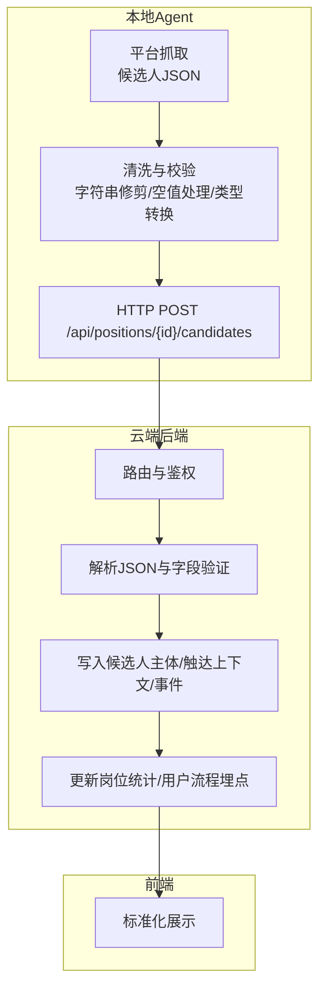
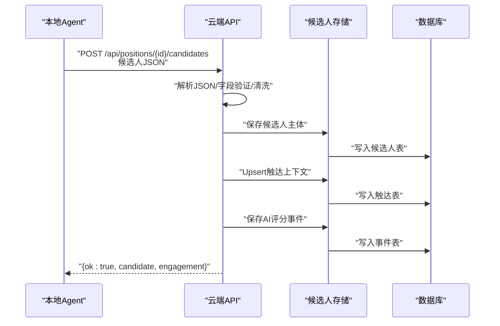
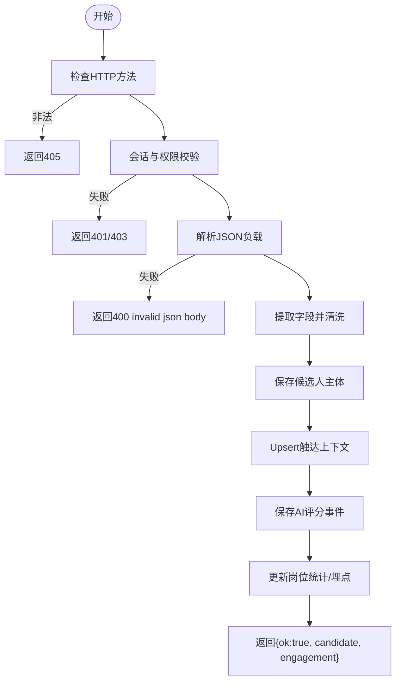
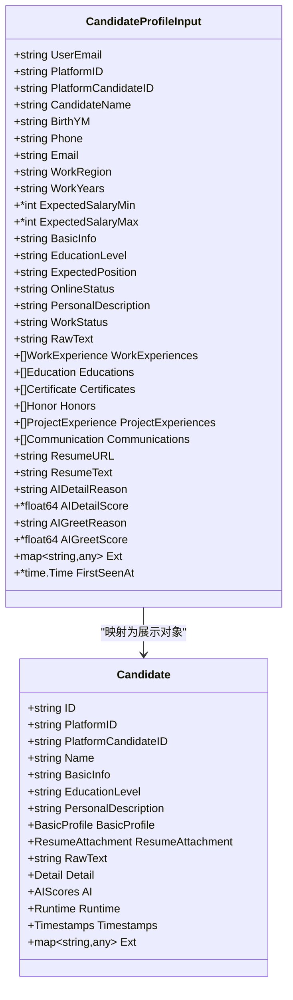
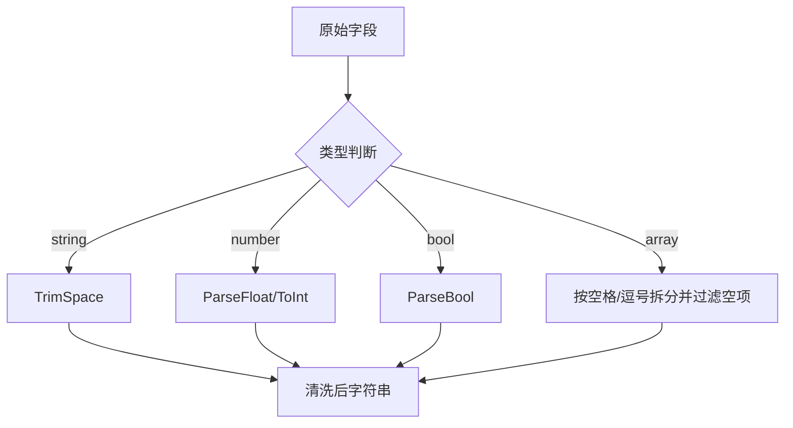
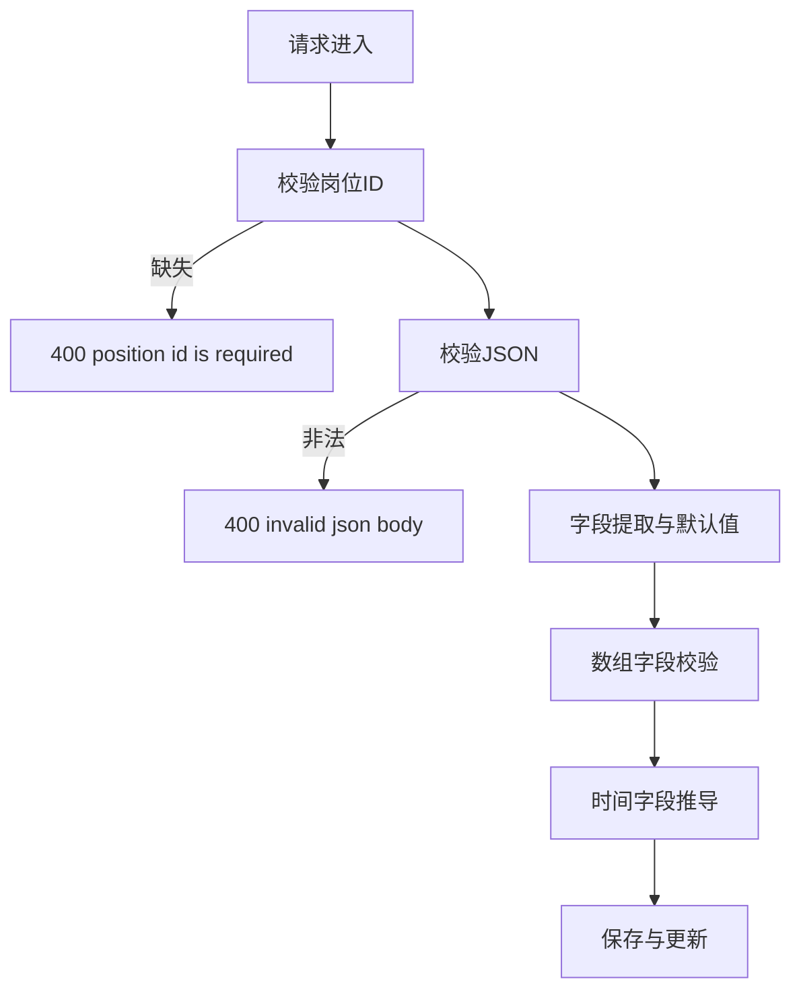
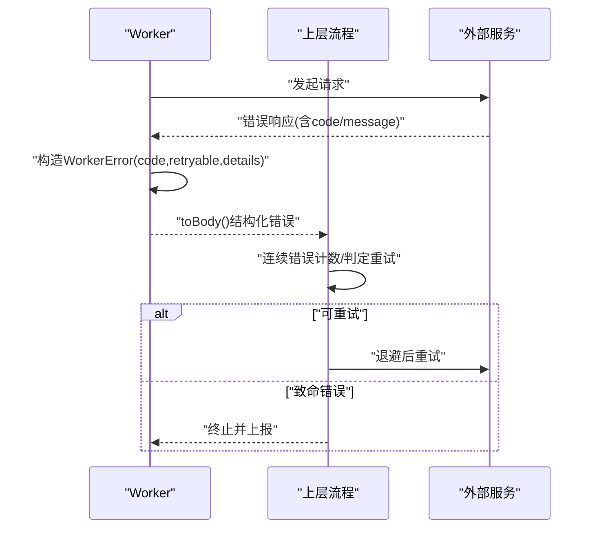
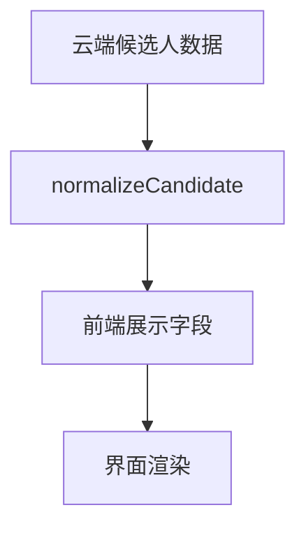
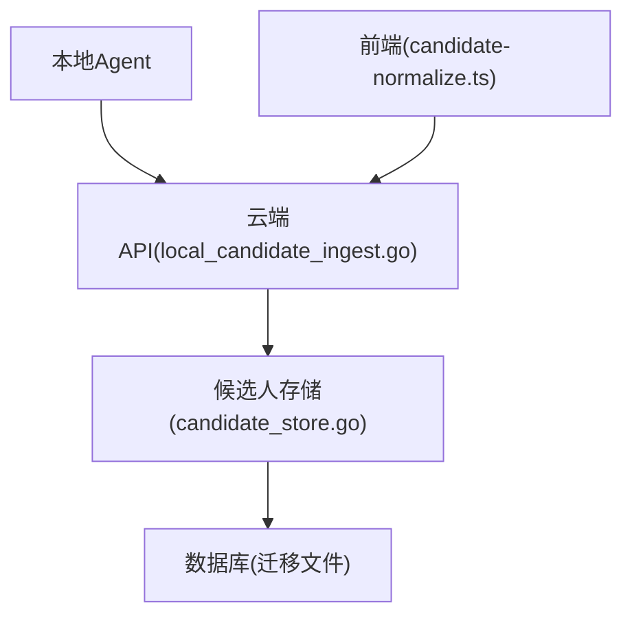

# 候选人数据验证

<cite>
**本文引用的文件**
- [local_candidate_ingest.go](file://goodhr5/cloud/backend/internal/httpapi/local_candidate_ingest.go)
- [candidate_store.go](file://goodhr5/cloud/backend/internal/httpapi/candidate_store.go)
- [candidate.go](file://goodhr5/cloud/backend/internal/httpapi/candidate.go)
- [0050_simplify_candidate_resume_schema.sql](file://goodhr5/cloud/backend/db/migrations/0050_simplify_candidate_resume_schema.sql)
- [candidate-normalize.ts](file://goodhr5/cloud/frontend-next/lib/candidate-normalize.ts)
- [detail.go](file://goodhr5/local-agent-go/internal/platforms/zhaopin/detail.go)
- [client.go](file://goodhr5/local-agent-go/internal/localai/client.go)
- [error_policy.go](file://goodhr5/local-agent-go/internal/positionrunner/error_policy.go)
- [worker-error.ts](file://goodhr5/local-agent-go-new/worker/src/errors/worker-error.ts)
- [value.ts](file://goodhr5/local-agent-go-new/worker/src/validation/value.ts)
</cite>

## 目录
1. [简介](#简介)
2. [项目结构](#项目结构)
3. [核心组件](#核心组件)
4. [架构总览](#架构总览)
5. [详细组件分析](#详细组件分析)
6. [依赖关系分析](#依赖关系分析)
7. [性能考虑](#性能考虑)
8. [故障排查指南](#故障排查指南)
9. [结论](#结论)
10. [附录](#附录)

## 简介
本文件面向本地 Agent 与云端后端开发者，系统化说明“候选人数据入库”的验证机制。内容涵盖：
- 本地 Agent 提交的候选人 JSON 数据结构、字段类型与必填项约束
- 数据清洗规则（字符串修剪、空值处理、类型转换）
- 验证错误分类、错误码定义与客户端重试策略
- 完整的请求/响应示例与数据模型定义
- 验证规则说明，帮助正确实现本地 Agent 的数据提交功能

## 项目结构
围绕候选人入库的关键路径由以下模块组成：
- 本地 Agent：负责从招聘平台抓取候选人信息，进行初步清洗与校验后，通过 HTTP 接口提交到云端
- 云端后端：接收候选人的 JSON 载荷，执行字段级验证与清洗，持久化到数据库，并记录事件与统计
- 前端展示：对云端返回的候选人数据进行标准化展示

**图表来源**
- [local_candidate_ingest.go:23-124](file://goodhr5/cloud/backend/internal/httpapi/local_candidate_ingest.go#L23-L124)
- [candidate_store.go:200-274](file://goodhr5/cloud/backend/internal/httpapi/candidate_store.go#L200-L274)
- [candidate.go:126-143](file://goodhr5/cloud/backend/internal/httpapi/candidate.go#L126-L143)

**章节来源**
- [local_candidate_ingest.go:23-124](file://goodhr5/cloud/backend/internal/httpapi/local_candidate_ingest.go#L23-L124)
- [candidate_store.go:200-274](file://goodhr5/cloud/backend/internal/httpapi/candidate_store.go#L200-L274)
- [candidate.go:126-143](file://goodhr5/cloud/backend/internal/httpapi/candidate.go#L126-L143)

## 核心组件
- 云端入库接口：接收本地 Agent 提交的候选人 JSON，完成鉴权、参数提取、验证、存储与统计更新
- 候选人数据模型：统一的结构体定义，包含基础信息、经历数组、AI评分等
- 数据清洗工具：字符串修剪、空值处理、类型转换、列表规范化
- 错误与重试：统一的错误对象、稳定错误码、可重试标记、连续错误计数

**章节来源**
- [local_candidate_ingest.go:23-124](file://goodhr5/cloud/backend/internal/httpapi/local_candidate_ingest.go#L23-L124)
- [candidate.go:6-143](file://goodhr5/cloud/backend/internal/httpapi/candidate.go#L6-L143)
- [client.go:1047-1102](file://goodhr5/local-agent-go/internal/localai/client.go#L1047-L1102)
- [worker-error.ts:38-71](file://goodhr5/local-agent-go-new/worker/src/errors/worker-error.ts#L38-L71)
- [value.ts:1-51](file://goodhr5/local-agent-go-new/worker/src/validation/value.ts#L1-L51)

## 架构总览
本地 Agent 将候选人 JSON 提交至云端，云端在入库前进行严格的字段级验证与清洗，随后写入候选人主体、触达上下文与事件流水，并更新岗位统计与用户流程埋点。前端再对云端数据进行标准化展示。

**图表来源**
- [local_candidate_ingest.go:23-124](file://goodhr5/cloud/backend/internal/httpapi/local_candidate_ingest.go#L23-L124)
- [candidate_store.go:200-274](file://goodhr5/cloud/backend/internal/httpapi/candidate_store.go#L200-L274)

## 详细组件分析

### 云端入库接口与验证流程
- 入口函数负责方法检查、会话校验、岗位存在性校验、JSON 解析与字段提取
- 使用工具函数读取字符串、整数、浮点数、数组等字段，并进行修剪与类型转换
- 根据状态字段推断详情获取时间与打招呼时间，更新岗位统计与用户流程埋点
- 成功时返回统一的 ok 结构与候选人、触达ID

**图表来源**
- [local_candidate_ingest.go:23-124](file://goodhr5/cloud/backend/internal/httpapi/local_candidate_ingest.go#L23-L124)

**章节来源**
- [local_candidate_ingest.go:23-124](file://goodhr5/cloud/backend/internal/httpapi/local_candidate_ingest.go#L23-L124)

### 数据模型与字段定义
- 候选人主体输入结构体定义了所有入库字段，包括基础信息、期望薪资区间、教育/工作/证书/荣誉/项目经历、沟通记录、AI评分等
- 共享数据结构体定义了云端统一展示的候选人对象，包含基础信息、附件、详情、AI评分、运行态、时间戳与扩展字段
- 数据库迁移文件注释明确了各数组字段的字段名约定

**图表来源**
- [candidate_store.go:63-98](file://goodhr5/cloud/backend/internal/httpapi/candidate_store.go#L63-L98)
- [candidate.go:126-143](file://goodhr5/cloud/backend/internal/httpapi/candidate.go#L126-L143)

**章节来源**
- [candidate_store.go:63-98](file://goodhr5/cloud/backend/internal/httpapi/candidate_store.go#L63-L98)
- [candidate.go:6-143](file://goodhr5/cloud/backend/internal/httpapi/candidate.go#L6-L143)
- [0050_simplify_candidate_resume_schema.sql:30-38](file://goodhr5/cloud/backend/db/migrations/0050_simplify_candidate_resume_schema.sql#L30-L38)

### 数据清洗规则
- 字符串清洗：统一去除首尾空白；空值或不可转字符串时返回空串
- 数值转换：支持 float/int/json.Number/string 多种来源，失败时回退默认值
- 布尔转换：支持 bool/string，失败时回退 false
- 列表规范：将任意值转换为字符串数组，过滤空项并按空格/逗号拆分
- 详情文本清理：平台详情文本提取后进行 TrimSpace

**图表来源**
- [client.go:1047-1102](file://goodhr5/local-agent-go/internal/localai/client.go#L1047-L1102)
- [go_helpers.go:82-133](file://goodhr5/local-agent-go/internal/browser/go_helpers.go#L82-L133)
- [detail.go:98-102](file://goodhr5/local-agent-go/internal/platforms/zhaopin/detail.go#L98-L102)

**章节来源**
- [client.go:1047-1102](file://goodhr5/local-agent-go/internal/localai/client.go#L1047-L1102)
- [go_helpers.go:82-133](file://goodhr5/local-agent-go/internal/browser/go_helpers.go#L82-L133)
- [detail.go:98-102](file://goodhr5/local-agent-go/internal/platforms/zhaopin/detail.go#L98-L102)

### 必填字段检查与格式校验规则
- 必填字段：
  - 岗位ID：从 URL 路径提取，缺失则返回 400
  - JSON 负载：必须为合法 JSON，否则返回 400
- 可选字段：
  - 姓名优先使用 candidate_name，其次 name；缺失时显示“未知候选人”
  - 状态 status 为空时默认为 scanned
  - 期望薪资 min/max 可为空，若提供需为数字
- 数组字段：
  - work_experiences、educations、certificates、honors、project_experiences、colleague_communications 均为数组，允许为空数组
- 时间字段：
  - detail_text 或 raw_text 非空时，设置详情获取时间为当前时间
  - 状态为 greeted 时，设置打招呼时间为当前时间

**图表来源**
- [local_candidate_ingest.go:23-124](file://goodhr5/cloud/backend/internal/httpapi/local_candidate_ingest.go#L23-L124)

**章节来源**
- [local_candidate_ingest.go:23-124](file://goodhr5/cloud/backend/internal/httpapi/local_candidate_ingest.go#L23-L124)

### 错误处理与重试策略
- 统一错误对象：Worker 侧错误包含稳定错误码、消息、动作、步骤、追踪ID、是否可重试、详情
- 连续错误计数：同一操作位置发生相同错误会累计计数，达到阈值停止后续操作
- 重试策略：
  - Worker 错误可标记 retryable，上层根据标记决定是否重试
  - 服务错误根据状态码与响应内容决定可重试与致命错误，并支持 Retry-After 退避等待
- 客户端重试建议：
  - 对于 429/5xx 错误，采用指数退避并重试有限次数
  - 对于 400/422 且包含配额/余额/模型相关错误，视为致命错误不重试
  - 对于 401/402/403/404，直接终止并提示用户

**图表来源**
- [worker-error.ts:38-71](file://goodhr5/local-agent-go-new/worker/src/errors/worker-error.ts#L38-L71)
- [error_policy.go:48-85](file://goodhr5/local-agent-go/internal/positionrunner/error_policy.go#L48-L85)
- [client.go:354-390](file://goodhr5/local-agent-go-new/internal/integration/ai/client.go#L354-L390)

**章节来源**
- [worker-error.ts:38-71](file://goodhr5/local-agent-go-new/worker/src/errors/worker-error.ts#L38-L71)
- [error_policy.go:48-85](file://goodhr5/local-agent-go/internal/positionrunner/error_policy.go#L48-L85)
- [client.go:354-390](file://goodhr5/local-agent-go-new/internal/integration/ai/client.go#L354-L390)

### 前端标准化与展示
- 前端对云端返回的候选人数据进行标准化，生成展示所需的扁平结构
- 字段映射包括姓名、年龄、地区、工作年限、学历、期望职位、薪资区间、工作状态、在线状态、个人描述、经历数组、证书/荣誉/项目经历、沟通记录、原始文本、AI评分、备注、创建/更新时间等
- 状态文案与评分文案用于界面友好展示

**图表来源**
- [candidate-normalize.ts:55-112](file://goodhr5/cloud/frontend-next/lib/candidate-normalize.ts#L55-L112)

**章节来源**
- [candidate-normalize.ts:55-112](file://goodhr5/cloud/frontend-next/lib/candidate-normalize.ts#L55-L112)

## 依赖关系分析
- 云端入库接口依赖候选人存储接口，存储接口提供内存与PostgreSQL两种实现
- 本地 Agent 依赖平台运行时与清洗工具，确保提交数据的稳定性
- 前端依赖标准化库，保证展示一致性

**图表来源**
- [local_candidate_ingest.go:23-124](file://goodhr5/cloud/backend/internal/httpapi/local_candidate_ingest.go#L23-L124)
- [candidate_store.go:200-274](file://goodhr5/cloud/backend/internal/httpapi/candidate_store.go#L200-L274)
- [0050_simplify_candidate_resume_schema.sql:30-38](file://goodhr5/cloud/backend/db/migrations/0050_simplify_candidate_resume_schema.sql#L30-L38)
- [candidate-normalize.ts:55-112](file://goodhr5/cloud/frontend-next/lib/candidate-normalize.ts#L55-L112)

**章节来源**
- [local_candidate_ingest.go:23-124](file://goodhr5/cloud/backend/internal/httpapi/local_candidate_ingest.go#L23-L124)
- [candidate_store.go:200-274](file://goodhr5/cloud/backend/internal/httpapi/candidate_store.go#L200-L274)
- [0050_simplify_candidate_resume_schema.sql:30-38](file://goodhr5/cloud/backend/db/migrations/0050_simplify_candidate_resume_schema.sql#L30-L38)
- [candidate-normalize.ts:55-112](file://goodhr5/cloud/frontend-next/lib/candidate-normalize.ts#L55-L112)

## 性能考虑
- 批量数组字段序列化/反序列化：避免过大 payload，合理分页或分批提交
- 字符串修剪与类型转换：尽量在本地完成，减少云端计算开销
- 错误重试：采用指数退避与最大重试次数，避免雪崩
- 日志与埋点：控制日志粒度与长度，避免影响吞吐

[本节为通用指导，无需特定文件引用]

## 故障排查指南
- 常见错误码与原因：
  - 400 invalid json body：JSON 格式不正确
  - 400 position id is required：URL 中缺少岗位ID
  - 404 position not found：岗位不存在或无权限
  - 500 failed to save candidate：存储层异常
- 排查步骤：
  - 检查 JSON 结构与字段类型是否符合模型定义
  - 确认必填字段已提供且非空
  - 查看云端入库日志与事件流水定位问题
  - 对于重试类错误，检查网络与服务端状态码

**章节来源**
- [local_candidate_ingest.go:23-124](file://goodhr5/cloud/backend/internal/httpapi/local_candidate_ingest.go#L23-L124)
- [candidate_store.go:200-274](file://goodhr5/cloud/backend/internal/httpapi/candidate_store.go#L200-L274)

## 结论
本机制通过严格的字段级验证、清洗与错误处理，确保本地 Agent 提交的候选人数据质量与系统稳定性。开发者应遵循数据模型与验证规则，合理使用清洗工具与重试策略，以实现可靠的候选人数据提交功能。

[本节为总结，无需特定文件引用]

## 附录

### 请求与响应示例
- 请求路径：POST /api/positions/{positionID}/candidates
- 请求体关键字段：
  - platform_id：平台标识（可选，回退到岗位配置）
  - id：平台候选人ID（可选）
  - candidate_name/name：候选人姓名（二选一）
  - birth_ym：出生年月（可选）
  - phone/email：联系方式（可选）
  - work_region/work_years：工作地区/年限（可选）
  - expected_salary_min/expected_salary_max：期望薪资区间（可选，数字）
  - basic_info/summary：基础信息（二选一）
  - education_level：学历（可选）
  - expected_position：期望职位（可选）
  - online_status：在线状态（可选）
  - personal_description/description：个人描述（二选一）
  - work_status：工作状态（可选）
  - raw_text：平台简历原文（可选）
  - work_experiences/educations/certificates/honors/project_experiences/colleague_communications：数组（可选）
  - ai_detail_reason/ai_detail_score：详情分析原因/分数（可选）
  - ai_greet_reason/ai_greet_score：打招呼分析原因/分数（可选）
  - status：状态（可选，默认 scanned）
- 响应体：
  - ok：true
  - candidate：标准化后的候选人对象
  - engagement：触达上下文ID

**章节来源**
- [local_candidate_ingest.go:23-124](file://goodhr5/cloud/backend/internal/httpapi/local_candidate_ingest.go#L23-L124)
- [candidate.go:126-143](file://goodhr5/cloud/backend/internal/httpapi/candidate.go#L126-L143)

### 数据模型定义
- 候选人主体输入：见 CandidateProfileInput
- 共享候选人对象：见 Candidate
- 数组字段约定：见迁移文件注释

**章节来源**
- [candidate_store.go:63-98](file://goodhr5/cloud/backend/internal/httpapi/candidate_store.go#L63-L98)
- [candidate.go:6-143](file://goodhr5/cloud/backend/internal/httpapi/candidate.go#L6-L143)
- [0050_simplify_candidate_resume_schema.sql:30-38](file://goodhr5/cloud/backend/db/migrations/0050_simplify_candidate_resume_schema.sql#L30-L38)

### 验证规则说明
- 字符串：TrimSpace，空值转空串
- 数值：支持多来源转换，失败回退默认值
- 布尔：支持 bool/string，失败回退 false
- 数组：规范化为空数组或过滤后的字符串数组
- 状态：默认 scanned；greeted 时设置打招呼时间
- 详情时间：raw_text/detail_text 非空时设置详情获取时间

**章节来源**
- [client.go:1047-1102](file://goodhr5/local-agent-go/internal/localai/client.go#L1047-L1102)
- [go_helpers.go:82-133](file://goodhr5/local-agent-go/internal/browser/go_helpers.go#L82-L133)
- [local_candidate_ingest.go:363-408](file://goodhr5/cloud/backend/internal/httpapi/local_candidate_ingest.go#L363-L408)