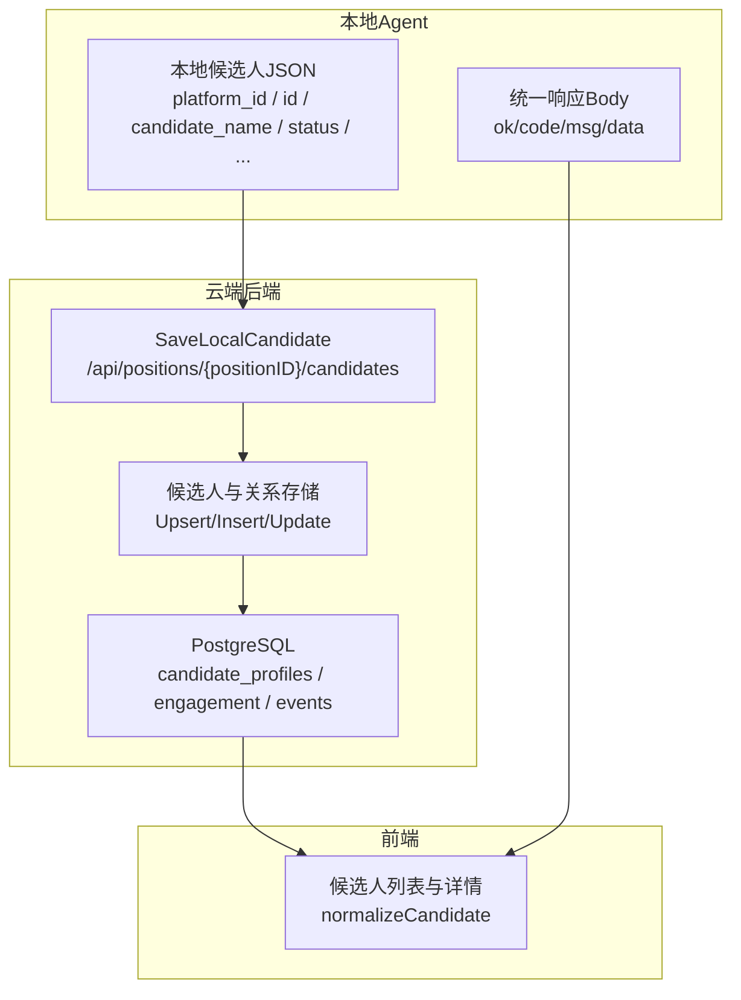
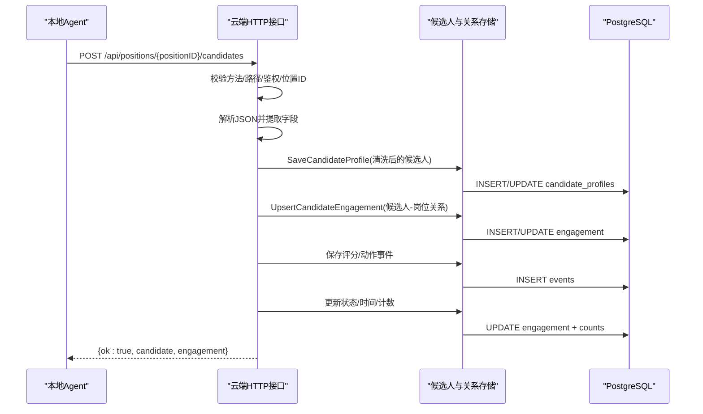
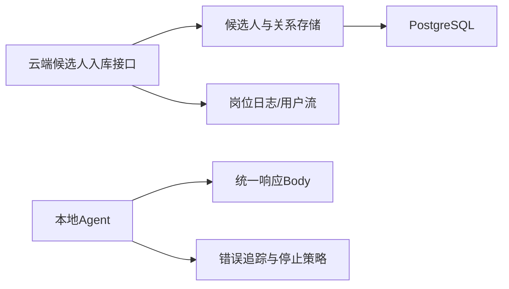

# 候选人数据验证

<cite>
**本文引用的文件**   
- [local_candidate_ingest.go](file://goodhr5/cloud/backend/internal/httpapi/local_candidate_ingest.go)
- [简历模型.json](file://goodhr5/简历模型.json)
- [0028_candidate_profile_engagement_events.sql](file://goodhr5/cloud/backend/db/migrations/0028_candidate_profile_engagement_events.sql)
- [0050_simplify_candidate_resume_schema.sql](file://goodhr5/cloud/backend/db/migrations/0050_simplify_candidate_resume_schema.sql)
- [candidate_store_pg.go](file://goodhr5/cloud/backend/internal/httpapi/candidate_store_pg.go)
- [candidate_store.go](file://goodhr5/cloud/backend/internal/httpapi/candidate_store.go)
- [positions.go](file://goodhr5/local-agent-go/internal/localdb/positions.go)
- [error_policy.go](file://goodhr5/local-agent-go/internal/positionrunner/error_policy.go)
- [json.go](file://goodhr5/local-agent-go/internal/response/json.go)
- [index.js](file://goodhr5/local-agent-go/worker-node/src/index.js)
- [cloud-control-local-agent-architecture.md](file://docs/cloud-control-local-agent-architecture.md)
- [goodhr5-flow.md](file://goodhr5/docs/goodhr5-flow.md)
- [candidate-normalize.ts](file://goodhr5/cloud/frontend-next/lib/candidate-normalize.ts)
</cite>

## 目录
1. [简介](#简介)
2. [项目结构](#项目结构)
3. [核心组件](#核心组件)
4. [架构总览](#架构总览)
5. [详细组件分析](#详细组件分析)
6. [依赖关系分析](#依赖关系分析)
7. [性能与可靠性](#性能与可靠性)
8. [故障排查指南](#故障排查指南)
9. [结论](#结论)
10. [附录：请求响应示例与字段规范](#附录请求响应示例与字段规范)

## 简介
本文面向本地 Agent 开发者，说明云端如何接收、校验、清洗并持久化本地程序提交的候选人数据。文档覆盖以下主题：
- 本地 Agent 提交的候选人 JSON 数据结构与字段类型
- 必填字段检查、空值处理、字符串修剪与类型转换规则
- 数据清洗流程与后端落库映射
- 错误处理、错误码定义与客户端重试策略
- 完整的请求响应示例、数据模型定义与验证规则说明

## 项目结构
本功能涉及三个主要区域：
- 云端后端 HTTP 接口：接收本地程序回传的候选人 JSON，进行解析、清洗、入库和事件记录
- 本地 Agent Go 侧：统一响应格式、错误追踪与岗位运行错误策略
- 前端展示层：对云端返回的候选人数据进行标准化展示

图表来源
- [local_candidate_ingest.go:23-127](file://goodhr5/cloud/backend/internal/httpapi/local_candidate_ingest.go#L23-L127)
- [json.go:9-41](file://goodhr5/local-agent-go/internal/response/json.go#L9-L41)
- [candidate-normalize.ts:76-91](file://goodhr5/cloud/frontend-next/lib/candidate-normalize.ts#L76-L91)

章节来源
- [cloud-control-local-agent-architecture.md:396-502](file://docs/cloud-control-local-agent-architecture.md#L396-L502)
- [goodhr5-flow.md:580-615](file://goodhr5/docs/goodhr5-flow.md#L580-L615)

## 核心组件
- 云端候选人入库接口：负责身份鉴权、路径参数校验、JSON 解码、字段提取、清洗、写入候选主体与关系表、更新统计与用户流、返回结果
- 本地统一响应体：Go 侧提供统一的 ok/code/msg/data 结构，便于客户端判断成功失败
- 错误追踪与停止策略：本地岗位运行阶段对连续相同错误进行计数，达到阈值后自动停止岗位运行
- 前端候选人标准化：将云端返回的扁平简历模型转换为前端展示所需结构

章节来源
- [local_candidate_ingest.go:23-127](file://goodhr5/cloud/backend/internal/httpapi/local_candidate_ingest.go#L23-L127)
- [json.go:9-41](file://goodhr5/local-agent-go/internal/response/json.go#L9-L41)
- [error_policy.go:15-99](file://goodhr5/local-agent-go/internal/positionrunner/error_policy.go#L15-L99)
- [candidate-normalize.ts:76-91](file://goodhr5/cloud/frontend-next/lib/candidate-normalize.ts#L76-L91)

## 架构总览
本地 Agent 通过 HTTP 调用云端接口提交候选人数据；云端解析并清洗后写入数据库，同时记录评分与动作事件，并更新岗位统计和用户行为流。

图表来源
- [local_candidate_ingest.go:23-127](file://goodhr5/cloud/backend/internal/httpapi/local_candidate_ingest.go#L23-L127)
- [candidate_store_pg.go:45-108](file://goodhr5/cloud/backend/internal/httpapi/candidate_store_pg.go#L45-L108)

## 详细组件分析

### 云端候选人入库接口（SaveLocalCandidate）
职责：
- 仅接受 POST 方法
- 从 URL 中解析 positionID
- 校验当前会话与租户权限
- 加载岗位信息
- 解码请求体为 map[string]any
- 使用一系列 localCandidate* 工具函数安全读取字段并进行修剪、类型转换
- 写入候选主体与关系表
- 记录评分与动作事件
- 更新候选人触达状态、详情获取时间、打招呼时间、简历索要时间
- 累加岗位扫描/跳过/失败计数
- 记录用户行为流
- 返回包含候选人公开信息与 engagement ID 的成功响应

关键字段提取与清洗规则：
- 字符串字段：统一 trim 空白，空值视为空字符串
- 数值字段：支持 float64/int，转为 *int/*float64 可空类型
- 布尔字段：严格 bool 类型且为 true 才视为真
- 数组字段：序列化为 JSON 后再反序列化到目标结构，失败时返回空数组
- 状态字段：缺失时默认 "scanned"；命中 "skipped" 或包含 "skip" 时计入跳过计数；命中 "failed" 时计入失败计数
- 时间字段：根据状态与 raw_text/detail_text 存在性推断详情获取时间与打招呼时间；requested_resume 为真时记录简历索要时间

错误处理：
- 非 POST：返回 405
- 缺少 positionID：返回 400
- 岗位不存在：返回 404
- JSON 解码失败：返回 400
- 候选主体保存失败：返回 500
- 关系保存失败：返回 500
- 其他内部错误：返回 500

章节来源
- [local_candidate_ingest.go:23-127](file://goodhr5/cloud/backend/internal/httpapi/local_candidate_ingest.go#L23-L127)
- [local_candidate_ingest.go:346-493](file://goodhr5/cloud/backend/internal/httpapi/local_candidate_ingest.go#L346-L493)

### 本地统一响应体与错误封装
本地 Go 服务对外暴露统一响应体 Body：
- ok：布尔，表示业务是否成功
- code：整数，通常为 HTTP 状态码
- msg：中文消息
- data：可选业务数据

该结构用于本地 Agent 内部 API 的统一输出，便于客户端按 code 与 ok 判断重试或提示。

章节来源
- [json.go:9-41](file://goodhr5/local-agent-go/internal/response/json.go#L9-L41)

### 本地岗位运行错误策略与重试
- 候选人级操作错误会被包装为 candidateOperationError，包含 operation 与底层 Err
- consecutiveOperationErrorTracker 针对同一平台环节的错误指纹进行连续计数
- 当同一环节连续出现相同错误达到 3 次时，触发岗位运行自动停止
- 错误指纹归一化会去除数字与多余空白，避免超时毫秒等噪声影响判断
- 某些错误（如 AI 服务 5xx）会在本地 AI 客户端内重试固定次数后仍失败则停止岗位运行

章节来源
- [error_policy.go:15-99](file://goodhr5/local-agent-go/internal/positionrunner/error_policy.go#L15-L99)

### 前端候选人标准化
前端 normalizeCandidate 将云端返回的扁平简历模型转换为展示结构：
- 将 engagement_status 映射为 status，缺失时默认 "created"
- 将 birth_ym 转换为 age
- 将 resume_requested_at 推导 resume_state
- 保留原始 raw 以便调试

章节来源
- [candidate-normalize.ts:76-91](file://goodhr5/cloud/frontend-next/lib/candidate-normalize.ts#L76-L91)

## 依赖关系分析
- 云端接口依赖：
  - 岗位服务：加载岗位快照与统计
  - 候选人与关系存储：写入 candidate_profiles 与 engagement
  - 日志与用户流：记录入库链路日志与用户行为流
- 本地 Agent 依赖：
  - 统一响应模块：输出 ok/code/msg/data
  - 错误追踪模块：统计连续错误并决定是否停止岗位运行
- 数据库迁移：
  - candidate_profiles 表结构与注释定义了字段语义与 JSONB 数组字段
  - task_candidates 表用于任务过程留痕

图表来源
- [local_candidate_ingest.go:23-127](file://goodhr5/cloud/backend/internal/httpapi/local_candidate_ingest.go#L23-L127)
- [json.go:9-41](file://goodhr5/local-agent-go/internal/response/json.go#L9-L41)
- [error_policy.go:15-99](file://goodhr5/local-agent-go/internal/positionrunner/error_policy.go#L15-L99)

章节来源
- [0028_candidate_profile_engagement_events.sql:33-74](file://goodhr5/cloud/backend/db/migrations/0028_candidate_profile_engagement_events.sql#L33-L74)
- [0050_simplify_candidate_resume_schema.sql:30-38](file://goodhr5/cloud/backend/db/migrations/0050_simplify_candidate_resume_schema.sql#L30-L38)

## 性能与可靠性
- 云端入库采用幂等的 Upsert 主键（tenant_id/source_platform_id/source_platform_candidate_id），避免重复入库
- 数组字段在云端以 JSONB 存储，减少多次 IO
- 本地错误追踪按“平台环节+错误指纹”维度累计，降低误判
- 对于网络抖动导致的 5xx，AI 客户端有重试上限，避免无限重试拖垮系统

[本节为通用指导，不直接分析具体文件]

## 故障排查指南
常见问题与定位建议：
- 400 无效 JSON：检查本地 Agent 发送的请求体是否为合法 JSON，并确保 Content-Type 正确
- 400 缺少 positionID：确认 URL 路径符合 /api/positions/{positionID}/candidates
- 404 岗位不存在：确认 positionID 有效且属于当前租户
- 500 候选主体保存失败：检查 candidate_name、platform_id、platform_candidate_id 等关键字段是否缺失或类型异常
- 500 关系保存失败：检查 engagement 状态与时间字段是否符合预期
- 本地连续错误导致岗位停止：查看 error_policy 中的连续错误计数逻辑，确认是否同一环节反复出现相同错误

章节来源
- [local_candidate_ingest.go:23-127](file://goodhr5/cloud/backend/internal/httpapi/local_candidate_ingest.go#L23-L127)
- [error_policy.go:15-99](file://goodhr5/local-agent-go/internal/positionrunner/error_policy.go#L15-L99)

## 结论
本地 Agent 提交的候选人数据通过云端统一的解析与清洗流程，最终落入标准化的简历模型与关系表中。云端对字符串、数值、布尔、数组等字段进行了稳健的类型转换与空值处理，并对状态、时间与计数进行合理推断。本地侧提供统一响应体与错误追踪机制，帮助客户端实现可靠的重试与降级策略。前端再对云端返回的数据进行标准化，保证展示一致性。

[本节为总结性内容，不直接分析具体文件]

## 附录：请求响应示例与字段规范

### 本地候选人 JSON 字段规范
以下为本地 Agent 应提交的候选人 JSON 字段说明（基于云端解析逻辑与简历模型）：

- 标识与来源
  - platform_id：字符串，平台标识；缺失时使用岗位快照的平台标识
  - id：字符串，平台侧候选人原始 ID；用于去重与关联
  - run_id：字符串，执行任务 ID；缺失时云端回退到岗位当前活跃任务

- 基本信息
  - candidate_name：字符串，候选人姓名；若缺失可使用 name 作为后备
  - birth_ym：字符串，出生年月，建议 YYYY-MM
  - phone：字符串，手机号原文
  - email：字符串，邮箱
  - work_region：字符串，工作地区
  - work_years：字符串，工作年限文本
  - expected_salary_min：整数或浮点，期望薪资最低值
  - expected_salary_max：整数或浮点，期望薪资最高值
  - education_level：字符串，学历主字段
  - expected_position：字符串，期望职位
  - online_status：字符串，在线状态文本
  - personal_description：字符串，个人描述；若缺失可使用 description 作为后备
  - work_status：字符串，工作状态
  - basic_info：字符串，基础信息摘要；若缺失可使用 summary 作为后备
  - raw_text：字符串，平台抓取原始拼接文本

- 结构化数组
  - work_experiences：数组，工作经历
  - educations：数组，教育经历
  - certificates：数组，资格证书
  - honors：数组，荣誉
  - project_experiences：数组，项目经验
  - colleague_communications：数组，同事沟通记录

- AI 评分与分析
  - ai_detail_score：浮点，详情分析分数
  - ai_detail_reason：字符串，详情分析原因
  - ai_greet_score：浮点，打招呼分析分数
  - ai_greet_reason：字符串，打招呼分析原因

- 触达与动作
  - status：字符串，触达状态；缺失时默认 "scanned"
  - detail_text：字符串，详情文本；存在时会标记详情已获取
  - greet_message_sent：字符串，实际发送的打招呼语
  - requested_phone：布尔，是否索要手机
  - requested_wechat：布尔，是否索要微信
  - requested_resume：布尔，是否索要简历

章节来源
- [local_candidate_ingest.go:61-91](file://goodhr5/cloud/backend/internal/httpapi/local_candidate_ingest.go#L61-L91)
- [简历模型.json:1-84](file://goodhr5/简历模型.json#L1-L84)

### 云端入库请求与响应示例
- 请求
  - 方法：POST
  - 路径：/api/positions/{positionID}/candidates
  - 请求体：本地候选人 JSON（见上节字段规范）

- 成功响应
  - 状态码：200
  - 响应体：{ ok: true, candidate: {...}, engagement: "engagement_id" }

- 常见错误响应
  - 405：方法不允许
  - 400：无效 JSON 或缺少 positionID
  - 404：岗位不存在
  - 500：候选主体或关系保存失败

章节来源
- [local_candidate_ingest.go:23-127](file://goodhr5/cloud/backend/internal/httpapi/local_candidate_ingest.go#L23-L127)

### 数据模型定义
- 候选主体表（candidate_profiles）
  - 关键字段包括：tenant_id、source_platform_id、source_platform_candidate_id、candidate_name、birth_ym、phone、email、work_region、work_years、expected_salary_min、expected_salary_max、basic_info、education_level、expected_position、online_status、personal_description、work_status、raw_text、filter_text、work_experiences、educations、certificates、honors、project_experiences、colleague_communications、ai_detail_reason、ai_detail_score、ai_greet_reason、ai_greet_score、first_seen_at、created_at、updated_at
  - 数组字段以 JSONB 存储

- 候选人-岗位关系表（engagement）
  - 关键字段包括：candidate_id、user_email、position_id、platform_account_id、platform_id、status、first_seen_at、detail_fetched_at、greeted_at、resume_requested_at、created_at、updated_at

- 任务候选人留痕表（task_candidates）
  - 用于任务过程留痕与后续日志/复核，不保存浏览器运行态字段

章节来源
- [0028_candidate_profile_engagement_events.sql:33-74](file://goodhr5/cloud/backend/db/migrations/0028_candidate_profile_engagement_events.sql#L33-L74)
- [0050_simplify_candidate_resume_schema.sql:30-38](file://goodhr5/cloud/backend/db/migrations/0050_simplify_candidate_resume_schema.sql#L30-L38)

### 验证规则说明
- 必填字段
  - 云端未强制要求所有字段必填，但为保证入库质量，建议至少提供 platform_id、id、candidate_name（或 name）、status
- 字符串字段
  - 统一 trim 空白；空值视为空字符串
- 数值字段
  - 支持 int 与 float64；缺失时为 nil
- 布尔字段
  - 严格 bool 且为 true 才视为真
- 数组字段
  - 序列化为 JSON 后再反序列化；失败时返回空数组
- 状态字段
  - 缺失时默认 "scanned"；命中 "skipped" 或包含 "skip" 时计入跳过计数；命中 "failed" 时计入失败计数
- 时间字段
  - 详情获取时间：存在 detail_text 或 raw_text 时标记为当前时间
  - 打招呼时间：status 为 "greeted" 时标记为当前时间
  - 简历索要时间：requested_resume 为真时标记为当前时间

章节来源
- [local_candidate_ingest.go:428-493](file://goodhr5/cloud/backend/internal/httpapi/local_candidate_ingest.go#L428-L493)

### 客户端重试策略建议
- 本地 Agent 侧
  - 使用统一响应体 Body 的 ok/code/msg 判断成功失败
  - 对 5xx 临时错误进行有限次重试，指数退避
  - 对 4xx 业务错误（如 400/404）不进行重试，直接提示或修正请求
- 云端侧
  - 对候选人入库失败返回明确错误码与消息
  - 对岗位统计与用户流记录失败不影响主流程，但需记录日志

章节来源
- [json.go:9-41](file://goodhr5/local-agent-go/internal/response/json.go#L9-L41)
- [index.js:341-381](file://goodhr5/local-agent-go/worker-node/src/index.js#L341-L381)