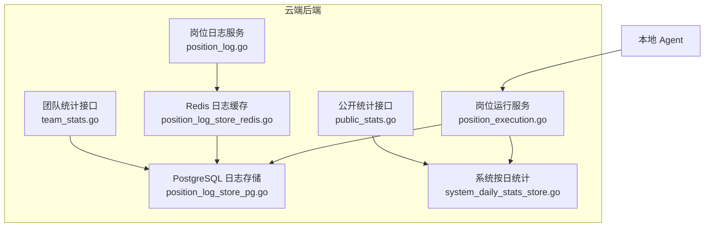
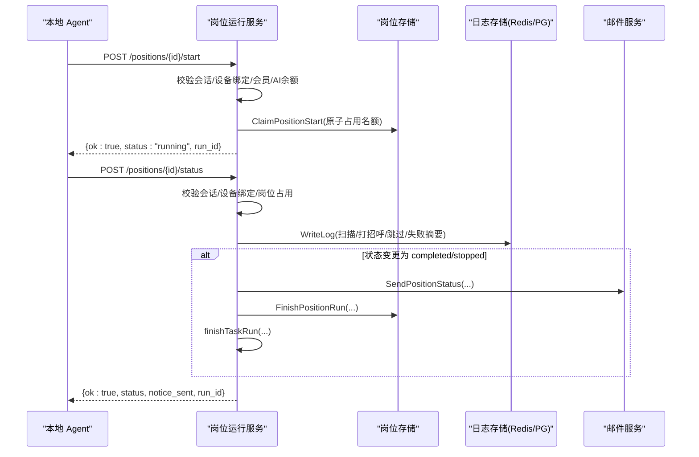
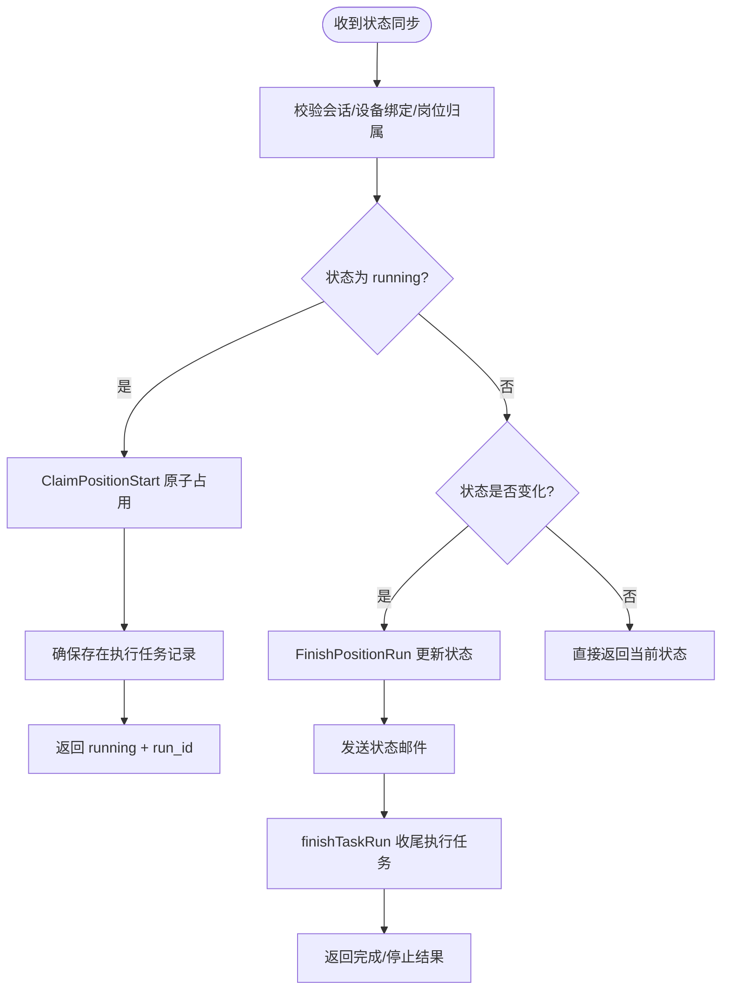
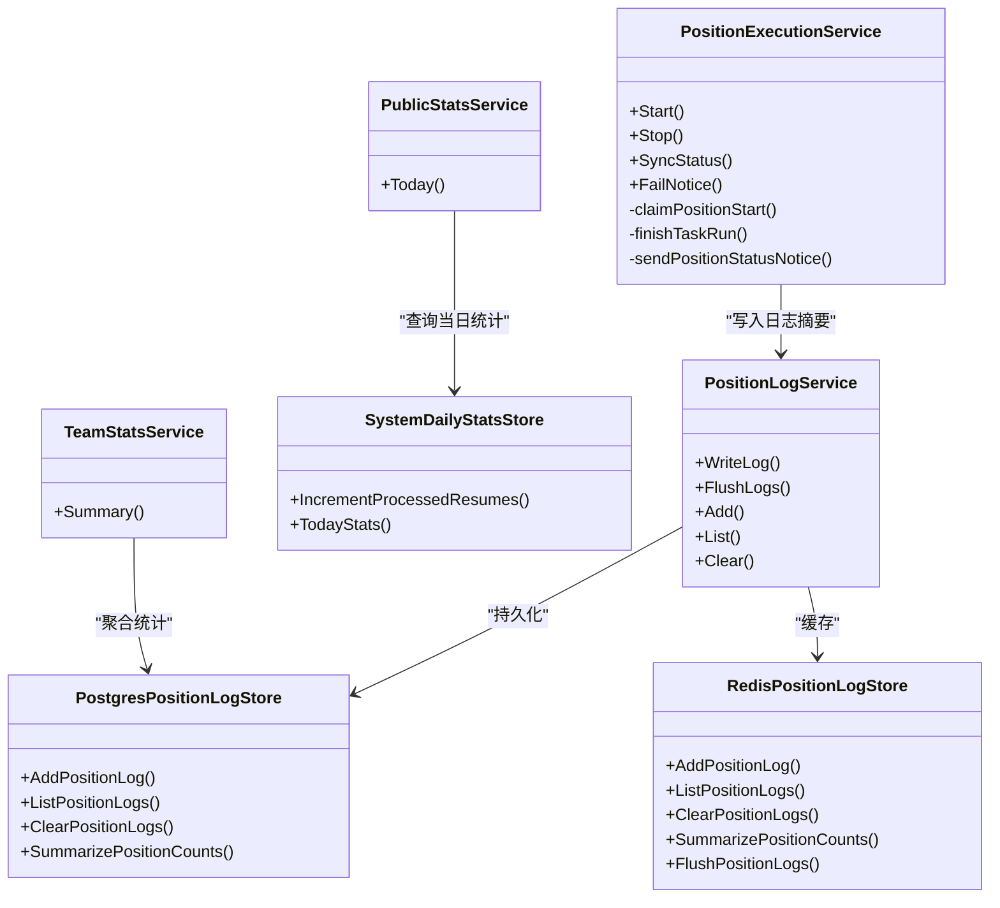

# 岗位统计同步

<cite>
**本文引用的文件**   
- [position_execution.go](file://goodhr5/cloud/backend/internal/httpapi/position_execution.go)
- [system_daily_stats_store.go](file://goodhr5/cloud/backend/internal/httpapi/system_daily_stats_store.go)
- [position_log_store_pg.go](file://goodhr5/cloud/backend/internal/httpapi/position_log_store_pg.go)
- [position_log_store_redis.go](file://goodhr5/cloud/backend/internal/httpapi/position_log_store_redis.go)
- [position_log.go](file://goodhr5/cloud/backend/internal/httpapi/position_log.go)
- [public_stats.go](file://goodhr5/cloud/backend/internal/httpapi/public_stats.go)
- [team_stats.go](file://goodhr5/cloud/backend/internal/httpapi/team_stats.go)
</cite>

## 目录
1. [引言](#引言)
2. [项目结构](#项目结构)
3. [核心组件](#核心组件)
4. [架构总览](#架构总览)
5. [详细组件分析](#详细组件分析)
6. [依赖关系分析](#依赖关系分析)
7. [性能与并发](#性能与并发)
8. [接口规范与数据同步协议](#接口规范与数据同步协议)
9. [异常处理与一致性保障](#异常处理与一致性保障)
10. [监控告警建议](#监控告警建议)
11. [故障排查指南](#故障排查指南)
12. [结论](#结论)

## 引言
本文件面向“岗位统计同步”能力，聚焦以下目标：
- 累计机制：扫描数量、打招呼数量、跳过数量、失败数量的累计来源与合并规则。
- 增量更新策略：Redis 缓存日志与 PostgreSQL 持久化日志的增量读取、合并与落库。
- 数据一致性：云端状态机、执行任务记录、邮件通知与运行收尾的一致性约束。
- 实时性与并发：本地 Agent 上报频率、云端幂等与并发控制、热点聚合查询优化。
- 接口与协议：岗位运行状态同步、失败通知、团队统计、公开统计等 API 契约。
- 可观测性：关键指标、错误码、日志摘要与告警建议。

## 项目结构
岗位统计同步涉及云端后端 HTTP API、存储层（PostgreSQL、Redis）以及本地 Agent 上报流程。核心代码位于 cloud/backend/internal/httpapi 下，按职责拆分为：
- 岗位运行服务：接收本地程序的状态变更、失败通知，维护岗位状态与执行任务记录。
- 岗位日志服务：提供日志写入、分页查询、清空与汇总统计。
- 日志存储实现：PostgreSQL 持久化与 Redis 缓存双写，支持增量合并与批量落库。
- 系统级统计：按日统计与官网公开统计。
- 团队统计：管理员视角的团队维度聚合。

**图表来源**
- [position_execution.go:21-51](file://goodhr5/cloud/backend/internal/httpapi/position_execution.go#L21-L51)
- [position_log.go:13-34](file://goodhr5/cloud/backend/internal/httpapi/position_log.go#L13-L34)
- [position_log_store_pg.go:10-18](file://goodhr5/cloud/backend/internal/httpapi/position_log_store_pg.go#L10-L18)
- [position_log_store_redis.go:16-34](file://goodhr5/cloud/backend/internal/httpapi/position_log_store_redis.go#L16-L34)
- [system_daily_stats_store.go:10-20](file://goodhr5/cloud/backend/internal/httpapi/system_daily_stats_store.go#L10-L20)
- [public_stats.go:6-18](file://goodhr5/cloud/backend/internal/httpapi/public_stats.go#L6-L18)
- [team_stats.go:12-23](file://goodhr5/cloud/backend/internal/httpapi/team_stats.go#L12-L23)

**章节来源**
- [position_execution.go:21-51](file://goodhr5/cloud/backend/internal/httpapi/position_execution.go#L21-L51)
- [position_log.go:13-34](file://goodhr5/cloud/backend/internal/httpapi/position_log.go#L13-L34)
- [position_log_store_pg.go:10-18](file://goodhr5/cloud/backend/internal/httpapi/position_log_store_pg.go#L10-L18)
- [position_log_store_redis.go:16-34](file://goodhr5/cloud/backend/internal/httpapi/position_log_store_redis.go#L16-L34)
- [system_daily_stats_store.go:10-20](file://goodhr5/cloud/backend/internal/httpapi/system_daily_stats_store.go#L10-L20)
- [public_stats.go:6-18](file://goodhr5/cloud/backend/internal/httpapi/public_stats.go#L6-L18)
- [team_stats.go:12-23](file://goodhr5/cloud/backend/internal/httpapi/team_stats.go#L12-L23)

## 核心组件
- 岗位运行服务：负责启动校验、设备绑定、会员与 AI 余额检查、岗位占用、运行中状态同步、完成/停止/失败收尾、执行任务记录与邮件通知。
- 岗位日志服务：对外暴露日志写入、列表、清空；内部封装权限校验、归属校验与参数解析。
- 日志存储层：
  - PostgreSQL 实现：持久化日志、按岗位/用户过滤、时间范围过滤、日志上限清理、岗位统计汇总。
  - Redis 实现：运行期日志缓存、增量读取、过期清理、批量落库、与数据库统计合并。
- 系统按日统计：内存与 PostgreSQL 两种实现，支持按日累加已处理简历数与查询当日统计。
- 公开统计：聚合用户注册、岗位打招呼、Agent 绑定、系统按日统计，供官网展示。
- 团队统计：管理员维度的员工统计聚合，包含岗位运行与候选人相关指标。

**章节来源**
- [position_execution.go:21-51](file://goodhr5/cloud/backend/internal/httpapi/position_execution.go#L21-L51)
- [position_log.go:13-34](file://goodhr5/cloud/backend/internal/httpapi/position_log.go#L13-L34)
- [position_log_store_pg.go:150-197](file://goodhr5/cloud/backend/internal/httpapi/position_log_store_pg.go#L150-L197)
- [position_log_store_redis.go:123-141](file://goodhr5/cloud/backend/internal/httpapi/position_log_store_redis.go#L123-L141)
- [system_daily_stats_store.go:10-20](file://goodhr5/cloud/backend/internal/httpapi/system_daily_stats_store.go#L10-L20)
- [public_stats.go:6-18](file://goodhr5/cloud/backend/internal/httpapi/public_stats.go#L6-L18)
- [team_stats.go:12-23](file://goodhr5/cloud/backend/internal/httpapi/team_stats.go#L12-L23)

## 架构总览
岗位统计同步的关键路径包括：
- 本地 Agent 通过 HTTP 调用云端接口上报岗位运行状态、打招呼计数、跳过计数、失败原因。
- 云端对请求进行会话校验、设备绑定校验、岗位归属校验、会员与 AI 余额校验。
- 云端维护岗位状态机（running/completed/stopped/failed），并创建/收尾执行任务记录。
- 云端将岗位日志摘要写入 Redis 缓存或 PostgreSQL，并在需要时合并统计。
- 云端在状态变化时发送邮件通知，并记录业务流程事件。

**图表来源**
- [position_execution.go:55-96](file://goodhr5/cloud/backend/internal/httpapi/position_execution.go#L55-L96)
- [position_execution.go:170-276](file://goodhr5/cloud/backend/internal/httpapi/position_execution.go#L170-L276)
- [position_log.go:36-45](file://goodhr5/cloud/backend/internal/httpapi/position_log.go#L36-L45)
- [position_log_store_redis.go:36-70](file://goodhr5/cloud/backend/internal/httpapi/position_log_store_redis.go#L36-L70)
- [position_log_store_pg.go:20-67](file://goodhr5/cloud/backend/internal/httpapi/position_log_store_pg.go#L20-L67)

## 详细组件分析

### 岗位运行服务（PositionExecutionService）
职责：
- 启动校验：会话、设备绑定、岗位存在性、会员与 AI 余额、岗位占用冲突。
- 运行中状态同步：补建执行任务记录、回传 run_id、记录业务流程事件。
- 完成/停止/失败收尾：更新岗位状态、发送状态邮件、收尾执行任务记录、记录业务流程事件。
- 失败通知：根据错误信息归类失败原因，必要时将状态改为 stopped。

关键点：
- 原子占用岗位运行名额，避免多设备同时启动同一账号的岗位。
- 对旧版本本地程序兼容：若未先调 Start，则在 SyncStatus 中兜底创建执行任务记录。
- 邮件通知仅在状态发生变化时触发，避免重复通知。
- 执行任务记录创建失败不阻塞岗位启动，仅记录日志。

**图表来源**
- [position_execution.go:170-276](file://goodhr5/cloud/backend/internal/httpapi/position_execution.go#L170-L276)
- [position_execution.go:297-338](file://goodhr5/cloud/backend/internal/httpapi/position_execution.go#L297-L338)
- [position_execution.go:120-134](file://goodhr5/cloud/backend/internal/httpapi/position_execution.go#L120-L134)

**章节来源**
- [position_execution.go:55-96](file://goodhr5/cloud/backend/internal/httpapi/position_execution.go#L55-L96)
- [position_execution.go:170-276](file://goodhr5/cloud/backend/internal/httpapi/position_execution.go#L170-L276)
- [position_execution.go:279-338](file://goodhr5/cloud/backend/internal/httpapi/position_execution.go#L279-L338)
- [position_execution.go:374-435](file://goodhr5/cloud/backend/internal/httpapi/position_execution.go#L374-L435)

### 岗位日志服务（PositionLogService）
职责：
- 写入日志摘要：校验岗位归属与消息内容，调用存储层写入。
- 列出日志摘要：分页、时间范围过滤、倒序输出。
- 清空日志：同时清理 Redis 缓存与持久化数据库。
- 封装租户与管理员权限：统一获取 tenantID 与 isAdmin。

关键点：
- 日志摘要不包含候选人详情，详情仍保存在本地 Agent。
- 列表接口默认限制 100，最大 300，防止大响应。
- 支持 since/before 增量拉取，便于前端滚动加载。

**章节来源**
- [position_log.go:36-45](file://goodhr5/cloud/backend/internal/httpapi/position_log.go#L36-L45)
- [position_log.go:70-121](file://goodhr5/cloud/backend/internal/httpapi/position_log.go#L70-L121)
- [position_log.go:123-164](file://goodhr5/cloud/backend/internal/httpapi/position_log.go#L123-L164)
- [position_log.go:174-203](file://goodhr5/cloud/backend/internal/httpapi/position_log.go#L174-L203)
- [position_log.go:205-240](file://goodhr5/cloud/backend/internal/httpapi/position_log.go#L205-L240)
- [position_log.go:272-282](file://goodhr5/cloud/backend/internal/httpapi/position_log.go#L272-L282)

### PostgreSQL 日志存储（PostgresPositionLogStore）
职责：
- 新增日志：带超时上下文、自动设置级别与时间、单岗位日志上限清理。
- 列出日志：按用户/岗位过滤、时间范围过滤、LIMIT 分页。
- 清空日志：按用户/岗位或管理员全量删除。
- 汇总统计：从 position_logs 与 positions/users 关联表聚合扫描/打招呼/跳过/失败数量。

关键点：
- SummarizePositionCounts 基于日志消息分类统计，适合离线或后台聚合。
- trimPositionLogs 保证单岗位日志不超过上限，避免无限增长。

**章节来源**
- [position_log_store_pg.go:20-67](file://goodhr5/cloud/backend/internal/httpapi/position_log_store_pg.go#L20-L67)
- [position_log_store_pg.go:70-124](file://goodhr5/cloud/backend/internal/httpapi/position_log_store_pg.go#L70-L124)
- [position_log_store_pg.go:126-148](file://goodhr5/cloud/backend/internal/httpapi/position_log_store_pg.go#L126-L148)
- [position_log_store_pg.go:150-197](file://goodhr5/cloud/backend/internal/httpapi/position_log_store_pg.go#L150-L197)
- [position_log_store_pg.go:199-235](file://goodhr5/cloud/backend/internal/httpapi/position_log_store_pg.go#L199-L235)

### Redis 日志缓存（RedisPositionLogStore）
职责：
- 写入缓存：限制单岗位最多固定条数，设置 TTL，避免长期堆积。
- 列出日志：优先读 Redis，缺失则回退到 PG；支持增量合并。
- 清空日志：同时删除 Redis key 与 PG 数据。
- 汇总统计：扫描 position_logs:* 键，合并缓存日志统计到数据库统计结果。
- 批量落库：FlushPositionLogs 将缓存日志排序后逐条写入 PG，再清空缓存。

关键点：
- 增量读取：当命中缓存时，使用 oldest 时间作为 before 参数继续拉取 PG 历史。
- 统计合并：addPositionLogSummary 将缓存日志的分类统计累加到 result map。

**章节来源**
- [position_log_store_redis.go:36-70](file://goodhr5/cloud/backend/internal/httpapi/position_log_store_redis.go#L36-L70)
- [position_log_store_redis.go:72-110](file://goodhr5/cloud/backend/internal/httpapi/position_log_store_redis.go#L72-L110)
- [position_log_store_redis.go:112-121](file://goodhr5/cloud/backend/internal/httpapi/position_log_store_redis.go#L112-L121)
- [position_log_store_redis.go:123-141](file://goodhr5/cloud/backend/internal/httpapi/position_log_store_redis.go#L123-L141)
- [position_log_store_redis.go:143-165](file://goodhr5/cloud/backend/internal/httpapi/position_log_store_redis.go#L143-L165)
- [position_log_store_redis.go:224-244](file://goodhr5/cloud/backend/internal/httpapi/position_log_store_redis.go#L224-L244)

### 系统按日统计（SystemDailyStatsStore）
职责：
- 内存实现：用于测试与本地开发，按日期字符串作为 key 累加已处理简历数。
- PostgreSQL 实现：INSERT ... ON CONFLICT DO UPDATE 原子累加，查询当日统计。

关键点：
- IncrementProcessedResumes 忽略非正数增量，避免负值污染。
- TodayStats 在无行时返回空统计，stat_date 为当天。

**章节来源**
- [system_daily_stats_store.go:10-20](file://goodhr5/cloud/backend/internal/httpapi/system_daily_stats_store.go#L10-L20)
- [system_daily_stats_store.go:36-48](file://goodhr5/cloud/backend/internal/httpapi/system_daily_stats_store.go#L36-L48)
- [system_daily_stats_store.go:68-85](file://goodhr5/cloud/backend/internal/httpapi/system_daily_stats_store.go#L68-L85)
- [system_daily_stats_store.go:87-102](file://goodhr5/cloud/backend/internal/httpapi/system_daily_stats_store.go#L87-L102)

### 公开统计（PublicStatsService）
职责：
- 聚合今日打招呼总数、系统按日统计的已处理简历数、用户注册数、Agent 绑定数。
- 对外提供官网首页展示所需统计数据。

关键点：
- 各子模块失败不影响整体返回，尽量返回可用部分。
- 数字字段同时返回 label 字符串，便于前端格式化显示。

**章节来源**
- [public_stats.go:6-18](file://goodhr5/cloud/backend/internal/httpapi/public_stats.go#L6-L18)
- [public_stats.go:20-69](file://goodhr5/cloud/backend/internal/httpapi/public_stats.go#L20-L69)

### 团队统计（TeamStatsService）
职责：
- 管理员视角的员工统计聚合，包含岗位运行与候选人相关指标。
- 支持 today/week/month/last_month/custom 周期解析。

关键点：
- 通过 SQL LEFT JOIN 聚合 positions 与 candidate_profiles/candidate_engagements。
- totals 汇总所有成员指标，members 按打招呼数、简历数、邮箱排序。

**章节来源**
- [team_stats.go:12-23](file://goodhr5/cloud/backend/internal/httpapi/team_stats.go#L12-L23)
- [team_stats.go:25-66](file://goodhr5/cloud/backend/internal/httpapi/team_stats.go#L25-L66)
- [team_stats.go:68-133](file://goodhr5/cloud/backend/internal/httpapi/team_stats.go#L68-L133)
- [team_stats.go:135-166](file://goodhr5/cloud/backend/internal/httpapi/team_stats.go#L135-L166)
- [team_stats.go:168-203](file://goodhr5/cloud/backend/internal/httpapi/team_stats.go#L168-L203)

## 依赖关系分析
- PositionExecutionService 依赖：
  - AuthService：会话校验。
  - PositionStore：岗位读写、原子占用、状态更新。
  - PositionLogService：写入岗位日志摘要。
  - TenantStore：租户与管理员身份。
  - PlatformAccountStore：平台账号（用于归属校验）。
  - CandidateStore/CandidateScreeningStore：候选人相关（与统计间接相关）。
  - SubscriptionStore/SystemConfigStore/AIWalletStore：会员与 AI 余额校验。
  - Mailer：状态邮件通知。
  - SystemDailyStatsStore：系统按日统计（公开统计使用）。
  - UserFlowStore：业务流程事件记录。
  - AgentStore：设备绑定校验。
  - TaskRunStore：执行任务记录。

- PositionLogService 依赖：
  - AuthService：会话校验。
  - PositionStore：岗位归属校验。
  - PositionLogStore：日志读写。
  - TenantStore：租户与管理员身份。

- 存储层依赖：
  - PostgresPositionLogStore：PostgreSQL 连接。
  - RedisPositionLogStore：Redis 客户端与持久化存储。

**图表来源**
- [position_execution.go:21-51](file://goodhr5/cloud/backend/internal/httpapi/position_execution.go#L21-L51)
- [position_log.go:13-34](file://goodhr5/cloud/backend/internal/httpapi/position_log.go#L13-L34)
- [position_log_store_pg.go:10-18](file://goodhr5/cloud/backend/internal/httpapi/position_log_store_pg.go#L10-L18)
- [position_log_store_redis.go:16-34](file://goodhr5/cloud/backend/internal/httpapi/position_log_store_redis.go#L16-L34)
- [system_daily_stats_store.go:10-20](file://goodhr5/cloud/backend/internal/httpapi/system_daily_stats_store.go#L10-L20)
- [public_stats.go:6-18](file://goodhr5/cloud/backend/internal/httpapi/public_stats.go#L6-L18)
- [team_stats.go:12-23](file://goodhr5/cloud/backend/internal/httpapi/team_stats.go#L12-L23)

**章节来源**
- [position_execution.go:21-51](file://goodhr5/cloud/backend/internal/httpapi/position_execution.go#L21-L51)
- [position_log.go:13-34](file://goodhr5/cloud/backend/internal/httpapi/position_log.go#L13-L34)
- [position_log_store_pg.go:10-18](file://goodhr5/cloud/backend/internal/httpapi/position_log_store_pg.go#L10-L18)
- [position_log_store_redis.go:16-34](file://goodhr5/cloud/backend/internal/httpapi/position_log_store_redis.go#L16-L34)
- [system_daily_stats_store.go:10-20](file://goodhr5/cloud/backend/internal/httpapi/system_daily_stats_store.go#L10-L20)
- [public_stats.go:6-18](file://goodhr5/cloud/backend/internal/httpapi/public_stats.go#L6-L18)
- [team_stats.go:12-23](file://goodhr5/cloud/backend/internal/httpapi/team_stats.go#L12-L23)

## 性能与并发
- 增量更新策略：
  - Redis 缓存优先：ListPositionLogs 优先读取 Redis，命中则增量拉取 PG 历史，减少冷数据 IO。
  - 批量落库：FlushPositionLogs 将缓存日志排序后逐条写入 PG，降低频繁小写开销。
  - 统计合并：SummarizePositionCounts 先读 PG 统计，再扫描 Redis keys 合并缓存统计，保证实时性与准确性。

- 并发访问控制：
  - 岗位启动原子占用：ClaimPositionStart 防止同一账号多个岗位同时运行。
  - 设备绑定校验：verifyActiveDevice 确保请求来自稳定绑定的设备。
  - 会话校验：所有接口均通过 AuthService.SessionFromRequest 校验登录态。

- 性能优化方案：
  - 日志上限清理：trimPositionLogs 限制单岗位日志数量，避免无限增长。
  - 分页与限制：ListPositionLogs 默认 100，最大 300，防止大响应。
  - 超时上下文：所有 DB/Redis 操作使用 context.WithTimeout，避免长尾请求。
  - 只读聚合：TeamStatsService 使用单次 SQL 聚合，减少多次往返。

**章节来源**
- [position_log_store_redis.go:72-110](file://goodhr5/cloud/backend/internal/httpapi/position_log_store_redis.go#L72-L110)
- [position_log_store_redis.go:143-165](file://goodhr5/cloud/backend/internal/httpapi/position_log_store_redis.go#L143-L165)
- [position_log_store_redis.go:123-141](file://goodhr5/cloud/backend/internal/httpapi/position_log_store_redis.go#L123-L141)
- [position_execution.go:279-338](file://goodhr5/cloud/backend/internal/httpapi/position_execution.go#L279-L338)
- [position_log_store_pg.go:199-235](file://goodhr5/cloud/backend/internal/httpapi/position_log_store_pg.go#L199-L235)
- [position_log.go:232-240](file://goodhr5/cloud/backend/internal/httpapi/position_log.go#L232-L240)
- [team_stats.go:68-133](file://goodhr5/cloud/backend/internal/httpapi/team_stats.go#L68-L133)

## 接口规范与数据同步协议

### 岗位运行状态同步
- 启动许可
  - 方法：POST
  - 路径：/api/positions/{positionId}/start
  - 请求体：task_type、machine_id
  - 响应：ok、status、run_id
  - 错误码：METHOD_NOT_ALLOWED、SESSION_EXPIRED、INVALID_REQUEST、POSITION_NOT_FOUND、POSITION_LOAD_FAILED、DEVICE_BINDING_REQUIRED、SUBSCRIPTION_CHECK_FAILED、AUTO_REPLY_MAX_REQUIRED、AI_BALANCE_UNAVAILABLE、AI_BALANCE_INSUFFICIENT、POSITION_TASK_CONFLICT、POSITION_START_FAILED

- 运行中状态同步
  - 方法：POST
  - 路径：/api/positions/{positionId}/status
  - 请求体：status、task_type、run_id、run_greeted_count、run_skipped_count、machine_id
  - 响应：ok、status、notice_sent、run_id
  - 错误码：METHOD_NOT_ALLOWED、SESSION_EXPIRED、INVALID_PAYLOAD、UNSUPPORTED_STATUS、POSITION_NOT_FOUND、FAILED_TO_LOAD_POSITION、DEVICE_BINDING_REQUIRED、POSITION_TASK_CONFLICT、FAILED_TO_UPDATE_POSITION_STATUS

- 停止请求
  - 方法：POST
  - 路径：/api/positions/{positionId}/stop
  - 响应：ok、status

- 失败通知
  - 方法：POST
  - 路径：/api/positions/{positionId}/fail
  - 请求体：position_id、error_message、run_greeted_count、run_skipped_count
  - 响应：ok、status

**章节来源**
- [position_execution.go:55-96](file://goodhr5/cloud/backend/internal/httpapi/position_execution.go#L55-L96)
- [position_execution.go:170-276](file://goodhr5/cloud/backend/internal/httpapi/position_execution.go#L170-L276)
- [position_execution.go:136-167](file://goodhr5/cloud/backend/internal/httpapi/position_execution.go#L136-L167)
- [position_execution.go:374-435](file://goodhr5/cloud/backend/internal/httpapi/position_execution.go#L374-L435)

### 岗位日志接口
- 写入日志
  - 方法：POST
  - 路径：/api/positions/{positionId}/logs
  - 请求体：level、message
  - 响应：ok、log

- 列出日志
  - 方法：GET
  - 路径：/api/positions/{positionId}/logs?since=&before=&limit=
  - 响应：ok、logs、has_more

- 清空日志
  - 方法：DELETE
  - 路径：/api/positions/{positionId}/logs
  - 响应：ok

**章节来源**
- [position_log.go:70-121](file://goodhr5/cloud/backend/internal/httpapi/position_log.go#L70-L121)
- [position_log.go:123-164](file://goodhr5/cloud/backend/internal/httpapi/position_log.go#L123-L164)
- [position_log.go:174-203](file://goodhr5/cloud/backend/internal/httpapi/position_log.go#L174-L203)
- [position_log.go:205-240](file://goodhr5/cloud/backend/internal/httpapi/position_log.go#L205-L240)

### 公开统计接口
- 今日统计
  - 方法：GET
  - 路径：/api/public/stats/today
  - 响应：ok、processed_resume_count、today_greeted_count、today_registered_count、agent_binding_count、label 字段

**章节来源**
- [public_stats.go:20-69](file://goodhr5/cloud/backend/internal/httpapi/public_stats.go#L20-L69)

### 团队统计接口
- 团队统计
  - 方法：GET
  - 路径：/api/admin/team-stats?period=&start_date=&end_date=
  - 响应：ok、period、start_date、end_date、totals、members

**章节来源**
- [team_stats.go:25-66](file://goodhr5/cloud/backend/internal/httpapi/team_stats.go#L25-L66)
- [team_stats.go:135-166](file://goodhr5/cloud/backend/internal/httpapi/team_stats.go#L135-L166)

## 异常处理与一致性保障
- 会话与权限：
  - 所有接口通过 AuthService.SessionFromRequest 校验，失败返回未授权。
  - 岗位日志写入前校验岗位归属，避免跨用户写入。

- 设备绑定与岗位占用：
  - verifyActiveDevice 校验设备绑定，防止未绑定设备启动。
  - claimPositionStart 原子占用岗位运行名额，冲突返回明确错误码。

- 状态机与通知：
  - 仅在状态变化时发送邮件通知，避免重复。
  - completed 状态在邮件发送成功后才写入，重复同步可直接确认已发送。

- 执行任务记录：
  - startTaskRun 创建失败仅记录日志，不阻塞岗位启动。
  - finishTaskRun 在 completed/stopped/failed 时收尾，传入 skipped/failed 计数。

- 日志与统计一致性：
  - Redis 缓存与 PG 持久化双写，SummarizePositionCounts 合并两者统计。
  - FlushPositionLogs 将缓存日志排序后逐条写入 PG，确保顺序一致。

**章节来源**
- [position_execution.go:279-338](file://goodhr5/cloud/backend/internal/httpapi/position_execution.go#L279-L338)
- [position_execution.go:236-276](file://goodhr5/cloud/backend/internal/httpapi/position_execution.go#L236-L276)
- [position_execution.go:120-134](file://goodhr5/cloud/backend/internal/httpapi/position_execution.go#L120-L134)
- [position_log_store_redis.go:123-141](file://goodhr5/cloud/backend/internal/httpapi/position_log_store_redis.go#L123-L141)
- [position_log_store_redis.go:143-165](file://goodhr5/cloud/backend/internal/httpapi/position_log_store_redis.go#L143-L165)

## 监控告警建议
- 关键指标：
  - 岗位启动成功率、失败率（按错误码分组）。
  - 状态同步延迟（本地上报到云端落库时间）。
  - Redis 缓存命中率、TTL 过期率。
  - PG 写入 QPS、慢查询比例。
  - 邮件发送成功率、失败重试次数。
  - 执行任务记录创建/收尾成功率。

- 告警阈值：
  - 启动失败率超过 5% 持续 5 分钟。
  - 状态同步 P95 延迟超过 2 秒。
  - Redis 缓存命中率低于 80%。
  - PG 慢查询比例超过 2%。
  - 邮件发送失败率超过 1%。

- 日志采集：
  - 收集岗位运行服务的错误日志与业务日志。
  - 收集存储层的超时与错误日志。
  - 收集邮件服务的发送结果与错误信息。

[本节为通用指导，不直接分析具体文件]

## 故障排查指南
- 启动失败：
  - 检查会话是否有效、设备是否绑定、岗位是否存在、会员与 AI 余额是否满足。
  - 查看错误码：DEVICE_BINDING_REQUIRED、SUBSCRIPTION_REQUIRED、AI_BALANCE_INSUFFICIENT、POSITION_TASK_CONFLICT。

- 状态同步异常：
  - 检查 status 是否为 supported 值（completed/stopped/running）。
  - 核对 run_greeted_count/run_skipped_count 是否为非负数。
  - 查看邮件发送是否成功，失败时检查 mailer 配置。

- 统计不一致：
  - 检查 Redis 缓存是否过期或被清理。
  - 确认 FlushPositionLogs 是否执行成功。
  - 核对 SummarizePositionCounts 是否合并了缓存与数据库统计。

- 团队统计为空：
  - 确认 period/start_date/end_date 是否正确。
  - 检查 SQL 聚合是否返回数据，确认租户管理员权限。

**章节来源**
- [position_execution.go:55-96](file://goodhr5/cloud/backend/internal/httpapi/position_execution.go#L55-L96)
- [position_execution.go:170-276](file://goodhr5/cloud/backend/internal/httpapi/position_execution.go#L170-L276)
- [position_log_store_redis.go:123-141](file://goodhr5/cloud/backend/internal/httpapi/position_log_store_redis.go#L123-L141)
- [team_stats.go:25-66](file://goodhr5/cloud/backend/internal/httpapi/team_stats.go#L25-L66)

## 结论
岗位统计同步通过云端岗位运行服务与日志存储层协同，实现了可靠的累计机制、增量更新策略与数据一致性保障。本地 Agent 上报状态与计数，云端进行会话与权限校验、岗位占用控制、状态机管理与邮件通知，并通过 Redis 与 PostgreSQL 双写保证实时性与持久化。团队统计与公开统计进一步提供了多维度的运营视图。建议在部署中完善监控告警与日志采集，确保系统在大规模并发场景下的稳定性与可观测性。