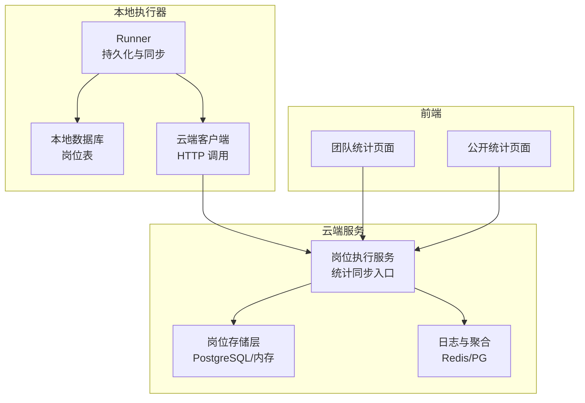
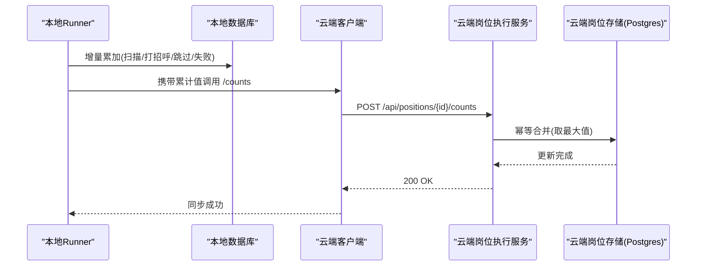
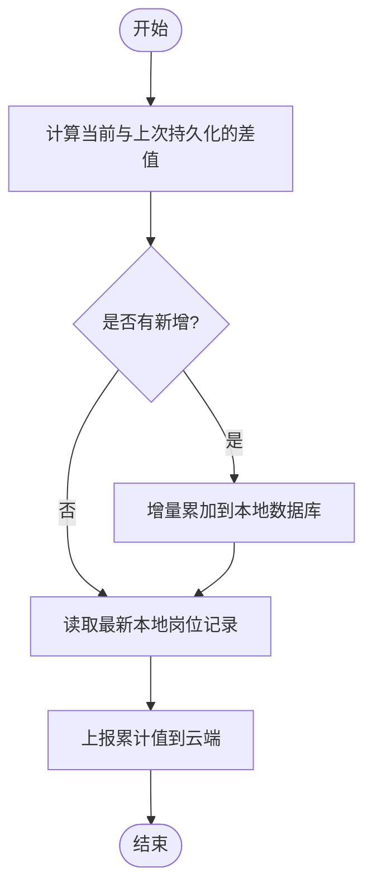
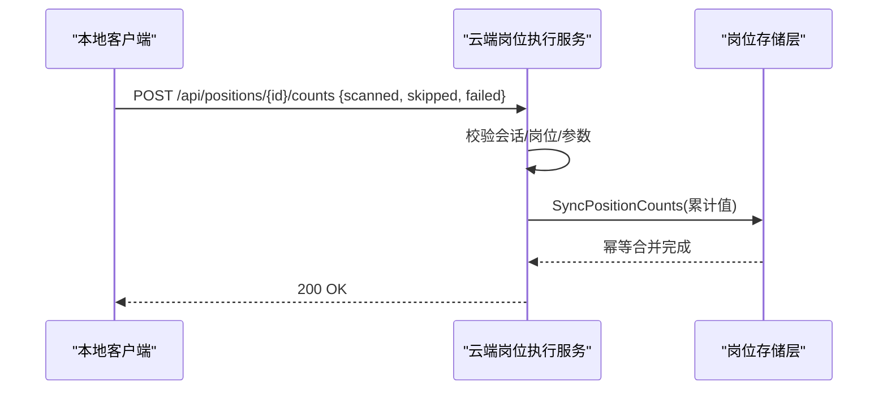
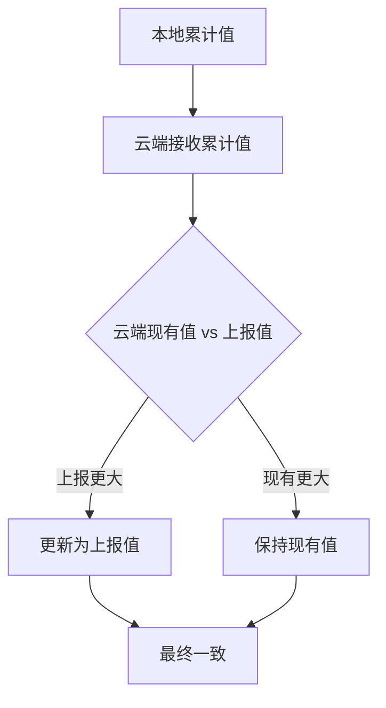
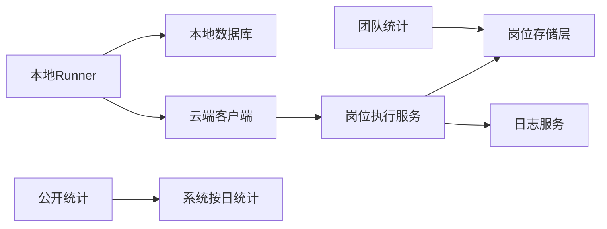

# 岗位统计同步

<cite>
**本文引用的文件**
- [persistence.go](file://goodhr5/local-agent-go/internal/positionrunner/persistence.go)
- [scan.go](file://goodhr5/local-agent-go/internal/positionrunner/scan.go)
- [client.go](file://goodhr5/local-agent-go/internal/cloudapi/client.go)
- [db.go](file://goodhr5/local-agent-go/internal/localdb/db.go)
- [positions_test.go](file://goodhr5/local-agent-go/internal/localdb/positions_test.go)
- [runner_test.go](file://goodhr5/local-agent-go/internal/positionrunner/runner_test.go)
- [position_execution.go](file://goodhr5/cloud/backend/internal/httpapi/position_execution.go)
- [local_candidate_ingest.go](file://goodhr5/cloud/backend/internal/httpapi/local_candidate_ingest.go)
- [position_store_pg.go](file://goodhr5/cloud/backend/internal/httpapi/position_store_pg.go)
- [position_store.go](file://goodhr5/cloud/backend/internal/httpapi/position_store.go)
- [public_stats.go](file://goodhr5/cloud/backend/internal/httpapi/public_stats.go)
- [team_stats.go](file://goodhr5/cloud/backend/internal/httpapi/team_stats.go)
- [system_daily_stats_store.go](file://goodhr5/cloud/backend/internal/httpapi/system_daily_stats_store.go)
- [page.tsx](file://goodhr5/cloud/frontend-next/app/admin/team-stats/page.tsx)
</cite>

## 目录
1. [简介](#简介)
2. [项目结构](#项目结构)
3. [核心组件](#核心组件)
4. [架构总览](#架构总览)
5. [详细组件分析](#详细组件分析)
6. [依赖关系分析](#依赖关系分析)
7. [性能与并发](#性能与并发)
8. [故障排查](#故障排查)
9. [结论](#结论)
10. [附录：接口规范与示例](#附录接口规范与示例)

## 简介
本文件面向“岗位统计同步”能力，覆盖扫描数量、跳过数量、失败数量的累计机制、增量更新策略、数据一致性保证、实时性要求、并发访问控制、性能优化方案，并给出统计接口规范、数据同步协议、异常处理机制、流程图、API调用示例与监控告警建议，帮助开发者实现可靠的岗位运行状态同步。

## 项目结构
- 本地执行器（Local Agent）在岗位扫描过程中维护本次批次的统计快照，按增量写入本地数据库，并将最新累计值上报云端。
- 云端服务提供岗位统计同步接口，对累计值进行幂等合并，并对外暴露团队统计、公开统计等查询接口。
- 前端通过管理后台和公共页面消费统计数据。

图表来源
- [persistence.go:28-70](file://goodhr5/local-agent-go/internal/positionrunner/persistence.go#L28-L70)
- [client.go:275-290](file://goodhr5/local-agent-go/internal/cloudapi/client.go#L275-L290)
- [position_execution.go:187-221](file://goodhr5/cloud/backend/internal/httpapi/position_execution.go#L187-L221)
- [position_store_pg.go:411-457](file://goodhr5/cloud/backend/internal/httpapi/position_store_pg.go#L411-L457)
- [team_stats.go:25-66](file://goodhr5/cloud/backend/internal/httpapi/team_stats.go#L25-L66)
- [public_stats.go:20-69](file://goodhr5/cloud/backend/internal/httpapi/public_stats.go#L20-L69)

章节来源
- [persistence.go:28-70](file://goodhr5/local-agent-go/internal/positionrunner/persistence.go#L28-L70)
- [client.go:275-290](file://goodhr5/local-agent-go/internal/cloudapi/client.go#L275-L290)
- [position_execution.go:187-221](file://goodhr5/cloud/backend/internal/httpapi/position_execution.go#L187-L221)
- [position_store_pg.go:411-457](file://goodhr5/cloud/backend/internal/httpapi/position_store_pg.go#L411-L457)
- [team_stats.go:25-66](file://goodhr5/cloud/backend/internal/httpapi/team_stats.go#L25-L66)
- [public_stats.go:20-69](file://goodhr5/cloud/backend/internal/httpapi/public_stats.go#L20-L69)

## 核心组件
- 本地 Runner 统计持久化与同步：计算增量、落库、上报云端累计值。
- 云端统计同步接口：校验参数、幂等合并到岗位表、返回成功。
- 云端团队/公开统计：聚合岗位与候选人指标，供管理后台与官网展示。
- 系统按日统计：累计已处理简历数，用于官网展示。

章节来源
- [persistence.go:28-70](file://goodhr5/local-agent-go/internal/positionrunner/persistence.go#L28-L70)
- [local_candidate_ingest.go:187-221](file://goodhr5/cloud/backend/internal/httpapi/local_candidate_ingest.go#L187-L221)
- [position_store_pg.go:411-457](file://goodhr5/cloud/backend/internal/httpapi/position_store_pg.go#L411-L457)
- [team_stats.go:25-66](file://goodhr5/cloud/backend/internal/httpapi/team_stats.go#L25-L66)
- [public_stats.go:20-69](file://goodhr5/cloud/backend/internal/httpapi/public_stats.go#L20-L69)
- [system_daily_stats_store.go:68-85](file://goodhr5/cloud/backend/internal/httpapi/system_daily_stats_store.go#L68-L85)

## 架构总览
本地执行器在扫描过程中持续累积“扫描、打招呼、跳过、失败”四类计数，采用“增量落库 + 累计上报”的双写模式：
- 增量落库：仅写入本次新增的差值，避免重复记账。
- 累计上报：将本地最新的累计值上报云端，云端以“取最大值”的方式幂等合并，确保多实例或重试场景下的最终一致。

图表来源
- [persistence.go:49-70](file://goodhr5/local-agent-go/internal/positionrunner/persistence.go#L49-L70)
- [client.go:275-290](file://goodhr5/local-agent-go/internal/cloudapi/client.go#L275-L290)
- [local_candidate_ingest.go:187-221](file://goodhr5/cloud/backend/internal/httpapi/local_candidate_ingest.go#L187-L221)
- [position_store_pg.go:435-457](file://goodhr5/cloud/backend/internal/httpapi/position_store_pg.go#L435-L457)

## 详细组件分析

### 本地 Runner 统计持久化与同步
- 增量计算：基于当前批次结果与上次已持久化的结果计算差值，仅当存在新增时才落库。
- 本地落库：使用增量接口累加扫描、打招呼、跳过、失败计数。
- 云端同步：每次落库后，读取最新本地岗位记录，将其累计值通过云端客户端上报。
- 兜底刷新：即使扫描被停止或异常，也会在退出前尝试保存一次已完成统计。

图表来源
- [persistence.go:49-70](file://goodhr5/local-agent-go/internal/positionrunner/persistence.go#L49-L70)
- [scan.go:70-89](file://goodhr5/local-agent-go/internal/positionrunner/scan.go#L70-L89)

章节来源
- [persistence.go:49-70](file://goodhr5/local-agent-go/internal/positionrunner/persistence.go#L49-L70)
- [scan.go:70-89](file://goodhr5/local-agent-go/internal/positionrunner/scan.go#L70-L89)
- [runner_test.go:73-109](file://goodhr5/local-agent-go/internal/positionrunner/runner_test.go#L73-L109)

### 云端统计同步接口
- 路径与方法：POST /api/positions/{positionID}/counts
- 鉴权：需要有效会话（Bearer Token）。
- 请求体字段：scanned_count、skipped_count、failed_count（均为非负整数）。
- 业务逻辑：校验岗位归属与权限，校验数值非负，调用存储层幂等合并。
- 响应：成功返回 200；未找到岗位返回 404；参数错误返回 400；其他错误返回 500。

图表来源
- [local_candidate_ingest.go:187-221](file://goodhr5/cloud/backend/internal/httpapi/local_candidate_ingest.go#L187-L221)
- [position_store_pg.go:435-457](file://goodhr5/cloud/backend/internal/httpapi/position_store_pg.go#L435-L457)

章节来源
- [local_candidate_ingest.go:187-221](file://goodhr5/cloud/backend/internal/httpapi/local_candidate_ingest.go#L187-L221)
- [position_store_pg.go:435-457](file://goodhr5/cloud/backend/internal/httpapi/position_store_pg.go#L435-L457)

### 增量更新策略与数据一致性
- 本地增量：delta = current - persisted，仅写入新增部分，避免重复记账。
- 云端幂等：云端使用“GREATEST(现有值, 上报值)”合并，确保多次上报或乱序不会导致回退。
- 历史修复：针对旧版语义不一致的累计值，提供一次性迁移补偿，将跳过与失败计入扫描总数。

图表来源
- [position_store_pg.go:435-457](file://goodhr5/cloud/backend/internal/httpapi/position_store_pg.go#L435-L457)
- [db.go:210-232](file://goodhr5/local-agent-go/internal/localdb/db.go#L210-L232)
- [positions_test.go:91-136](file://goodhr5/local-agent-go/internal/localdb/positions_test.go#L91-L136)

章节来源
- [position_store_pg.go:435-457](file://goodhr5/cloud/backend/internal/httpapi/position_store_pg.go#L435-L457)
- [db.go:210-232](file://goodhr5/local-agent-go/internal/localdb/db.go#L210-L232)
- [positions_test.go:91-136](file://goodhr5/local-agent-go/internal/localdb/positions_test.go#L91-L136)

### 团队统计与公开统计
- 团队统计：管理员可查询指定时间范围内员工维度的岗位与候选人指标汇总。
- 公开统计：官网首页展示今日打招呼总数、已处理简历数、注册人数、Agent绑定数等。
- 系统按日统计：独立表累计当日已处理简历数，支持并发追加与查询。

章节来源
- [team_stats.go:25-66](file://goodhr5/cloud/backend/internal/httpapi/team_stats.go#L25-L66)
- [team_stats.go:68-133](file://goodhr5/cloud/backend/internal/httpapi/team_stats.go#L68-L133)
- [public_stats.go:20-69](file://goodhr5/cloud/backend/internal/httpapi/public_stats.go#L20-L69)
- [system_daily_stats_store.go:68-85](file://goodhr5/cloud/backend/internal/httpapi/system_daily_stats_store.go#L68-L85)
- [page.tsx:39-59](file://goodhr5/cloud/frontend-next/app/admin/team-stats/page.tsx#L39-L59)

## 依赖关系分析
- 本地 Runner 依赖本地数据库与云端客户端。
- 云端岗位执行服务依赖认证、岗位存储、日志与邮件通知等。
- 团队/公开统计依赖岗位存储与系统按日统计存储。

图表来源
- [persistence.go:28-70](file://goodhr5/local-agent-go/internal/positionrunner/persistence.go#L28-L70)
- [client.go:275-290](file://goodhr5/local-agent-go/internal/cloudapi/client.go#L275-L290)
- [position_execution.go:21-46](file://goodhr5/cloud/backend/internal/httpapi/position_execution.go#L21-L46)
- [team_stats.go:12-23](file://goodhr5/cloud/backend/internal/httpapi/team_stats.go#L12-L23)
- [public_stats.go:6-18](file://goodhr5/cloud/backend/internal/httpapi/public_stats.go#L6-L18)

章节来源
- [persistence.go:28-70](file://goodhr5/local-agent-go/internal/positionrunner/persistence.go#L28-L70)
- [client.go:275-290](file://goodhr5/local-agent-go/internal/cloudapi/client.go#L275-L290)
- [position_execution.go:21-46](file://goodhr5/cloud/backend/internal/httpapi/position_execution.go#L21-L46)
- [team_stats.go:12-23](file://goodhr5/cloud/backend/internal/httpapi/team_stats.go#L12-L23)
- [public_stats.go:6-18](file://goodhr5/cloud/backend/internal/httpapi/public_stats.go#L6-L18)

## 性能与并发
- 增量写入减少数据库压力，避免全量覆盖带来的竞争。
- 云端幂等合并降低重试与乱序影响，提升吞吐与稳定性。
- 团队统计与公开统计查询设置超时，防止慢查询阻塞。
- 日志缓存（Redis）与持久化（PG）结合，提高高频日志写入性能。
- 建议：
  - 合理设置统计上报频率，避免过于频繁的网络开销。
  - 对高并发场景，关注数据库连接池与索引（如岗位表 updated_at、日期字段）。
  - 对团队统计大表查询，考虑分页与时间范围限制。

[本节为通用指导，不直接分析具体文件]

## 故障排查
- 统计不同步：检查本地 Runner 是否成功增量落库与上报；查看云端接口是否返回 200。
- 累计值回退：确认云端幂等合并逻辑生效；检查是否存在并发写入导致顺序问题。
- 历史数据不一致：执行一次性迁移补偿，将跳过与失败计入扫描总数。
- 团队统计为空：确认时间范围与租户权限；检查数据库连接与查询超时。
- 公开统计异常：检查系统按日统计表是否写入成功；确认各子模块统计接口可用。

章节来源
- [persistence.go:49-70](file://goodhr5/local-agent-go/internal/positionrunner/persistence.go#L49-L70)
- [local_candidate_ingest.go:187-221](file://goodhr5/cloud/backend/internal/httpapi/local_candidate_ingest.go#L187-L221)
- [db.go:210-232](file://goodhr5/local-agent-go/internal/localdb/db.go#L210-L232)
- [team_stats.go:25-66](file://goodhr5/cloud/backend/internal/httpapi/team_stats.go#L25-L66)
- [public_stats.go:20-69](file://goodhr5/cloud/backend/internal/httpapi/public_stats.go#L20-L69)

## 结论
本方案通过“增量落库 + 累计上报 + 云端幂等合并”的组合，实现了岗位统计的高可靠同步。配合团队与公开统计接口，既能满足管理后台的精细化分析，也能支撑官网的实时展示。建议在部署时关注网络超时、数据库性能与日志缓存配置，以获得更稳定的运行体验。

[本节为总结，不直接分析具体文件]

## 附录：接口规范与示例

### 统计同步接口
- 方法：POST
- 路径：/api/positions/{positionID}/counts
- 鉴权：Bearer Token
- 请求体字段：
  - scanned_count: 非负整数
  - skipped_count: 非负整数
  - failed_count: 非负整数
- 成功响应：200 OK
- 错误码：
  - 400：参数非法
  - 404：岗位不存在
  - 500：服务器内部错误

章节来源
- [local_candidate_ingest.go:187-221](file://goodhr5/cloud/backend/internal/httpapi/local_candidate_ingest.go#L187-L221)

### 数据同步协议
- 本地侧：
  - 计算增量 delta = current - persisted
  - 增量写入本地数据库
  - 读取最新本地岗位记录，携带累计值调用云端接口
- 云端侧：
  - 校验会话与岗位归属
  - 校验数值非负
  - 幂等合并：scanned_count = GREATEST(现有, 上报)，同理 skipped_count、failed_count
  - 返回成功

章节来源
- [persistence.go:49-70](file://goodhr5/local-agent-go/internal/positionrunner/persistence.go#L49-L70)
- [client.go:275-290](file://goodhr5/local-agent-go/internal/cloudapi/client.go#L275-L290)
- [position_store_pg.go:435-457](file://goodhr5/cloud/backend/internal/httpapi/position_store_pg.go#L435-L457)

### 异常处理机制
- 本地侧：
  - 网络或解析错误记录警告日志，不影响主流程继续
  - 退出前兜底刷新一次统计
- 云端侧：
  - 参数校验失败返回明确错误信息
  - 岗位不存在返回 404
  - 数据库错误返回 500

章节来源
- [persistence.go:28-47](file://goodhr5/local-agent-go/internal/positionrunner/persistence.go#L28-L47)
- [scan.go:70-89](file://goodhr5/local-agent-go/internal/positionrunner/scan.go#L70-L89)
- [local_candidate_ingest.go:187-221](file://goodhr5/cloud/backend/internal/httpapi/local_candidate_ingest.go#L187-L221)

### 监控告警建议
- 关键指标：
  - 统计同步成功率与延迟
  - 云端幂等合并命中率（上报值小于现有值的比例）
  - 团队/公开统计查询耗时与错误率
- 告警阈值：
  - 统计同步失败率超过阈值
  - 云端接口超时或 5xx 错误增多
  - 团队统计查询超时或无数据
- 观测点：
  - 本地 Runner 日志中的统计同步警告
  - 云端岗位执行服务日志中的错误与拒绝原因
  - 数据库慢查询与连接池使用率

[本节为通用指导，不直接分析具体文件]