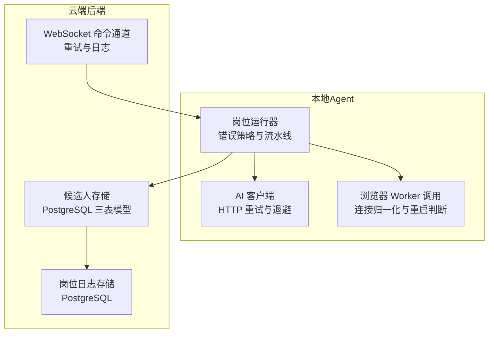
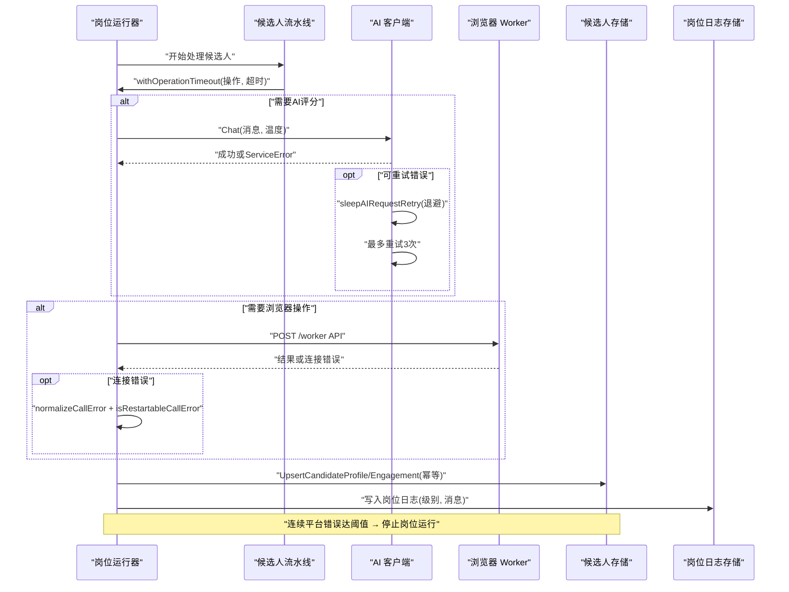
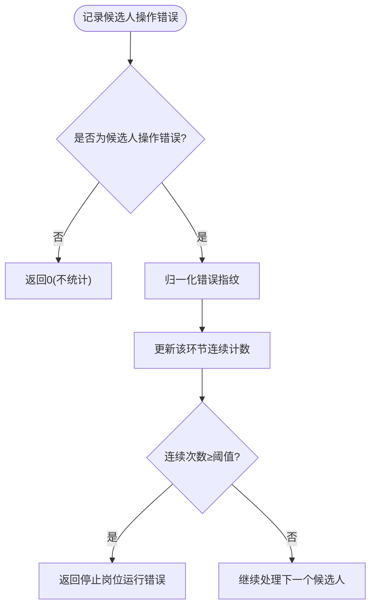
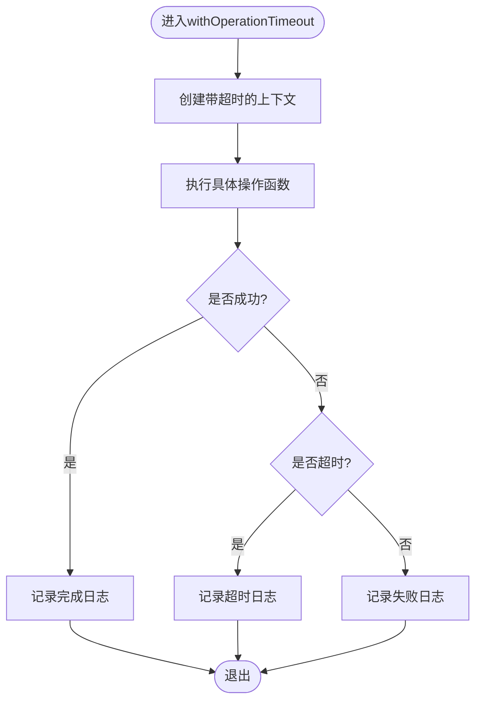
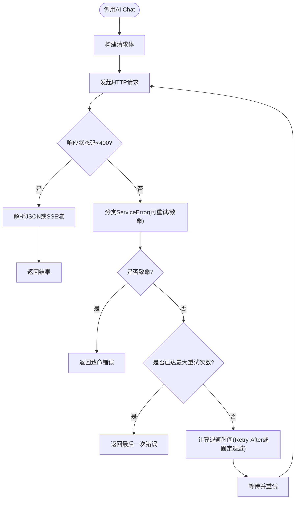
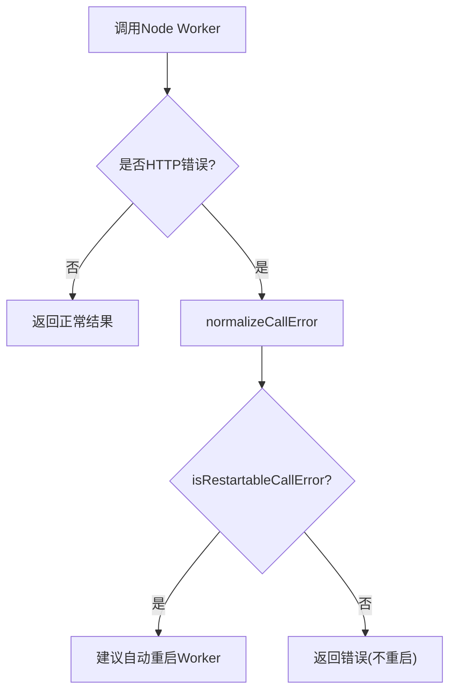
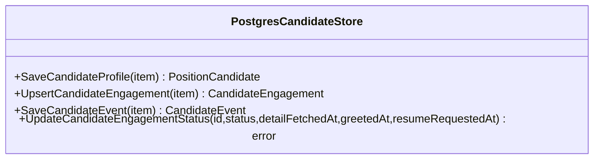
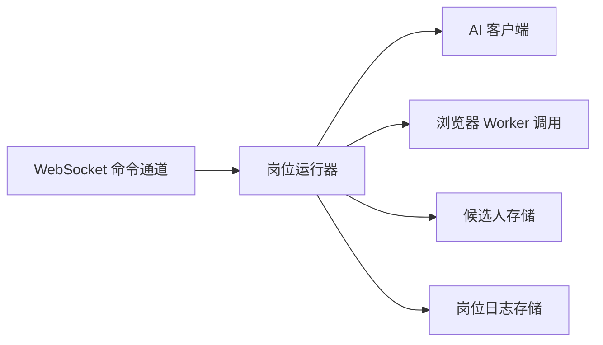

# 错误处理和重试机制

<cite>
**本文引用的文件**   
- [error_policy.go](file://goodhr5/local-agent-go/internal/positionrunner/error_policy.go)
- [pipeline.go](file://goodhr5/local-agent-go/internal/positionrunner/pipeline.go)
- [client.go](file://goodhr5/local-agent-go/internal/localai/client.go)
- [worker.go](file://goodhr5/local-agent-go/internal/browser/worker.go)
- [candidate_store_pg.go](file://goodhr5/cloud/backend/internal/httpapi/candidate_store_pg.go)
- [platform_account_store_pg.go](file://goodhr5/cloud/backend/internal/httpapi/platform_account_store_pg.go)
- [position_log_store_pg.go](file://goodhr5/cloud/backend/internal/httpapi/position_log_store_pg.go)
- [config.go](file://goodhr5/cloud/backend/internal/httpapi/config.go)
- [agent_ws.go](file://goodhr5/cloud/backend/internal/httpapi/agent_ws.go)
- [scan.go](file://goodhr5/local-agent-go/internal/positionrunner/scan.go)
</cite>

## 目录
1. [引言](#引言)
2. [项目结构](#项目结构)
3. [核心组件](#核心组件)
4. [架构总览](#架构总览)
5. [详细组件分析](#详细组件分析)
6. [依赖关系分析](#依赖关系分析)
7. [性能与可靠性考虑](#性能与可靠性考虑)
8. [故障排查指南](#故障排查指南)
9. [结论](#结论)

## 引言
本文面向候选人数据摄入系统，系统性梳理错误分类、处理策略、网络异常恢复、数据库连接故障处理、业务逻辑回滚、重试算法与退避策略、幂等性保证、死信队列思路、日志规范、监控告警与诊断工具。文档以本地岗位运行器、AI 客户端、浏览器 Worker 调用、云端候选人存储和日志存储为核心，帮助开发者构建健壮、可观测、可恢复的候选人数据处理链路。

## 项目结构
本项目的错误与重试能力分布在以下层次：
- 本地岗位运行层：负责候选人级错误统计、连续错误停止策略、操作超时与日志记录。
- AI 服务层：封装 OpenAI 兼容接口调用，实现请求重试、退避、致命错误判定。
- 浏览器 Worker 层：封装 Node Worker HTTP 调用，提供连接失败归一化与重启判断。
- 云端后端层：候选人三表模型持久化、唯一冲突检测、岗位日志写入与清理。
- 云端 WebSocket 层：命令发送重试与连接状态日志。

**图表来源**
- [pipeline.go:14-47](file://goodhr5/local-agent-go/internal/positionrunner/pipeline.go#L14-L47)
- [client.go:258-326](file://goodhr5/local-agent-go/internal/localai/client.go#L258-L326)
- [worker.go:339-367](file://goodhr5/local-agent-go/internal/browser/worker.go#L339-L367)
- [candidate_store_pg.go:24-160](file://goodhr5/cloud/backend/internal/httpapi/candidate_store_pg.go#L24-L160)
- [position_log_store_pg.go:42-67](file://goodhr5/cloud/backend/internal/httpapi/position_log_store_pg.go#L42-L67)
- [agent_ws.go:127-138](file://goodhr5/cloud/backend/internal/httpapi/agent_ws.go#L127-L138)

**章节来源**
- [pipeline.go:14-47](file://goodhr5/local-agent-go/internal/positionrunner/pipeline.go#L14-L47)
- [client.go:258-326](file://goodhr5/local-agent-go/internal/localai/client.go#L258-L326)
- [worker.go:339-367](file://goodhr5/local-agent-go/internal/browser/worker.go#L339-L367)
- [candidate_store_pg.go:24-160](file://goodhr5/cloud/backend/internal/httpapi/candidate_store_pg.go#L24-L160)
- [position_log_store_pg.go:42-67](file://goodhr5/cloud/backend/internal/httpapi/position_log_store_pg.go#L42-L67)
- [agent_ws.go:127-138](file://goodhr5/cloud/backend/internal/httpapi/agent_ws.go#L127-L138)

## 核心组件
- 候选人操作错误与连续错误跟踪：用于按平台环节统计相同错误次数，达到阈值后自动停止岗位运行。
- 岗位运行操作超时与日志：为每个候选人关键操作加超时、异常捕获、耗时日志。
- AI 客户端重试与退避：对可重试的网络或服务端错误进行最多三次重试，支持 Retry-After 退避。
- 浏览器 Worker 调用错误归一化：将连接拒绝等错误转换为中文提示，并判断是否适合自动重启。
- 候选人数据存储幂等：使用 ON CONFLICT DO UPDATE 保证重复入库不产生重复数据。
- 岗位日志写入与裁剪：写入岗位运行日志，并在超过上限时删除最早日志。
- WebSocket 命令重试：云端向本地发送命令时具备重试与日志记录。

**章节来源**
- [error_policy.go:15-119](file://goodhr5/local-agent-go/internal/positionrunner/error_policy.go#L15-L119)
- [pipeline.go:14-47](file://goodhr5/local-agent-go/internal/positionrunner/pipeline.go#L14-L47)
- [client.go:258-420](file://goodhr5/local-agent-go/internal/localai/client.go#L258-L420)
- [worker.go:339-367](file://goodhr5/local-agent-go/internal/browser/worker.go#L339-L367)
- [candidate_store_pg.go:24-160](file://goodhr5/cloud/backend/internal/httpapi/candidate_store_pg.go#L24-L160)
- [position_log_store_pg.go:42-67](file://goodhr5/cloud/backend/internal/httpapi/position_log_store_pg.go#L42-L67)
- [agent_ws.go:127-138](file://goodhr5/cloud/backend/internal/httpapi/agent_ws.go#L127-L138)

## 架构总览
候选人数据摄入的整体错误处理与重试流程如下：
- 岗位运行器在扫描候选人后，进入候选人类别处理流水线。
- 流水线为每个候选人执行关键操作（如打开详情、AI 评分、打招呼），并通过 withOperationTimeout 控制超时与记录日志。
- 若发生候选人级平台操作错误，则通过连续错误跟踪器统计；同一环节连续出现相同错误达到阈值时，停止整个岗位运行。
- 若 AI 服务返回可重试错误，AI 客户端内部进行最多三次重试，并根据 Retry-After 或固定退避等待。
- 若浏览器 Worker 调用失败，Worker 调用层会归一化错误并判断是否需要重启 Worker。
- 云端候选人存储使用幂等写入，避免重复数据；岗位日志持久化并裁剪。
- 云端 WebSocket 命令发送具备重试与日志，便于远程调试与定位问题。

**图表来源**
- [pipeline.go:14-47](file://goodhr5/local-agent-go/internal/positionrunner/pipeline.go#L14-L47)
- [client.go:310-403](file://goodhr5/local-agent-go/internal/localai/client.go#L310-L403)
- [worker.go:339-367](file://goodhr5/local-agent-go/internal/browser/worker.go#L339-L367)
- [candidate_store_pg.go:24-160](file://goodhr5/cloud/backend/internal/httpapi/candidate_store_pg.go#L24-L160)
- [position_log_store_pg.go:42-67](file://goodhr5/cloud/backend/internal/httpapi/position_log_store_pg.go#L42-L67)
- [error_policy.go:87-119](file://goodhr5/local-agent-go/internal/positionrunner/error_policy.go#L87-L119)

## 详细组件分析

### 候选人操作错误与连续错误跟踪
- 定义候选人操作错误类型，包装具体错误与操作名称，便于统一统计。
- 使用连续错误跟踪器按“平台环节”记录相同错误的连续次数。
- 错误指纹通过归一化数字与空白生成，避免超时毫秒数等噪声影响判断。
- 当同一环节连续出现相同错误达到阈值（例如三次）时，返回必须停止岗位运行的错误。
- 对于某些致命错误（如 AI 致命错误或浏览器关闭导致的岗位错误），立即停止岗位运行，无需等待连续计数。
- OCR 组件相关错误中，组件未安装、配置损坏、进程不可用等视为致命错误；单张图片未识别到文字仅跳过当前候选人。

**图表来源**
- [error_policy.go:48-99](file://goodhr5/local-agent-go/internal/positionrunner/error_policy.go#L48-L99)

**章节来源**
- [error_policy.go:15-119](file://goodhr5/local-agent-go/internal/positionrunner/error_policy.go#L15-L119)

### 岗位运行操作超时与日志
- 为每个候选人关键操作设置超时上下文，记录开始、完成、失败、超时日志。
- 捕获 panic 并转化为错误，避免崩溃中断流水线。
- 区分超时与一般失败，分别记录 warning 或 error 级别日志。
- 流水线根据错误决定是否标记候选人失败、累计失败数并继续处理后续候选人。

**图表来源**
- [pipeline.go:14-47](file://goodhr5/local-agent-go/internal/positionrunner/pipeline.go#L14-L47)

**章节来源**
- [pipeline.go:14-47](file://goodhr5/local-agent-go/internal/positionrunner/pipeline.go#L14-L47)
- [scan.go:241-292](file://goodhr5/local-agent-go/internal/positionrunner/scan.go#L241-L292)

### AI 客户端重试与退避策略
- Chat 方法对 AI 服务端或网络层错误进行分类：可重试与致命。
- 可重试错误包括：Too Many Requests、服务器内部错误、流式响应中断、网络层错误等。
- 致命错误包括：未授权、付费限制、禁止访问、未找到、配额不足、余额不足、模型不存在等。
- 重试次数最多为三次；每次重试前执行退避等待，优先使用 Retry-After 头，否则使用固定退避（尝试次数×500ms）。
- 致命错误直接返回，由上层决定停止岗位运行。

**图表来源**
- [client.go:310-403](file://goodhr5/local-agent-go/internal/localai/client.go#L310-L403)

**章节来源**
- [client.go:64-100](file://goodhr5/local-agent-go/internal/localai/client.go#L64-L100)
- [client.go:310-420](file://goodhr5/local-agent-go/internal/localai/client.go#L310-L420)

### 浏览器 Worker 调用错误归一化与重启判断
- 将原始网络错误转换为中文提示，如连接被拒绝、连接失败等。
- 区分取消与超时错误，保持语义清晰。
- 判断是否适合自动重启 Worker，避免在用户主动取消或超时时触发重启。

**图表来源**
- [worker.go:339-367](file://goodhr5/local-agent-go/internal/browser/worker.go#L339-L367)

**章节来源**
- [worker.go:339-367](file://goodhr5/local-agent-go/internal/browser/worker.go#L339-L367)

### 候选人数据存储幂等与事务边界
- 候选人主体保存使用 ON CONFLICT DO UPDATE，基于租户、平台ID、平台候选人ID的唯一键，确保重复入库不会重复。
- 触达上下文 Upsert 使用复合唯一条件，支持平台账号为空与非空两种场景。
- 事件流水追加写入，并更新最近事件时间与触达记录更新时间。
- 所有数据库操作均设置较短超时，避免长时间阻塞。

**图表来源**
- [candidate_store_pg.go:24-160](file://goodhr5/cloud/backend/internal/httpapi/candidate_store_pg.go#L24-L160)
- [candidate_store_pg.go:163-295](file://goodhr5/cloud/backend/internal/httpapi/candidate_store_pg.go#L163-L295)

**章节来源**
- [candidate_store_pg.go:24-160](file://goodhr5/cloud/backend/internal/httpapi/candidate_store_pg.go#L24-L160)
- [candidate_store_pg.go:163-295](file://goodhr5/cloud/backend/internal/httpapi/candidate_store_pg.go#L163-L295)

### 数据库唯一冲突与错误分类
- PostgreSQL 唯一索引冲突通过 pq.Error 代码判断，便于上层区分重复写入与真实错误。
- 其他存储层错误（如找不到记录）通过 ErrNotFound 等哨兵错误表达，便于调用方统一处理。

**章节来源**
- [platform_account_store_pg.go:141-148](file://goodhr5/cloud/backend/internal/httpapi/platform_account_store_pg.go#L141-L148)

### 岗位日志写入与裁剪
- 岗位日志写入包含位置ID、用户ID、级别、消息、时间戳。
- 列表查询支持按岗位聚合统计扫描、打招呼、跳过、失败数量。
- 写入前检查日志数量，超过上限时删除最早日志，防止无限增长。

**章节来源**
- [position_log_store_pg.go:42-67](file://goodhr5/cloud/backend/internal/httpapi/position_log_store_pg.go#L42-L67)
- [position_log_store_pg.go:172-197](file://goodhr5/cloud/backend/internal/httpapi/position_log_store_pg.go#L172-L197)
- [position_log_store_pg.go:199-235](file://goodhr5/cloud/backend/internal/httpapi/position_log_store_pg.go#L199-L235)

### 云端 WebSocket 命令重试
- 云端向本地 Agent 发送命令时具备重试逻辑，并记录尝试次数、错误摘要。
- 连接读取关闭、写入失败等场景均有日志输出，便于远程诊断。

**章节来源**
- [agent_ws.go:127-138](file://goodhr5/cloud/backend/internal/httpapi/agent_ws.go#L127-L138)

## 依赖关系分析
- 岗位运行器依赖 AI 客户端与浏览器 Worker 调用，同时依赖候选人存储与岗位日志存储。
- AI 客户端依赖 HTTP 客户端与服务端响应，内部实现重试与退避。
- 浏览器 Worker 调用依赖 HTTP 协议与 Node Worker 进程健康状态。
- 候选人存储依赖 PostgreSQL，使用幂等写入与唯一冲突检测。
- 岗位日志存储依赖 PostgreSQL，支持日志裁剪与聚合统计。
- 云端 WebSocket 依赖连接状态与重试逻辑，辅助远程调试。

**图表来源**
- [pipeline.go:14-47](file://goodhr5/local-agent-go/internal/positionrunner/pipeline.go#L14-L47)
- [client.go:258-326](file://goodhr5/local-agent-go/internal/localai/client.go#L258-L326)
- [worker.go:339-367](file://goodhr5/local-agent-go/internal/browser/worker.go#L339-L367)
- [candidate_store_pg.go:24-160](file://goodhr5/cloud/backend/internal/httpapi/candidate_store_pg.go#L24-L160)
- [position_log_store_pg.go:42-67](file://goodhr5/cloud/backend/internal/httpapi/position_log_store_pg.go#L42-L67)
- [agent_ws.go:127-138](file://goodhr5/cloud/backend/internal/httpapi/agent_ws.go#L127-L138)

**章节来源**
- [pipeline.go:14-47](file://goodhr5/local-agent-go/internal/positionrunner/pipeline.go#L14-L47)
- [client.go:258-326](file://goodhr5/local-agent-go/internal/localai/client.go#L258-L326)
- [worker.go:339-367](file://goodhr5/local-agent-go/internal/browser/worker.go#L339-L367)
- [candidate_store_pg.go:24-160](file://goodhr5/cloud/backend/internal/httpapi/candidate_store_pg.go#L24-L160)
- [position_log_store_pg.go:42-67](file://goodhr5/cloud/backend/internal/httpapi/position_log_store_pg.go#L42-L67)
- [agent_ws.go:127-138](file://goodhr5/cloud/backend/internal/httpapi/agent_ws.go#L127-L138)

## 性能与可靠性考虑
- 超时控制：候选人关键操作设置超时，避免长尾阻塞；数据库操作设置短超时，防止连接池耗尽。
- 并发控制：候选人详情评分采用工作池并发处理，提升吞吐。
- 重试与退避：AI 请求最多重试三次，结合 Retry-After 与固定退避，降低瞬时压力。
- 幂等写入：候选人主体与触达上下文使用 ON CONFLICT DO UPDATE，避免重复数据。
- 日志裁剪：岗位日志超过上限自动删除最早日志，控制存储增长。
- 致命错误快速失败：AI 致命错误、OCR 组件不可用等直接停止岗位运行，减少无效重试。

[本节为通用指导，不直接分析具体文件]

## 故障排查指南
- 候选人处理失败：查看岗位日志中的“候选人处理：失败”条目，确认错误信息与序号；若连续相同错误达到阈值，岗位运行已自动停止。
- AI 服务请求失败：检查 ServiceError 的状态码与 Body，确认是否可重试；关注 Retry-After 头与退避时间；若为致命错误（如余额不足、未授权），需修复配置或账户。
- 浏览器 Worker 未启动：若出现“Node Browser Worker 未启动”，检查 Worker 进程是否运行；若错误适合重启，自动重启 Worker。
- 数据库唯一冲突：若出现 PostgreSQL 唯一索引冲突，检查候选人唯一键（租户、平台ID、平台候选人ID）是否正确；必要时清理重复数据。
- 岗位日志过多：若日志量过大，检查日志裁剪逻辑是否生效；可通过岗位日志列表聚合统计定位高频错误。
- WebSocket 命令重试：若云端命令发送失败，查看重试日志与错误摘要，确认本地 Agent 连接状态。

**章节来源**
- [scan.go:241-292](file://goodhr5/local-agent-go/internal/positionrunner/scan.go#L241-L292)
- [client.go:310-420](file://goodhr5/local-agent-go/internal/localai/client.go#L310-L420)
- [worker.go:339-367](file://goodhr5/local-agent-go/internal/browser/worker.go#L339-L367)
- [platform_account_store_pg.go:141-148](file://goodhr5/cloud/backend/internal/httpapi/platform_account_store_pg.go#L141-L148)
- [position_log_store_pg.go:172-235](file://goodhr5/cloud/backend/internal/httpapi/position_log_store_pg.go#L172-L235)
- [agent_ws.go:127-138](file://goodhr5/cloud/backend/internal/httpapi/agent_ws.go#L127-L138)

## 结论
本系统的错误处理与重试机制围绕候选人数据摄入的核心链路展开：岗位运行器负责错误分类与连续错误保护，AI 客户端实现网络与服务端错误的重试与退避，浏览器 Worker 调用提供连接错误归一化与重启判断，云端候选人存储保证幂等写入，岗位日志存储支持可观测性与容量控制。通过上述机制，系统在面临网络抖动、服务限流、数据库冲突、组件不可用等异常时，能够稳定运行并及时反馈问题，便于运维与开发快速定位与修复。

[本节为总结性内容，不直接分析具体文件]