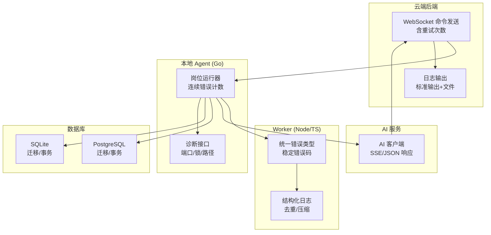
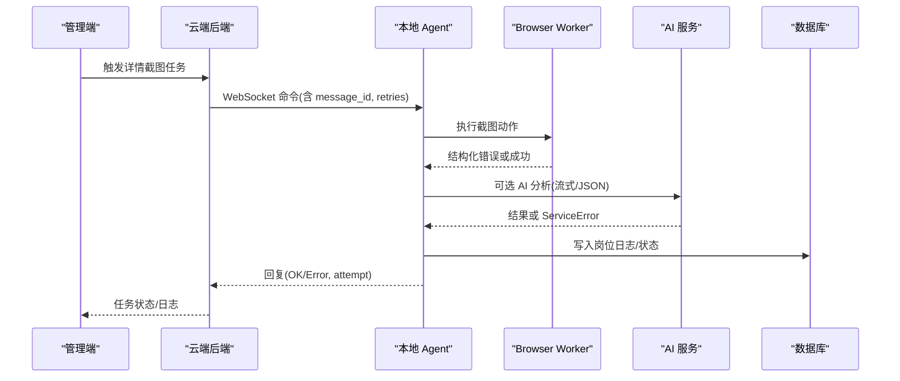
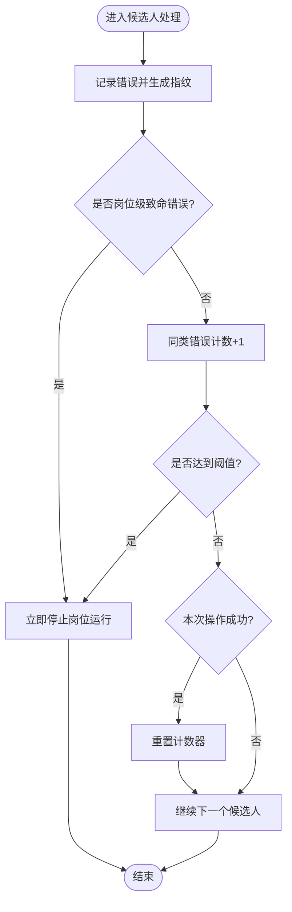
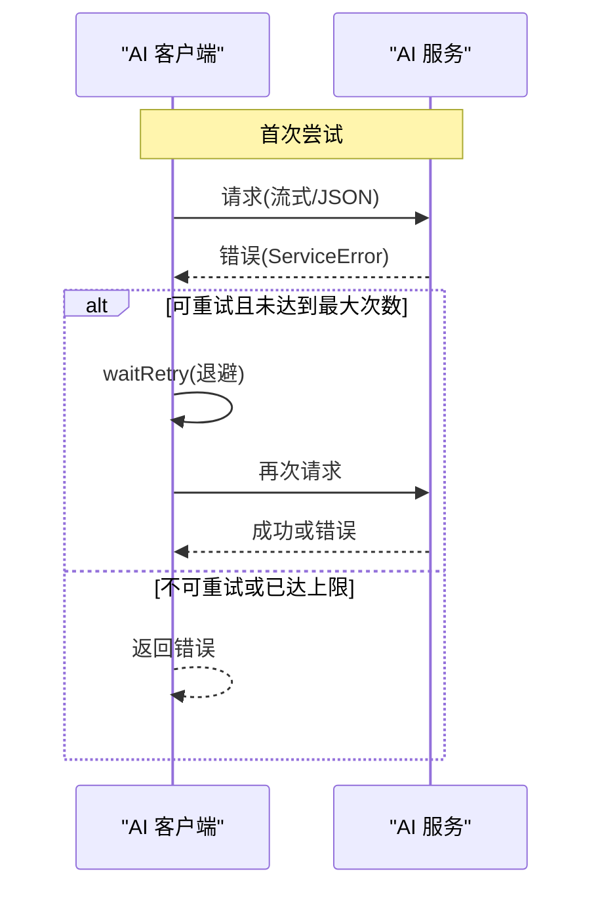
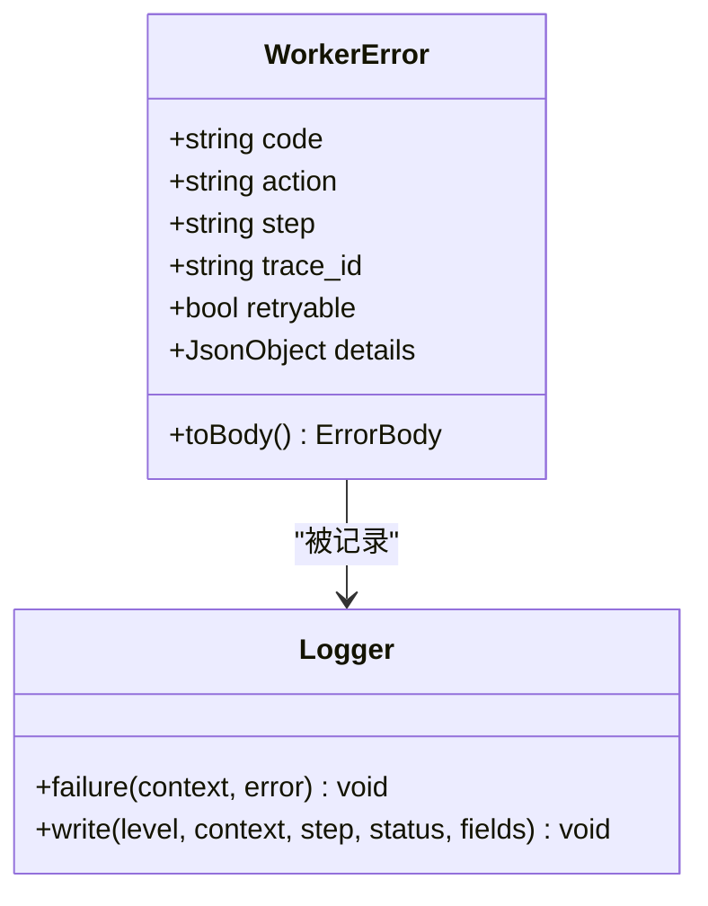
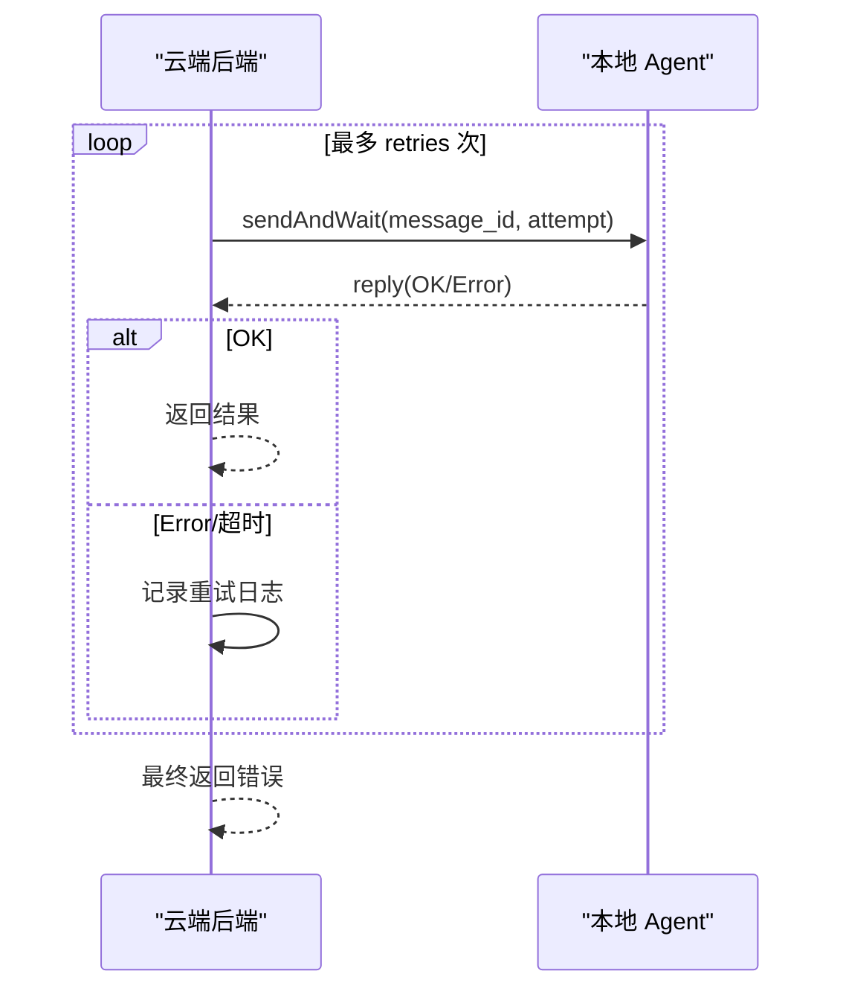
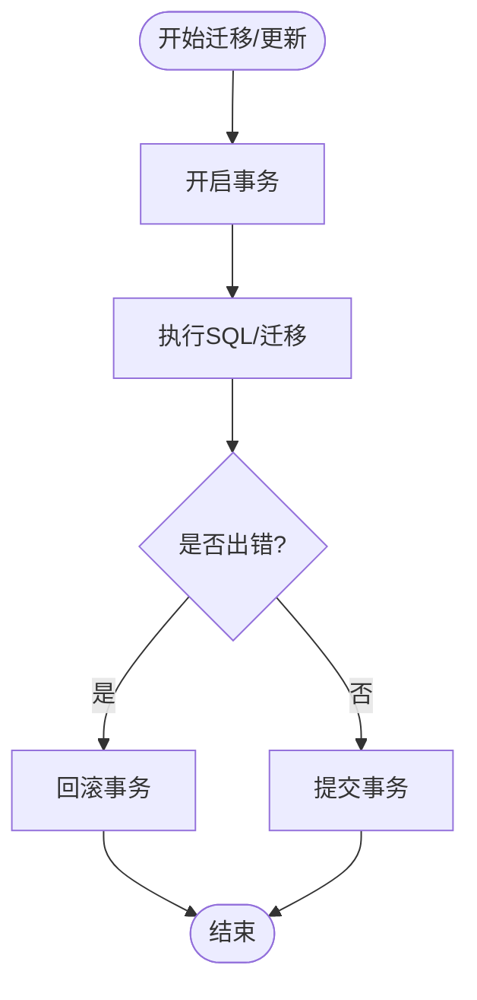
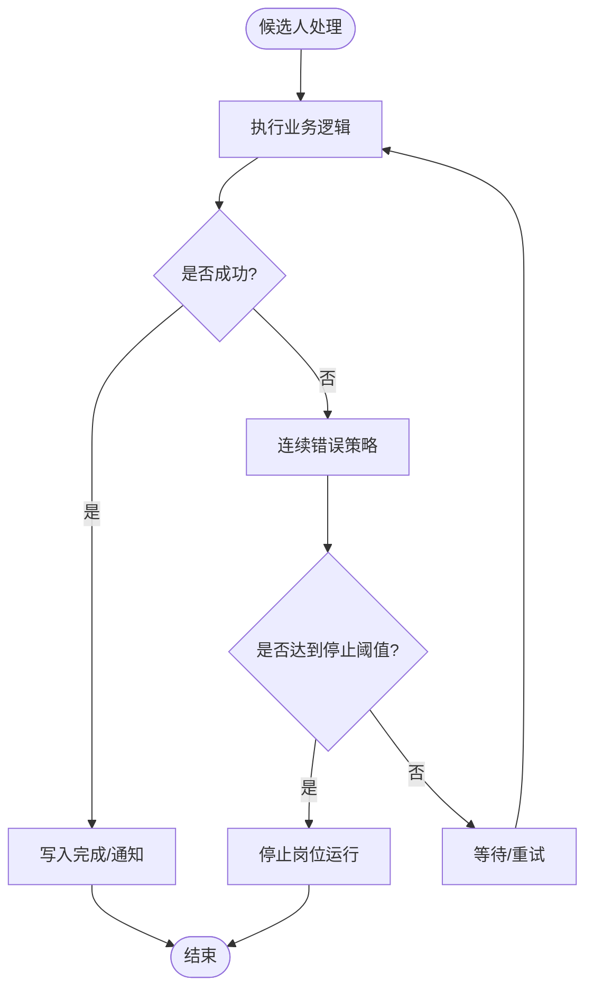
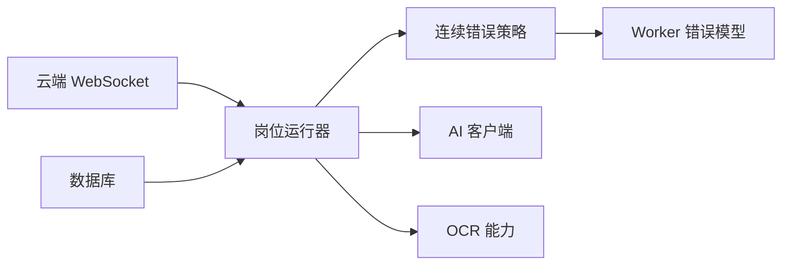

# 错误处理和重试机制

<cite>
**本文引用的文件**
- [error_policy.go](file://goodhr5/local-agent-go/internal/positionrunner/error_policy.go)
- [client.go](file://goodhr5/local-agent-go/internal/integration/ai/client.go)
- [worker-error.ts](file://goodhr5/local-agent-go/worker/src/errors/worker-error.ts)
- [logger.ts](file://goodhr5/local-agent-go/worker/src/logging/logger.ts)
- [index.js](file://goodhr5/local-agent-go/worker-node/src/index.js)
- [agent_ws.go](file://goodhr5/cloud/backend/internal/httpapi/agent_ws.go)
- [platform_account_store_pg.go](file://goodhr5/cloud/backend/internal/httpapi/platform_account_store_pg.go)
- [auto_migrate.go](file://goodhr5/cloud/backend/internal/httpapi/auto_migrate.go)
- [store.go](file://goodhr5/local-agent-go/internal/storage/store.go)
- [diagnostics.go](file://goodhr5/local-agent-go/internal/app/diagnostics.go)
- [diagnostics.go](file://goodhr5/local-agent-go/internal/api/diagnostics.go)
- [pacing.go](file://goodhr5/local-agent-go/internal/flow/greeting/pacing.go)
- [flow.go](file://goodhr5/local-agent-go/internal/flow/auto_reply/flow.go)
- [types.go](file://goodhr5/local-agent-go/internal/flow/shared/types.go)
- [main.go](file://goodhr5/cloud/backend/cmd/server/main.go)
</cite>

## 目录
1. [简介](#简介)
2. [项目结构](#项目结构)
3. [核心组件](#核心组件)
4. [架构总览](#架构总览)
5. [详细组件分析](#详细组件分析)
6. [依赖关系分析](#依赖关系分析)
7. [性能考虑](#性能考虑)
8. [故障排查指南](#故障排查指南)
9. [结论](#结论)
10. [附录：配置与示例](#附录：配置与示例)

## 简介
本文件面向候选人数据摄入系统的健壮性建设，系统化梳理错误分类、网络异常恢复、数据库连接故障处理、业务逻辑错误的回滚机制，并给出重试算法设计、退避策略、幂等性保证、死信队列处理建议。同时提供错误日志记录规范、监控告警思路、故障诊断工具使用方式，以及流程图和配置示例，帮助开发者构建高可用的系统。

## 项目结构
系统在云端后端、本地 Agent（Go）与 Worker（Node/TS）之间协作完成候选人数据采集、AI 决策、平台交互与持久化。错误处理与重试贯穿以下路径：
- 云端 WebSocket 命令到本地 Agent 的调用重试
- AI 服务调用的可重试与致命错误判定
- 浏览器 Worker 的稳定错误码与归一化
- 数据库迁移与事务回滚
- 运行期诊断与健康检查

**图表来源**
- [agent_ws.go:120-141](file://goodhr5/cloud/backend/internal/httpapi/agent_ws.go#L120-L141)
- [error_policy.go:1-119](file://goodhr5/local-agent-go/internal/positionrunner/error_policy.go#L1-L119)
- [worker-error.ts:1-129](file://goodhr5/local-agent-go/worker/src/errors/worker-error.ts#L1-L129)
- [client.go:235-390](file://goodhr5/local-agent-go/internal/integration/ai/client.go#L235-L390)
- [auto_migrate.go:68-116](file://goodhr5/cloud/backend/internal/httpapi/auto_migrate.go#L68-L116)
- [store.go:376-409](file://goodhr5/local-agent-go/internal/storage/store.go#L376-L409)
- [diagnostics.go:42-72](file://goodhr5/local-agent-go/internal/app/diagnostics.go#L42-L72)
- [diagnostics.go:84-191](file://goodhr5/local-agent-go/internal/api/diagnostics.go#L84-L191)

**章节来源**
- [agent_ws.go:120-141](file://goodhr5/cloud/backend/internal/httpapi/agent_ws.go#L120-L141)
- [error_policy.go:1-119](file://goodhr5/local-agent-go/internal/positionrunner/error_policy.go#L1-L119)
- [worker-error.ts:1-129](file://goodhr5/local-agent-go/worker/src/errors/worker-error.ts#L1-L129)
- [client.go:235-390](file://goodhr5/local-agent-go/internal/integration/ai/client.go#L235-L390)
- [auto_migrate.go:68-116](file://goodhr5/cloud/backend/internal/httpapi/auto_migrate.go#L68-L116)
- [store.go:376-409](file://goodhr5/local-agent-go/internal/storage/store.go#L376-L409)
- [diagnostics.go:42-72](file://goodhr5/local-agent-go/internal/app/diagnostics.go#L42-L72)
- [diagnostics.go:84-191](file://goodhr5/local-agent-go/internal/api/diagnostics.go#L84-L191)

## 核心组件
- 岗位级错误策略：按操作环节统计连续相同错误，达到阈值后停止岗位运行，避免无效重试放大失败面。
- AI 客户端重试：对临时错误进行最多三次重试，支持 Retry-After 退避；对致命错误直接返回。
- Worker 错误模型：将未知异常统一为带稳定错误码的结构化错误，便于 Go 端判断是否可重试。
- 云端 WebSocket 重试：云端向本地 Agent 发送命令时内置重试循环，记录尝试次数与摘要。
- 数据库迁移与事务：PostgreSQL 与 SQLite 均通过事务执行迁移，失败回滚并记录；唯一冲突识别用于幂等控制。
- 诊断与健康：暴露运行时状态、端口占用、Profile 锁文件等诊断信息，辅助快速定位问题。

**章节来源**
- [error_policy.go:1-119](file://goodhr5/local-agent-go/internal/positionrunner/error_policy.go#L1-L119)
- [client.go:235-390](file://goodhr5/local-agent-go/internal/integration/ai/client.go#L235-L390)
- [worker-error.ts:1-129](file://goodhr5/local-agent-go/worker/src/errors/worker-error.ts#L1-L129)
- [agent_ws.go:120-141](file://goodhr5/cloud/backend/internal/httpapi/agent_ws.go#L120-L141)
- [auto_migrate.go:68-116](file://goodhr5/cloud/backend/internal/httpapi/auto_migrate.go#L68-L116)
- [store.go:376-409](file://goodhr5/local-agent-go/internal/storage/store.go#L376-L409)
- [diagnostics.go:42-72](file://goodhr5/local-agent-go/internal/app/diagnostics.go#L42-L72)
- [diagnostics.go:84-191](file://goodhr5/local-agent-go/internal/api/diagnostics.go#L84-L191)

## 架构总览
下图展示一次“候选人详情截图”请求在云端、本地 Agent、Worker、AI 服务与数据库之间的错误处理与重试路径。

**图表来源**
- [agent_ws.go:120-141](file://goodhr5/cloud/backend/internal/httpapi/agent_ws.go#L120-L141)
- [client.go:235-390](file://goodhr5/local-agent-go/internal/integration/ai/client.go#L235-L390)
- [index.js:71-208](file://goodhr5/local-agent-go/worker-node/src/index.js#L71-L208)
- [platform_account_store_pg.go:131-148](file://goodhr5/cloud/backend/internal/httpapi/platform_account_store_pg.go#L131-L148)

## 详细组件分析

### 岗位级错误策略与连续错误计数
- 按操作环节统计连续相同错误，指纹归一化忽略数字差异（如超时毫秒），避免误判。
- 达到阈值（默认 3 次）后返回停止原因，上层可据此终止岗位运行，防止无效重试。
- 成功后重置计数器，允许后续继续处理。

**图表来源**
- [error_policy.go:48-119](file://goodhr5/local-agent-go/internal/positionrunner/error_policy.go#L48-L119)
- [error_policy.go:1-47](file://goodhr5/local-agent-go/internal/positionrunner/error_policy.go#L1-L47)

**章节来源**
- [error_policy.go:1-119](file://goodhr5/local-agent-go/internal/positionrunner/error_policy.go#L1-L119)

### AI 服务调用重试与退避
- 最多三次重试，仅对标记为可重试的错误进行重试。
- 退避策略：基础延迟随尝试次数线性增长，若服务端返回 Retry-After，则优先采用该值。
- 致命错误（如认证失败、配额不足、未找到模型等）不重试，直接返回。

**图表来源**
- [client.go:235-390](file://goodhr5/local-agent-go/internal/integration/ai/client.go#L235-L390)

**章节来源**
- [client.go:235-390](file://goodhr5/local-agent-go/internal/integration/ai/client.go#L235-L390)

### Worker 错误模型与日志
- 所有浏览器操作错误统一为 WorkerError，包含稳定错误码、动作、步骤、追踪 ID、是否可重试及详细信息。
- 日志输出结构化字段，具备最近失败去重与长度限制，避免日志风暴。
- 诊断日志会剥离敏感查询参数，保留页面路径与片段。

**图表来源**
- [worker-error.ts:1-129](file://goodhr5/local-agent-go/worker/src/errors/worker-error.ts#L1-L129)
- [logger.ts:73-124](file://goodhr5/local-agent-go/worker/src/logging/logger.ts#L73-L124)
- [index.js:71-208](file://goodhr5/local-agent-go/worker-node/src/index.js#L71-L208)

**章节来源**
- [worker-error.ts:1-129](file://goodhr5/local-agent-go/worker/src/errors/worker-error.ts#L1-L129)
- [logger.ts:73-124](file://goodhr5/local-agent-go/worker/src/logging/logger.ts#L73-L124)
- [index.js:71-208](file://goodhr5/local-agent-go/worker-node/src/index.js#L71-L208)

### 云端 WebSocket 命令重试
- 云端向本地 Agent 发送命令时，内置重试循环，记录每次尝试次数与摘要。
- 连接关闭或写入失败时清理在线状态，避免僵尸连接。

**图表来源**
- [agent_ws.go:120-141](file://goodhr5/cloud/backend/internal/httpapi/agent_ws.go#L120-L141)
- [agent_ws.go:194-230](file://goodhr5/cloud/backend/internal/httpapi/agent_ws.go#L194-L230)

**章节来源**
- [agent_ws.go:120-141](file://goodhr5/cloud/backend/internal/httpapi/agent_ws.go#L120-L141)
- [agent_ws.go:194-230](file://goodhr5/cloud/backend/internal/httpapi/agent_ws.go#L194-L230)

### 数据库连接故障与事务回滚
- PostgreSQL 迁移与更新使用事务，失败自动回滚；唯一索引冲突识别用于幂等处理。
- SQLite 迁移同样在事务中执行，失败回滚并记录；迁移版本表确保幂等。

**图表来源**
- [auto_migrate.go:68-116](file://goodhr5/cloud/backend/internal/httpapi/auto_migrate.go#L68-L116)
- [store.go:376-409](file://goodhr5/local-agent-go/internal/storage/store.go#L376-L409)
- [platform_account_store_pg.go:131-148](file://goodhr5/cloud/backend/internal/httpapi/platform_account_store_pg.go#L131-L148)

**章节来源**
- [auto_migrate.go:68-116](file://goodhr5/cloud/backend/internal/httpapi/auto_migrate.go#L68-L116)
- [store.go:376-409](file://goodhr5/local-agent-go/internal/storage/store.go#L376-L409)
- [platform_account_store_pg.go:131-148](file://goodhr5/cloud/backend/internal/httpapi/platform_account_store_pg.go#L131-L148)

### 业务逻辑错误的回滚机制
- 岗位运行中的候选人处理失败不会提前写入完成状态，待重试后可继续发送通知。
- 流程中遇到可恢复错误时，通过连续错误策略暂停当前岗位，避免无限重试。

**图表来源**
- [flow.go:126-151](file://goodhr5/local-agent-go/internal/flow/auto_reply/flow.go#L126-L151)
- [error_policy.go:87-119](file://goodhr5/local-agent-go/internal/positionrunner/error_policy.go#L87-L119)

**章节来源**
- [flow.go:126-151](file://goodhr5/local-agent-go/internal/flow/auto_reply/flow.go#L126-L151)
- [error_policy.go:87-119](file://goodhr5/local-agent-go/internal/positionrunner/error_policy.go#L87-L119)

### 幂等性保证
- 数据库层通过唯一约束与 ON CONFLICT DO NOTHING 实现幂等插入。
- 迁移版本表记录已执行迁移，重复执行不产生副作用。
- 支付回调等场景通过订单号/用户维度幂等校验，避免重复发放权益。

**章节来源**
- [auto_migrate.go:92-116](file://goodhr5/cloud/backend/internal/httpapi/auto_migrate.go#L92-L116)
- [store.go:384-409](file://goodhr5/local-agent-go/internal/storage/store.go#L384-L409)
- [platform_account_store_pg.go:141-148](file://goodhr5/cloud/backend/internal/httpapi/platform_account_store_pg.go#L141-L148)

### 死信队列处理（建议）
仓库未实现显式死信队列，但可通过以下方式扩展：
- 将连续错误达到阈值的任务写入独立存储（如 Redis 列表或专用表），供后台消费与人工干预。
- 结合日志与诊断接口，对死信任务进行聚合统计与告警。
- 在重试耗尽后，将消息转入死信队列，并附带上下文（trace_id、错误码、重试次数）。

[本节为概念性建议，无直接代码映射]

## 依赖关系分析
- 岗位运行器依赖 AI 客户端与 OCR 能力，错误传播至统一策略模块。
- Worker 错误通过标准化字段影响 Go 端的连续错误计数与停止决策。
- 云端 WebSocket 重试与本地 Agent 健康状态共同决定命令成功率。
- 数据库迁移与事务一致性保障数据正确性。

**图表来源**
- [error_policy.go:1-119](file://goodhr5/local-agent-go/internal/positionrunner/error_policy.go#L1-L119)
- [client.go:235-390](file://goodhr5/local-agent-go/internal/integration/ai/client.go#L235-L390)
- [worker-error.ts:1-129](file://goodhr5/local-agent-go/worker/src/errors/worker-error.ts#L1-L129)
- [agent_ws.go:120-141](file://goodhr5/cloud/backend/internal/httpapi/agent_ws.go#L120-L141)

**章节来源**
- [error_policy.go:1-119](file://goodhr5/local-agent-go/internal/positionrunner/error_policy.go#L1-L119)
- [client.go:235-390](file://goodhr5/local-agent-go/internal/integration/ai/client.go#L235-L390)
- [worker-error.ts:1-129](file://goodhr5/local-agent-go/worker/src/errors/worker-error.ts#L1-L129)
- [agent_ws.go:120-141](file://goodhr5/cloud/backend/internal/httpapi/agent_ws.go#L120-L141)

## 性能考虑
- 重试退避避免雪崩：AI 客户端使用线性退避并结合 Retry-After，降低瞬时压力。
- 日志去重与限长：Worker 日志对近期失败进行去重与长度限制，减少 I/O 压力。
- 诊断接口限制扫描深度：Profile 锁文件扫描限制数量，避免长时间遍历。
- 随机等待：打招呼停留时间随机化，降低并发峰值。

**章节来源**
- [client.go:376-390](file://goodhr5/local-agent-go/internal/integration/ai/client.go#L376-L390)
- [logger.ts:73-124](file://goodhr5/local-agent-go/worker/src/logging/logger.ts#L73-L124)
- [diagnostics.go:157-176](file://goodhr5/local-agent-go/internal/api/diagnostics.go#L157-L176)
- [pacing.go:33-71](file://goodhr5/local-agent-go/internal/flow/greeting/pacing.go#L33-L71)

## 故障排查指南
- 查看诊断接口：获取 OS、端口占用、目录权限、运行组件状态、Profile 锁文件与建议。
- 检查日志：云端日志输出到标准输出与文件；Worker 结构化日志包含 trace_id、action、step、错误码。
- 定位浏览器问题：通过诊断地址剥离敏感参数，聚焦页面路径与片段。
- 数据库问题：检查迁移版本表与唯一冲突错误码，确认事务回滚是否生效。
- 网络问题：关注 AI 客户端 ServiceError 的状态码与 Retry-After，调整重试策略。

**章节来源**
- [diagnostics.go:42-72](file://goodhr5/local-agent-go/internal/app/diagnostics.go#L42-L72)
- [diagnostics.go:84-191](file://goodhr5/local-agent-go/internal/api/diagnostics.go#L84-L191)
- [main.go:40-53](file://goodhr5/cloud/backend/cmd/server/main.go#L40-L53)
- [index.js:71-208](file://goodhr5/local-agent-go/worker-node/src/index.js#L71-L208)
- [platform_account_store_pg.go:131-148](file://goodhr5/cloud/backend/internal/httpapi/platform_account_store_pg.go#L131-L148)

## 结论
本系统通过岗位级错误策略、AI 客户端重试、Worker 错误模型、云端 WebSocket 重试、数据库事务与迁移幂等、以及完善的诊断与日志体系，构建了稳健的候选人数据摄入链路。建议在现有基础上引入死信队列与更细粒度的监控告警，进一步提升可观测性与自愈能力。

## 附录：配置与示例
- 重试配置示例（AI 客户端）
  - 最大重试次数：3
  - 退避策略：线性退避（尝试次数×固定间隔），优先使用 Retry-After
  - 致命错误：认证失败、配额不足、未找到模型等不重试
- 连续错误阈值
  - 默认 3 次相同错误后停止岗位运行
  - 成功后重置计数器
- 日志规范
  - 云端：标准输出+文件，包含微秒时间戳
  - Worker：结构化 JSON，包含 trace_id、action、step、错误码、耗时
  - 诊断地址：移除查询参数，保留路径与片段
- 监控告警建议
  - 基于日志关键字（如“连续 3 次”“ServiceError”“写入失败”）设置告警
  - 监控诊断接口的端口占用与 Profile 锁文件数量
  - 跟踪 AI 服务状态码分布与重试率

**章节来源**
- [client.go:235-390](file://goodhr5/local-agent-go/internal/integration/ai/client.go#L235-L390)
- [error_policy.go:1-119](file://goodhr5/local-agent-go/internal/positionrunner/error_policy.go#L1-L119)
- [main.go:40-53](file://goodhr5/cloud/backend/cmd/server/main.go#L40-L53)
- [logger.ts:73-124](file://goodhr5/local-agent-go/worker/src/logging/logger.ts#L73-L124)
- [index.js:71-208](file://goodhr5/local-agent-go/worker-node/src/index.js#L71-L208)
- [diagnostics.go:84-191](file://goodhr5/local-agent-go/internal/api/diagnostics.go#L84-L191)