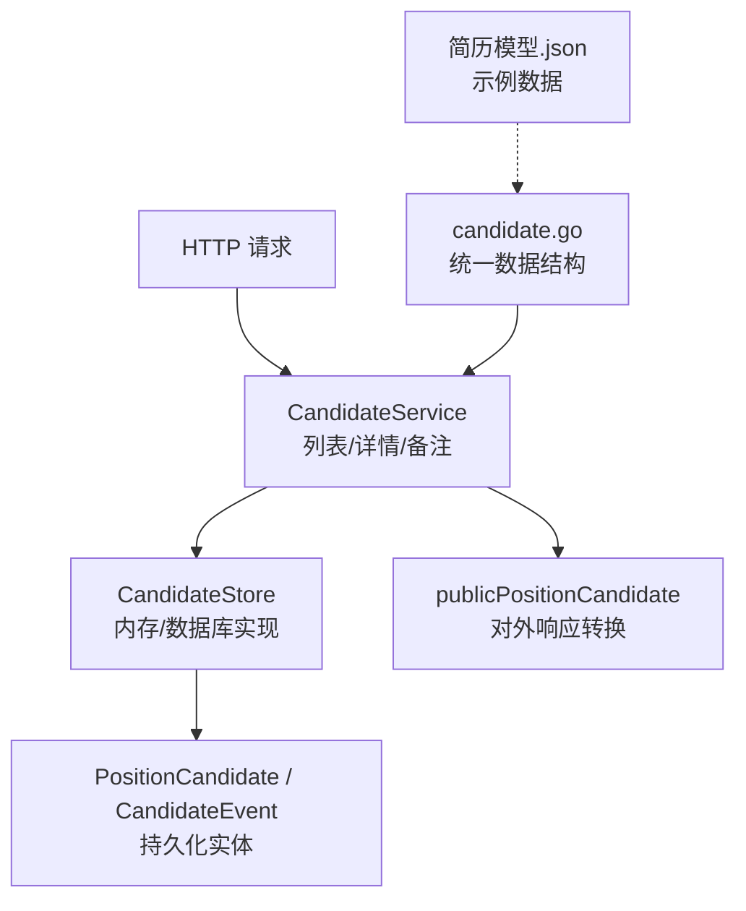
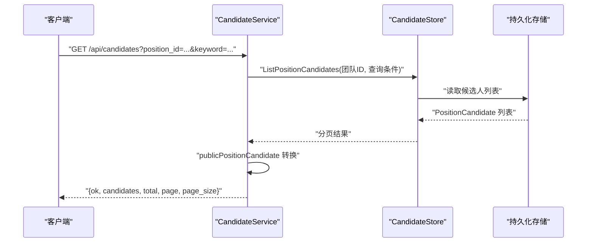
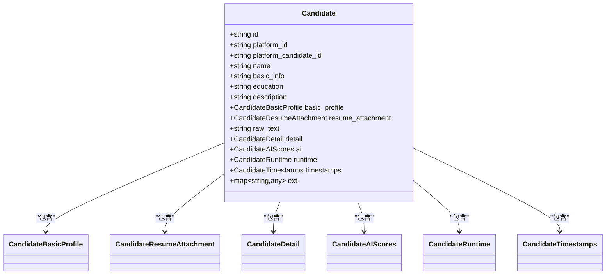
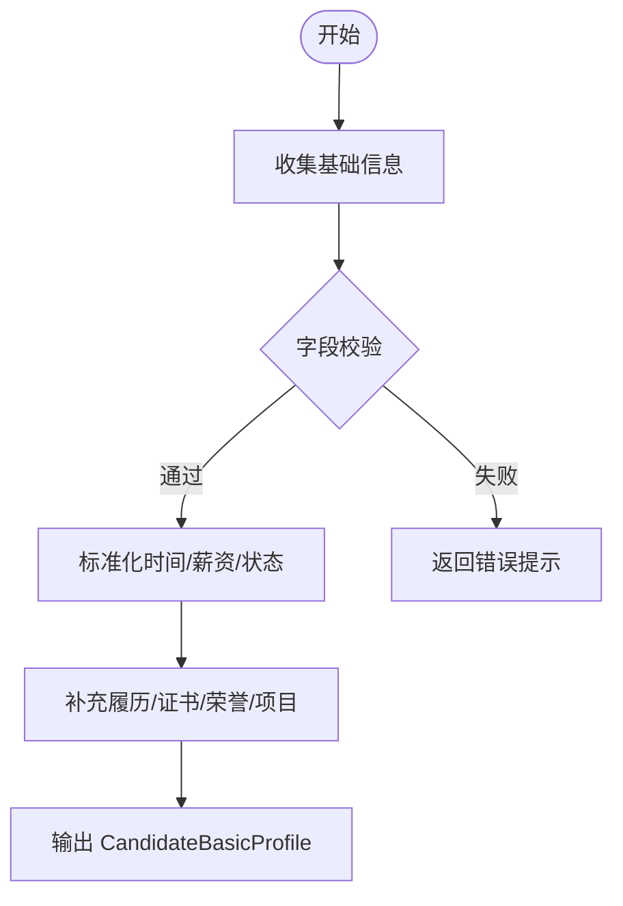
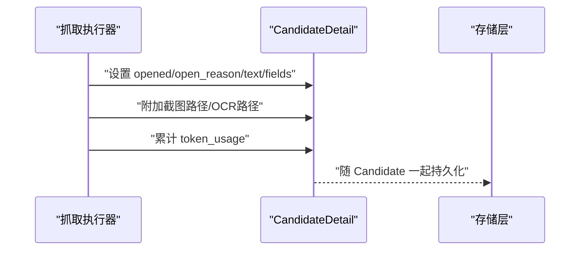
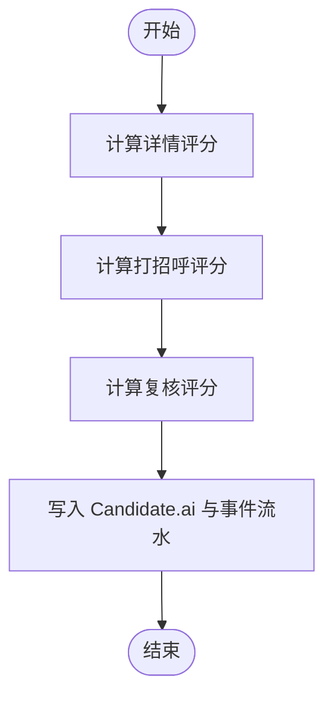
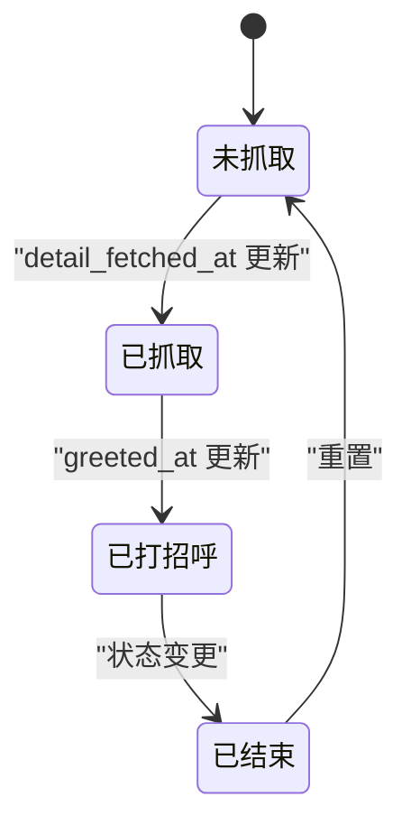
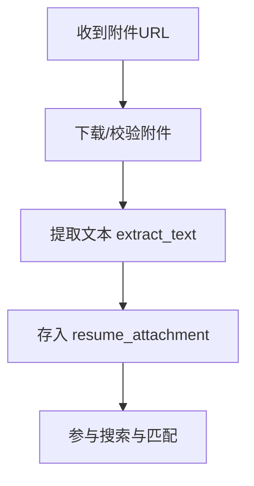
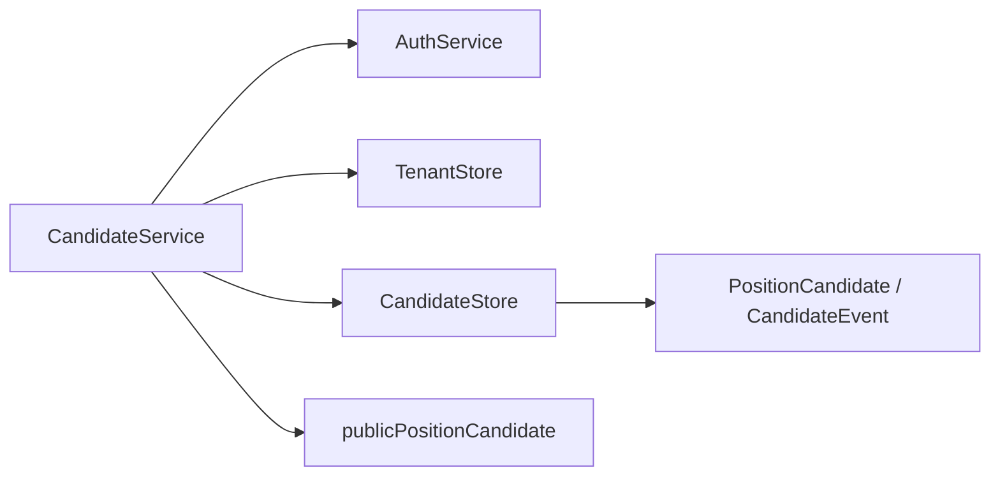

# 候选人数据模型

<cite>
**本文引用的文件**
- [candidate.go](file://goodhr5/cloud/backend/internal/httpapi/candidate.go)
- [candidate_store.go](file://goodhr5/cloud/backend/internal/httpapi/candidate_store.go)
- [candidate_service.go](file://goodhr5/cloud/backend/internal/httpapi/candidate_service.go)
- [简历模型.json](file://goodhr5/简历模型.json)
</cite>

## 目录
1. [简介](#简介)
2. [项目结构](#项目结构)
3. [核心组件](#核心组件)
4. [架构总览](#架构总览)
5. [详细组件分析](#详细组件分析)
6. [依赖关系分析](#依赖关系分析)
7. [性能考量](#性能考量)
8. [故障排查指南](#故障排查指南)
9. [结论](#结论)
10. [附录](#附录)

## 简介
本文件围绕候选人的数据模型进行系统化说明，覆盖 Candidate、CandidateBasicProfile、CandidateDetail 等核心数据结构的设计理念与字段含义；解释简历附件处理、AI 评分体系、运行时状态管理的数据组织方式；并给出数据验证规则、序列化格式、版本兼容性考虑。同时提供实际数据结构示例与使用场景，帮助开发者理解候选人数据的完整生命周期与存储策略。

## 项目结构
与候选人数据模型直接相关的后端代码集中在云端后端的 HTTP API 层：
- 数据结构定义：统一在 candidate.go 中声明，作为本地程序同步到云端的统一对象及子结构。
- 存储接口与内存实现：candidate_store.go 定义了候选人主体、触达上下文、事件流水的存储能力，并提供开发期内存实现。
- 服务与API：candidate_service.go 暴露简历库候选人列表、详情、备注等HTTP接口，并对数据进行对外响应转换。
- 示例数据：简历模型.json 提供了结构化示例，便于理解字段语义与取值范围。

图表来源
- [candidate_service.go:29-146](file://goodhr5/cloud/backend/internal/httpapi/candidate_service.go#L29-L146)
- [candidate_store.go:146-156](file://goodhr5/cloud/backend/internal/httpapi/candidate_store.go#L146-L156)
- [candidate.go:126-143](file://goodhr5/cloud/backend/internal/httpapi/candidate.go#L126-L143)

章节来源
- [candidate.go:1-153](file://goodhr5/cloud/backend/internal/httpapi/candidate.go#L1-L153)
- [candidate_store.go:1-438](file://goodhr5/cloud/backend/internal/httpapi/candidate_store.go#L1-L438)
- [candidate_service.go:1-334](file://goodhr5/cloud/backend/internal/httpapi/candidate_service.go#L1-L334)
- [简历模型.json:1-84](file://goodhr5/简历模型.json#L1-L84)

## 核心组件
本节聚焦核心数据结构及其职责边界：
- Candidate：统一对象，承载候选人基础信息、简历附件、详情抓取、AI 评分、运行态与时间戳，以及扩展字段。
- CandidateBasicProfile：在线简历基础信息，包含联系方式、期望薪资、工作区域、经验年限、个人描述、求职状态、工作经历、教育经历、证书、荣誉、项目经验、沟通记录等。
- CandidateDetail：详情页抓取结果，包括是否打开、打开原因、文本、结构化字段、截图路径、OCR 路径、Token 用量。
- CandidateAIScores：三阶段 AI 评分（detail/greet/review），每个阶段包含分数与理由。
- CandidateRuntime：流程运行态，用于定位元素引用、卡片索引、指纹等。
- CandidateTimestamps：关键时间戳，如首次出现、详情抓取时间、更新时间、打招呼时间。

这些结构共同构成候选人从采集、解析、评分到交互的全链路数据载体。

章节来源
- [candidate.go:61-143](file://goodhr5/cloud/backend/internal/httpapi/candidate.go#L61-L143)

## 架构总览
候选人数据在系统中的流转如下：
- 本地程序或平台抓取器将候选人数据以 Candidate 统一对象形式上传至云端。
- 云端通过 CandidateService 接收请求，调用 CandidateStore 保存或查询。
- 存储层维护 PositionCandidate（简历库展示记录）、CandidateEngagement（触达上下文）与 CandidateEvent（事件流水）。
- 对外 API 将内部实体转换为 publicPositionCandidate 返回给前端，保证字段安全与稳定。

图表来源
- [candidate_service.go:29-76](file://goodhr5/cloud/backend/internal/httpapi/candidate_service.go#L29-L76)
- [candidate_store.go:327-356](file://goodhr5/cloud/backend/internal/httpapi/candidate_store.go#L327-L356)

章节来源
- [candidate_service.go:29-146](file://goodhr5/cloud/backend/internal/httpapi/candidate_service.go#L29-L146)
- [candidate_store.go:146-156](file://goodhr5/cloud/backend/internal/httpapi/candidate_store.go#L146-L156)

## 详细组件分析

### Candidate 统一对象
设计理念：
- 作为跨端传输的统一载体，屏蔽平台差异，集中表达候选人全量信息。
- 将“静态属性”（基本信息、教育、经历、证书、荣誉、沟通记录）与“动态过程”（详情抓取、AI 评分、运行态、时间戳）解耦，便于演进与维护。

关键字段说明：
- id/platform_id/platform_candidate_id/name：身份标识与平台映射。
- basic_info/education/description：基础摘要与学历、个人描述。
- basic_profile：在线简历基础信息的结构化集合。
- resume_attachment：简历附件 URL 与提取文本，支持离线阅读与二次加工。
- raw_text：原始抓取文本，便于回溯与调试。
- detail：详情页抓取结果，含 opened/open_reason/text/fields/screenshot_paths/ocr_path/token_usage。
- ai：三阶段评分（detail/greet/review），score 可为空表示尚未评分。
- runtime：element_ref/card_index/fingerprint，用于定位与重放。
- timestamps：first_seen_at/detail_fetched_at/updated_at/greeted_at。
- ext：扩展字段，兼容未来新增维度。

图表来源
- [candidate.go:126-143](file://goodhr5/cloud/backend/internal/httpapi/candidate.go#L126-L143)

章节来源
- [candidate.go:126-143](file://goodhr5/cloud/backend/internal/httpapi/candidate.go#L126-L143)

### CandidateBasicProfile 在线简历基础信息
设计要点：
- 将高频检索与展示的字段结构化，便于筛选、排序与展示。
- 工作经历、教育经历、项目经验采用数组结构，支持多段履历。
- 证书与荣誉在后端存储为结构化对象，但在 BasicProfile 中为了简化序列化为字符串数组（注意与存储层的差异）。

关键字段说明：
- birth_ym/phone/email/work_region/work_years：基本人口与工作信息。
- expected_salary.min/max：期望薪资区间，可空。
- personal_description/work_status/expected_position/online_status：求职意向与状态。
- work_experiences/educations/project_experiences：三段式履历，start_ym/end_ym 表示时间段。
- certificates/honors：在 BasicProfile 中为字符串数组；存储层使用更丰富的对象结构。
- colleague_communications：沟通记录，communicator_name/communicated_at/content。

图表来源
- [candidate.go:61-79](file://goodhr5/cloud/backend/internal/httpapi/candidate.go#L61-L79)

章节来源
- [candidate.go:61-79](file://goodhr5/cloud/backend/internal/httpapi/candidate.go#L61-L79)

### CandidateDetail 详情页抓取信息
设计要点：
- 将“是否打开”和“打开原因”前置，便于快速判断抓取质量。
- text/fields 分别提供原始文本与结构化字段，兼顾可读性与机器处理。
- screenshot_paths/ocr_path 支持截图与 OCR 回溯，token_usage 记录模型消耗。

图表来源
- [candidate.go:100-109](file://goodhr5/cloud/backend/internal/httpapi/candidate.go#L100-L109)

章节来源
- [candidate.go:100-109](file://goodhr5/cloud/backend/internal/httpapi/candidate.go#L100-L109)

### AI 评分体系
设计要点：
- 三阶段评分：detail（详情匹配度）、greet（打招呼策略）、review（复核评估）。
- 每个阶段 score 可为空，reason 提供可解释性。
- 评分与事件流水关联，便于审计与回溯。

图表来源
- [candidate.go:87-98](file://goodhr5/cloud/backend/internal/httpapi/candidate.go#L87-L98)
- [candidate_store.go:117-135](file://goodhr5/cloud/backend/internal/httpapi/candidate_store.go#L117-L135)

章节来源
- [candidate.go:87-98](file://goodhr5/cloud/backend/internal/httpapi/candidate.go#L87-L98)
- [candidate_store.go:117-135](file://goodhr5/cloud/backend/internal/httpapi/candidate_store.go#L117-L135)

### 运行时状态管理
设计要点：
- runtime.element_ref/card_index/fingerprint 用于定位与重放抓取动作。
- timestamps 记录关键时间点，支撑统计与告警。
- engagement 上下文将候选人、岗位、账号关联起来，形成触达闭环。

图表来源
- [candidate.go:111-124](file://goodhr5/cloud/backend/internal/httpapi/candidate.go#L111-L124)
- [candidate_store.go:100-115](file://goodhr5/cloud/backend/internal/httpapi/candidate_store.go#L100-L115)

章节来源
- [candidate.go:111-124](file://goodhr5/cloud/backend/internal/httpapi/candidate.go#L111-L124)
- [candidate_store.go:100-115](file://goodhr5/cloud/backend/internal/httpapi/candidate_store.go#L100-L115)

### 简历附件处理
设计要点：
- resume_attachment.url 指向附件资源，extracted_text 提供可检索文本。
- 与 raw_text 互补：raw_text 侧重页面抓取原文，extracted_text 侧重文档解析结果。
- 可在后续流程中进行关键词检索、相似度匹配与人工审阅。

图表来源
- [candidate.go:81-85](file://goodhr5/cloud/backend/internal/httpapi/candidate.go#L81-L85)

章节来源
- [candidate.go:81-85](file://goodhr5/cloud/backend/internal/httpapi/candidate.go#L81-L85)

### 数据验证规则
- 必填字段：id、platform_id、platform_candidate_id、name 建议非空；basic_profile 中的联系方式与期望薪资区间应做基础校验。
- 时间字段：birth_ym/start_ym/end_ym 应为合法年月格式；timestamps 遵循 ISO 或约定格式。
- 数值字段：expected_salary.min/max 为非负整数；ai.score 为浮点数且应在合理区间。
- 长度限制：personal_description/raw_text 等文本字段需限制最大长度，避免过大负载。
- 枚举值：work_status/online_status/education_level 等应限定于预定义集合。
- 备注内容：Notes 接口对内容长度进行限制（例如不超过 1000 字）。

章节来源
- [candidate_service.go:186-215](file://goodhr5/cloud/backend/internal/httpapi/candidate_service.go#L186-L215)
- [candidate.go:61-143](file://goodhr5/cloud/backend/internal/httpapi/candidate.go#L61-L143)

### 序列化格式
- JSON 标签：所有结构体使用 json 标签定义键名，确保前后端一致。
- 空值处理：可选字段使用指针或空切片/空 map，避免 null 影响前端渲染。
- 对外响应：publicPositionCandidate 将内部实体转换为稳定的前端结构，屏蔽内部实现细节。

章节来源
- [candidate.go:61-143](file://goodhr5/cloud/backend/internal/httpapi/candidate.go#L61-L143)
- [candidate_service.go:251-295](file://goodhr5/cloud/backend/internal/httpapi/candidate_service.go#L251-L295)

### 版本兼容性考虑
- 向后兼容：新增字段优先使用可选类型或扩展字段 ext，避免破坏旧客户端。
- 字段迁移：当字段语义变化时，保留旧字段一段时间并通过服务端逻辑进行映射。
- 枚举演进：工作状态下线值应允许过渡期兼容，逐步淘汰。
- 评分体系：ai.score 可为空，表示尚未评分或评分模型升级后的重新计算。

章节来源
- [candidate.go:126-143](file://goodhr5/cloud/backend/internal/httpapi/candidate.go#L126-L143)
- [candidate_store.go:117-135](file://goodhr5/cloud/backend/internal/httpapi/candidate_store.go#L117-L135)

### 实际数据结构示例
以下示例来自简历模型.json，展示了候选人结构化数据的关键字段与取值风格：
- ai.detail.score/reason、ai.greet.score/reason：AI 评分与理由。
- candidate_name/birth_ym/phone/email/work_region/work_years：基础信息。
- expected_salary_min/max：期望薪资区间。
- education_level/expected_position/online_status/work_status：求职相关状态。
- work_experiences/educations/certificates/honors/project_experiences：履历与资质。
- colleague_communications：沟通记录。
- raw_text：原始抓取文本。

章节来源
- [简历模型.json:1-84](file://goodhr5/简历模型.json#L1-L84)

### 使用场景
- 简历库列表：按岗位、关键词分页查询候选人，返回公共字段与 AI 评分摘要。
- 候选人详情：获取单个候选人的完整信息与事件流水，支持按 engagement_id 过滤。
- 备注管理：为候选人添加人工备注，备注以事件形式持久化并可查询。
- 清空团队数据：管理员可清空当前团队的候选人数据，便于测试与清理。

章节来源
- [candidate_service.go:29-146](file://goodhr5/cloud/backend/internal/httpapi/candidate_service.go#L29-L146)
- [candidate_service.go:148-215](file://goodhr5/cloud/backend/internal/httpapi/candidate_service.go#L148-L215)
- [candidate_service.go:78-108](file://goodhr5/cloud/backend/internal/httpapi/candidate_service.go#L78-L108)

## 依赖关系分析
- CandidateService 依赖 AuthService（会话）、TenantStore（租户权限）、CandidateStore（数据访问）。
- CandidateStore 提供 SaveCandidateProfile、UpsertCandidateEngagement、SaveCandidateEvent、List/Get/Delete 等操作。
- 对外响应通过 publicPositionCandidate 转换，确保字段稳定与安全。

图表来源
- [candidate_service.go:12-27](file://goodhr5/cloud/backend/internal/httpapi/candidate_service.go#L12-L27)
- [candidate_store.go:146-156](file://goodhr5/cloud/backend/internal/httpapi/candidate_store.go#L146-L156)
- [candidate_service.go:251-295](file://goodhr5/cloud/backend/internal/httpapi/candidate_service.go#L251-L295)

章节来源
- [candidate_service.go:12-27](file://goodhr5/cloud/backend/internal/httpapi/candidate_service.go#L12-L27)
- [candidate_store.go:146-156](file://goodhr5/cloud/backend/internal/httpapi/candidate_store.go#L146-L156)
- [candidate_service.go:251-295](file://goodhr5/cloud/backend/internal/httpapi/candidate_service.go#L251-L295)

## 性能考量
- 分页与限流：列表查询支持 page/page_size，默认 pageSize 上限为 100，防止大结果集拖慢系统。
- 关键词搜索：基于多字段拼接文本进行模糊匹配，适合中小规模数据；大数据量建议引入搜索引擎。
- 事件流水：按候选人聚合存储，查询时可按 engagement_id 过滤，减少不必要的数据传输。
- Token 用量：detail 抓取累计 token_usage，便于成本监控与优化。

章节来源
- [candidate_store.go:327-356](file://goodhr5/cloud/backend/internal/httpapi/candidate_store.go#L327-L356)
- [candidate_store.go:397-417](file://goodhr5/cloud/backend/internal/httpapi/candidate_store.go#L397-L417)
- [candidate.go:100-109](file://goodhr5/cloud/backend/internal/httpapi/candidate.go#L100-L109)

## 故障排查指南
- 会话无效：currentSession 返回未授权错误，检查登录态与 Cookie。
- 方法不允许：非 GET/POST/DELETE 等方法会返回 method not allowed。
- 参数缺失：candidate id 为空或路径解析失败，返回 bad request。
- 数据不存在：候选人或团队数据未找到，返回 not found。
- 备注过长：超过长度限制，返回错误提示。
- 存储不可用：store 或 tenant store 未就绪，返回内部错误。

章节来源
- [candidate_service.go:218-240](file://goodhr5/cloud/backend/internal/httpapi/candidate_service.go#L218-L240)
- [candidate_service.go:110-146](file://goodhr5/cloud/backend/internal/httpapi/candidate_service.go#L110-L146)
- [candidate_service.go:148-215](file://goodhr5/cloud/backend/internal/httpapi/candidate_service.go#L148-L215)

## 结论
候选人数据模型以 Candidate 为核心，结合 CandidateBasicProfile、CandidateDetail、AI 评分与运行态，构建了从采集到交互的完整数据链。通过 CandidateStore 的抽象与 CandidateService 的对外封装，实现了数据的安全访问与稳定输出。建议在后续演进中持续完善数据验证、搜索性能与版本兼容性，确保系统在规模化场景下的稳定性与可维护性。

## 附录
- 示例数据：参考简历模型.json，了解字段取值与结构风格。
- 存储实体：PositionCandidate/CandidateEngagement/CandidateEvent 是简历库的核心持久化实体，承载展示、上下文与事件流水。
- 对外接口：列表、详情、备注、清空团队等接口均通过 CandidateService 暴露，便于前端集成。

章节来源
- [简历模型.json:1-84](file://goodhr5/简历模型.json#L1-L84)
- [candidate_store.go:12-61](file://goodhr5/cloud/backend/internal/httpapi/candidate_store.go#L12-L61)
- [candidate_service.go:29-215](file://goodhr5/cloud/backend/internal/httpapi/candidate_service.go#L29-L215)