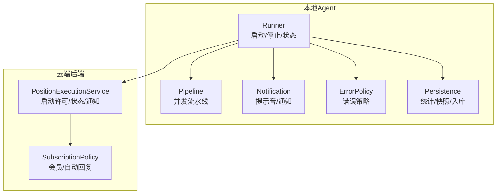
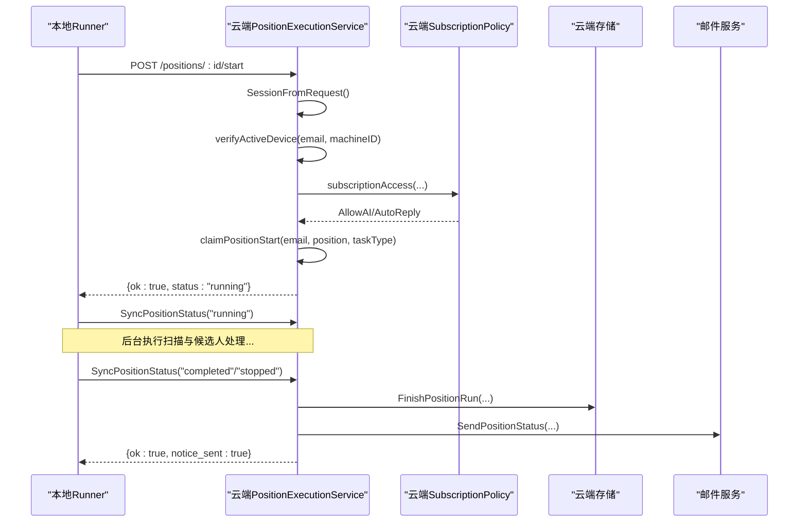
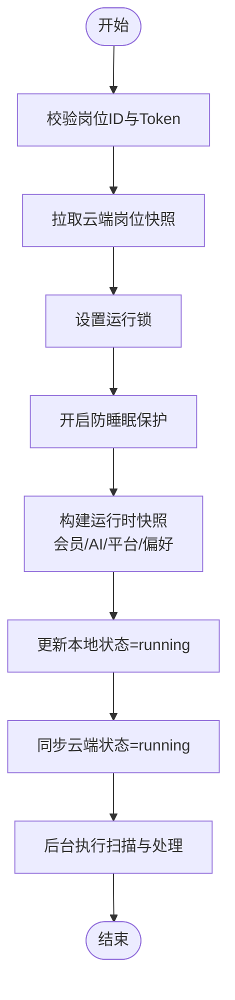
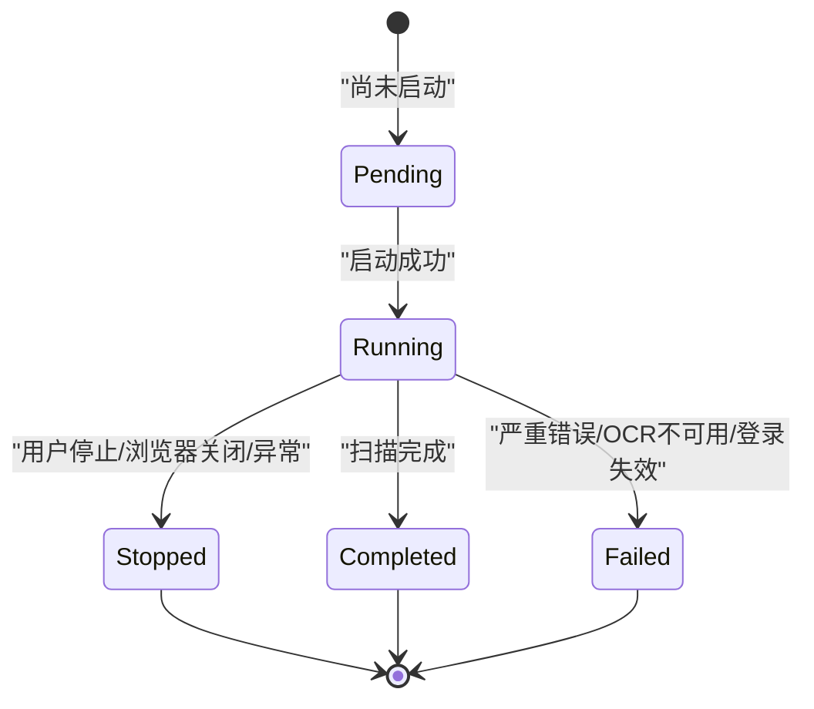
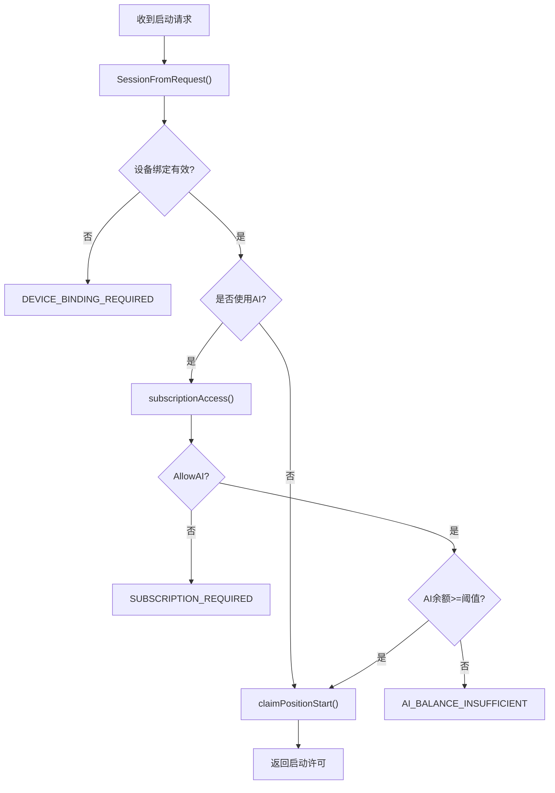
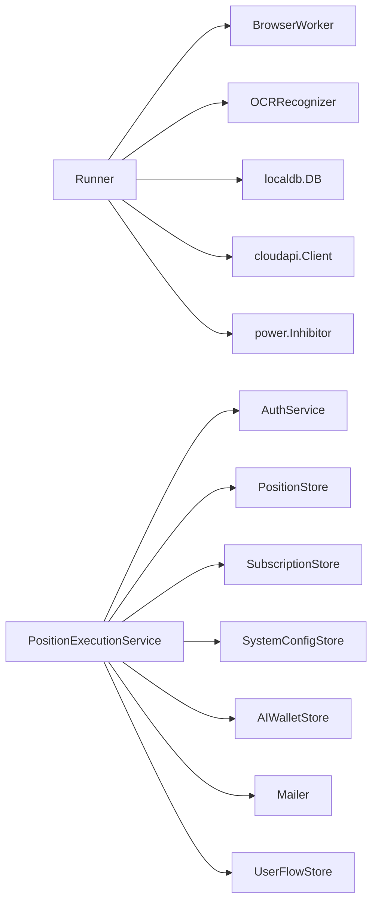

# 岗位执行引擎

<cite>
**本文引用的文件**
- [runner.go](file://goodhr5/local-agent-go/internal/positionrunner/runner.go)
- [lifecycle.go](file://goodhr5/local-agent-go/internal/positionrunner/lifecycle.go)
- [pipeline.go](file://goodhr5/local-agent-go/internal/positionrunner/pipeline.go)
- [error_policy.go](file://goodhr5/local-agent-go/internal/positionrunner/error_policy.go)
- [notification.go](file://goodhr5/local-agent-go/internal/positionrunner/notification.go)
- [persistence.go](file://goodhr5/local-agent-go/internal/positionrunner/persistence.go)
- [position_execution.go](file://goodhr5/cloud/backend/internal/httpapi/position_execution.go)
- [subscription_policy.go](file://goodhr5/cloud/backend/internal/httpapi/subscription_policy.go)
</cite>

## 目录
1. [简介](#简介)
2. [项目结构](#项目结构)
3. [核心组件](#核心组件)
4. [架构总览](#架构总览)
5. [详细组件分析](#详细组件分析)
6. [依赖关系分析](#依赖关系分析)
7. [性能与并发特性](#性能与并发特性)
8. [故障排查指南](#故障排查指南)
9. [结论](#结论)
10. [附录：状态流转与错误码](#附录状态流转与错误码)

## 简介
本文件面向“岗位执行引擎”，系统性说明本地岗位运行从启动到结束的完整生命周期，包括：
- 启动许可获取、设备绑定验证、会员套餐检查、AI余额校验
- 运行状态同步、失败处理、通知发送
- 并发控制、重试机制、错误策略
- 实际业务场景与代码级流程示意

该引擎由本地 Agent（Go）与云端后端（Go）协同完成：本地负责浏览器自动化、候选人流水线处理、统计与通知；云端负责权限校验、资源占用、状态落库与邮件通知。

## 项目结构
- 本地执行侧（local-agent-go/internal/positionrunner）
  - runner.go：Runner 定义、常量、工具函数、进度与状态结构
  - lifecycle.go：Start/Stop/Status、运行锁、防睡眠保护、停止等待、失败收尾
  - pipeline.go：候选人看详情评分的并发流水线、超时封装、AI 客户端创建
  - error_policy.go：候选人级错误追踪、连续错误停止策略、OCR 致命错误识别
  - notification.go：提示音播放、云端失败通知、状态同步（含重试）
  - persistence.go：云端统计同步、候选人结果入库、运行时快照构建、个人偏好覆盖
- 云端服务侧（cloud/backend/internal/httpapi）
  - position_execution.go：启动许可、停止、状态同步、失败通知、设备绑定校验、会员与 AI 余额校验
  - subscription_policy.go：会员套餐解析、权限计算、自动回复能力判定

**图表来源**
- [runner.go:71-86](file://goodhr5/local-agent-go/internal/positionrunner/runner.go#L71-L86)
- [lifecycle.go:15-79](file://goodhr5/local-agent-go/internal/positionrunner/lifecycle.go#L15-L79)
- [pipeline.go:49-143](file://goodhr5/local-agent-go/internal/positionrunner/pipeline.go#L49-L143)
- [notification.go:163-243](file://goodhr5/local-agent-go/internal/positionrunner/notification.go#L163-L243)
- [persistence.go:206-276](file://goodhr5/local-agent-go/internal/positionrunner/persistence.go#L206-L276)
- [position_execution.go:51-91](file://goodhr5/cloud/backend/internal/httpapi/position_execution.go#L51-L91)
- [subscription_policy.go:111-142](file://goodhr5/cloud/backend/internal/httpapi/subscription_policy.go#L111-L142)

**章节来源**
- [runner.go:71-86](file://goodhr5/local-agent-go/internal/positionrunner/runner.go#L71-L86)
- [lifecycle.go:15-79](file://goodhr5/local-agent-go/internal/positionrunner/lifecycle.go#L15-L79)
- [position_execution.go:51-91](file://goodhr5/cloud/backend/internal/httpapi/position_execution.go#L51-L91)

## 核心组件
- Runner（本地岗位运行器）
  - 职责：管理启动、停止、状态查询、运行锁、进度更新、防睡眠保护、统计与通知
  - 关键数据结构：runState、Progress、PositionRuntimeSnapshot、StartOptions
- Pipeline（候选人处理流水线）
  - 职责：按页面顺序将候选人送入并发队列，进行详情打开概率判断、AI 预评分、结果回传
  - 并发：默认并发上限为固定值，避免过度并发导致平台限流或资源耗尽
- ErrorPolicy（错误策略）
  - 职责：记录同一环节连续错误次数，达到阈值时自动停止岗位运行；识别 OCR 致命错误
- Notification（通知与提示音）
  - 职责：播放系统提示音、向云端发送失败通知、同步完成/停止状态（带重试）
- Persistence（持久化与快照）
  - 职责：构建运行时快照（会员、AI配置、平台配置）、同步统计、候选人结果入库、个人偏好覆盖
- PositionExecutionService（云端）
  - 职责：接收本地启动请求，做设备绑定校验、会员与 AI 余额校验、原子抢占名额、状态同步与邮件通知

**章节来源**
- [runner.go:71-86](file://goodhr5/local-agent-go/internal/positionrunner/runner.go#L71-L86)
- [pipeline.go:49-143](file://goodhr5/local-agent-go/internal/positionrunner/pipeline.go#L49-L143)
- [error_policy.go:15-119](file://goodhr5/local-agent-go/internal/positionrunner/error_policy.go#L15-L119)
- [notification.go:163-243](file://goodhr5/local-agent-go/internal/positionrunner/notification.go#L163-L243)
- [persistence.go:206-276](file://goodhr5/local-agent-go/internal/positionrunner/persistence.go#L206-L276)
- [position_execution.go:215-275](file://goodhr5/cloud/backend/internal/httpapi/position_execution.go#L215-L275)

## 架构总览
本地 Runner 在启动时调用云端接口获取启动许可，通过设备绑定、会员、AI余额等校验后，写入本地运行锁并进入后台执行扫描与候选人处理。执行过程中持续同步统计与状态，并在完成或失败时通知云端发送邮件。

**图表来源**
- [lifecycle.go:15-79](file://goodhr5/local-agent-go/internal/positionrunner/lifecycle.go#L15-L79)
- [position_execution.go:51-91](file://goodhr5/cloud/backend/internal/httpapi/position_execution.go#L51-L91)
- [position_execution.go:125-213](file://goodhr5/cloud/backend/internal/httpapi/position_execution.go#L125-L213)
- [subscription_policy.go:111-142](file://goodhr5/cloud/backend/internal/httpapi/subscription_policy.go#L111-L142)

## 详细组件分析

### 启动流程与许可获取
- 本地启动入口
  - 校验岗位 ID 与 Token
  - 拉取云端岗位快照并落库
  - 设置运行锁、开启防睡眠保护
  - 构建运行时快照（会员、AI配置、平台配置、个人偏好）
  - 更新本地状态为 running，并同步云端状态
  - 后台协程执行 runPosition
- 云端启动许可
  - 校验会话、读取任务类型与机器 ID
  - 设备绑定校验：必须来自当前账号绑定的稳定设备
  - 会员与 AI 余额校验：若使用 AI，需会员有效且 AI 余额不低于阈值
  - 原子抢占名额：防止同一账号同时运行多个岗位

**图表来源**
- [lifecycle.go:15-79](file://goodhr5/local-agent-go/internal/positionrunner/lifecycle.go#L15-L79)
- [persistence.go:206-276](file://goodhr5/local-agent-go/internal/positionrunner/persistence.go#L206-L276)
- [position_execution.go:51-91](file://goodhr5/cloud/backend/internal/httpapi/position_execution.go#L51-L91)

**章节来源**
- [lifecycle.go:15-79](file://goodhr5/local-agent-go/internal/positionrunner/lifecycle.go#L15-L79)
- [position_execution.go:51-91](file://goodhr5/cloud/backend/internal/httpapi/position_execution.go#L51-L91)
- [persistence.go:206-276](file://goodhr5/local-agent-go/internal/positionrunner/persistence.go#L206-L276)

### 状态管理机制
- 本地状态
  - Progress：stage/message/round/total_rounds/updated_at
  - runState：cancel、progress、analysis、emailForNotify、options、cancelReason、本次打招呼计数、详情关闭动作
  - IsRunning：受用户停止标记与终态阶段影响
  - 防睡眠保护：检测休眠恢复并取消运行中的岗位
- 云端状态
  - 支持 running/completed/stopped
  - 完成时发送状态邮件，停止时可选发送提醒
  - 失败通知统一归一化为 stopped 或 failed

**图表来源**
- [lifecycle.go:141-169](file://goodhr5/local-agent-go/internal/positionrunner/lifecycle.go#L141-L169)
- [lifecycle.go:195-241](file://goodhr5/local-agent-go/internal/positionrunner/lifecycle.go#L195-L241)
- [position_execution.go:125-213](file://goodhr5/cloud/backend/internal/httpapi/position_execution.go#L125-L213)

**章节来源**
- [lifecycle.go:195-241](file://goodhr5/local-agent-go/internal/positionrunner/lifecycle.go#L195-L241)
- [position_execution.go:125-213](file://goodhr5/cloud/backend/internal/httpapi/position_execution.go#L125-L213)

### 权限验证逻辑
- 设备绑定验证
  - 要求机器 ID 为稳定设备，且与账号存在活跃绑定
  - 未绑定或无活跃绑定返回 DEVICE_BINDING_REQUIRED
- 会员套餐检查
  - 读取系统配置的会员套餐，计算当前权限（AllowAI、AllowAutoReply）
  - 非付费或未到期则不允许使用 AI 或自动回复
- AI余额校验
  - 若岗位使用 AI，需检查 AI 钱包余额是否达到最低单位阈值
  - 不足时返回 AI_BALANCE_INSUFFICIENT

**图表来源**
- [position_execution.go:215-275](file://goodhr5/cloud/backend/internal/httpapi/position_execution.go#L215-L275)
- [subscription_policy.go:111-142](file://goodhr5/cloud/backend/internal/httpapi/subscription_policy.go#L111-L142)

**章节来源**
- [position_execution.go:215-275](file://goodhr5/cloud/backend/internal/httpapi/position_execution.go#L215-L275)
- [subscription_policy.go:111-142](file://goodhr5/cloud/backend/internal/httpapi/subscription_policy.go#L111-L142)

### 设备绑定验证
- 校验规则
  - 机器 ID 必须为稳定设备标识
  - 账号与该设备存在活跃绑定
- 失败处理
  - 返回禁止访问错误，提示刷新后台并重新连接

**章节来源**
- [position_execution.go:215-232](file://goodhr5/cloud/backend/internal/httpapi/position_execution.go#L215-L232)

### 会员套餐检查
- 解析系统配置的会员套餐，确保 free/plus/max 三类齐全
- 根据会员类型与剩余时间计算权限：
  - AllowAI：付费且未过期
  - AllowAutoReply：仅 Max 全能版允许（取决于套餐配置）
- 用于启动前限制 AI 与自动回复功能

**章节来源**
- [subscription_policy.go:45-142](file://goodhr5/cloud/backend/internal/httpapi/subscription_policy.go#L45-L142)

### AI余额校验
- 当岗位使用 AI（基础筛选或详情识别）时，检查 AI 钱包余额
- 最低单位阈值：minimumPositionAIBalanceUnits
- 余额不足时阻止启动，提示充值

**章节来源**
- [position_execution.go:234-264](file://goodhr5/cloud/backend/internal/httpapi/position_execution.go#L234-L264)

### 并发控制
- 候选人详情评分并发池
  - 默认并发上限为固定值，避免对平台造成压力
  - 每个候选人的关键操作带超时与异常捕获
- 流水线调度
  - 按页面顺序将候选人送入 AI 队列，必要时跳过不可继续的候选人
- 运行锁
  - 同一岗位 ID 仅允许一个运行实例，防止重复启动

**章节来源**
- [pipeline.go:49-143](file://goodhr5/local-agent-go/internal/positionrunner/pipeline.go#L49-L143)
- [lifecycle.go:461-472](file://goodhr5/local-agent-go/internal/positionrunner/lifecycle.go#L461-L472)

### 运行状态同步
- 启动后同步云端状态为 running
- 完成或停止时同步云端状态，并触发邮件通知
- 失败时发送失败通知，云端根据错误内容决定最终状态

**章节来源**
- [lifecycle.go:65-79](file://goodhr5/local-agent-go/internal/positionrunner/lifecycle.go#L65-L79)
- [notification.go:181-243](file://goodhr5/local-agent-go/internal/positionrunner/notification.go#L181-L243)
- [position_execution.go:125-213](file://goodhr5/cloud/backend/internal/httpapi/position_execution.go#L125-L213)

### 失败处理与通知
- 本地失败处理
  - 记录失败日志、更新本地状态为 failed
  - 播放失败提示音（如启用）
  - 发送失败通知到云端
- 云端失败处理
  - 根据错误消息归类原因（会员、AI配置、登录、运行时缺失等）
  - 发送岗位状态邮件

**章节来源**
- [lifecycle.go:313-336](file://goodhr5/local-agent-go/internal/positionrunner/lifecycle.go#L313-L336)
- [notification.go:163-179](file://goodhr5/local-agent-go/internal/positionrunner/notification.go#L163-L179)
- [position_execution.go:311-371](file://goodhr5/cloud/backend/internal/httpapi/position_execution.go#L311-L371)

### 通知发送
- 提示音播放
  - 优先使用内置音频文件，否则回退到系统提示音命令
- 云端通知
  - 失败通知：包含错误信息与本次打招呼数量
  - 完成/停止通知：携带统计信息，云端决定是否发送邮件

**章节来源**
- [notification.go:38-179](file://goodhr5/local-agent-go/internal/positionrunner/notification.go#L38-L179)
- [position_execution.go:373-406](file://goodhr5/cloud/backend/internal/httpapi/position_execution.go#L373-L406)

### 重试机制
- 云端状态同步
  - 完成状态同步最多重试 3 次，间隔 1 秒
  - 失败时记录警告日志，不阻断主流程
- 候选人操作超时
  - 每个关键操作带超时上下文，超时后记录日志并返回错误

**章节来源**
- [notification.go:193-243](file://goodhr5/local-agent-go/internal/positionrunner/notification.go#L193-L243)
- [pipeline.go:14-47](file://goodhr5/local-agent-go/internal/positionrunner/pipeline.go#L14-L47)

### 实际业务场景与代码示例路径
- 场景：用户点击“开始岗位”
  - 本地调用云端启动接口，通过设备绑定、会员、AI余额校验后获得许可
  - 本地启动 Runner，进入后台扫描与候选人处理
  - 完成后同步云端状态并发送邮件
  - 参考路径：[lifecycle.go:15-79](file://goodhr5/local-agent-go/internal/positionrunner/lifecycle.go#L15-L79)、[position_execution.go:51-91](file://goodhr5/cloud/backend/internal/httpapi/position_execution.go#L51-L91)
- 场景：AI 详情识别耗时较长
  - 使用 withOperationTimeout 包裹关键步骤，超时后记录日志并返回错误
  - 参考路径：[pipeline.go:14-47](file://goodhr5/local-agent-go/internal/positionrunner/pipeline.go#L14-L47)
- 场景：同一平台环节连续错误
  - 错误策略记录连续错误次数，达到阈值自动停止岗位运行
  - 参考路径：[error_policy.go:87-99](file://goodhr5/local-agent-go/internal/positionrunner/error_policy.go#L87-L99)

## 依赖关系分析
- 本地 Runner 依赖
  - BrowserWorker：浏览器自动化能力
  - OCRRecognizer：OCR 识别能力
  - localdb：本地 SQLite 数据库
  - cloudapi：云端 API 客户端
  - power.Inhibitor：防睡眠保护
- 云端服务依赖
  - AuthService：会话校验
  - PositionStore：岗位数据存取
  - SubscriptionStore/SystemConfigStore：会员与套餐配置
  - AIWalletStore：AI 余额查询
  - Mailer：邮件发送
  - UserFlowStore：业务流程记录

**图表来源**
- [runner.go:71-86](file://goodhr5/local-agent-go/internal/positionrunner/runner.go#L71-L86)
- [position_execution.go:21-47](file://goodhr5/cloud/backend/internal/httpapi/position_execution.go#L21-L47)

**章节来源**
- [runner.go:71-86](file://goodhr5/local-agent-go/internal/positionrunner/runner.go#L71-L86)
- [position_execution.go:21-47](file://goodhr5/cloud/backend/internal/httpapi/position_execution.go#L21-L47)

## 性能与并发特性
- 并发模型
  - 候选人详情评分采用固定并发上限，避免平台限流与资源争用
  - 每个操作带超时上下文，防止长时间阻塞
- 随机延时与抖动
  - 滚动距离、停留时间、打招呼前延时等引入随机范围，模拟人工行为
- 统计与同步
  - 增量统计落库并异步同步云端，减少 IO 阻塞
- 防睡眠保护
  - 运行期间阻止系统休眠，检测到休眠恢复后取消运行中的岗位

**章节来源**
- [pipeline.go:49-143](file://goodhr5/local-agent-go/internal/positionrunner/pipeline.go#L49-L143)
- [runner.go:420-447](file://goodhr5/local-agent-go/internal/positionrunner/runner.go#L420-L447)
- [lifecycle.go:370-459](file://goodhr5/local-agent-go/internal/positionrunner/lifecycle.go#L370-L459)

## 故障排查指南
- 常见问题定位
  - 设备绑定失败：检查机器 ID 是否为稳定设备，账号是否已绑定
  - 会员无效：确认会员类型与到期时间，查看系统套餐配置
  - AI余额不足：检查 AI 钱包余额是否达到最低阈值
  - 浏览器关闭：错误中包含浏览器关闭关键字，视为自动停止
  - OCR组件问题：识别致命错误（未安装、模型不完整、进程退出）
- 日志与通知
  - 本地日志：记录每个环节的开始、失败、超时与耗时
  - 云端邮件：完成/停止/失败均会发送邮件，失败邮件包含错误原因归类
- 重试与恢复
  - 云端状态同步失败会重试，完成邮件发送成功后才认为完成
  - 候选人操作失败不会立即停止，除非连续相同错误达到阈值

**章节来源**
- [position_execution.go:215-275](file://goodhr5/cloud/backend/internal/httpapi/position_execution.go#L215-L275)
- [error_policy.go:87-119](file://goodhr5/local-agent-go/internal/positionrunner/error_policy.go#L87-L119)
- [notification.go:163-243](file://goodhr5/local-agent-go/internal/positionrunner/notification.go#L163-L243)

## 结论
岗位执行引擎通过本地与云端的紧密协作，实现了从启动许可、权限校验、并发控制到状态同步与通知的完整闭环。其设计强调稳定性与可观测性：运行锁防止重复启动，错误策略避免局部失败扩散，通知机制保障用户知情权。开发者可依据本文档的流程与图示快速定位问题并优化性能。

## 附录：状态流转与错误码

### 状态流转图

**图表来源**
- [lifecycle.go:141-169](file://goodhr5/local-agent-go/internal/positionrunner/lifecycle.go#L141-L169)
- [position_execution.go:125-213](file://goodhr5/cloud/backend/internal/httpapi/position_execution.go#L125-L213)

### 错误码定义（云端启动失败）
- METHOD_NOT_ALLOWED：请求方法不正确
- SESSION_EXPIRED：登录状态失效
- INVALID_REQUEST：启动参数解析失败
- POSITION_NOT_FOUND：岗位不存在
- POSITION_LOAD_FAILED：岗位信息加载失败
- DEVICE_BINDING_REQUIRED：设备未绑定或无活跃绑定
- SUBSCRIPTION_CHECK_FAILED：会员状态检查失败
- SUBSCRIPTION_REQUIRED：需要有效会员才能使用 AI
- AUTO_REPLY_MAX_REQUIRED：自动回复仅限 Max 全能版
- AI_BALANCE_UNAVAILABLE：AI 余额暂时不可用
- AI_BALANCE_INSUFFICIENT：AI 余额不足
- POSITION_TASK_CONFLICT：已有岗位在运行
- POSITION_START_FAILED：云端未能记录岗位状态

**章节来源**
- [position_execution.go:51-91](file://goodhr5/cloud/backend/internal/httpapi/position_execution.go#L51-L91)
- [position_execution.go:215-275](file://goodhr5/cloud/backend/internal/httpapi/position_execution.go#L215-L275)