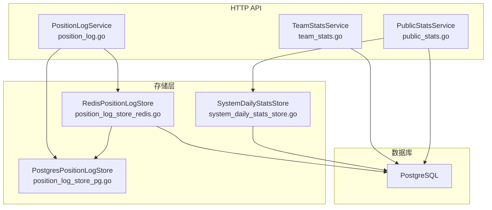
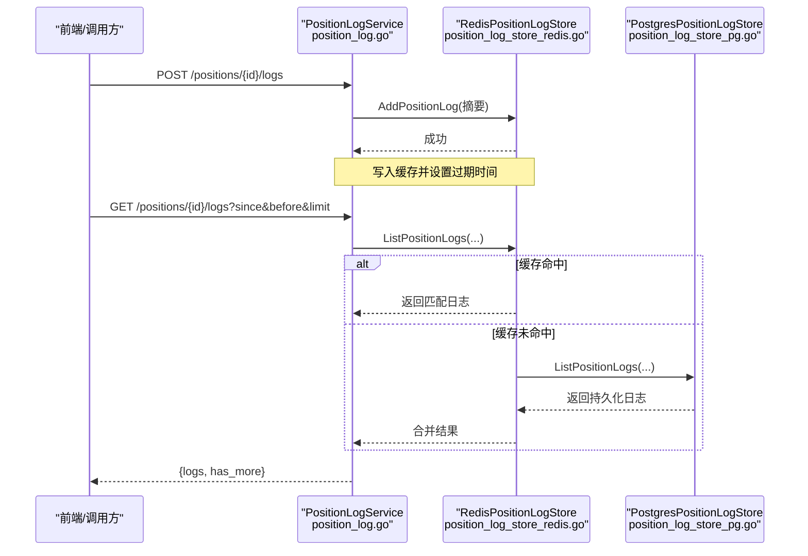
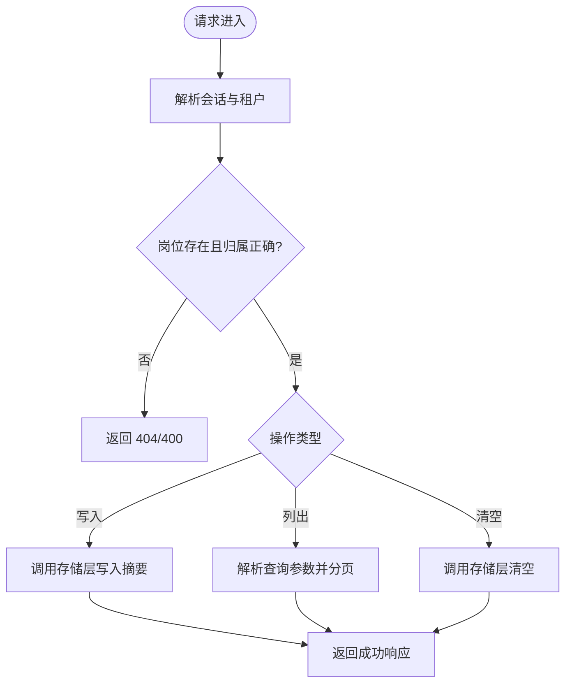
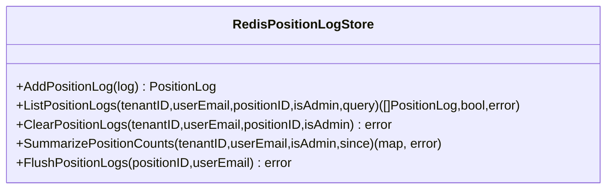
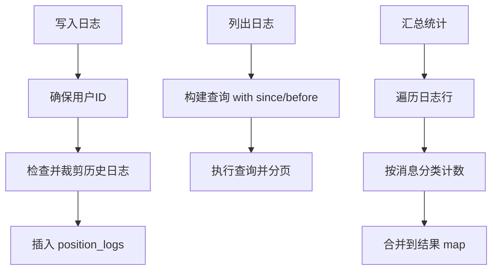
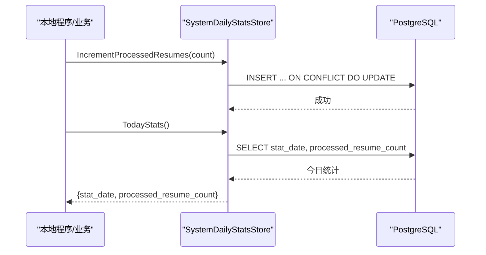
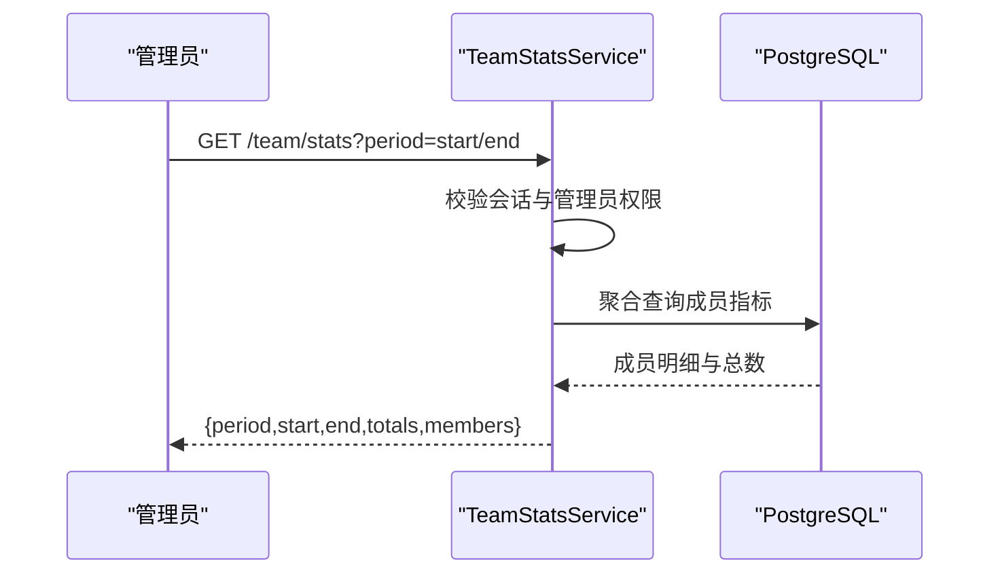
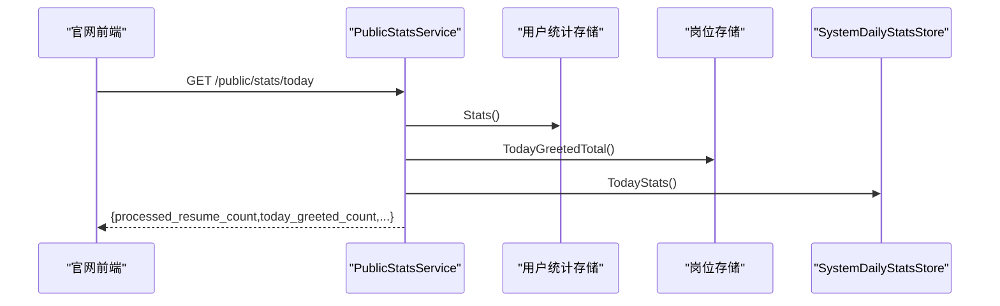
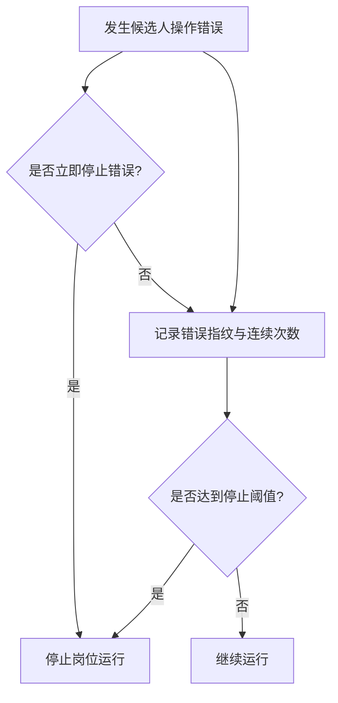
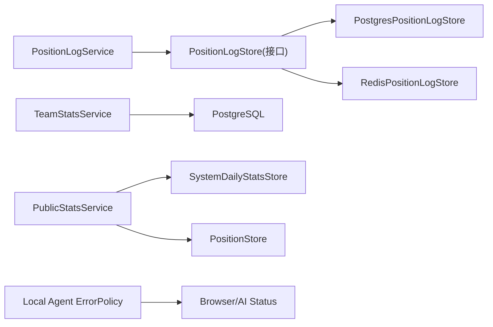

# 岗位监控统计

<cite>
**本文引用的文件**
- [position_log.go](file://goodhr5/cloud/backend/internal/httpapi/position_log.go)
- [position_log_store_pg.go](file://goodhr5/cloud/backend/internal/httpapi/position_log_store_pg.go)
- [position_log_store_redis.go](file://goodhr5/cloud/backend/internal/httpapi/position_log_store_redis.go)
- [system_daily_stats_store.go](file://goodhr5/cloud/backend/internal/httpapi/system_daily_stats_store.go)
- [public_stats.go](file://goodhr5/cloud/backend/internal/httpapi/public_stats.go)
- [team_stats.go](file://goodhr5/cloud/backend/internal/httpapi/team_stats.go)
- [0046_system_daily_stats.sql](file://goodhr5/cloud/backend/db/migrations/0046_system_daily_stats.sql)
- [error_policy.go](file://goodhr5/local-agent-go/internal/positionrunner/error_policy.go)
</cite>

## 目录
1. [简介](#简介)
2. [项目结构](#项目结构)
3. [核心组件](#核心组件)
4. [架构总览](#架构总览)
5. [详细组件分析](#详细组件分析)
6. [依赖关系分析](#依赖关系分析)
7. [性能与存储策略](#性能与存储策略)
8. [故障排查指南](#故障排查指南)
9. [结论](#结论)
10. [附录：API 与报表](#附录api-与报表)

## 简介
本系统为“岗位运行监控统计”提供云端能力，覆盖日志记录、统计数据收集、实时监控与聚合展示。重点包括：
- 岗位运行日志的写入、缓存、持久化与查询（Redis + PostgreSQL）
- 团队与个人维度的统计聚合（扫描、打招呼、跳过、失败、简历处理等）
- 官网公开统计接口（今日打招呼数、已处理简历数、注册用户数、Agent 绑定数）
- 错误分类与自动停止策略，保障运行稳定性
- 日志存储策略、查询优化与数据聚合算法说明
- 监控 API 接口、统计报表生成思路与告警配置建议

## 项目结构
后端 HTTP API 层负责暴露监控与统计接口；存储层通过 Redis 做热路径缓存，PostgreSQL 做持久化；本地 Agent 侧负责错误分类与运行控制。关键文件职责如下：
- position_log.go：岗位日志 HTTP 服务（增删查、权限校验、分页）
- position_log_store_pg.go：PostgreSQL 实现（持久化、聚合、清理）
- position_log_store_redis.go：Redis 缓存实现（追加、读取、合并、落库）
- system_daily_stats_store.go：按日统计表读写（内存/PG）
- public_stats.go：官网公开统计接口
- team_stats.go：团队管理员统计接口
- error_policy.go：候选人级错误分类与自动停止策略

**图表来源**
- [position_log.go:13-68](file://goodhr5/cloud/backend/internal/httpapi/position_log.go#L13-L68)
- [position_log_store_redis.go:16-34](file://goodhr5/cloud/backend/internal/httpapi/position_log_store_redis.go#L16-L34)
- [position_log_store_pg.go:10-21](file://goodhr5/cloud/backend/internal/httpapi/position_log_store_pg.go#L10-L21)
- [system_daily_stats_store.go:16-20](file://goodhr5/cloud/backend/internal/httpapi/system_daily_stats_store.go#L16-L20)
- [public_stats.go:6-18](file://goodhr5/cloud/backend/internal/httpapi/public_stats.go#L6-L18)
- [team_stats.go:12-23](file://goodhr5/cloud/backend/internal/httpapi/team_stats.go#L12-L23)

**章节来源**
- [position_log.go:13-68](file://goodhr5/cloud/backend/internal/httpapi/position_log.go#L13-L68)
- [position_log_store_redis.go:16-34](file://goodhr5/cloud/backend/internal/httpapi/position_log_store_redis.go#L16-L34)
- [position_log_store_pg.go:10-21](file://goodhr5/cloud/backend/internal/httpapi/position_log_store_pg.go#L10-L21)
- [system_daily_stats_store.go:16-20](file://goodhr5/cloud/backend/internal/httpapi/system_daily_stats_store.go#L16-L20)
- [public_stats.go:6-18](file://goodhr5/cloud/backend/internal/httpapi/public_stats.go#L6-L18)
- [team_stats.go:12-23](file://goodhr5/cloud/backend/internal/httpapi/team_stats.go#L12-L23)

## 核心组件
- 岗位日志服务：提供日志写入、列表、清空；支持时间范围与分页；权限隔离到用户或租户管理员。
- Redis 日志缓存：高吞吐追加、限长队列、过期清理；读取时优先命中缓存，再回源数据库。
- PostgreSQL 日志存储：持久化、按岗位/用户过滤、按时间范围查询、按消息内容聚合统计、自动裁剪历史日志。
- 系统按日统计：累加当天已处理简历数，提供今日统计查询。
- 团队统计：管理员维度聚合员工岗位运行与候选人互动指标。
- 公开统计：面向官网的今日打招呼数、已处理简历数、注册用户数、Agent 绑定数。
- 错误策略：候选人操作错误连续计数与自动停止，避免无效运行。

**章节来源**
- [position_log.go:36-203](file://goodhr5/cloud/backend/internal/httpapi/position_log.go#L36-L203)
- [position_log_store_redis.go:36-165](file://goodhr5/cloud/backend/internal/httpapi/position_log_store_redis.go#L36-L165)
- [position_log_store_pg.go:20-197](file://goodhr5/cloud/backend/internal/httpapi/position_log_store_pg.go#L20-L197)
- [system_daily_stats_store.go:36-102](file://goodhr5/cloud/backend/internal/httpapi/system_daily_stats_store.go#L36-L102)
- [team_stats.go:25-66](file://goodhr5/cloud/backend/internal/httpapi/team_stats.go#L25-L66)
- [public_stats.go:20-69](file://goodhr5/cloud/backend/internal/httpapi/public_stats.go#L20-L69)
- [error_policy.go:15-119](file://goodhr5/local-agent-go/internal/positionrunner/error_policy.go#L15-L119)

## 架构总览

**图表来源**
- [position_log.go:70-163](file://goodhr5/cloud/backend/internal/httpapi/position_log.go#L70-L163)
- [position_log_store_redis.go:36-110](file://goodhr5/cloud/backend/internal/httpapi/position_log_store_redis.go#L36-L110)
- [position_log_store_pg.go:69-123](file://goodhr5/cloud/backend/internal/httpapi/position_log_store_pg.go#L69-L123)

## 详细组件分析

### 岗位日志服务（HTTP 层）
- 写入日志：校验会话、岗位归属、解析请求体，调用存储层写入摘要。
- 列出日志：解析 since/before/limit，调用存储层分页查询，返回逆序列表。
- 清空日志：校验权限后删除该岗位日志。
- 权限模型：普通用户仅访问自身岗位；管理员可跨租户访问。

**图表来源**
- [position_log.go:70-203](file://goodhr5/cloud/backend/internal/httpapi/position_log.go#L70-L203)

**章节来源**
- [position_log.go:70-203](file://goodhr5/cloud/backend/internal/httpapi/position_log.go#L70-L203)

### Redis 日志缓存
- 追加：限制单岗位最大条数，JSON 序列化入队，设置 TTL。
- 读取：优先从缓存匹配过滤，若不足则回源数据库补齐；支持 since/before 过滤与 limit。
- 汇总：扫描所有岗位日志键，合并统计结果。
- 落库：将缓存日志排序后批量写入持久化存储并清空缓存。

**图表来源**
- [position_log_store_redis.go:16-165](file://goodhr5/cloud/backend/internal/httpapi/position_log_store_redis.go#L16-L165)

**章节来源**
- [position_log_store_redis.go:36-165](file://goodhr5/cloud/backend/internal/httpapi/position_log_store_redis.go#L36-L165)

### PostgreSQL 日志存储
- 写入：确保用户 ID，默认级别 info，写入前裁剪历史日志保持上限。
- 列表：按用户/岗位过滤，支持 since/before 与 LIMIT，返回 has_more。
- 清空：支持管理员模式按岗位清空。
- 汇总：按岗位聚合扫描/打招呼/跳过/失败次数，基于日志消息分类。

**图表来源**
- [position_log_store_pg.go:20-197](file://goodhr5/cloud/backend/internal/httpapi/position_log_store_pg.go#L20-L197)

**章节来源**
- [position_log_store_pg.go:20-197](file://goodhr5/cloud/backend/internal/httpapi/position_log_store_pg.go#L20-L197)

### 系统按日统计
- 内存实现：用于测试与本地开发，按日期 key 累加已处理简历数。
- PostgreSQL 实现：使用 UPSERT 累加当日数量；查询今日统计，无记录返回空值。

**图表来源**
- [system_daily_stats_store.go:36-102](file://goodhr5/cloud/backend/internal/httpapi/system_daily_stats_store.go#L36-L102)
- [0046_system_daily_stats.sql:1-14](file://goodhr5/cloud/backend/db/migrations/0046_system_daily_stats.sql#L1-L14)

**章节来源**
- [system_daily_stats_store.go:36-102](file://goodhr5/cloud/backend/internal/httpapi/system_daily_stats_store.go#L36-L102)
- [0046_system_daily_stats.sql:1-14](file://goodhr5/cloud/backend/db/migrations/0046_system_daily_stats.sql#L1-L14)

### 团队统计（管理员）
- 权限：仅团队管理员可访问。
- 聚合：按成员聚合岗位运行（创建数、扫描、跳过、失败）与候选人互动（简历、详情、打招呼）。
- 周期：支持 today/week/month/last_month/custom，默认本月。

**图表来源**
- [team_stats.go:25-66](file://goodhr5/cloud/backend/internal/httpapi/team_stats.go#L25-L66)
- [team_stats.go:68-133](file://goodhr5/cloud/backend/internal/httpapi/team_stats.go#L68-L133)

**章节来源**
- [team_stats.go:25-66](file://goodhr5/cloud/backend/internal/httpapi/team_stats.go#L25-L66)
- [team_stats.go:68-133](file://goodhr5/cloud/backend/internal/httpapi/team_stats.go#L68-L133)

### 公开统计（官网）
- 指标：今日打招呼总数、已处理简历数、今日注册数、Agent 绑定数。
- 数据来源：用户统计、岗位今日打招呼、系统按日统计、Agent 绑定计数。

**图表来源**
- [public_stats.go:20-69](file://goodhr5/cloud/backend/internal/httpapi/public_stats.go#L20-L69)

**章节来源**
- [public_stats.go:20-69](file://goodhr5/cloud/backend/internal/httpapi/public_stats.go#L20-L69)

### 错误分类与自动停止
- 候选人操作错误：记录同一平台环节连续相同错误次数，达到阈值自动停止岗位运行。
- 立即停止错误：如浏览器关闭、AI 定位的错误等直接终止。
- OCR 致命错误：组件未安装/配置损坏/进程不可用等。

**图表来源**
- [error_policy.go:37-119](file://goodhr5/local-agent-go/internal/positionrunner/error_policy.go#L37-L119)

**章节来源**
- [error_policy.go:37-119](file://goodhr5/local-agent-go/internal/positionrunner/error_policy.go#L37-L119)

## 依赖关系分析
- HTTP 服务依赖认证、岗位存储、日志存储、租户存储。
- 日志存储采用装饰器模式：Redis 在前，PostgreSQL 在后；读取时先缓存后回源。
- 团队统计依赖数据库聚合查询；公开统计依赖多存储组合。
- 错误策略依赖本地 AI 与浏览器状态判断。

**图表来源**
- [position_log.go:13-34](file://goodhr5/cloud/backend/internal/httpapi/position_log.go#L13-L34)
- [position_log_store_pg.go:10-21](file://goodhr5/cloud/backend/internal/httpapi/position_log_store_pg.go#L10-L21)
- [position_log_store_redis.go:16-34](file://goodhr5/cloud/backend/internal/httpapi/position_log_store_redis.go#L16-L34)
- [team_stats.go:12-23](file://goodhr5/cloud/backend/internal/httpapi/team_stats.go#L12-L23)
- [public_stats.go:6-18](file://goodhr5/cloud/backend/internal/httpapi/public_stats.go#L6-L18)
- [error_policy.go:87-119](file://goodhr5/local-agent-go/internal/positionrunner/error_policy.go#L87-L119)

**章节来源**
- [position_log.go:13-34](file://goodhr5/cloud/backend/internal/httpapi/position_log.go#L13-L34)
- [position_log_store_pg.go:10-21](file://goodhr5/cloud/backend/internal/httpapi/position_log_store_pg.go#L10-L21)
- [position_log_store_redis.go:16-34](file://goodhr5/cloud/backend/internal/httpapi/position_log_store_redis.go#L16-L34)
- [team_stats.go:12-23](file://goodhr5/cloud/backend/internal/httpapi/team_stats.go#L12-L23)
- [public_stats.go:6-18](file://goodhr5/cloud/backend/internal/httpapi/public_stats.go#L6-L18)
- [error_policy.go:87-119](file://goodhr5/local-agent-go/internal/positionrunner/error_policy.go#L87-L119)

## 性能与存储策略
- 日志写入路径：Redis 追加 O(1)，限制单岗位最大条数，TTL 自动清理。
- 日志读取路径：缓存命中直接返回；未命中回源数据库，支持 since/before 与 limit，减少 IO。
- 数据聚合：数据库层 JOIN 聚合团队指标；日志消息分类在内存中完成，避免重复计算。
- 存储裁剪：写入前检查并删除最早日志，保证单岗位日志量可控。
- 并发与超时：所有数据库操作带上下文超时，防止阻塞。

**章节来源**
- [position_log_store_redis.go:36-110](file://goodhr5/cloud/backend/internal/httpapi/position_log_store_redis.go#L36-L110)
- [position_log_store_pg.go:20-197](file://goodhr5/cloud/backend/internal/httpapi/position_log_store_pg.go#L20-L197)
- [team_stats.go:68-133](file://goodhr5/cloud/backend/internal/httpapi/team_stats.go#L68-L133)

## 故障排查指南
- 日志无法写入：检查会话有效性、岗位归属、消息是否为空；确认 Redis/PG 连接与权限。
- 日志列表为空：确认缓存是否存在；若为空则回源查询；检查 since/before 条件是否过严。
- 统计不准确：确认日志消息分类逻辑；检查团队统计时间范围是否正确；核对数据库聚合 SQL。
- 自动停止：查看候选人操作错误连续计数；检查是否触发立即停止错误（浏览器关闭、AI 错误）。
- 官网统计异常：确认系统按日统计是否累加成功；检查各存储返回值。

**章节来源**
- [position_log.go:70-203](file://goodhr5/cloud/backend/internal/httpapi/position_log.go#L70-L203)
- [position_log_store_redis.go:72-165](file://goodhr5/cloud/backend/internal/httpapi/position_log_store_redis.go#L72-L165)
- [position_log_store_pg.go:69-197](file://goodhr5/cloud/backend/internal/httpapi/position_log_store_pg.go#L69-L197)
- [error_policy.go:37-119](file://goodhr5/local-agent-go/internal/positionrunner/error_policy.go#L37-L119)
- [public_stats.go:20-69](file://goodhr5/cloud/backend/internal/httpapi/public_stats.go#L20-L69)

## 结论
本系统通过 Redis + PostgreSQL 的双层存储与精细的权限控制，实现了高吞吐的岗位日志采集与高效查询；结合团队与公开统计接口，提供了完整的监控与可视化能力。错误分类与自动停止机制保障了运行的稳定性。建议在后续迭代中增加：
- 更细粒度的告警规则（基于错误频率、失败率、性能指标）
- 更丰富的统计维度（按平台、关键词、时间段）
- 日志归档与冷热分离策略
- 指标导出与外部监控系统集成

## 附录：API 与报表

### 监控 API 定义
- 岗位日志
  - POST /api/positions/{positionId}/logs
    - 请求体：{ level, message }
    - 行为：写入岗位日志摘要，返回新增日志
  - GET /api/positions/{positionId}/logs
    - 查询参数：since(RFC3339), before(RFC3339), limit(整数)
    - 行为：返回岗位日志列表与是否有更多
  - DELETE /api/positions/{positionId}/logs
    - 行为：清空该岗位日志

- 团队统计
  - GET /team/stats
    - 查询参数：period(today|week|month|last_month|custom), start_date, end_date
    - 行为：返回团队成员统计与总计

- 公开统计
  - GET /public/stats/today
    - 行为：返回今日打招呼数、已处理简历数、注册用户数、Agent 绑定数

**章节来源**
- [position_log.go:70-203](file://goodhr5/cloud/backend/internal/httpapi/position_log.go#L70-L203)
- [team_stats.go:25-66](file://goodhr5/cloud/backend/internal/httpapi/team_stats.go#L25-L66)
- [public_stats.go:20-69](file://goodhr5/cloud/backend/internal/httpapi/public_stats.go#L20-L69)

### 统计报表生成思路
- 团队报表：基于团队统计接口，按成员导出扫描、打招呼、跳过、失败、简历与详情数量。
- 岗位报表：基于岗位日志汇总，按岗位输出扫描、打招呼、跳过、失败次数。
- 官网报表：基于公开统计接口，展示全站运营指标。

**章节来源**
- [team_stats.go:68-133](file://goodhr5/cloud/backend/internal/httpapi/team_stats.go#L68-L133)
- [position_log_store_pg.go:150-197](file://goodhr5/cloud/backend/internal/httpapi/position_log_store_pg.go#L150-L197)
- [public_stats.go:20-69](file://goodhr5/cloud/backend/internal/httpapi/public_stats.go#L20-L69)

### 告警配置建议
- 错误频率告警：当候选人操作错误连续次数达到阈值时触发告警。
- 失败率告警：当岗位失败比例超过阈值时触发告警。
- 性能告警：当日志写入延迟或数据库查询超时频繁时触发告警。
- 资源告警：当 Redis/PG 连接池耗尽或磁盘空间不足时触发告警。

**章节来源**
- [error_policy.go:87-119](file://goodhr5/local-agent-go/internal/positionrunner/error_policy.go#L87-L119)
- [position_log_store_redis.go:36-110](file://goodhr5/cloud/backend/internal/httpapi/position_log_store_redis.go#L36-L110)
- [position_log_store_pg.go:69-123](file://goodhr5/cloud/backend/internal/httpapi/position_log_store_pg.go#L69-L123)