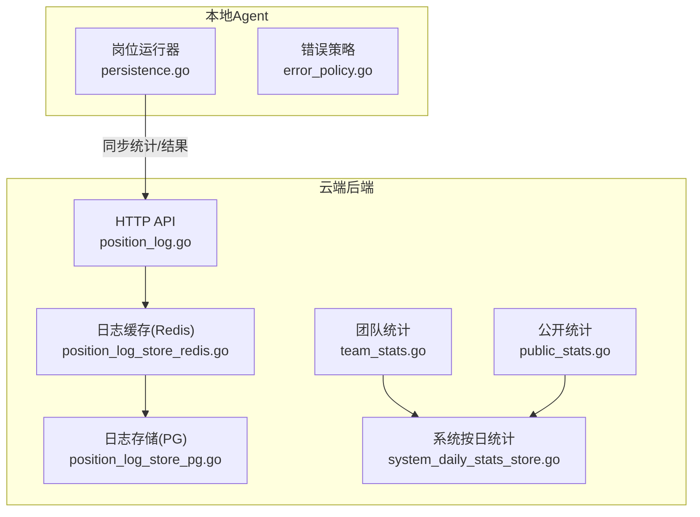
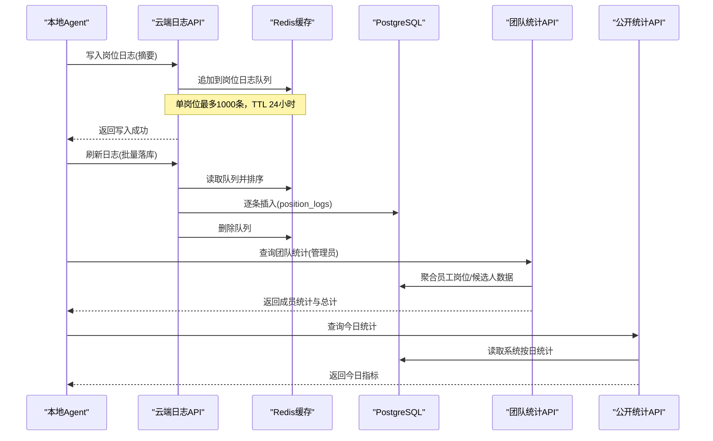
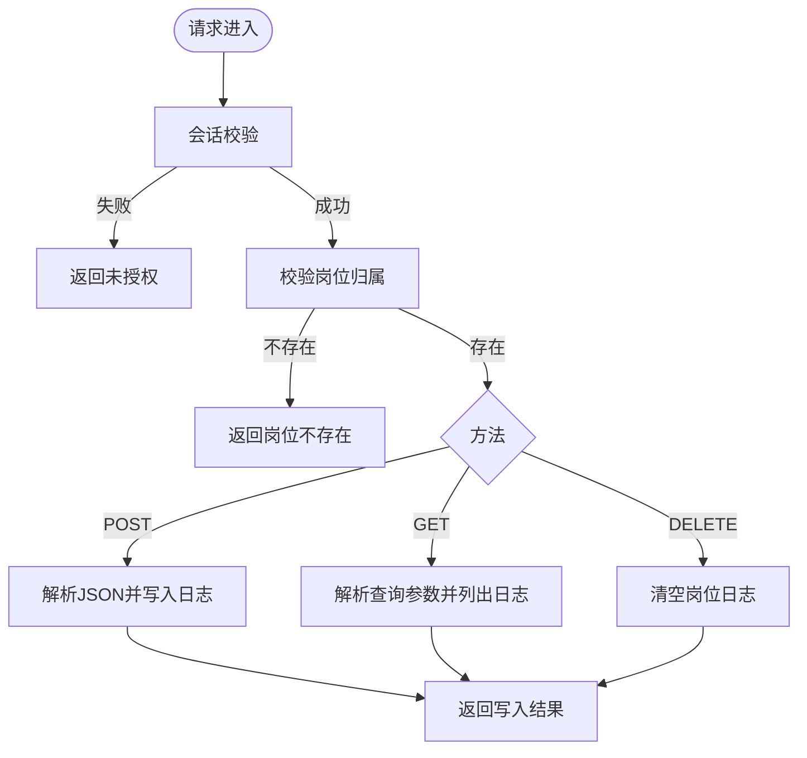
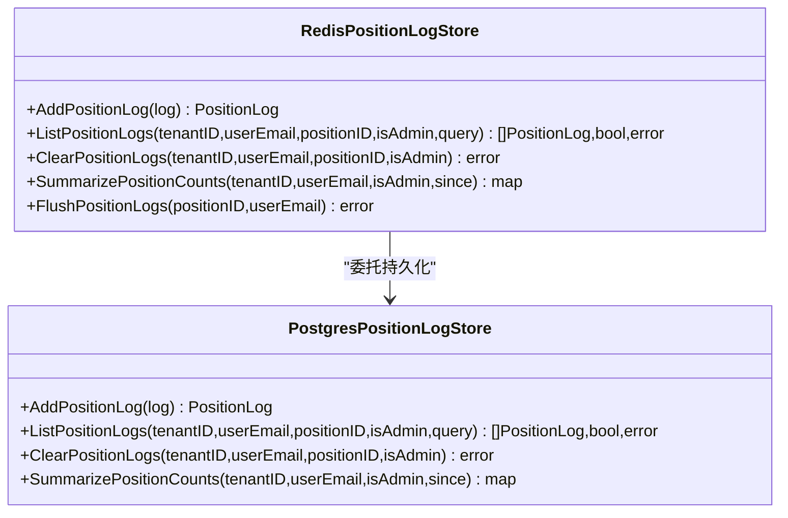
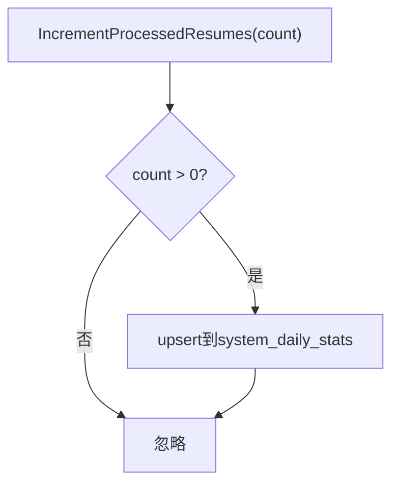
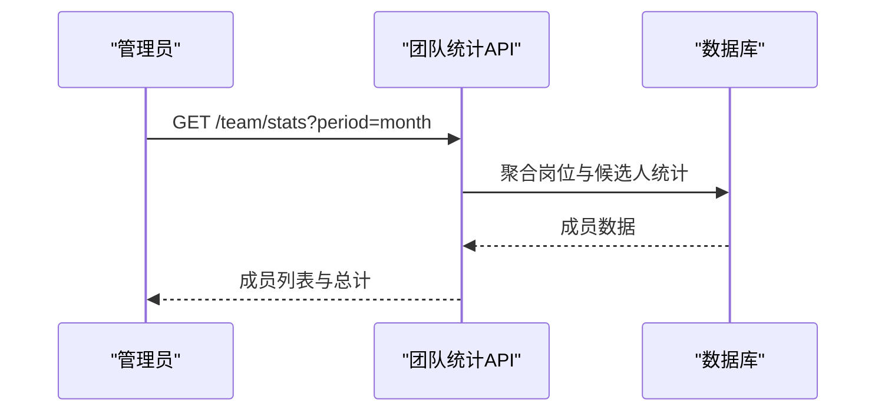
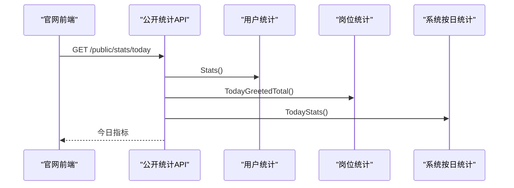
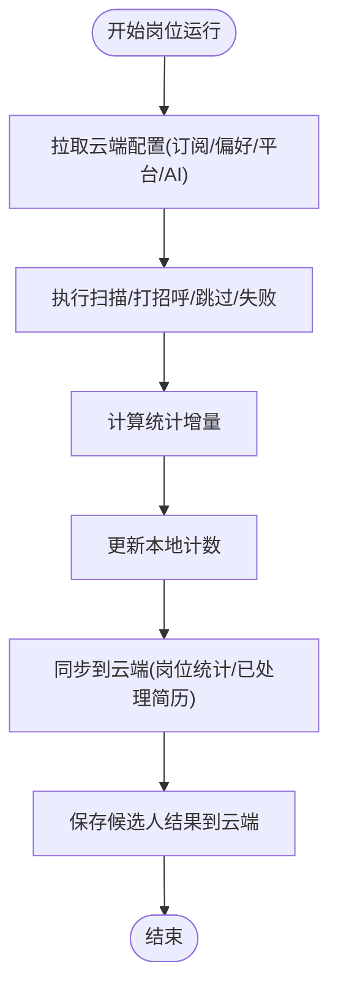
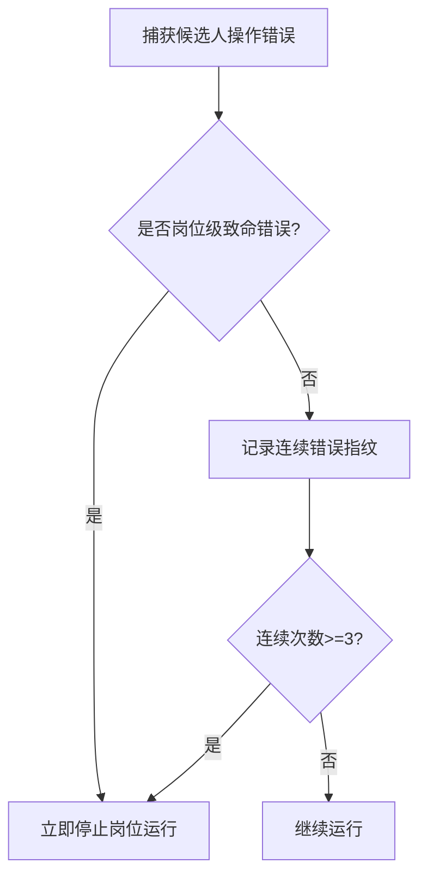
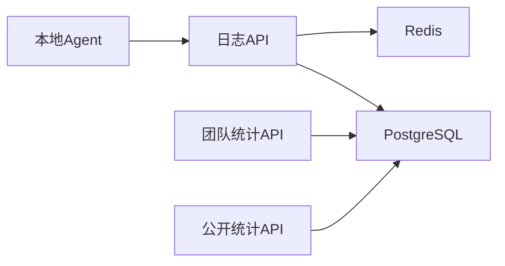

# 岗位监控统计

<cite>
**本文引用的文件**
- [position_log.go](file://goodhr5/cloud/backend/internal/httpapi/position_log.go)
- [position_log_store_pg.go](file://goodhr5/cloud/backend/internal/httpapi/position_log_store_pg.go)
- [position_log_store_redis.go](file://goodhr5/cloud/backend/internal/httpapi/position_log_store_redis.go)
- [system_daily_stats_store.go](file://goodhr5/cloud/backend/internal/httpapi/system_daily_stats_store.go)
- [team_stats.go](file://goodhr5/cloud/backend/internal/httpapi/team_stats.go)
- [public_stats.go](file://goodhr5/cloud/backend/internal/httpapi/public_stats.go)
- [error_policy.go](file://goodhr5/local-agent-go/internal/positionrunner/error_policy.go)
- [persistence.go](file://goodhr5/local-agent-go/internal/positionrunner/persistence.go)
</cite>

## 目录
1. [简介](#简介)
2. [项目结构](#项目结构)
3. [核心组件](#核心组件)
4. [架构总览](#架构总览)
5. [详细组件分析](#详细组件分析)
6. [依赖关系分析](#依赖关系分析)
7. [性能与存储策略](#性能与存储策略)
8. [故障排查指南](#故障排查指南)
9. [结论](#结论)
10. [附录：API 与使用示例](#附录api-与使用示例)

## 简介
本系统为“岗位运行监控统计”提供端到端的采集、缓存、持久化、聚合与展示能力，覆盖以下关键目标：
- 日志记录机制：岗位运行期日志先入 Redis 缓存，再批量落库；支持按岗位分页查询、清空与增量同步。
- 统计数据收集：本地 Agent 在扫描、打招呼、跳过、失败等动作发生时累计计数，并定时同步至云端；同时维护系统级按日统计（如已处理简历数）。
- 实时监控功能：通过 Redis 缓存实现低延迟的日志读取；团队统计接口提供管理员视角的汇总报表。
- 监控维度：运行日志级别、错误分类、性能指标（超时、重试）、使用统计（扫描/打招呼/跳过/失败/已处理简历）。
- 存储与查询优化：Redis 列表缓存 + PostgreSQL 持久化；时间范围过滤、限制条数、去重合并；按用户/租户隔离。
- 告警与容错：连续错误自动停止岗位运行；OCR/AI 等关键组件异常识别与降级。

## 项目结构
后端服务位于 cloud/backend，提供 HTTP API 与数据存储实现；本地 Agent 位于 local-agent-go，负责浏览器自动化、候选人处理、统计同步与错误策略。

**图表来源**
- [position_log.go:1-303](file://goodhr5/cloud/backend/internal/httpapi/position_log.go#L1-L303)
- [position_log_store_pg.go:1-236](file://goodhr5/cloud/backend/internal/httpapi/position_log_store_pg.go#L1-L236)
- [position_log_store_redis.go:1-245](file://goodhr5/cloud/backend/internal/httpapi/position_log_store_redis.go#L1-L245)
- [system_daily_stats_store.go:1-103](file://goodhr5/cloud/backend/internal/httpapi/system_daily_stats_store.go#L1-L103)
- [team_stats.go:1-204](file://goodhr5/cloud/backend/internal/httpapi/team_stats.go#L1-L204)
- [public_stats.go:1-70](file://goodhr5/cloud/backend/internal/httpapi/public_stats.go#L1-L70)
- [persistence.go:1-402](file://goodhr5/local-agent-go/internal/positionrunner/persistence.go#L1-L402)
- [error_policy.go:1-119](file://goodhr5/local-agent-go/internal/positionrunner/error_policy.go#L1-L119)

**章节来源**
- [position_log.go:1-303](file://goodhr5/cloud/backend/internal/httpapi/position_log.go#L1-L303)
- [position_log_store_pg.go:1-236](file://goodhr5/cloud/backend/internal/httpapi/position_log_store_pg.go#L1-L236)
- [position_log_store_redis.go:1-245](file://goodhr5/cloud/backend/internal/httpapi/position_log_store_redis.go#L1-L245)
- [system_daily_stats_store.go:1-103](file://goodhr5/cloud/backend/internal/httpapi/system_daily_stats_store.go#L1-L103)
- [team_stats.go:1-204](file://goodhr5/cloud/backend/internal/httpapi/team_stats.go#L1-L204)
- [public_stats.go:1-70](file://goodhr5/cloud/backend/internal/httpapi/public_stats.go#L1-L70)
- [persistence.go:1-402](file://goodhr5/local-agent-go/internal/positionrunner/persistence.go#L1-L402)
- [error_policy.go:1-119](file://goodhr5/local-agent-go/internal/positionrunner/error_policy.go#L1-L119)

## 核心组件
- 岗位日志服务：提供写入、列出、清空日志摘要的 HTTP 接口，并进行权限校验与归属控制。
- 日志存储层：
  - Redis 缓存：高吞吐写入、快速读取、过期清理、批量落库。
  - PostgreSQL 持久化：按用户/岗位隔离，支持时间范围查询与数量上限裁剪。
- 系统按日统计：内存与 PostgreSQL 双实现，用于官网展示“已处理简历数”。
- 团队统计：管理员视角的员工维度统计聚合（岗位运行次数、扫描/打招呼/跳过/失败、简历/详情/打招呼人数）。
- 公开统计：面向官网的今日统计（注册、打招呼、已处理简历、Agent 绑定数）。
- 本地 Agent 运行器：统计增量计算、云端同步、候选人结果入库、AI 异步输出合并。
- 错误策略：同一环节连续错误自动停止岗位运行，OCR/AI 致命错误识别。

**章节来源**
- [position_log.go:1-303](file://goodhr5/cloud/backend/internal/httpapi/position_log.go#L1-L303)
- [position_log_store_pg.go:1-236](file://goodhr5/cloud/backend/internal/httpapi/position_log_store_pg.go#L1-L236)
- [position_log_store_redis.go:1-245](file://goodhr5/cloud/backend/internal/httpapi/position_log_store_redis.go#L1-L245)
- [system_daily_stats_store.go:1-103](file://goodhr5/cloud/backend/internal/httpapi/system_daily_stats_store.go#L1-L103)
- [team_stats.go:1-204](file://goodhr5/cloud/backend/internal/httpapi/team_stats.go#L1-L204)
- [public_stats.go:1-70](file://goodhr5/cloud/backend/internal/httpapi/public_stats.go#L1-L70)
- [persistence.go:1-402](file://goodhr5/local-agent-go/internal/positionrunner/persistence.go#L1-L402)
- [error_policy.go:1-119](file://goodhr5/local-agent-go/internal/positionrunner/error_policy.go#L1-L119)

## 架构总览
岗位运行期间，本地 Agent 将动作事件转化为结构化日志与统计增量，优先写入 Redis 缓存；云端服务提供实时读取与持久化落库。团队与公开统计从数据库或缓存中聚合数据，供前端展示。

**图表来源**
- [position_log.go:1-303](file://goodhr5/cloud/backend/internal/httpapi/position_log.go#L1-L303)
- [position_log_store_redis.go:1-245](file://goodhr5/cloud/backend/internal/httpapi/position_log_store_redis.go#L1-L245)
- [position_log_store_pg.go:1-236](file://goodhr5/cloud/backend/internal/httpapi/position_log_store_pg.go#L1-L236)
- [team_stats.go:1-204](file://goodhr5/cloud/backend/internal/httpapi/team_stats.go#L1-L204)
- [public_stats.go:1-70](file://goodhr5/cloud/backend/internal/httpapi/public_stats.go#L1-L70)
- [system_daily_stats_store.go:1-103](file://goodhr5/cloud/backend/internal/httpapi/system_daily_stats_store.go#L1-L103)

## 详细组件分析

### 岗位日志服务（HTTP API）
- 职责：认证鉴权、岗位归属校验、日志写入/列出/清空、查询参数解析与限流。
- 关键点：
  - 写入前校验岗位归属，避免越权写入。
  - 支持 since/before/limit 分页查询，默认限制 100，最大 300。
  - 返回列表顺序反转以满足前端阅读习惯。
  - 支持 Flush 接口将缓存日志批量落库。

**图表来源**
- [position_log.go:1-303](file://goodhr5/cloud/backend/internal/httpapi/position_log.go#L1-L303)

**章节来源**
- [position_log.go:1-303](file://goodhr5/cloud/backend/internal/httpapi/position_log.go#L1-L303)

### 日志存储层（Redis + PostgreSQL）
- Redis 缓存：
  - 写入：每条日志序列化为 JSON 推入列表，限制单岗位最多 1000 条，设置 TTL 24 小时。
  - 读取：优先从缓存读取匹配项，若不足则回退到持久化存储进行合并与分页。
  - 清空：删除缓存键并调用持久化层的清空逻辑。
  - 汇总：扫描所有 position_logs:* 键，合并统计到结果集。
- PostgreSQL 持久化：
  - 写入：确保用户 ID，裁剪历史日志以维持上限，插入并返回。
  - 列出：按用户/岗位过滤，支持 since/before 时间范围，ORDER BY created_at DESC，LIMIT+1 判断 has_more。
  - 清空：按用户/岗位或管理员模式删除。
  - 汇总：JOIN positions/users，按 message 分类统计扫描/打招呼/跳过/失败。

**图表来源**
- [position_log_store_redis.go:1-245](file://goodhr5/cloud/backend/internal/httpapi/position_log_store_redis.go#L1-L245)
- [position_log_store_pg.go:1-236](file://goodhr5/cloud/backend/internal/httpapi/position_log_store_pg.go#L1-L236)

**章节来源**
- [position_log_store_redis.go:1-245](file://goodhr5/cloud/backend/internal/httpapi/position_log_store_redis.go#L1-L245)
- [position_log_store_pg.go:1-236](file://goodhr5/cloud/backend/internal/httpapi/position_log_store_pg.go#L1-L236)

### 系统按日统计
- 内存实现：适用于测试与本地开发，按日期累加已处理简历数。
- PostgreSQL 实现：使用 upsert 保证并发安全，查询当天统计，无行时返回空值。

**图表来源**
- [system_daily_stats_store.go:1-103](file://goodhr5/cloud/backend/internal/httpapi/system_daily_stats_store.go#L1-L103)

**章节来源**
- [system_daily_stats_store.go:1-103](file://goodhr5/cloud/backend/internal/httpapi/system_daily_stats_store.go#L1-L103)

### 团队统计（管理员视图）
- 权限：仅团队管理员可访问。
- 聚合：LEFT JOIN users 与岗位/候选人统计表，按时间段（today/week/month/last_month/custom）聚合。
- 返回：成员列表与总计（岗位创建数、扫描/打招呼/跳过/失败、简历/详情/打招呼人数）。

**图表来源**
- [team_stats.go:1-204](file://goodhr5/cloud/backend/internal/httpapi/team_stats.go#L1-L204)

**章节来源**
- [team_stats.go:1-204](file://goodhr5/cloud/backend/internal/httpapi/team_stats.go#L1-L204)

### 公开统计（官网展示）
- 指标：今日已处理简历数、今日打招呼总数、今日注册用户数、Agent 绑定数。
- 数据来源：用户统计、岗位今日打招呼总数、系统按日统计、Agent 绑定计数。

**图表来源**
- [public_stats.go:1-70](file://goodhr5/cloud/backend/internal/httpapi/public_stats.go#L1-L70)
- [system_daily_stats_store.go:1-103](file://goodhr5/cloud/backend/internal/httpapi/system_daily_stats_store.go#L1-L103)

**章节来源**
- [public_stats.go:1-70](file://goodhr5/cloud/backend/internal/httpapi/public_stats.go#L1-L70)

### 本地 Agent 运行器（统计同步与结果入库）
- 统计同步：
  - 增量计算：current vs persisted 差值，更新本地计数并同步到云端。
  - 已处理简历数：去重后新增候选人数量，调用云端接口累加系统按日统计。
- 结果入库：
  - 组装 payload（含 AI 评分与原因），透传 run_id 以便云端归组。
  - 异步等待图片详情 AI 完整输出，合并后再入库。
- 配置加载：启动时拉取订阅状态、个人偏好、平台配置与 AI 配置，校验完整性。

**图表来源**
- [persistence.go:1-402](file://goodhr5/local-agent-go/internal/positionrunner/persistence.go#L1-L402)

**章节来源**
- [persistence.go:1-402](file://goodhr5/local-agent-go/internal/positionrunner/persistence.go#L1-L402)

### 错误策略（自动停止与致命错误识别）
- 连续错误：同一平台环节出现相同错误指纹达阈值（≥3）时，自动停止岗位运行。
- 致命错误：OCR 组件未安装/未配置/进程退出等直接判定为不可恢复错误。
- 立即停止：AI 或浏览器关闭导致的岗位级错误立即终止。

**图表来源**
- [error_policy.go:1-119](file://goodhr5/local-agent-go/internal/positionrunner/error_policy.go#L1-L119)

**章节来源**
- [error_policy.go:1-119](file://goodhr5/local-agent-go/internal/positionrunner/error_policy.go#L1-L119)

## 依赖关系分析
- 组件耦合：
  - 日志服务依赖认证、岗位存储、日志存储与租户存储，形成清晰的职责边界。
  - Redis 存储对 PostgreSQL 存储进行委托，解耦读写路径。
  - 团队统计与公开统计依赖数据库与系统按日统计接口。
  - 本地 Agent 通过云端 API 与后端交互，完成统计同步与结果入库。
- 外部依赖：
  - Redis：高性能缓存与队列。
  - PostgreSQL：持久化与复杂聚合查询。
  - 云端 API：统一入口，承载业务逻辑与权限控制。

**图表来源**
- [position_log.go:1-303](file://goodhr5/cloud/backend/internal/httpapi/position_log.go#L1-L303)
- [position_log_store_redis.go:1-245](file://goodhr5/cloud/backend/internal/httpapi/position_log_store_redis.go#L1-L245)
- [position_log_store_pg.go:1-236](file://goodhr5/cloud/backend/internal/httpapi/position_log_store_pg.go#L1-L236)
- [team_stats.go:1-204](file://goodhr5/cloud/backend/internal/httpapi/team_stats.go#L1-L204)
- [public_stats.go:1-70](file://goodhr5/cloud/backend/internal/httpapi/public_stats.go#L1-L70)
- [persistence.go:1-402](file://goodhr5/local-agent-go/internal/positionrunner/persistence.go#L1-L402)

**章节来源**
- [position_log.go:1-303](file://goodhr5/cloud/backend/internal/httpapi/position_log.go#L1-L303)
- [position_log_store_redis.go:1-245](file://goodhr5/cloud/backend/internal/httpapi/position_log_store_redis.go#L1-L245)
- [position_log_store_pg.go:1-236](file://goodhr5/cloud/backend/internal/httpapi/position_log_store_pg.go#L1-L236)
- [team_stats.go:1-204](file://goodhr5/cloud/backend/internal/httpapi/team_stats.go#L1-L204)
- [public_stats.go:1-70](file://goodhr5/cloud/backend/internal/httpapi/public_stats.go#L1-L70)
- [persistence.go:1-402](file://goodhr5/local-agent-go/internal/positionrunner/persistence.go#L1-L402)

## 性能与存储策略
- 日志写入：
  - 先写 Redis 列表，限制单岗位 1000 条，TTL 24 小时，降低数据库压力。
  - 批量落库时按时间排序，避免乱序。
- 日志读取：
  - 优先从缓存读取，不足时回退到数据库，合并结果并按 limit 截断。
  - 支持 since/before 时间范围过滤，减少不必要的数据传输。
- 数据聚合：
  - 团队统计使用单次 SQL 聚合，避免多次往返。
  - 公开统计组合多个来源，尽量并行或缓存热点数据。
- 存储上限：
  - 写入前检查并裁剪历史日志，保持每岗位固定上限。
- 超时与重试：
  - 数据库与网络操作设置超时，避免阻塞。
  - 统计同步失败记录警告日志，不影响主流程。

[本节为通用性能建议，不直接分析具体文件]

## 故障排查指南
- 日志无法显示：
  - 检查 Redis 缓存是否存在且未过期；确认 Flush 是否成功。
  - 查看 PostgreSQL 是否有对应岗位与用户的日志记录。
- 统计不同步：
  - 检查云端 API 调用是否超时或失败；查看警告日志。
  - 确认 Token 与 CloudRunID 是否正确传递。
- 团队统计为空：
  - 确认当前用户是否为团队管理员；检查时间段参数。
  - 验证数据库关联表是否有数据。
- 公开统计异常：
  - 检查系统按日统计是否写入；确认各来源接口可用性。
- 岗位运行自动停止：
  - 查看连续错误指纹与次数；定位平台环节问题。
  - 检查 OCR/AI 组件状态与配置。

**章节来源**
- [position_log_store_redis.go:1-245](file://goodhr5/cloud/backend/internal/httpapi/position_log_store_redis.go#L1-L245)
- [position_log_store_pg.go:1-236](file://goodhr5/cloud/backend/internal/httpapi/position_log_store_pg.go#L1-L236)
- [team_stats.go:1-204](file://goodhr5/cloud/backend/internal/httpapi/team_stats.go#L1-L204)
- [public_stats.go:1-70](file://goodhr5/cloud/backend/internal/httpapi/public_stats.go#L1-L70)
- [error_policy.go:1-119](file://goodhr5/local-agent-go/internal/positionrunner/error_policy.go#L1-L119)
- [persistence.go:1-402](file://goodhr5/local-agent-go/internal/positionrunner/persistence.go#L1-L402)

## 结论
本系统通过“Redis 缓存 + PostgreSQL 持久化”的双层存储架构，实现了高吞吐、低延迟的岗位运行日志与统计能力。结合权限控制、时间范围过滤与上限裁剪，既保证了数据安全，又提升了查询性能。本地 Agent 与云端服务的协同，使得统计与结果入库可靠稳定；错误策略确保在异常情况下及时止损。整体方案易于扩展，可支撑多租户、多平台的规模化运行。

[本节为总结性内容，不直接分析具体文件]

## 附录：API 与使用示例

### 岗位日志 API
- 写入日志
  - 方法：POST
  - 路径：/api/positions/{positionId}/logs
  - 请求体：{ level, message }
  - 响应：{ ok, log }
- 列出日志
  - 方法：GET
  - 路径：/api/positions/{positionId}/logs?since=&before=&limit=
  - 响应：{ ok, logs[], has_more }
- 清空日志
  - 方法：DELETE
  - 路径：/api/positions/{positionId}/logs
  - 响应：{ ok }

**章节来源**
- [position_log.go:1-303](file://goodhr5/cloud/backend/internal/httpapi/position_log.go#L1-L303)

### 团队统计 API
- 获取团队统计
  - 方法：GET
  - 路径：/team/stats?period=today|week|month|last_month|custom&start_date=&end_date=
  - 响应：{ ok, period, start_date, end_date, totals, members[] }

**章节来源**
- [team_stats.go:1-204](file://goodhr5/cloud/backend/internal/httpapi/team_stats.go#L1-L204)

### 公开统计 API
- 获取今日统计
  - 方法：GET
  - 路径：/public/stats/today
  - 响应：{ ok, processed_resume_count, today_greeted_count, today_registered_count, agent_binding_count, ..._label }

**章节来源**
- [public_stats.go:1-70](file://goodhr5/cloud/backend/internal/httpapi/public_stats.go#L1-L70)

### 本地 Agent 统计同步
- 已处理简历数同步
  - 触发：去重后的新增候选人数量
  - 调用：云端接口累加系统按日统计
- 岗位运行统计同步
  - 字段：scanned_count, greeted_count, skipped_count, failed_count
  - 调用：云端接口更新岗位运行列表
- 候选人结果入库
  - 字段：包含 AI 评分与原因，可选 run_id 归组
  - 异步：等待图片详情 AI 完整输出后合并入库

**章节来源**
- [persistence.go:1-402](file://goodhr5/local-agent-go/internal/positionrunner/persistence.go#L1-L402)