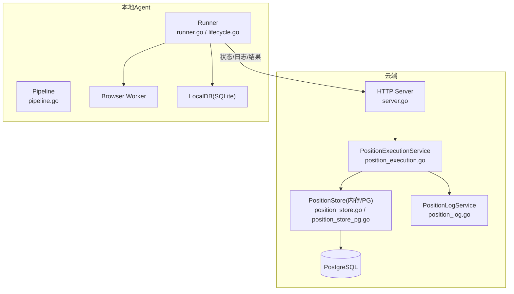
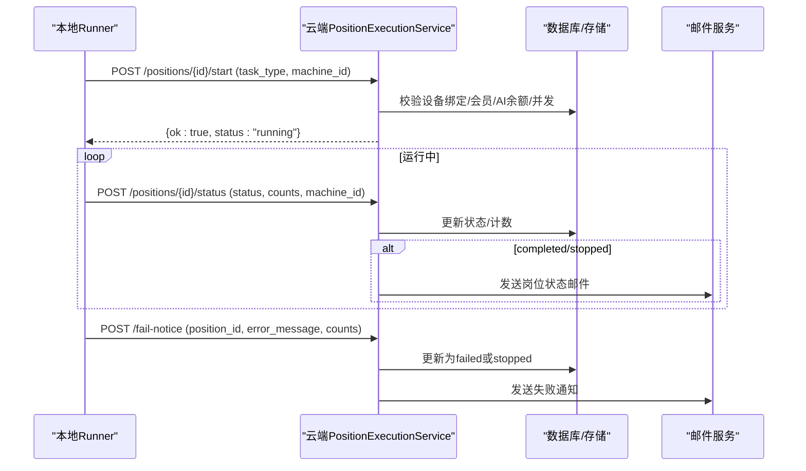
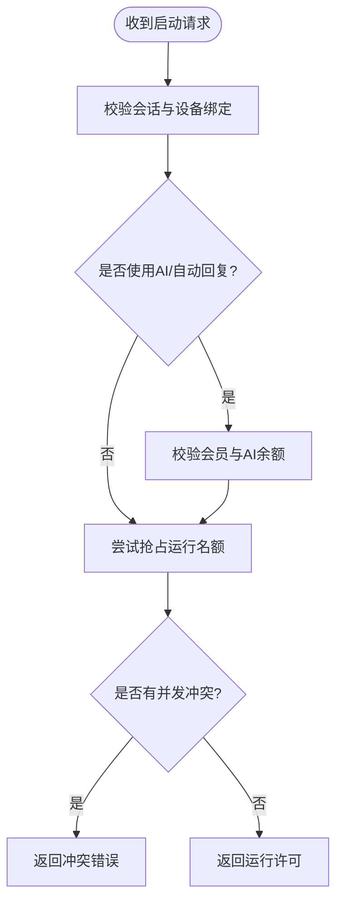
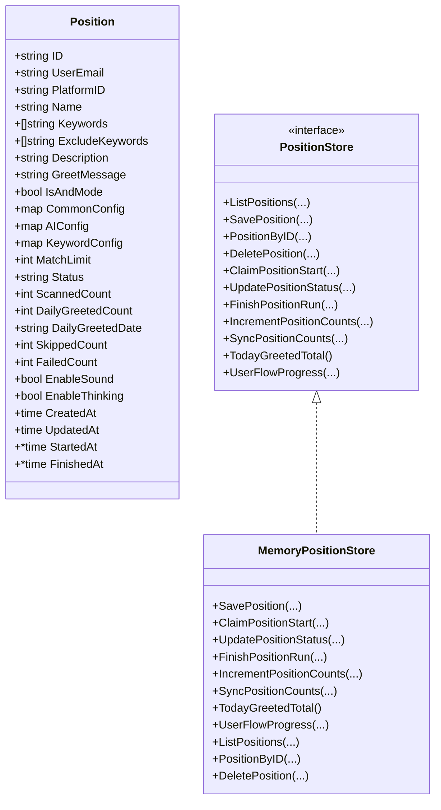
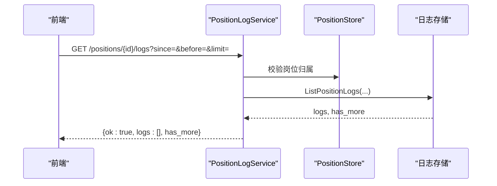
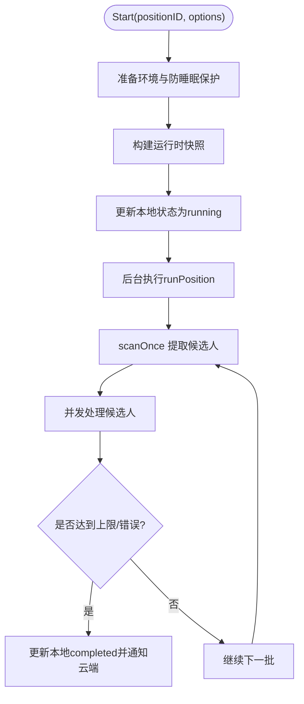
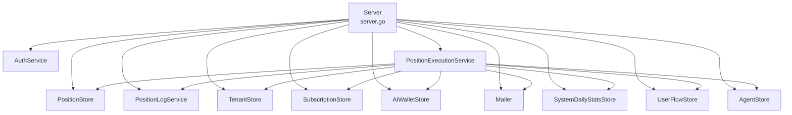
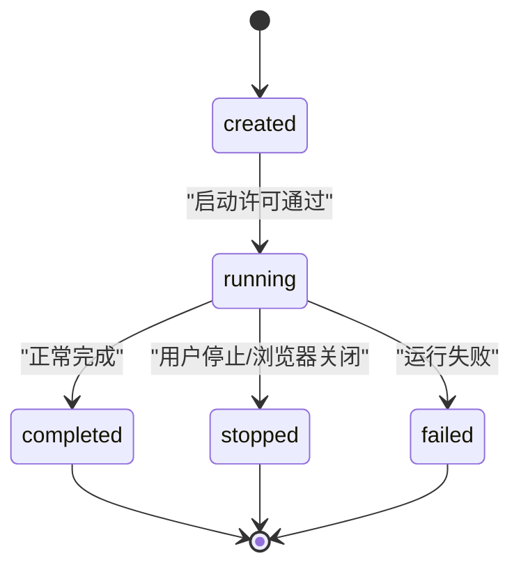

# 岗位运行管理

<cite>
**本文引用的文件**
- [position_execution.go](file://goodhr5/cloud/backend/internal/httpapi/position_execution.go)
- [position_store.go](file://goodhr5/cloud/backend/internal/httpapi/position_store.go)
- [position_log.go](file://goodhr5/cloud/backend/internal/httpapi/position_log.go)
- [server.go](file://goodhr5/cloud/backend/internal/httpapi/server.go)
- [0001_initial_schema.sql](file://goodhr5/cloud/backend/db/migrations/0001_initial_schema.sql)
- [runner.go](file://goodhr5/local-agent-go/internal/positionrunner/runner.go)
- [pipeline.go](file://goodhr5/local-agent-go/internal/positionrunner/pipeline.go)
- [lifecycle.go](file://goodhr5/local-agent-go/internal/positionrunner/lifecycle.go)
- [runtime.go](file://goodhr5/local-agent-go/internal/platformcore/runtime.go)
</cite>

## 目录
1. [简介](#简介)
2. [项目结构](#项目结构)
3. [核心组件](#核心组件)
4. [架构总览](#架构总览)
5. [详细组件分析](#详细组件分析)
6. [依赖关系分析](#依赖关系分析)
7. [性能与缓存策略](#性能与缓存策略)
8. [故障排查指南](#故障排查指南)
9. [结论](#结论)
10. [附录：API 规范与状态流转](#附录api-规范与状态流转)

## 简介
本系统提供“岗位运行管理”的云端与本地协同能力：云端负责岗位配置、权限校验、运行许可、状态同步、日志摘要与通知；本地 Agent 负责浏览器自动化执行、候选人筛选、AI 评分、打招呼、截图与 OCR，并将运行结果和日志回传云端。文档围绕岗位配置的 CRUD、运行状态管理、任务调度机制、执行引擎、日志记录、监控统计、数据库模型、缓存策略、性能优化、API 接口规范、状态流转图与错误处理方案展开，帮助开发者理解并扩展岗位管理功能。

## 项目结构
- 云端后端（Go）
  - HTTP API 路由与服务装配：server.go
  - 岗位执行服务：position_execution.go
  - 岗位存储接口与内存实现：position_store.go
  - 岗位日志服务：position_log.go
  - 数据库迁移：0001_initial_schema.sql
- 本地 Agent（Go + Node Worker）
  - 岗位运行器：runner.go、lifecycle.go、pipeline.go
  - 平台运行时统一接口：runtime.go

**图表来源**
- [server.go:124-200](file://goodhr5/cloud/backend/internal/httpapi/server.go#L124-L200)
- [position_execution.go:21-47](file://goodhr5/cloud/backend/internal/httpapi/position_execution.go#L21-L47)
- [position_store.go:49-62](file://goodhr5/cloud/backend/internal/httpapi/position_store.go#L49-L62)
- [position_log.go:13-34](file://goodhr5/cloud/backend/internal/httpapi/position_log.go#L13-L34)
- [runner.go:71-86](file://goodhr5/local-agent-go/internal/positionrunner/runner.go#L71-L86)
- [pipeline.go:49-116](file://goodhr5/local-agent-go/internal/positionrunner/pipeline.go#L49-L116)

**章节来源**
- [server.go:124-200](file://goodhr5/cloud/backend/internal/httpapi/server.go#L124-L200)
- [0001_initial_schema.sql:52-135](file://goodhr5/cloud/backend/db/migrations/0001_initial_schema.sql#L52-L135)

## 核心组件
- 云端岗位执行服务：负责启动许可、设备绑定校验、会员/AI余额检查、并发冲突控制、状态同步与邮件通知。
- 岗位存储层：定义 Position 数据模型与持久化接口，提供内存实现与 PostgreSQL 实现。
- 岗位日志服务：提供日志写入、查询、清空与分页能力，支持 Redis 缓存与持久化落盘。
- 本地 Runner：管理岗位生命周期、扫描流水线、并发处理、超时保护、防睡眠保护、停止与完成流程。
- 平台运行时接口：抽象各招聘平台的浏览器操作，统一入口页、列表、详情、打招呼等能力。

**章节来源**
- [position_execution.go:21-47](file://goodhr5/cloud/backend/internal/httpapi/position_execution.go#L21-L47)
- [position_store.go:14-62](file://goodhr5/cloud/backend/internal/httpapi/position_store.go#L14-L62)
- [position_log.go:13-34](file://goodhr5/cloud/backend/internal/httpapi/position_log.go#L13-L34)
- [runner.go:71-86](file://goodhr5/local-agent-go/internal/positionrunner/runner.go#L71-L86)
- [runtime.go:10-74](file://goodhr5/local-agent-go/internal/platformcore/runtime.go#L10-L74)

## 架构总览
云端与本地通过 HTTP 接口协作：
- 本地 Runner 启动前向云端申请启动许可，云端校验设备绑定、会员与 AI 余额、并发占用后允许运行。
- 运行中本地周期性上报状态（running/completed/stopped），云端更新岗位状态并发送邮件通知。
- 失败时本地上报失败原因，云端归类原因并发送通知。
- 日志以摘要形式上传云端，便于前端展示与审计。

**图表来源**
- [position_execution.go:51-91](file://goodhr5/cloud/backend/internal/httpapi/position_execution.go#L51-L91)
- [position_execution.go:125-213](file://goodhr5/cloud/backend/internal/httpapi/position_execution.go#L125-L213)
- [position_execution.go:311-371](file://goodhr5/cloud/backend/internal/httpapi/position_execution.go#L311-L371)
- [lifecycle.go:15-79](file://goodhr5/local-agent-go/internal/positionrunner/lifecycle.go#L15-L79)

## 详细组件分析

### 云端岗位执行服务（PositionExecutionService）
- 启动许可：校验登录会话、设备绑定、岗位归属、会员权限、AI 余额、并发冲突，通过后返回 running。
- 状态同步：接收 running/completed/stopped，幂等更新状态，首次变更时发送邮件通知。
- 失败通知：接收错误信息，归类原因，更新状态并发送邮件。
- 用户流程记录：记录岗位开始、首次打招呼成功等关键事件。

**图表来源**
- [position_execution.go:51-91](file://goodhr5/cloud/backend/internal/httpapi/position_execution.go#L51-L91)
- [position_execution.go:234-275](file://goodhr5/cloud/backend/internal/httpapi/position_execution.go#L234-L275)

**章节来源**
- [position_execution.go:51-91](file://goodhr5/cloud/backend/internal/httpapi/position_execution.go#L51-L91)
- [position_execution.go:125-213](file://goodhr5/cloud/backend/internal/httpapi/position_execution.go#L125-L213)
- [position_execution.go:311-371](file://goodhr5/cloud/backend/internal/httpapi/position_execution.go#L311-L371)

### 岗位存储层（PositionStore）
- 数据模型：包含岗位名称、关键词、排除词、问候语、匹配模式、AI/通用/关键词配置、匹配上限、运行状态、统计计数、时间戳等。
- 接口能力：列出、保存、按ID读取、删除、抢占运行、更新状态、结束运行、累计统计、同步统计、今日打招呼汇总、用户流程进度推导。
- 内存实现：线程安全，维护业务日期重置逻辑，保证并发安全与幂等性。

**图表来源**
- [position_store.go:14-62](file://goodhr5/cloud/backend/internal/httpapi/position_store.go#L14-L62)
- [position_store.go:64-300](file://goodhr5/cloud/backend/internal/httpapi/position_store.go#L64-L300)

**章节来源**
- [position_store.go:14-62](file://goodhr5/cloud/backend/internal/httpapi/position_store.go#L14-L62)
- [position_store.go:64-300](file://goodhr5/cloud/backend/internal/httpapi/position_store.go#L64-L300)

### 岗位日志服务（PositionLogService）
- 写入：内部方法可无会话写入，外部 API 需认证并校验岗位归属。
- 查询：支持 since/before/limit 分页，返回从旧到新的顺序。
- 清空：仅清空指定岗位的日志摘要。
- 持久化：支持可刷新的缓存存储（如 Redis）与持久化存储（如 PostgreSQL）。

**图表来源**
- [position_log.go:56-164](file://goodhr5/cloud/backend/internal/httpapi/position_log.go#L56-L164)

**章节来源**
- [position_log.go:36-121](file://goodhr5/cloud/backend/internal/httpapi/position_log.go#L36-L121)
- [position_log.go:123-203](file://goodhr5/cloud/backend/internal/httpapi/position_log.go#L123-L203)

### 本地岗位运行器（Runner）
- 生命周期：Start 准备环境、创建运行锁、防睡眠保护、构建运行时快照、更新本地状态为 running、后台执行 runPosition。
- 扫描流水线：scanOnce 提取候选人，feedCandidatePipeline 送入并发工作池，withOperationTimeout 包裹每个候选人的关键操作，确保超时与异常捕获。
- 停止与完成：Stop 标记用户停止并等待当前候选人处理完成；runPosition 结束时更新本地状态为 completed，并通知云端。
- 进度与状态：Progress 返回阶段、消息、轮次与更新时间；IsRunning 判断是否仍在运行。

**图表来源**
- [lifecycle.go:15-79](file://goodhr5/local-agent-go/internal/positionrunner/lifecycle.go#L15-L79)
- [lifecycle.go:81-139](file://goodhr5/local-agent-go/internal/positionrunner/lifecycle.go#L81-L139)
- [pipeline.go:14-116](file://goodhr5/local-agent-go/internal/positionrunner/pipeline.go#L14-L116)

**章节来源**
- [lifecycle.go:15-79](file://goodhr5/local-agent-go/internal/positionrunner/lifecycle.go#L15-L79)
- [lifecycle.go:81-139](file://goodhr5/local-agent-go/internal/positionrunner/lifecycle.go#L81-L139)
- [pipeline.go:14-116](file://goodhr5/local-agent-go/internal/positionrunner/pipeline.go#L14-L116)
- [runner.go:71-86](file://goodhr5/local-agent-go/internal/positionrunner/runner.go#L71-L86)

### 平台运行时接口（Runtime）
- 统一抽象：OpenEntryPage、PrepareEntryPage、IsPositionEntryPage、CurrentPositionName、SelectPosition、ListVisibleCandidates、ScrollCandidateList、FetchCandidateDetail、CloseCandidateDetail、GreetCandidate、CandidateFilterText、CandidateFingerprint、CleanCandidateDetailText。
- 可选能力：基础筛选应用、打招呼后索要信息、搜索准备、直接选择岗位、跳过岗位选择、详情滚动。

```mermaid
classDiagram
class Runtime {
<<interface>>
+OpenEntryPage(ctx, exec, cfg, entryURL) error
+PrepareEntryPage(ctx, exec, cfg) error
+IsPositionEntryPage(ctx, exec, cfg) bool
+CurrentPositionName(ctx, exec, cfg) string
+SelectPosition(ctx, exec, cfg, name) error
+ListVisibleCandidates(ctx, exec, cfg, maxItems) []Candidate
+ScrollCandidateList(ctx, exec, cfg, distance) error
+FetchCandidateDetail(ctx, exec, cfg, candidate, request) DetailResult
+CloseCandidateDetail(ctx, exec, cfg, candidate) error
+GreetCandidate(ctx, exec, cfg, candidate) error
+CandidateFilterText(candidate) string
+CandidateFingerprint(candidate) string
+CleanCandidateDetailText(text) string
}
class BasicFilterApplier {
<<interface>>
+ApplyBasicFilters(ctx, exec, cfg, snapshot) error
}
class CandidateInfoRequester {
<<interface>>
+RequestCandidateInfo(ctx, exec, cfg, candidate, request) error
}
class PositionSearchPreparer {
<<interface>>
+PreparePositionSearch(ctx, exec, cfg, snapshot) error
}
class DirectPositionSelector {
<<interface>>
+ShouldSelectPositionDirectly() bool
}
class PositionSelectionSkipper {
<<interface>>
+ShouldSkipPositionSelection() bool
}
class DetailAnalysisScroller {
<<interface>>
+ScrollCandidateDetail(ctx, exec, cfg, candidate, distance) error
}
```

**图表来源**
- [runtime.go:10-111](file://goodhr5/local-agent-go/internal/platformcore/runtime.go#L10-L111)

**章节来源**
- [runtime.go:10-111](file://goodhr5/local-agent-go/internal/platformcore/runtime.go#L10-L111)

## 依赖关系分析
- 云端服务装配：Server 在 NewServer 中注入各服务依赖，包括认证、租户、订阅、AI钱包、岗位、日志、候选人、支付、运行时配置等。
- 岗位执行依赖：PositionExecutionService 依赖认证、岗位存储、日志服务、租户、平台账号、候选人、订阅、系统配置、AI钱包、邮件、每日统计、用户流程、代理存储。
- 本地 Runner 依赖：Runner 依赖本地数据库、浏览器 Worker、OCR、电源抑制器、云 API 客户端。

**图表来源**
- [server.go:46-121](file://goodhr5/cloud/backend/internal/httpapi/server.go#L46-L121)
- [position_execution.go:21-47](file://goodhr5/cloud/backend/internal/httpapi/position_execution.go#L21-L47)

**章节来源**
- [server.go:46-121](file://goodhr5/cloud/backend/internal/httpapi/server.go#L46-L121)

## 性能与缓存策略
- 并发控制
  - 云端并发：通过 ClaimPositionStart 原子抢占运行名额，避免同一账号多任务并发。
  - 本地并发：候选人详情评分采用默认并发数（例如 5），限制每批最大处理数量，防止资源过载。
- 超时与重试
  - 每个候选人关键操作设置超时（如 AI 预评分、详情获取、打招呼等），并在日志中记录耗时与错误。
  - 页面加载与滚动距离带随机抖动，降低平台反爬检测风险。
- 缓存与持久化
  - 日志支持可刷新缓存（如 Redis）与持久化存储（PostgreSQL），减少高频写入压力。
  - 岗位统计按日重置，避免跨天累积误差。
- 资源保护
  - 本地运行启用防睡眠保护，避免系统休眠导致任务中断。
  - 停止流程优雅等待当前候选人处理完成，避免数据不一致。

[本节为通用性能讨论，不直接分析具体文件]

## 故障排查指南
- 启动失败常见原因
  - 设备未绑定：返回 DEVICE_BINDING_REQUIRED，需在后台刷新并重新连接本地程序。
  - 会员过期或套餐不足：返回 SUBSCRIPTION_REQUIRED 或 AUTO_REPLY_MAX_REQUIRED，需续费或升级套餐。
  - AI 余额不足：返回 AI_BALANCE_INSUFFICIENT，需充值 AI 余额。
  - 并发冲突：返回 POSITION_TASK_CONFLICT，需先停止当前任务。
- 运行中错误
  - 浏览器关闭：本地自动结束并通知云端，状态置为 stopped。
  - 认证过期：云端返回认证错误，本地停止并清理。
- 日志与通知
  - 失败通知会归类原因（如会员、AI 配置、登录态、运行时缺失等），并发送邮件提醒。
  - 可通过日志接口查看最近日志，必要时清空历史日志。

**章节来源**
- [position_execution.go:215-275](file://goodhr5/cloud/backend/internal/httpapi/position_execution.go#L215-L275)
- [position_execution.go:311-371](file://goodhr5/cloud/backend/internal/httpapi/position_execution.go#L311-L371)
- [lifecycle.go:81-139](file://goodhr5/local-agent-go/internal/positionrunner/lifecycle.go#L81-L139)

## 结论
本系统通过云端与本地的职责分离与紧密协作，实现了岗位配置的灵活管理、运行状态的可靠同步、任务调度的并发控制与超时保护、日志与通知的完整闭环。开发者可基于统一的平台运行时接口扩展新招聘平台，或通过调整并发、超时、概率等参数优化执行效率与稳定性。

[本节为总结，不直接分析具体文件]

## 附录：API 规范与状态流转

### 云端 API 概览
- 健康检查：/health
- 认证：/api/auth/send-code、/api/auth/login、/api/auth/me
- 本地代理：/api/agents/bind、/api/agents/current、/api/agents/ws、/api/agents/ws-status
- 用户流程：/api/user-flow
- AI 配置与钱包：/api/config/user-ai、/api/config/effective-ai、/api/config/test-ai、/api/ai-wallet、/api/ai-wallet/records、/api/ai-wallet/use-builtin、/api/ai-compatible/v1/chat/completions
- 订阅与支付：/api/subscription/status、/api/subscription/plans、/api/payment/orders、/api/payment/ai-balance、/api/payment/orders/、/api/payment/notify/wechat、/api/admin/payment/orders
- 运行时配置：/api/runtime/config
- 邀请与激活码：/api/invitations/summary、/api/activation-codes/redeem、/api/admin/activation-codes
- 管理员：/api/admin/users、/api/admin/users/unbind-agent、/api/admin/users/adjust-ai-balance、/api/admin/users/batch-adjust、/api/admin/emails、/api/admin/emails/upload-image、/api/admin/emails/、/api/public/email-jobs/、/api/public/mail/open
- 平台账号：/api/platform-accounts、/api/platform-accounts/create、/api/platform-accounts/
- 岗位：/api/positions、/api/positions/optimize-requirement、/api/positions/
- 简历库：/api/candidates、/api/candidates/、/api/candidates/{id}/notes
- 平台配置与应用配置：/api/platforms/config/、/api/system/app-config、/api/system/local-agent-updates、/api/system/local-agent-console-url、/api/system/default-prompts、/api/admin/system/configs/、/api/admin/platforms/config/
- 失败通知：/api/fail-notice

**章节来源**
- [server.go:124-200](file://goodhr5/cloud/backend/internal/httpapi/server.go#L124-L200)

### 岗位运行相关 API
- 启动许可：POST /api/positions/{id}/start
  - 请求体：{ task_type, machine_id }
  - 响应：{ ok, status }
- 状态同步：POST /api/positions/{id}/status
  - 请求体：{ status, task_type, run_greeted_count, run_skipped_count, machine_id }
  - 响应：{ ok, status, notice_sent }
- 停止：POST /api/positions/{id}/stop
  - 响应：{ ok, status }
- 失败通知：POST /api/fail-notice
  - 请求体：{ position_id, error_message, run_greeted_count, run_skipped_count }
  - 响应：{ ok, status }

**章节来源**
- [position_execution.go:51-91](file://goodhr5/cloud/backend/internal/httpapi/position_execution.go#L51-L91)
- [position_execution.go:93-123](file://goodhr5/cloud/backend/internal/httpapi/position_execution.go#L93-L123)
- [position_execution.go:125-213](file://goodhr5/cloud/backend/internal/httpapi/position_execution.go#L125-L213)
- [position_execution.go:311-371](file://goodhr5/cloud/backend/internal/httpapi/position_execution.go#L311-L371)

### 数据库模型设计
- users：云端登录用户
- local_agents：本地 Agent 连接记录
- platform_accounts：平台账号映射（不含真实 cookie/profile）
- positions：岗位配置（含关键词、排除词、问候语、匹配模式、AI/通用/关键词配置、匹配上限、状态、统计、时间戳）
- user_ai_configs：用户自定义 AI 配置
- task_runs：云端任务运行记录（摘要）
- task_logs：云端任务日志摘要

**章节来源**
- [0001_initial_schema.sql:7-135](file://goodhr5/cloud/backend/db/migrations/0001_initial_schema.sql#L7-L135)

### 状态流转图

**图表来源**
- [position_store.go:152-172](file://goodhr5/cloud/backend/internal/httpapi/position_store.go#L152-L172)
- [lifecycle.go:81-139](file://goodhr5/local-agent-go/internal/positionrunner/lifecycle.go#L81-L139)

### 错误处理方案
- 统一错误码：启动失败返回稳定错误码（如 DEVICE_BINDING_REQUIRED、SUBSCRIPTION_REQUIRED、AI_BALANCE_INSUFFICIENT、POSITION_TASK_CONFLICT）。
- 失败归类：根据错误信息归类原因（会员、AI 配置、登录态、运行时缺失等），便于统计与提示。
- 幂等更新：状态同步与结束运行支持幂等，避免重复通知与重复计数。
- 通知保障：邮件发送失败记录日志，不影响主流程继续。

**章节来源**
- [position_execution.go:215-275](file://goodhr5/cloud/backend/internal/httpapi/position_execution.go#L215-L275)
- [position_execution.go:311-371](file://goodhr5/cloud/backend/internal/httpapi/position_execution.go#L311-L371)