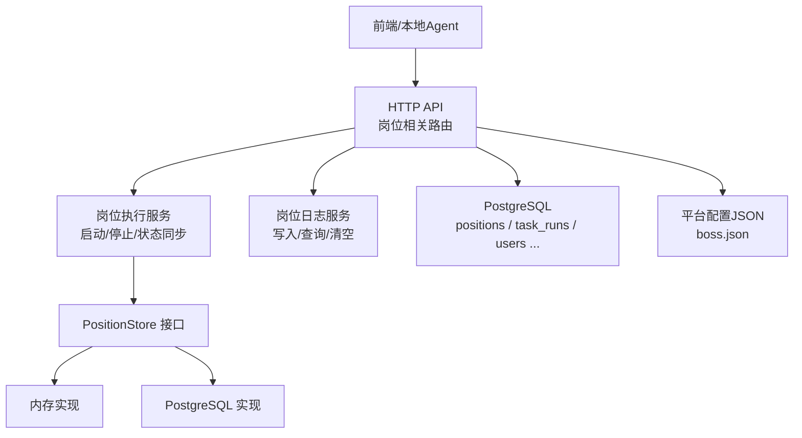
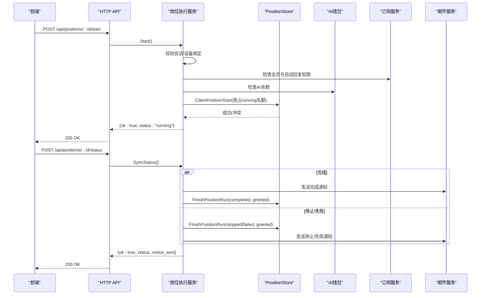
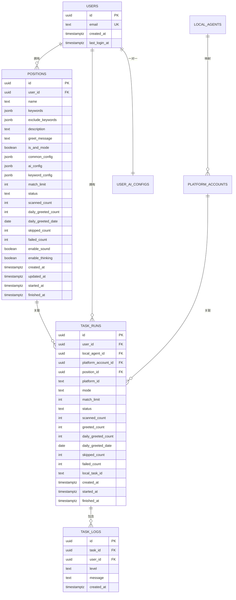
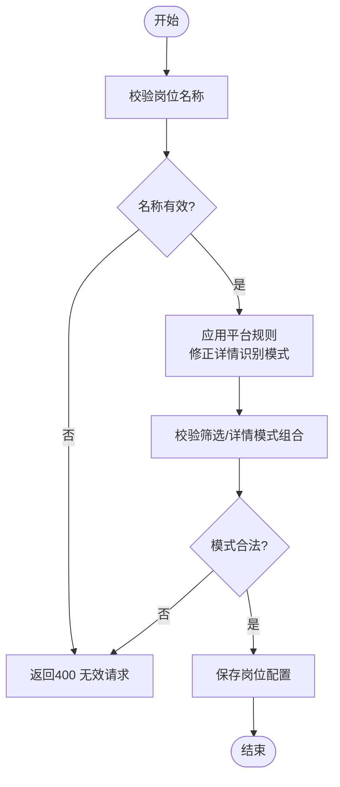
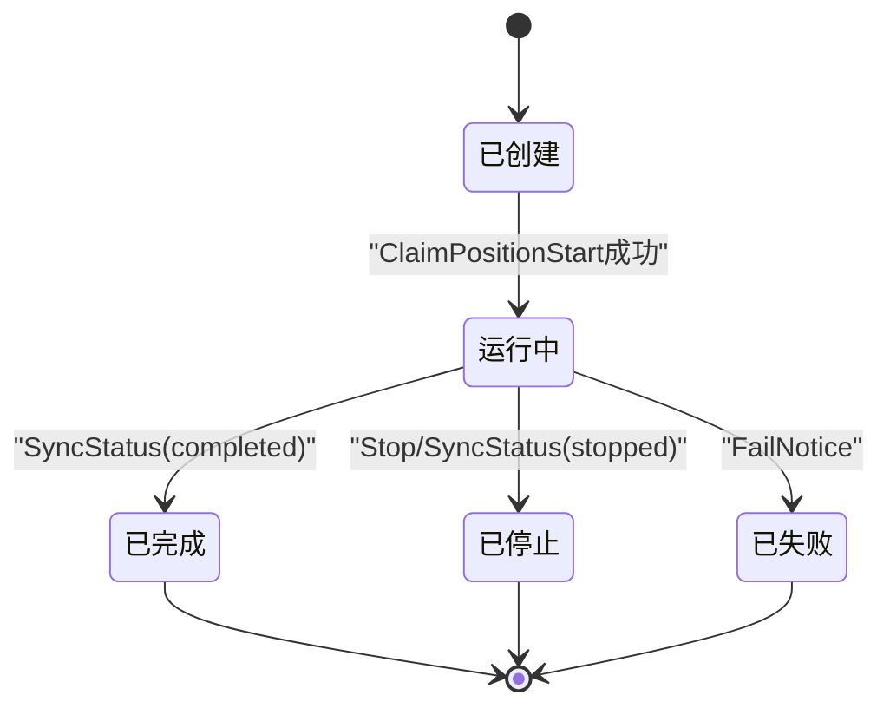
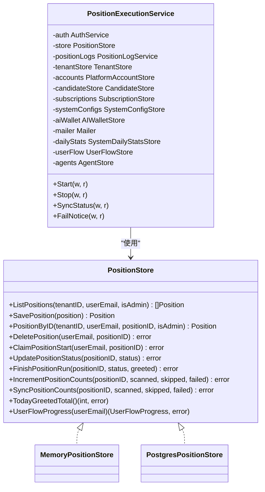

# 岗位配置管理

<cite>
**本文引用的文件**
- [0001_initial_schema.sql](file://goodhr5/cloud/backend/db/migrations/0001_initial_schema.sql)
- [0009_position_template_configs.sql](file://goodhr5/cloud/backend/db/migrations/0009_position_template_configs.sql)
- [position_store.go](file://goodhr5/cloud/backend/internal/httpapi/position_store.go)
- [position_store_pg.go](file://goodhr5/cloud/backend/internal/httpapi/position_store_pg.go)
- [position_execution.go](file://goodhr5/cloud/backend/internal/httpapi/position_execution.go)
- [position_log.go](file://goodhr5/cloud/backend/internal/httpapi/position_log.go)
- [position_test.go](file://goodhr5/cloud/backend/internal/httpapi/position_test.go)
- [boss.json](file://goodhr5/cloud/backend/boss.json)
</cite>

## 目录
1. [简介](#简介)
2. [项目结构](#项目结构)
3. [核心组件](#核心组件)
4. [架构总览](#架构总览)
5. [详细组件分析](#详细组件分析)
6. [依赖关系分析](#依赖关系分析)
7. [性能与扩展性](#性能与扩展性)
8. [故障排查指南](#故障排查指南)
9. [结论](#结论)
10. [附录：API 规范与配置示例](#附录api-规范与配置示例)

## 简介
本文件面向“岗位配置管理系统”，系统性说明岗位的创建、读取、更新、删除（CRUD）、运行参数、AI 配置、搜索条件、模板机制、默认值处理、数据库表结构、API 接口规范、错误处理方案，以及典型业务场景与代码级参考路径。目标是帮助开发者快速理解并扩展岗位配置能力。

## 项目结构
后端采用分层设计：
- HTTP API 层：负责请求解析、鉴权、校验、编排调用服务。
- 领域服务层：封装岗位运行、日志、订阅、钱包等跨域规则。
- 存储抽象层：PositionStore 定义统一接口，提供内存实现与 PostgreSQL 实现。
- 数据迁移：通过 SQL 迁移脚本维护 positions 表结构与注释。
- 平台配置：以 JSON 描述招聘平台页面、选择器、行为等，辅助前端与本地 Agent 定位元素。

图表来源
- [position_execution.go:21-47](file://goodhr5/cloud/backend/internal/httpapi/position_execution.go#L21-L47)
- [position_log.go:13-34](file://goodhr5/cloud/backend/internal/httpapi/position_log.go#L13-L34)
- [position_store.go:49-62](file://goodhr5/cloud/backend/internal/httpapi/position_store.go#L49-L62)
- [position_store_pg.go:13-21](file://goodhr5/cloud/backend/internal/httpapi/position_store_pg.go#L13-L21)
- [boss.json:1-195](file://goodhr5/cloud/backend/boss.json#L1-L195)

章节来源
- [position_store.go:14-62](file://goodhr5/cloud/backend/internal/httpapi/position_store.go#L14-L62)
- [position_store_pg.go:13-21](file://goodhr5/cloud/backend/internal/httpapi/position_store_pg.go#L13-L21)
- [position_execution.go:21-47](file://goodhr5/cloud/backend/internal/httpapi/position_execution.go#L21-L47)
- [position_log.go:13-34](file://goodhr5/cloud/backend/internal/httpapi/position_log.go#L13-L34)
- [boss.json:1-195](file://goodhr5/cloud/backend/boss.json#L1-L195)

## 核心组件
- 岗位数据模型 Position：包含基础信息、关键词、模式开关、公共/AI/关键词专属配置、统计计数、运行时间戳等。
- 存储接口 PositionStore：定义列表、保存、按ID读取、删除、启动抢占、状态更新、结束收尾、计数累加/同步、今日打招呼汇总、用户流程进度等能力。
- 内存实现 MemoryPositionStore：开发期使用，线程安全，模拟并发与时间。
- PostgreSQL 实现 PostgresPositionStore：生产持久化，使用事务与行级锁语义保障并发安全。
- 岗位执行服务 PositionExecutionService：集中处理启动许可、设备绑定校验、会员与AI余额检查、冲突控制、状态同步、邮件通知、用户流程记录。
- 岗位日志服务 PositionLogService：提供岗位日志的写入、分页查询、清空等能力，并对归属进行校验。

章节来源
- [position_store.go:14-62](file://goodhr5/cloud/backend/internal/httpapi/position_store.go#L14-L62)
- [position_store.go:64-110](file://goodhr5/cloud/backend/internal/httpapi/position_store.go#L64-L110)
- [position_store_pg.go:23-109](file://goodhr5/cloud/backend/internal/httpapi/position_store_pg.go#L23-L109)
- [position_execution.go:21-47](file://goodhr5/cloud/backend/internal/httpapi/position_execution.go#L21-L47)
- [position_log.go:13-34](file://goodhr5/cloud/backend/internal/httpapi/position_log.go#L13-L34)

## 架构总览
岗位配置系统围绕“配置即资源”的理念构建：
- 配置项分为三类：公共参数 common_config、AI 专属参数 ai_config、关键词模式专属参数 keyword_config。
- 运行态由“岗位+账号”维度约束，同一账号仅允许一个 running 任务。
- 启动前进行多重校验：会话、设备绑定、会员权限、AI 余额、冲突检测。
- 运行结果回写：完成/停止/失败均会更新岗位状态、统计计数、今日打招呼数，并可选发送邮件通知。
- 日志摘要上云：详细候选人数据保留在本地 Agent，云端只存摘要用于展示与排障。

图表来源
- [position_execution.go:51-91](file://goodhr5/cloud/backend/internal/httpapi/position_execution.go#L51-L91)
- [position_execution.go:125-213](file://goodhr5/cloud/backend/internal/httpapi/position_execution.go#L125-L213)
- [position_store_pg.go:338-380](file://goodhr5/cloud/backend/internal/httpapi/position_store_pg.go#L338-L380)
- [position_store_pg.go:382-409](file://goodhr5/cloud/backend/internal/httpapi/position_store_pg.go#L382-L409)

## 详细组件分析

### 数据模型与配置结构
- 岗位基础字段：名称、关键词、排除关键词、AND 模式、打招呼语、匹配上限、状态、扫描/跳过/失败计数、今日打招呼计数与日期、声音与思考开关、创建/更新时间、开始/结束时间。
- 配置三件套：
  - common_config：公共参数，如筛选模式、详情识别模式、延迟、提示音等。
  - ai_config：AI 模式专属参数，如模型、温度、提示词模板、岗位要求等。
  - keyword_config：关键词模式专属参数，如关键词行为、详情打开概率等。
- 平台配置：boss.json 定义了 Boss 直聘的登录页、已登录页、卡片/详情选择器、动作按钮、行为策略等，用于前端与本地 Agent 协同。

章节来源
- [position_store.go:14-41](file://goodhr5/cloud/backend/internal/httpapi/position_store.go#L14-L41)
- [0009_position_template_configs.sql:1-10](file://goodhr5/cloud/backend/db/migrations/0009_position_template_configs.sql#L1-L10)
- [boss.json:1-195](file://goodhr5/cloud/backend/boss.json#L1-L195)

### 数据库表结构设计
- positions：岗位配置主表，包含 JSONB 类型的 keywords、exclude_keywords、common_config、ai_config、keyword_config，以及运行统计与时间戳。
- 初始建表与注释：定义 users、local_agents、platform_accounts、positions、user_ai_configs、task_runs、task_logs 等表及索引。
- 模板扩展：为 positions 增加 common_config、ai_config、keyword_config 三列，并添加中文注释说明用途。

图表来源
- [0001_initial_schema.sql:52-135](file://goodhr5/cloud/backend/db/migrations/0001_initial_schema.sql#L52-L135)
- [0009_position_template_configs.sql:1-10](file://goodhr5/cloud/backend/db/migrations/0009_position_template_configs.sql#L1-L10)

章节来源
- [0001_initial_schema.sql:52-135](file://goodhr5/cloud/backend/db/migrations/0001_initial_schema.sql#L52-L135)
- [0009_position_template_configs.sql:1-10](file://goodhr5/cloud/backend/db/migrations/0009_position_template_configs.sql#L1-L10)

### 验证规则与业务逻辑
- 必填与格式：
  - 岗位名称不能为空；测试用例覆盖缺失名称时的拒绝。
  - 启动接口仅支持 POST；非法方法返回方法不允许。
- 平台规则修正：
  - 不同平台对详情识别模式有限制，例如 Boss 不支持 DOM，猎聘企业端/猎头端只支持 DOM，智联只支持 DOM，其他平台可保留 OCR。
- 运行冲突控制：
  - 同一账号仅允许一个 running 任务；抢占失败时返回冲突错误码。
- 会员与 AI 限制：
  - 若岗位使用 AI（包括自动回复），需检查会员是否允许 AI 与自动回复，且 AI 余额不低于阈值。
- 设备绑定：
  - 启动必须来自当前账号绑定的稳定设备，否则拒绝。
- 统计幂等：
  - 重复提交相同结束状态不会重复累加今日打招呼数量；跨天重置计数。

图表来源
- [position_test.go:127-141](file://goodhr5/cloud/backend/internal/httpapi/position_test.go#L127-L141)
- [position_test.go:98-125](file://goodhr5/cloud/backend/internal/httpapi/position_test.go#L98-L125)

章节来源
- [position_test.go:127-141](file://goodhr5/cloud/backend/internal/httpapi/position_test.go#L127-L141)
- [position_test.go:98-125](file://goodhr5/cloud/backend/internal/httpapi/position_test.go#L98-L125)

### 运行参数与默认值处理
- 默认值：
  - 关键词数组、排除关键词数组默认为空数组。
  - common_config、ai_config、keyword_config 默认为空对象。
  - 状态默认 created；统计计数默认 0；每日打招呼日期默认当天。
- 运行时默认：
  - 详情页识别模式根据平台能力被修正。
  - 若未显式设置模式，则根据业务判断是否启用 AI。
- 业务日期：
  - 使用北京时间作为业务日期，保证跨时区一致性。

章节来源
- [0001_initial_schema.sql:52-63](file://goodhr5/cloud/backend/db/migrations/0001_initial_schema.sql#L52-L63)
- [0009_position_template_configs.sql:1-10](file://goodhr5/cloud/backend/db/migrations/0009_position_template_configs.sql#L1-L10)
- [position_store.go:248-252](file://goodhr5/cloud/backend/internal/httpapi/position_store.go#L248-L252)
- [position_execution.go:277-282](file://goodhr5/cloud/backend/internal/httpapi/position_execution.go#L277-L282)

### 搜索条件与筛选模式
- 关键词筛选：
  - 正向关键词与排除关键词支持 AND/OR 模式（is_and_mode）。
  - 关键词数组与排除数组以 JSONB 存储，读写时进行类型转换。
- 详情识别模式：
  - 支持 DOM、OCR、AI 等模式，具体受平台能力限制。
- 匹配上限：
  - match_limit 控制单次运行的候选匹配数量上限。

章节来源
- [position_store_pg.go:23-109](file://goodhr5/cloud/backend/internal/httpapi/position_store_pg.go#L23-L109)
- [position_store_pg.go:269-311](file://goodhr5/cloud/backend/internal/httpapi/position_store_pg.go#L269-L311)
- [position_execution.go:277-282](file://goodhr5/cloud/backend/internal/httpapi/position_execution.go#L277-L282)

### 模板机制与扩展点
- 模板三件套：
  - common_config：公共参数，如提示音、各类延迟、默认模式等。
  - ai_config：AI 模式专属参数，如模型、温度、提示词模板、岗位要求等。
  - keyword_config：关键词模式专属参数，如关键词行为、详情打开概率等。
- 扩展建议：
  - 新增配置项应在迁移中增加 JSONB 字段或扩展已有字段，并在存储层解码/编码时兼容旧数据。
  - 平台配置可通过 boss.json 等文件扩展选择器与行为，无需改动后端。

章节来源
- [0009_position_template_configs.sql:1-10](file://goodhr5/cloud/backend/db/migrations/0009_position_template_configs.sql#L1-L10)
- [boss.json:1-195](file://goodhr5/cloud/backend/boss.json#L1-L195)

### 错误处理与状态机
- 启动阶段错误：
  - 会话失效、设备未绑定、会员不足、AI 余额不足、岗位不存在、运行冲突等，均返回结构化错误码与消息。
- 运行结束：
  - completed/stopped/failed 三种结束状态，分别触发不同的通知与统计更新。
- 幂等与重试：
  - 重复提交相同结束状态不重复累加今日打招呼数；失败通知可容忍旧会话。

图表来源
- [position_store_pg.go:338-380](file://goodhr5/cloud/backend/internal/httpapi/position_store_pg.go#L338-L380)
- [position_execution.go:125-213](file://goodhr5/cloud/backend/internal/httpapi/position_execution.go#L125-L213)
- [position_execution.go:311-371](file://goodhr5/cloud/backend/internal/httpapi/position_execution.go#L311-L371)

章节来源
- [position_execution.go:51-91](file://goodhr5/cloud/backend/internal/httpapi/position_execution.go#L51-L91)
- [position_execution.go:125-213](file://goodhr5/cloud/backend/internal/httpapi/position_execution.go#L125-L213)
- [position_execution.go:311-371](file://goodhr5/cloud/backend/internal/httpapi/position_execution.go#L311-L371)

## 依赖关系分析
- PositionStore 接口解耦了内存与数据库实现，便于测试与替换。
- PositionExecutionService 依赖认证、订阅、AI 钱包、邮件、日志、用户流程等多个服务，形成清晰的职责边界。
- 平台配置 JSON 与后端无强耦合，便于前端与本地 Agent 独立演进。

图表来源
- [position_store.go:49-62](file://goodhr5/cloud/backend/internal/httpapi/position_store.go#L49-L62)
- [position_store.go:64-110](file://goodhr5/cloud/backend/internal/httpapi/position_store.go#L64-L110)
- [position_store_pg.go:13-21](file://goodhr5/cloud/backend/internal/httpapi/position_store_pg.go#L13-L21)
- [position_execution.go:21-47](file://goodhr5/cloud/backend/internal/httpapi/position_execution.go#L21-L47)

章节来源
- [position_store.go:49-62](file://goodhr5/cloud/backend/internal/httpapi/position_store.go#L49-L62)
- [position_execution.go:21-47](file://goodhr5/cloud/backend/internal/httpapi/position_execution.go#L21-L47)

## 性能与扩展性
- 并发安全：
  - 内存实现使用互斥锁保护；PostgreSQL 实现使用 advisory lock 与事务保证账号级原子抢占。
- 查询优化：
  - 列表与单条查询带超时控制；JSONB 字段按需解码；避免不必要的全表扫描。
- 可扩展性：
  - 通过 PositionStore 接口新增存储实现（如 Redis）不影响上层服务。
  - 平台配置 JSON 可独立演进，减少后端变更频率。

章节来源
- [position_store.go:64-110](file://goodhr5/cloud/backend/internal/httpapi/position_store.go#L64-L110)
- [position_store_pg.go:338-380](file://goodhr5/cloud/backend/internal/httpapi/position_store_pg.go#L338-L380)
- [position_store_pg.go:23-109](file://goodhr5/cloud/backend/internal/httpapi/position_store_pg.go#L23-L109)

## 故障排查指南
- 常见错误码与原因：
  - SESSION_EXPIRED：会话失效，请重新登录。
  - DEVICE_BINDING_REQUIRED：设备未绑定或绑定失效，刷新后台后重试。
  - SUBSCRIPTION_REQUIRED：会员到期，无法使用 AI 功能。
  - AUTO_REPLY_MAX_REQUIRED：自动回复需要 Max 全能版。
  - AI_BALANCE_INSUFFICIENT：AI 余额不足，请充值。
  - POSITION_TASK_CONFLICT：账号已有运行中的岗位，请先停止。
  - POSITION_NOT_FOUND：岗位不存在或已被删除。
- 日志查看：
  - 通过岗位日志接口获取摘要，定位问题阶段与错误信息。
- 统计异常：
  - 检查 FinishPositionRun 是否幂等；确认今日打招呼日期是否正确切换。

章节来源
- [position_execution.go:51-91](file://goodhr5/cloud/backend/internal/httpapi/position_execution.go#L51-L91)
- [position_execution.go:215-275](file://goodhr5/cloud/backend/internal/httpapi/position_execution.go#L215-L275)
- [position_log.go:56-121](file://goodhr5/cloud/backend/internal/httpapi/position_log.go#L56-L121)

## 结论
岗位配置管理系统以“配置即资源”为核心，结合严格的运行态控制与多源校验，确保自动化招聘流程的安全与可控。通过模板化的配置结构、平台无关的存储抽象、完善的错误处理与日志体系，系统具备良好的可维护性与扩展性。开发者可基于现有接口与迁移脚本，快速扩展新的配置项、平台能力与业务流程。

## 附录：API 规范与配置示例

### 岗位配置 CRUD 接口
- 创建岗位
  - 方法：POST
  - 路径：/api/positions
  - 请求体关键字段：name、keywords、exclude_keywords、description、greet_message、is_and_mode、common_config、ai_config、keyword_config、match_limit、enable_sound、enable_thinking
  - 响应：返回岗位对象（含 id、name 等）
  - 错误：名称缺失返回 400；平台规则不合法返回 400；会员限制返回 403
- 列出岗位
  - 方法：GET
  - 路径：/api/positions
  - 响应：返回岗位列表
- 删除岗位
  - 方法：DELETE
  - 路径：/api/positions/{positionId}
  - 响应：200 OK
- 更新岗位
  - 方法：PUT/PATCH（按实际路由实现）
  - 路径：/api/positions/{positionId}
  - 请求体：同创建字段子集
  - 响应：返回更新后的岗位对象

章节来源
- [position_test.go:13-74](file://goodhr5/cloud/backend/internal/httpapi/position_test.go#L13-L74)
- [position_store_pg.go:111-267](file://goodhr5/cloud/backend/internal/httpapi/position_store_pg.go#L111-L267)

### 岗位运行控制接口
- 启动岗位
  - 方法：POST
  - 路径：/api/positions/{positionId}/start
  - 请求体：task_type、machine_id
  - 响应：{ok:true, status:"running"}
  - 错误：会话失效、设备未绑定、会员不足、AI 余额不足、冲突、岗位不存在
- 停止岗位
  - 方法：POST
  - 路径：/api/positions/{positionId}/stop
  - 响应：{ok:true, status:"stopped"}
- 同步状态
  - 方法：POST
  - 路径：/api/positions/{positionId}/status
  - 请求体：status、task_type、run_greeted_count、run_skipped_count、machine_id
  - 响应：{ok:true, status, notice_sent}
- 失败通知
  - 方法：POST
  - 路径：/api/positions/{positionId}/fail
  - 请求体：position_id、error_message、run_greeted_count、run_skipped_count
  - 响应：{ok:true, status:"notified"}

章节来源
- [position_execution.go:51-91](file://goodhr5/cloud/backend/internal/httpapi/position_execution.go#L51-L91)
- [position_execution.go:93-123](file://goodhr5/cloud/backend/internal/httpapi/position_execution.go#L93-L123)
- [position_execution.go:125-213](file://goodhr5/cloud/backend/internal/httpapi/position_execution.go#L125-L213)
- [position_execution.go:311-371](file://goodhr5/cloud/backend/internal/httpapi/position_execution.go#L311-L371)

### 岗位日志接口
- 写入日志
  - 方法：POST
  - 路径：/api/positions/{positionId}/logs
  - 请求体：level、message
  - 响应：{ok:true, log}
- 查询日志
  - 方法：GET
  - 路径：/api/positions/{positionId}/logs?since=&before=&limit=
  - 响应：{ok:true, logs, has_more}
- 清空日志
  - 方法：DELETE
  - 路径：/api/positions/{positionId}/logs
  - 响应：{ok:true}

章节来源
- [position_log.go:56-121](file://goodhr5/cloud/backend/internal/httpapi/position_log.go#L56-L121)
- [position_log.go:123-164](file://goodhr5/cloud/backend/internal/httpapi/position_log.go#L123-L164)
- [position_log.go:174-203](file://goodhr5/cloud/backend/internal/httpapi/position_log.go#L174-L203)

### 配置示例与默认值
- 公共参数 common_config 示例键：
  - mode_default：筛选模式（keyword/ai）
  - detail_mode：详情识别模式（dom/ocr/ai，受平台限制）
  - 其他：提示音开关、延迟参数等
- AI 参数 ai_config 示例键：
  - model：模型标识
  - temperature：采样温度
  - prompt_template：提示词模板
  - job_requirements：岗位要求
- 关键词参数 keyword_config 示例键：
  - behavior：关键词行为
  - open_probability：详情打开概率
- 默认值：
  - 关键词与排除关键词为空数组
  - 三套配置为空对象
  - 状态为 created，统计计数为 0，每日打招呼日期为当天

章节来源
- [0009_position_template_configs.sql:1-10](file://goodhr5/cloud/backend/db/migrations/0009_position_template_configs.sql#L1-L10)
- [position_store_pg.go:111-267](file://goodhr5/cloud/backend/internal/httpapi/position_store_pg.go#L111-L267)
- [position_execution.go:277-282](file://goodhr5/cloud/backend/internal/httpapi/position_execution.go#L277-L282)

### 平台配置示例（Boss 直聘）
- 登录与已登录页：
  - login_url_prefixes、logged_in_url_prefix、logged_in_url_contains
- 卡片与详情：
  - card.item/target_classes、detail.content/closeBtn/openTarget
- 动作按钮：
  - actions.greetBtn/phoneBtn/resumeBtn/wechatBtn/confirmBtn/continueBtn
- 行为策略：
  - behavior.nextPageBtn/supportsPaging/needsDetailPage

章节来源
- [boss.json:1-195](file://goodhr5/cloud/backend/boss.json#L1-L195)