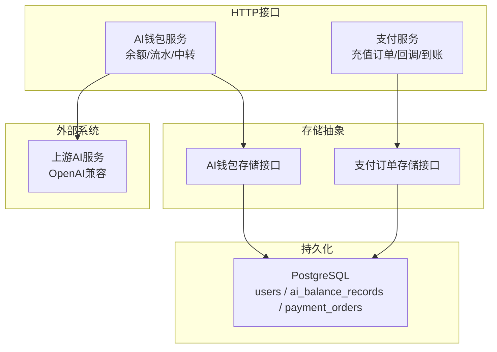
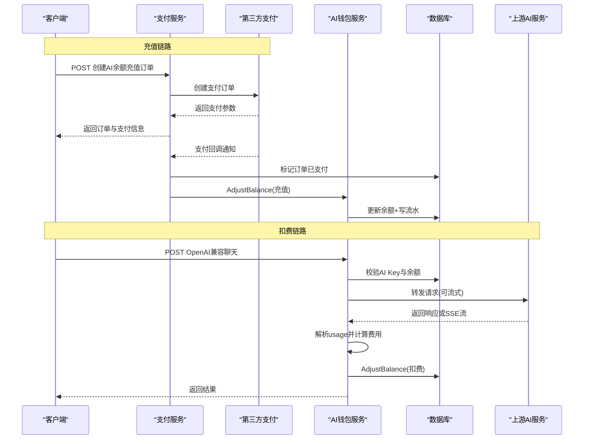
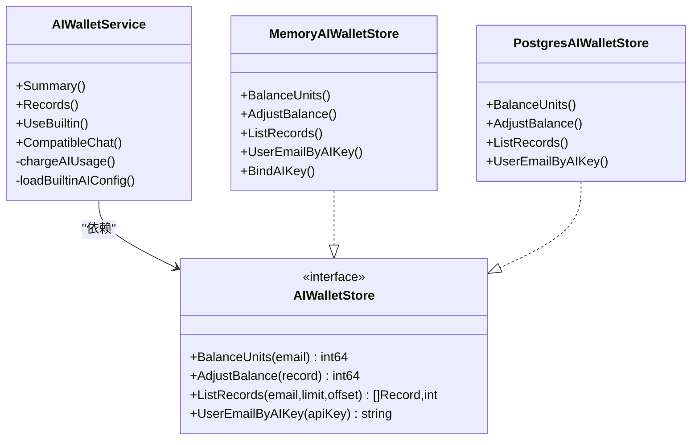
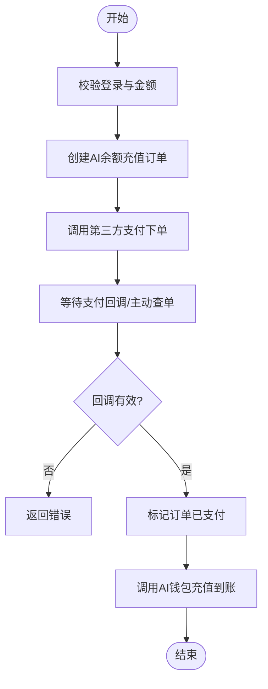
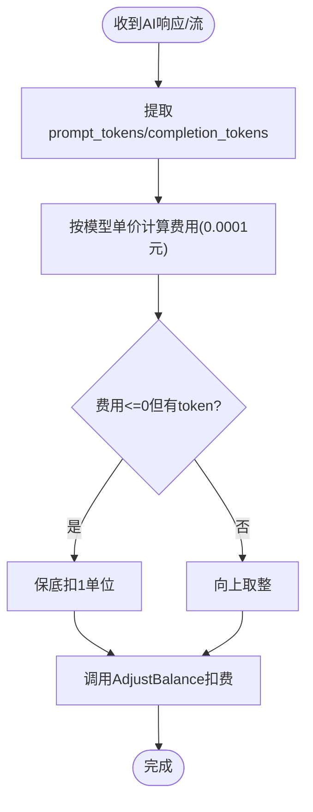
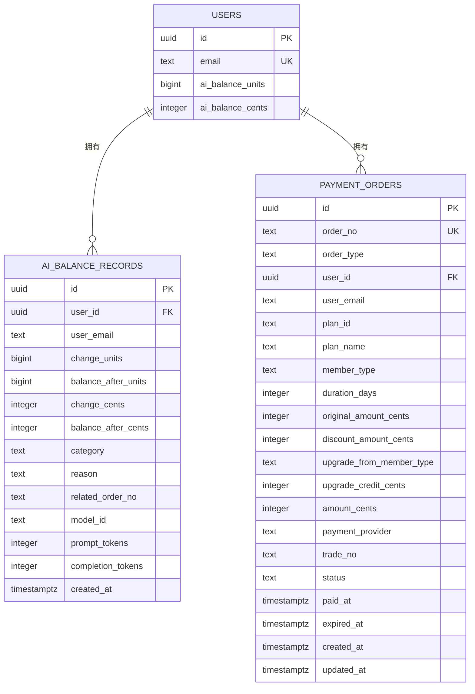
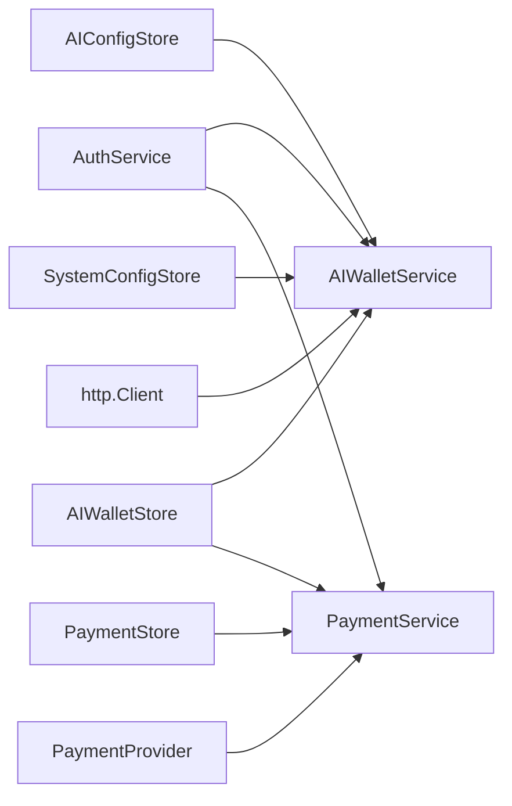

# AI钱包系统

<cite>
**本文引用的文件**   
- [ai_wallet.go](file://goodhr5/cloud/backend/internal/httpapi/ai_wallet.go)
- [payment.go](file://goodhr5/cloud/backend/internal/httpapi/payment.go)
- [payment_store.go](file://goodhr5/cloud/backend/internal/httpapi/payment_store.go)
- [0055_ai_wallet_and_builtin_ai.sql](file://goodhr5/cloud/backend/db/migrations/0055_ai_wallet_and_builtin_ai.sql)
- [0056_ai_wallet_units.sql](file://goodhr5/cloud/backend/db/migrations/0056_ai_wallet_units.sql)
- [0057_repair_ai_wallet_units.sql](file://goodhr5/cloud/backend/db/migrations/0057_repair_ai_wallet_units.sql)
- [0058_ai_wallet_legacy_cents_defaults.sql](file://goodhr5/cloud/backend/db/migrations/0058_ai_wallet_legacy_cents_defaults.sql)
</cite>

## 目录
1. [引言](#引言)
2. [项目结构](#项目结构)
3. [核心组件](#核心组件)
4. [架构总览](#架构总览)
5. [详细组件分析](#详细组件分析)
6. [依赖关系分析](#依赖关系分析)
7. [性能与扩展性](#性能与扩展性)
8. [故障排查指南](#故障排查指南)
9. [结论](#结论)
10. [附录：API与数据模型](#附录api与数据模型)

## 引言
本文件面向开发者，系统性梳理 GoodHR 云后端中的“AI钱包”能力，包括余额充值、消费扣费、余额查询、交易流水、账户管理、计费模型配置、OpenAI兼容中转、支付订单处理与回调到账等。文档同时给出数据库迁移演进、数据结构设计、关键流程时序图与流程图，帮助理解并扩展AI计费功能。

## 项目结构
AI钱包相关代码集中在后端HTTP API层与数据库迁移脚本中：
- HTTP服务层：提供余额摘要、流水查询、内置AI配置切换、OpenAI兼容聊天中转、AI余额充值订单创建、支付回调与到账处理。
- 存储层：内存实现用于开发调试；PostgreSQL实现用于生产环境。
- 数据库迁移：新增用户AI余额字段、流水表、订单类型扩展，以及精度升级与兜底修复。

图表来源
- [ai_wallet.go:79-97](file://goodhr5/cloud/backend/internal/httpapi/ai_wallet.go#L79-L97)
- [payment.go:34-65](file://goodhr5/cloud/backend/internal/httpapi/payment.go#L34-L65)
- [payment_store.go:13-50](file://goodhr5/cloud/backend/internal/httpapi/payment_store.go#L13-L50)
- [0055_ai_wallet_and_builtin_ai.sql:1-43](file://goodhr5/cloud/backend/db/migrations/0055_ai_wallet_and_builtin_ai.sql#L1-L43)

章节来源
- [ai_wallet.go:1-97](file://goodhr5/cloud/backend/internal/httpapi/ai_wallet.go#L1-L97)
- [payment.go:1-65](file://goodhr5/cloud/backend/internal/httpapi/payment.go#L1-L65)
- [payment_store.go:1-50](file://goodhr5/cloud/backend/internal/httpapi/payment_store.go#L1-L50)
- [0055_ai_wallet_and_builtin_ai.sql:1-43](file://goodhr5/cloud/backend/db/migrations/0055_ai_wallet_and_builtin_ai.sql#L1-L43)

## 核心组件
- AI钱包服务：负责余额查询、流水查询、内置AI配置切换、OpenAI兼容请求中转与按token扣费。
- AI钱包存储接口：定义余额读取、余额调整（写流水）、流水分页、AI Key反查邮箱。
- 内存与PostgreSQL存储实现：分别用于开发与生产。
- 支付服务：负责会员订阅与AI余额充值订单创建、第三方支付对接、回调校验与到账处理。
- 支付订单存储：统一封装订单的创建、查询、列表与标记已支付。

章节来源
- [ai_wallet.go:48-97](file://goodhr5/cloud/backend/internal/httpapi/ai_wallet.go#L48-L97)
- [ai_wallet.go:489-688](file://goodhr5/cloud/backend/internal/httpapi/ai_wallet.go#L489-L688)
- [payment.go:34-65](file://goodhr5/cloud/backend/internal/httpapi/payment.go#L34-L65)
- [payment_store.go:13-50](file://goodhr5/cloud/backend/internal/httpapi/payment_store.go#L13-L50)

## 架构总览
AI钱包整体由“支付充值链路”和“AI调用扣费链路”组成：
- 充值链路：前端发起AI余额充值 -> 支付服务创建订单 -> 第三方支付下单 -> 支付回调/主动查单 -> 标记订单已支付 -> 调用AI钱包AdjustBalance写入充值流水并增加余额。
- 扣费链路：客户端使用用户专属AI Key调用兼容接口 -> 鉴权并校验余额 -> 转发上游AI请求 -> 解析usage -> 计算费用 -> 调用AI钱包AdjustBalance扣费并记录流水。

图表来源
- [payment.go:191-259](file://goodhr5/cloud/backend/internal/httpapi/payment.go#L191-L259)
- [payment.go:341-405](file://goodhr5/cloud/backend/internal/httpapi/payment.go#L341-L405)
- [ai_wallet.go:208-326](file://goodhr5/cloud/backend/internal/httpapi/ai_wallet.go#L208-L326)
- [ai_wallet.go:589-634](file://goodhr5/cloud/backend/internal/httpapi/ai_wallet.go#L589-L634)

## 详细组件分析

### AI钱包服务与存储
- 余额查询：支持当前用户余额摘要、按邮箱查询流水（超管可查他人）。
- 内置AI配置：为用户生成或复用内置AI Key，绑定到公共BaseURL与默认模型。
- OpenAI兼容中转：鉴权、限流、模型重写、流式转发、usage提取与扣费。
- 扣费逻辑：根据模型输入输出单价与token用量计算费用，单位采用0.0001元。
- 存储实现：
  - 内存实现：线程安全，适合开发测试。
  - PostgreSQL实现：事务更新余额并插入流水，支持幂等充值（同订单号不重复入账）。

图表来源
- [ai_wallet.go:79-97](file://goodhr5/cloud/backend/internal/httpapi/ai_wallet.go#L79-L97)
- [ai_wallet.go:489-558](file://goodhr5/cloud/backend/internal/httpapi/ai_wallet.go#L489-L558)
- [ai_wallet.go:567-688](file://goodhr5/cloud/backend/internal/httpapi/ai_wallet.go#L567-L688)

章节来源
- [ai_wallet.go:99-206](file://goodhr5/cloud/backend/internal/httpapi/ai_wallet.go#L99-L206)
- [ai_wallet.go:208-326](file://goodhr5/cloud/backend/internal/httpapi/ai_wallet.go#L208-L326)
- [ai_wallet.go:328-462](file://goodhr5/cloud/backend/internal/httpapi/ai_wallet.go#L328-L462)
- [ai_wallet.go:489-688](file://goodhr5/cloud/backend/internal/httpapi/ai_wallet.go#L489-L688)

### 支付服务与订单处理
- 创建AI余额充值订单：校验金额范围，生成订单号与过期时间，调用第三方支付创建支付单。
- 支付回调与主动查单：校验订单号、金额、渠道一致性，标记订单已支付，触发到账业务。
- 到账处理：当订单类型为AI余额充值时，调用AI钱包AdjustBalance写入充值流水并增加余额。
- 支付记录查询：支持用户本人查看与超管全量查看。

图表来源
- [payment.go:191-259](file://goodhr5/cloud/backend/internal/httpapi/payment.go#L191-L259)
- [payment.go:341-405](file://goodhr5/cloud/backend/internal/httpapi/payment.go#L341-L405)

章节来源
- [payment.go:191-259](file://goodhr5/cloud/backend/internal/httpapi/payment.go#L191-L259)
- [payment.go:261-339](file://goodhr5/cloud/backend/internal/httpapi/payment.go#L261-L339)
- [payment.go:341-405](file://goodhr5/cloud/backend/internal/httpapi/payment.go#L341-L405)
- [payment_store.go:13-50](file://goodhr5/cloud/backend/internal/httpapi/payment_store.go#L13-L50)
- [payment_store.go:147-257](file://goodhr5/cloud/backend/internal/httpapi/payment_store.go#L147-L257)

### 计费模型与扣费算法
- 模型配置：从系统配置加载内置AI模型列表，包含输入/输出每百万token价格（分）。
- 费用计算：按prompt_tokens与completion_tokens分别计价，单位换算为0.0001元，向上取整；若计算值为0但存在token则保底扣1单位。
- usage提取：支持非流式response与流式SSE data行解析，确保能拿到最终usage。

图表来源
- [ai_wallet.go:419-487](file://goodhr5/cloud/backend/internal/httpapi/ai_wallet.go#L419-L487)
- [ai_wallet.go:804-826](file://goodhr5/cloud/backend/internal/httpapi/ai_wallet.go#L804-L826)
- [ai_wallet.go:763-801](file://goodhr5/cloud/backend/internal/httpapi/ai_wallet.go#L763-L801)

章节来源
- [ai_wallet.go:419-487](file://goodhr5/cloud/backend/internal/httpapi/ai_wallet.go#L419-L487)
- [ai_wallet.go:804-826](file://goodhr5/cloud/backend/internal/httpapi/ai_wallet.go#L804-L826)
- [ai_wallet.go:763-801](file://goodhr5/cloud/backend/internal/httpapi/ai_wallet.go#L763-L801)

### 数据库与数据模型
- users表：新增ai_balance_cents（旧）与ai_balance_units（新，单位0.0001元）。
- ai_balance_records表：记录每次余额变动，含change_units/balance_after_units及历史兼容字段change_cents/balance_after_cents。
- payment_orders表：新增order_type区分订阅与AI余额充值，便于到账分支处理。
- 迁移演进：
  - 0055：新增余额字段、流水表、订单类型。
  - 0056：新增高精度units字段并迁移历史数据。
  - 0057：兜底修复units字段缺失导致扣费失败。
  - 0058：为旧cents字段补充默认值，避免约束冲突。

图表来源
- [0055_ai_wallet_and_builtin_ai.sql:1-43](file://goodhr5/cloud/backend/db/migrations/0055_ai_wallet_and_builtin_ai.sql#L1-L43)
- [0056_ai_wallet_units.sql:1-28](file://goodhr5/cloud/backend/db/migrations/0056_ai_wallet_units.sql#L1-L28)
- [0057_repair_ai_wallet_units.sql:1-28](file://goodhr5/cloud/backend/db/migrations/0057_repair_ai_wallet_units.sql#L1-L28)
- [0058_ai_wallet_legacy_cents_defaults.sql:1-8](file://goodhr5/cloud/backend/db/migrations/0058_ai_wallet_legacy_cents_defaults.sql#L1-L8)

章节来源
- [0055_ai_wallet_and_builtin_ai.sql:1-68](file://goodhr5/cloud/backend/db/migrations/0055_ai_wallet_and_builtin_ai.sql#L1-L68)
- [0056_ai_wallet_units.sql:1-28](file://goodhr5/cloud/backend/db/migrations/0056_ai_wallet_units.sql#L1-L28)
- [0057_repair_ai_wallet_units.sql:1-28](file://goodhr5/cloud/backend/db/migrations/0057_repair_ai_wallet_units.sql#L1-L28)
- [0058_ai_wallet_legacy_cents_defaults.sql:1-8](file://goodhr5/cloud/backend/db/migrations/0058_ai_wallet_legacy_cents_defaults.sql#L1-L8)

## 依赖关系分析
- AI钱包服务依赖：
  - AuthService：会话校验、超管判断。
  - AIWalletStore：余额与流水读写。
  - AIConfigStore/SystemConfigStore：用户AI配置与系统内置AI配置。
  - http.Client：转发上游AI请求。
- 支付服务依赖：
  - PaymentStore：订单持久化。
  - SubscriptionStore/Mailer/InvitationStore：订阅与通知（与AI钱包解耦）。
  - PaymentProvider：第三方支付对接。
  - AIWalletStore：到账时调用充值逻辑。

图表来源
- [ai_wallet.go:79-97](file://goodhr5/cloud/backend/internal/httpapi/ai_wallet.go#L79-L97)
- [payment.go:34-65](file://goodhr5/cloud/backend/internal/httpapi/payment.go#L34-L65)

章节来源
- [ai_wallet.go:79-97](file://goodhr5/cloud/backend/internal/httpapi/ai_wallet.go#L79-L97)
- [payment.go:34-65](file://goodhr5/cloud/backend/internal/httpapi/payment.go#L34-L65)

## 性能与扩展性
- 并发与锁：内存钱包实现使用互斥锁保护余额与流水；PostgreSQL实现通过事务保证原子性与幂等充值。
- 超时控制：数据库操作设置上下文超时，避免长事务阻塞。
- 流式处理：对上游SSE流进行逐行转发与usage提取，降低内存占用并提升用户体验。
- 可扩展点：
  - 新增计费模型：在系统配置中添加模型ID与单价即可接入。
  - 新增支付渠道：实现PaymentProvider接口并注册。
  - 扩展流水维度：可在AIWalletRecord中追加字段并在存储层适配。

[本节为通用指导，不直接分析具体文件]

## 故障排查指南
- 余额不足：
  - 现象：调用兼容接口返回“余额有点紧张啦”。
  - 排查：检查用户ai_balance_units是否大于0；确认充值订单是否已到账。
  - 参考路径：[ai_wallet.go:224-232](file://goodhr5/cloud/backend/internal/httpapi/ai_wallet.go#L224-L232)
- 上游未配置：
  - 现象：返回“内置AI未配置”。
  - 排查：检查system.app_config.builtin_ai.upstream_base_url与upstream_api_key。
  - 参考路径：[ai_wallet.go:238-242](file://goodhr5/cloud/backend/internal/httpapi/ai_wallet.go#L238-L242)
- 扣费记录写入失败：
  - 现象：日志打印“扣费记录写入失败”。
  - 排查：检查数据库连接、事务提交、ai_balance_records写入权限。
  - 参考路径：[ai_wallet.go:296-303](file://goodhr5/cloud/backend/internal/httpapi/ai_wallet.go#L296-L303), [ai_wallet.go:617-634](file://goodhr5/cloud/backend/internal/httpapi/ai_wallet.go#L617-L634)
- 充值未到账：
  - 现象：支付成功但余额未增加。
  - 排查：确认回调是否到达、订单状态是否为paid、order_type是否为ai_balance。
  - 参考路径：[payment.go:341-405](file://goodhr5/cloud/backend/internal/httpapi/payment.go#L341-L405)
- 精度问题：
  - 现象：历史数据或字段缺失导致扣费异常。
  - 排查：确认ai_balance_units与ai_balance_records.change_units/balance_after_units是否存在且已迁移。
  - 参考路径：[0056_ai_wallet_units.sql:1-28](file://goodhr5/cloud/backend/db/migrations/0056_ai_wallet_units.sql#L1-L28), [0057_repair_ai_wallet_units.sql:1-28](file://goodhr5/cloud/backend/db/migrations/0057_repair_ai_wallet_units.sql#L1-L28)

章节来源
- [ai_wallet.go:224-232](file://goodhr5/cloud/backend/internal/httpapi/ai_wallet.go#L224-L232)
- [ai_wallet.go:238-242](file://goodhr5/cloud/backend/internal/httpapi/ai_wallet.go#L238-L242)
- [ai_wallet.go:296-303](file://goodhr5/cloud/backend/internal/httpapi/ai_wallet.go#L296-L303)
- [ai_wallet.go:617-634](file://goodhr5/cloud/backend/internal/httpapi/ai_wallet.go#L617-L634)
- [payment.go:341-405](file://goodhr5/cloud/backend/internal/httpapi/payment.go#L341-L405)
- [0056_ai_wallet_units.sql:1-28](file://goodhr5/cloud/backend/db/migrations/0056_ai_wallet_units.sql#L1-L28)
- [0057_repair_ai_wallet_units.sql:1-28](file://goodhr5/cloud/backend/db/migrations/0057_repair_ai_wallet_units.sql#L1-L28)

## 结论
AI钱包系统在GoodHR中实现了完整的“充值-扣费-查询-审计”闭环：以统一的AIWalletStore抽象屏蔽底层差异，通过支付服务对接第三方渠道完成充值到账，通过OpenAI兼容中转实现按token计费的透明扣费。数据库迁移保证了精度与历史兼容，流式处理提升了体验。建议在扩展时优先通过系统配置接入新模型与新支付渠道，保持核心扣费与到账逻辑稳定。

[本节为总结，不直接分析具体文件]

## 附录：API与数据模型

### 主要API
- 获取AI余额与内置配置摘要
  - 方法：GET
  - 说明：返回当前用户余额、默认模型、可用模型列表与公共BaseURL。
  - 参考路径：[ai_wallet.go:99-126](file://goodhr5/cloud/backend/internal/httpapi/ai_wallet.go#L99-L126)
- 查询AI余额流水
  - 方法：GET
  - 说明：支持分页，超管可按email查询他人流水。
  - 参考路径：[ai_wallet.go:128-172](file://goodhr5/cloud/backend/internal/httpapi/ai_wallet.go#L128-L172)
- 切换为内置AI
  - 方法：POST
  - 说明：为用户保存内置AI配置并返回余额与模型信息。
  - 参考路径：[ai_wallet.go:174-206](file://goodhr5/cloud/backend/internal/httpapi/ai_wallet.go#L174-L206)
- OpenAI兼容聊天中转
  - 方法：POST
  - 说明：鉴权、余额校验、转发上游、流式转发、usage提取与扣费。
  - 参考路径：[ai_wallet.go:208-326](file://goodhr5/cloud/backend/internal/httpapi/ai_wallet.go#L208-L326)
- 创建AI余额充值订单
  - 方法：POST
  - 说明：校验金额、创建订单、调用第三方支付。
  - 参考路径：[payment.go:191-259](file://goodhr5/cloud/backend/internal/httpapi/payment.go#L191-L259)
- 查询我的支付记录
  - 方法：GET
  - 说明：返回当前用户的支付订单列表。
  - 参考路径：[payment.go:261-274](file://goodhr5/cloud/backend/internal/httpapi/payment.go#L261-L274)
- 微信支付回调
  - 方法：POST
  - 说明：解析回调、校验并标记订单已支付，触发到账。
  - 参考路径：[payment.go:341-362](file://goodhr5/cloud/backend/internal/httpapi/payment.go#L341-L362)

### 数据模型要点
- AIWalletRecord：记录一次余额变动，含change_units、balance_after_units、category、reason、related_order_no、model_id、prompt_tokens、completion_tokens。
- PaymentOrder：支付订单，含order_type区分订阅与AI余额充值，status/paid_at/trade_no等关键字段。
- 用户余额：ai_balance_units为主字段（0.0001元），ai_balance_cents为兼容字段。

章节来源
- [ai_wallet.go:33-58](file://goodhr5/cloud/backend/internal/httpapi/ai_wallet.go#L33-L58)
- [ai_wallet.go:828-848](file://goodhr5/cloud/backend/internal/httpapi/ai_wallet.go#L828-L848)
- [payment_store.go:13-36](file://goodhr5/cloud/backend/internal/httpapi/payment_store.go#L13-L36)
- [0055_ai_wallet_and_builtin_ai.sql:1-43](file://goodhr5/cloud/backend/db/migrations/0055_ai_wallet_and_builtin_ai.sql#L1-L43)
- [0056_ai_wallet_units.sql:1-28](file://goodhr5/cloud/backend/db/migrations/0056_ai_wallet_units.sql#L1-L28)