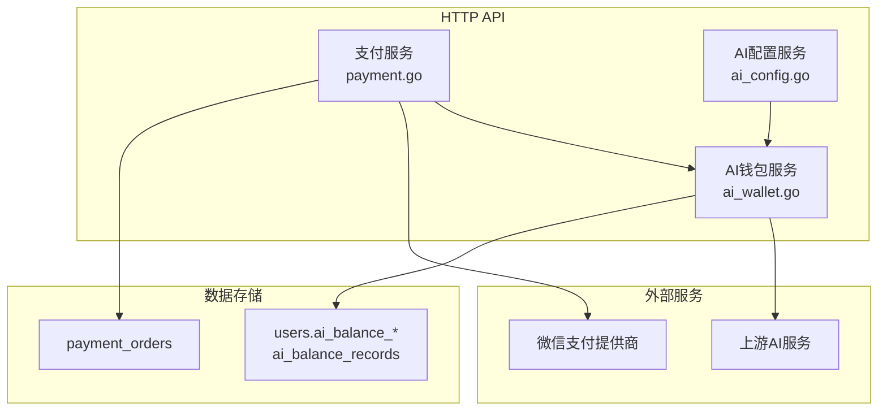
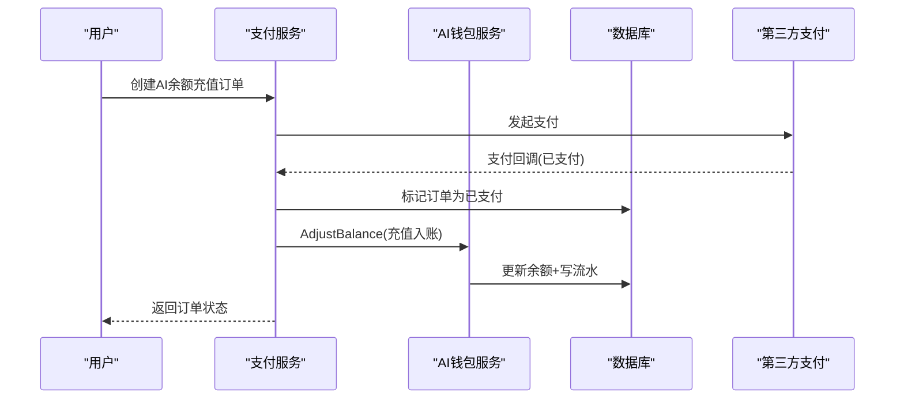
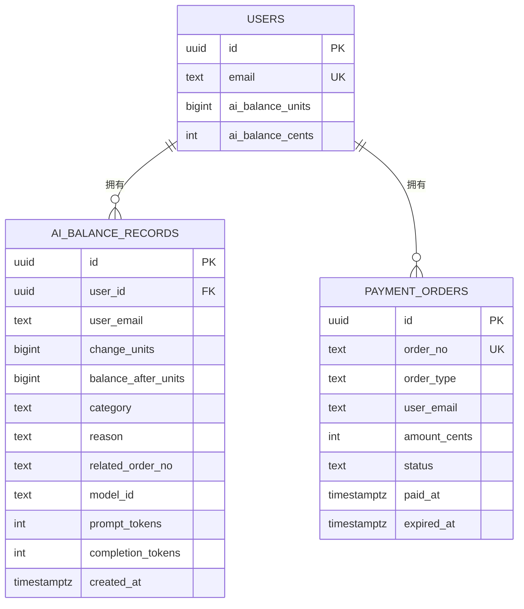
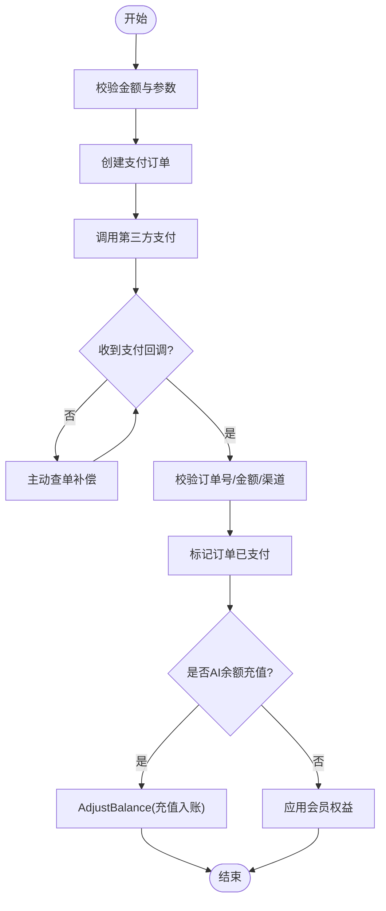
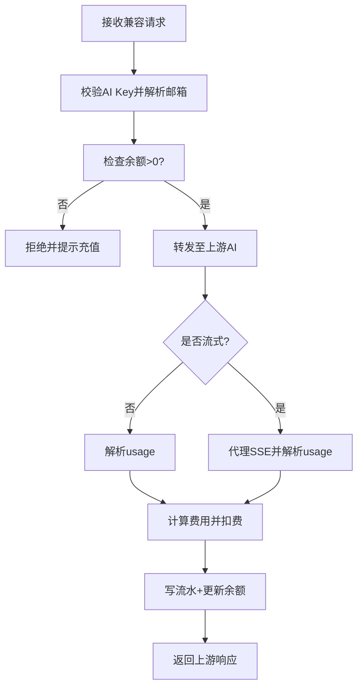
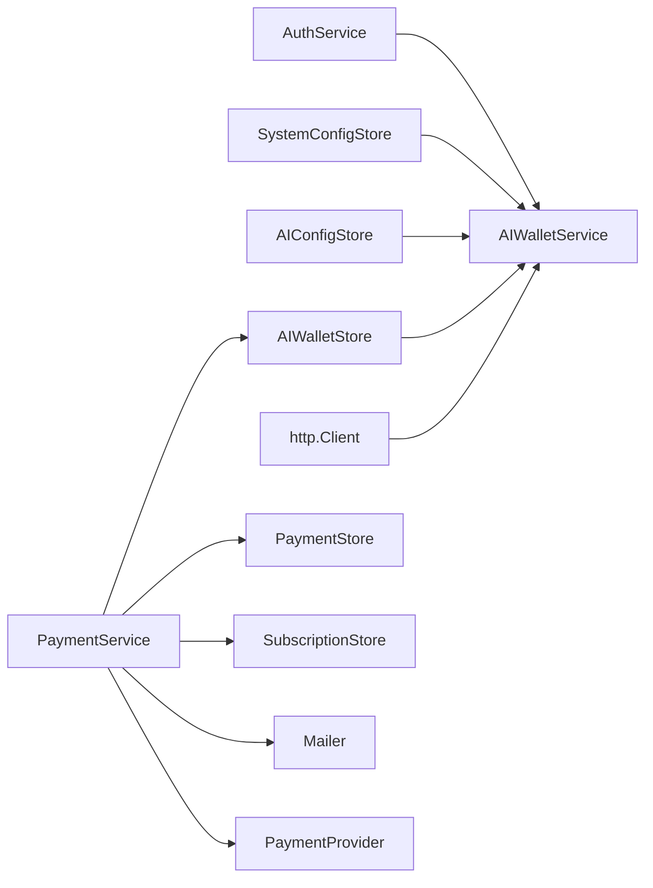

# AI钱包系统

<cite>
**本文引用的文件**
- [ai_wallet.go](file://goodhr5/cloud/backend/internal/httpapi/ai_wallet.go)
- [payment.go](file://goodhr5/cloud/backend/internal/httpapi/payment.go)
- [ai_config.go](file://goodhr5/cloud/backend/internal/httpapi/ai_config.go)
- [0055_ai_wallet_and_builtin_ai.sql](file://goodhr5/cloud/backend/db/migrations/0055_ai_wallet_and_builtin_ai.sql)
- [0056_ai_wallet_units.sql](file://goodhr5/cloud/backend/db/migrations/0056_ai_wallet_units.sql)
- [0057_repair_ai_wallet_units.sql](file://goodhr5/cloud/backend/db/migrations/0057_repair_ai_wallet_units.sql)
- [0058_ai_wallet_legacy_cents_defaults.sql](file://goodhr5/cloud/backend/db/migrations/0058_ai_wallet_legacy_cents_defaults.sql)
- [ai_wallet_test.go](file://goodhr5/cloud/backend/internal/httpapi/ai_wallet_test.go)
</cite>

## 目录
1. [简介](#简介)
2. [项目结构](#项目结构)
3. [核心组件](#核心组件)
4. [架构总览](#架构总览)
5. [详细组件分析](#详细组件分析)
6. [依赖关系分析](#依赖关系分析)
7. [性能与精度说明](#性能与精度说明)
8. [故障排查指南](#故障排查指南)
9. [结论](#结论)
10. [附录：API与使用示例](#附录api与使用示例)

## 简介
本仓库实现了“AI钱包”能力，覆盖用户余额充值、按模型用量扣费、余额查询、流水记录、订单处理、以及财务报表所需的数据基础。系统通过统一的支付服务创建充值订单，支付成功后自动将金额转入用户AI钱包；在调用内置AI时，根据上游返回的token用量计算费用并扣减余额，同时写入不可篡改的流水表。所有金额以高精度单位存储，避免浮点误差。

## 项目结构
AI钱包相关代码主要位于后端HTTP API层与数据库迁移脚本中：
- HTTP API层：钱包服务、支付服务、AI配置服务
- 数据层：PostgreSQL迁移脚本定义钱包表结构与字段演进
- 测试：针对扣费精度、流式响应解析等关键逻辑的单元测试

**图表来源**
- [ai_wallet.go:80-97](file://goodhr5/cloud/backend/internal/httpapi/ai_wallet.go#L80-L97)
- [payment.go:35-65](file://goodhr5/cloud/backend/internal/httpapi/payment.go#L35-L65)
- [ai_config.go:22-45](file://goodhr5/cloud/backend/internal/httpapi/ai_config.go#L22-L45)
- [0055_ai_wallet_and_builtin_ai.sql:1-68](file://goodhr5/cloud/backend/db/migrations/0055_ai_wallet_and_builtin_ai.sql#L1-L68)

**章节来源**
- [ai_wallet.go:80-97](file://goodhr5/cloud/backend/internal/httpapi/ai_wallet.go#L80-L97)
- [payment.go:35-65](file://goodhr5/cloud/backend/internal/httpapi/payment.go#L35-L65)
- [ai_config.go:22-45](file://goodhr5/cloud/backend/internal/httpapi/ai_config.go#L22-L45)
- [0055_ai_wallet_and_builtin_ai.sql:1-68](file://goodhr5/cloud/backend/db/migrations/0055_ai_wallet_and_builtin_ai.sql#L1-L68)

## 核心组件
- AI钱包服务：负责余额查询、流水查询、切换内置AI、OpenAI兼容请求代理与扣费、注册赠送余额、生成用户专属AI Key。
- 支付服务：负责创建订阅与AI余额充值订单、处理支付回调、完成到账（充值成功则转入AI钱包）。
- AI配置服务：提供用户自定义AI配置的读取、保存、连通性测试与安全校验。
- 存储抽象：内存实现用于开发调试，PostgreSQL实现用于生产，统一接口读写余额与流水。
- 数据库迁移：定义钱包表、流水表、订单类型扩展、精度升级与历史数据修复。

**章节来源**
- [ai_wallet.go:33-86](file://goodhr5/cloud/backend/internal/httpapi/ai_wallet.go#L33-L86)
- [payment.go:35-65](file://goodhr5/cloud/backend/internal/httpapi/payment.go#L35-L65)
- [ai_config.go:22-45](file://goodhr5/cloud/backend/internal/httpapi/ai_config.go#L22-L45)
- [0055_ai_wallet_and_builtin_ai.sql:1-68](file://goodhr5/cloud/backend/db/migrations/0055_ai_wallet_and_builtin_ai.sql#L1-L68)

## 架构总览
AI钱包整体流程包括：
- 充值：前端发起充值订单 -> 支付服务创建订单并调起第三方支付 -> 支付回调通知 -> 标记订单已支付 -> 调用钱包服务转入余额并写流水。
- 扣费：客户端携带用户专属AI Key调用兼容接口 -> 钱包服务鉴权并检查余额 -> 转发至上游AI -> 解析非流或流式响应中的usage -> 计算费用并扣减余额 -> 写流水。
- 查询：支持查询当前用户余额、流水；管理员可查指定用户流水。

**图表来源**
- [payment.go:191-259](file://goodhr5/cloud/backend/internal/httpapi/payment.go#L191-L259)
- [payment.go:341-405](file://goodhr5/cloud/backend/internal/httpapi/payment.go#L341-L405)
- [ai_wallet.go:587-632](file://goodhr5/cloud/backend/internal/httpapi/ai_wallet.go#L587-L632)

## 详细组件分析

### 钱包账户与余额模型
- 用户余额字段：
  - ai_balance_cents：旧精度（分），保留兼容
  - ai_balance_units：新精度（0.0001元），精确扣费与余额计算依据
- 流水表：
  - change_units/balance_after_units：本次变动与变动后余额（单位同上）
  - category/reason/related_order_no/model_id/prompt_tokens/completion_tokens：分类、原因、关联订单、模型、token用量
- 索引：按用户与时间倒序、按订单号索引，便于查询与对账

**图表来源**
- [0055_ai_wallet_and_builtin_ai.sql:1-68](file://goodhr5/cloud/backend/db/migrations/0055_ai_wallet_and_builtin_ai.sql#L1-L68)
- [0056_ai_wallet_units.sql:1-28](file://goodhr5/cloud/backend/db/migrations/0056_ai_wallet_units.sql#L1-L28)
- [0057_repair_ai_wallet_units.sql:1-28](file://goodhr5/cloud/backend/db/migrations/0057_repair_ai_wallet_units.sql#L1-L28)
- [0058_ai_wallet_legacy_cents_defaults.sql:1-8](file://goodhr5/cloud/backend/db/migrations/0058_ai_wallet_legacy_cents_defaults.sql#L1-L8)

**章节来源**
- [0055_ai_wallet_and_builtin_ai.sql:1-68](file://goodhr5/cloud/backend/db/migrations/0055_ai_wallet_and_builtin_ai.sql#L1-L68)
- [0056_ai_wallet_units.sql:1-28](file://goodhr5/cloud/backend/db/migrations/0056_ai_wallet_units.sql#L1-L28)
- [0057_repair_ai_wallet_units.sql:1-28](file://goodhr5/cloud/backend/db/migrations/0057_repair_ai_wallet_units.sql#L1-L28)
- [0058_ai_wallet_legacy_cents_defaults.sql:1-8](file://goodhr5/cloud/backend/db/migrations/0058_ai_wallet_legacy_cents_defaults.sql#L1-L8)

### 充值订单处理
- 创建订单：校验金额范围，生成订单号与过期时间，持久化订单并调用第三方支付。
- 支付回调：校验订单号、金额、渠道一致性，标记订单已支付；若类型为AI余额充值，则调用钱包服务入账。
- 幂等与防重：充值流水按订单号去重，重复回调不会重复入账。

**图表来源**
- [payment.go:191-259](file://goodhr5/cloud/backend/internal/httpapi/payment.go#L191-L259)
- [payment.go:341-405](file://goodhr5/cloud/backend/internal/httpapi/payment.go#L341-L405)
- [ai_wallet.go:587-632](file://goodhr5/cloud/backend/internal/httpapi/ai_wallet.go#L587-L632)

**章节来源**
- [payment.go:191-259](file://goodhr5/cloud/backend/internal/httpapi/payment.go#L191-L259)
- [payment.go:341-405](file://goodhr5/cloud/backend/internal/httpapi/payment.go#L341-L405)

### 消费记录追踪与余额计算
- 计费模型：从系统配置加载可用模型及单价（输入/输出每百万token价格）。
- 用量提取：
  - 非流式：从响应体usage字段读取prompt_tokens与completion_tokens。
  - 流式：解析SSE data行，追加include_usage开关，最终汇总usage。
- 费用计算：按模型单价与token用量计算费用，向上取整到0.0001元精度，写入流水并扣减余额。
- 安全校验：仅允许系统配置的模型ID；未配置上游服务时拒绝请求。

**图表来源**
- [ai_wallet.go:208-326](file://goodhr5/cloud/backend/internal/httpapi/ai_wallet.go#L208-L326)
- [ai_wallet.go:761-800](file://goodhr5/cloud/backend/internal/httpapi/ai_wallet.go#L761-L800)

**章节来源**
- [ai_wallet.go:208-326](file://goodhr5/cloud/backend/internal/httpapi/ai_wallet.go#L208-L326)
- [ai_wallet.go:761-800](file://goodhr5/cloud/backend/internal/httpapi/ai_wallet.go#L761-L800)

### 余额冻结与解冻机制
- 当前实现采用“直接扣费+流水记录”的方式，未引入显式的冻结/解冻状态机。
- 如需扩展冻结（如预授权场景），可在AdjustBalance前增加“冻结记录表”，并在支付回调或结算时执行解冻入账。该设计建议保持事务一致性与幂等性。

[本节为概念性说明，不直接分析具体文件]

### 余额调整与异常处理
- 注册赠送：首次启用内置AI或确保默认配置时，按系统配置赠送一定额度，并写入signup_bonus流水。
- 异常处理：
  - 会话无效/未登录：返回未授权
  - 余额不足：拒绝AI请求并提示充值
  - 上游服务不可用：返回服务不可用
  - 扣费记录写入失败：拦截响应并返回错误，防止账目不一致
- 幂等保障：充值流水按订单号去重，避免重复入账。

**章节来源**
- [ai_wallet.go:99-126](file://goodhr5/cloud/backend/internal/httpapi/ai_wallet.go#L99-L126)
- [ai_wallet.go:208-326](file://goodhr5/cloud/backend/internal/httpapi/ai_wallet.go#L208-L326)
- [payment.go:341-405](file://goodhr5/cloud/backend/internal/httpapi/payment.go#L341-L405)

### 数据安全保护
- AI Key管理：为用户生成唯一Key并绑定邮箱；通过Key反查用户邮箱进行鉴权。
- 网络访问限制：AI配置测试仅允许公网HTTPS地址，禁止内网与本机访问，防止SSRF风险。
- 日志脱敏：对外暴露的URL与Key进行脱敏处理，避免敏感信息泄露。

**章节来源**
- [ai_wallet.go:688-695](file://goodhr5/cloud/backend/internal/httpapi/ai_wallet.go#L688-L695)
- [ai_config.go:150-224](file://goodhr5/cloud/backend/internal/httpapi/ai_config.go#L150-L224)
- [ai_config.go:436-460](file://goodhr5/cloud/backend/internal/httpapi/ai_config.go#L436-L460)

## 依赖关系分析
- AI钱包服务依赖：
  - 认证服务：解析会话与权限
  - AI配置存储：读取系统内置AI配置与用户配置
  - 系统配置存储：读取builtin_ai配置
  - 钱包存储：余额与流水读写
  - HTTP客户端：转发AI请求
- 支付服务依赖：
  - 订单存储：创建与查询订单
  - 订阅存储：会员权益发放
  - 邮件服务：发送奖励通知
  - 钱包存储：充值入账
  - 支付提供商：微信支付等

**图表来源**
- [ai_wallet.go:80-97](file://goodhr5/cloud/backend/internal/httpapi/ai_wallet.go#L80-L97)
- [payment.go:35-65](file://goodhr5/cloud/backend/internal/httpapi/payment.go#L35-L65)

**章节来源**
- [ai_wallet.go:80-97](file://goodhr5/cloud/backend/internal/httpapi/ai_wallet.go#L80-L97)
- [payment.go:35-65](file://goodhr5/cloud/backend/internal/httpapi/payment.go#L35-L65)

## 性能与精度说明
- 精度：余额与流水统一使用0.0001元单位，避免浮点误差；测试验证了四舍五入与向上取整行为。
- 流式处理：对SSE流逐行扫描并实时写出，减少内存占用；仅在最后一条usage汇总时扣费。
- 超时控制：AI请求统一设置超时，避免长时间阻塞。
- 幂等与并发：内存实现使用互斥锁；数据库实现使用事务保证一致性。

**章节来源**
- [ai_wallet_test.go:34-71](file://goodhr5/cloud/backend/internal/httpapi/ai_wallet_test.go#L34-L71)
- [ai_wallet.go:761-800](file://goodhr5/cloud/backend/internal/httpapi/ai_wallet.go#L761-L800)
- [ai_wallet.go:587-632](file://goodhr5/cloud/backend/internal/httpapi/ai_wallet.go#L587-L632)

## 故障排查指南
- 无法扣费：
  - 检查上游AI是否返回usage；若无usage，扣费无法进行
  - 检查系统配置是否已配置upstream_base_url与upstream_api_key
- 充值未到账：
  - 检查支付回调是否到达；核对订单号、金额、渠道一致性
  - 检查流水是否因订单号重复被幂等跳过
- 余额查询为空：
  - 确认用户是否已初始化内置AI配置或注册赠送是否生效
- 网络问题：
  - 检查AI配置测试是否仅允许公网HTTPS；确认DNS解析与防火墙策略

**章节来源**
- [ai_wallet.go:208-326](file://goodhr5/cloud/backend/internal/httpapi/ai_wallet.go#L208-L326)
- [payment.go:341-405](file://goodhr5/cloud/backend/internal/httpapi/payment.go#L341-L405)
- [ai_config.go:150-224](file://goodhr5/cloud/backend/internal/httpapi/ai_config.go#L150-L224)

## 结论
AI钱包系统通过“订单-回调-入账-流水”的闭环，结合高精度余额与严格的用量计费，提供了可靠的充值与扣费能力。系统在设计上注重幂等、安全与可扩展性，既满足当前业务需求，也为未来冻结/解冻、多模型定价、审计报表等能力预留空间。

[本节为总结性内容，不直接分析具体文件]

## 附录：API与使用示例

### 钱包摘要与流水
- 获取余额与配置摘要：GET /api/ai-wallet
  - 返回余额（单位、分、元）、默认充值金额、默认模型、可用模型列表
- 获取流水：GET /api/ai-wallet/records?page=1&page_size=20&email=可选（需超管）
  - 返回分页流水列表与总数

**章节来源**
- [ai_wallet.go:99-172](file://goodhr5/cloud/backend/internal/httpapi/ai_wallet.go#L99-L172)

### 切换内置AI
- 切换并获取配置：POST /api/ai-wallet/use-builtin
  - 为用户保存内置AI配置，必要时生成用户专属AI Key，并赠送注册余额

**章节来源**
- [ai_wallet.go:174-206](file://goodhr5/cloud/backend/internal/httpapi/ai_wallet.go#L174-L206)

### OpenAI兼容调用与扣费
- 兼容接口：POST /api/ai-compatible/v1/chat/completions
  - 请求头Authorization: Bearer <用户专属AI Key>
  - 支持stream=true；系统会注入include_usage以便统计token用量
  - 响应体包含choices与usage；系统据此扣费

**章节来源**
- [ai_wallet.go:208-326](file://goodhr5/cloud/backend/internal/httpapi/ai_wallet.go#L208-L326)
- [ai_wallet.go:761-800](file://goodhr5/cloud/backend/internal/httpapi/ai_wallet.go#L761-L800)

### 充值订单
- 创建AI余额充值订单：POST /api/payment/orders
  - 请求体包含amount_cents或amount_yuan；系统校验范围并创建订单
- 查看我的订单：GET /api/payment/orders
- 订单详情：GET /api/payment/orders/{order_no}
- 微信支付回调：POST /api/payment/wechat/notify（由支付平台调用）

**章节来源**
- [payment.go:191-259](file://goodhr5/cloud/backend/internal/httpapi/payment.go#L191-L259)
- [payment.go:261-339](file://goodhr5/cloud/backend/internal/httpapi/payment.go#L261-L339)
- [payment.go:341-405](file://goodhr5/cloud/backend/internal/httpapi/payment.go#L341-L405)

### 财务报表与对账
- 基于ai_balance_records与payment_orders可生成：
  - 用户维度余额变动明细
  - 充值到账与扣费使用分布
  - 按模型、时间段统计收入与消耗
- 建议查询：
  - 按user_email与created_at范围筛选
  - 按category分组统计recharge、ai_usage、signup_bonus等
  - 关联related_order_no与payment_orders进行对账

**章节来源**
- [0055_ai_wallet_and_builtin_ai.sql:14-43](file://goodhr5/cloud/backend/db/migrations/0055_ai_wallet_and_builtin_ai.sql#L14-L43)
- [ai_wallet.go:634-669](file://goodhr5/cloud/backend/internal/httpapi/ai_wallet.go#L634-L669)

### 实际使用场景与扩展建议
- 典型场景：
  - 新用户注册赠送体验额度，引导使用内置AI
  - 用户充值后，自动到账并可立即使用
  - 高频调用场景下，按token用量精准扣费，避免超额使用
- 扩展建议：
  - 引入冻结/解冻：预授权冻结额度，结算时解冻并扣费
  - 多模型定价：通过系统配置动态调整模型单价
  - 审计与告警：对异常扣费、大额充值、频繁失败等事件进行监控与告警

[本节为概念性说明，不直接分析具体文件]