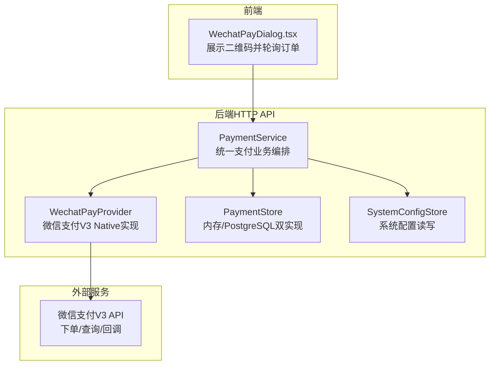
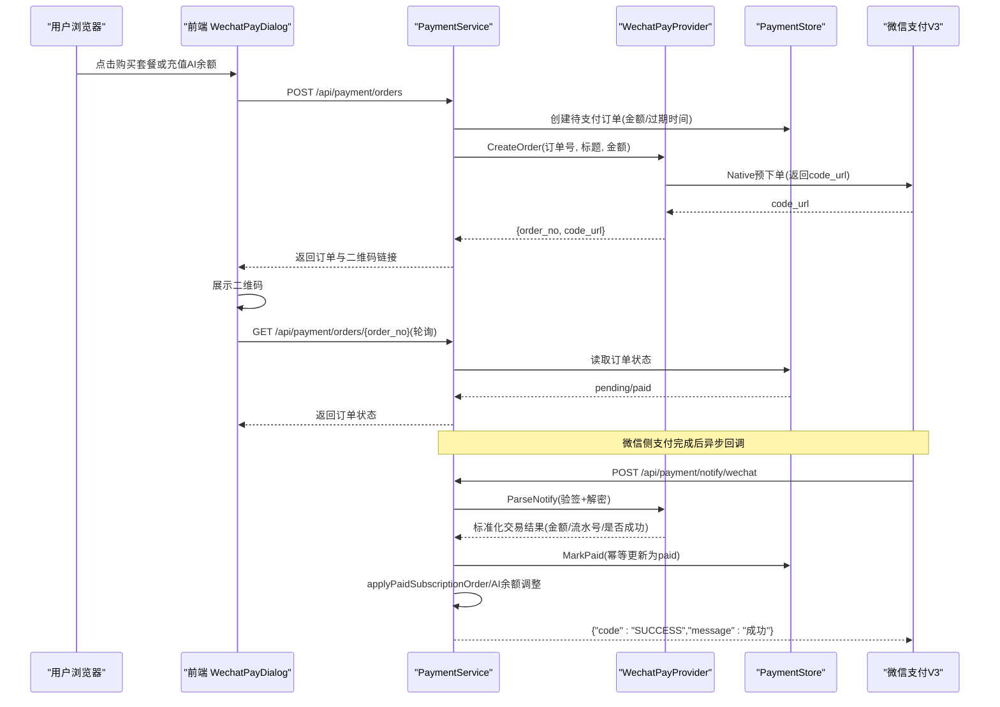
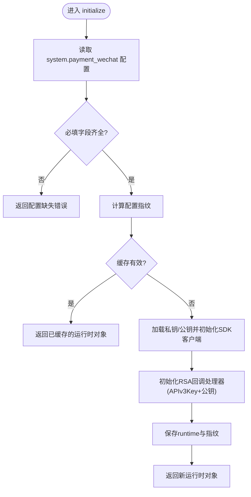
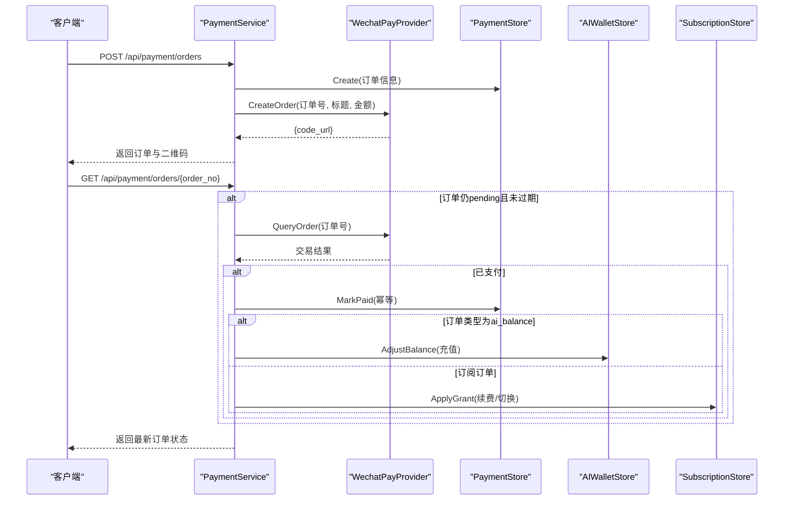
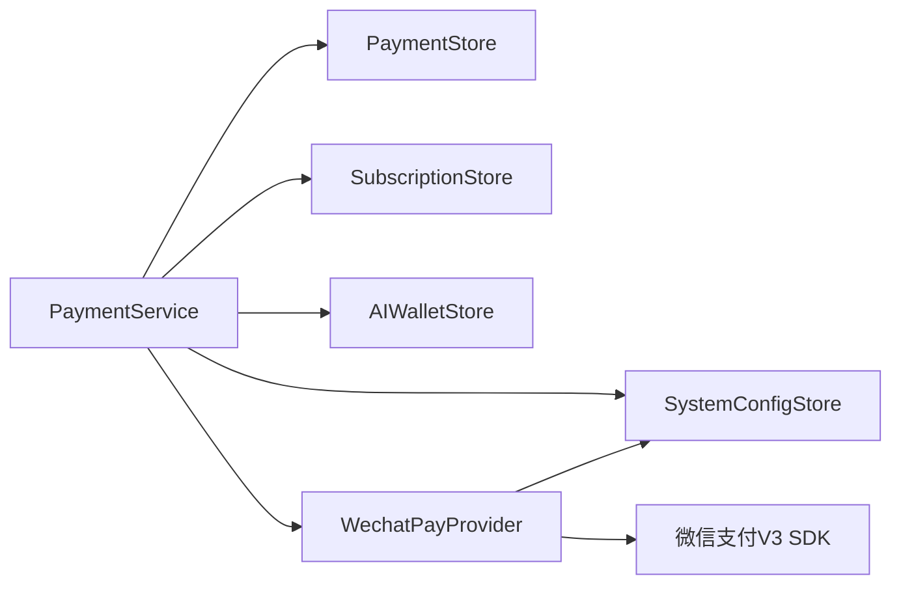

# 微信支付集成

<cite>
**本文引用的文件**
- [payment_wechat.go](file://goodhr5/cloud/backend/internal/httpapi/payment_wechat.go)
- [payment.go](file://goodhr5/cloud/backend/internal/httpapi/payment.go)
- [payment_provider.go](file://goodhr5/cloud/backend/internal/httpapi/payment_provider.go)
- [payment_store.go](file://goodhr5/cloud/backend/internal/httpapi/payment_store.go)
- [0074_wechat_payment_provider.sql](file://goodhr5/cloud/backend/db/migrations/0074_wechat_payment_provider.sql)
- [0075_system_payment_wechat.sql](file://goodhr5/cloud/backend/db/migrations/0075_system_payment_wechat.sql)
- [system_config_store.go](file://goodhr5/cloud/backend/internal/httpapi/system_config_store.go)
- [WechatPayDialog.tsx](file://goodhr5/cloud/frontend-next/components/payment/WechatPayDialog.tsx)
- [payment_test.go](file://goodhr5/cloud/backend/internal/httpapi/payment_test.go)
- [payment_wechat_test.go](file://goodhr5/cloud/backend/internal/httpapi/payment_wechat_test.go)
</cite>

## 目录
1. [简介](#简介)
2. [项目结构](#项目结构)
3. [核心组件](#核心组件)
4. [架构总览](#架构总览)
5. [详细组件分析](#详细组件分析)
6. [依赖关系分析](#依赖关系分析)
7. [性能与安全](#性能与安全)
8. [故障排查指南](#故障排查指南)
9. [结论](#结论)
10. [附录：配置与部署](#附录：配置与部署)

## 简介
本文件面向开发者，系统性说明 HRPlus 云端后端的微信支付 V3 Native 支付集成方案。内容覆盖：SDK 初始化、订单创建、主动查单、回调验签解密、订单完成与到账、错误处理策略、前端交互流程、测试环境搭建与生产部署要点。当前实现默认使用微信支付作为支付提供方，并预留扩展接口以接入其他支付渠道。

## 项目结构
微信支付相关代码主要位于后端 HTTP API 层，包含统一支付服务、微信支付提供者实现、支付记录存储抽象及迁移脚本；前端通过弹窗展示二维码并轮询订单状态。

图表来源
- [payment.go:67-189](file://goodhr5/cloud/backend/internal/httpapi/payment.go#L67-L189)
- [payment_wechat.go:69-137](file://goodhr5/cloud/backend/internal/httpapi/payment_wechat.go#L69-L137)
- [payment_store.go:13-50](file://goodhr5/cloud/backend/internal/httpapi/payment_store.go#L13-L50)
- [system_config_store.go:170-188](file://goodhr5/cloud/backend/internal/httpapi/system_config_store.go#L170-L188)
- [WechatPayDialog.tsx:45-93](file://goodhr5/cloud/frontend-next/components/payment/WechatPayDialog.tsx#L45-L93)

章节来源
- [payment.go:67-189](file://goodhr5/cloud/backend/internal/httpapi/payment.go#L67-L189)
- [payment_wechat.go:69-137](file://goodhr5/cloud/backend/internal/httpapi/payment_wechat.go#L69-L137)
- [payment_store.go:13-50](file://goodhr5/cloud/backend/internal/httpapi/payment_store.go#L13-L50)
- [system_config_store.go:170-188](file://goodhr5/cloud/backend/internal/httpapi/system_config_store.go#L170-L188)
- [WechatPayDialog.tsx:45-93](file://goodhr5/cloud/frontend-next/components/payment/WechatPayDialog.tsx#L45-L93)

## 核心组件
- 统一支付服务（PaymentService）
  - 负责创建订阅/AI余额订单、调用支付提供方、处理回调、完成到账、查询用户订单列表等。
- 微信支付提供者（WechatPayProvider）
  - 基于官方 SDK 实现 Native 下单、主动查单、回调验签解密与交易归属校验。
- 支付记录存储（PaymentStore）
  - 提供内存与 PostgreSQL 两种实现，保证幂等标记已支付与数据持久化。
- 系统配置（SystemConfigStore）
  - 动态读取微信支付参数（AppID、商户号、证书序列号、私钥、公钥、APIv3Key、回调地址），修改后立即生效。
- 前端支付弹窗（WechatPayDialog）
  - 渲染二维码，定时轮询订单详情接口，支付成功后通知父页面刷新。

章节来源
- [payment.go:34-65](file://goodhr5/cloud/backend/internal/httpapi/payment.go#L34-L65)
- [payment_wechat.go:51-67](file://goodhr5/cloud/backend/internal/httpapi/payment_wechat.go#L51-L67)
- [payment_store.go:13-50](file://goodhr5/cloud/backend/internal/httpapi/payment_store.go#L13-L50)
- [system_config_store.go:170-188](file://goodhr5/cloud/backend/internal/httpapi/system_config_store.go#L170-L188)
- [WechatPayDialog.tsx:45-93](file://goodhr5/cloud/frontend-next/components/payment/WechatPayDialog.tsx#L45-L93)

## 架构总览
下图展示了从前端发起支付到微信回调到账的完整时序。

图表来源
- [payment.go:79-189](file://goodhr5/cloud/backend/internal/httpapi/payment.go#L79-L189)
- [payment.go:341-362](file://goodhr5/cloud/backend/internal/httpapi/payment.go#L341-L362)
- [payment_wechat.go:69-137](file://goodhr5/cloud/backend/internal/httpapi/payment_wechat.go#L69-L137)
- [payment_store.go:233-257](file://goodhr5/cloud/backend/internal/httpapi/payment_store.go#L233-L257)
- [WechatPayDialog.tsx:61-93](file://goodhr5/cloud/frontend-next/components/payment/WechatPayDialog.tsx#L61-L93)

## 详细组件分析

### 微信支付提供者（WechatPayProvider）
- 职责
  - 从系统配置加载微信支付参数，构建 SDK 客户端与回调处理器。
  - 调用 Native 预下单接口获取二维码链接。
  - 按商户订单号主动查询交易状态。
  - 解析并验签微信回调，转换为统一交易结果。
- 关键流程
  - 初始化：读取配置 -> 校验必填字段 -> 计算配置指纹 -> 若变化则重建客户端与回调处理器。
  - 下单：构造 PrepayRequest（含金额、币种、超时时间、回调地址），返回 CodeURL。
  - 查单：根据 OutTradeNo 查询交易状态。
  - 回调：使用 RSA 验签 + AES-GCM 解密，校验 APPID/MCHID/币种/交易类型，映射为 Paid/TradeNo/AmountCents。
- 安全机制
  - 回调验签：使用微信支付公钥 ID 和公钥进行签名验证。
  - 数据解密：使用 APIv3 Key 对 resource 中的密文进行 AES-GCM 解密。
  - 交易归属校验：严格比对 AppID、MchID、Currency、TradeType，防止串单。
- 错误处理
  - 配置缺失或格式错误时返回明确中文提示。
  - 下单失败、查单失败、回调校验失败均包装错误信息便于日志追踪。

图表来源
- [payment_wechat.go:139-251](file://goodhr5/cloud/backend/internal/httpapi/payment_wechat.go#L139-L251)

章节来源
- [payment_wechat.go:69-137](file://goodhr5/cloud/backend/internal/httpapi/payment_wechat.go#L69-L137)
- [payment_wechat.go:139-251](file://goodhr5/cloud/backend/internal/httpapi/payment_wechat.go#L139-L251)
- [payment_wechat.go:253-283](file://goodhr5/cloud/backend/internal/httpapi/payment_wechat.go#L253-L283)

### 统一支付服务（PaymentService）
- 职责
  - 创建订阅订单与 AI 余额充值订单。
  - 调用默认支付提供方（当前为微信）生成支付参数。
  - 处理微信回调并完成到账逻辑（会员续费/升级、AI余额充值）。
  - 支持主动查单兜底：在订单详情接口中，若仍为 pending 且未过期，会主动查询第三方状态并尝试到账。
  - 提供用户订单列表与管理员全量订单查看。
- 到账逻辑
  - 校验订单号、金额、支付方一致性。
  - 幂等标记订单为 paid，并写入交易流水号与原始回调数据。
  - 区分订单类型：AI 余额充值直接调整钱包；订阅订单应用会员权益并发送通知邮件。
  - 邀请奖励：被邀请人支付成功后，给邀请人发放会员天数奖励。
- 错误处理
  - 会话无效、套餐不存在、金额非法、支付提供方未配置等场景均有明确错误码与消息。
  - 邮件发送失败不影响到账，仅记录日志。

图表来源
- [payment.go:79-189](file://goodhr5/cloud/backend/internal/httpapi/payment.go#L79-L189)
- [payment.go:295-339](file://goodhr5/cloud/backend/internal/httpapi/payment.go#L295-L339)
- [payment.go:364-405](file://goodhr5/cloud/backend/internal/httpapi/payment.go#L364-L405)

章节来源
- [payment.go:79-189](file://goodhr5/cloud/backend/internal/httpapi/payment.go#L79-L189)
- [payment.go:295-339](file://goodhr5/cloud/backend/internal/httpapi/payment.go#L295-L339)
- [payment.go:341-405](file://goodhr5/cloud/backend/internal/httpapi/payment.go#L341-L405)

### 支付记录存储（PaymentStore）
- 内存实现（MemoryPaymentStore）
  - 用于开发环境快速验证，线程安全，支持创建、查询、列出、标记已支付。
- PostgreSQL 实现（PostgresPaymentStore）
  - 持久化存储，支持幂等更新（仅 pending 可改为 paid），记录交易流水号与回调原始数据。
- 设计要点
  - 幂等性：MarkPaid 仅在订单状态为 pending 时更新，避免重复到账。
  - 审计：保存 notify_data 以便后续对账与问题定位。

章节来源
- [payment_store.go:52-135](file://goodhr5/cloud/backend/internal/httpapi/payment_store.go#L52-L135)
- [payment_store.go:137-257](file://goodhr5/cloud/backend/internal/httpapi/payment_store.go#L137-L257)

### 前端支付弹窗（WechatPayDialog）
- 功能
  - 接收后端返回的 code_url 并渲染二维码。
  - 每 1.5~2.5 秒轮询订单详情接口，直到状态变为 paid。
  - 支付成功后回调父组件刷新页面。
- 健壮性
  - 网络异常时显示“暂时没查到结果，我再悄悄试一次”。
  - 清理定时器避免内存泄漏。

章节来源
- [WechatPayDialog.tsx:45-93](file://goodhr5/cloud/frontend-next/components/payment/WechatPayDialog.tsx#L45-L93)
- [WechatPayDialog.tsx:95-145](file://goodhr5/cloud/frontend-next/components/payment/WechatPayDialog.tsx#L95-L145)

## 依赖关系分析
- 模块耦合
  - PaymentService 依赖 PaymentStore、SubscriptionStore、AIWalletStore、SystemConfigStore 以及多个 PaymentProvider。
  - WechatPayProvider 依赖 SystemConfigStore 与微信支付官方 SDK。
  - 前端仅依赖后端 REST 接口，不感知具体支付渠道。
- 外部依赖
  - 微信支付 V3 SDK：用于签名、加密、回调处理与 API 调用。
  - 数据库：PostgreSQL 存储支付订单与系统配置。
- 潜在循环依赖
  - 无直接循环依赖；各组件通过接口解耦。

图表来源
- [payment.go:34-65](file://goodhr5/cloud/backend/internal/httpapi/payment.go#L34-L65)
- [payment_wechat.go:51-67](file://goodhr5/cloud/backend/internal/httpapi/payment_wechat.go#L51-L67)

章节来源
- [payment.go:34-65](file://goodhr5/cloud/backend/internal/httpapi/payment.go#L34-L65)
- [payment_wechat.go:51-67](file://goodhr5/cloud/backend/internal/httpapi/payment_wechat.go#L51-L67)

## 性能与安全
- 性能
  - 配置热更新：通过配置指纹判断是否需要重建 SDK 客户端，避免每次请求重新初始化带来的开销。
  - 主动查单兜底：减少因回调丢失导致的到账延迟，提升用户体验。
  - 幂等更新：MarkPaid 仅允许 pending->paid 转换，避免重复到账与并发竞争。
- 安全
  - 回调验签：使用 RSA 验签确保回调来自微信支付。
  - 数据解密：AES-GCM 解密保障回调体机密性与完整性。
  - 交易归属校验：严格校验 AppID、MchID、币种、交易类型，防止跨应用/商户串单。
  - 私钥与公钥管理：通过系统配置表集中管理，支持 Base64 或直接 PEM 文本，便于运维替换。

章节来源
- [payment_wechat.go:139-251](file://goodhr5/cloud/backend/internal/httpapi/payment_wechat.go#L139-L251)
- [payment_store.go:233-257](file://goodhr5/cloud/backend/internal/httpapi/payment_store.go#L233-L257)

## 故障排查指南
- 常见错误与定位
  - 配置缺失：检查 system_configs 中 system.payment_wechat 是否填写完整，包括 app_id、mch_id、证书序列号、私钥、公钥、APIv3Key、notify_url。
  - 回调失败：确认回调地址可达，且请求头包含 Wechatpay-Serial、Wechatpay-Timestamp、Wechatpay-Nonce、Wechatpay-Signature。
  - 金额不一致：核对订单创建金额与回调金额是否一致，避免前端篡改。
  - 订单未到账：查看订单详情接口是否触发主动查单；检查日志中“主动查单到账处理失败”的原因。
- 日志关键字
  - “[支付] 微信回调处理失败”
  - “[支付] 主动查单失败”
  - “[支付] 主动查单到账处理失败”
- 单元测试参考
  - 回调验签与解密：见微信支付回调测试用例。
  - 订单创建与到账幂等：见支付业务测试用例。

章节来源
- [payment.go:341-362](file://goodhr5/cloud/backend/internal/httpapi/payment.go#L341-L362)
- [payment_test.go:15-97](file://goodhr5/cloud/backend/internal/httpapi/payment_test.go#L15-L97)
- [payment_wechat_test.go:24-64](file://goodhr5/cloud/backend/internal/httpapi/payment_wechat_test.go#L24-L64)

## 结论
该实现以统一的支付提供者接口封装微信支付 V3 Native 能力，结合系统配置热更新、回调验签解密、幂等到账与主动查单兜底，形成稳定可靠的支付闭环。前端通过简洁的二维码弹窗与轮询机制提升用户体验。当前未内置退款与对账模块，但已为后续扩展预留了数据结构与接口空间。

## 附录：配置与部署

### 微信支付配置方法
- 配置键名：system.payment_wechat
- 必填字段
  - app_id：应用 ID
  - mch_id：商户号
  - merchant_serial_no：商户证书序列号
  - private_key_base64：商户私钥（Base64 或 PEM 文本）
  - api_v3_key：APIv3 密钥
  - public_key_id：微信支付公钥 ID
  - public_key_base64：微信支付公钥（Base64 或 PEM 文本）
  - notify_url：支付回调地址（需公网可达）
- 配置生效方式：后台修改后立即生效，无需重启服务。

章节来源
- [0075_system_payment_wechat.sql:1-19](file://goodhr5/cloud/backend/db/migrations/0075_system_payment_wechat.sql#L1-L19)
- [system_config_store.go:170-188](file://goodhr5/cloud/backend/internal/httpapi/system_config_store.go#L170-L188)
- [payment_wechat.go:139-179](file://goodhr5/cloud/backend/internal/httpapi/payment_wechat.go#L139-L179)

### 测试环境搭建
- 使用内存存储：开发环境可通过内存支付存储快速验证下单、回调与到账流程。
- 模拟回调：单元测试中构造符合微信支付规则的签名与加密报文，验证回调验签与解密逻辑。
- 前端联调：使用本地或内网穿透暴露回调地址，确保微信能访问到 /api/payment/notify/wechat。

章节来源
- [payment_store.go:52-135](file://goodhr5/cloud/backend/internal/httpapi/payment_store.go#L52-L135)
- [payment_wechat_test.go:24-64](file://goodhr5/cloud/backend/internal/httpapi/payment_wechat_test.go#L24-L64)
- [payment_test.go:15-97](file://goodhr5/cloud/backend/internal/httpapi/payment_test.go#L15-L97)

### 生产环境部署指南
- 域名与回调
  - 配置有效的 notify_url，并确保 HTTPS 可用。
  - 在微信支付商户平台配置回调地址与授权域名。
- 密钥管理
  - 私钥与公钥建议通过安全的配置中心或环境变量注入，避免明文落盘。
  - 定期轮换证书序列号与 APIv3Key，并在后台同步更新。
- 高可用与监控
  - 启用健康检查与告警，关注回调成功率与到账延迟。
  - 对账：建议定期拉取微信支付账单，与本地 payment_orders 对账，发现差异及时人工介入。
- 默认支付提供方
  - 数据库迁移已将默认支付提供方设置为 wechat，历史订单保留原标识。

章节来源
- [0074_wechat_payment_provider.sql:1-6](file://goodhr5/cloud/backend/db/migrations/0074_wechat_payment_provider.sql#L1-L6)
- [payment.go:16-16](file://goodhr5/cloud/backend/internal/httpapi/payment.go#L16-L16)

### 退款与对账（现状与建议）
- 现状
  - 当前代码未实现退款与对账模块。
  - 前端界面包含“现有退款政策”文案，但未提供在线退款入口。
- 建议扩展
  - 退款：新增退款订单类型与退款回调处理，遵循幂等原则，回滚会员或 AI 余额。
  - 对账：定时拉取微信账单，与本地订单比对，输出差异报表并告警。

章节来源
- [subscription page 片段:688-713](file://goodhr5/cloud/frontend-next/app/admin/subscription/page.tsx#L688-L713)