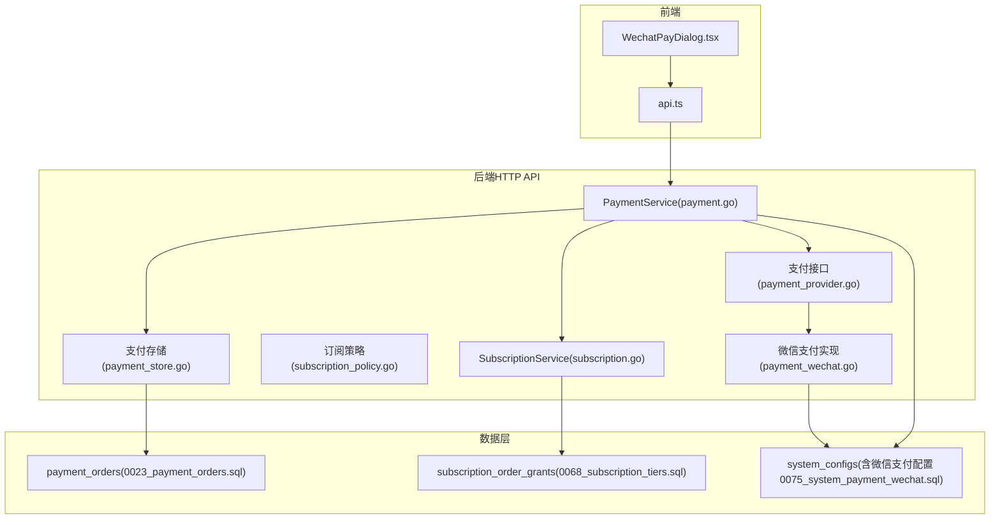
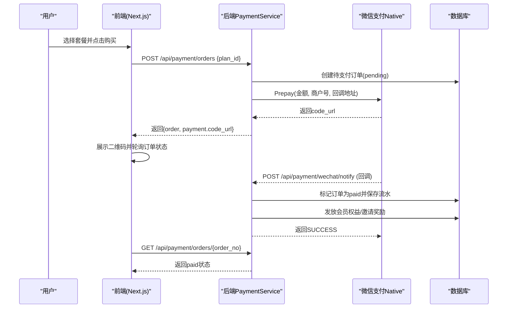
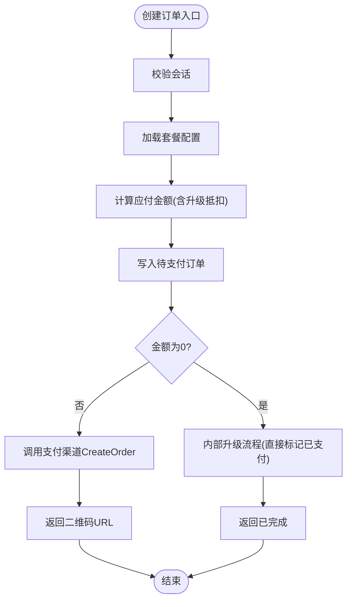
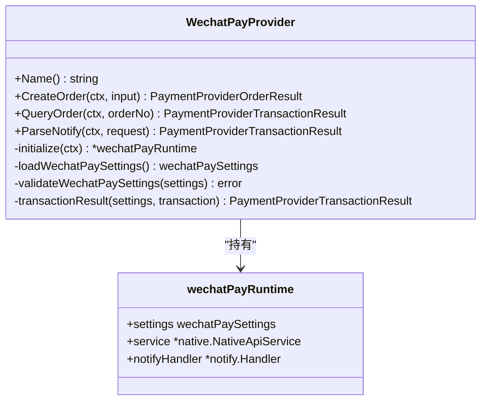
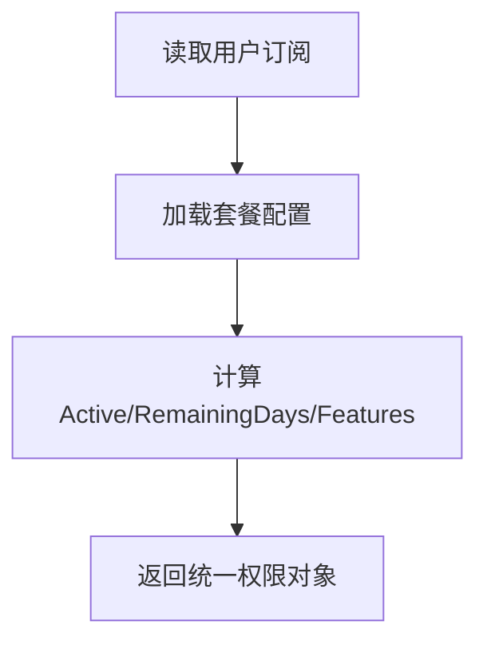
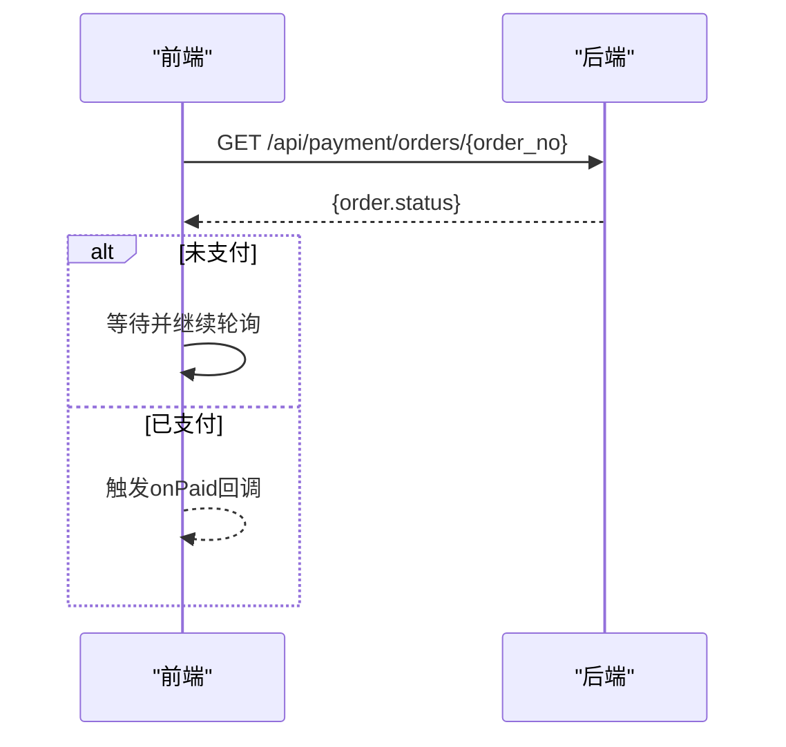
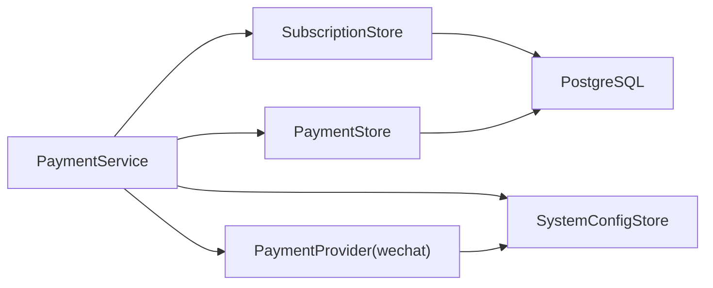

# 支付订阅系统

<cite>
**本文引用的文件**
- [payment.go](file://goodhr5/cloud/backend/internal/httpapi/payment.go)
- [payment_wechat.go](file://goodhr5/cloud/backend/internal/httpapi/payment_wechat.go)
- [subscription.go](file://goodhr5/cloud/backend/internal/httpapi/subscription.go)
- [subscription_policy.go](file://goodhr5/cloud/backend/internal/httpapi/subscription_policy.go)
- [payment_store.go](file://goodhr5/cloud/backend/internal/httpapi/payment_store.go)
- [payment_provider.go](file://goodhr5/cloud/backend/internal/httpapi/payment_provider.go)
- [0023_payment_orders.sql](file://goodhr5/cloud/backend/db/migrations/0023_payment_orders.sql)
- [0068_subscription_tiers.sql](file://goodhr5/cloud/backend/db/migrations/0068_subscription_tiers.sql)
- [0074_wechat_payment_provider.sql](file://goodhr5/cloud/backend/db/migrations/0074_wechat_payment_provider.sql)
- [0075_system_payment_wechat.sql](file://goodhr5/cloud/backend/db/migrations/0075_system_payment_wechat.sql)
- [WechatPayDialog.tsx](file://goodhr5/cloud/frontend-next/components/payment/WechatPayDialog.tsx)
- [api.ts](file://goodhr5/cloud/frontend-next/lib/api.ts)
</cite>

## 目录
1. [简介](#简介)
2. [项目结构](#项目结构)
3. [核心组件](#核心组件)
4. [架构总览](#架构总览)
5. [详细组件分析](#详细组件分析)
6. [依赖关系分析](#依赖关系分析)
7. [性能与可靠性](#性能与可靠性)
8. [故障排查指南](#故障排查指南)
9. [结论](#结论)
10. [附录：API 规范与安全实践](#附录api-规范与安全实践)

## 简介
本系统实现了一套面向会员订阅的支付能力，重点包含微信支付集成、订单管理、订阅套餐控制、回调处理与状态同步。系统通过统一的支付抽象接口对接第三方支付平台（当前为微信支付），在支付成功后自动发放会员权益并支持邀请奖励；同时提供前端扫码支付弹窗与轮询确认机制，确保用户侧体验流畅。

## 项目结构
后端采用 Go 语言 HTTP API，围绕“支付服务 + 订阅服务 + 存储层 + 支付提供商”分层组织；数据库使用 PostgreSQL，迁移脚本定义表结构与默认配置；前端基于 Next.js，提供支付弹窗与统一请求封装。



图表来源
- [payment.go:68-189](file://goodhr5/cloud/backend/internal/httpapi/payment.go#L68-L189)
- [payment_wechat.go:69-137](file://goodhr5/cloud/backend/internal/httpapi/payment_wechat.go#L69-L137)
- [subscription.go:62-119](file://goodhr5/cloud/backend/internal/httpapi/subscription.go#L62-L119)
- [payment_store.go:13-50](file://goodhr5/cloud/backend/internal/httpapi/payment_store.go#L13-L50)
- [0023_payment_orders.sql:1-48](file://goodhr5/cloud/backend/db/migrations/0023_payment_orders.sql#L1-L48)
- [0068_subscription_tiers.sql:27-49](file://goodhr5/cloud/backend/db/migrations/0068_subscription_tiers.sql#L27-L49)
- [0075_system_payment_wechat.sql:1-19](file://goodhr5/cloud/backend/db/migrations/0075_system_payment_wechat.sql#L1-L19)

章节来源
- [payment.go:68-189](file://goodhr5/cloud/backend/internal/httpapi/payment.go#L68-L189)
- [payment_wechat.go:69-137](file://goodhr5/cloud/backend/internal/httpapi/payment_wechat.go#L69-L137)
- [subscription.go:62-119](file://goodhr5/cloud/backend/internal/httpapi/subscription.go#L62-L119)
- [payment_store.go:13-50](file://goodhr5/cloud/backend/internal/httpapi/payment_store.go#L13-L50)
- [0023_payment_orders.sql:1-48](file://goodhr5/cloud/backend/db/migrations/0023_payment_orders.sql#L1-L48)
- [0068_subscription_tiers.sql:27-49](file://goodhr5/cloud/backend/db/migrations/0068_subscription_tiers.sql#L27-L49)
- [0075_system_payment_wechat.sql:1-19](file://goodhr5/cloud/backend/db/migrations/0075_system_payment_wechat.sql#L1-L19)

## 核心组件
- 支付服务 PaymentService：负责创建订阅/AI余额订单、查询订单、处理微信回调、完成到账逻辑与邀请奖励。
- 微信支付提供商 WechatPayProvider：封装 V3 Native 下单、主动查单、回调验签解密，配置从系统配置表读取并热更新。
- 订阅服务 SubscriptionService：提供订阅状态与套餐列表接口，配合策略计算权限。
- 订阅策略 subscription_policy：解析套餐配置、计算会员权限、校验套餐合法性。
- 支付存储 PaymentStore：内存与PostgreSQL双实现，记录订单、标记已支付、幂等落库。
- 支付抽象 PaymentProvider：统一下单、查单、回调解析接口，便于扩展其他支付方式。

章节来源
- [payment.go:34-65](file://goodhr5/cloud/backend/internal/httpapi/payment.go#L34-L65)
- [payment_wechat.go:51-67](file://goodhr5/cloud/backend/internal/httpapi/payment_wechat.go#L51-L67)
- [subscription.go:50-60](file://goodhr5/cloud/backend/internal/httpapi/subscription.go#L50-L60)
- [subscription_policy.go:18-43](file://goodhr5/cloud/backend/internal/httpapi/subscription_policy.go#L18-L43)
- [payment_store.go:13-50](file://goodhr5/cloud/backend/internal/httpapi/payment_store.go#L13-L50)
- [payment_provider.go:10-44](file://goodhr5/cloud/backend/internal/httpapi/payment_provider.go#L10-L44)

## 架构总览
系统以“订单为中心”，将“支付渠道”、“订阅权益”、“系统配置”解耦。前端发起创建订单请求，后端生成订单号并调用支付渠道获取二维码；用户扫码后，支付渠道异步回调通知后端，后端校验金额与归属，标记订单并应用权益；同时支持前端轮询订单状态作为兜底。



图表来源
- [payment.go:79-189](file://goodhr5/cloud/backend/internal/httpapi/payment.go#L79-L189)
- [payment_wechat.go:69-137](file://goodhr5/cloud/backend/internal/httpapi/payment_wechat.go#L69-L137)
- [payment_store.go:147-183](file://goodhr5/cloud/backend/internal/httpapi/payment_store.go#L147-L183)
- [subscription.go:401-459](file://goodhr5/cloud/backend/internal/httpapi/subscription.go#L401-L459)

## 详细组件分析

### 支付服务 PaymentService
- 创建订阅订单：校验会话、加载套餐、计算实际应付金额（含升级抵扣）、写入订单、调用支付渠道创建订单或走内部升级流程。
- 创建AI余额订单：校验金额范围、写入订单、调用支付渠道创建订单。
- 查询订单：若订单仍为pending且未过期，会主动查单并尝试完成到账。
- 处理微信回调：解析并验签，校验金额与归属，标记订单并应用权益。
- 应用权益：根据订单类型分别充值AI余额或发放会员天数，并发送通知邮件；支持邀请人奖励。



图表来源
- [payment.go:79-189](file://goodhr5/cloud/backend/internal/httpapi/payment.go#L79-L189)
- [payment.go:524-560](file://goodhr5/cloud/backend/internal/httpapi/payment.go#L524-L560)

章节来源
- [payment.go:79-189](file://goodhr5/cloud/backend/internal/httpapi/payment.go#L79-L189)
- [payment.go:191-259](file://goodhr5/cloud/backend/internal/httpapi/payment.go#L191-L259)
- [payment.go:261-339](file://goodhr5/cloud/backend/internal/httpapi/payment.go#L261-L339)
- [payment.go:341-405](file://goodhr5/cloud/backend/internal/httpapi/payment.go#L341-L405)
- [payment.go:407-485](file://goodhr5/cloud/backend/internal/httpapi/payment.go#L407-L485)

### 微信支付提供商 WechatPayProvider
- 配置热更新：每次请求前从 system.payment_wechat 读取配置，变更时重建SDK客户端，无需重启。
- 下单：调用 Native Prepay，返回 code_url。
- 查单：按商户订单号查询交易状态。
- 回调解析：验签、解密、校验APPID/商户号/币种/交易类型，转换为统一结果。



图表来源
- [payment_wechat.go:51-67](file://goodhr5/cloud/backend/internal/httpapi/payment_wechat.go#L51-L67)
- [payment_wechat.go:69-137](file://goodhr5/cloud/backend/internal/httpapi/payment_wechat.go#L69-L137)
- [payment_wechat.go:139-251](file://goodhr5/cloud/backend/internal/httpapi/payment_wechat.go#L139-L251)
- [payment_wechat.go:253-283](file://goodhr5/cloud/backend/internal/httpapi/payment_wechat.go#L253-L283)

章节来源
- [payment_wechat.go:69-137](file://goodhr5/cloud/backend/internal/httpapi/payment_wechat.go#L69-L137)
- [payment_wechat.go:139-251](file://goodhr5/cloud/backend/internal/httpapi/payment_wechat.go#L139-L251)
- [payment_wechat.go:253-283](file://goodhr5/cloud/backend/internal/httpapi/payment_wechat.go#L253-L283)

### 订阅服务与策略
- 订阅状态：返回当前用户的会员类型、到期时间、是否有效及剩余天数。
- 套餐列表：从系统配置读取并校验套餐JSON，要求free/plus/max均存在且价格合法。
- 权限计算：根据会员类型与到期时间计算是否激活、是否允许自动回复、功能特性集合。



图表来源
- [subscription.go:62-119](file://goodhr5/cloud/backend/internal/httpapi/subscription.go#L62-L119)
- [subscription_policy.go:45-118](file://goodhr5/cloud/backend/internal/httpapi/subscription_policy.go#L45-L118)
- [subscription_policy.go:111-157](file://goodhr5/cloud/backend/internal/httpapi/subscription_policy.go#L111-L157)

章节来源
- [subscription.go:62-119](file://goodhr5/cloud/backend/internal/httpapi/subscription.go#L62-L119)
- [subscription_policy.go:45-118](file://goodhr5/cloud/backend/internal/httpapi/subscription_policy.go#L45-L118)
- [subscription_policy.go:111-157](file://goodhr5/cloud/backend/internal/httpapi/subscription_policy.go#L111-L157)

### 支付存储与幂等
- 订单表：记录订单号、用户、套餐、金额、支付渠道、状态、过期时间、回调原始数据等。
- 权益发放幂等：通过 subscription_order_grants 表保证同一订单+权益类型只发放一次。
- 标记已支付：仅当订单为pending时才能更新为paid，避免重复到账。

```mermaid
erDiagram
PAYMENT_ORDERS {
uuid id PK
text order_no UK
uuid user_id FK
text user_email
text plan_id
text plan_name
text member_type
int duration_days
int original_amount_cents
int discount_amount_cents
int amount_cents
text payment_provider
text trade_no
text status
timestamptz paid_at
timestamptz expired_at
jsonb notify_data
timestamptz created_at
timestamptz updated_at
}
SUBSCRIPTION_ORDER_GRANTS {
text order_no FK
text grant_type
uuid user_id FK
text user_email
text member_type
int duration_days
boolean replace_from_now
timestamptz subscription_expires_at
timestamptz applied_at
primary_key (order_no, grant_type)
}
PAYMENT_ORDERS ||--o{ SUBSCRIPTION_ORDER_GRANTS : "关联"
```

图表来源
- [0023_payment_orders.sql:1-48](file://goodhr5/cloud/backend/db/migrations/0023_payment_orders.sql#L1-L48)
- [0068_subscription_tiers.sql:27-49](file://goodhr5/cloud/backend/db/migrations/0068_subscription_tiers.sql#L27-L49)

章节来源
- [payment_store.go:13-50](file://goodhr5/cloud/backend/internal/httpapi/payment_store.go#L13-L50)
- [payment_store.go:233-257](file://goodhr5/cloud/backend/internal/httpapi/payment_store.go#L233-L257)
- [0023_payment_orders.sql:1-48](file://goodhr5/cloud/backend/db/migrations/0023_payment_orders.sql#L1-L48)
- [0068_subscription_tiers.sql:27-49](file://goodhr5/cloud/backend/db/migrations/0068_subscription_tiers.sql#L27-L49)

### 前端支付交互
- 弹窗组件：接收后端返回的 code_url，渲染二维码，并每1.5秒轮询订单状态，直到收到 paid。
- 统一请求：封装云端API基础地址与错误规范化，便于前后端联调。



图表来源
- [WechatPayDialog.tsx:61-93](file://goodhr5/cloud/frontend-next/components/payment/WechatPayDialog.tsx#L61-L93)
- [api.ts:20-43](file://goodhr5/cloud/frontend-next/lib/api.ts#L20-L43)

章节来源
- [WechatPayDialog.tsx:61-93](file://goodhr5/cloud/frontend-next/components/payment/WechatPayDialog.tsx#L61-L93)
- [api.ts:20-43](file://goodhr5/cloud/frontend-next/lib/api.ts#L20-L43)

## 依赖关系分析
- PaymentService 依赖：AuthService、PaymentStore、SubscriptionStore、SystemConfigStore、InvitationStore、Mailer、AIWalletStore、PaymentProvider 映射。
- WechatPayProvider 依赖：SystemConfigStore 读取微信支付配置，并使用官方 SDK 进行签名与加解密。
- SubscriptionStore 提供内存与PostgreSQL两种实现，保证幂等发放。
- 数据库迁移：新增支付订单表、订阅权益发放表、系统配置项（套餐与微信支付）。



图表来源
- [payment.go:34-65](file://goodhr5/cloud/backend/internal/httpapi/payment.go#L34-L65)
- [payment_wechat.go:51-67](file://goodhr5/cloud/backend/internal/httpapi/payment_wechat.go#L51-L67)
- [subscription.go:259-459](file://goodhr5/cloud/backend/internal/httpapi/subscription.go#L259-L459)
- [payment_store.go:137-257](file://goodhr5/cloud/backend/internal/httpapi/payment_store.go#L137-L257)

章节来源
- [payment.go:34-65](file://goodhr5/cloud/backend/internal/httpapi/payment.go#L34-L65)
- [payment_wechat.go:51-67](file://goodhr5/cloud/backend/internal/httpapi/payment_wechat.go#L51-L67)
- [subscription.go:259-459](file://goodhr5/cloud/backend/internal/httpapi/subscription.go#L259-L459)
- [payment_store.go:137-257](file://goodhr5/cloud/backend/internal/httpapi/payment_store.go#L137-L257)

## 性能与可靠性
- 配置热更新：微信支付配置变更后，下次请求即重建客户端，避免重启影响。
- 幂等保障：订单标记已支付与权益发放均具备幂等保护，防止回调重试导致重复到账。
- 主动查单：订单详情接口对pending订单主动查单，提升弱网或回调延迟场景下的用户体验。
- 并发安全：内存存储使用互斥锁；PostgreSQL权益发放使用事务与行级锁，保证一致性。
- 超时控制：权益发放事务设置超时，避免长事务阻塞。

[本节为通用指导，不直接分析具体文件]

## 故障排查指南
- 无法创建订单：检查会话有效性、套餐配置是否存在、支付渠道是否已配置。
- 二维码为空：确认微信支付返回了有效的 code_url。
- 回调失败：检查回调验签、金额匹配、APPID/商户号/币种/交易类型是否正确。
- 未到账：查看订单状态是否为 pending，确认 MarkPaid 是否成功执行；检查权益发放幂等表是否已记录。
- 邀请奖励未发放：检查邀请关系是否存在、邀请奖励配置是否启用。

章节来源
- [payment.go:341-405](file://goodhr5/cloud/backend/internal/httpapi/payment.go#L341-L405)
- [payment_wechat.go:119-137](file://goodhr5/cloud/backend/internal/httpapi/payment_wechat.go#L119-L137)
- [payment_store.go:233-257](file://goodhr5/cloud/backend/internal/httpapi/payment_store.go#L233-L257)
- [subscription.go:401-459](file://goodhr5/cloud/backend/internal/httpapi/subscription.go#L401-L459)

## 结论
本支付订阅系统以清晰的职责划分与幂等设计，实现了安全的微信支付集成、可靠的订单管理与灵活的订阅策略控制。通过配置热更新、主动查单与邀请奖励机制，兼顾了用户体验与运营灵活性。后续可在此基础上扩展更多支付渠道与计费模式。

[本节为总结性内容，不直接分析具体文件]

## 附录：API 规范与安全实践

### 支付相关API
- 创建订阅订单
  - 方法：POST
  - 路径：/api/payment/orders
  - 请求体：{ plan_id }
  - 响应：{ ok, order, payment }
  - 说明：若金额为0则走内部升级流程，直接返回已完成。

- 创建AI余额充值订单
  - 方法：POST
  - 路径：/api/payment/orders/ai-balance
  - 请求体：{ amount_cents | amount_yuan }
  - 响应：{ ok, order, payment }

- 查询我的订单
  - 方法：GET
  - 路径：/api/payment/orders
  - 响应：{ ok, orders }

- 管理员查看所有订单
  - 方法：GET
  - 路径：/api/payment/admin/orders
  - 响应：{ ok, orders }

- 订单详情
  - 方法：GET
  - 路径：/api/payment/orders/{order_no}
  - 响应：{ ok, order }
  - 说明：若订单仍为pending且未过期，会主动查单并尝试完成到账。

- 微信支付回调
  - 方法：POST
  - 路径：/api/payment/wechat/notify
  - 响应：{ code, message }
  - 说明：需返回SUCCESS表示处理成功。

章节来源
- [payment.go:79-189](file://goodhr5/cloud/backend/internal/httpapi/payment.go#L79-L189)
- [payment.go:191-259](file://goodhr5/cloud/backend/internal/httpapi/payment.go#L191-L259)
- [payment.go:261-339](file://goodhr5/cloud/backend/internal/httpapi/payment.go#L261-L339)
- [payment.go:341-362](file://goodhr5/cloud/backend/internal/httpapi/payment.go#L341-L362)

### 订阅相关API
- 查询订阅状态
  - 方法：GET
  - 路径：/api/subscription/status
  - 响应：{ ok, subscription }

- 获取套餐列表
  - 方法：GET
  - 路径：/api/subscription/plans
  - 响应：{ ok, plans }

章节来源
- [subscription.go:62-119](file://goodhr5/cloud/backend/internal/httpapi/subscription.go#L62-L119)

### 安全最佳实践
- 回调验签：必须使用微信支付官方SDK进行验签与解密，禁止自行实现。
- 金额校验：回调中严格校验金额、币种、APPID、商户号、交易类型。
- 幂等处理：订单标记与权益发放均需幂等，防止重复到账。
- 配置安全：微信支付密钥与证书建议以Base64形式保存在系统配置，并通过最小权限原则访问。
- 日志脱敏：记录日志时注意隐藏敏感信息（如私钥、完整回调报文）。
- 超时与重试：对外部调用设置合理超时；对回调处理进行幂等重试。

章节来源
- [payment_wechat.go:119-137](file://goodhr5/cloud/backend/internal/httpapi/payment_wechat.go#L119-L137)
- [payment_wechat.go:158-179](file://goodhr5/cloud/backend/internal/httpapi/payment_wechat.go#L158-L179)
- [payment_store.go:233-257](file://goodhr5/cloud/backend/internal/httpapi/payment_store.go#L233-L257)
- [0075_system_payment_wechat.sql:1-19](file://goodhr5/cloud/backend/db/migrations/0075_system_payment_wechat.sql#L1-L19)