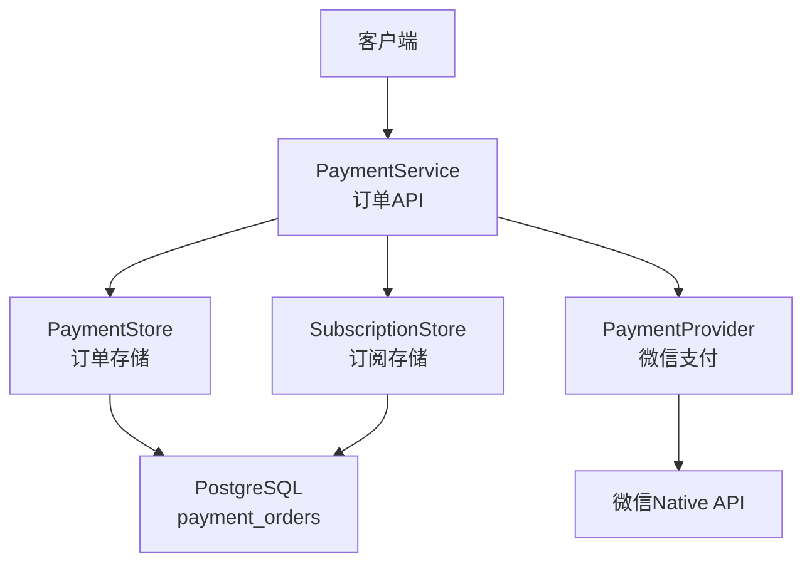
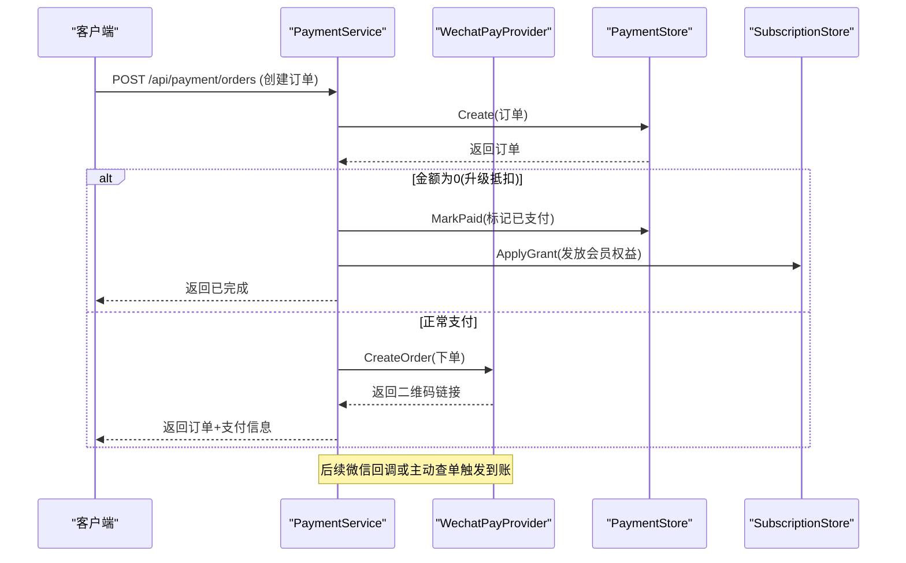
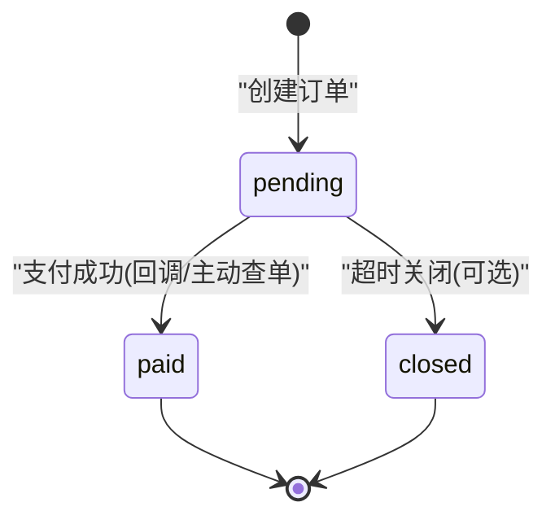
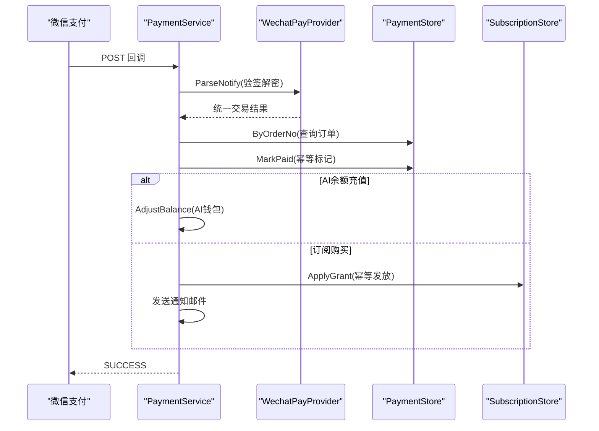
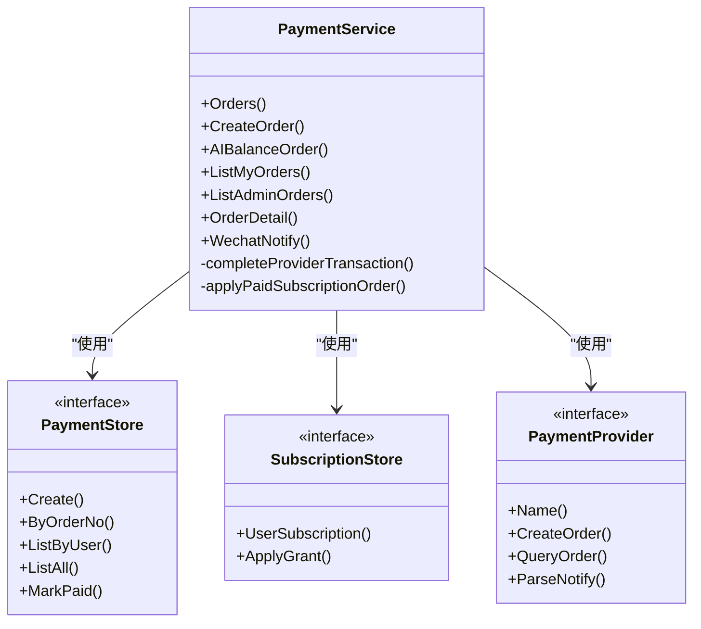

# 订单管理

<cite>
**本文引用的文件**
- [payment.go](file://goodhr5/cloud/backend/internal/httpapi/payment.go)
- [payment_store.go](file://goodhr5/cloud/backend/internal/httpapi/payment_store.go)
- [payment_wechat.go](file://goodhr5/cloud/backend/internal/httpapi/payment_wechat.go)
- [payment_provider.go](file://goodhr5/cloud/backend/internal/httpapi/payment_provider.go)
- [subscription.go](file://goodhr5/cloud/backend/internal/httpapi/subscription.go)
- [0023_payment_orders.sql](file://goodhr5/cloud/backend/db/migrations/0023_payment_orders.sql)
- [0074_wechat_payment_provider.sql](file://goodhr5/cloud/backend/db/migrations/0074_wechat_payment_provider.sql)
- [0022_user_subscription.sql](file://goodhr5/cloud/backend/db/migrations/0022_user_subscription.sql)
</cite>

## 目录
1. [简介](#简介)
2. [项目结构](#项目结构)
3. [核心组件](#核心组件)
4. [架构总览](#架构总览)
5. [详细组件分析](#详细组件分析)
6. [依赖关系分析](#依赖关系分析)
7. [性能与并发](#性能与并发)
8. [故障排查指南](#故障排查指南)
9. [结论](#结论)
10. [附录：接口规范与使用示例](#附录接口规范与使用示例)

## 简介
本仓库实现了会员订阅与AI余额充值的订单管理系统，覆盖订单创建、查询、状态流转、支付回调处理、过期时间控制、数据持久化、幂等发放、邀请奖励以及统计分析能力。系统采用“服务层 + 存储抽象 + 支付提供商”的分层设计，支持内存与PostgreSQL双实现，并通过统一的支付提供商接口扩展多种支付方式（当前内置微信支付）。

## 项目结构
订单相关代码集中在后端HTTP API模块中，主要包含以下职责划分：
- 订单服务：统一订单生命周期、金额计算、状态机、业务联动（会员权益、AI钱包、邀请奖励）
- 存储抽象：订单持久化的内存/PostgreSQL实现
- 支付提供商：统一支付平台接入（微信支付）
- 订阅服务：用户订阅状态读取与权益发放
- 数据库迁移：订单表结构与索引定义

图表来源
- [payment.go:34-65](file://goodhr5/cloud/backend/internal/httpapi/payment.go#L34-L65)
- [payment_store.go:13-50](file://goodhr5/cloud/backend/internal/httpapi/payment_store.go#L13-L50)
- [payment_wechat.go:51-62](file://goodhr5/cloud/backend/internal/httpapi/payment_wechat.go#L51-L62)
- [0023_payment_orders.sql:1-47](file://goodhr5/cloud/backend/db/migrations/0023_payment_orders.sql#L1-L47)

章节来源
- [payment.go:1-65](file://goodhr5/cloud/backend/internal/httpapi/payment.go#L1-L65)
- [payment_store.go:1-50](file://goodhr5/cloud/backend/internal/httpapi/payment_store.go#L1-L50)
- [payment_wechat.go:1-62](file://goodhr5/cloud/backend/internal/httpapi/payment_wechat.go#L1-L62)
- [0023_payment_orders.sql:1-47](file://goodhr5/cloud/backend/db/migrations/0023_payment_orders.sql#L1-L47)

## 核心组件
- PaymentService：订单创建、列表、详情、支付回调处理、到账业务联动（会员权益、AI钱包、邀请奖励）、主动查单补偿
- PaymentStore：订单持久化接口，提供内存与PostgreSQL实现；保证MarkPaid的幂等性
- WechatPayProvider：微信支付V3 Native下单、主动查单、回调验签解密
- SubscriptionStore：用户订阅状态读取与权益发放，支持幂等ApplyGrant
- 数据库迁移：payment_orders表结构、索引、默认值与注释

章节来源
- [payment.go:67-405](file://goodhr5/cloud/backend/internal/httpapi/payment.go#L67-L405)
- [payment_store.go:13-312](file://goodhr5/cloud/backend/internal/httpapi/payment_store.go#L13-L312)
- [payment_wechat.go:69-137](file://goodhr5/cloud/backend/internal/httpapi/payment_wechat.go#L69-L137)
- [subscription.go:18-48](file://goodhr5/cloud/backend/internal/httpapi/subscription.go#L18-L48)
- [0023_payment_orders.sql:1-47](file://goodhr5/cloud/backend/db/migrations/0023_payment_orders.sql#L1-L47)

## 架构总览
订单系统采用分层与插件化设计：
- HTTP API层：路由到PaymentService方法，完成鉴权、参数校验、业务编排
- 业务层：订单创建、金额报价、状态机、到账处理、通知邮件、邀请奖励
- 存储层：通过PaymentStore/SubscriptionStore抽象，屏蔽内存与PostgreSQL差异
- 支付层：通过PaymentProvider统一对接第三方支付，当前实现为微信支付

图表来源
- [payment.go:79-189](file://goodhr5/cloud/backend/internal/httpapi/payment.go#L79-L189)
- [payment_wechat.go:69-101](file://goodhr5/cloud/backend/internal/httpapi/payment_wechat.go#L69-L101)
- [payment_store.go:147-183](file://goodhr5/cloud/backend/internal/httpapi/payment_store.go#L147-L183)
- [subscription.go:401-459](file://goodhr5/cloud/backend/internal/httpapi/subscription.go#L401-L459)

## 详细组件分析

### 订单数据结构与持久化
- 订单主键：UUID
- 唯一订单号：order_no（系统生成，唯一）
- 用户关联：user_id、user_email
- 套餐信息：plan_id、plan_name、member_type、duration_days
- 金额字段：original_amount_cents、discount_amount_cents、amount_cents（单位分）
- 支付信息：payment_provider、trade_no
- 状态与时间：status（pending/paid/closed）、paid_at、expired_at
- 回调原始数据：notify_data（JSONB）
- 审计字段：created_at、updated_at
- 索引：按用户+创建时间、状态、邮箱优化查询

章节来源
- [0023_payment_orders.sql:1-47](file://goodhr5/cloud/backend/db/migrations/0023_payment_orders.sql#L1-L47)
- [payment_store.go:13-36](file://goodhr5/cloud/backend/internal/httpapi/payment_store.go#L13-L36)

### 订单号生成策略
- 订阅订单号：以“S”前缀加纳秒级时间戳
- AI余额充值订单号：同样使用统一生成器
- 注意：在高并发场景下建议结合分布式ID或数据库唯一约束保障唯一性（当前依赖DB唯一约束）

章节来源
- [payment.go:597-600](file://goodhr5/cloud/backend/internal/httpapi/payment.go#L597-L600)

### 订单状态与流转规则
- 初始状态：pending
- 支付成功：paid（由回调或主动查单触发）
- 关闭状态：closed（用于表示不再处理的订单，例如超时关闭）
- 状态机约束：
  - 仅pending可转为paid
  - paid不可逆
  - closed不可重新打开

图表来源
- [payment_store.go:113-135](file://goodhr5/cloud/backend/internal/httpapi/payment_store.go#L113-L135)
- [payment_store.go:233-257](file://goodhr5/cloud/backend/internal/httpapi/payment_store.go#L233-L257)

### 订单过期处理
- 创建订单时设置expired_at为当前时间+30分钟
- 订单详情查询时，若仍为pending且未过期，会调用支付提供商主动查单，若查到已支付则自动完成到账
- 前端或后台可基于expired_at进行展示与清理策略（如定时任务将过期订单置为closed）

章节来源
- [payment.go:121-126](file://goodhr5/cloud/backend/internal/httpapi/payment.go#L121-L126)
- [payment.go:324-337](file://goodhr5/cloud/backend/internal/httpapi/payment.go#L324-L337)
- [payment_wechat.go:78-84](file://goodhr5/cloud/backend/internal/httpapi/payment_wechat.go#L78-L84)

### 支付回调与到账处理
- 微信支付回调：验签、解密、校验交易归属（AppID、商户号、币种、交易类型），转换为统一结果
- 到账流程：
  - 校验订单存在、支付提供商一致、金额一致
  - 幂等标记订单为paid，记录trade_no与notify_data
  - 根据订单类型：
    - AI余额充值：调整AI钱包余额
    - 订阅购买：应用会员权益并发送邮件通知
  - 邀请奖励：给邀请人发放会员天数并通知

图表来源
- [payment.go:341-405](file://goodhr5/cloud/backend/internal/httpapi/payment.go#L341-L405)
- [payment_wechat.go:119-137](file://goodhr5/cloud/backend/internal/httpapi/payment_wechat.go#L119-L137)
- [subscription.go:401-459](file://goodhr5/cloud/backend/internal/httpapi/subscription.go#L401-L459)

### 金额报价与套餐切换
- 订阅订单创建前计算实际应付金额：
  - 基础价格=原价-折扣
  - Plus转Max时，按Plus剩余有效期折算抵扣金额
  - Max转Plus不收费
- 报价逻辑确保不会出现负数金额，并在配置缺失或异常时返回错误

章节来源
- [payment.go:111-119](file://goodhr5/cloud/backend/internal/httpapi/payment.go#L111-L119)
- [payment.go:524-560](file://goodhr5/cloud/backend/internal/httpapi/payment.go#L524-L560)

### 订阅权益发放与幂等
- 通过ApplyGrant按订单号与权益类型幂等发放，避免重复到账
- PostgreSQL实现使用事务与FOR UPDATE锁，确保并发安全
- 内存实现使用互斥锁与去重集合保证幂等

章节来源
- [subscription.go:401-459](file://goodhr5/cloud/backend/internal/httpapi/subscription.go#L401-L459)
- [subscription.go:231-257](file://goodhr5/cloud/backend/internal/httpapi/subscription.go#L231-L257)

### 邀请奖励机制
- 支付成功后，根据被邀请人订单时长计算邀请人奖励天数
- 通过ApplyGrant发放邀请人会员权益并发送邮件通知

章节来源
- [payment.go:441-485](file://goodhr5/cloud/backend/internal/httpapi/payment.go#L441-L485)

## 依赖关系分析
- PaymentService依赖：
  - AuthService：会话与权限校验
  - PaymentStore：订单持久化
  - SubscriptionStore：订阅状态与权益发放
  - SystemConfigStore：系统配置（套餐、支付配置）
  - InvitationStore：邀请关系
  - Mailer：邮件通知
  - AIWalletStore：AI钱包余额调整
  - PaymentProvider：支付平台接入

图表来源
- [payment.go:34-65](file://goodhr5/cloud/backend/internal/httpapi/payment.go#L34-L65)
- [payment_store.go:38-50](file://goodhr5/cloud/backend/internal/httpapi/payment_store.go#L38-L50)
- [subscription.go:34-48](file://goodhr5/cloud/backend/internal/httpapi/subscription.go#L34-L48)
- [payment_provider.go:10-20](file://goodhr5/cloud/backend/internal/httpapi/payment_provider.go#L10-L20)

章节来源
- [payment.go:34-65](file://goodhr5/cloud/backend/internal/httpapi/payment.go#L34-L65)
- [payment_store.go:38-50](file://goodhr5/cloud/backend/internal/httpapi/payment_store.go#L38-L50)
- [subscription.go:34-48](file://goodhr5/cloud/backend/internal/httpapi/subscription.go#L34-L48)
- [payment_provider.go:10-20](file://goodhr5/cloud/backend/internal/httpapi/payment_provider.go#L10-L20)

## 性能与并发
- 并发控制
  - 内存存储：使用互斥锁保护读写
  - PostgreSQL存储：MarkPaid使用UPDATE WHERE status='pending'保证原子性；ApplyGrant使用事务与行级锁（FOR UPDATE）防止重复发放
- 查询优化
  - 索引：user_id+created_at、status、user_email提升常见查询性能
  - 列表限制：ListAll限制返回条数（如500）避免大表全量扫描
- 支付回调与主动查单
  - 回调路径优先，详情查询时若仍pending且未过期会主动查单并尝试到账，提高最终一致性
- 配置热更新
  - 微信支付配置变化时自动重建SDK客户端，无需重启服务

章节来源
- [payment_store.go:53-135](file://goodhr5/cloud/backend/internal/httpapi/payment_store.go#L53-L135)
- [payment_store.go:233-257](file://goodhr5/cloud/backend/internal/httpapi/payment_store.go#L233-L257)
- [subscription.go:401-459](file://goodhr5/cloud/backend/internal/httpapi/subscription.go#L401-L459)
- [payment_wechat.go:195-251](file://goodhr5/cloud/backend/internal/httpapi/payment_wechat.go#L195-L251)
- [0023_payment_orders.sql:45-47](file://goodhr5/cloud/backend/db/migrations/0023_payment_orders.sql#L45-L47)

## 故障排查指南
- 常见错误与处理
  - 会话无效或过期：返回未授权
  - 套餐不存在或配置错误：返回未找到或服务不可用
  - 支付提供商未配置：返回服务不可用
  - 回调验签失败：返回失败并记录日志
  - 金额不一致或提供商不匹配：拒绝到账
  - 订单已关闭或已支付：幂等返回，不重复处理
- 定位步骤
  - 检查订单状态与过期时间
  - 查看回调日志与raw数据
  - 核对支付提供商配置（AppID、商户号、密钥等）
  - 确认订阅权益是否已发放（幂等表）
  - 必要时主动查单并再次尝试到账

章节来源
- [payment.go:80-189](file://goodhr5/cloud/backend/internal/httpapi/payment.go#L80-L189)
- [payment.go:341-405](file://goodhr5/cloud/backend/internal/httpapi/payment.go#L341-L405)
- [payment_wechat.go:139-179](file://goodhr5/cloud/backend/internal/httpapi/payment_wechat.go#L139-L179)
- [payment_store.go:113-135](file://goodhr5/cloud/backend/internal/httpapi/payment_store.go#L113-L135)

## 结论
该订单管理系统通过清晰的分层与插件化设计，实现了订单创建、查询、状态管理、支付回调、过期处理、数据持久化、幂等发放与邀请奖励等完整能力。系统具备良好的可扩展性与健壮性，适合在生产环境部署与持续演进。

## 附录：接口规范与使用示例

### 订单接口规范
- 创建订阅订单
  - 方法：POST
  - 路径：/api/payment/orders
  - 请求体：{ plan_id: string }
  - 响应：{ ok, order, payment? }
  - 说明：金额为0时直接完成（升级抵扣），否则返回支付二维码链接
- 创建AI余额充值订单
  - 方法：POST
  - 路径：/api/payment/ai-balance
  - 请求体：{ amount_cents?: number, amount_yuan?: string }
  - 响应：{ ok, order, payment }
- 查询我的订单列表
  - 方法：GET
  - 路径：/api/payment/orders
  - 响应：{ ok, orders[] }
- 管理员查询全部订单
  - 方法：GET
  - 路径：/api/payment/admin/orders
  - 响应：{ ok, orders[] }
- 查询订单详情
  - 方法：GET
  - 路径：/api/payment/orders/{order_no}
  - 响应：{ ok, order }
  - 说明：若仍pending且未过期，会主动查单并尝试到账
- 微信支付回调
  - 方法：POST
  - 路径：/api/payment/wechat/notify
  - 响应：{ code, message }

章节来源
- [payment.go:67-339](file://goodhr5/cloud/backend/internal/httpapi/payment.go#L67-L339)

### 使用场景示例
- 用户购买月度Plus会员
  - 前端调用创建订阅订单接口，传入套餐ID
  - 服务端计算报价并创建订单，返回二维码链接
  - 用户扫码支付后，微信回调触发到账，会员权益发放并发送邮件通知
- Plus升级Max
  - 系统根据Plus剩余有效期折算抵扣金额，可能产生金额为0的订单
  - 直接标记已支付并应用权益，无需真实支付
- AI余额充值
  - 用户输入充值金额，创建订单并获取支付二维码
  - 支付成功后，AI钱包余额增加

章节来源
- [payment.go:79-259](file://goodhr5/cloud/backend/internal/httpapi/payment.go#L79-L259)
- [payment.go:407-485](file://goodhr5/cloud/backend/internal/httpapi/payment.go#L407-L485)

### 数据统计与分析
- 订单列表可按用户维度查询，便于统计个人消费与历史订单
- 管理员可拉取全部订单（限制条数）进行离线分析或报表导出
- 订阅状态与到期时间可用于计算活跃会员数、续费率等指标

章节来源
- [payment.go:261-293](file://goodhr5/cloud/backend/internal/httpapi/payment.go#L261-L293)
- [payment_store.go:197-231](file://goodhr5/cloud/backend/internal/httpapi/payment_store.go#L197-L231)