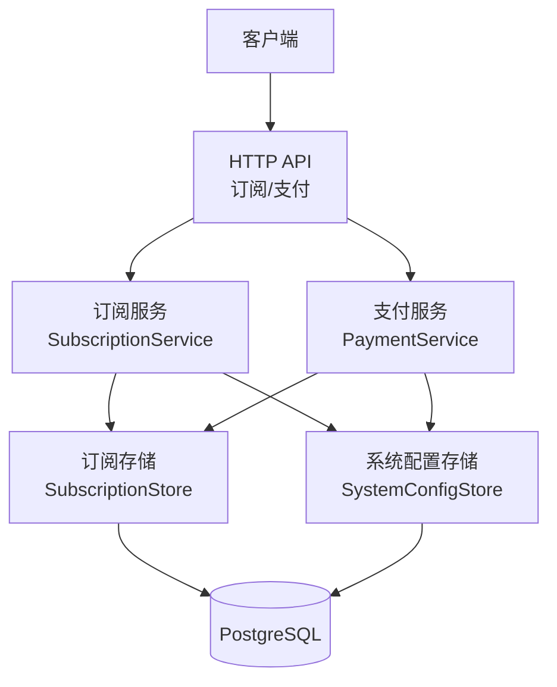
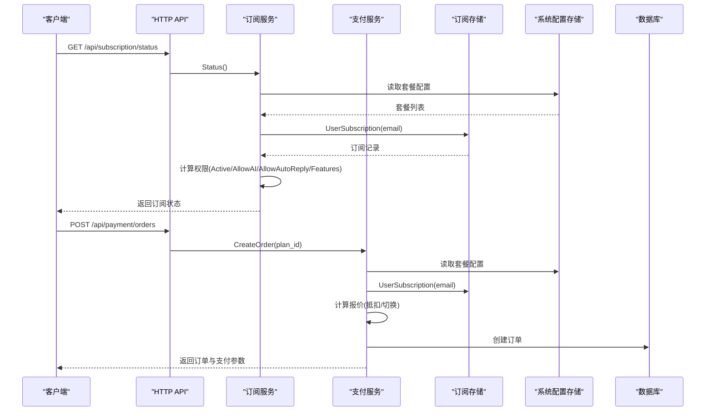
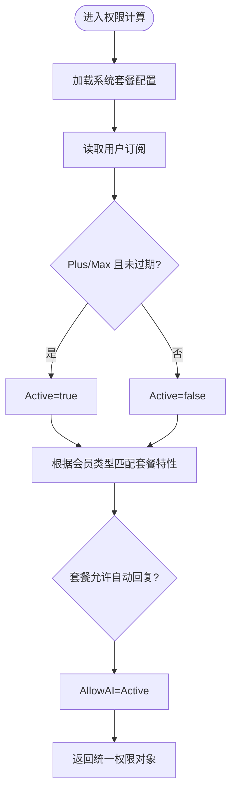
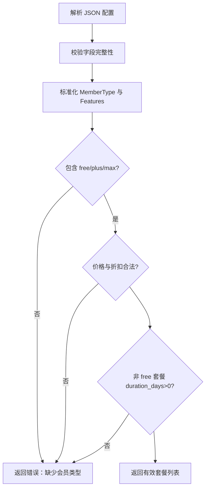
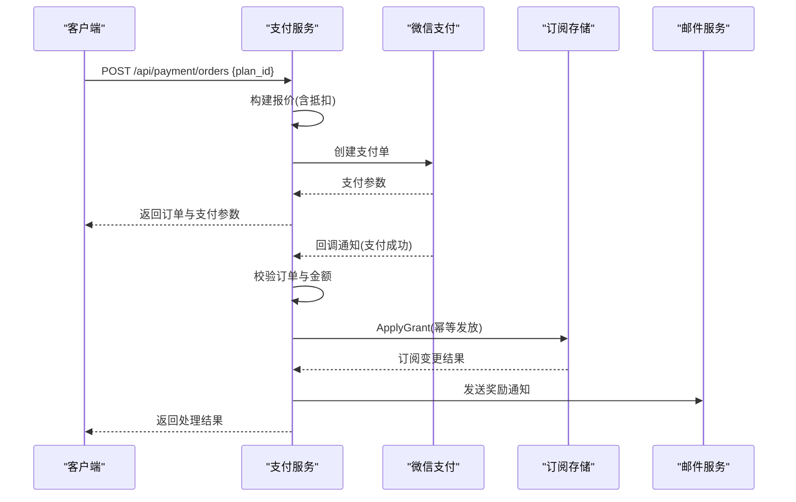
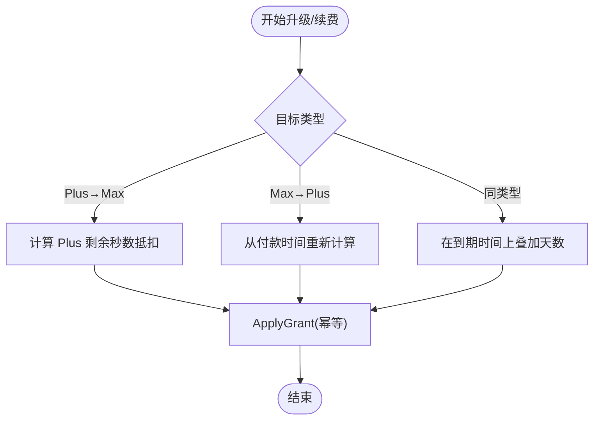
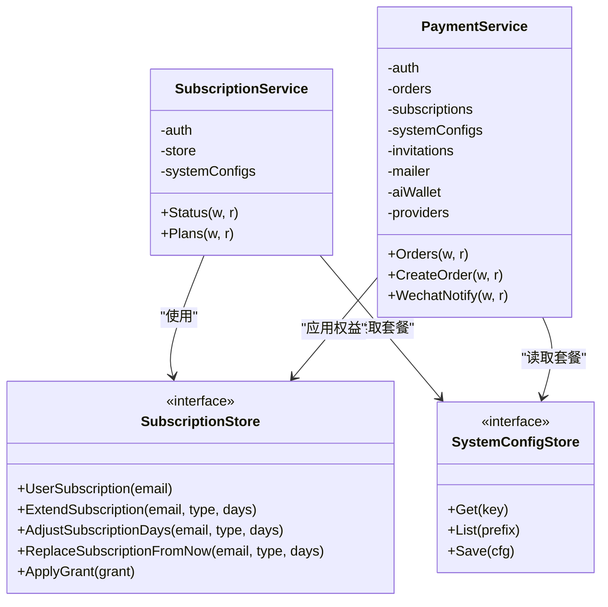
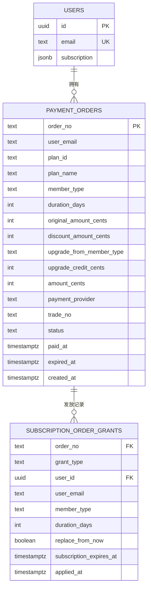

# 订阅策略管理

<cite>
**本文引用的文件**
- [subscription.go](file://goodhr5/cloud/backend/internal/httpapi/subscription.go)
- [subscription_policy.go](file://goodhr5/cloud/backend/internal/httpapi/subscription_policy.go)
- [payment.go](file://goodhr5/cloud/backend/internal/httpapi/payment.go)
- [system_config_store.go](file://goodhr5/cloud/backend/internal/httpapi/system_config_store.go)
- [0022_user_subscription.sql](file://goodhr5/cloud/backend/db/migrations/0022_user_subscription.sql)
- [0068_subscription_tiers.sql](file://goodhr5/cloud/backend/db/migrations/0068_subscription_tiers.sql)
- [0074_wechat_payment_provider.sql](file://goodhr5/cloud/backend/db/migrations/0074_wechat_payment_provider.sql)
- [subscription.ts](file://goodhr5/cloud/frontend-next/lib/subscription.ts)
</cite>

## 目录
1. [简介](#简介)
2. [项目结构](#项目结构)
3. [核心组件](#核心组件)
4. [架构总览](#架构总览)
5. [详细组件分析](#详细组件分析)
6. [依赖关系分析](#依赖关系分析)
7. [性能与扩展性](#性能与扩展性)
8. [故障排查指南](#故障排查指南)
9. [结论](#结论)
10. [附录：配置示例与业务场景](#附录配置示例与业务场景)

## 简介
本文件系统性梳理 GoodHR 云端后端的订阅策略管理能力，覆盖套餐配置、权限控制、计费逻辑、升级降级规则、续费计算、订阅状态检查、功能开关控制、使用量统计、审计记录与数据分析等。文档以代码为依据，提供架构图、时序图、流程图和数据库模型说明，帮助开发者理解并扩展订阅系统。

## 项目结构
订阅能力由后端 HTTP API、订阅策略评估、支付订单与回调、系统配置存储、前端订阅工具函数共同组成。关键路径如下：
- 后端订阅服务与策略评估：HTTP API 暴露订阅状态与套餐列表；策略层统一解析套餐并计算权限。
- 支付与订单：创建订阅订单、处理第三方支付回调、完成到账并幂等发放会员权益。
- 数据存储：用户订阅信息存储在 users.subscription JSONB；支付订单与权益发放记录在 payment_orders 与 subscription_order_grants。
- 系统配置：订阅套餐定义通过 system_configs.system.subscription_plans 维护。
- 前端：统一解析订阅状态、功能开关与套餐报价。

图表来源
- [subscription.go:50-119](file://goodhr5/cloud/backend/internal/httpapi/subscription.go#L50-L119)
- [payment.go:34-189](file://goodhr5/cloud/backend/internal/httpapi/payment.go#L34-L189)
- [system_config_store.go:19-27](file://goodhr5/cloud/backend/internal/httpapi/system_config_store.go#L19-L27)

章节来源
- [subscription.go:50-119](file://goodhr5/cloud/backend/internal/httpapi/subscription.go#L50-L119)
- [payment.go:34-189](file://goodhr5/cloud/backend/internal/httpapi/payment.go#L34-L189)
- [system_config_store.go:19-27](file://goodhr5/cloud/backend/internal/httpapi/system_config_store.go#L19-L27)

## 核心组件
- 订阅服务（SubscriptionService）：提供查询当前订阅状态、获取套餐列表的接口；内部调用策略层计算权限。
- 订阅策略（subscription_policy）：统一解析系统配置的套餐，计算 Active、AllowAI、AllowAutoReply、Features 等权限。
- 支付服务（PaymentService）：创建订阅订单、处理微信支付回调、完成到账并应用权益；支持邀请奖励。
- 订阅存储（SubscriptionStore）：内存与 PostgreSQL 双实现，提供读取、延长、调整、替换、幂等发放权益等能力。
- 系统配置存储（SystemConfigStore）：内存与 PostgreSQL 双实现，提供订阅套餐配置读取。
- 前端订阅工具（subscription.ts）：统一解析订阅状态、功能开关、套餐报价，供页面展示与交互。

章节来源
- [subscription.go:18-59](file://goodhr5/cloud/backend/internal/httpapi/subscription.go#L18-L59)
- [subscription_policy.go:18-43](file://goodhr5/cloud/backend/internal/httpapi/subscription_policy.go#L18-L43)
- [payment.go:34-65](file://goodhr5/cloud/backend/internal/httpapi/payment.go#L34-L65)
- [system_config_store.go:11-27](file://goodhr5/cloud/backend/internal/httpapi/system_config_store.go#L11-L27)
- [subscription.ts:3-34](file://goodhr5/cloud/frontend-next/lib/subscription.ts#L3-L34)

## 架构总览
订阅策略的核心流程包括：
- 读取用户订阅与系统套餐配置。
- 计算统一权限（Active、AllowAI、AllowAutoReply、Features）。
- 支付创建订单、第三方回调、幂等发放权益。
- 记录权益发放历史，支持审计与数据分析。

图表来源
- [subscription.go:62-119](file://goodhr5/cloud/backend/internal/httpapi/subscription.go#L62-L119)
- [payment.go:79-189](file://goodhr5/cloud/backend/internal/httpapi/payment.go#L79-L189)
- [system_config_store.go:349-411](file://goodhr5/cloud/backend/internal/httpapi/system_config_store.go#L349-L411)

## 详细组件分析

### 订阅状态与权限计算
- 订阅状态接口返回 member_type、member_name、expires_at、active、remaining_days、remaining_seconds、allow_ai、allow_auto_reply、features。
- 权限计算基于：
  - 会员类型：free、plus、max。
  - 到期时间：仅 plus/max 且未过期为 active。
  - 套餐配置：是否允许自动回复、特性列表。
- 默认试用：新用户注册赠送 Max 全能版 3 天（迁移中设置默认值）。

图表来源
- [subscription_policy.go:111-157](file://goodhr5/cloud/backend/internal/httpapi/subscription_policy.go#L111-L157)
- [subscription.go:121-135](file://goodhr5/cloud/backend/internal/httpapi/subscription.go#L121-L135)

章节来源
- [subscription_policy.go:111-157](file://goodhr5/cloud/backend/internal/httpapi/subscription_policy.go#L111-L157)
- [subscription.go:121-135](file://goodhr5/cloud/backend/internal/httpapi/subscription.go#L121-L135)

### 套餐配置与校验
- 套餐配置键：system.subscription_plans，JSON 数组包含 free、monthly、yearly 三类。
- 校验规则：
  - 必须包含 free、plus、max 三种会员类型。
  - ID、Name 必填；MemberType 需标准化；Features 去空。
  - 价格与折扣非负；优惠金额不超过原价。
  - 非 free 套餐 duration_days 必须大于 0。
  - allow_auto_reply 必填。

图表来源
- [subscription_policy.go:57-109](file://goodhr5/cloud/backend/internal/httpapi/subscription_policy.go#L57-L109)
- [system_config_store.go:86-128](file://goodhr5/cloud/backend/internal/httpapi/system_config_store.go#L86-L128)

章节来源
- [subscription_policy.go:57-109](file://goodhr5/cloud/backend/internal/httpapi/subscription_policy.go#L57-L109)
- [system_config_store.go:86-128](file://goodhr5/cloud/backend/internal/httpapi/system_config_store.go#L86-L128)

### 支付订单与回调处理
- 创建订单：
  - 校验 plan_id，读取套餐配置与当前订阅。
  - 计算报价：普通购买或套餐切换（Plus 升级 Max 按剩余时间折算抵扣）。
  - 创建订单并返回支付参数；若金额为 0（纯抵扣），直接标记已支付并应用权益。
- 回调处理：
  - 解析微信支付通知，校验订单号、金额、平台一致性。
  - 标记订单为 paid，并应用权益（订阅或 AI 余额充值）。
  - 发送订阅奖励邮件与邀请奖励。

图表来源
- [payment.go:79-189](file://goodhr5/cloud/backend/internal/httpapi/payment.go#L79-L189)
- [payment.go:341-405](file://goodhr5/cloud/backend/internal/httpapi/payment.go#L341-L405)
- [subscription.go:401-459](file://goodhr5/cloud/backend/internal/httpapi/subscription.go#L401-L459)

章节来源
- [payment.go:79-189](file://goodhr5/cloud/backend/internal/httpapi/payment.go#L79-L189)
- [payment.go:341-405](file://goodhr5/cloud/backend/internal/httpapi/payment.go#L341-L405)
- [subscription.go:401-459](file://goodhr5/cloud/backend/internal/httpapi/subscription.go#L401-L459)

### 升级降级规则与续费计算
- 升级（Plus → Max）：
  - 按 Plus 套餐单价与剩余秒数折算抵扣金额，封顶目标套餐实付金额。
  - Max 从付款完成时间重新计算 365 天。
- 降级（Max → Plus）：
  - 不折算剩余时间，新套餐从付款时间重新计算。
- 续费（同类型续期）：
  - 在现有到期时间基础上叠加天数；若已过期则从当前时间起算。
- 幂等发放：
  - 同一订单号与权益类型只发放一次，记录于 subscription_order_grants。

图表来源
- [payment.go:524-560](file://goodhr5/cloud/backend/internal/httpapi/payment.go#L524-L560)
- [subscription.go:472-489](file://goodhr5/cloud/backend/internal/httpapi/subscription.go#L472-L489)

章节来源
- [payment.go:524-560](file://goodhr5/cloud/backend/internal/httpapi/payment.go#L524-L560)
- [subscription.go:472-489](file://goodhr5/cloud/backend/internal/httpapi/subscription.go#L472-L489)

### 订阅状态检查与功能开关
- 前端统一判断：
  - canUseAI：active && allow_ai。
  - canUseAutoReply：active && allow_auto_reply。
- 后端统一权限：
  - Active：Plus/Max 且未过期。
  - AllowAI：Active。
  - AllowAutoReply：Active 且套餐允许。
  - Features：来自对应套餐的特性列表。

章节来源
- [subscription.ts:91-99](file://goodhr5/cloud/frontend-next/lib/subscription.ts#L91-L99)
- [subscription_policy.go:120-157](file://goodhr5/cloud/backend/internal/httpapi/subscription_policy.go#L120-L157)

### 使用量统计与审计日志
- 支付订单表 payment_orders：记录订单号、计划、金额、支付平台、状态、时间戳等。
- 权益发放表 subscription_order_grants：记录 order_no、grant_type、user_id、email、member_type、duration_days、replace_from_now、expires_at、applied_at。
- 通过订单与发放记录可追溯每次订阅变更的来源、时间与结果，支持审计与数据分析。

章节来源
- [0068_subscription_tiers.sql:27-49](file://goodhr5/cloud/backend/db/migrations/0068_subscription_tiers.sql#L27-L49)
- [payment.go:571-595](file://goodhr5/cloud/backend/internal/httpapi/payment.go#L571-L595)

## 依赖关系分析
- SubscriptionService 依赖 AuthService、SubscriptionStore、SystemConfigStore。
- PaymentService 依赖 AuthService、PaymentStore、SubscriptionStore、SystemConfigStore、InvitationStore、Mailer、AIWalletStore、PaymentProvider。
- 策略层依赖 SystemConfigStore 读取套餐配置。
- 前端依赖后端订阅与支付 API，并使用本地工具函数进行数据规范化与权限判断。

图表来源
- [subscription.go:50-59](file://goodhr5/cloud/backend/internal/httpapi/subscription.go#L50-L59)
- [payment.go:34-65](file://goodhr5/cloud/backend/internal/httpapi/payment.go#L34-L65)
- [system_config_store.go:19-27](file://goodhr5/cloud/backend/internal/httpapi/system_config_store.go#L19-L27)

章节来源
- [subscription.go:50-59](file://goodhr5/cloud/backend/internal/httpapi/subscription.go#L50-L59)
- [payment.go:34-65](file://goodhr5/cloud/backend/internal/httpapi/payment.go#L34-L65)
- [system_config_store.go:19-27](file://goodhr5/cloud/backend/internal/httpapi/system_config_store.go#L19-L27)

## 性能与扩展性
- 幂等发放：subscription_order_grants 主键 (order_no, grant_type) 保证重复回调不会重复增加会员时间。
- 事务保护：PostgreSQL 实现 ApplyGrant 在同一事务内加锁读取用户订阅并写入发放记录，避免并发问题。
- 配置缓存：系统配置可通过内存实现快速读取，生产环境使用 PostgreSQL 持久化。
- 可扩展点：
  - 新增会员类型需在套餐配置与策略校验中同步更新。
  - 新增支付渠道需实现 PaymentProvider 接口并在 PaymentService 中注册。
  - 新功能开关可通过套餐 Features 与 AllowAutoReply 控制。

章节来源
- [subscription.go:401-459](file://goodhr5/cloud/backend/internal/httpapi/subscription.go#L401-L459)
- [payment.go:364-405](file://goodhr5/cloud/backend/internal/httpapi/payment.go#L364-L405)

## 故障排查指南
- 订阅状态异常：
  - 检查 session 是否有效；确认系统套餐配置是否存在且有效。
  - 查看 users.subscription 是否为合法 JSON 且 expires_at 格式正确。
- 支付回调失败：
  - 核对订单号、金额、支付平台是否一致；检查回调签名与解密。
  - 查看 payment_orders 状态是否为 pending；确认 MarkPaid 是否成功。
- 权益未到账：
  - 检查 subscription_order_grants 是否已有相同 order_no 与 grant_type 的记录。
  - 查看 ApplyGrant 事务是否提交成功。
- 功能开关无效：
  - 确认套餐配置中 allow_auto_reply 与 features 是否正确。
  - 前端权限判断是否基于 active 与 allow_* 字段。

章节来源
- [subscription.go:62-93](file://goodhr5/cloud/backend/internal/httpapi/subscription.go#L62-L93)
- [payment.go:341-405](file://goodhr5/cloud/backend/internal/httpapi/payment.go#L341-L405)
- [subscription_policy.go:57-109](file://goodhr5/cloud/backend/internal/httpapi/subscription_policy.go#L57-L109)

## 结论
GoodHR 订阅系统通过统一的策略评估、幂等的权益发放、完善的支付回调与审计记录，实现了灵活的套餐管理与权限控制。开发者可基于现有接口与数据结构扩展新的会员类型、支付渠道与功能开关，同时保持系统的健壮性与可追溯性。

## 附录：配置示例与业务场景

### 数据库模型

图表来源
- [0022_user_subscription.sql:1-18](file://goodhr5/cloud/backend/db/migrations/0022_user_subscription.sql#L1-L18)
- [0068_subscription_tiers.sql:27-49](file://goodhr5/cloud/backend/db/migrations/0068_subscription_tiers.sql#L27-L49)
- [0074_wechat_payment_provider.sql:1-6](file://goodhr5/cloud/backend/db/migrations/0074_wechat_payment_provider.sql#L1-L6)

### 套餐配置示例
- 免费版：永久免费，基础自动打招呼与关键词筛选。
- 基础包月版：30 天，AI 筛选与自动打招呼，不支持自动回复。
- 全能包年版：365 天，开放自动回复与全部会员能力。

章节来源
- [0068_subscription_tiers.sql:55-98](file://goodhr5/cloud/backend/db/migrations/0068_subscription_tiers.sql#L55-L98)
- [system_config_store.go:86-128](file://goodhr5/cloud/backend/internal/httpapi/system_config_store.go#L86-L128)

### 业务场景
- 新用户注册：赠送 3 天 Max 全能版，体验自动回复等全部功能。
- Plus 升级 Max：按 Plus 剩余时间折算抵扣，Max 从付款时间重新计算 365 天。
- Max 降级 Plus：不折算剩余时间，新套餐从付款时间重新计算。
- 邀请奖励：被邀请用户支付成功后，邀请人获得按月计算的会员天数奖励。

章节来源
- [0068_subscription_tiers.sql:10-26](file://goodhr5/cloud/backend/db/migrations/0068_subscription_tiers.sql#L10-L26)
- [payment.go:441-485](file://goodhr5/cloud/backend/internal/httpapi/payment.go#L441-L485)