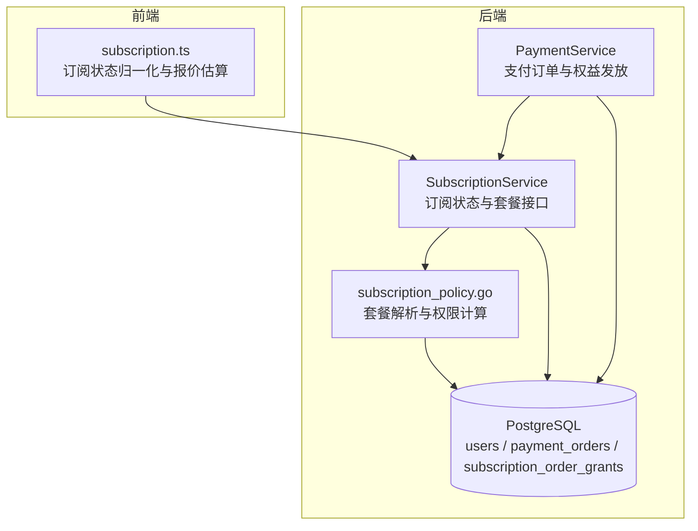
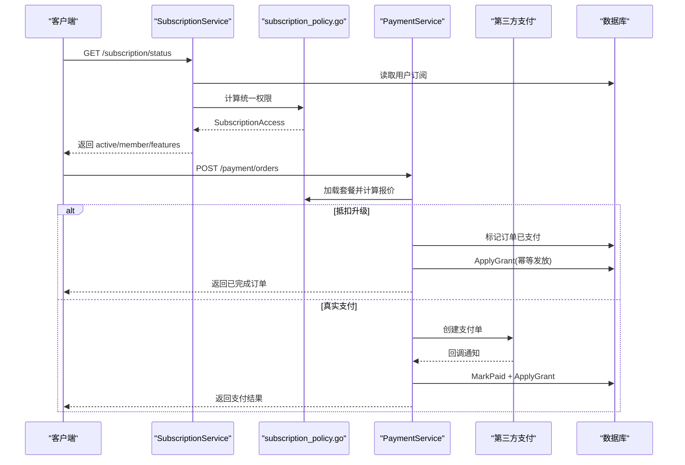
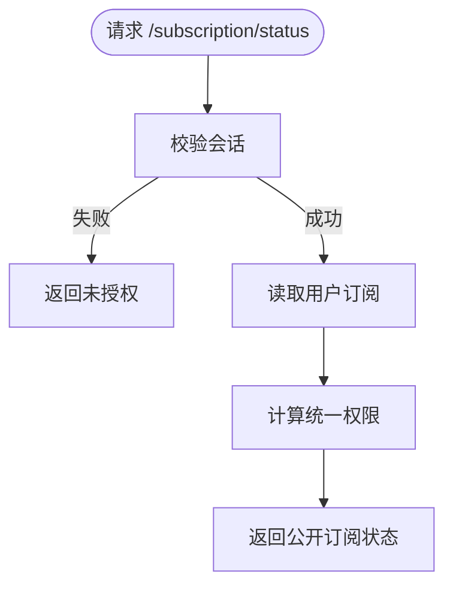
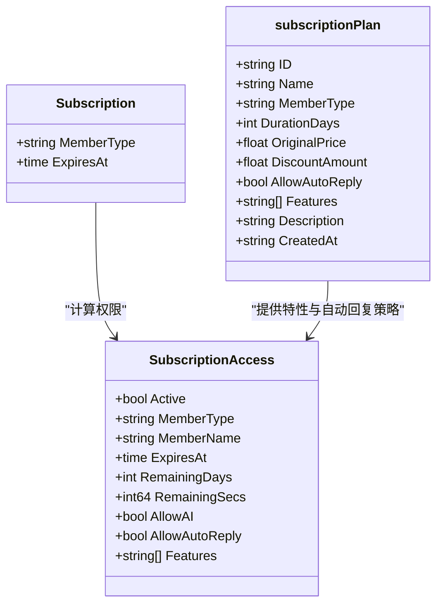
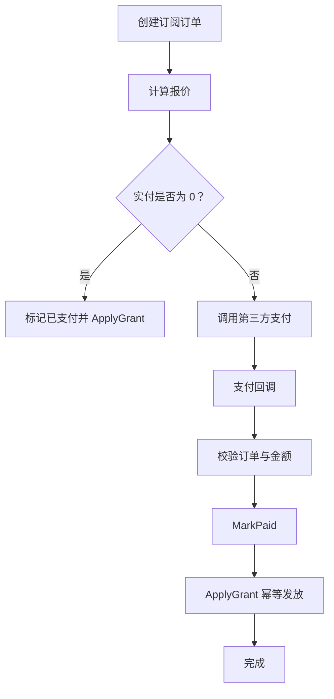
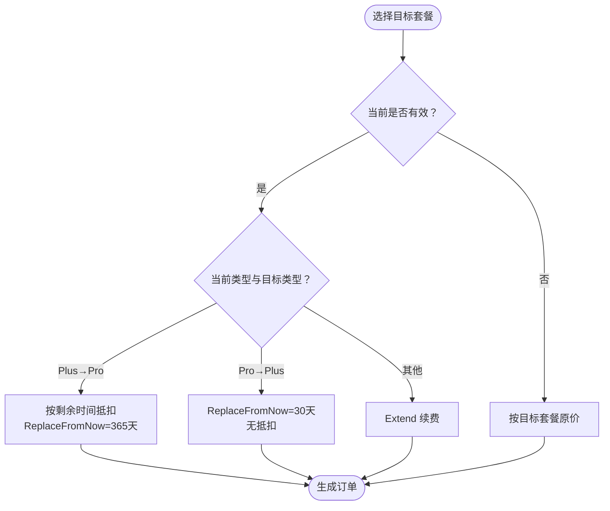
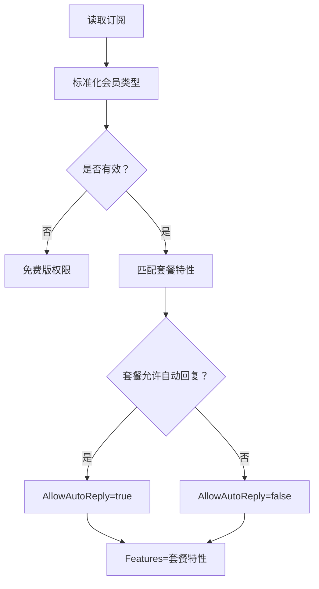
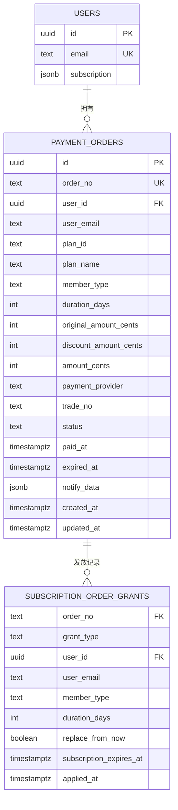
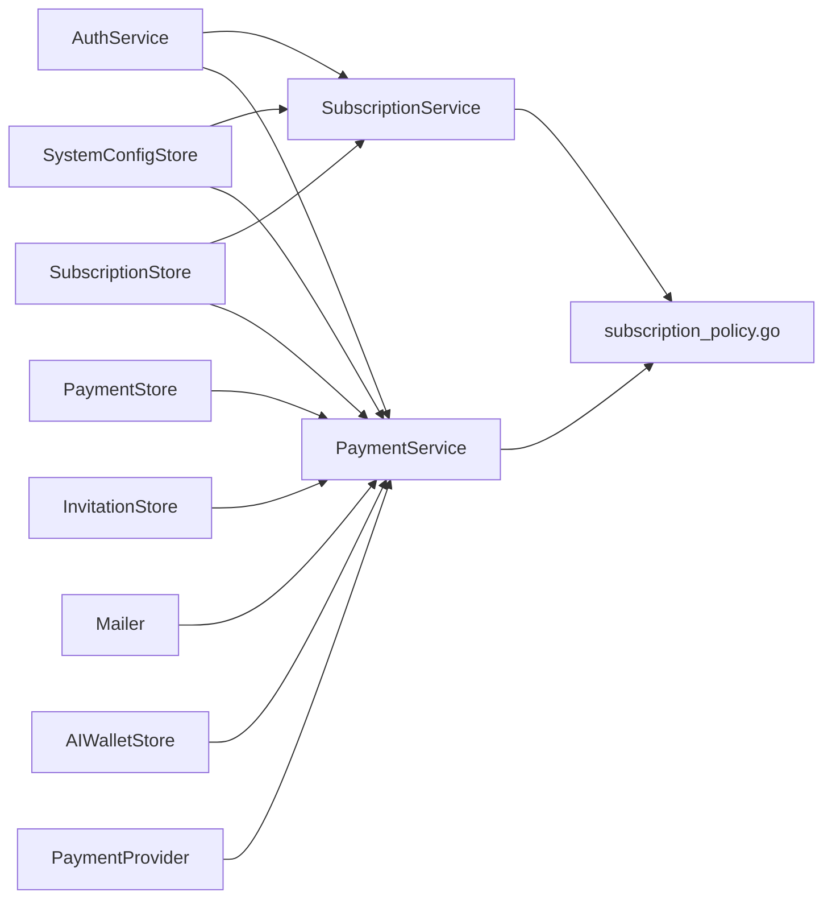

# 订阅策略管理

<cite>
**本文引用的文件**   
- [subscription.go](file://goodhr5/cloud/backend/internal/httpapi/subscription.go)
- [subscription_policy.go](file://goodhr5/cloud/backend/internal/httpapi/subscription_policy.go)
- [payment.go](file://goodhr5/cloud/backend/internal/httpapi/payment.go)
- [subscription.ts](file://goodhr5/cloud/frontend-next/lib/subscription.ts)
- [0022_user_subscription.sql](file://goodhr5/cloud/backend/db/migrations/0022_user_subscription.sql)
- [0023_payment_orders.sql](file://goodhr5/cloud/backend/db/migrations/0023_payment_orders.sql)
- [0068_subscription_tiers.sql](file://goodhr5/cloud/backend/db/migrations/0068_subscription_tiers.sql)
- [0069_subscription_grant_backfill.sql](file://goodhr5/cloud/backend/db/migrations/0069_subscription_grant_backfill.sql)
- [0087_update_subscription_prices.sql](file://goodhr5/cloud/backend/db/migrations/0087_update_subscription_prices.sql)
- [0088_remove_resume_request_from_free_tier.sql](file://goodhr5/cloud/backend/db/migrations/0088_remove_resume_request_from_free_tier.sql)
- [0089_adjust_plus_price.sql](file://goodhr5/cloud/backend/db/migrations/0089_adjust_plus_price.sql)
- [0090_update_pro_plan_description.sql](file://goodhr5/cloud/backend/db/migrations/0090_update_pro_plan_description.sql)
- [0091_fix_plan_features_text.sql](file://goodhr5/cloud/backend/db/migrations/0091_fix_plan_features_text.sql)
- [0092_add_unlimited_greet_feature.sql](file://goodhr5/cloud/backend/db/migrations/0092_add_unlimited_greet_feature.sql)
</cite>

## 更新摘要
**变更内容**   
- 更新了 Plus 包月会员价格从 ¥49.9 调整为 ¥19.9，反映权益调整（移除索要简历和自动回复）
- Pro 包年会员价格更新为 ¥999（原价 ¥1300），折扣金额 ¥301
- 免费版移除了"打招呼后索要简历"功能，招呼上限从每天 100 个调整为 20 个
- 新增"每天打招呼无上限"功能到 Plus 和 Pro 套餐
- 更新了各套餐的功能描述和特性列表，明确 PRO 专享能力
- 修正了前端定价计算逻辑以匹配新的价格体系

## 目录
1. [引言](#引言)
2. [项目结构](#项目结构)
3. [核心组件](#核心组件)
4. [架构总览](#架构总览)
5. [详细组件分析](#详细组件分析)
6. [依赖关系分析](#依赖关系分析)
7. [性能与一致性](#性能与一致性)
8. [故障排查指南](#故障排查指南)
9. [结论](#结论)
10. [附录：配置示例与业务场景](#附录配置示例与业务场景)

## 引言
本文围绕 HRPlus 云端后端的订阅策略管理系统，系统性说明订阅套餐配置、权限控制、计费逻辑、升级降级规则、续费计算、订阅状态检查、功能开关控制、使用量统计、审计记录以及前后端一致的定价与权益评估实现。文档同时提供数据库迁移、接口行为、错误处理与扩展建议，帮助开发者理解并安全扩展订阅系统。

**最新更新** 反映了最新的订阅模型调整，包括 Plus 计划价格大幅降低、Pro 计划更新、免费版功能精简以及新增的无限打招呼功能。

## 项目结构
订阅策略相关代码主要分布在后端 HTTP API 层与前端工具库中，并通过数据库迁移定义数据结构与默认配置：
- 后端订阅服务与策略：`goodhr5/cloud/backend/internal/httpapi/subscription.go`、`subscription_policy.go`、`payment.go`
- 前端订阅状态与报价工具：`goodhr5/cloud/frontend-next/lib/subscription.ts`
- 数据库结构与默认套餐：`0022_user_subscription.sql`、`0023_payment_orders.sql`、`0068_subscription_tiers.sql`、`0069_subscription_grant_backfill.sql`
- 价格调整迁移：`0087_update_subscription_prices.sql`、`0089_adjust_plus_price.sql`、`0088_remove_resume_request_from_free_tier.sql`、`0092_add_unlimited_greet_feature.sql`

**图表来源**
- [subscription.go:50-119](file://goodhr5/cloud/backend/internal/httpapi/subscription.go#L50-L119)
- [subscription_policy.go:45-157](file://goodhr5/cloud/backend/internal/httpapi/subscription_policy.go#L45-L157)
- [payment.go:67-189](file://goodhr5/cloud/backend/internal/httpapi/payment.go#L67-L189)
- [subscription.ts:1-34](file://goodhr5/cloud/frontend-next/lib/subscription.ts#L1-L34)

**章节来源**
- [subscription.go:1-119](file://goodhr5/cloud/backend/internal/httpapi/subscription.go#L1-L119)
- [subscription_policy.go:1-157](file://goodhr5/cloud/backend/internal/httpapi/subscription_policy.go#L1-L157)
- [payment.go:1-189](file://goodhr5/cloud/backend/internal/httpapi/payment.go#L1-L189)
- [subscription.ts:1-34](file://goodhr5/cloud/frontend-next/lib/subscription.ts#L1-L34)

## 核心组件
- 订阅数据模型与会话校验：用户订阅状态以 JSON 字段存储在用户表中，包含会员类型与到期时间；订阅查询需登录会话。
- 套餐配置与权限计算：通过系统配置 `system.subscription_plans` 维护免费版、Plus 包月、Pro 包年三类套餐，统一计算是否有效、剩余天数、AI 能力、自动回复能力与特性列表。
- 支付与权益发放：创建订阅订单、调用第三方支付、回调到账后幂等发放会员时长，支持 Plus 升 Pro 的按剩余时间抵扣与从付款时间重新计算。
- 前端订阅工具：对后端返回的订阅状态进行强类型归一化，并提供 AI 与自动回复能力判断、套餐切换报价估算。

**最新变更** Plus 包月会员价格已调整为 ¥19.9（原价 ¥49.9），Pro 包年会员价格为 ¥999（原价 ¥1300），免费版移除了索要简历功能。

**章节来源**
- [subscription.go:18-55](file://goodhr5/cloud/backend/internal/httpapi/subscription.go#L18-L55)
- [subscription_policy.go:18-43](file://goodhr5/cloud/backend/internal/httpapi/subscription_policy.go#L18-L43)
- [payment.go:34-65](file://goodhr5/cloud/backend/internal/httpapi/payment.go#L34-L65)
- [subscription.ts:3-34](file://goodhr5/cloud/frontend-next/lib/subscription.ts#L3-L34)

## 架构总览
订阅策略的核心流程包括：
1. 用户登录后查询订阅状态，后端根据当前会员记录与套餐配置计算统一权限。
2. 前端展示套餐列表与价格，并在购买或切换时估算实付金额与抵扣金额。
3. 后端创建支付订单，若为纯抵扣升级则直接标记已支付并应用权益；否则调用第三方支付。
4. 支付回调成功后，后端在事务内幂等发放会员权益，并记录审计信息。

**图表来源**
- [subscription.go:62-93](file://goodhr5/cloud/backend/internal/httpapi/subscription.go#L62-L93)
- [subscription_policy.go:111-157](file://goodhr5/cloud/backend/internal/httpapi/subscription_policy.go#L111-L157)
- [payment.go:80-189](file://goodhr5/cloud/backend/internal/httpapi/payment.go#L80-L189)
- [payment.go:341-405](file://goodhr5/cloud/backend/internal/httpapi/payment.go#L341-L405)

## 详细组件分析

### 订阅状态与套餐接口
- 订阅状态接口：
  - 需要登录会话，失败返回未授权。
  - 读取用户订阅后调用权限计算函数，返回公开字段，包括会员类型、名称、到期时间、是否有效、剩余天数、秒数、AI 与自动回复能力、特性列表。
- 套餐列表接口：
  - 从系统配置读取 `system.subscription_plans`，解析并返回套餐数组；若无配置则返回空数组。
  - 解析过程会校验必填字段、唯一性、价格合法性、必需会员类型存在等。

**图表来源**
- [subscription.go:62-93](file://goodhr5/cloud/backend/internal/httpapi/subscription.go#L62-L93)
- [subscription_policy.go:111-157](file://goodhr5/cloud/backend/internal/httpapi/subscription_policy.go#L111-L157)

**章节来源**
- [subscription.go:62-119](file://goodhr5/cloud/backend/internal/httpapi/subscription.go#L62-L119)
- [subscription_policy.go:45-157](file://goodhr5/cloud/backend/internal/httpapi/subscription_policy.go#L45-L157)

### 套餐配置与权限评估算法
- 套餐结构：
  - id、name、member_type、duration_days、original_price、discount_amount、allow_auto_reply、features、description、created_at。
- 校验规则：
  - 每个套餐必须有 id 和 name。
  - member_type 必须为 free、plus 或 pro，且每种类型只能出现一次。
  - allow_auto_reply 必填。
  - 非免费套餐的 duration_days 必须大于 0。
  - 原价与折扣金额不能为负，且折扣不能超过原价。
  - 必须同时包含 free、plus、pro 三种会员类型。
- 权限计算：
  - 有效会员：member_type 为 plus 或 pro，且 expires_at 晚于当前时间。
  - AllowAI：有效会员即为 true。
  - AllowAutoReply：有效会员且对应套餐允许自动回复。
  - Features：来自当前会员类型对应的套餐特性列表。
  - RemainingDays/RemainingSecs：基于到期时间与当前时间的差值计算。

**图表来源**
- [subscription.go:18-22](file://goodhr5/cloud/backend/internal/httpapi/subscription.go#L18-L22)
- [subscription_policy.go:18-43](file://goodhr5/cloud/backend/internal/httpapi/subscription_policy.go#L18-L43)
- [subscription_policy.go:120-157](file://goodhr5/cloud/backend/internal/httpapi/subscription_policy.go#L120-L157)

**章节来源**
- [subscription_policy.go:45-157](file://goodhr5/cloud/backend/internal/httpapi/subscription_policy.go#L45-L157)

### 支付订单与计费逻辑
- 创建订单：
  - 校验会话与 plan_id，加载套餐与当前订阅，计算报价。
  - 若金额为 0（抵扣升级），直接标记已支付并应用权益。
  - 否则调用第三方支付创建支付单，返回订单与支付参数。
- 支付回调：
  - 校验支付平台、订单号、金额一致。
  - 标记订单已支付，并根据订单类型处理：
    - AI 余额充值：调整 AI 钱包余额。
    - 订阅订单：应用会员权益发放。
- 权益发放：
  - 使用 `ApplyGrant` 幂等发放，避免重复回调导致重复增加时长。
  - 支持两种模式：
    - Extend：在当前到期时间基础上延长。
    - ReplaceFromNow：从付款完成时间重新计算。
- 报价计算：
  - 普通购买：实付 = 原价 - 折扣。
  - Plus 升 Pro：按 Plus 剩余时间折算抵扣金额，上限不超过目标套餐价格；Pro 从付款时间重新计算 365 天。
  - Pro 转 Plus：允许原价切换，不抵扣，从付款时间重新计算 30 天。

**图表来源**
- [payment.go:80-189](file://goodhr5/cloud/backend/internal/httpapi/payment.go#L80-L189)
- [payment.go:341-405](file://goodhr5/cloud/backend/internal/httpapi/payment.go#L341-L405)
- [payment.go:524-560](file://goodhr5/cloud/backend/internal/httpapi/payment.go#L524-L560)

**章节来源**
- [payment.go:80-189](file://goodhr5/cloud/backend/internal/httpapi/payment.go#L80-L189)
- [payment.go:341-405](file://goodhr5/cloud/backend/internal/httpapi/payment.go#L341-L405)
- [payment.go:524-560](file://goodhr5/cloud/backend/internal/httpapi/payment.go#L524-L560)

### 升级降级规则与续费计算
- 升级规则（Plus → Pro）：
  - 仅当当前会员为有效的 Plus 且目标为 Pro 时启用抵扣。
  - 抵扣金额 = min(目标套餐价格分, floor(Plus 套餐价格分 × 剩余秒数 / 周期秒数))。
  - 实付金额 = 目标套餐价格分 - 抵扣金额。
  - 发放时使用 ReplaceFromNow=true，从付款时间重新计算 365 天。
- 降级规则（Pro → Plus）：
  - 允许有效 Pro 切换到 Plus，不抵扣，实付为 Plus 原价。
  - 发放时使用 ReplaceFromNow=true，从付款时间重新计算 30 天。
- 续费规则（同类型续费）：
  - 使用 Extend 模式，在当前到期时间基础上延长相应天数。
- 前端报价估算：
  - 与后端保持一致的算法，用于展示预计实付与抵扣金额。

**图表来源**
- [payment.go:524-560](file://goodhr5/cloud/backend/internal/httpapi/payment.go#L524-L560)
- [subscription.go:472-489](file://goodhr5/cloud/backend/internal/httpapi/subscription.go#L472-L489)
- [subscription.ts:113-174](file://goodhr5/cloud/frontend-next/lib/subscription.ts#L113-L174)

**章节来源**
- [payment.go:524-560](file://goodhr5/cloud/backend/internal/httpapi/payment.go#L524-L560)
- [subscription.go:472-489](file://goodhr5/cloud/backend/internal/httpapi/subscription.go#L472-L489)
- [subscription.ts:113-174](file://goodhr5/cloud/frontend-next/lib/subscription.ts#L113-L174)

### 订阅状态检查与功能开关控制
- 状态检查：
  - Active：member_type 为 plus 或 pro 且 expires_at 晚于当前时间。
  - RemainingDays/RemainingSecs：用于 UI 显示与前端抵扣计算。
- 功能开关：
  - AllowAI：有效会员即开启。
  - AllowAutoReply：有效会员且套餐允许自动回复。
  - Features：由当前会员类型对应套餐的特性列表决定。
- 前端能力判断：
  - canUseAI：active 且 allow_ai。
  - canUseAutoReply：active 且 allow_auto_reply。

**图表来源**
- [subscription_policy.go:120-157](file://goodhr5/cloud/backend/internal/httpapi/subscription_policy.go#L120-L157)
- [subscription.ts:91-99](file://goodhr5/cloud/frontend-next/lib/subscription.ts#L91-L99)

**章节来源**
- [subscription_policy.go:120-157](file://goodhr5/cloud/backend/internal/httpapi/subscription_policy.go#L120-L157)
- [subscription.ts:91-99](file://goodhr5/cloud/frontend-next/lib/subscription.ts#L91-L99)

### 使用量统计与数据分析
- 支付记录表 `payment_orders` 记录订单号、用户邮箱、套餐、金额、支付渠道、交易流水、状态、过期时间等，便于财务与运营分析。
- 权益发放记录表 `subscription_order_grants` 记录每次权益发放的业务单号、权益类型（buyer/inviter）、用户、会员类型、天数、是否从当前时间重算、到期时间与发放时间，用于审计与防重。
- 历史补录迁移确保旧订单也有发放记录，防止支付平台重复回调造成重复加时。

**图表来源**
- [0023_payment_orders.sql:1-48](file://goodhr5/cloud/backend/db/migrations/0023_payment_orders.sql#L1-L48)
- [0068_subscription_tiers.sql:27-50](file://goodhr5/cloud/backend/db/migrations/0068_subscription_tiers.sql#L27-L50)
- [0069_subscription_grant_backfill.sql:1-63](file://goodhr5/cloud/backend/db/migrations/0069_subscription_grant_backfill.sql#L1-L63)

**章节来源**
- [0023_payment_orders.sql:1-48](file://goodhr5/cloud/backend/db/migrations/0023_payment_orders.sql#L1-L48)
- [0068_subscription_tiers.sql:27-50](file://goodhr5/cloud/backend/db/migrations/0068_subscription_tiers.sql#L27-L50)
- [0069_subscription_grant_backfill.sql:1-63](file://goodhr5/cloud/backend/db/migrations/0069_subscription_grant_backfill.sql#L1-L63)

## 依赖关系分析
- SubscriptionService 依赖 AuthService 进行会话校验，依赖 SystemConfigStore 读取套餐配置，依赖 SubscriptionStore 读写用户订阅。
- PaymentService 依赖 AuthService、PaymentStore、SubscriptionStore、SystemConfigStore、InvitationStore、Mailer、AIWalletStore 与第三方支付 Provider。
- subscription_policy.go 提供统一的套餐解析与权限计算，被 SubscriptionService 与 PaymentService 共同使用。
- 前端 subscription.ts 与后端策略保持一致的定价与能力判断逻辑，保证用户体验一致性。

**图表来源**
- [subscription.go:50-59](file://goodhr5/cloud/backend/internal/httpapi/subscription.go#L50-L59)
- [payment.go:34-65](file://goodhr5/cloud/backend/internal/httpapi/payment.go#L34-L65)
- [subscription_policy.go:45-55](file://goodhr5/cloud/backend/internal/httpapi/subscription_policy.go#L45-L55)

**章节来源**
- [subscription.go:50-59](file://goodhr5/cloud/backend/internal/httpapi/subscription.go#L50-L59)
- [payment.go:34-65](file://goodhr5/cloud/backend/internal/httpapi/payment.go#L34-L65)
- [subscription_policy.go:45-55](file://goodhr5/cloud/backend/internal/httpapi/subscription_policy.go#L45-L55)

## 性能与一致性
- 幂等发放：
  - 通过 `subscription_order_grants` 主键 `(order_no, grant_type)` 保证同一业务单号与权益类型只发放一次。
  - PostgreSQL 实现中使用行级锁 `FOR UPDATE` 与事务提交，避免并发重复发放。
- 价格计算：
  - 后端与前端均使用"元转分"的整数运算，避免浮点误差。
- 配置校验：
  - 套餐配置解析阶段严格校验必填字段、唯一性与价格合法性，减少运行时异常。
- 超时控制：
  - ApplyGrant 使用带超时的 context，避免长时间阻塞数据库连接。

**章节来源**
- [subscription.go:401-459](file://goodhr5/cloud/backend/internal/httpapi/subscription.go#L401-L459)
- [payment.go:602-614](file://goodhr5/cloud/backend/internal/httpapi/payment.go#L602-L614)
- [subscription_policy.go:57-109](file://goodhr5/cloud/backend/internal/httpapi/subscription_policy.go#L57-L109)

## 故障排查指南
- 会话无效或未登录：
  - 订阅状态接口返回未授权，检查会话是否有效。
- 套餐配置缺失或非法：
  - 套餐列表接口返回内部错误或提示配置无效，检查 `system.subscription_plans` 是否包含 free、plus、pro 且字段合法。
- 支付回调失败：
  - 检查支付平台回调签名与金额是否一致，确认订单状态与 provider 匹配。
- 重复发放会员时长：
  - 检查 `subscription_order_grants` 是否存在冲突，确认幂等键正确。
- 升级抵扣异常：
  - 检查 Plus 套餐价格与 duration_days 配置，确认剩余秒数与周期秒数计算正确。

**章节来源**
- [subscription.go:62-93](file://goodhr5/cloud/backend/internal/httpapi/subscription.go#L62-L93)
- [subscription.go:95-119](file://goodhr5/cloud/backend/internal/httpapi/subscription.go#L95-L119)
- [payment.go:341-405](file://goodhr5/cloud/backend/internal/httpapi/payment.go#L341-L405)
- [payment.go:524-560](file://goodhr5/cloud/backend/internal/httpapi/payment.go#L524-L560)

## 结论
HRPlus 的订阅策略管理系统以清晰的套餐配置、严格的权限计算与幂等的权益发放为核心，结合前后端一致的定价与能力判断逻辑，实现了灵活的会员体系与可靠的计费流程。通过数据库迁移与审计记录，系统在可扩展性与可追溯性方面具备良好基础，适合继续扩展新的会员类型、支付方式与分析维度。

**最新优化** 通过价格调整和权益优化，系统现在提供了更具竞争力的 Plus 包月会员（¥19.9）和完整的 Pro 包年会员（¥999），同时免费版功能更加聚焦，为用户提供了更清晰的价值分层。

## 附录：配置示例与业务场景

### 套餐配置示例
**更新后的套餐配置**

- 免费版：
  - id: free
  - member_type: free
  - duration_days: 0
  - original_price: 0
  - discount_amount: 0
  - allow_auto_reply: false
  - features: 关键词筛选、基础自动打招呼、每天最多打20个招呼
  - description: 关键词筛选和基础自动打招呼可以永久免费使用。

- Plus 包月会员：
  - id: monthly
  - member_type: plus
  - duration_days: 30
  - original_price: 49.9
  - discount_amount: 30
  - allow_auto_reply: false
  - features: 关键词筛选、AI筛选与详情分析、每天打招呼无上限、AI自动打招呼
  - description: 适合日常招聘使用，包含 AI 筛选和自动打招呼，不包含自动回复和索要简历。

- Pro 包年会员：
  - id: yearly
  - member_type: pro
  - duration_days: 365
  - original_price: 999
  - discount_amount: 301
  - allow_auto_reply: true
  - features: 关键词筛选、AI筛选与详情分析、每天打招呼无上限、AI自动打招呼、AI自动回复、自动索要简历
  - description: 完整开放现有会员能力，包含自动回复和索要简历。

**章节来源**
- [0068_subscription_tiers.sql:55-98](file://goodhr5/cloud/backend/db/migrations/0068_subscription_tiers.sql#L55-L98)
- [0087_update_subscription_prices.sql:1-16](file://goodhr5/cloud/backend/db/migrations/0087_update_subscription_prices.sql#L1-L16)
- [0089_adjust_plus_price.sql:1-14](file://goodhr5/cloud/backend/db/migrations/0089_adjust_plus_price.sql#L1-L14)
- [0088_remove_resume_request_from_free_tier.sql:1-28](file://goodhr5/cloud/backend/db/migrations/0088_remove_resume_request_from_free_tier.sql#L1-L28)
- [0092_add_unlimited_greet_feature.sql:1-18](file://goodhr5/cloud/backend/db/migrations/0092_add_unlimited_greet_feature.sql#L1-L18)
- [0090_update_pro_plan_description.sql:1-16](file://goodhr5/cloud/backend/db/migrations/0090_update_pro_plan_description.sql#L1-L16)
- [0091_fix_plan_features_text.sql:1-23](file://goodhr5/cloud/backend/db/migrations/0091_fix_plan_features_text.sql#L1-L23)

### 典型业务场景
- 新用户注册赠送试用：
  - 默认创建 Pro 会员，有效期为短期试用，便于体验全部功能。
- Plus 升级 Pro：
  - 按 Plus 剩余时间折算抵扣，Pro 从付款时间重新计算 365 天。
- Pro 转为 Plus：
  - 允许原价切换，从付款时间重新计算 30 天。
- 邀请奖励：
  - 被邀请用户支付成功后，给邀请人发放按月计算的会员天数奖励。

**章节来源**
- [0068_subscription_tiers.sql:1-26](file://goodhr5/cloud/backend/db/migrations/0068_subscription_tiers.sql#L1-L26)
- [payment.go:407-485](file://goodhr5/cloud/backend/internal/httpapi/payment.go#L407-L485)

### 价格调整影响分析
**重大价格变更**

1. **Plus 包月会员价格大幅下调**：
   - 原价从 ¥49.9 降至 ¥19.9，降幅达 60%
   - 原因：Plus 权益已不含索要简历和自动回复功能
   - 折扣金额保持 ¥30 不变

2. **Pro 包年会员价格优化**：
   - 原价从 ¥1300 调整为 ¥999
   - 折扣金额从 ¥500 调整为 ¥301
   - 实际支付价格更具竞争力

3. **免费版功能精简**：
   - 移除"打招呼后索要简历"功能（PRO 专享）
   - 招呼上限从每天 100 个调整为 20 个
   - 聚焦基础招聘功能

4. **新增无限打招呼功能**：
   - Plus 和 Pro 套餐新增"每天打招呼无上限"
   - 提升付费会员价值感知

**章节来源**
- [0089_adjust_plus_price.sql:1-14](file://goodhr5/cloud/backend/db/migrations/0089_adjust_plus_price.sql#L1-L14)
- [0087_update_subscription_prices.sql:1-16](file://goodhr5/cloud/backend/db/migrations/0087_update_subscription_prices.sql#L1-L16)
- [0088_remove_resume_request_from_free_tier.sql:1-28](file://goodhr5/cloud/backend/db/migrations/0088_remove_resume_request_from_free_tier.sql#L1-L28)
- [0092_add_unlimited_greet_feature.sql:1-18](file://goodhr5/cloud/backend/db/migrations/0092_add_unlimited_greet_feature.sql#L1-L18)