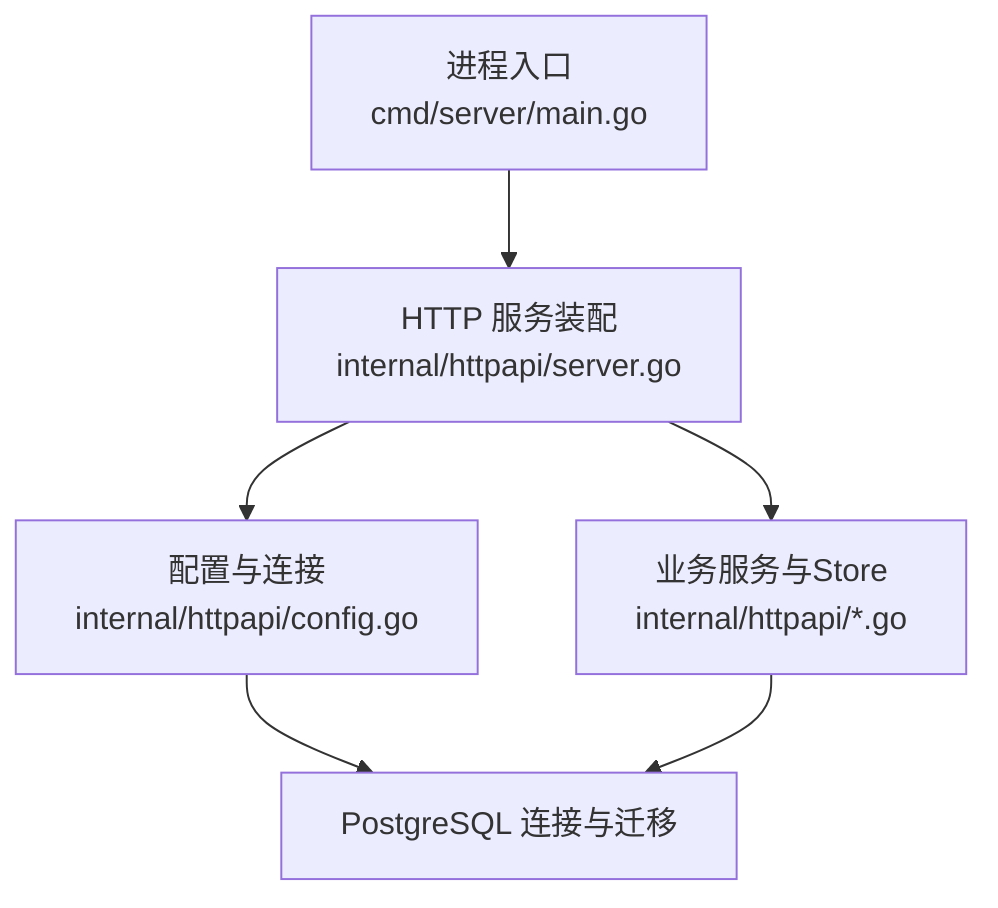
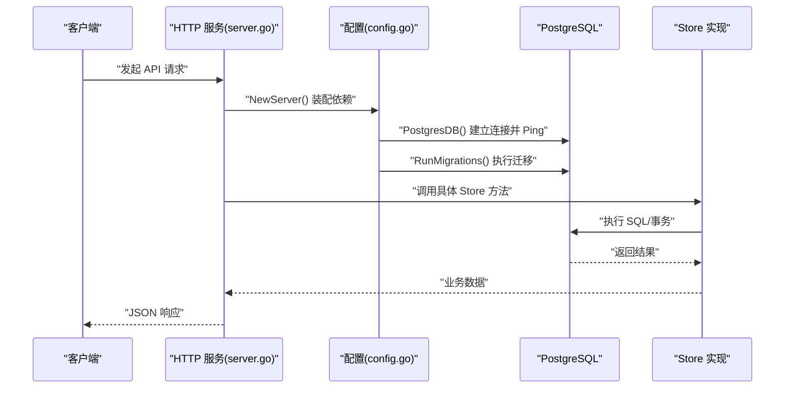
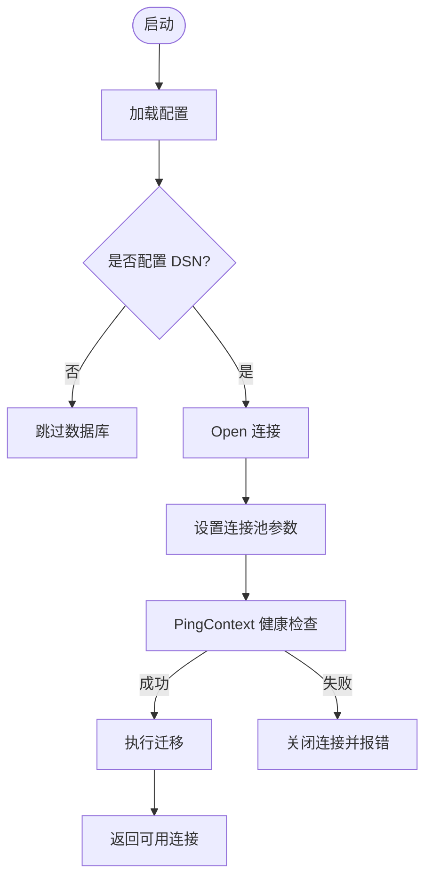
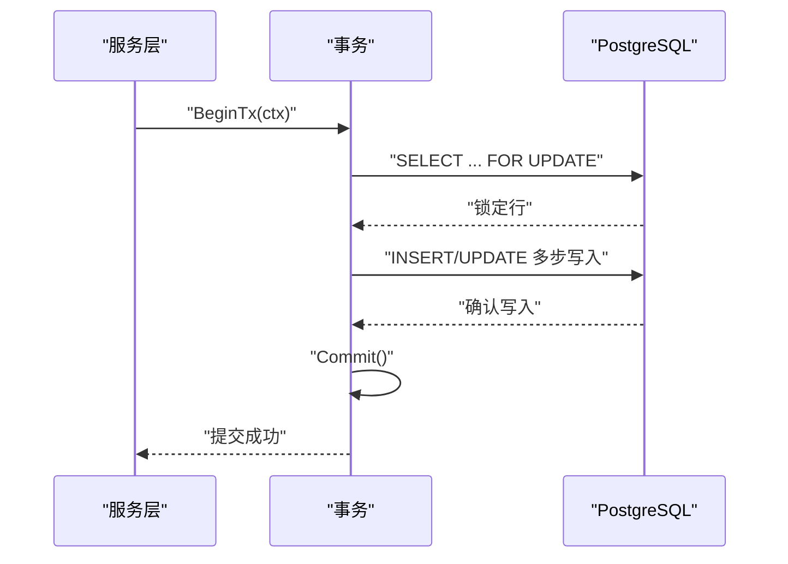
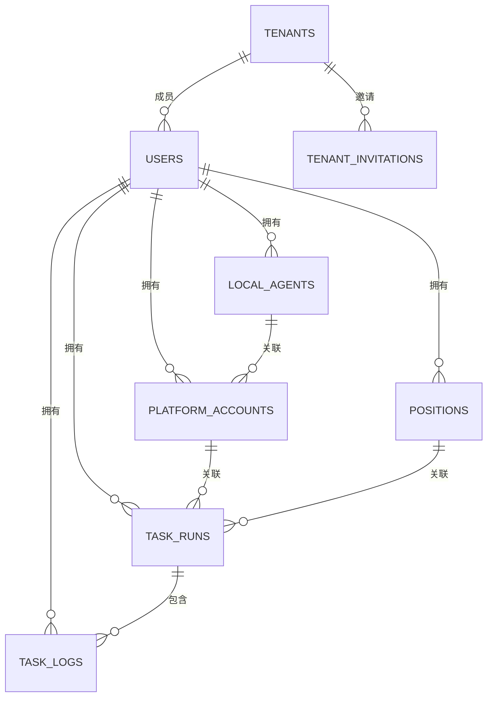
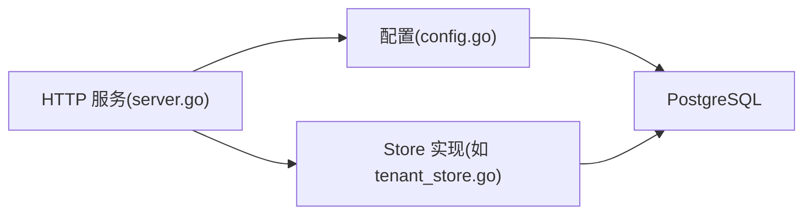

# PostgreSQL数据库管理

<cite>
**本文引用的文件**
- [main.go](file://goodhr5/cloud/backend/cmd/server/main.go)
- [server.go](file://goodhr5/cloud/backend/internal/httpapi/server.go)
- [config.go](file://goodhr5/cloud/backend/internal/httpapi/config.go)
- [postgres_user.go](file://goodhr5/cloud/backend/internal/httpapi/postgres_user.go)
- [tenant_store.go](file://goodhr5/cloud/backend/internal/httpapi/tenant_store.go)
- [0001_initial_schema.sql](file://goodhr5/cloud/backend/db/migrations/0001_initial_schema.sql)
- [0022_user_subscription.sql](file://goodhr5/cloud/backend/db/migrations/0022_user_subscription.sql)
- [0073_tenant_invitations.sql](file://goodhr5/cloud/backend/db/migrations/0073_tenant_invitations.sql)
</cite>

## 目录
1. [简介](#简介)
2. [项目结构](#项目结构)
3. [核心组件](#核心组件)
4. [架构总览](#架构总览)
5. [详细组件分析](#详细组件分析)
6. [依赖关系分析](#依赖关系分析)
7. [性能与优化](#性能与优化)
8. [故障排查指南](#故障排查指南)
9. [结论](#结论)
10. [附录：迁移与数据模型](#附录：迁移与数据模型)

## 简介
本文件面向 HRPlus 云端后端的 PostgreSQL 存储层，系统性说明连接配置、连接池、事务管理、ORM/SQL 策略、索引设计原则、用户表结构与数据模型关系、约束定义、最佳实践、性能调优、备份恢复方案，以及常见问题的定位方法。目标是帮助开发者正确、安全、高效地使用 PostgreSQL 作为持久化层。

## 项目结构
后端服务通过环境变量加载配置，按需创建 PostgreSQL 连接并执行自动迁移；HTTP 路由将请求分发到各业务服务，这些服务通过统一的 Store 接口访问数据库（PostgreSQL 或内存实现）。关键入口与装配点如下：
- 服务启动与日志：负责监听端口、初始化日志输出。
- HTTP 服务装配：从配置中获取 PostgreSQL 连接，构造各类 Store 与服务实例，注册路由。
- 配置与连接：从环境变量读取 DSN、Redis、SMTP 等，创建数据库连接并设置连接池参数，执行迁移。
- 数据访问：以 Store 接口抽象不同实现（Postgres/Memory/Redis），统一上层调用。

**图表来源**
- [main.go:14-30](file://goodhr5/cloud/backend/cmd/server/main.go#L14-L30)
- [server.go:47-120](file://goodhr5/cloud/backend/internal/httpapi/server.go#L47-L120)
- [config.go:47-75](file://goodhr5/cloud/backend/internal/httpapi/config.go#L47-L75)

**章节来源**
- [main.go:14-30](file://goodhr5/cloud/backend/cmd/server/main.go#L14-L30)
- [server.go:47-120](file://goodhr5/cloud/backend/internal/httpapi/server.go#L47-L120)
- [config.go:31-75](file://goodhr5/cloud/backend/internal/httpapi/config.go#L31-L75)

## 核心组件
- 配置与连接工厂：集中从环境变量加载配置，创建 PostgreSQL 连接、Redis 连接、邮件发信器及各 Store 实例。
- HTTP 服务装配：组装认证、岗位运行、候选人、支付、订阅、租户、Cookie 共享等能力，并注册路由。
- 数据访问层：以 Store 接口隔离具体实现，PostgreSQL 实现提供持久化能力，Memory 实现用于开发测试。
- 迁移系统：应用启动时自动执行 SQL 迁移，确保数据库结构与代码一致。

**章节来源**
- [config.go:31-75](file://goodhr5/cloud/backend/internal/httpapi/config.go#L31-L75)
- [server.go:47-120](file://goodhr5/cloud/backend/internal/httpapi/server.go#L47-L120)
- [tenant_store.go:210-250](file://goodhr5/cloud/backend/internal/httpapi/tenant_store.go#L210-L250)

## 架构总览
云端后端采用“HTTP 服务 + 领域服务 + Store 抽象”的分层架构。配置模块负责资源装配，服务层处理业务逻辑，Store 层封装数据库访问。PostgreSQL 作为主存储，Redis 可选用于缓存与会话，内存实现用于本地开发。

**图表来源**
- [server.go:47-120](file://goodhr5/cloud/backend/internal/httpapi/server.go#L47-L120)
- [config.go:47-75](file://goodhr5/cloud/backend/internal/httpapi/config.go#L47-L75)

## 详细组件分析

### 数据库连接与连接池
- 连接来源：通过环境变量 GOODHR_PG_DSN 提供 DSN；未配置时不启用 PostgreSQL。
- 连接池参数：最大打开连接数、最大空闲连接数、连接生命周期均显式设置，避免连接泄漏和过度占用。
- 健康检查：使用带超时的上下文进行 Ping，失败则关闭连接并报错。
- 自动迁移：连接成功后执行迁移，保证表结构与版本一致。

**图表来源**
- [config.go:47-75](file://goodhr5/cloud/backend/internal/httpapi/config.go#L47-L75)

**章节来源**
- [config.go:31-75](file://goodhr5/cloud/backend/internal/httpapi/config.go#L31-L75)

### 事务管理机制
- 多步写操作使用显式事务，确保一致性。例如移除团队成员时，涉及创建个人团队、更新 Cookie、更新用户归属等多个步骤，全部在事务内完成，失败回滚。
- 事务边界清晰：BeginTx -> 多个 Exec/Query -> Commit/Rollback，配合超时上下文避免长事务阻塞。
- 并发安全：对需要行级锁的场景使用 FOR UPDATE 锁定相关记录，防止竞态条件。

**图表来源**
- [tenant_store.go:319-356](file://goodhr5/cloud/backend/internal/httpapi/tenant_store.go#L319-L356)

**章节来源**
- [tenant_store.go:319-356](file://goodhr5/cloud/backend/internal/httpapi/tenant_store.go#L319-L356)

### ORM 映射策略与 SQL 风格
- 本项目未使用 ORM 框架，直接通过标准库 database/sql 编写 SQL，结合 Go 结构体进行映射。
- 优势：SQL 可控性强，便于优化；缺点：需自行维护字段映射与类型转换。
- 建议：为常用查询建立命名函数，集中管理 SQL 文本与参数绑定，减少重复与错误。

**章节来源**
- [tenant_store.go:218-250](file://goodhr5/cloud/backend/internal/httpapi/tenant_store.go#L218-L250)
- [postgres_user.go:9-26](file://goodhr5/cloud/backend/internal/httpapi/postgres_user.go#L9-L26)

### SQL 查询优化与索引设计原则
- 初始迁移已为高频查询列建立复合索引，如按用户与时间倒序的查询、状态过滤、任务日志关联等。
- 团队邀请表针对待处理邀请、查询效率建立了部分索引与组合索引。
- 建议：
  - 优先使用覆盖索引减少回表。
  - 对高基数列建立单列索引，对联合查询建立复合索引。
  - 定期使用 EXPLAIN ANALYZE 验证执行计划。
  - 避免在 WHERE 中对索引列使用函数导致失效。

**章节来源**
- [0001_initial_schema.sql:129-135](file://goodhr5/cloud/backend/db/migrations/0001_initial_schema.sql#L129-L135)
- [0073_tenant_invitations.sql:39-47](file://goodhr5/cloud/backend/db/migrations/0073_tenant_invitations.sql#L39-L47)

### 用户表结构与数据模型关系
- 用户表 users：包含邮箱、注册时间、最近登录时间、订阅信息 JSON、加入团队时间等。
- 本地代理 local_agents：记录用户绑定的本地 Agent 机器码与状态。
- 平台账号 platform_accounts：仅保存平台标识与显示名，不存敏感 cookie/profile。
- 岗位 positions：保存岗位名称、关键词、问候语、匹配模式等。
- 任务运行 task_runs：记录任务元信息与统计摘要。
- 任务日志 task_logs：记录任务运行日志摘要。
- 团队邀请 tenant_invitations：记录邀请状态、角色、发送与响应时间。

**图表来源**
- [0001_initial_schema.sql:7-135](file://goodhr5/cloud/backend/db/migrations/0001_initial_schema.sql#L7-L135)
- [0073_tenant_invitations.sql:12-47](file://goodhr5/cloud/backend/db/migrations/0073_tenant_invitations.sql#L12-L47)

**章节来源**
- [0001_initial_schema.sql:7-135](file://goodhr5/cloud/backend/db/migrations/0001_initial_schema.sql#L7-L135)
- [0022_user_subscription.sql:1-62](file://goodhr5/cloud/backend/db/migrations/0022_user_subscription.sql#L1-L62)
- [0073_tenant_invitations.sql:1-105](file://goodhr5/cloud/backend/db/migrations/0073_tenant_invitations.sql#L1-L105)

### 约束定义与数据安全
- 唯一约束：用户邮箱唯一、岗位关键词数组、平台账号唯一映射、邀请待处理邮箱唯一（部分索引）。
- 外键约束：多表通过 user_id、local_agent_id、platform_account_id、position_id 等建立引用关系，删除策略包括 CASCADE 与 SET NULL。
- 检查约束：团队邀请的角色与状态限制为枚举值。
- 加密字段：AI 配置中的 API Key 使用加密存储。

**章节来源**
- [0001_initial_schema.sql:7-135](file://goodhr5/cloud/backend/db/migrations/0001_initial_schema.sql#L7-L135)
- [0073_tenant_invitations.sql:12-47](file://goodhr5/cloud/backend/db/migrations/0073_tenant_invitations.sql#L12-L47)

### 实际数据库操作示例（路径指引）
- 确保用户存在并返回 ID：见 [ensureUserID:9-26](file://goodhr5/cloud/backend/internal/httpapi/postgres_user.go#L9-L26)。
- 创建或获取团队并注册用户：见 [GetOrCreateTenant:218-250](file://goodhr5/cloud/backend/internal/httpapi/tenant_store.go#L218-L250)。
- 列表团队成员与今日打招呼统计：见 [ListMembers:252-297](file://goodhr5/cloud/backend/internal/httpapi/tenant_store.go#L252-L297)。
- 移除成员并迁移至个人团队（事务）：见 [RemoveMember:319-356](file://goodhr5/cloud/backend/internal/httpapi/tenant_store.go#L319-L356)。

**章节来源**
- [postgres_user.go:9-26](file://goodhr5/cloud/backend/internal/httpapi/postgres_user.go#L9-L26)
- [tenant_store.go:218-356](file://goodhr5/cloud/backend/internal/httpapi/tenant_store.go#L218-L356)

## 依赖关系分析
- 服务装配依赖配置模块提供的数据库连接与各 Store 实例。
- Store 实现依赖 database/sql 与 lib/pq 驱动。
- 迁移脚本由配置模块在连接成功后执行，确保表结构一致。
- 团队邀请与成员管理依赖 tenants、users、tenant_invitations 等多表协作。

**图表来源**
- [server.go:47-120](file://goodhr5/cloud/backend/internal/httpapi/server.go#L47-L120)
- [config.go:47-75](file://goodhr5/cloud/backend/internal/httpapi/config.go#L47-L75)
- [tenant_store.go:210-250](file://goodhr5/cloud/backend/internal/httpapi/tenant_store.go#L210-L250)

**章节来源**
- [server.go:47-120](file://goodhr5/cloud/backend/internal/httpapi/server.go#L47-L120)
- [config.go:47-75](file://goodhr5/cloud/backend/internal/httpapi/config.go#L47-L75)
- [tenant_store.go:210-250](file://goodhr5/cloud/backend/internal/httpapi/tenant_store.go#L210-L250)

## 性能与优化
- 连接池调优：根据并发量调整 MaxOpenConns、MaxIdleConns 与 ConnMaxLifetime，避免连接耗尽或频繁重建。
- 查询优化：
  - 使用 EXPLAIN ANALYZE 分析慢查询，关注扫描行数与临时表使用。
  - 利用已有索引，必要时添加覆盖索引以减少回表。
  - 避免 SELECT *，只选择必要字段。
- 事务优化：
  - 缩短事务范围，减少锁持有时间。
  - 合理设置事务超时，避免长事务阻塞。
- 缓存策略：
  - 对读多写少的配置或字典数据可引入 Redis 缓存。
  - 注意缓存失效与一致性策略。
- 备份与恢复：
  - 使用 pg_dump/pg_restore 或云厂商备份工具进行全量与增量备份。
  - 定期演练恢复流程，确保 RTO/RPO 达标。
  - 备份前考虑锁表策略与一致性快照。

[本节为通用指导，无需特定文件来源]

## 故障排查指南
- 连接失败：
  - 检查 DSN 是否正确，网络可达性与防火墙策略。
  - 查看连接 Ping 失败日志，确认数据库服务状态。
- 迁移失败：
  - 检查迁移脚本语法与权限，确认目标库版本。
  - 回滚到上一版本并修复后再执行。
- 事务冲突：
  - 观察死锁与超时日志，调整锁粒度与重试策略。
  - 使用 FOR UPDATE 明确锁定范围，避免并发竞争。
- 索引失效：
  - 检查 WHERE 条件是否对索引列使用了函数或隐式类型转换。
  - 重新构建索引或改写查询。

**章节来源**
- [config.go:47-75](file://goodhr5/cloud/backend/internal/httpapi/config.go#L47-L75)
- [tenant_store.go:319-356](file://goodhr5/cloud/backend/internal/httpapi/tenant_store.go#L319-L356)

## 结论
HRPlus 云端后端的 PostgreSQL 存储层以配置驱动的连接工厂为核心，结合 Store 抽象实现了清晰的职责分离与可扩展性。通过合理的连接池、事务管理与索引设计，系统在稳定性与性能上具备良好基础。建议在后续迭代中持续优化慢查询、完善监控告警、强化备份恢复演练，以提升整体可靠性。

[本节为总结，无需特定文件来源]

## 附录：迁移与数据模型
- 初始迁移定义了用户、本地代理、平台账号、岗位、任务运行与日志等核心表，并建立常用索引。
- 用户订阅迁移为用户表增加 JSONB 订阅字段，并写入默认套餐配置。
- 团队邀请迁移新增邀请表与用户加入团队时间字段，同时完成历史数据搬迁与个人团队恢复。

**章节来源**
- [0001_initial_schema.sql:1-135](file://goodhr5/cloud/backend/db/migrations/0001_initial_schema.sql#L1-L135)
- [0022_user_subscription.sql:1-62](file://goodhr5/cloud/backend/db/migrations/0022_user_subscription.sql#L1-L62)
- [0073_tenant_invitations.sql:1-105](file://goodhr5/cloud/backend/db/migrations/0073_tenant_invitations.sql#L1-L105)