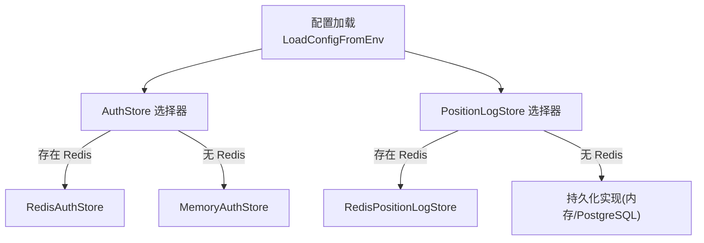
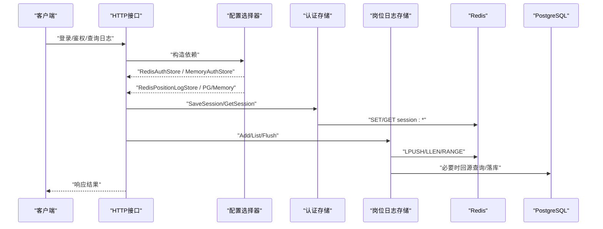
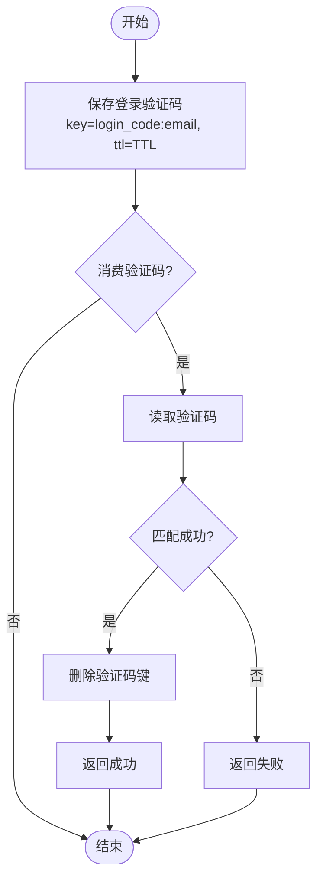
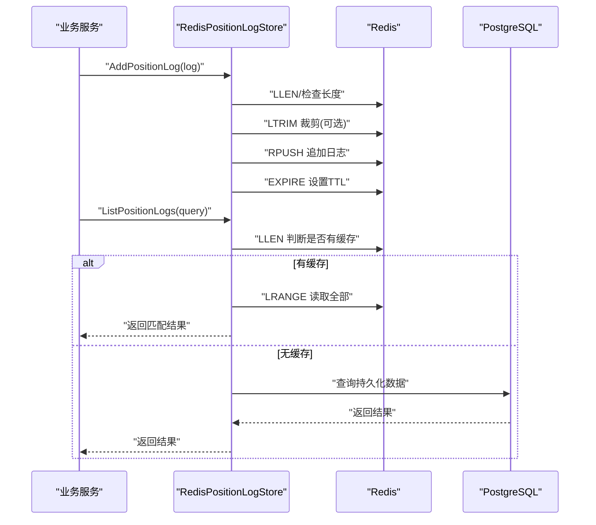
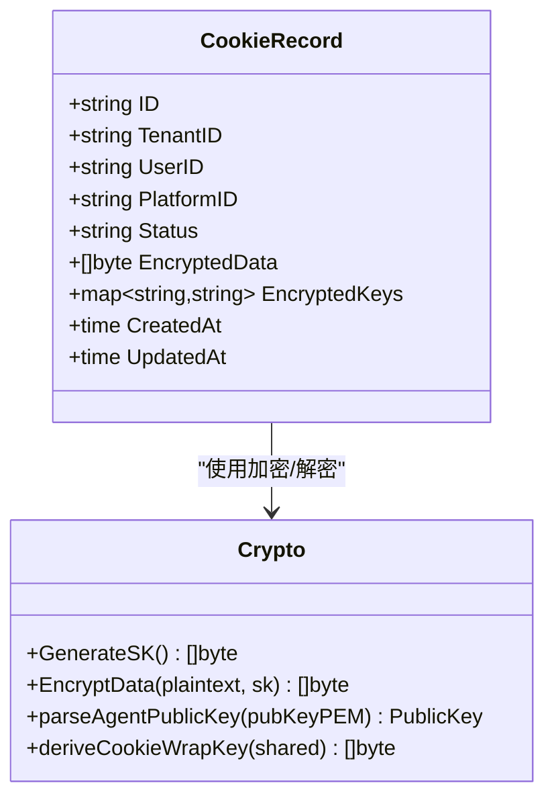
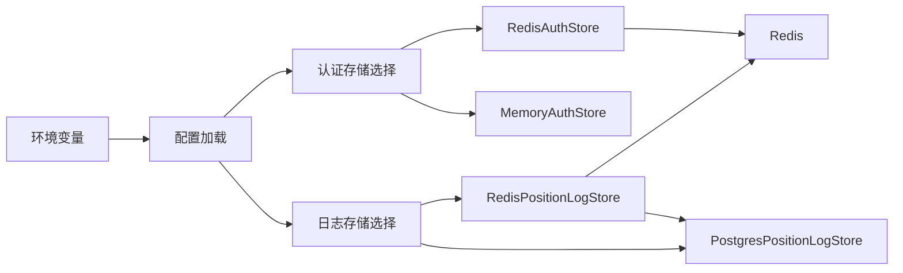

# Redis缓存系统

<cite>
**本文引用的文件**
- [config.go](file://goodhr5/cloud/backend/internal/httpapi/config.go)
- [redis_auth_store.go](file://goodhr5/cloud/backend/internal/httpapi/redis_auth_store.go)
- [auth_store.go](file://goodhr5/cloud/backend/internal/httpapi/auth_store.go)
- [position_log_store_redis.go](file://goodhr5/cloud/backend/internal/httpapi/position_log_store_redis.go)
- [position_log_store_pg.go](file://goodhr5/cloud/backend/internal/httpapi/position_log_store_pg.go)
- [position_log_store.go](file://goodhr5/cloud/backend/internal/httpapi/position_log_store.go)
- [crypto.go](file://goodhr5/cloud/backend/internal/httpapi/crypto.go)
- [cookie_store.go](file://goodhr5/cloud/backend/internal/httpapi/cookie_store.go)
- [cookie.go](file://goodhr5/cloud/backend/internal/httpapi/cookie.go)
- [0005_cookie_storage.sql](file://goodhr5/cloud/backend/db/migrations/0005_cookie_storage.sql)
- [docker-compose.yml](file://goodhr5/docker-compose.yml)
</cite>

## 目录
1. [简介](#简介)
2. [项目结构](#项目结构)
3. [核心组件](#核心组件)
4. [架构总览](#架构总览)
5. [详细组件分析](#详细组件分析)
6. [依赖关系分析](#依赖关系分析)
7. [性能与内存优化](#性能与内存优化)
8. [故障排查指南](#故障排查指南)
9. [结论](#结论)
10. [附录：配置与环境变量](#附录：配置与环境变量)

## 简介
本文件面向GoodHR云端后端的Redis缓存层，系统性说明连接配置、缓存策略、会话管理、认证数据、失效策略、数据同步、键设计模式、过期时间、内存优化、穿透防护、热点处理与分布式锁等主题。仓库中已实现两类Redis使用场景：
- 认证与会话存储（登录验证码、用户会话）
- 岗位运行日志的短期缓存（写入Redis，定时或事件触发落库）

文档将结合源码路径与流程图，帮助开发者构建高可用、可观测、易维护的缓存层。

## 项目结构
后端通过统一配置入口加载环境变量并创建依赖，当检测到Redis地址时启用Redis实现；否则回退到内存实现。认证与会话、岗位日志均遵循“接口抽象 + 多实现”的设计，便于在开发环境与生产环境无缝切换。

**图表来源**
- [config.go:31-45](file://goodhr5/cloud/backend/internal/httpapi/config.go#L31-L45)
- [config.go:77-87](file://goodhr5/cloud/backend/internal/httpapi/config.go#L77-L87)
- [config.go:256-268](file://goodhr5/cloud/backend/internal/httpapi/config.go#L256-L268)

**章节来源**
- [config.go:31-45](file://goodhr5/cloud/backend/internal/httpapi/config.go#L31-L45)
- [config.go:77-87](file://goodhr5/cloud/backend/internal/httpapi/config.go#L77-L87)
- [config.go:256-268](file://goodhr5/cloud/backend/internal/httpapi/config.go#L256-L268)

## 核心组件
- 认证与会话存储
  - 接口定义：保存/消费登录验证码、保存/获取会话
  - 内存实现：进程内Map+互斥锁，适合本地开发
  - Redis实现：基于go-redis，键前缀区分类型，TTL控制过期
- 岗位日志缓存
  - 写入优先入队至Redis列表，限制单岗位最大条数
  - 读取优先从缓存增量返回，不足时再回源数据库
  - 支持汇总统计合并缓存与持久化数据
  - 提供落库清理能力，避免数据丢失

**章节来源**
- [auth_store.go:11-23](file://goodhr5/cloud/backend/internal/httpapi/auth_store.go#L11-L23)
- [redis_auth_store.go:12-34](file://goodhr5/cloud/backend/internal/httpapi/redis_auth_store.go#L12-L34)
- [position_log_store_redis.go:16-34](file://goodhr5/cloud/backend/internal/httpapi/position_log_store_redis.go#L16-L34)

## 架构总览
下图展示请求从HTTP层进入，经由配置选择器注入具体存储实现，最终访问Redis或持久化层的调用链。

**图表来源**
- [config.go:77-87](file://goodhr5/cloud/backend/internal/httpapi/config.go#L77-L87)
- [config.go:256-268](file://goodhr5/cloud/backend/internal/httpapi/config.go#L256-L268)
- [redis_auth_store.go:59-87](file://goodhr5/cloud/backend/internal/httpapi/redis_auth_store.go#L59-L87)
- [position_log_store_redis.go:36-110](file://goodhr5/cloud/backend/internal/httpapi/position_log_store_redis.go#L36-L110)

## 详细组件分析

### 认证与会话存储（Redis）
- 键设计
  - 登录验证码：login_code:{email}
  - 会话：session:{token}
  - 当前会话（预留）：session_current:{email}
- TTL与过期
  - 登录验证码与会话均以TTL控制有效期，过期自动删除
- 原子性与一致性
  - 验证码消费采用“先读后删”，保证一次性使用
- 错误处理
  - 未命中返回“未找到”
  - 网络异常向上抛出，由上层重试或降级

**图表来源**
- [redis_auth_store.go:36-57](file://goodhr5/cloud/backend/internal/httpapi/redis_auth_store.go#L36-L57)
- [redis_auth_store.go:104-114](file://goodhr5/cloud/backend/internal/httpapi/redis_auth_store.go#L104-L114)

**章节来源**
- [redis_auth_store.go:12-34](file://goodhr5/cloud/backend/internal/httpapi/redis_auth_store.go#L12-L34)
- [redis_auth_store.go:59-114](file://goodhr5/cloud/backend/internal/httpapi/redis_auth_store.go#L59-L114)
- [auth_store.go:11-23](file://goodhr5/cloud/backend/internal/httpapi/auth_store.go#L11-L23)

### 岗位日志缓存（Redis + 持久化）
- 写入策略
  - 新日志以JSON序列化追加到列表尾部
  - 单岗位列表长度上限为固定值，超出则裁剪最旧条目
  - 设置键过期时间，避免长期占用内存
- 读取策略
  - 优先从Redis列表读取，若为空则回源数据库
  - 支持按时间范围过滤与分页
- 统计聚合
  - 汇总时同时扫描数据库与Redis，合并计数
- 落库与清理
  - 提供批量落库接口，将缓存中的日志写入持久化存储并清空缓存

**图表来源**
- [position_log_store_redis.go:36-110](file://goodhr5/cloud/backend/internal/httpapi/position_log_store_redis.go#L36-L110)
- [position_log_store_pg.go:172-235](file://goodhr5/cloud/backend/internal/httpapi/position_log_store_pg.go#L172-L235)

**章节来源**
- [position_log_store_redis.go:14-34](file://goodhr5/cloud/backend/internal/httpapi/position_log_store_redis.go#L14-L34)
- [position_log_store_redis.go:36-187](file://goodhr5/cloud/backend/internal/httpapi/position_log_store_redis.go#L36-L187)
- [position_log_store_pg.go:172-235](file://goodhr5/cloud/backend/internal/httpapi/position_log_store_pg.go#L172-L235)

### Cookie加密与共享（与缓存协同）
- 数据加密
  - 随机生成对称密钥SK，使用AES-GCM加密Cookie数据
  - 为每个Agent生成独立的WrappedCookieKey（ECDH封装）
- 共享机制
  - 数据库仅保存密文与各Agent的加密密钥
  - Agent用自身私钥解密得到SK，再解密Cookie数据
- 状态管理
  - Cookie记录包含状态字段（可用/使用中/过期），用于并发控制

**图表来源**
- [cookie_store.go:14-31](file://goodhr5/cloud/backend/internal/httpapi/cookie_store.go#L14-L31)
- [crypto.go:22-51](file://goodhr5/cloud/backend/internal/httpapi/crypto.go#L22-L51)
- [cookie.go:240-325](file://goodhr5/cloud/backend/internal/httpapi/cookie.go#L240-L325)
- [0005_cookie_storage.sql:1-1](file://goodhr5/cloud/backend/db/migrations/0005_cookie_storage.sql#L1-L1)

**章节来源**
- [crypto.go:22-51](file://goodhr5/cloud/backend/internal/httpapi/crypto.go#L22-L51)
- [cookie_store.go:14-31](file://goodhr5/cloud/backend/internal/httpapi/cookie_store.go#L14-L31)
- [cookie.go:240-325](file://goodhr5/cloud/backend/internal/httpapi/cookie.go#L240-L325)
- [0005_cookie_storage.sql:1-1](file://goodhr5/cloud/backend/db/migrations/0005_cookie_storage.sql#L1-L1)

## 依赖关系分析
- 配置层
  - 从环境变量加载Redis地址、密码、DB号
  - 根据是否配置Redis动态选择实现
- 存储层
  - 认证与会话：Redis或内存
  - 岗位日志：Redis缓存 + PostgreSQL持久化（或内存）
- 外部依赖
  - go-redis客户端
  - PostgreSQL驱动（用于持久化）

**图表来源**
- [config.go:31-45](file://goodhr5/cloud/backend/internal/httpapi/config.go#L31-L45)
- [config.go:77-87](file://goodhr5/cloud/backend/internal/httpapi/config.go#L77-L87)
- [config.go:256-268](file://goodhr5/cloud/backend/internal/httpapi/config.go#L256-L268)

**章节来源**
- [config.go:31-45](file://goodhr5/cloud/backend/internal/httpapi/config.go#L31-L45)
- [config.go:77-87](file://goodhr5/cloud/backend/internal/httpapi/config.go#L77-L87)
- [config.go:256-268](file://goodhr5/cloud/backend/internal/httpapi/config.go#L256-L268)

## 性能与内存优化
- 键设计与命名空间
  - 使用明确前缀区分类型：login_code:、session:、position_logs:
  - 避免大对象直接存为字符串，尽量保持键值轻量
- 过期策略
  - 登录验证码与会话使用TTL自动过期
  - 岗位日志列表设置统一TTL，降低长尾占用
- 容量控制
  - 岗位日志列表限制最大长度，超出裁剪最旧条目
  - 列表操作使用LRANGE/LPUSH/LTRIM，减少全量拷贝
- 读写分离
  - 读路径优先命中缓存，未命中再回源数据库
  - 写路径直接落缓存，异步或事件触发落库
- 连接与超时
  - 对Redis操作设置上下文超时，避免阻塞
  - 启动时Ping检测Redis连通性，快速失败
- 热点保护
  - 对高频读取的岗位日志，利用列表缓存减少DB压力
  - 建议配合限流与熔断策略，防止雪崩
- 穿透防护
  - 对不存在的键，可在应用层增加空值缓存或布隆过滤器（按需扩展）
- 分布式锁
  - 可使用Redis SETNX/DEL或Lua脚本实现简单分布式锁（按需扩展）

[本节为通用指导，不直接分析具体文件]

## 故障排查指南
- 连接问题
  - 启动阶段会执行Ping检测，失败时返回错误信息
  - 检查环境变量是否正确配置Redis地址、密码、DB号
- 认证与会话
  - 验证码消费失败：确认键是否存在且未过期
  - 会话获取失败：检查TTL是否已过期或键被误删
- 岗位日志
  - 列表为空：可能尚未写入或已过期，回源数据库验证
  - 统计不一致：确保落库流程正常执行，必要时手动Flush
- Cookie共享
  - 无法解密：检查Agent公钥是否登记、WrappedCookieKey是否有效
  - 状态冲突：注意available/in_use/expired状态流转

**章节来源**
- [redis_auth_store.go:26-34](file://goodhr5/cloud/backend/internal/httpapi/redis_auth_store.go#L26-L34)
- [position_log_store_redis.go:112-165](file://goodhr5/cloud/backend/internal/httpapi/position_log_store_redis.go#L112-L165)
- [cookie.go:286-325](file://goodhr5/cloud/backend/internal/httpapi/cookie.go#L286-L325)

## 结论
该Redis缓存层以“接口抽象 + 多实现”为核心，围绕认证与会话、岗位日志两大场景提供了高性能、可扩展的解决方案。通过明确的键设计、合理的TTL与容量控制、读写分离与回源策略，有效降低了数据库压力并提升了用户体验。建议在后续迭代中补充穿透防护、热点保护与分布式锁等能力，进一步完善缓存治理与监控体系。

[本节为总结，不直接分析具体文件]

## 附录：配置与环境变量
- 环境变量
  - GOODHR_REDIS_ADDR：Redis地址
  - GOODHR_REDIS_PASSWORD：Redis密码
  - GOODHR_REDIS_DB：Redis数据库编号
- 容器编排
  - 后端服务通过env_file加载环境变量，端口映射与卷挂载便于开发与调试

**章节来源**
- [config.go:31-45](file://goodhr5/cloud/backend/internal/httpapi/config.go#L31-L45)
- [docker-compose.yml:1-32](file://goodhr5/docker-compose.yml#L1-L32)