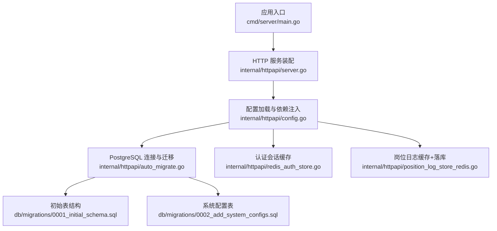
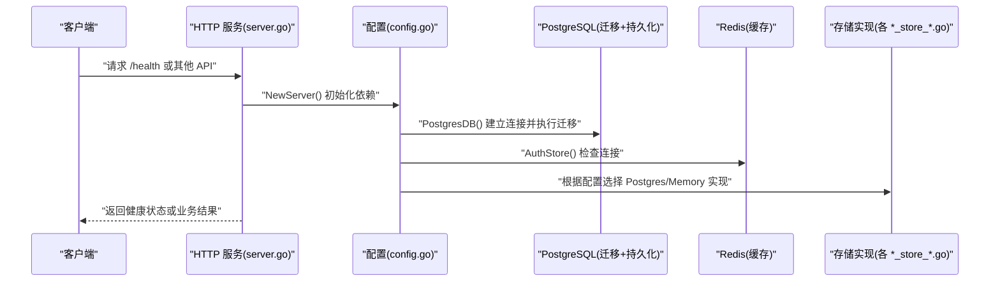
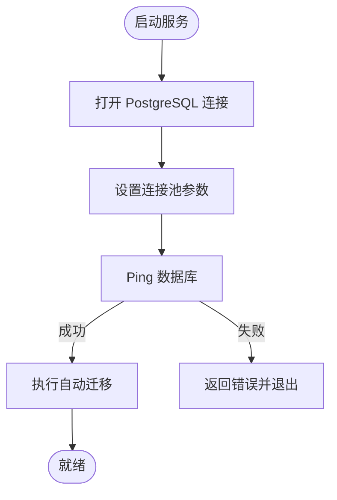
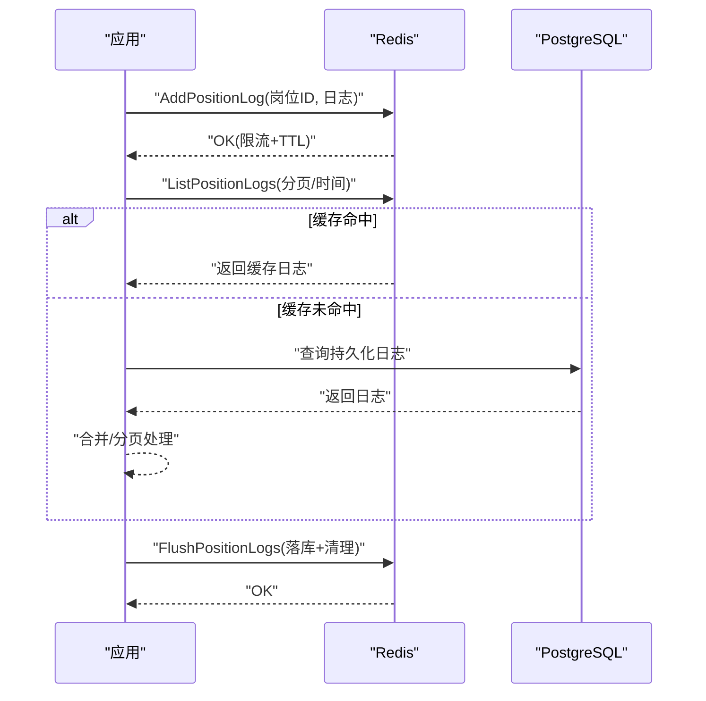
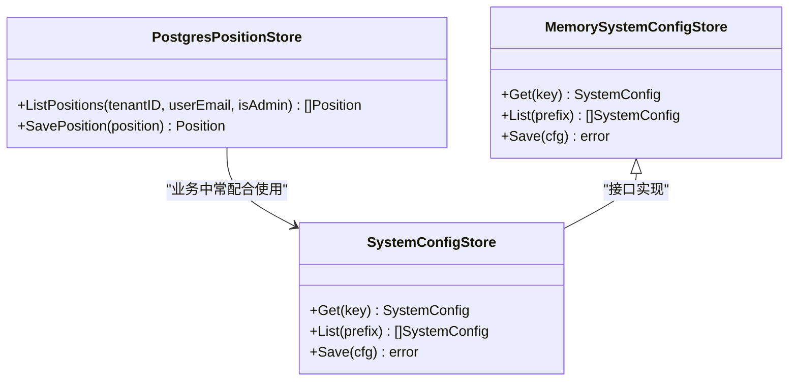
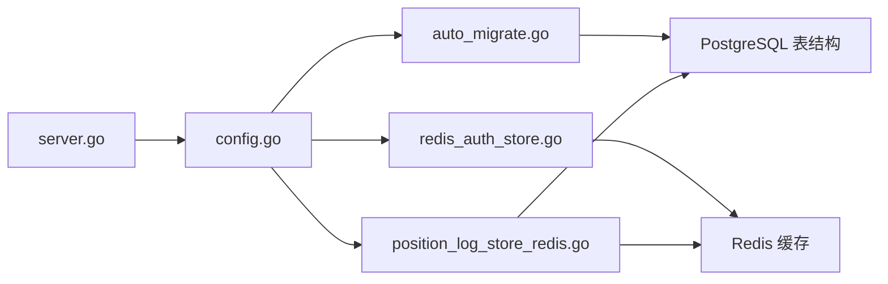

# 数据存储层

<cite>
**本文引用的文件**
- [main.go](file://goodhr5/cloud/backend/cmd/server/main.go)
- [config.go](file://goodhr5/cloud/backend/internal/httpapi/config.go)
- [server.go](file://goodhr5/cloud/backend/internal/httpapi/server.go)
- [auto_migrate.go](file://goodhr5/cloud/backend/internal/httpapi/auto_migrate.go)
- [0001_initial_schema.sql](file://goodhr5/cloud/backend/db/migrations/0001_initial_schema.sql)
- [0002_add_system_configs.sql](file://goodhr5/cloud/backend/db/migrations/0002_add_system_configs.sql)
- [agent_store_pg.go](file://goodhr5/cloud/backend/internal/httpapi/agent_store_pg.go)
- [position_store_pg.go](file://goodhr5/cloud/backend/internal/httpapi/position_store_pg.go)
- [system_config_store.go](file://goodhr5/cloud/backend/internal/httpapi/system_config_store.go)
- [redis_auth_store.go](file://goodhr5/cloud/backend/internal/httpapi/redis_auth_store.go)
- [auth_store.go](file://goodhr5/cloud/backend/internal/httpapi/auth_store.go)
- [position_log_store_redis.go](file://goodhr5/cloud/backend/internal/httpapi/position_log_store_redis.go)
</cite>

## 目录
1. [简介](#简介)
2. [项目结构](#项目结构)
3. [核心组件](#核心组件)
4. [架构总览](#架构总览)
5. [详细组件分析](#详细组件分析)
6. [依赖关系分析](#依赖关系分析)
7. [性能考虑](#性能考虑)
8. [故障排查指南](#故障排查指南)
9. [结论](#结论)
10. [附录](#附录)

## 简介
本文件聚焦 HRPlus 云端后端的数据存储层，覆盖 PostgreSQL 连接管理、Redis 缓存策略、数据迁移机制、ORM 映射方式、事务与连接池配置、数据库表结构与索引优化、查询性能调优、数据访问模式、缓存失效策略以及备份恢复建议。目标是帮助开发者理解并优化数据访问层，确保高可用、高性能和可维护性。

## 项目结构
云端后端采用“配置驱动 + 接口抽象 + 多实现”的存储层设计：
- 配置中心从环境变量加载 DSN、Redis 地址等，负责创建数据库连接、自动迁移、选择存储实现（PostgreSQL 或内存）。
- HTTP 服务在启动时组装各业务模块，注入对应的 Store 实现。
- 存储层通过接口解耦，PostgreSQL 与 Redis 作为持久化与缓存层，内存实现用于开发环境。

**图表来源**
- [main.go:14-29](file://goodhr5/cloud/backend/cmd/server/main.go#L14-L29)
- [server.go:47-121](file://goodhr5/cloud/backend/internal/httpapi/server.go#L47-L121)
- [config.go:31-75](file://goodhr5/cloud/backend/internal/httpapi/config.go#L31-L75)
- [auto_migrate.go:13-55](file://goodhr5/cloud/backend/internal/httpapi/auto_migrate.go#L13-L55)
- [0001_initial_schema.sql:1-135](file://goodhr5/cloud/backend/db/migrations/0001_initial_schema.sql#L1-L135)
- [0002_add_system_configs.sql:1-15](file://goodhr5/cloud/backend/db/migrations/0002_add_system_configs.sql#L1-L15)

**章节来源**
- [main.go:14-29](file://goodhr5/cloud/backend/cmd/server/main.go#L14-L29)
- [server.go:47-121](file://goodhr5/cloud/backend/internal/httpapi/server.go#L47-L121)
- [config.go:31-75](file://goodhr5/cloud/backend/internal/httpapi/config.go#L31-L75)
- [auto_migrate.go:13-55](file://goodhr5/cloud/backend/internal/httpapi/auto_migrate.go#L13-L55)
- [0001_initial_schema.sql:1-135](file://goodhr5/cloud/backend/db/migrations/0001_initial_schema.sql#L1-L135)
- [0002_add_system_configs.sql:1-15](file://goodhr5/cloud/backend/db/migrations/0002_add_system_configs.sql#L1-L15)

## 核心组件
- PostgreSQL 连接与迁移
  - 通过环境变量加载 DSN，创建 sql.DB 连接池，设置最大连接数、空闲连接数和连接生命周期，并在 Ping 成功后执行自动迁移。
  - 迁移脚本位于 db/migrations，按文件名顺序执行，使用 schema_migrations 记录已执行迁移，避免重复执行。
- Redis 缓存
  - 认证登录码与会话存储在 Redis，支持 TTL 过期、一次性消费登录码、键名规范。
  - 岗位运行期日志先写入 Redis 列表，限制单岗位日志条数，支持增量读取、合并持久化数据、统计汇总与批量落库。
- 存储抽象与多实现
  - 所有存储均通过接口定义（如 AuthStore、PositionLogStore），根据配置选择 PostgreSQL 或内存实现，便于开发与生产切换。
- ORM 映射
  - 未使用 ORM 框架，直接通过 database/sql 与原生 SQL 进行映射；JSONB 字段通过 JSON 编解码适配复杂配置。

**章节来源**
- [config.go:47-75](file://goodhr5/cloud/backend/internal/httpapi/config.go#L47-L75)
- [auto_migrate.go:13-55](file://goodhr5/cloud/backend/internal/httpapi/auto_migrate.go#L13-L55)
- [redis_auth_store.go:16-115](file://goodhr5/cloud/backend/internal/httpapi/redis_auth_store.go#L16-L115)
- [position_log_store_redis.go:16-187](file://goodhr5/cloud/backend/internal/httpapi/position_log_store_redis.go#L16-L187)
- [auth_store.go:11-23](file://goodhr5/cloud/backend/internal/httpapi/auth_store.go#L11-L23)
- [position_store_pg.go:23-109](file://goodhr5/cloud/backend/internal/httpapi/position_store_pg.go#L23-L109)

## 架构总览
云端数据存储层由三层组成：
- 接入层：HTTP API 路由与服务装配，统一错误响应与 CORS。
- 服务层：业务服务组合多个 Store，协调读写流程。
- 存储层：PostgreSQL 持久化、Redis 缓存、内存实现（开发用）。

**图表来源**
- [server.go:47-121](file://goodhr5/cloud/backend/internal/httpapi/server.go#L47-L121)
- [config.go:47-87](file://goodhr5/cloud/backend/internal/httpapi/config.go#L47-L87)
- [auto_migrate.go:13-55](file://goodhr5/cloud/backend/internal/httpapi/auto_migrate.go#L13-L55)
- [redis_auth_store.go:16-34](file://goodhr5/cloud/backend/internal/httpapi/redis_auth_store.go#L16-L34)

## 详细组件分析

### PostgreSQL 连接管理与迁移
- 连接池配置
  - 最大连接数、空闲连接数、连接生命周期在连接创建后设置，避免资源耗尽与长时间占用。
  - 启动时 Ping 数据库，失败则终止服务，保证启动即校验连通性。
- 自动迁移
  - 扫描 db/migrations/*.sql（排除 .down.sql），按文件名排序执行。
  - 使用 schema_migrations 表记录已执行迁移，防止重复执行。
  - 对已有旧库检测，若存在业务表但无迁移记录，标记当前迁移为已执行，避免破坏现有数据。
- 表结构与索引
  - 用户、本地 Agent、平台账号、岗位、任务运行、任务日志、系统配置等核心表。
  - 针对高频查询列建立索引，如 user_id、status、created_at 组合索引，提升查询性能。

**图表来源**
- [config.go:47-75](file://goodhr5/cloud/backend/internal/httpapi/config.go#L47-L75)
- [auto_migrate.go:13-55](file://goodhr5/cloud/backend/internal/httpapi/auto_migrate.go#L13-L55)

**章节来源**
- [config.go:47-75](file://goodhr5/cloud/backend/internal/httpapi/config.go#L47-L75)
- [auto_migrate.go:13-55](file://goodhr5/cloud/backend/internal/httpapi/auto_migrate.go#L13-L55)
- [0001_initial_schema.sql:1-135](file://goodhr5/cloud/backend/db/migrations/0001_initial_schema.sql#L1-L135)
- [0002_add_system_configs.sql:1-15](file://goodhr5/cloud/backend/db/migrations/0002_add_system_configs.sql#L1-L15)

### Redis 缓存策略
- 认证登录码与会话
  - 登录码以邮箱为 key，设置 TTL，消费后删除，防止重放。
  - 会话以 token 为 key，序列化保存，TTL 控制过期时间。
  - 提供 Ping 方法检查连接可用性。
- 岗位日志缓存
  - 写入：按岗位 ID 组织列表，限制单岗位最多固定条数，设置 TTL。
  - 读取：优先读 Redis，不存在则回退到持久化存储；支持分页与时间范围过滤。
  - 统计：扫描 position_logs:* 键，合并缓存与数据库统计。
  - 落库：将缓存中的日志排序后批量写入数据库，再清空缓存。

**图表来源**
- [position_log_store_redis.go:36-165](file://goodhr5/cloud/backend/internal/httpapi/position_log_store_redis.go#L36-L165)
- [redis_auth_store.go:36-87](file://goodhr5/cloud/backend/internal/httpapi/redis_auth_store.go#L36-L87)

**章节来源**
- [redis_auth_store.go:16-115](file://goodhr5/cloud/backend/internal/httpapi/redis_auth_store.go#L16-L115)
- [position_log_store_redis.go:16-245](file://goodhr5/cloud/backend/internal/httpapi/position_log_store_redis.go#L16-L245)

### 数据访问模式与 ORM 映射
- 无 ORM 框架，直接使用 database/sql 与原生 SQL。
- JSONB 字段用于灵活配置（关键词、AI 配置、通用配置等），通过 JSON 编解码转换为 Go 结构体。
- 每个 Store 封装具体 SQL 操作，保持单一职责与可测试性。

**图表来源**
- [position_store_pg.go:23-200](file://goodhr5/cloud/backend/internal/httpapi/position_store_pg.go#L23-L200)
- [system_config_store.go:11-27](file://goodhr5/cloud/backend/internal/httpapi/system_config_store.go#L11-L27)

**章节来源**
- [position_store_pg.go:23-200](file://goodhr5/cloud/backend/internal/httpapi/position_store_pg.go#L23-L200)
- [system_config_store.go:11-27](file://goodhr5/cloud/backend/internal/httpapi/system_config_store.go#L11-L27)

### 事务管理与一致性
- 当前代码未显式使用事务块，关键写操作多为单条语句或简单更新。
- 对于并发冲突场景（如稳定设备绑定），通过唯一约束与冲突检测逻辑保障一致性。
- 建议在涉及多表一致性的写路径引入事务，确保原子性与回滚能力。

**章节来源**
- [agent_store_pg.go:22-85](file://goodhr5/cloud/backend/internal/httpapi/agent_store_pg.go#L22-L85)

### 数据库表结构设计
- 用户与本地 Agent 绑定
  - users：用户邮箱唯一，记录最近登录时间。
  - local_agents：用户与机器绑定，含版本、状态、最后活跃时间。
- 平台账号与岗位
  - platform_accounts：平台标识与本地 profile 映射，不存敏感 cookie。
  - positions：岗位名称、关键词、排除词、问候语、匹配模式、统计计数等。
- 任务运行与日志
  - task_runs：任务元信息、状态、计数、日期重置字段。
  - task_logs：任务运行日志摘要。
- 系统配置
  - system_configs：键值对配置，JSONB 存储，启用开关。

**章节来源**
- [0001_initial_schema.sql:7-135](file://goodhr5/cloud/backend/db/migrations/0001_initial_schema.sql#L7-L135)
- [0002_add_system_configs.sql:1-15](file://goodhr5/cloud/backend/db/migrations/0002_add_system_configs.sql#L1-L15)

### 索引优化与查询性能调优
- 索引策略
  - 针对 user_id、status、created_at 等高频查询列建立索引。
  - 组合索引 (user_id, created_at DESC) 优化分页与时间范围查询。
- 查询优化
  - 使用 EXISTS 与 LIMIT 减少不必要数据返回。
  - JSONB 字段合理使用，避免过度反序列化和全表扫描。
  - 对大对象（如日志）采用缓存与分页，降低数据库压力。

**章节来源**
- [0001_initial_schema.sql:129-135](file://goodhr5/cloud/backend/db/migrations/0001_initial_schema.sql#L129-L135)
- [position_store_pg.go:23-109](file://goodhr5/cloud/backend/internal/httpapi/position_store_pg.go#L23-L109)

### 实际数据库操作示例（路径引用）
- 保存或更新本地程序绑定记录（含冲突检测）
  - 参考路径：[agent_store_pg.go:22-85](file://goodhr5/cloud/backend/internal/httpapi/agent_store_pg.go#L22-L85)
- 列出用户岗位配置（JSONB 解码）
  - 参考路径：[position_store_pg.go:23-109](file://goodhr5/cloud/backend/internal/httpapi/position_store_pg.go#L23-L109)
- 保存系统配置（JSONB 存储）
  - 参考路径：[system_config_store.go:11-27](file://goodhr5/cloud/backend/internal/httpapi/system_config_store.go#L11-L27)
- 认证登录码与会话（Redis）
  - 参考路径：[redis_auth_store.go:36-87](file://goodhr5/cloud/backend/internal/httpapi/redis_auth_store.go#L36-L87)
- 岗位日志缓存与落库（Redis + PostgreSQL）
  - 参考路径：[position_log_store_redis.go:36-165](file://goodhr5/cloud/backend/internal/httpapi/position_log_store_redis.go#L36-L165)

## 依赖关系分析
存储层依赖关系清晰，通过配置注入实现松耦合：
- server.go 在启动时调用 config.go 获取各 Store 实例。
- config.go 根据环境变量决定使用 PostgreSQL 或内存实现，并初始化 Redis 连接。
- auto_migrate.go 在连接成功后执行迁移，确保表结构一致。

**图表来源**
- [server.go:47-121](file://goodhr5/cloud/backend/internal/httpapi/server.go#L47-L121)
- [config.go:31-87](file://goodhr5/cloud/backend/internal/httpapi/config.go#L31-L87)
- [auto_migrate.go:13-55](file://goodhr5/cloud/backend/internal/httpapi/auto_migrate.go#L13-L55)
- [redis_auth_store.go:16-34](file://goodhr5/cloud/backend/internal/httpapi/redis_auth_store.go#L16-L34)
- [position_log_store_redis.go:16-34](file://goodhr5/cloud/backend/internal/httpapi/position_log_store_redis.go#L16-L34)

**章节来源**
- [server.go:47-121](file://goodhr5/cloud/backend/internal/httpapi/server.go#L47-L121)
- [config.go:31-87](file://goodhr5/cloud/backend/internal/httpapi/config.go#L31-L87)
- [auto_migrate.go:13-55](file://goodhr5/cloud/backend/internal/httpapi/auto_migrate.go#L13-L55)

## 性能考虑
- 连接池
  - 合理设置最大连接数与空闲连接数，避免连接泄漏与资源竞争。
  - 设置连接生命周期，定期回收长连接，降低数据库侧压力。
- 缓存
  - 使用 Redis 缓存热点数据（会话、日志），减轻数据库负载。
  - 控制缓存大小与 TTL，避免内存膨胀与脏读。
- 查询
  - 利用索引与分页，减少数据传输量。
  - 对 JSONB 字段谨慎查询，必要时建立表达式索引。
- 批处理
  - 日志落库采用排序后批量写入，提高吞吐。
- 监控
  - 增加慢查询日志与指标采集，定位瓶颈。

[本节为通用指导，无需特定文件来源]

## 故障排查指南
- 数据库连接失败
  - 检查 DSN 与环境变量配置，确认网络可达与权限正确。
  - 查看启动日志中的连接错误信息。
- 迁移失败
  - 检查迁移脚本语法与依赖关系，确认 schema_migrations 表状态。
  - 对已有库，确认是否误判为旧库导致跳过迁移。
- Redis 不可用
  - 检查地址、密码、DB 号与网络连通性。
  - 使用 Ping 方法验证连接，捕获异常并降级到内存实现（如适用）。
- 缓存不一致
  - 核对 TTL 与键命名规范，确保过期策略符合预期。
  - 落库前排序与去重，避免重复写入。

**章节来源**
- [config.go:47-87](file://goodhr5/cloud/backend/internal/httpapi/config.go#L47-L87)
- [auto_migrate.go:57-117](file://goodhr5/cloud/backend/internal/httpapi/auto_migrate.go#L57-L117)
- [redis_auth_store.go:26-34](file://goodhr5/cloud/backend/internal/httpapi/redis_auth_store.go#L26-L34)
- [position_log_store_redis.go:143-165](file://goodhr5/cloud/backend/internal/httpapi/position_log_store_redis.go#L143-L165)

## 结论
HRPlus 云端数据存储层采用简洁高效的直连 SQL 方案，结合 Redis 缓存与自动迁移机制，满足高并发与可扩展需求。通过接口抽象与多实现，兼顾开发与生产环境的差异。建议在后续迭代中引入事务管理、更完善的监控与备份恢复策略，进一步提升稳定性与可运维性。

[本节为总结性内容，无需特定文件来源]

## 附录
- 环境变量清单（部分）
  - GOODHR_PG_DSN：PostgreSQL 连接字符串
  - GOODHR_REDIS_ADDR：Redis 地址
  - GOODHR_REDIS_PASSWORD：Redis 密码
  - GOODHR_REDIS_DB：Redis 数据库编号
  - GOODHR_SMTP_*：邮件发送相关配置
- 备份恢复建议
  - 定期备份 PostgreSQL 数据库（逻辑或物理备份）。
  - 对 Redis 数据使用持久化策略（AOF/RDB），并定期快照。
  - 迁移脚本应幂等且可回滚，保留 down 脚本以便紧急修复。

[本节为补充说明，无需特定文件来源]