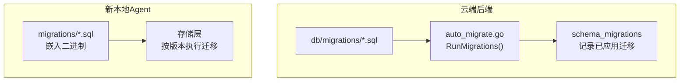
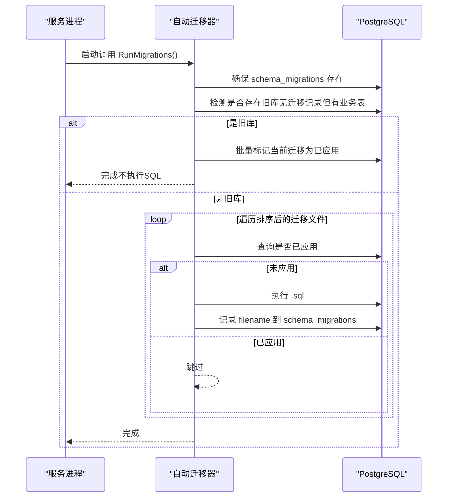
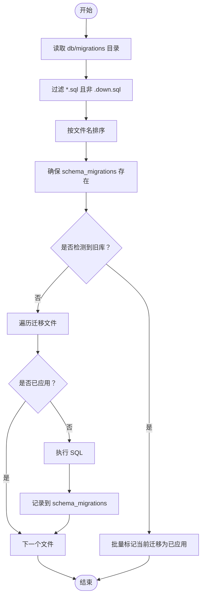
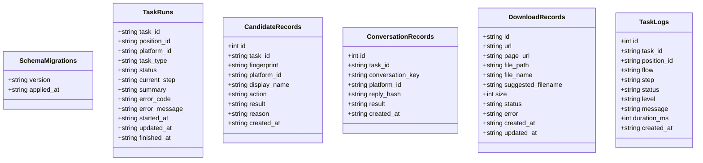
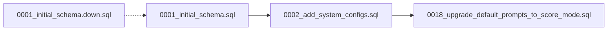

# 数据迁移管理

<cite>
**本文引用的文件**
- [0001_initial_schema.sql](file://goodhr5/cloud/backend/db/migrations/0001_initial_schema.sql)
- [0001_initial_schema.down.sql](file://goodhr5/cloud/backend/db/migrations/0001_initial_schema.down.sql)
- [0002_add_system_configs.sql](file://goodhr5/cloud/backend/db/migrations/0002_add_system_configs.sql)
- [0018_upgrade_default_prompts_to_score_mode.sql](file://goodhr5/cloud/backend/db/migrations/0018_upgrade_default_prompts_to_score_mode.sql)
- [auto_migrate.go](file://goodhr5/cloud/backend/internal/httpapi/auto_migrate.go)
- [embed.go](file://goodhr5/local-agent-go/migrations/embed.go)
- [001_initial.sql](file://goodhr5/local-agent-go/migrations/001_initial.sql)
- [002_download_records.sql](file://goodhr5/local-agent-go/migrations/002_download_records.sql)
- [003_task_logs.sql](file://goodhr5/local-agent-go/migrations/003_task_logs.sql)
</cite>

## 目录
1. [简介](#简介)
2. [项目结构](#项目结构)
3. [核心组件](#核心组件)
4. [架构总览](#架构总览)
5. [详细组件分析](#详细组件分析)
6. [依赖关系分析](#依赖关系分析)
7. [性能考虑](#性能考虑)
8. [故障排除指南](#故障排除指南)
9. [结论](#结论)
10. [附录：迁移脚本编写规范与最佳实践](#附录：迁移脚本编写规范与最佳实践)

## 简介
本文件面向 GoodHR 5 的数据迁移管理，覆盖云端 PostgreSQL 与本地 Agent SQLite 两套迁移体系。文档说明迁移文件结构、版本控制机制、自动迁移流程、DDL 操作、数据转换、回滚策略、依赖关系管理、生产环境部署注意事项，并提供迁移最佳实践、错误处理机制、数据一致性保证以及常见问题的排查方法，帮助开发者安全地管理数据库结构变更。

## 项目结构
GoodHR 5 包含两类迁移：
- 云端后端（PostgreSQL）：位于 cloud/backend/db/migrations，使用按序号命名的 .sql 文件，配套可选的 .down.sql 用于回滚。启动时通过 Go 代码扫描并执行未应用的迁移，记录到 schema_migrations。
- 新本地 Agent（SQLite）：位于 local-agent-go/migrations，使用 embed 将只读 SQL 文件内嵌到二进制中，供存储层按版本顺序执行。

图表来源
- [auto_migrate.go:13-55](file://goodhr5/cloud/backend/internal/httpapi/auto_migrate.go#L13-L55)
- [embed.go:1-10](file://goodhr5/local-agent-go/migrations/embed.go#L1-L10)

章节来源
- [0001_initial_schema.sql:1-135](file://goodhr5/cloud/backend/db/migrations/0001_initial_schema.sql#L1-L135)
- [0001_initial_schema.down.sql:1-11](file://goodhr5/cloud/backend/db/migrations/0001_initial_schema.down.sql#L1-L11)
- [0002_add_system_configs.sql:1-15](file://goodhr5/cloud/backend/db/migrations/0002_add_system_configs.sql#L1-L15)
- [0018_upgrade_default_prompts_to_score_mode.sql:1-27](file://goodhr5/cloud/backend/db/migrations/0018_upgrade_default_prompts_to_score_mode.sql#L1-L27)
- [auto_migrate.go:13-117](file://goodhr5/cloud/backend/internal/httpapi/auto_migrate.go#L13-L117)
- [embed.go:1-10](file://goodhr5/local-agent-go/migrations/embed.go#L1-L10)
- [001_initial.sql:1-48](file://goodhr5/local-agent-go/migrations/001_initial.sql#L1-L48)
- [002_download_records.sql:1-20](file://goodhr5/local-agent-go/migrations/002_download_records.sql#L1-L20)
- [003_task_logs.sql:1-18](file://goodhr5/local-agent-go/migrations/003_task_logs.sql#L1-L18)

## 核心组件
- 云端自动迁移器（Go）：负责发现、排序、执行 .sql 迁移，维护 schema_migrations 表，避免重复执行；对已有旧库进行“引导标记”，将当前代码中的迁移全部标记为已应用，防止破坏现有数据。
- 云端迁移脚本集：以数字前缀命名，确保严格顺序；提供 down 脚本用于回滚。
- 本地 Agent 迁移资源：通过 embed 将 SQLite 迁移文件打包进二进制，由存储层按版本号顺序执行。

章节来源
- [auto_migrate.go:13-117](file://goodhr5/cloud/backend/internal/httpapi/auto_migrate.go#L13-L117)
- [embed.go:1-10](file://goodhr5/local-agent-go/migrations/embed.go#L1-L10)

## 架构总览
云端 PostgreSQL 迁移流程：
- 启动时读取 db/migrations 目录，过滤出非 down 的 .sql 并按文件名排序。
- 创建或确保 schema_migrations 表存在。
- 检测是否为“已有旧库”：若 schema_migrations 为空且存在业务表（如 users、positions、system_configs），则批量标记当前所有迁移为已应用，跳过实际执行。
- 否则逐个检查是否已应用，未应用的执行 SQL 并记录。

图表来源
- [auto_migrate.go:13-55](file://goodhr5/cloud/backend/internal/httpapi/auto_migrate.go#L13-L55)
- [auto_migrate.go:58-117](file://goodhr5/cloud/backend/internal/httpapi/auto_migrate.go#L58-L117)

## 详细组件分析

### 云端 PostgreSQL 迁移
- 初始结构：定义用户、本地代理、平台账号、岗位、AI 配置、任务运行与日志等表及索引。
- 系统配置：新增 system_configs 表，支持 JSONB 配置项。
- 数据转换：将默认提示词升级为评分模式，统一输出 score/reason 的 JSON 结构。
- 回滚：提供 0001_initial_schema.down.sql，按外键依赖逆序删除表。

图表来源
- [auto_migrate.go:13-55](file://goodhr5/cloud/backend/internal/httpapi/auto_migrate.go#L13-L55)
- [auto_migrate.go:58-117](file://goodhr5/cloud/backend/internal/httpapi/auto_migrate.go#L58-L117)

章节来源
- [0001_initial_schema.sql:1-135](file://goodhr5/cloud/backend/db/migrations/0001_initial_schema.sql#L1-L135)
- [0002_add_system_configs.sql:1-15](file://goodhr5/cloud/backend/db/migrations/0002_add_system_configs.sql#L1-L15)
- [0018_upgrade_default_prompts_to_score_mode.sql:1-27](file://goodhr5/cloud/backend/db/migrations/0018_upgrade_default_prompts_to_score_mode.sql#L1-L27)
- [0001_initial_schema.down.sql:1-11](file://goodhr5/cloud/backend/db/migrations/0001_initial_schema.down.sql#L1-L11)
- [auto_migrate.go:13-117](file://goodhr5/cloud/backend/internal/httpapi/auto_migrate.go#L13-L117)

### 新本地 Agent SQLite 迁移
- 资源内嵌：通过 embed 将 migrations/*.sql 打包进二进制，确保部署一致性与可移植性。
- 版本化：首版迁移创建 schema_migrations(version, applied_at)，后续迁移以数字前缀命名，按顺序执行。
- 数据模型：包括任务运行、候选人记录、对话记录、下载记录、任务步骤日志等，均不包含敏感信息（Cookie、Token、截图、完整详情）。

图表来源
- [001_initial.sql:1-48](file://goodhr5/local-agent-go/migrations/001_initial.sql#L1-L48)
- [002_download_records.sql:1-20](file://goodhr5/local-agent-go/migrations/002_download_records.sql#L1-L20)
- [003_task_logs.sql:1-18](file://goodhr5/local-agent-go/migrations/003_task_logs.sql#L1-L18)

章节来源
- [embed.go:1-10](file://goodhr5/local-agent-go/migrations/embed.go#L1-L10)
- [001_initial.sql:1-48](file://goodhr5/local-agent-go/migrations/001_initial.sql#L1-L48)
- [002_download_records.sql:1-20](file://goodhr5/local-agent-go/migrations/002_download_records.sql#L1-L20)
- [003_task_logs.sql:1-18](file://goodhr5/local-agent-go/migrations/003_task_logs.sql#L1-L18)

## 依赖关系分析
- 云端迁移脚本依赖：
  - 0001 初始化表结构与索引。
  - 0002 新增系统配置表。
  - 0018 升级默认提示词至评分模式（基于 system_configs）。
- 回滚依赖：
  - 0001_initial_schema.down.sql 按外键依赖逆序删除表，避免约束冲突。
- 本地 Agent 迁移依赖：
  - 001 创建基础表与索引。
  - 002、003 追加功能表与索引，彼此独立但共享 schema_migrations 版本控制。

图表来源
- [0001_initial_schema.sql:1-135](file://goodhr5/cloud/backend/db/migrations/0001_initial_schema.sql#L1-L135)
- [0002_add_system_configs.sql:1-15](file://goodhr5/cloud/backend/db/migrations/0002_add_system_configs.sql#L1-L15)
- [0018_upgrade_default_prompts_to_score_mode.sql:1-27](file://goodhr5/cloud/backend/db/migrations/0018_upgrade_default_prompts_to_score_mode.sql#L1-L27)
- [0001_initial_schema.down.sql:1-11](file://goodhr5/cloud/backend/db/migrations/0001_initial_schema.down.sql#L1-L11)

章节来源
- [0001_initial_schema.sql:1-135](file://goodhr5/cloud/backend/db/migrations/0001_initial_schema.sql#L1-L135)
- [0002_add_system_configs.sql:1-15](file://goodhr5/cloud/backend/db/migrations/0002_add_system_configs.sql#L1-L15)
- [0018_upgrade_default_prompts_to_score_mode.sql:1-27](file://goodhr5/cloud/backend/db/migrations/0018_upgrade_default_prompts_to_score_mode.sql#L1-L27)
- [0001_initial_schema.down.sql:1-11](file://goodhr5/cloud/backend/db/migrations/0001_initial_schema.down.sql#L1-L11)

## 性能考虑
- 迁移文件应幂等：使用 IF NOT EXISTS、ON CONFLICT DO NOTHING 等语句，避免重复执行报错。
- 大表变更建议分步：先加列/索引，再填充数据，最后删列/改约束，减少锁表时间。
- 批量更新注意事务边界：在单条事务中执行多个 DDL/DML，失败即回滚，保证一致性。
- 索引优化：仅在高频查询字段添加必要索引，避免过度索引影响写入性能。
- 本地 SQLite 迁移：尽量使用原子事务，避免部分成功导致状态不一致。

## 故障排除指南
- 迁移重复执行：
  - 现象：服务重启后仍尝试执行同一迁移。
  - 排查：检查 schema_migrations 是否记录了该文件名/版本号；确认 auto_migrate 是否正确标记。
  - 参考：[auto_migrate.go:102-117](file://goodhr5/cloud/backend/internal/httpapi/auto_migrate.go#L102-L117)
- 旧库误判：
  - 现象：已有业务表但未执行任何迁移。
  - 行为：自动迁移会批量标记当前迁移为已应用，避免破坏数据。
  - 参考：[auto_migrate.go:68-100](file://goodhr5/cloud/backend/internal/httpapi/auto_migrate.go#L68-L100)
- 回滚失败：
  - 现象：执行 down 脚本时报外键约束错误。
  - 原因：未按依赖逆序删除表。
  - 解决：确保 down 脚本按依赖反向顺序 DROP TABLE。
  - 参考：[0001_initial_schema.down.sql:1-11](file://goodhr5/cloud/backend/db/migrations/0001_initial_schema.down.sql#L1-L11)
- 数据转换异常：
  - 现象：升级默认提示词失败或格式不符合预期。
  - 排查：确认 config_key 存在且 JSONB 结构正确；必要时分批更新并校验输出字段。
  - 参考：[0018_upgrade_default_prompts_to_score_mode.sql:1-27](file://goodhr5/cloud/backend/db/migrations/0018_upgrade_default_prompts_to_score_mode.sql#L1-L27)
- 本地 SQLite 迁移未生效：
  - 现象：新表未创建或版本未更新。
  - 排查：确认 embed 包含对应 .sql；检查存储层是否按版本顺序执行并写入 schema_migrations。
  - 参考：[embed.go:1-10](file://goodhr5/local-agent-go/migrations/embed.go#L1-L10)、[001_initial.sql:1-48](file://goodhr5/local-agent-go/migrations/001_initial.sql#L1-L48)

章节来源
- [auto_migrate.go:68-117](file://goodhr5/cloud/backend/internal/httpapi/auto_migrate.go#L68-L117)
- [0001_initial_schema.down.sql:1-11](file://goodhr5/cloud/backend/db/migrations/0001_initial_schema.down.sql#L1-L11)
- [0018_upgrade_default_prompts_to_score_mode.sql:1-27](file://goodhr5/cloud/backend/db/migrations/0018_upgrade_default_prompts_to_score_mode.sql#L1-L27)
- [embed.go:1-10](file://goodhr5/local-agent-go/migrations/embed.go#L1-L10)
- [001_initial.sql:1-48](file://goodhr5/local-agent-go/migrations/001_initial.sql#L1-L48)

## 结论
GoodHR 5 采用“云端 PostgreSQL + 本地 SQLite”的双轨迁移方案：云端通过 Go 自动迁移器实现幂等、有序、可回滚的迁移执行；本地通过 embed 内嵌迁移资源，保证部署一致性与版本可控。结合严格的命名约定、幂等脚本、事务保障与完善的回滚策略，可在生产环境中安全地进行数据库结构变更与数据转换。

## 附录：迁移脚本编写规范与最佳实践
- 命名与顺序
  - 使用数字前缀命名（如 0001_、0002_），确保严格顺序。
  - 每个 up 脚本配 down 脚本（云端），用于回滚。
- 幂等性
  - 使用 IF NOT EXISTS、ON CONFLICT DO NOTHING、ALTER TABLE ... ADD COLUMN IF NOT EXISTS 等。
- 事务与一致性
  - 将相关 DDL/DML 放入单条事务，失败即回滚。
  - 大数据量更新分批提交，避免长事务锁表。
- 数据转换
  - 优先使用 SQL 原生函数与 JSONB 操作，减少应用层复杂度。
  - 对关键数据变更增加校验与回滚路径。
- 依赖管理
  - 明确表间外键依赖，down 脚本按逆序删除。
  - 复杂变更拆分为多步迁移，降低风险。
- 生产部署
  - 先在预发环境验证迁移脚本与回滚脚本。
  - 发布前备份数据库，保留回滚窗口。
  - 监控迁移执行日志与错误码，及时告警。
- 错误处理
  - 捕获并记录具体错误上下文（文件名、行号、SQL）。
  - 对不可恢复错误提供人工干预入口（如手动修正数据后继续）。
- 本地 SQLite
  - 使用事务包裹多条语句，确保原子性。
  - 通过 schema_migrations.version 控制版本，避免重复执行。
- 示例参考
  - 云端初始结构：[0001_initial_schema.sql:1-135](file://goodhr5/cloud/backend/db/migrations/0001_initial_schema.sql#L1-L135)
  - 云端系统配置：[0002_add_system_configs.sql:1-15](file://goodhr5/cloud/backend/db/migrations/0002_add_system_configs.sql#L1-L15)
  - 云端数据转换：[0018_upgrade_default_prompts_to_score_mode.sql:1-27](file://goodhr5/cloud/backend/db/migrations/0018_upgrade_default_prompts_to_score_mode.sql#L1-L27)
  - 云端回滚：[0001_initial_schema.down.sql:1-11](file://goodhr5/cloud/backend/db/migrations/0001_initial_schema.down.sql#L1-L11)
  - 本地初始结构：[001_initial.sql:1-48](file://goodhr5/local-agent-go/migrations/001_initial.sql#L1-L48)
  - 本地下载记录：[002_download_records.sql:1-20](file://goodhr5/local-agent-go/migrations/002_download_records.sql#L1-L20)
  - 本地任务日志：[003_task_logs.sql:1-18](file://goodhr5/local-agent-go/migrations/003_task_logs.sql#L1-L18)