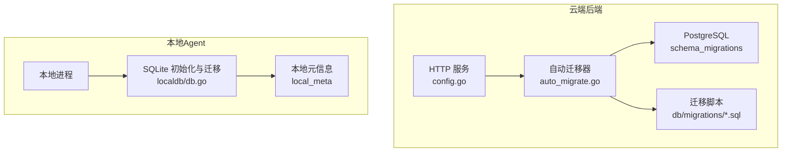
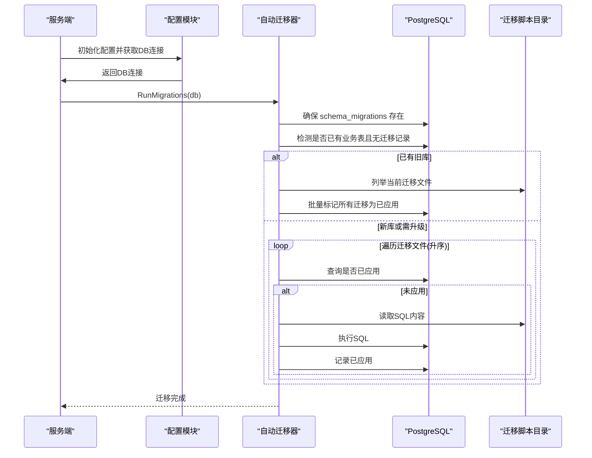
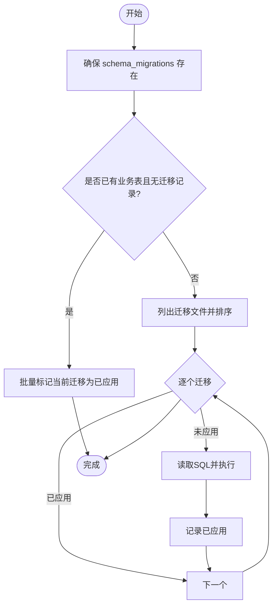
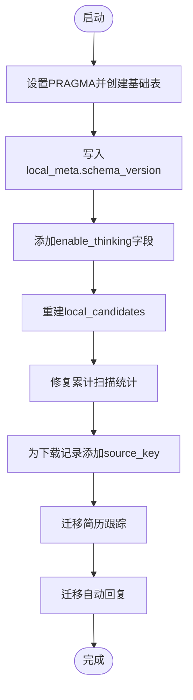
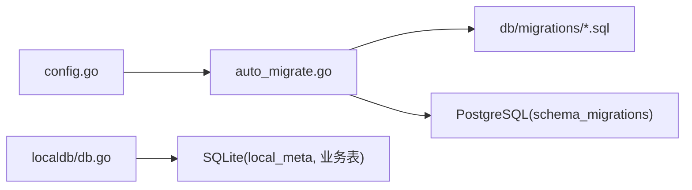

# 数据迁移管理

<cite>
**本文引用的文件**
- [auto_migrate.go](file://goodhr5/cloud/backend/internal/httpapi/auto_migrate.go)
- [config.go](file://goodhr5/cloud/backend/internal/httpapi/config.go)
- [0001_initial_schema.sql](file://goodhr5/cloud/backend/db/migrations/0001_initial_schema.sql)
- [0001_initial_schema.down.sql](file://goodhr5/cloud/backend/db/migrations/0001_initial_schema.down.sql)
- [0002_add_system_configs.sql](file://goodhr5/cloud/backend/db/migrations/0002_add_system_configs.sql)
- [0002_add_system_configs.down.sql](file://goodhr5/cloud/backend/db/migrations/0002_add_system_configs.down.sql)
- [0075_system_payment_wechat.sql](file://goodhr5/cloud/backend/db/migrations/0075_system_payment_wechat.sql)
- [db.go](file://goodhr5/local-agent-go/internal/localdb/db.go)
</cite>

## 目录
1. [简介](#简介)
2. [项目结构](#项目结构)
3. [核心组件](#核心组件)
4. [架构总览](#架构总览)
5. [详细组件分析](#详细组件分析)
6. [依赖关系分析](#依赖关系分析)
7. [性能考量](#性能考量)
8. [故障排除指南](#故障排除指南)
9. [结论](#结论)
10. [附录：迁移脚本编写规范与最佳实践](#附录：迁移脚本编写规范与最佳实践)

## 简介
本文件面向 GoodHR 5 的数据迁移管理，覆盖云端 PostgreSQL 与本地 SQLite 两套数据库的迁移策略、版本控制机制、自动迁移流程、DDL 操作、数据转换、回滚策略、生产部署注意事项、错误处理与一致性保证。文档同时提供迁移脚本编写规范、依赖关系管理与常见问题的排查方法，帮助开发者安全地管理数据库结构变更。

## 项目结构
- 云端后端（PostgreSQL）
  - 迁移脚本位于 db/migrations，采用“序号_描述.sql”命名，配套可选“.down.sql”用于回滚。
  - 启动时通过 HTTP API 层自动执行迁移，并记录已执行的迁移文件到 schema_migrations 表。
- 本地 Agent（SQLite）
  - 使用内嵌 SQL 脚本在应用启动时创建和升级本地数据库表结构，并通过 local_meta 维护版本号与迁移标记。

图表来源
- [config.go:90-100](file://goodhr5/cloud/backend/internal/httpapi/config.go#L90-L100)
- [auto_migrate.go:13-55](file://goodhr5/cloud/backend/internal/httpapi/auto_migrate.go#L13-L55)
- [db.go:65-229](file://goodhr5/local-agent-go/internal/localdb/db.go#L65-L229)

章节来源
- [config.go:90-100](file://goodhr5/cloud/backend/internal/httpapi/config.go#L90-L100)
- [auto_migrate.go:13-55](file://goodhr5/cloud/backend/internal/httpapi/auto_migrate.go#L13-L55)
- [db.go:65-229](file://goodhr5/local-agent-go/internal/localdb/db.go#L65-L229)

## 核心组件
- 云端自动迁移器
  - 扫描 db/migrations 下的 .sql 文件（忽略 .down.sql），按文件名排序依次执行。
  - 使用 schema_migrations 表记录已执行迁移，避免重复执行。
  - 对已有旧库进行“引导式”标记，将当前代码中的迁移全部标记为已应用，避免破坏现有数据。
- 本地数据库迁移
  - 在进程启动时执行内嵌 SQL，创建必要表结构与索引，写入 local_meta 的版本号。
  - 通过多个 migrateXxx 函数实现增量字段添加、统计修复等向后兼容逻辑。

章节来源
- [auto_migrate.go:13-55](file://goodhr5/cloud/backend/internal/httpapi/auto_migrate.go#L13-L55)
- [auto_migrate.go:57-116](file://goodhr5/cloud/backend/internal/httpapi/auto_migrate.go#L57-L116)
- [db.go:65-229](file://goodhr5/local-agent-go/internal/localdb/db.go#L65-L229)

## 架构总览
云端迁移流程：
- 启动时建立数据库连接并 Ping 检查。
- 调用 RunMigrations 执行自动迁移。
- 确保 schema_migrations 存在；若检测到已有业务表但无迁移记录，则批量标记当前迁移为已应用。
- 否则按顺序读取并执行每个未应用的迁移脚本，成功后记录到 schema_migrations。

图表来源
- [config.go:90-100](file://goodhr5/cloud/backend/internal/httpapi/config.go#L90-L100)
- [auto_migrate.go:13-55](file://goodhr5/cloud/backend/internal/httpapi/auto_migrate.go#L13-L55)
- [auto_migrate.go:57-116](file://goodhr5/cloud/backend/internal/httpapi/auto_migrate.go#L57-L116)

## 详细组件分析

### 云端自动迁移器（PostgreSQL）
- 功能要点
  - 文件发现：仅选择以 .sql 结尾且非 .down.sql 的文件。
  - 版本控制：schema_migrations.filename 作为唯一键，applied_at 记录时间戳。
  - 幂等性：INSERT ... ON CONFLICT DO NOTHING 防止重复记录。
  - 旧库引导：当 schema_migrations 为空且存在业务表时，直接标记当前迁移为已应用，避免误删数据。
- 关键路径
  - 入口：config.go 中数据库初始化后调用 RunMigrations。
  - 执行：auto_migrate.go 中 RunMigrations 负责扫描、排序、执行与记录。

图表来源
- [auto_migrate.go:13-55](file://goodhr5/cloud/backend/internal/httpapi/auto_migrate.go#L13-L55)
- [auto_migrate.go:57-116](file://goodhr5/cloud/backend/internal/httpapi/auto_migrate.go#L57-L116)

章节来源
- [auto_migrate.go:13-55](file://goodhr5/cloud/backend/internal/httpapi/auto_migrate.go#L13-L55)
- [auto_migrate.go:57-116](file://goodhr5/cloud/backend/internal/httpapi/auto_migrate.go#L57-L116)
- [config.go:90-100](file://goodhr5/cloud/backend/internal/httpapi/config.go#L90-L100)

### 本地数据库迁移（SQLite）
- 功能要点
  - 一次性创建基础表与索引，写入 local_meta.schema_version。
  - 通过多个 migrateXxx 函数逐步添加字段、重建表、修复统计数据，保证向后兼容。
  - 使用 PRAGMA foreign_keys=ON 确保外键约束生效。
- 典型迁移
  - 添加 enable_thinking 字段。
  - 重建 local_candidates 以支持结构化字段。
  - 修复累计扫描统计语义。
  - 为下载记录添加 source_key 字段并建索引。
  - 新增简历跟踪与自动回复相关迁移。

图表来源
- [db.go:65-229](file://goodhr5/local-agent-go/internal/localdb/db.go#L65-L229)

章节来源
- [db.go:65-229](file://goodhr5/local-agent-go/internal/localdb/db.go#L65-L229)

### 迁移脚本示例与说明
- 初始结构（0001_initial_schema.sql）
  - 定义用户、本地代理、平台账号映射、岗位、AI 配置、任务运行与日志等核心表及索引。
  - 注释清晰说明各表与字段用途。
- 系统配置扩展（0002_add_system_configs.sql）
  - 新增 system_configs 表，支持 JSONB 配置项与启用开关。
- 微信支付配置（0075_system_payment_wechat.sql）
  - 向 system_configs 插入微信支付相关配置键值，使用 ON CONFLICT DO NOTHING 保证幂等。

章节来源
- [0001_initial_schema.sql:1-135](file://goodhr5/cloud/backend/db/migrations/0001_initial_schema.sql#L1-L135)
- [0002_add_system_configs.sql:1-15](file://goodhr5/cloud/backend/db/migrations/0002_add_system_configs.sql#L1-L15)
- [0075_system_payment_wechat.sql:1-19](file://goodhr5/cloud/backend/db/migrations/0075_system_payment_wechat.sql#L1-L19)

### 回滚策略
- 云端
  - 提供 .down.sql 文件用于回滚，例如 0001_initial_schema.down.sql 与 0002_add_system_configs.down.sql。
  - 注意：当前自动迁移器不自动执行 .down.sql，回滚需由运维或管理员手动执行对应 down 脚本。
- 本地
  - 通过重构表或添加字段的方式实现“可逆”的演进；对于不可逆变更需谨慎评估影响范围。

章节来源
- [0001_initial_schema.down.sql:1-11](file://goodhr5/cloud/backend/db/migrations/0001_initial_schema.down.sql#L1-L11)
- [0002_add_system_configs.down.sql:1-2](file://goodhr5/cloud/backend/db/migrations/0002_add_system_configs.down.sql#L1-L2)

## 依赖关系分析
- 云端迁移依赖
  - config.go 在数据库连接成功后调用 auto_migrate.go 的 RunMigrations。
  - auto_migrate.go 依赖文件系统（db/migrations）与 PostgreSQL（schema_migrations）。
- 本地迁移依赖
  - db.go 在 SQLite 连接建立后立即执行内嵌迁移脚本，后续通过多个 migrateXxx 函数进行增量升级。

图表来源
- [config.go:90-100](file://goodhr5/cloud/backend/internal/httpapi/config.go#L90-L100)
- [auto_migrate.go:13-55](file://goodhr5/cloud/backend/internal/httpapi/auto_migrate.go#L13-L55)
- [db.go:65-229](file://goodhr5/local-agent-go/internal/localdb/db.go#L65-L229)

章节来源
- [config.go:90-100](file://goodhr5/cloud/backend/internal/httpapi/config.go#L90-L100)
- [auto_migrate.go:13-55](file://goodhr5/cloud/backend/internal/httpapi/auto_migrate.go#L13-L55)
- [db.go:65-229](file://goodhr5/local-agent-go/internal/localdb/db.go#L65-L229)

## 性能考量
- 云端
  - 迁移文件数量较多时，建议分批合并大事务，减少锁竞争。
  - 对频繁查询的列建立合适索引（如 users、positions、task_runs 等）。
- 本地
  - 使用 WAL 模式提升并发写入性能。
  - 谨慎重建大表，必要时分阶段迁移以减少停机时间。

[本节为通用指导，无需特定文件引用]

## 故障排除指南
- 常见问题
  - 迁移失败导致服务无法启动：检查数据库连接与权限，查看迁移脚本语法与约束冲突。
  - 重复执行迁移：确认 schema_migrations 是否存在重复记录；云端迁移器已做幂等保护。
  - 旧库引导误判：若 schema_migrations 为空且存在业务表，会自动标记当前迁移为已应用，避免破坏数据。
  - 本地迁移异常：检查 local_meta 版本与字段是否存在；关注 migrateXxx 函数的错误返回。
- 定位步骤
  - 云端：查看启动日志中的 “[migrate]” 输出，定位具体失败的迁移文件。
  - 本地：检查 SQLite 错误信息与 local_meta 状态，必要时回退到上一版本并修复数据。

章节来源
- [auto_migrate.go:13-55](file://goodhr5/cloud/backend/internal/httpapi/auto_migrate.go#L13-L55)
- [db.go:65-229](file://goodhr5/local-agent-go/internal/localdb/db.go#L65-L229)

## 结论
GoodHR 5 的迁移体系在云端与本地分别实现了稳健的版本控制与自动升级机制。云端通过 schema_migrations 与文件排序保证迁移顺序与幂等性，并对旧库进行安全引导；本地通过内嵌脚本与增量迁移函数实现平滑演进。遵循本文的编写规范与最佳实践，可在生产环境中安全地进行数据库结构变更与数据一致性保障。

## 附录：迁移脚本编写规范与最佳实践
- 命名与组织
  - 使用“序号_描述.sql”命名，序号递增，便于排序与识别。
  - 如需回滚，提供对应的“.down.sql”，并在注释中说明回滚顺序与依赖。
- 幂等性与安全性
  - 使用 CREATE TABLE IF NOT EXISTS、ALTER TABLE ADD COLUMN IF NOT EXISTS、INSERT ... ON CONFLICT DO NOTHING 等语句保证幂等。
  - 避免在生产环境直接删除列或表；优先采用新增字段与默认值过渡。
- 事务与一致性
  - 复杂迁移应包裹在事务中，确保原子性。
  - 对大数据量更新考虑分批提交，降低锁持有时间。
- 索引与性能
  - 为新列及时建立索引，尤其是高频查询与过滤条件。
  - 避免在高峰期执行耗时较长的 DDL。
- 依赖关系管理
  - 明确表间外键依赖，回滚脚本按相反顺序删除对象。
  - 跨服务共享的表变更需协调上下游版本兼容性。
- 生产部署
  - 在低峰期执行迁移，提前备份数据库。
  - 灰度发布与回滚预案：准备快速回滚脚本与验证清单。
- 错误处理与监控
  - 记录迁移开始与结束时间、失败堆栈与上下文信息。
  - 对关键指标（行数变化、耗时）进行监控告警。
- 数据一致性保证
  - 先写后改：新增字段时保留旧字段一段时间，双写后再切换。
  - 校验数据完整性：迁移前后对比计数与抽样数据。

[本节为通用指导，无需特定文件引用]