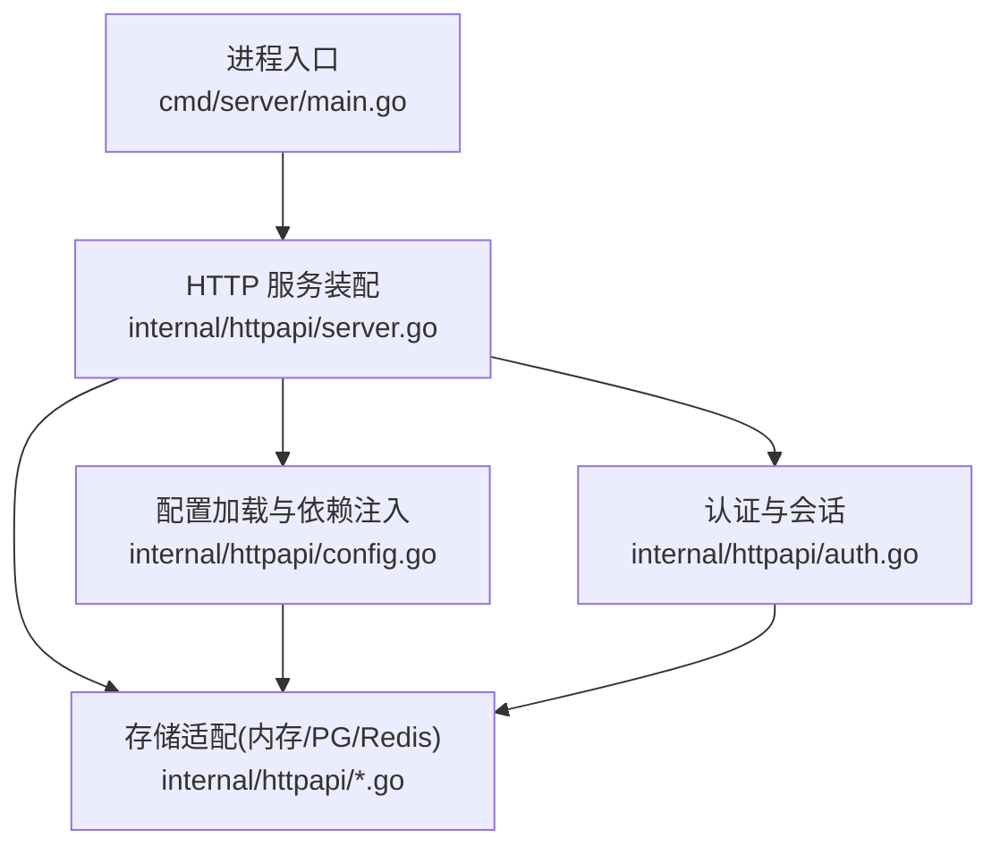
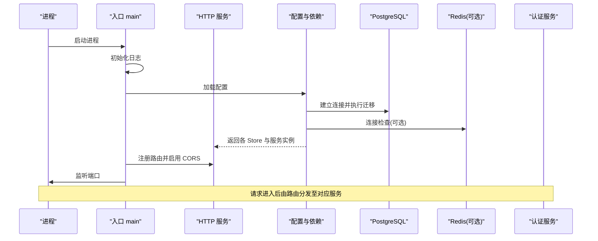
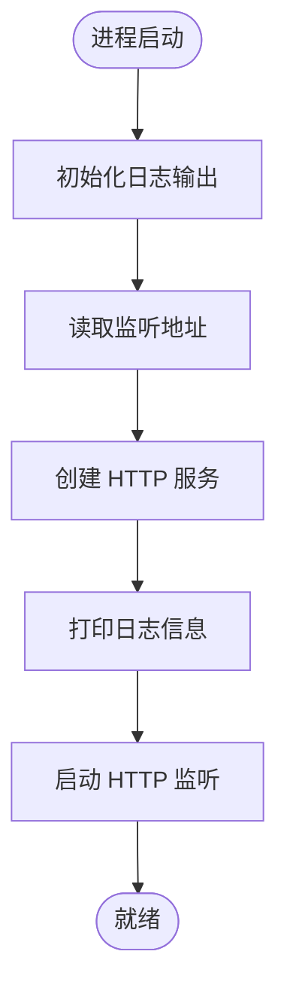
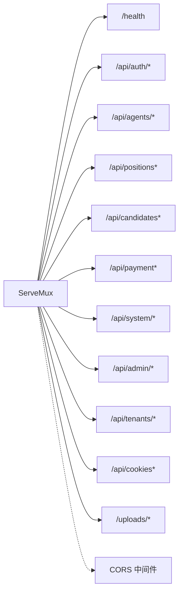
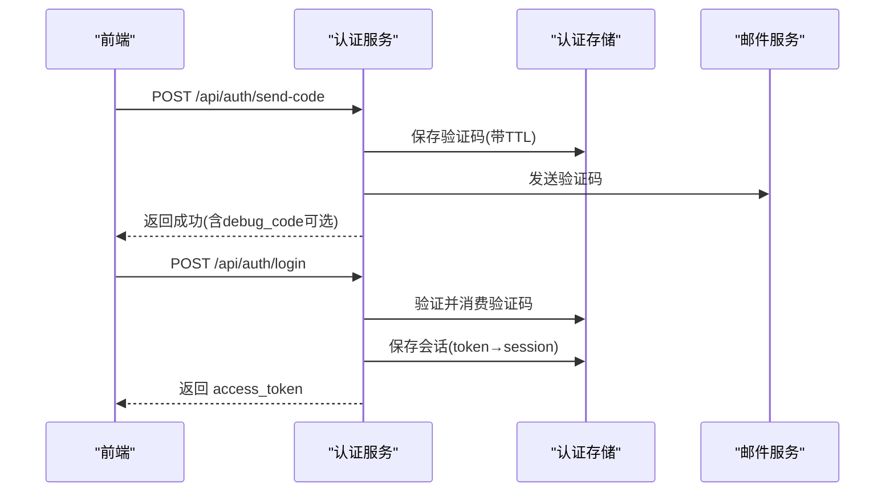
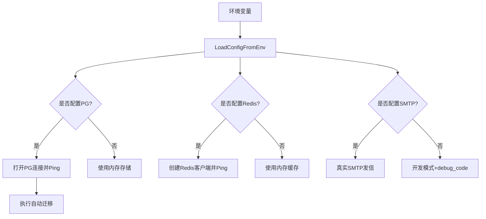
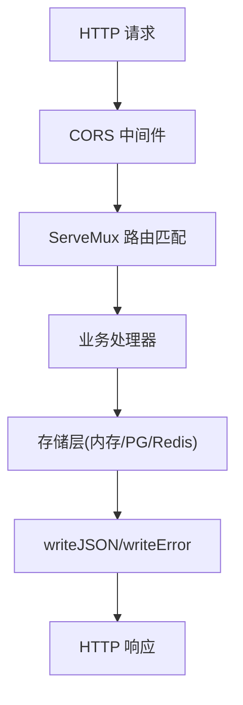
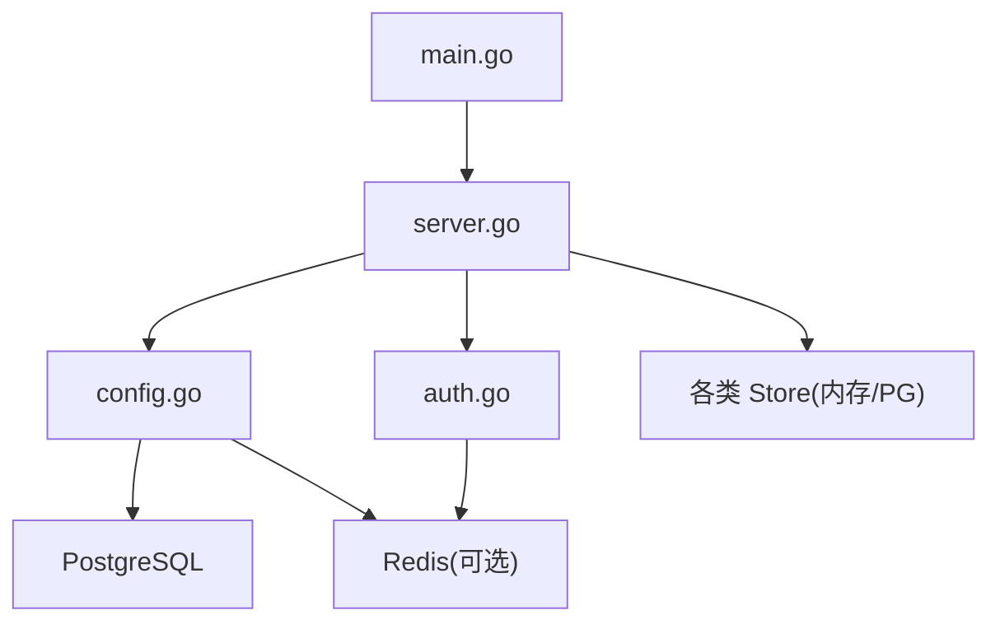

# 服务架构设计

<cite>
**本文引用的文件**
- [main.go](file://goodhr5/cloud/backend/cmd/server/main.go)
- [server.go](file://goodhr5/cloud/backend/internal/httpapi/server.go)
- [config.go](file://goodhr5/cloud/backend/internal/httpapi/config.go)
- [auth.go](file://goodhr5/cloud/backend/internal/httpapi/auth.go)
- [redis_auth_store.go](file://goodhr5/cloud/backend/internal/httpapi/redis_auth_store.go)
- [auto_migrate.go](file://goodhr5/cloud/backend/internal/httpapi/auto_migrate.go)
- [README.md](file://goodhr5/cloud/backend/README.md)
</cite>

## 目录
1. [简介](#简介)
2. [项目结构](#项目结构)
3. [核心组件](#核心组件)
4. [架构总览](#架构总览)
5. [详细组件分析](#详细组件分析)
6. [依赖关系分析](#依赖关系分析)
7. [性能考量](#性能考量)
8. [故障排查指南](#故障排查指南)
9. [结论](#结论)
10. [附录](#附录)

## 简介
本文件面向云端后端服务的架构设计与实现，重点说明 Go 后端的服务启动流程、HTTP 服务器初始化、路由组织方式、中间件机制、请求处理管道、错误处理策略、日志与配置管理。文档同时提供架构图与组件交互时序图，帮助开发者理解整体设计理念与扩展点。

## 项目结构
云端后端采用“入口程序 + HTTP 服务组装 + 业务服务层 + 存储适配”的分层组织：
- 入口程序负责进程启动、日志输出、监听地址与环境参数读取，并创建 HTTP 服务实例后启动监听。
- HTTP 服务层负责路由注册、统一响应格式、CORS 中间件、健康检查与系统配置接口。
- 业务服务层按领域划分（认证、岗位、候选人、支付、租户、AI 钱包等），通过 Server 聚合注入依赖。
- 存储适配层根据环境变量选择内存或持久化实现（PostgreSQL、Redis），并提供统一的 Store 接口。

图表来源
- [main.go:14-29](file://goodhr5/cloud/backend/cmd/server/main.go#L14-L29)
- [server.go:46-121](file://goodhr5/cloud/backend/internal/httpapi/server.go#L46-L121)
- [config.go:30-87](file://goodhr5/cloud/backend/internal/httpapi/config.go#L30-L87)

章节来源
- [main.go:14-29](file://goodhr5/cloud/backend/cmd/server/main.go#L14-L29)
- [server.go:124-212](file://goodhr5/cloud/backend/internal/httpapi/server.go#L124-L212)
- [config.go:30-87](file://goodhr5/cloud/backend/internal/httpapi/config.go#L30-L87)

## 核心组件
- 进程入口与日志
  - 负责设置日志输出到标准输出与文件，读取监听地址，创建并启动 HTTP 服务。
- HTTP 服务装配器
  - 集中注册所有 API 路由，注入各业务服务依赖，提供 CORS 中间件与统一 JSON 响应工具。
- 配置中心
  - 从环境变量加载数据库、缓存、邮件、管理员白名单等配置；按需创建 PostgreSQL 连接并执行自动迁移；按环境切换存储实现。
- 认证与会话
  - 邮箱验证码登录、万能验证码、会话存取、角色判定、邀请绑定与试用通知。
- 存储适配
  - 基于 Redis 的认证存储实现，支持验证码一次性消费与会话序列化存储；其他存储由配置工厂按需返回内存或 PG 实现。

章节来源
- [main.go:14-52](file://goodhr5/cloud/backend/cmd/server/main.go#L14-L52)
- [server.go:16-121](file://goodhr5/cloud/backend/internal/httpapi/server.go#L16-L121)
- [config.go:16-87](file://goodhr5/cloud/backend/internal/httpapi/config.go#L16-L87)
- [auth.go:21-69](file://goodhr5/cloud/backend/internal/httpapi/auth.go#L21-L69)
- [redis_auth_store.go:12-115](file://goodhr5/cloud/backend/internal/httpapi/redis_auth_store.go#L12-L115)

## 架构总览
云端后端以 HTTP 为中心，围绕“配置驱动 + 依赖注入 + 存储抽象”的模式组织。启动时先完成配置加载与依赖构建，再注册路由并暴露对外接口。认证模块贯穿多数受保护接口，存储层根据运行环境在内存与持久化之间切换。

图表来源
- [main.go:14-29](file://goodhr5/cloud/backend/cmd/server/main.go#L14-L29)
- [server.go:46-121](file://goodhr5/cloud/backend/internal/httpapi/server.go#L46-L121)
- [config.go:47-87](file://goodhr5/cloud/backend/internal/httpapi/config.go#L47-L87)
- [auto_migrate.go:13-55](file://goodhr5/cloud/backend/internal/httpapi/auto_migrate.go#L13-L55)

## 详细组件分析

### 服务启动与日志配置
- 日志
  - 将日志同时输出到标准输出与文件，便于容器与本地调试。
- 监听地址
  - 通过环境变量覆盖默认端口，未配置时使用默认值。
- 启动顺序
  - 初始化日志 → 读取监听地址 → 创建 HTTP 服务 → 打印日志 → 启动监听。

图表来源
- [main.go:14-29](file://goodhr5/cloud/backend/cmd/server/main.go#L14-L29)
- [main.go:40-52](file://goodhr5/cloud/backend/cmd/server/main.go#L40-L52)

章节来源
- [main.go:14-52](file://goodhr5/cloud/backend/cmd/server/main.go#L14-L52)

### HTTP 服务器初始化与路由组织
- 依赖注入
  - 从配置中获取各 Store 与服务实例，组装为 Server 结构体，供路由调用。
- 路由注册
  - 使用标准库 ServeMux 注册健康检查、认证、岗位、候选人、支付、租户、系统配置等接口。
  - 对部分路径进行后缀匹配分发（如岗位详情/状态/日志/开始/停止）。
- 中间件
  - 全局 CORS 中间件，允许跨域请求与预检。
- 统一响应
  - 提供 writeJSON/writeError 统一返回格式，便于前端解析。

图表来源
- [server.go:124-212](file://goodhr5/cloud/backend/internal/httpapi/server.go#L124-L212)
- [server.go:577-588](file://goodhr5/cloud/backend/internal/httpapi/server.go#L577-L588)

章节来源
- [server.go:46-121](file://goodhr5/cloud/backend/internal/httpapi/server.go#L46-L121)
- [server.go:124-212](file://goodhr5/cloud/backend/internal/httpapi/server.go#L124-L212)
- [server.go:577-588](file://goodhr5/cloud/backend/internal/httpapi/server.go#L577-L588)

### 认证与会话流程
- 发送验证码
  - 校验邮箱域名白名单，生成 4 位随机码，保存至存储（内存或 Redis），并通过 SMTP 或开发模式发信。
- 登录
  - 校验验证码（支持万能验证码），生成访问令牌，保存会话，记录登录活动，发送试用奖励通知，初始化 AI 钱包，应用邀请奖励。
- 会话校验
  - 从 Authorization 头提取 Bearer Token，查询会话，用于后续受保护接口鉴权。

图表来源
- [auth.go:71-119](file://goodhr5/cloud/backend/internal/httpapi/auth.go#L71-L119)
- [auth.go:121-214](file://goodhr5/cloud/backend/internal/httpapi/auth.go#L121-L214)
- [redis_auth_store.go:36-87](file://goodhr5/cloud/backend/internal/httpapi/redis_auth_store.go#L36-L87)

章节来源
- [auth.go:71-214](file://goodhr5/cloud/backend/internal/httpapi/auth.go#L71-L214)
- [redis_auth_store.go:36-87](file://goodhr5/cloud/backend/internal/httpapi/redis_auth_store.go#L36-L87)

### 配置与环境参数管理
- 配置来源
  - 通过环境变量加载 PostgreSQL DSN、Redis 地址/密码/库号、SMTP、超级管理员列表、万能验证码偏移分钟数等。
- 存储切换
  - 若配置了 PostgreSQL，则创建连接并执行自动迁移；否则使用内存存储。
  - 若配置了 Redis，则启用 Redis 认证存储与日志缓存层；否则回退到内存。
- 邮件服务
  - 配置 SMTP 即启用真实发信；否则使用开发模式并在响应中返回 debug_code。

图表来源
- [config.go:30-87](file://goodhr5/cloud/backend/internal/httpapi/config.go#L30-L87)
- [config.go:256-268](file://goodhr5/cloud/backend/internal/httpapi/config.go#L256-L268)
- [auto_migrate.go:13-55](file://goodhr5/cloud/backend/internal/httpapi/auto_migrate.go#L13-L55)

章节来源
- [config.go:30-87](file://goodhr5/cloud/backend/internal/httpapi/config.go#L30-L87)
- [config.go:256-268](file://goodhr5/cloud/backend/internal/httpapi/config.go#L256-L268)
- [auto_migrate.go:13-55](file://goodhr5/cloud/backend/internal/httpapi/auto_migrate.go#L13-L55)

### 中间件机制与请求处理管道
- 全局中间件
  - CORS 中间件在所有路由外层包裹，统一设置跨域头并处理 OPTIONS 预检。
- 请求处理管道
  - 路由匹配 → 业务服务方法 → 存储层读写 → 统一响应封装。
  - 部分路由通过后缀匹配进行二次分发（如岗位相关子路径）。

图表来源
- [server.go:124-212](file://goodhr5/cloud/backend/internal/httpapi/server.go#L124-L212)
- [server.go:577-588](file://goodhr5/cloud/backend/internal/httpapi/server.go#L577-L588)
- [server.go:261-277](file://goodhr5/cloud/backend/internal/httpapi/server.go#L261-L277)

章节来源
- [server.go:124-212](file://goodhr5/cloud/backend/internal/httpapi/server.go#L124-L212)
- [server.go:577-588](file://goodhr5/cloud/backend/internal/httpapi/server.go#L577-L588)
- [server.go:261-277](file://goodhr5/cloud/backend/internal/httpapi/server.go#L261-L277)

### 错误处理策略
- 统一错误格式
  - writeError 返回包含 ok=false 与 error 消息的 JSON，便于前端统一处理。
- 方法校验
  - 多数接口显式校验 HTTP 方法，非法方法返回 405。
- 资源不存在
  - 针对系统配置等场景，区分“未找到”与“内部错误”，返回不同状态码。
- 认证失败
  - 会话无效或过期返回 401，并提示刷新浏览器重新登录。

章节来源
- [server.go:247-277](file://goodhr5/cloud/backend/internal/httpapi/server.go#L247-L277)
- [auth.go:216-255](file://goodhr5/cloud/backend/internal/httpapi/auth.go#L216-L255)

### 数据库迁移
- 自动迁移
  - 启动时扫描 db/migrations 下的 .sql 文件，按文件名排序依次执行，并记录已执行的迁移。
- 旧库兼容
  - 检测是否存在历史表结构，若存在则标记当前迁移为已执行，避免重复覆盖系统配置。

章节来源
- [auto_migrate.go:13-55](file://goodhr5/cloud/backend/internal/httpapi/auto_migrate.go#L13-L55)
- [auto_migrate.go:57-116](file://goodhr5/cloud/backend/internal/httpapi/auto_migrate.go#L57-L116)

## 依赖关系分析
- 松耦合
  - 通过配置工厂创建具体存储实现，业务服务仅依赖接口，便于替换与测试。
- 关键依赖链
  - 入口 → HTTP 服务 → 配置 → 存储（PG/Redis/内存）→ 业务服务。
- 外部集成
  - PostgreSQL 用于持久化数据；Redis 用于验证码与会话缓存；SMTP 用于验证码邮件。

图表来源
- [main.go:14-29](file://goodhr5/cloud/backend/cmd/server/main.go#L14-L29)
- [server.go:46-121](file://goodhr5/cloud/backend/internal/httpapi/server.go#L46-L121)
- [config.go:47-87](file://goodhr5/cloud/backend/internal/httpapi/config.go#L47-L87)

章节来源
- [server.go:46-121](file://goodhr5/cloud/backend/internal/httpapi/server.go#L46-L121)
- [config.go:47-87](file://goodhr5/cloud/backend/internal/httpapi/config.go#L47-L87)

## 性能考量
- 数据库连接池
  - 设置最大连接数、空闲连接数与连接生命周期，避免连接泄漏与过度占用。
- 缓存层
  - 在配置 Redis 时为岗位日志增加缓存层，降低热点读写的数据库压力。
- 迁移时机
  - 在连接检查通过后执行迁移，减少因配置错误导致的无效日志与重试。
- 并发与安全
  - 验证码一次性消费，防止重放攻击；会话带过期时间，降低长期有效风险。

[本节为通用性能建议，不直接分析具体代码文件]

## 故障排查指南
- 无法连接 PostgreSQL
  - 检查 GOODHR_PG_DSN 是否正确；查看启动日志中的连接与迁移错误。
- 无法连接 Redis
  - 检查 GOODHR_REDIS_ADDR/GOODHR_REDIS_PASSWORD/GOODHR_REDIS_DB；确认网络与防火墙。
- 验证码未收到
  - 未配置 SMTP 时会返回 debug_code；配置 SMTP 后检查主机、端口、用户名与授权码。
- 登录失败
  - 确认验证码未过期；检查万能验证码是否开启及偏移分钟数；核对邮箱域名是否在白名单。
- 路由 405
  - 检查请求方法与接口定义是否一致。

章节来源
- [config.go:47-87](file://goodhr5/cloud/backend/internal/httpapi/config.go#L47-L87)
- [auth.go:71-119](file://goodhr5/cloud/backend/internal/httpapi/auth.go#L71-L119)
- [README.md:15-83](file://goodhr5/cloud/backend/README.md#L15-L83)

## 结论
该云端后端以清晰的启动流程、可插拔的配置与存储抽象、统一的路由与响应格式，构建了可扩展、易维护的 HTTP 服务。认证与会话贯穿核心流程，配合 Redis 与 PostgreSQL 提供高可用与持久化能力。通过中间件与错误处理策略，保证了请求处理的健壮性与一致性。未来可在现有基础上继续扩展新的业务服务与存储实现，保持低耦合与高内聚。

## 附录
- 快速启动
  - 默认监听 :8084；可通过环境变量修改监听地址。
  - 未配置 PostgreSQL 时，部分模块使用内存存储，适合本地联调。
  - 配置 Redis 后可启用验证码与会话的持久化缓存。
  - 配置 SMTP 后可真实发送邮件验证码。

章节来源
- [README.md:3-83](file://goodhr5/cloud/backend/README.md#L3-L83)