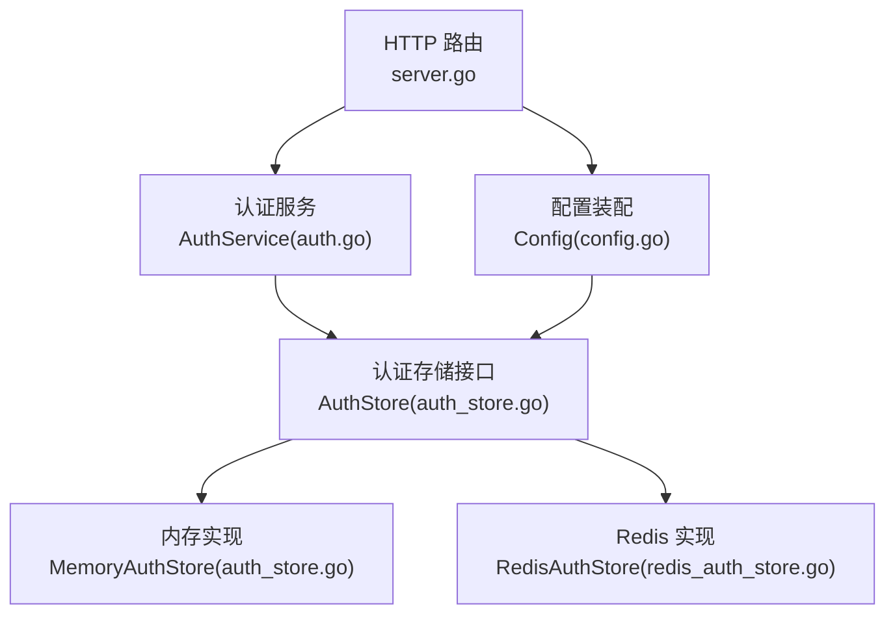
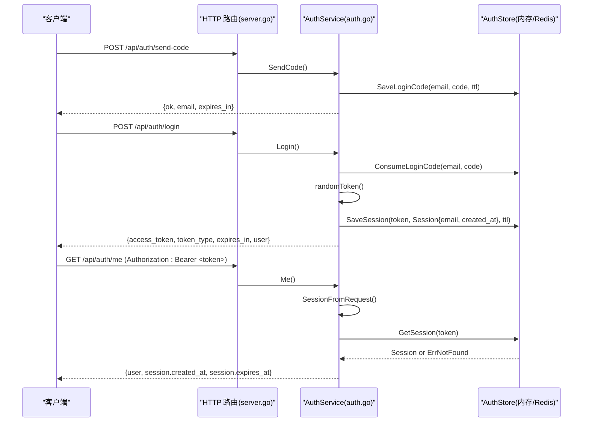
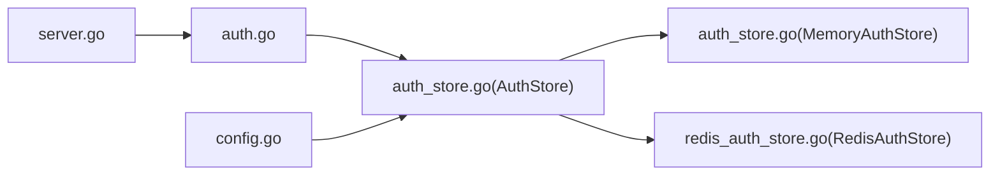

# 会话管理机制

<cite>
**本文引用的文件**
- [auth.go](file://goodhr5/cloud/backend/internal/httpapi/auth.go)
- [auth_store.go](file://goodhr5/cloud/backend/internal/httpapi/auth_store.go)
- [redis_auth_store.go](file://goodhr5/cloud/backend/internal/httpapi/redis_auth_store.go)
- [config.go](file://goodhr5/cloud/backend/internal/httpapi/config.go)
- [server.go](file://goodhr5/cloud/backend/internal/httpapi/server.go)
</cite>

## 目录
1. [简介](#简介)
2. [项目结构](#项目结构)
3. [核心组件](#核心组件)
4. [架构总览](#架构总览)
5. [详细组件分析](#详细组件分析)
6. [依赖关系分析](#依赖关系分析)
7. [性能考虑](#性能考虑)
8. [故障排查指南](#故障排查指南)
9. [结论](#结论)
10. [附录](#附录)

## 简介
本文件聚焦云端后端的会话管理系统，覆盖会话生命周期（创建、存储、刷新、销毁）、Token 生成算法与安全机制、会话存储策略（内存与 Redis）、HTTP 请求中的 Token 提取与会话校验、并发安全与分布式同步、以及过期清理与活跃统计等监控能力。系统采用“验证码登录 + Bearer Token”的无状态鉴权模式：服务端仅保存会话元数据（邮箱、创建时间、过期时间），通过随机 Token 作为键进行存取；默认使用内存存储，生产环境可通过配置切换为 Redis 以支持多实例共享与自动过期。

## 项目结构
会话相关代码集中在 HTTP API 层，围绕 AuthService 与 AuthStore 接口展开，并通过配置模块在启动时选择具体实现（内存或 Redis）。路由注册将认证相关端点挂载到统一 Server。

图表来源
- [server.go:124-212](file://goodhr5/cloud/backend/internal/httpapi/server.go#L124-L212)
- [auth.go:21-69](file://goodhr5/cloud/backend/internal/httpapi/auth.go#L21-L69)
- [auth_store.go:11-30](file://goodhr5/cloud/backend/internal/httpapi/auth_store.go#L11-L30)
- [redis_auth_store.go:12-24](file://goodhr5/cloud/backend/internal/httpapi/redis_auth_store.go#L12-L24)
- [config.go:77-87](file://goodhr5/cloud/backend/internal/httpapi/config.go#L77-L87)

章节来源
- [server.go:124-212](file://goodhr5/cloud/backend/internal/httpapi/server.go#L124-L212)
- [config.go:77-87](file://goodhr5/cloud/backend/internal/httpapi/config.go#L77-L87)

## 核心组件
- 认证服务 AuthService：负责验证码发送、登录流程、会话解析与用户信息返回。
- 认证存储接口 AuthStore：定义验证码与会话的持久化契约。
- 内存实现 MemoryAuthStore：进程内 Map + 互斥锁，适合单机开发测试。
- Redis 实现 RedisAuthStore：基于 Redis 的键值存储，支持 TTL 与多实例共享。
- 配置 Config：根据环境变量决定使用内存还是 Redis 作为认证存储。

章节来源
- [auth.go:21-69](file://goodhr5/cloud/backend/internal/httpapi/auth.go#L21-L69)
- [auth_store.go:11-30](file://goodhr5/cloud/backend/internal/httpapi/auth_store.go#L11-L30)
- [redis_auth_store.go:12-24](file://goodhr5/cloud/backend/internal/httpapi/redis_auth_store.go#L12-L24)
- [config.go:77-87](file://goodhr5/cloud/backend/internal/httpapi/config.go#L77-L87)

## 架构总览
下图展示从客户端发起登录到获取访问令牌，再到后续请求携带令牌进行会话校验的整体流程。

图表来源
- [server.go:124-133](file://goodhr5/cloud/backend/internal/httpapi/server.go#L124-L133)
- [auth.go:71-214](file://goodhr5/cloud/backend/internal/httpapi/auth.go#L71-L214)
- [auth.go:452-470](file://goodhr5/cloud/backend/internal/httpapi/auth.go#L452-L470)
- [auth_store.go:45-98](file://goodhr5/cloud/backend/internal/httpapi/auth_store.go#L45-L98)
- [redis_auth_store.go:36-87](file://goodhr5/cloud/backend/internal/httpapi/redis_auth_store.go#L36-L87)

## 详细组件分析

### 会话生命周期管理
- 创建
  - 验证码登录成功后生成随机 Token，并调用存储保存会话，设置过期时间为固定时长。
  - 同时记录登录活动与邀请绑定等业务副作用。
- 存储
  - 内存实现：Map 保存 token -> Session，写入时计算 ExpiresAt。
  - Redis 实现：JSON 序列化 Session 存入 key=session:{token}，TTL 由传入 ttl 控制。
- 刷新
  - 当前实现未提供显式“刷新会话”接口；每次访问受保护资源时会读取会话，若未过期则继续使用。
  - 如需主动续期，可在业务层增加“刷新”逻辑，在读取会话时判断剩余时间并重置 TTL。
- 销毁
  - 过期即失效：读取时检查 ExpiresAt，过期则删除并返回未找到错误。
  - 验证码一次性消费：ConsumeLoginCode 成功后删除验证码，防止重放。

章节来源
- [auth.go:121-214](file://goodhr5/cloud/backend/internal/httpapi/auth.go#L121-L214)
- [auth.go:452-470](file://goodhr5/cloud/backend/internal/httpapi/auth.go#L452-L470)
- [auth_store.go:76-98](file://goodhr5/cloud/backend/internal/httpapi/auth_store.go#L76-L98)
- [redis_auth_store.go:59-87](file://goodhr5/cloud/backend/internal/httpapi/redis_auth_store.go#L59-L87)

### Token 生成算法与安全机制
- 随机数来源：使用加密安全的随机源生成字节序列。
- 长度设计：Token 主体为 32 字节随机数据，经十六进制编码后拼接前缀标识 gh5_，形成最终字符串。
- 前缀标识：便于快速识别与过滤，避免与其他系统令牌混淆。
- 安全性要点
  - 高熵随机性：32 字节随机数具备足够碰撞难度。
  - 无状态校验：服务端不保存用户敏感信息，仅保存会话元数据（邮箱、时间戳）。
  - 传输安全：建议配合 HTTPS 使用，避免中间人窃取。
  - 防重放：验证码一次性消费，降低暴力破解风险。

章节来源
- [auth.go:506-512](file://goodhr5/cloud/backend/internal/httpapi/auth.go#L506-L512)
- [auth.go:493-504](file://goodhr5/cloud/backend/internal/httpapi/auth.go#L493-L504)

### 会话存储策略
- 内存存储（MemoryAuthStore）
  - 数据结构：Map[token]Session，内部维护互斥锁保证并发安全。
  - 过期处理：读取时检查 ExpiresAt，过期则删除并返回未找到。
  - 适用场景：单机开发、测试环境。
- Redis 存储（RedisAuthStore）
  - Key 设计：session:{token} 存储 JSON 化的 Session；login_code:{email} 存储验证码。
  - TTL 管理：Set 时指定 TTL，利用 Redis 原生过期能力自动清理。
  - 并发与一致性：单条命令原子性；验证码消费采用“Get + Del”两步，存在极小竞态窗口，但在验证码短时效下可接受。
  - 适用场景：多实例部署、需要跨进程共享会话的生产环境。

章节来源
- [auth_store.go:25-98](file://goodhr5/cloud/backend/internal/httpapi/auth_store.go#L25-L98)
- [redis_auth_store.go:36-110](file://goodhr5/cloud/backend/internal/httpapi/redis_auth_store.go#L36-L110)

### 会话验证实现细节
- 从 HTTP 请求中提取 Token
  - 从 Authorization 头中解析 Bearer Token，去除前缀并去空白。
- 验证会话有效性
  - 调用 SessionFromToken -> store.GetSession(token)。
  - 内存实现：检查是否存在且未过期。
  - Redis 实现：读取 JSON 并反序列化为 Session。
- 处理过期会话
  - 返回未找到错误，上层统一返回 401 并提示重新登录。
  - 可选：在读取时延长 TTL 以实现“滑动过期”，当前未启用。

章节来源
- [auth.go:452-470](file://goodhr5/cloud/backend/internal/httpapi/auth.go#L452-L470)
- [auth_store.go:85-98](file://goodhr5/cloud/backend/internal/httpapi/auth_store.go#L85-L98)
- [redis_auth_store.go:72-87](file://goodhr5/cloud/backend/internal/httpapi/redis_auth_store.go#L72-L87)

### 并发安全与分布式同步
- 并发安全
  - 内存实现：使用互斥锁保护 Map 读写，避免数据竞争。
  - Redis 实现：依赖 Redis 的原子操作；验证码消费为两步（Get + Del），在高并发下存在极小概率重复消费，但验证码有效期短且用于一次性登录，风险可控。
- 分布式环境下的会话同步
  - 通过配置注入 Redis 实现，所有实例共享同一会话空间，天然支持水平扩展。
  - 会话 TTL 由 Redis 管理，无需额外清理任务。

章节来源
- [auth_store.go:25-98](file://goodhr5/cloud/backend/internal/httpapi/auth_store.go#L25-L98)
- [redis_auth_store.go:36-87](file://goodhr5/cloud/backend/internal/httpapi/redis_auth_store.go#L36-L87)
- [config.go:77-87](file://goodhr5/cloud/backend/internal/httpapi/config.go#L77-L87)

### 会话监控与清理机制
- 过期会话自动清理
  - 内存实现：读取时惰性删除过期条目。
  - Redis 实现：TTL 到期自动删除，无需后台任务。
- 活跃会话统计
  - 当前未暴露专门的活跃会话计数接口。
  - 可扩展：在 Redis 中维护一个 Set 记录活跃 token，或在业务侧记录登录事件并进行聚合统计。
- 验证码清理
  - 内存实现：ConsumeLoginCode 成功后删除。
  - Redis 实现：TTL 到期自动删除；消费成功后显式删除。

章节来源
- [auth_store.go:56-98](file://goodhr5/cloud/backend/internal/httpapi/auth_store.go#L56-L98)
- [redis_auth_store.go:36-57](file://goodhr5/cloud/backend/internal/httpapi/redis_auth_store.go#L36-L57)

## 依赖关系分析
- 路由层（server.go）将认证端点挂载到 AuthService。
- AuthService 依赖 AuthStore 接口，具体实现由配置层（config.go）根据环境变量选择。
- 内存与 Redis 实现均遵循相同接口，便于替换与测试。

图表来源
- [server.go:124-133](file://goodhr5/cloud/backend/internal/httpapi/server.go#L124-L133)
- [auth.go:21-69](file://goodhr5/cloud/backend/internal/httpapi/auth.go#L21-L69)
- [auth_store.go:11-30](file://goodhr5/cloud/backend/internal/httpapi/auth_store.go#L11-L30)
- [config.go:77-87](file://goodhr5/cloud/backend/internal/httpapi/config.go#L77-L87)

章节来源
- [server.go:124-133](file://goodhr5/cloud/backend/internal/httpapi/server.go#L124-L133)
- [config.go:77-87](file://goodhr5/cloud/backend/internal/httpapi/config.go#L77-L87)

## 性能考虑
- 内存实现
  - 优点：零网络开销，极低延迟。
  - 缺点：进程重启丢失，不支持多实例共享。
- Redis 实现
  - 优点：支持多实例共享、TTL 自动清理、高吞吐。
  - 注意：网络往返带来一定延迟；需合理设置连接池与超时。
- 建议
  - 生产环境优先使用 Redis。
  - 对高频读路径可考虑在应用层缓存会话元数据（需谨慎处理一致性与过期）。
  - 监控 Redis 连接健康与慢查询。

[本节为通用指导，不直接分析具体文件]

## 故障排查指南
- 常见问题
  - 401 未授权：检查 Authorization 头是否包含正确的 Bearer Token。
  - 会话无效或过期：确认 Token 未过期；如使用 Redis，检查连接与 TTL。
  - 验证码错误或已过期：确认验证码未过期且未被消费。
- 定位步骤
  - 查看日志输出：登录成功、验证码生成、会话保存等操作均有日志。
  - 检查配置：确认是否启用 Redis 及连接参数正确。
  - 验证存储：在 Redis 中检查 key 是否存在与 TTL 是否正确。

章节来源
- [auth.go:71-214](file://goodhr5/cloud/backend/internal/httpapi/auth.go#L71-L214)
- [redis_auth_store.go:26-34](file://goodhr5/cloud/backend/internal/httpapi/redis_auth_store.go#L26-L34)

## 结论
该会话管理系统以简洁清晰的接口抽象实现了验证码登录与 Bearer Token 鉴权，支持内存与 Redis 两种存储后端，满足单机与分布式场景。Token 生成采用高熵随机数与前缀标识，兼顾安全性与可识别性。通过 TTL 与惰性删除实现过期清理，结合配置注入实现灵活扩展。建议在生产环境使用 Redis 并配合监控与告警，确保高可用与可观测性。

[本节为总结，不直接分析具体文件]

## 附录
- 关键常量
  - 验证码有效期：5 分钟
  - 会话有效期：30 天
- 环境变量
  - GOODHR_REDIS_ADDR、GOODHR_REDIS_PASSWORD、GOODHR_REDIS_DB：控制 Redis 存储
  - GOODHR_PG_DSN：数据库连接（与 Cookie 等模块相关）
  - GOODHR_SUPER_ADMINS：超级管理员列表
  - GOODHR_SMTP_*：邮件发信配置
  - GOODHR_UNIVERSAL_LOGIN_CODE_OFFSET_MINUTES：万能验证码偏移分钟

章节来源
- [auth.go:17-19](file://goodhr5/cloud/backend/internal/httpapi/auth.go#L17-L19)
- [config.go:16-45](file://goodhr5/cloud/backend/internal/httpapi/config.go#L16-L45)