# 会话管理机制

<cite>
**本文引用的文件**   
- [auth.go](file://goodhr5/cloud/backend/internal/httpapi/auth.go)
- [auth_store.go](file://goodhr5/cloud/backend/internal/httpapi/auth_store.go)
- [redis_auth_store.go](file://goodhr5/cloud/backend/internal/httpapi/redis_auth_store.go)
- [cookie.go](file://goodhr5/cloud/backend/internal/httpapi/cookie.go)
- [agent.go](file://goodhr5/cloud/backend/internal/httpapi/agent.go)
- [activation_code.go](file://goodhr5/cloud/backend/internal/httpapi/activation_code.go)
- [auth_test.go](file://goodhr5/cloud/backend/internal/httpapi/auth_test.go)
</cite>

## 目录
1. [引言](#引言)
2. [项目结构与会话相关模块定位](#项目结构与会话相关模块定位)
3. [核心组件](#核心组件)
4. [架构总览](#架构总览)
5. [详细组件分析](#详细组件分析)
6. [依赖关系分析](#依赖关系分析)
7. [性能与并发安全](#性能与并发安全)
8. [监控、统计与清理机制](#监控统计与清理机制)
9. [故障排查指南](#故障排查指南)
10. [结论](#结论)

## 引言
本文件围绕 GoodHR 云端后端的会话管理系统展开，重点说明以下能力：
- 会话生命周期：创建、存储、刷新、销毁。
- Token 生成算法与安全机制：随机数来源、前缀标识、长度设计。
- 会话存储策略：内存实现与 Redis 实现的数据结构与键命名。
- 会话验证流程：从 HTTP 请求提取 Bearer Token、校验有效性、处理过期与未登录。
- 并发安全：进程内互斥、分布式环境下的会话一致性。
- 监控与清理：登录活动记录、过期会话自动清理、活跃会话统计思路。

该文档既适合后端开发者深入理解实现细节，也适合产品与运维人员理解系统行为与排障要点。

## 项目结构与会话相关模块定位
GoodHR 云端后端将认证与会话逻辑集中在 `internal/httpapi` 包中，主要涉及以下文件：
- `auth.go`：认证服务主逻辑，包含验证码登录、密码登录、Token 生成、会话解析、用户信息接口等。
- `auth_store.go`：定义 `AuthStore` 接口、`Session` 数据结构以及基于内存的会话存储实现。
- `redis_auth_store.go`：基于 Redis 的会话存储实现，提供分布式会话能力。
- `cookie.go`：Cookie 管理服务，复用认证服务进行鉴权，用于平台 Cookie 管理。
- `agent.go`：Agent 服务中的会话解析辅助方法，统一通过认证服务提取当前会话。
- `activation_code.go`：激活码业务中调用认证服务进行会话校验。
- `auth_test.go`：覆盖登录、多端登录、过期时间、万能验证码等关键场景。

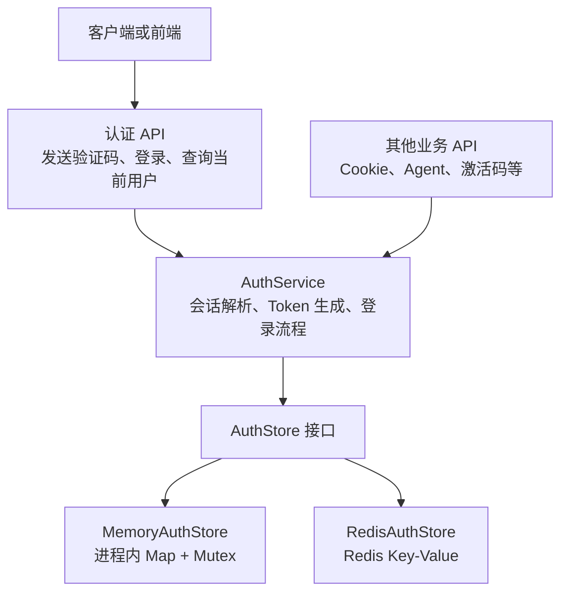

**图表来源**
- [auth.go:617-685](file://goodhr5/cloud/backend/internal/httpapi/auth.go#L617-L685)
- [auth_store.go:11-23](file://goodhr5/cloud/backend/internal/httpapi/auth_store.go#L11-L23)
- [redis_auth_store.go:12-24](file://goodhr5/cloud/backend/internal/httpapi/redis_auth_store.go#L12-L24)

**章节来源**
- [auth.go:1-20](file://goodhr5/cloud/backend/internal/httpapi/auth.go#L1-L20)
- [auth_store.go:1-30](file://goodhr5/cloud/backend/internal/httpapi/auth_store.go#L1-L30)
- [redis_auth_store.go:1-24](file://goodhr5/cloud/backend/internal/httpapi/redis_auth_store.go#L1-L24)

## 核心组件
本节聚焦会话管理的核心对象与方法：
- `AuthService`：封装登录、验证码校验、Token 生成、会话读取、用户信息查询等。
- `AuthStore`：抽象会话与验证码存储，支持内存与 Redis 两种实现。
- `Session`：会话数据模型，包含邮箱、创建时间、过期时间。
- `MemoryAuthStore`：单进程会话存储，使用互斥锁保证并发安全。
- `RedisAuthStore`：分布式会话存储，使用 Redis 键值存储并借助 TTL 自动过期。

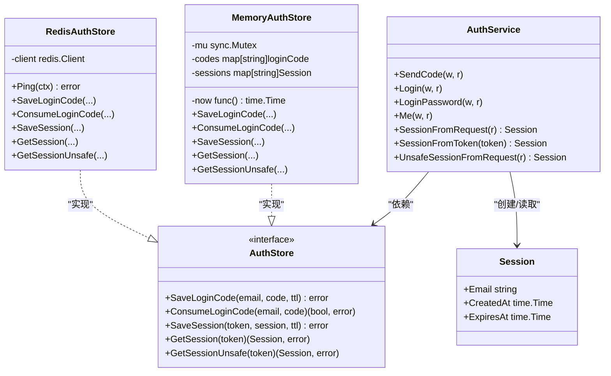

**图表来源**
- [auth.go:22-36](file://goodhr5/cloud/backend/internal/httpapi/auth.go#L22-L36)
- [auth_store.go:11-23](file://goodhr5/cloud/backend/internal/httpapi/auth_store.go#L11-L23)
- [auth_store.go:25-43](file://goodhr5/cloud/backend/internal/httpapi/auth_store.go#L25-L43)
- [redis_auth_store.go:12-24](file://goodhr5/cloud/backend/internal/httpapi/redis_auth_store.go#L12-L24)

**章节来源**
- [auth.go:22-36](file://goodhr5/cloud/backend/internal/httpapi/auth.go#L22-L36)
- [auth_store.go:11-23](file://goodhr5/cloud/backend/internal/httpapi/auth_store.go#L11-L23)
- [redis_auth_store.go:12-24](file://goodhr5/cloud/backend/internal/httpapi/redis_auth_store.go#L12-L24)

## 架构总览
下图展示一次典型登录与会话验证的请求序列：

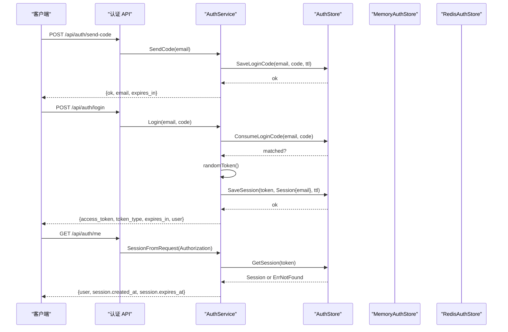

**图表来源**
- [auth.go:93-141](file://goodhr5/cloud/backend/internal/httpapi/auth.go#L93-L141)
- [auth.go:143-236](file://goodhr5/cloud/backend/internal/httpapi/auth.go#L143-L236)
- [auth.go:374-413](file://goodhr5/cloud/backend/internal/httpapi/auth.go#L374-L413)
- [auth_store.go:45-74](file://goodhr5/cloud/backend/internal/httpapi/auth_store.go#L45-L74)
- [redis_auth_store.go:36-57](file://goodhr5/cloud/backend/internal/httpapi/redis_auth_store.go#L36-L57)

**章节来源**
- [auth.go:93-236](file://goodhr5/cloud/backend/internal/httpapi/auth.go#L93-L236)
- [auth.go:374-413](file://goodhr5/cloud/backend/internal/httpapi/auth.go#L374-L413)

## 详细组件分析

### 会话生命周期管理
会话生命周期包括四个阶段：创建、存储、刷新、销毁。

#### 会话创建
- 验证码登录：
  - 生成 4 位数字验证码，保存到存储层，设置短 TTL。
  - 校验验证码通过后，生成访问令牌，保存会话到存储层，设置长 TTL。
  - 返回 `access_token`、`token_type`、`expires_in` 与基础用户信息。
- 密码登录：
  - 校验密码失败次数与锁定状态，成功后同样生成访问令牌并保存会话。
  - 返回结构与验证码登录一致。

关键点：
- 会话 TTL 固定为 30 天。
- 登录成功后会记录登录活动，可能触发新用户试用会员通知与邀请奖励。

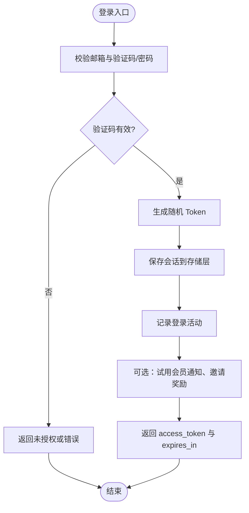

**图表来源**
- [auth.go:93-141](file://goodhr5/cloud/backend/internal/httpapi/auth.go#L93-L141)
- [auth.go:143-236](file://goodhr5/cloud/backend/internal/httpapi/auth.go#L143-L236)
- [auth.go:238-372](file://goodhr5/cloud/backend/internal/httpapi/auth.go#L238-L372)

**章节来源**
- [auth.go:93-236](file://goodhr5/cloud/backend/internal/httpapi/auth.go#L93-L236)
- [auth.go:238-372](file://goodhr5/cloud/backend/internal/httpapi/auth.go#L238-L372)

#### 会话存储
- 内存实现：
  - 使用 `map[string]Session` 存储，`sync.Mutex` 保护读写。
  - 获取会话时检查过期时间，若过期则删除并返回未找到。
- Redis 实现：
  - 使用 Redis Key-Value 存储，Key 格式为 `session:<token>`。
  - 写入时设置 TTL，利用 Redis 过期机制自动清理。
  - 读取时反序列化 JSON 为 `Session`。

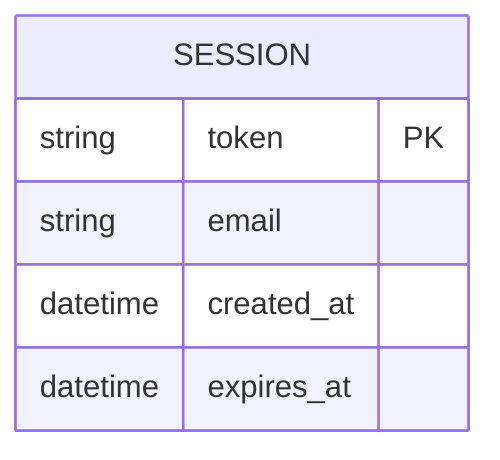

**图表来源**
- [auth_store.go:19-23](file://goodhr5/cloud/backend/internal/httpapi/auth_store.go#L19-L23)
- [redis_auth_store.go:108-110](file://goodhr5/cloud/backend/internal/httpapi/redis_auth_store.go#L108-L110)

**章节来源**
- [auth_store.go:76-98](file://goodhr5/cloud/backend/internal/httpapi/auth_store.go#L76-L98)
- [redis_auth_store.go:59-87](file://goodhr5/cloud/backend/internal/httpapi/redis_auth_store.go#L59-L87)

#### 会话刷新
当前实现中，会话 TTL 在创建时固定为 30 天，未在每次请求时主动刷新过期时间。  
但“查询当前用户”接口会记录登录活动，可用于活跃度统计；若需要滑动过期，可在后续扩展中增加刷新逻辑。

注意：
- 测试用例验证了 `expires_in` 为 30 天。
- 多端登录不会互相踢下线，同一账号多个 Token 可同时有效。

**章节来源**
- [auth_test.go:51-63](file://goodhr5/cloud/backend/internal/httpapi/auth_test.go#L51-L63)
- [auth_test.go:165-188](file://goodhr5/cloud/backend/internal/httpapi/auth_test.go#L165-L188)

#### 会话销毁
- 显式销毁：当前代码未提供显式登出接口，会话主要通过过期失效。
- 隐式销毁：
  - 内存实现：读取时发现过期即删除。
  - Redis 实现：TTL 到期后由 Redis 自动删除。
- 验证码消费：验证码一次性使用后删除，防止重放。

**章节来源**
- [auth_store.go:85-98](file://goodhr5/cloud/backend/internal/httpapi/auth_store.go#L85-L98)
- [redis_auth_store.go:40-57](file://goodhr5/cloud/backend/internal/httpapi/redis_auth_store.go#L40-L57)

### Token 生成算法与安全机制
- 随机数来源：使用加密安全的随机数生成器。
- 长度设计：生成 32 字节随机数，转为十六进制字符串，长度为 64。
- 前缀标识：以 `gh5_` 作为前缀，便于识别系统 Token 类型。
- 安全性：
  - 使用加密安全随机源，避免可预测性。
  - Token 不携带敏感业务数据，仅作为会话索引。
  - 建议配合 HTTPS 传输，防止中间人窃取。

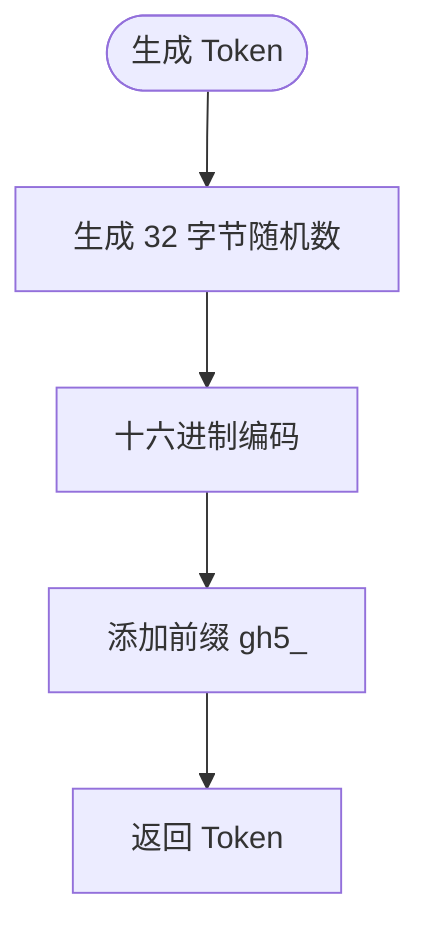

**图表来源**
- [auth.go:671-677](file://goodhr5/cloud/backend/internal/httpapi/auth.go#L671-L677)

**章节来源**
- [auth.go:671-677](file://goodhr5/cloud/backend/internal/httpapi/auth.go#L671-L677)

### 会话存储策略
- 内存存储：
  - 适用场景：单机开发、测试、轻量部署。
  - 并发安全：使用互斥锁保护 Map 读写。
  - 过期处理：读取时检查 `ExpiresAt`，过期即删除。
- Redis 存储：
  - 适用场景：多实例部署、分布式环境。
  - 键命名：
    - 会话键：`session:<token>`
    - 验证码键：`login_code:<email>`
  - 过期处理：写入时设置 TTL，Redis 自动清理。
  - 序列化：JSON 编码 `Session` 结构体。

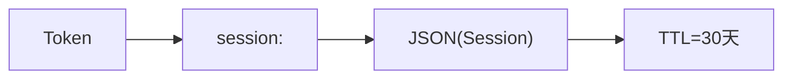

**图表来源**
- [redis_auth_store.go:104-114](file://goodhr5/cloud/backend/internal/httpapi/redis_auth_store.go#L104-L114)
- [redis_auth_store.go:59-70](file://goodhr5/cloud/backend/internal/httpapi/redis_auth_store.go#L59-L70)

**章节来源**
- [auth_store.go:25-43](file://goodhr5/cloud/backend/internal/httpapi/auth_store.go#L25-L43)
- [redis_auth_store.go:12-24](file://goodhr5/cloud/backend/internal/httpapi/redis_auth_store.go#L12-L24)
- [redis_auth_store.go:59-87](file://goodhr5/cloud/backend/internal/httpapi/redis_auth_store.go#L59-L87)

### 会话验证实现细节
- 从 HTTP 请求提取 Token：
  - 从 `Authorization` 头中提取 `Bearer <token>`。
  - 若缺少前缀或为空，返回未授权。
- 验证会话有效性：
  - 调用 `SessionFromToken`，通过 `AuthStore.GetSession` 读取会话。
  - 若未找到或已过期，返回未授权。
- 处理过期会话：
  - 内存实现：读取时删除过期会话。
  - Redis 实现：TTL 到期后键不存在，视为未找到。
- 非授权接口复用：
  - Cookie 服务、Agent 服务、激活码服务等均通过 `SessionFromRequest` 获取当前会话。

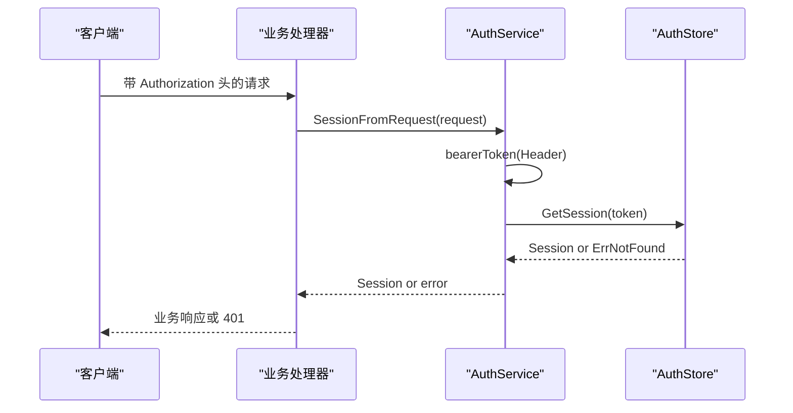

**图表来源**
- [auth.go:617-635](file://goodhr5/cloud/backend/internal/httpapi/auth.go#L617-L635)
- [cookie.go:29-41](file://goodhr5/cloud/backend/internal/httpapi/cookie.go#L29-L41)
- [agent.go:151-162](file://goodhr5/cloud/backend/internal/httpapi/agent.go#L151-L162)
- [activation_code.go:66-71](file://goodhr5/cloud/backend/internal/httpapi/activation_code.go#L66-L71)

**章节来源**
- [auth.go:617-635](file://goodhr5/cloud/backend/internal/httpapi/auth.go#L617-L635)
- [cookie.go:29-41](file://goodhr5/cloud/backend/internal/httpapi/cookie.go#L29-L41)
- [agent.go:151-162](file://goodhr5/cloud/backend/internal/httpapi/agent.go#L151-L162)
- [activation_code.go:66-71](file://goodhr5/cloud/backend/internal/httpapi/activation_code.go#L66-L71)

### 并发安全考虑
- 进程内并发：
  - `MemoryAuthStore` 使用 `sync.Mutex` 保护 Map 读写，避免竞态条件。
  - 验证码消费与删除操作在同一锁内完成，防止重复消费。
- 分布式环境：
  - `RedisAuthStore` 依赖 Redis 原子操作，如 `Set` 带 TTL、`Get`、`Del`。
  - 验证码消费采用先读后删模式，需注意极端情况下重试导致的幂等问题；当前实现简单直接，适用于低竞争场景。
- 多端登录：
  - 同一账号多次登录会生成多个 Token，彼此独立，不会互相踢下线。
  - 测试覆盖了多用户 Token 隔离与同账号多 Token 共存。

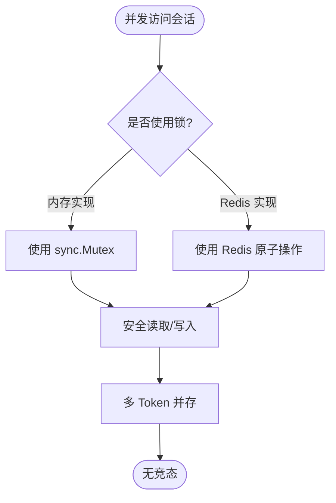

**图表来源**
- [auth_store.go:25-43](file://goodhr5/cloud/backend/internal/httpapi/auth_store.go#L25-L43)
- [auth_store.go:76-98](file://goodhr5/cloud/backend/internal/httpapi/auth_store.go#L76-L98)
- [redis_auth_store.go:40-57](file://goodhr5/cloud/backend/internal/httpapi/redis_auth_store.go#L40-L57)
- [auth_test.go:165-188](file://goodhr5/cloud/backend/internal/httpapi/auth_test.go#L165-L188)

**章节来源**
- [auth_store.go:25-43](file://goodhr5/cloud/backend/internal/httpapi/auth_store.go#L25-L43)
- [redis_auth_store.go:40-57](file://goodhr5/cloud/backend/internal/httpapi/redis_auth_store.go#L40-L57)
- [auth_test.go:165-188](file://goodhr5/cloud/backend/internal/httpapi/auth_test.go#L165-L188)

## 依赖关系分析
- `AuthService` 依赖 `AuthStore` 接口，解耦具体存储实现。
- `MemoryAuthStore` 与 `RedisAuthStore` 均实现 `AuthStore`，可替换。
- 其他业务模块（Cookie、Agent、激活码）通过 `AuthService.SessionFromRequest` 获取会话，避免重复解析 Token。
- 测试文件覆盖登录、多端登录、过期时间、万能验证码等关键路径。

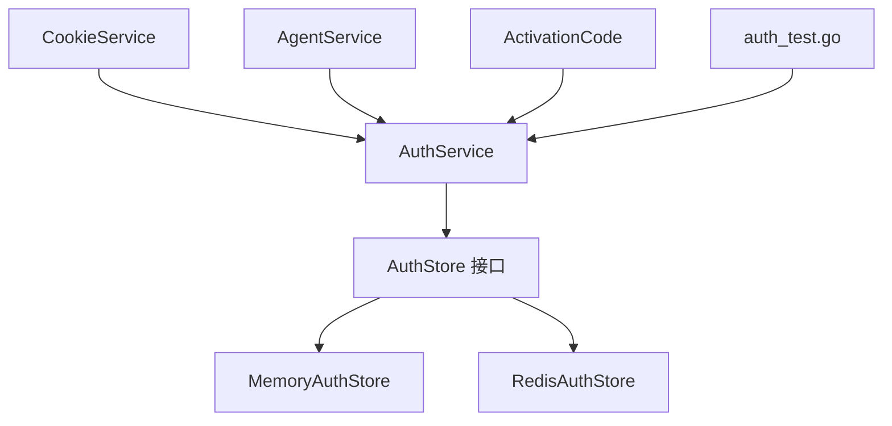

**图表来源**
- [auth.go:22-36](file://goodhr5/cloud/backend/internal/httpapi/auth.go#L22-L36)
- [auth_store.go:11-17](file://goodhr5/cloud/backend/internal/httpapi/auth_store.go#L11-L17)
- [cookie.go:15-27](file://goodhr5/cloud/backend/internal/httpapi/cookie.go#L15-L27)
- [agent.go:151-162](file://goodhr5/cloud/backend/internal/httpapi/agent.go#L151-L162)
- [activation_code.go:66-71](file://goodhr5/cloud/backend/internal/httpapi/activation_code.go#L66-L71)

**章节来源**
- [auth.go:22-36](file://goodhr5/cloud/backend/internal/httpapi/auth.go#L22-L36)
- [auth_store.go:11-17](file://goodhr5/cloud/backend/internal/httpapi/auth_store.go#L11-L17)

## 性能与并发安全
- 性能特性：
  - 内存实现：O(1) 查找，适合单机低延迟场景。
  - Redis 实现：网络 IO 开销，但支持水平扩展与自动过期。
- 并发安全：
  - 内存实现通过互斥锁保证线程安全。
  - Redis 实现依赖底层原子操作，避免分布式竞态。
- 优化建议：
  - 若需滑动过期，可增加“最近活跃时间”字段并在高频请求中刷新 TTL。
  - 对验证码消费可引入 Lua 脚本保证原子性，避免高并发下重复消费。
  - 对 Token 生成可考虑结合设备指纹或 IP 白名单增强安全性。

[本节为通用指导，不直接分析具体文件]

## 监控、统计与清理机制
- 登录活动记录：
  - 登录成功与查询当前用户时会记录登录活动，可用于活跃度统计。
- 过期会话清理：
  - 内存实现：读取时删除过期会话。
  - Redis 实现：TTL 到期自动清理。
- 活跃会话统计：
  - 可通过 Redis 扫描 `session:*` 键或使用有序集合维护活跃会话列表。
  - 当前代码未提供直接统计接口，可扩展 `AuthService` 或新增监控服务。

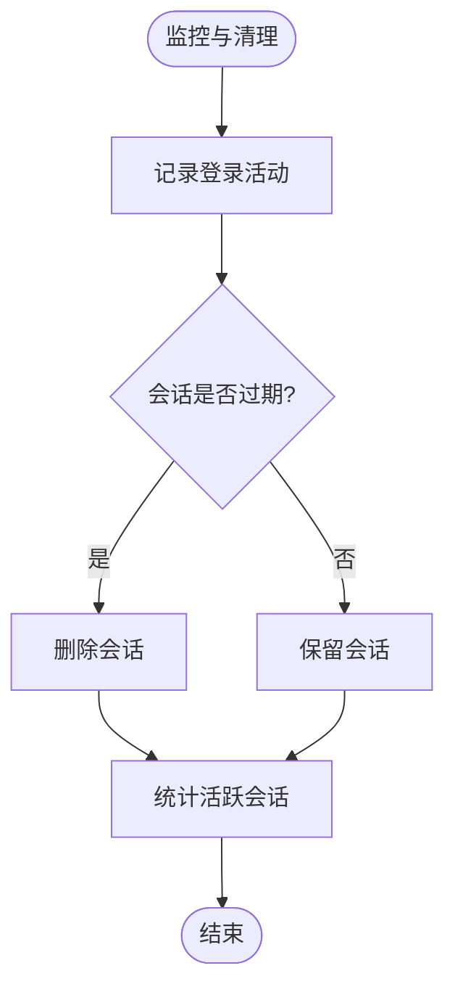

**图表来源**
- [auth.go:374-413](file://goodhr5/cloud/backend/internal/httpapi/auth.go#L374-L413)
- [auth_store.go:85-98](file://goodhr5/cloud/backend/internal/httpapi/auth_store.go#L85-L98)
- [redis_auth_store.go:59-70](file://goodhr5/cloud/backend/internal/httpapi/redis_auth_store.go#L59-L70)

**章节来源**
- [auth.go:374-413](file://goodhr5/cloud/backend/internal/httpapi/auth.go#L374-L413)
- [auth_store.go:85-98](file://goodhr5/cloud/backend/internal/httpapi/auth_store.go#L85-L98)
- [redis_auth_store.go:59-70](file://goodhr5/cloud/backend/internal/httpapi/redis_auth_store.go#L59-L70)

## 故障排查指南
常见问题与排查步骤：
- 无法登录：
  - 检查邮箱域名是否在白名单内。
  - 检查验证码是否正确且未过期。
  - 检查密码登录失败次数是否被锁定。
- 会话无效或过期：
  - 检查 `Authorization` 头是否携带正确的 `Bearer` Token。
  - 检查存储层是否可用（内存 Map 或 Redis）。
  - 检查会话是否已过期或被删除。
- 多端登录异常：
  - 确认是否期望多端共存；当前实现允许多 Token 并存。
- 验证码重放：
  - 验证码一次性使用后删除，若出现重放，检查存储层一致性。

**章节来源**
- [auth.go:105-113](file://goodhr5/cloud/backend/internal/httpapi/auth.go#L105-L113)
- [auth.go:161-186](file://goodhr5/cloud/backend/internal/httpapi/auth.go#L161-L186)
- [auth.go:263-304](file://goodhr5/cloud/backend/internal/httpapi/auth.go#L263-L304)
- [auth.go:617-635](file://goodhr5/cloud/backend/internal/httpapi/auth.go#L617-L635)
- [redis_auth_store.go:40-57](file://goodhr5/cloud/backend/internal/httpapi/redis_auth_store.go#L40-L57)

## 结论
GoodHR 的会话管理系统以 `AuthService` 为核心，通过 `AuthStore` 接口抽象存储实现，支持内存与 Redis 两种模式。Token 生成使用加密安全随机数并带有明确前缀，会话 TTL 固定为 30 天，支持多端登录且不互相踢下线。会话验证通过 `Authorization` 头提取 Bearer Token，校验有效性后返回用户信息。并发安全方面，内存实现使用互斥锁，Redis 实现依赖原子操作。监控与清理机制通过登录活动记录与 TTL 自动过期实现，未来可扩展滑动过期与活跃会话统计。

[本节为总结性内容，不直接分析具体文件]