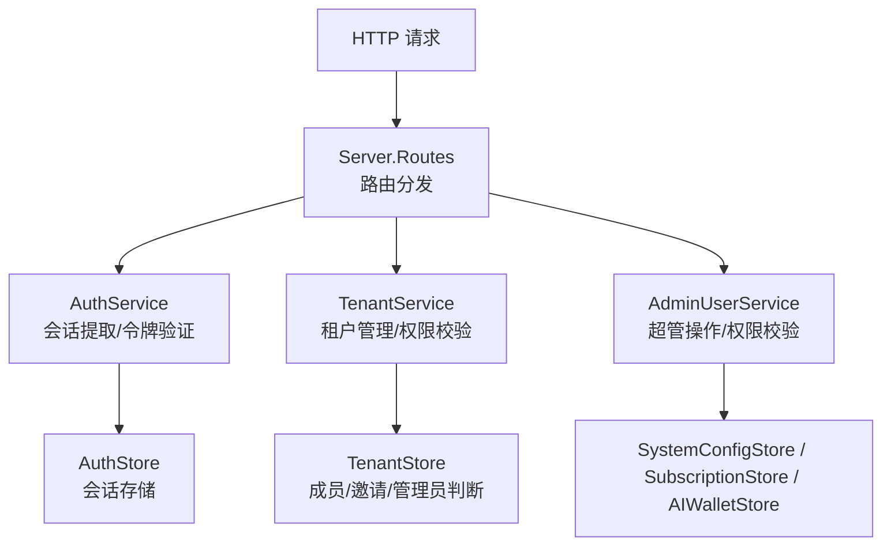
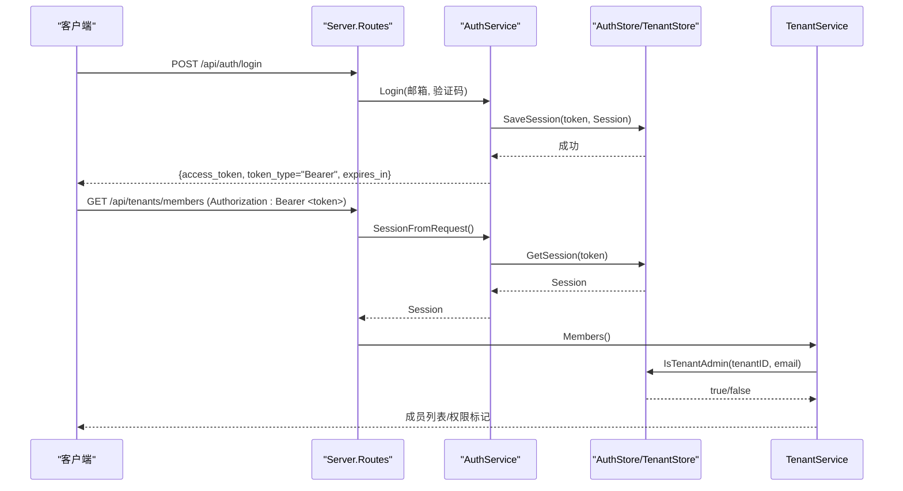
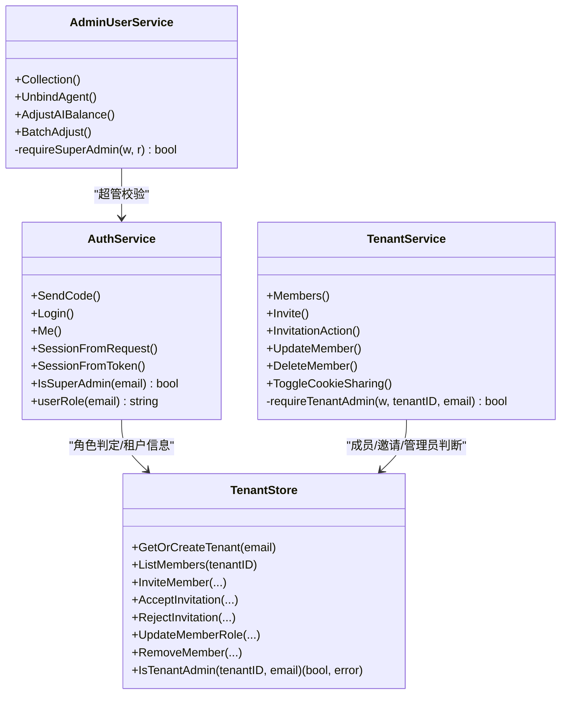
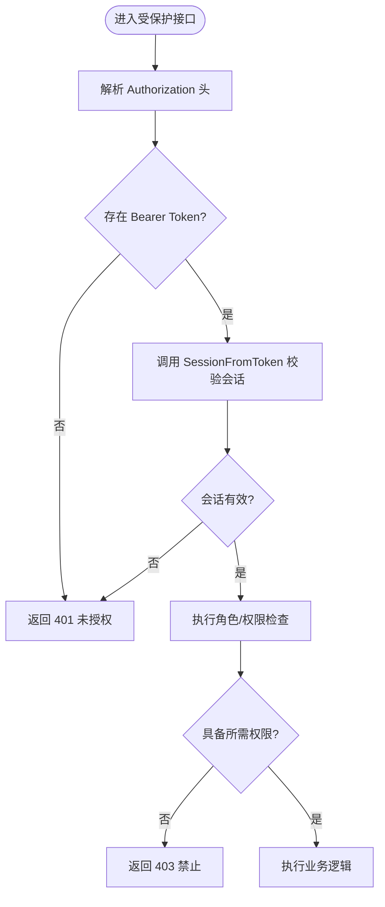
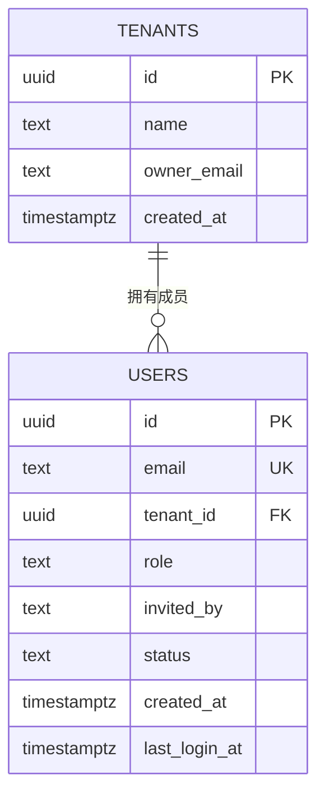
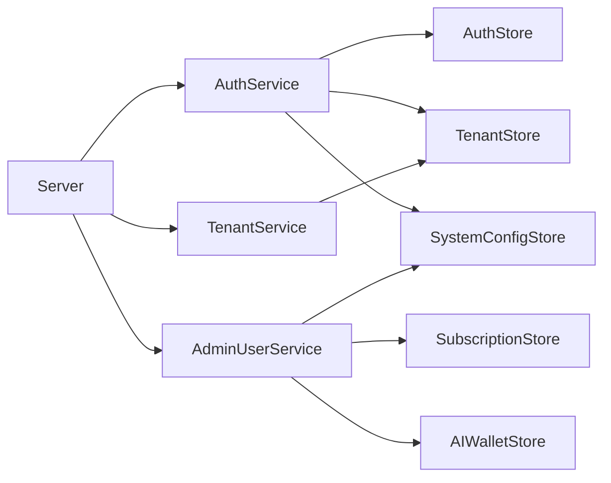

# 权限控制系统

<cite>
**本文引用的文件**
- [auth.go](file://goodhr5/cloud/backend/internal/httpapi/auth.go)
- [tenant.go](file://goodhr5/cloud/backend/internal/httpapi/tenant.go)
- [tenant_store.go](file://goodhr5/cloud/backend/internal/httpapi/tenant_store.go)
- [admin_user.go](file://goodhr5/cloud/backend/internal/httpapi/admin_user.go)
- [server.go](file://goodhr5/cloud/backend/internal/httpapi/server.go)
- [0004_tenants.sql](file://goodhr5/cloud/backend/db/migrations/0004_tenants.sql)
</cite>

## 目录
1. [简介](#简介)
2. [项目结构](#项目结构)
3. [核心组件](#核心组件)
4. [架构总览](#架构总览)
5. [详细组件分析](#详细组件分析)
6. [依赖关系分析](#依赖关系分析)
7. [性能与扩展性](#性能与扩展性)
8. [故障排查指南](#故障排查指南)
9. [结论](#结论)
10. [附录：API 使用示例](#附录api-使用示例)

## 简介
本系统提供基于令牌的认证、角色与权限控制、以及租户隔离能力。角色体系包含三类：超管理员、租户管理员、普通成员；认证机制采用 Bearer Token，通过会话存储校验登录态；权限检查在业务接口内以“显式鉴权”的方式实现（如要求当前用户为租户管理员或超管理员）。租户隔离通过数据库中的租户表与用户关联字段实现，不同租户的数据按租户 ID 进行隔离查询。

## 项目结构
后端服务位于 cloud/backend/internal/httpapi 下，关键文件职责如下：
- auth.go：认证与会话、令牌签发与解析、角色判定、邮箱白名单等。
- tenant.go：租户管理 API（邀请、成员列表、角色调整、Cookie 共享开关等），内置租户管理员权限校验。
- tenant_store.go：租户数据模型与存储接口（内存与 PostgreSQL 两种实现），负责成员、邀请、管理员判断、Cookie 共享配置等。
- admin_user.go：超级管理员专用接口（用户列表、批量调整会员天数/AI 余额、解绑设备等），强制超管鉴权。
- server.go：路由注册与服务组装，统一错误响应、CORS、系统配置读取等。
- 0004_tenants.sql：租户相关数据库迁移，定义 tenants 表及 users 表的租户与角色字段。

图表来源
- [server.go:124-211](file://goodhr5/cloud/backend/internal/httpapi/server.go#L124-L211)
- [auth.go:452-470](file://goodhr5/cloud/backend/internal/httpapi/auth.go#L452-L470)
- [tenant.go:35-125](file://goodhr5/cloud/backend/internal/httpapi/tenant.go#L35-L125)
- [admin_user.go:130-149](file://goodhr5/cloud/backend/internal/httpapi/admin_user.go#L130-L149)

章节来源
- [server.go:124-211](file://goodhr5/cloud/backend/internal/httpapi/server.go#L124-L211)

## 核心组件
- 认证与会话
  - 登录流程：验证码校验通过后生成随机访问令牌，保存会话并返回 Bearer Token。
  - 会话提取：从 Authorization 头中解析 Bearer Token，调用会话存储获取会话信息。
  - 角色判定：根据是否为超管、是否租户管理员，返回 super_admin/admin/user 三种角色。
- 租户管理
  - 成员与邀请：支持邀请成员、接受/拒绝邀请、重发邀请、修改成员角色、移除成员。
  - 管理员校验：所有敏感操作均要求当前用户为租户管理员。
- 超级管理员
  - 仅允许超管访问的接口：用户列表、批量调整会员天数与 AI 余额、解绑设备、系统配置管理等。
- 数据存储
  - 租户与成员：内存与 PostgreSQL 双实现，PostgreSQL 通过 tenants/users 表实现多租户数据隔离。

章节来源
- [auth.go:121-214](file://goodhr5/cloud/backend/internal/httpapi/auth.go#L121-L214)
- [auth.go:452-564](file://goodhr5/cloud/backend/internal/httpapi/auth.go#L452-L564)
- [tenant.go:35-377](file://goodhr5/cloud/backend/internal/httpapi/tenant.go#L35-L377)
- [admin_user.go:130-411](file://goodhr5/cloud/backend/internal/httpapi/admin_user.go#L130-L411)
- [tenant_store.go:14-70](file://goodhr5/cloud/backend/internal/httpapi/tenant_store.go#L14-L70)

## 架构总览
整体采用“服务层 + 存储层”的分层设计：
- HTTP 路由层：统一注册接口、CORS、错误响应格式。
- 服务层：认证服务、租户服务、管理员服务等，封装业务逻辑与权限校验。
- 存储层：AuthStore、TenantStore、SystemConfigStore 等接口，提供内存与数据库实现。

图表来源
- [auth.go:121-214](file://goodhr5/cloud/backend/internal/httpapi/auth.go#L121-L214)
- [auth.go:452-470](file://goodhr5/cloud/backend/internal/httpapi/auth.go#L452-L470)
- [tenant.go:35-65](file://goodhr5/cloud/backend/internal/httpapi/tenant.go#L35-L65)
- [tenant_store.go:197-206](file://goodhr5/cloud/backend/internal/httpapi/tenant_store.go#L197-L206)

## 详细组件分析

### 角色体系与权限划分
- 超管理员（super_admin）
  - 由配置注入的超管邮箱集合决定，用于全局管理与系统配置。
  - 权限范围：用户管理、批量调整、系统配置读写、平台配置管理等。
- 租户管理员（admin）
  - 属于某个租户的管理员，可管理该租户的成员与邀请。
  - 权限范围：邀请成员、查看成员、修改成员角色、移除成员、切换 Cookie 共享开关等。
- 普通成员（user）
  - 租户内的普通成员，具备基础业务操作权限，但不具备租户管理权限。

图表来源
- [auth.go:452-564](file://goodhr5/cloud/backend/internal/httpapi/auth.go#L452-L564)
- [tenant.go:35-377](file://goodhr5/cloud/backend/internal/httpapi/tenant.go#L35-L377)
- [admin_user.go:130-411](file://goodhr5/cloud/backend/internal/httpapi/admin_user.go#L130-L411)
- [tenant_store.go:55-70](file://goodhr5/cloud/backend/internal/httpapi/tenant_store.go#L55-L70)

章节来源
- [auth.go:522-564](file://goodhr5/cloud/backend/internal/httpapi/auth.go#L522-L564)
- [tenant.go:367-377](file://goodhr5/cloud/backend/internal/httpapi/tenant.go#L367-L377)
- [admin_user.go:399-411](file://goodhr5/cloud/backend/internal/httpapi/admin_user.go#L399-L411)

### 基于令牌的认证机制
- 登录与令牌签发
  - 验证码校验成功后生成随机令牌，保存会话并返回 access_token 与 token_type="Bearer"。
- 会话提取与校验
  - 从 Authorization 头解析 Bearer Token，调用会话存储获取会话，若不存在或过期则返回未授权。
- 权限检查中间件
  - 当前实现未在路由层统一挂载中间件，而是在各服务方法内部进行显式鉴权（如 requireTenantAdmin、requireSuperAdmin）。
  - 优点：细粒度控制、易于理解；缺点：需在各接口重复编写鉴权逻辑。

图表来源
- [auth.go:452-470](file://goodhr5/cloud/backend/internal/httpapi/auth.go#L452-L470)
- [tenant.go:358-377](file://goodhr5/cloud/backend/internal/httpapi/tenant.go#L358-L377)
- [admin_user.go:399-411](file://goodhr5/cloud/backend/internal/httpapi/admin_user.go#L399-L411)

章节来源
- [auth.go:121-214](file://goodhr5/cloud/backend/internal/httpapi/auth.go#L121-L214)
- [auth.go:452-520](file://goodhr5/cloud/backend/internal/httpapi/auth.go#L452-L520)

### 租户隔离实现
- 数据模型
  - tenants 表：记录租户基本信息与创建者邮箱。
  - users 表：增加 tenant_id、role、invited_by、status 等字段，标识用户所属租户与角色。
- 隔离策略
  - 所有租户相关查询通过 tenant_id 过滤，确保不同租户数据互不可见。
  - 成员列表、邀请、管理员判断等均基于 tenant_id 进行。
- 迁移脚本
  - 0004_tenants.sql 定义了 tenants 表与 users 表变更，建立索引以提升查询性能。

图表来源
- [0004_tenants.sql:1-20](file://goodhr5/cloud/backend/db/migrations/0004_tenants.sql#L1-L20)

章节来源
- [tenant_store.go:218-250](file://goodhr5/cloud/backend/internal/httpapi/tenant_store.go#L218-L250)
- [tenant_store.go:252-297](file://goodhr5/cloud/backend/internal/httpapi/tenant_store.go#L252-L297)
- [tenant_store.go:358-365](file://goodhr5/cloud/backend/internal/httpapi/tenant_store.go#L358-L365)
- [0004_tenants.sql:1-20](file://goodhr5/cloud/backend/db/migrations/0004_tenants.sql#L1-L20)

### 权限检查的 API 使用示例
- 获取团队成员（仅管理员可访问）
  - 请求：GET /api/tenants/members，携带 Authorization: Bearer <token>
  - 响应：包含 members、today_greeted_count、can_manage、tenant 等信息
- 邀请成员加入团队（仅管理员可操作）
  - 请求：POST /api/tenants/invite，Body: {email, role}
  - 响应：invitation、resent 标志
- 修改成员角色（仅管理员可操作）
  - 请求：PUT /api/tenants/members/{email}，Body: {role}
  - 响应：ok=true
- 移除成员（仅管理员可操作）
  - 请求：DELETE /api/tenants/members/{email}
  - 响应：ok=true
- 切换 Cookie 共享开关（仅管理员可操作）
  - 请求：POST /api/tenants/cookie-sharing，Body: {enabled}
  - 响应：ok=true, enabled

章节来源
- [tenant.go:35-65](file://goodhr5/cloud/backend/internal/httpapi/tenant.go#L35-L65)
- [tenant.go:67-125](file://goodhr5/cloud/backend/internal/httpapi/tenant.go#L67-L125)
- [tenant.go:234-271](file://goodhr5/cloud/backend/internal/httpapi/tenant.go#L234-L271)
- [tenant.go:299-330](file://goodhr5/cloud/backend/internal/httpapi/tenant.go#L299-L330)
- [tenant.go:273-297](file://goodhr5/cloud/backend/internal/httpapi/tenant.go#L273-L297)

### 超级管理员的特殊权限与系统配置访问控制
- 用户列表与统计
  - 仅超管可访问，返回分页用户列表与统计数据。
- 批量调整会员天数与 AI 余额
  - 支持对指定用户或全部用户进行批量调整，并发送通知邮件。
- 解绑设备
  - 解除用户设备绑定，释放占用。
- 系统配置管理
  - 读取与更新系统配置（平台配置、应用配置等），需超管鉴权。

章节来源
- [admin_user.go:130-189](file://goodhr5/cloud/backend/internal/httpapi/admin_user.go#L130-L189)
- [admin_user.go:229-317](file://goodhr5/cloud/backend/internal/httpapi/admin_user.go#L229-L317)
- [admin_user.go:319-397](file://goodhr5/cloud/backend/internal/httpapi/admin_user.go#L319-L397)
- [server.go:394-544](file://goodhr5/cloud/backend/internal/httpapi/server.go#L394-L544)

### 权限继承与角色提升
- 角色继承
  - 普通成员不具备租户管理权限；租户管理员具备租户内管理权限；超管理员具备全局权限。
- 角色提升
  - 租户管理员可通过 UpdateMember 接口将成员角色提升为管理员（非所有者）。
  - 移除成员时，若被移除的是普通成员，会为其创建个人租户并自动成为该个人租户的管理员。
- 限制与保护
  - 团队所有者不能被修改或移出，防止权限丢失。
  - 成员状态必须为 active 且角色为 admin 才被视为租户管理员。

章节来源
- [tenant_store.go:161-175](file://goodhr5/cloud/backend/internal/httpapi/tenant_store.go#L161-L175)
- [tenant_store.go:177-195](file://goodhr5/cloud/backend/internal/httpapi/tenant_store.go#L177-L195)
- [tenant_store.go:197-206](file://goodhr5/cloud/backend/internal/httpapi/tenant_store.go#L197-L206)
- [tenant_store.go:299-317](file://goodhr5/cloud/backend/internal/httpapi/tenant_store.go#L299-L317)
- [tenant_store.go:319-356](file://goodhr5/cloud/backend/internal/httpapi/tenant_store.go#L319-L356)

## 依赖关系分析
- 服务间依赖
  - Server 组装各服务实例，注入依赖（认证、租户、订阅、系统配置、AI 钱包等）。
  - AuthService 依赖 AuthStore、TenantStore、SystemConfigStore 等。
  - TenantService 依赖 AuthService 与 TenantStore。
  - AdminUserService 依赖 AuthService 与多个存储接口。
- 外部依赖
  - PostgreSQL 用于持久化租户、成员、用户等数据。
  - Redis（可选）用于会话存储（通过配置注入）。
  - 邮件服务用于发送邀请、通知等。

图表来源
- [server.go:46-121](file://goodhr5/cloud/backend/internal/httpapi/server.go#L46-L121)
- [auth.go:21-69](file://goodhr5/cloud/backend/internal/httpapi/auth.go#L21-L69)
- [tenant.go:14-23](file://goodhr5/cloud/backend/internal/httpapi/tenant.go#L14-L23)
- [admin_user.go:114-127](file://goodhr5/cloud/backend/internal/httpapi/admin_user.go#L114-L127)

章节来源
- [server.go:46-121](file://goodhr5/cloud/backend/internal/httpapi/server.go#L46-L121)

## 性能与扩展性
- 性能考虑
  - 会话存储建议使用 Redis 以降低延迟（通过配置注入）。
  - 租户成员列表查询使用 JOIN 与聚合，注意索引优化（users.tenant_id）。
  - 批量调整接口应限制并发与频率，避免对订阅与 AI 钱包造成压力。
- 扩展性建议
  - 引入统一的权限中间件，减少重复鉴权代码。
  - 扩展角色体系时，可在 AuthService.userRole 中新增分支，并在各服务中复用。
  - 对于高并发场景，考虑缓存租户管理员状态与系统配置。

[本节为通用指导，不直接分析具体文件]

## 故障排查指南
- 未授权（401）
  - 检查 Authorization 头是否正确携带 Bearer Token。
  - 确认会话是否有效或已过期。
- 禁止访问（403）
  - 检查当前用户是否为租户管理员或超管理员。
  - 确认操作是否超出角色权限范围。
- 数据找不到（404）
  - 检查邀请 ID 或成员邮箱是否存在。
  - 确认租户 ID 是否正确。
- 冲突（409）
  - 尝试修改或删除团队所有者会被拒绝。
  - 成员已在团队中或存在待处理邀请时会报错。

章节来源
- [tenant.go:346-356](file://goodhr5/cloud/backend/internal/httpapi/tenant.go#L346-L356)
- [auth.go:216-255](file://goodhr5/cloud/backend/internal/httpapi/auth.go#L216-L255)
- [admin_user.go:399-411](file://goodhr5/cloud/backend/internal/httpapi/admin_user.go#L399-L411)

## 结论
本权限控制系统通过清晰的三层角色体系、基于令牌的认证机制、以及严格的租户隔离策略，实现了安全可控的多租户环境。超管理员具备全局管理能力，租户管理员负责团队内部协作，普通成员享有基础业务权限。建议在后续版本中引入统一权限中间件与更丰富的角色扩展点，以提升可维护性与扩展性。

[本节为总结，不直接分析具体文件]

## 附录：API 使用示例
- 登录获取令牌
  - 请求：POST /api/auth/send-code（发送验证码）、POST /api/auth/login（提交验证码）
  - 响应：{access_token, token_type="Bearer", expires_in}
- 获取当前用户信息
  - 请求：GET /api/auth/me（携带 Authorization: Bearer <token>）
  - 响应：{user, session, show_trial_welcome}
- 查看团队成员
  - 请求：GET /api/tenants/members（携带 Authorization: Bearer <token>）
  - 响应：{members, today_greeted_count, can_manage, tenant}
- 邀请成员
  - 请求：POST /api/tenants/invite（携带 Authorization: Bearer <token>）
  - Body：{email, role}
  - 响应：{invitation, resent}
- 修改成员角色
  - 请求：PUT /api/tenants/members/{email}（携带 Authorization: Bearer <token>）
  - Body：{role}
  - 响应：{ok: true}
- 移除成员
  - 请求：DELETE /api/tenants/members/{email}（携带 Authorization: Bearer <token>）
  - 响应：{ok: true}
- 切换 Cookie 共享
  - 请求：POST /api/tenants/cookie-sharing（携带 Authorization: Bearer <token>）
  - Body：{enabled}
  - 响应：{ok: true, enabled}

章节来源
- [auth.go:71-214](file://goodhr5/cloud/backend/internal/httpapi/auth.go#L71-L214)
- [auth.go:216-255](file://goodhr5/cloud/backend/internal/httpapi/auth.go#L216-L255)
- [tenant.go:35-125](file://goodhr5/cloud/backend/internal/httpapi/tenant.go#L35-L125)
- [tenant.go:234-330](file://goodhr5/cloud/backend/internal/httpapi/tenant.go#L234-L330)