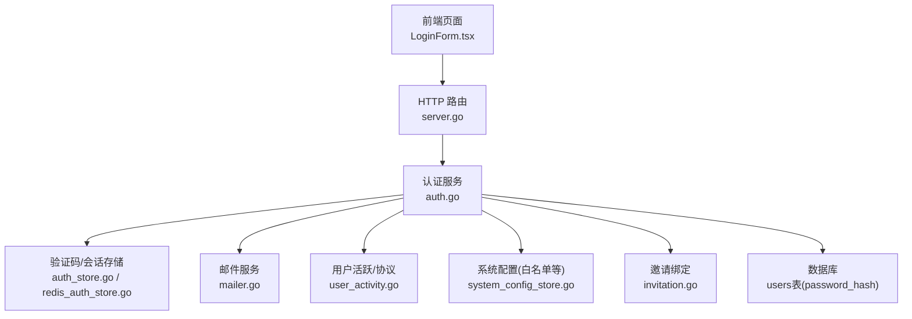
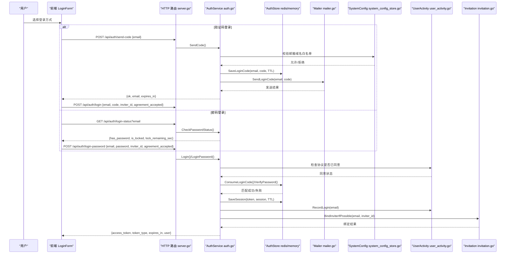
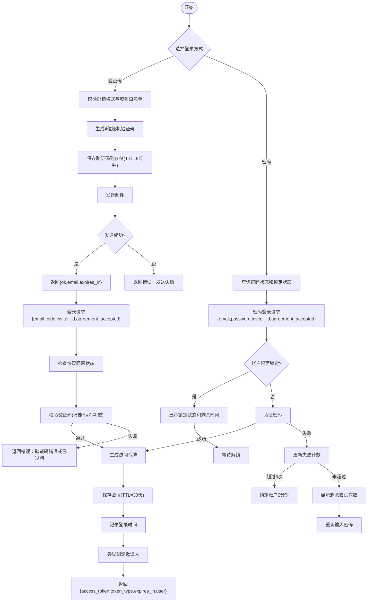
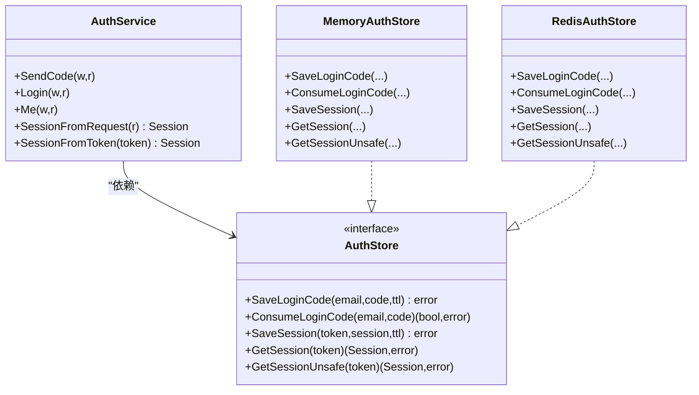
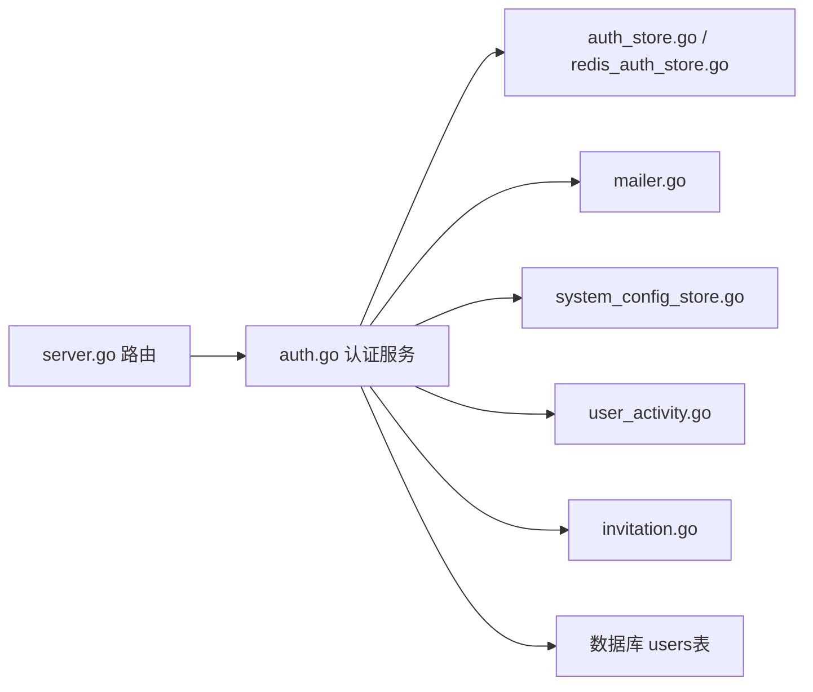

# 用户注册登录

<cite>
**本文引用的文件**
- [auth.go](file://goodhr5/cloud/backend/internal/httpapi/auth.go)
- [auth_store.go](file://goodhr5/cloud/backend/internal/httpapi/auth_store.go)
- [redis_auth_store.go](file://goodhr5/cloud/backend/internal/httpapi/redis_auth_store.go)
- [server.go](file://goodhr5/cloud/backend/internal/httpapi/server.go)
- [invitation.go](file://goodhr5/cloud/backend/internal/httpapi/invitation.go)
- [mailer.go](file://goodhr5/cloud/backend/internal/httpapi/mailer.go)
- [user_activity.go](file://goodhr5/cloud/backend/internal/httpapi/user_activity.go)
- [system_config_store.go](file://goodhr5/cloud/backend/internal/httpapi/system_config_store.go)
- [LoginForm.tsx](file://goodhr5/cloud/frontend-next/components/LoginForm.tsx)
- [0076_user_password_hash.sql](file://goodhr5/cloud/backend/db/migrations/0076_user_password_hash.sql)
</cite>

## 更新摘要
**变更内容**
- 新增密码认证系统，支持 bcrypt 哈希存储和验证
- 添加标签式登录界面，支持验证码登录和密码登录两种方式
- 实现账户锁定机制，3次失败尝试后锁定5分钟
- 增强用户体验，提供现代化UI设计和更好的交互流程
- 新增密码设置功能，通过邮箱验证码验证后设置密码

## 目录
1. [简介](#简介)
2. [项目结构](#项目结构)
3. [核心组件](#核心组件)
4. [架构总览](#架构总览)
5. [详细组件分析](#详细组件分析)
6. [依赖关系分析](#依赖关系分析)
7. [性能与安全考虑](#性能与安全考虑)
8. [故障排查指南](#故障排查指南)
9. [结论](#结论)
10. [附录：API 接口规范](#附录api-接口规范)

## 简介
本文件面向"用户注册登录"能力，覆盖邮箱验证码登录、密码登录双模式、会话管理（令牌生成、存储与校验）、邮箱白名单验证、协议同意检查、邀请绑定等完整业务流程。系统现已支持两种登录方式：传统的邮箱验证码登录和新增的密码登录，后者采用 bcrypt 哈希存储确保密码安全。登录成功后颁发短期访问令牌，用于后续鉴权与会话维持。

## 项目结构
后端以 Go 实现 HTTP API，核心在 httpapi 包中；前端使用 Next.js 提供现代化的标签式登录界面与统一请求封装。关键文件职责如下：
- 认证服务与路由：auth.go、server.go
- 验证码与会话存储：auth_store.go、redis_auth_store.go
- 邮件发送：mailer.go
- 协议与活跃记录：user_activity.go
- 系统配置（含邮箱白名单）：system_config_store.go
- 邀请绑定：invitation.go
- 前端登录表单与请求封装：LoginForm.tsx
- 数据库迁移：0076_user_password_hash.sql

**图表来源**
- [server.go:124-133](file://goodhr5/cloud/backend/internal/httpapi/server.go#L124-L133)
- [auth.go:21-69](file://goodhr5/cloud/backend/internal/httpapi/auth.go#L21-L69)
- [auth_store.go:11-17](file://goodhr5/cloud/backend/internal/httpapi/auth_store.go#L11-L17)
- [redis_auth_store.go:36-87](file://goodhr5/cloud/backend/internal/httpapi/redis_auth_store.go#L36-L87)
- [mailer.go:112-119](file://goodhr5/cloud/backend/internal/httpapi/mailer.go#L112-L119)
- [user_activity.go:12-23](file://goodhr5/cloud/backend/internal/httpapi/user_activity.go#L12-L23)
- [system_config_store.go:46-85](file://goodhr5/cloud/backend/internal/httpapi/system_config_store.go#L46-L85)
- [invitation.go:31-41](file://goodhr5/cloud/backend/internal/httpapi/invitation.go#L31-L41)
- [0076_user_password_hash.sql:1-7](file://goodhr5/cloud/backend/db/migrations/0076_user_password_hash.sql#L1-L7)

**章节来源**
- [server.go:124-133](file://goodhr5/cloud/backend/internal/httpapi/server.go#L124-L133)
- [auth.go:21-69](file://goodhr5/cloud/backend/internal/httpapi/auth.go#L21-L69)

## 核心组件
- 认证服务 AuthService：负责验证码发送、登录校验、会话创建、协议检查、邀请绑定、角色判定等。
- 存储抽象 AuthStore：定义验证码与会话的保存、消费与读取接口；提供内存与 Redis 两种实现。
- 邮件服务 Mailer：发送登录验证码及会员变动通知等邮件。
- 用户活跃 UserActivityStore：记录登录时间、协议同意状态、试用欢迎弹窗确认等。
- 系统配置 SystemConfigStore：提供邮箱白名单等运行时配置。
- 邀请服务 InvitationService：首次登录时绑定邀请人并触发奖励。
- 前端 LoginForm：封装验证码发送、倒计时、协议阅读与登录流程，支持双模式切换。

**章节来源**
- [auth.go:21-69](file://goodhr5/cloud/backend/internal/httpapi/auth.go#L21-L69)
- [auth_store.go:11-17](file://goodhr5/cloud/backend/internal/httpapi/auth_store.go#L11-L17)
- [mailer.go:19-25](file://goodhr5/cloud/backend/internal/httpapi/mailer.go#L19-L25)
- [user_activity.go:12-23](file://goodhr5/cloud/backend/internal/httpapi/user_activity.go#L12-L23)
- [system_config_store.go:19-27](file://goodhr5/cloud/backend/internal/httpapi/system_config_store.go#L19-L27)
- [invitation.go:31-41](file://goodhr5/cloud/backend/internal/httpapi/invitation.go#L31-L41)
- [LoginForm.tsx:92-199](file://goodhr5/cloud/frontend-next/components/LoginForm.tsx#L92-L199)

## 架构总览
整体流程分为"验证码流程"和"密码登录流程"两种认证方式。验证码通过邮件发送，密码登录通过 bcrypt 验证；登录成功后生成访问令牌并存入会话存储，后续请求携带该令牌进行鉴权。

**图表来源**
- [server.go:124-133](file://goodhr5/cloud/backend/internal/httpapi/server.go#L124-L133)
- [auth.go:71-214](file://goodhr5/cloud/backend/internal/httpapi/auth.go#L71-L214)
- [auth_store.go:45-83](file://goodhr5/cloud/backend/internal/httpapi/auth_store.go#L45-L83)
- [redis_auth_store.go:36-87](file://goodhr5/cloud/backend/internal/httpapi/redis_auth_store.go#L36-L87)
- [mailer.go:112-119](file://goodhr5/cloud/backend/internal/httpapi/mailer.go#L112-L119)
- [user_activity.go:115-147](file://goodhr5/cloud/backend/internal/httpapi/user_activity.go#L115-L147)
- [invitation.go:215-250](file://goodhr5/cloud/backend/internal/httpapi/invitation.go#L215-L250)

## 详细组件分析

### 双模式登录流程
**验证码登录流程**
- 验证码生成与发送：服务端接收邮箱，校验格式与域名白名单，生成随机4位数字验证码，设置过期时间并持久化到存储，随后发送邮件。
- 验证码校验与会话创建：登录时校验邮箱格式、验证码长度，检查协议同意状态，验证验证码是否有效且未过期，通过后生成访问令牌并写入会话存储，记录登录时间与协议同意状态，尝试绑定邀请人并返回用户公开信息。

**密码登录流程**
- 密码状态检查：前端切换到密码登录标签时，自动查询邮箱的密码设置状态和锁定状态。
- 密码验证：提交邮箱和密码后，后端验证密码是否正确，处理账户锁定逻辑。
- 会话创建：密码验证通过后，生成访问令牌并建立会话。

**图表来源**
- [auth.go:71-214](file://goodhr5/cloud/backend/internal/httpapi/auth.go#L71-L214)
- [auth_store.go:45-83](file://goodhr5/cloud/backend/internal/httpapi/auth_store.go#L45-L83)
- [redis_auth_store.go:36-87](file://goodhr5/cloud/backend/internal/httpapi/redis_auth_store.go#L36-L87)
- [mailer.go:112-119](file://goodhr5/cloud/backend/internal/httpapi/mailer.go#L112-L119)
- [user_activity.go:115-147](file://goodhr5/cloud/backend/internal/httpapi/user_activity.go#L115-L147)
- [invitation.go:215-250](file://goodhr5/cloud/backend/internal/httpapi/invitation.go#L215-L250)
- [LoginForm.tsx:180-265](file://goodhr5/cloud/frontend-next/components/LoginForm.tsx#L180-L265)

**章节来源**
- [auth.go:71-214](file://goodhr5/cloud/backend/internal/httpapi/auth.go#L71-L214)
- [LoginForm.tsx:180-265](file://goodhr5/cloud/frontend-next/components/LoginForm.tsx#L180-L265)

### 密码认证与bcrypt哈希
- 密码存储：用户密码使用 bcrypt 算法进行哈希存储，未设置密码的用户 password_hash 字段为 NULL。
- 密码验证：登录时从数据库获取用户的密码哈希，使用 bcrypt 验证用户输入的密码。
- 密码设置：通过邮箱验证码验证用户身份后，允许设置新密码。

**章节来源**
- [0076_user_password_hash.sql:1-7](file://goodhr5/cloud/backend/db/migrations/0076_user_password_hash.sql#L1-L7)
- [LoginForm.tsx:336-395](file://goodhr5/cloud/frontend-next/components/LoginForm.tsx#L336-L395)

### 账户锁定机制
- 锁定条件：密码登录连续失败3次后，账户被锁定5分钟。
- 锁定状态查询：前端在切换到密码登录时自动查询账户锁定状态。
- 锁定倒计时：前端维护锁定状态的本地倒计时，显示剩余锁定时间。
- 解锁机制：锁定时间到期后自动解锁，或等待服务器端重置。

**章节来源**
- [LoginForm.tsx:180-206](file://goodhr5/cloud/frontend-next/components/LoginForm.tsx#L180-L206)
- [LoginForm.tsx:218-265](file://goodhr5/cloud/frontend-next/components/LoginForm.tsx#L218-L265)

### 会话管理（令牌生成、存储与验证）
- 令牌生成：使用随机字节生成前缀标识的访问令牌。
- 存储策略：
  - 内存实现：进程内 Map，适合本地开发。
  - Redis 实现：分布式共享，生产环境推荐。
- 会话读取：从请求头提取 Bearer Token，查询存储并校验有效期。
- 会话过期：存储层在读取时判断过期并删除，避免脏数据。

**图表来源**
- [auth.go:452-470](file://goodhr5/cloud/backend/internal/httpapi/auth.go#L452-L470)
- [auth_store.go:11-17](file://goodhr5/cloud/backend/internal/httpapi/auth_store.go#L11-L17)
- [auth_store.go:25-113](file://goodhr5/cloud/backend/internal/httpapi/auth_store.go#L25-L113)
- [redis_auth_store.go:12-115](file://goodhr5/cloud/backend/internal/httpapi/redis_auth_store.go#L12-L115)

**章节来源**
- [auth.go:452-470](file://goodhr5/cloud/backend/internal/httpapi/auth.go#L452-L470)
- [auth_store.go:25-113](file://goodhr5/cloud/backend/internal/httpapi/auth_store.go#L25-L113)
- [redis_auth_store.go:36-87](file://goodhr5/cloud/backend/internal/httpapi/redis_auth_store.go#L36-L87)

### 邮箱白名单验证
- 白名单来源：系统配置中的 email_domain_whitelist。
- 校验逻辑：提取邮箱域名并与白名单逐项比对，为空或未配置时默认放行（但建议生产环境配置白名单）。
- 错误提示：当域名不在白名单时返回禁止访问的错误信息。

**章节来源**
- [auth.go:381-419](file://goodhr5/cloud/backend/internal/httpapi/auth.go#L381-L419)
- [system_config_store.go:46-85](file://goodhr5/cloud/backend/internal/httpapi/system_config_store.go#L46-L85)

### 协议同意检查
- 首次登录前需阅读并同意使用协议。
- 前端在登录前调用协议状态接口，如未同意则弹出协议内容并要求滚动到底部后勾选同意。
- 服务端在登录流程中检查协议状态，未同意且未在本次请求中标记同意则拒绝登录。

**章节来源**
- [auth.go:144-154](file://goodhr5/cloud/backend/internal/httpapi/auth.go#L144-L154)
- [user_activity.go:126-147](file://goodhr5/cloud/backend/internal/httpapi/user_activity.go#L126-L147)
- [LoginForm.tsx:287-301](file://goodhr5/cloud/frontend-next/components/LoginForm.tsx#L287-L301)

### 邀请绑定与奖励
- 首次登录时可传入邀请人 ID，服务端尝试绑定邀请关系。
- 绑定成功后根据系统配置的邀请奖励规则，延长邀请人的会员天数并发送通知邮件。
- 支持内存与 PostgreSQL 两种存储实现，确保幂等与防重复绑定。

**章节来源**
- [auth.go:421-450](file://goodhr5/cloud/backend/internal/httpapi/auth.go#L421-L450)
- [invitation.go:215-250](file://goodhr5/cloud/backend/internal/httpapi/invitation.go#L215-L250)
- [system_config_store.go:155-165](file://goodhr5/cloud/backend/internal/httpapi/system_config_store.go#L155-L165)

### 前端调用示例
- 发送验证码：前端调用 /api/auth/send-code，传入邮箱，成功后显示倒计时与提示信息。
- 验证码登录：前端调用 /api/auth/login，传入邮箱、验证码、邀请ID与协议同意标记，成功后将 access_token 存入本地存储并跳转控制台。
- 密码登录：前端调用 /api/auth/login-password，传入邮箱、密码、邀请ID与协议同意标记。
- 密码状态查询：前端切换到密码登录时调用 /api/auth/login-status 查询密码设置和锁定状态。
- 统一请求封装：api.ts 提供 apiRequest，自动附加 Content-Type 并统一错误转换。

**章节来源**
- [LoginForm.tsx:267-334](file://goodhr5/cloud/frontend-next/components/LoginForm.tsx#L267-L334)
- [LoginForm.tsx:218-265](file://goodhr5/cloud/frontend-next/components/LoginForm.tsx#L218-L265)
- [LoginForm.tsx:180-206](file://goodhr5/cloud/frontend-next/components/LoginForm.tsx#L180-L206)

## 依赖关系分析
- 认证服务依赖：
  - 存储：验证码与会话的持久化（内存/Redis）。
  - 邮件：发送验证码与通知。
  - 系统配置：邮箱白名单、邀请奖励配置等。
  - 用户活跃：协议同意状态、登录时间记录。
  - 邀请：绑定邀请人与发放奖励。
  - 数据库：用户密码哈希存储。
- 路由层：server.go 将 HTTP 路径映射到具体处理器，统一响应格式与 CORS。

**图表来源**
- [server.go:124-133](file://goodhr5/cloud/backend/internal/httpapi/server.go#L124-L133)
- [auth.go:21-69](file://goodhr5/cloud/backend/internal/httpapi/auth.go#L21-L69)

**章节来源**
- [server.go:124-133](file://goodhr5/cloud/backend/internal/httpapi/server.go#L124-L133)

## 性能与安全考虑
- 验证码时效控制：验证码 TTL 为 5 分钟，存储层在读取时检查过期并清理，防止重放攻击。
- 会话过期处理：会话 TTL 为 30 天，读取时检查过期并删除，避免长期有效令牌泄露风险。
- 防暴力破解：
  - 前端限制验证码发送间隔（60秒），后端对邮箱格式与验证码长度进行严格校验。
  - 密码登录实现账户锁定机制，3次失败尝试后锁定5分钟。
  - 可结合业务增加频率限制与风控策略。
- 密码安全：使用 bcrypt 哈希存储密码，防止明文密码泄露。
- 万能验证码机制：支持基于时间的动态万能验证码（可配置偏移分钟数），便于测试与特殊场景使用。
- 邮件发送可靠性：邮件模板渲染失败时降级为纯文本；SMTP 支持 TLS 端口 465 与普通端口。
- 跨域与缓存：统一响应头设置 no-store 与 Vary: Authorization，避免敏感信息被缓存。

**章节来源**
- [auth.go:17-19](file://goodhr5/cloud/backend/internal/httpapi/auth.go#L17-L19)
- [auth_store.go:56-83](file://goodhr5/cloud/backend/internal/httpapi/auth_store.go#L56-L83)
- [redis_auth_store.go:36-87](file://goodhr5/cloud/backend/internal/httpapi/redis_auth_store.go#L36-L87)
- [mailer.go:297-312](file://goodhr5/cloud/backend/internal/httpapi/mailer.go#L297-L312)
- [server.go:261-277](file://goodhr5/cloud/backend/internal/httpapi/server.go#L261-L277)
- [LoginForm.tsx:160-171](file://goodhr5/cloud/frontend-next/components/LoginForm.tsx#L160-L171)

## 故障排查指南
- 无法发送验证码：检查邮箱格式与域名白名单配置；查看邮件服务配置与连接状态。
- 验证码错误或已过期：确认验证码是否在 5 分钟内；检查存储层是否可用（内存/Redis）。
- 登录失败：协议未同意，前端需先打开协议弹窗并滚动到底部勾选同意；服务端会拒绝未同意的登录请求。
- 密码登录失败：检查密码是否正确；查看账户是否被锁定；确认密码是否已设置。
- 账户锁定：检查锁定状态和剩余时间；等待锁定时间结束后重试。
- 邀请绑定失败：检查邀请人是否存在、是否已绑定过；查看数据库约束与日志原因。
- 会话无效或已过期：检查 Authorization 头是否正确携带 Bearer Token；确认 Token 未被删除或过期。

**章节来源**
- [auth.go:71-214](file://goodhr5/cloud/backend/internal/httpapi/auth.go#L71-L214)
- [auth_store.go:56-98](file://goodhr5/cloud/backend/internal/httpapi/auth_store.go#L56-L98)
- [redis_auth_store.go:40-87](file://goodhr5/cloud/backend/internal/httpapi/redis_auth_store.go#L40-L87)
- [user_activity.go:126-147](file://goodhr5/cloud/backend/internal/httpapi/user_activity.go#L126-L147)
- [invitation.go:215-250](file://goodhr5/cloud/backend/internal/httpapi/invitation.go#L215-L250)
- [LoginForm.tsx:180-265](file://goodhr5/cloud/frontend-next/components/LoginForm.tsx#L180-L265)

## 结论
本方案通过"邮箱验证码 + 密码登录"双模式实现了灵活的认证流程，结合 bcrypt 密码哈希、账户锁定机制、邮箱白名单、协议同意检查与邀请绑定，满足现代应用的安全与用户体验需求。生产环境建议使用 Redis 作为验证码与会话存储，合理配置白名单与邀请奖励策略，同时在前端做好频率限制、锁定状态管理和用户体验优化。

## 附录：API 接口规范

### 发送验证码
- 方法：POST
- 路径：/api/auth/send-code
- 请求体：
  - email: string（必填，标准邮箱格式）
- 响应体：
  - ok: boolean
  - email: string
  - expires_in: number（秒）
  - debug_code: string（可选，仅在开发模式下返回）
- 错误：
  - 400 invalid email
  - 403 该邮箱域名不在白名单内
  - 500 failed to send code / failed to save code

**章节来源**
- [auth.go:71-119](file://goodhr5/cloud/backend/internal/httpapi/auth.go#L71-L119)
- [server.go:124-133](file://goodhr5/cloud/backend/internal/httpapi/server.go#L124-L133)

### 验证码登录
- 方法：POST
- 路径：/api/auth/login
- 请求体：
  - email: string（必填）
  - code: string（必填，4位数字）
  - inviter_id: string（可选）
  - agreement_accepted: boolean（可选）
- 响应体：
  - ok: boolean
  - access_token: string
  - token_type: string（Bearer）
  - expires_in: number（秒）
  - user: object（包含 id、invite_id、email、role、role_label、is_super_admin）
- 错误：
  - 400 invalid email / invalid code
  - 401 验证码错误或已过期
  - 403 请先阅读并同意 GoodHR 使用协议
  - 500 failed to verify code / failed to save session / failed to record login / failed to accept agreement / failed to apply invite reward

**章节来源**
- [auth.go:121-214](file://goodhr5/cloud/backend/internal/httpapi/auth.go#L121-L214)
- [server.go:124-133](file://goodhr5/cloud/backend/internal/httpapi/server.go#L124-L133)

### 密码登录
- 方法：POST
- 路径：/api/auth/login-password
- 请求体：
  - email: string（必填）
  - password: string（必填）
  - inviter_id: string（可选）
  - agreement_accepted: boolean（可选）
- 响应体：
  - ok: boolean
  - access_token: string
  - token_type: string（Bearer）
  - expires_in: number（秒）
  - user: object（包含 id、invite_id、email、role、role_label、is_super_admin）
- 错误：
  - 400 invalid email / invalid password
  - 401 密码错误或账户已锁定
  - 403 请先阅读并同意 GoodHR 使用协议
  - 500 failed to verify password / failed to save session / failed to record login / failed to accept agreement / failed to apply invite reward

**章节来源**
- [LoginForm.tsx:218-265](file://goodhr5/cloud/frontend-next/components/LoginForm.tsx#L218-L265)

### 登录状态查询
- 方法：GET
- 路径：/api/auth/login-status?email=<email>
- 响应体：
  - ok: boolean
  - status: object
    - has_password: boolean（是否已设置密码）
    - is_locked: boolean（是否被锁定）
    - lock_remaining_sec: number（剩余锁定时间，秒）
- 错误：
  - 400 invalid email
  - 500 failed to read login status

**章节来源**
- [LoginForm.tsx:180-206](file://goodhr5/cloud/frontend-next/components/LoginForm.tsx#L180-L206)

### 获取当前用户信息
- 方法：GET
- 路径：/api/auth/me
- 请求头：Authorization: Bearer <access_token>
- 响应体：
  - ok: boolean
  - user: object
  - session: object（created_at、expires_at）
  - show_trial_welcome: boolean
- 错误：
  - 401 session is invalid or expired

**章节来源**
- [auth.go:216-255](file://goodhr5/cloud/backend/internal/httpapi/auth.go#L216-L255)
- [server.go:124-133](file://goodhr5/cloud/backend/internal/httpapi/server.go#L124-L133)

### 协议状态查询
- 方法：GET
- 路径：/api/auth/agreement-status?email=<email>
- 响应体：
  - ok: boolean
  - agreement_accepted: boolean
- 错误：
  - 400 invalid email
  - 500 failed to read agreement status

**章节来源**
- [auth.go:257-278](file://goodhr5/cloud/backend/internal/httpapi/auth.go#L257-L278)
- [server.go:124-133](file://goodhr5/cloud/backend/internal/httpapi/server.go#L124-L133)

### 试用欢迎弹窗确认
- 方法：POST
- 路径：/api/auth/trial-welcome/ack
- 请求头：Authorization: Bearer <access_token>
- 响应体：
  - ok: boolean
- 错误：
  - 401 session invalid or expired

**章节来源**
- [auth.go:280-302](file://goodhr5/cloud/backend/internal/httpapi/auth.go#L280-L302)
- [server.go:124-133](file://goodhr5/cloud/backend/internal/httpapi/server.go#L124-L133)

### 设置密码
- 方法：POST
- 路径：/api/auth/set-password
- 请求体：
  - email: string（必填）
  - code: string（必填，4位验证码）
  - password: string（必填，至少6位）
- 响应体：
  - ok: boolean
- 错误：
  - 400 invalid email / invalid code / invalid password
  - 401 验证码错误或已过期
  - 500 failed to set password

**章节来源**
- [LoginForm.tsx:372-395](file://goodhr5/cloud/frontend-next/components/LoginForm.tsx#L372-L395)