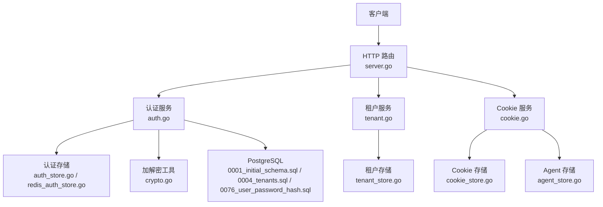
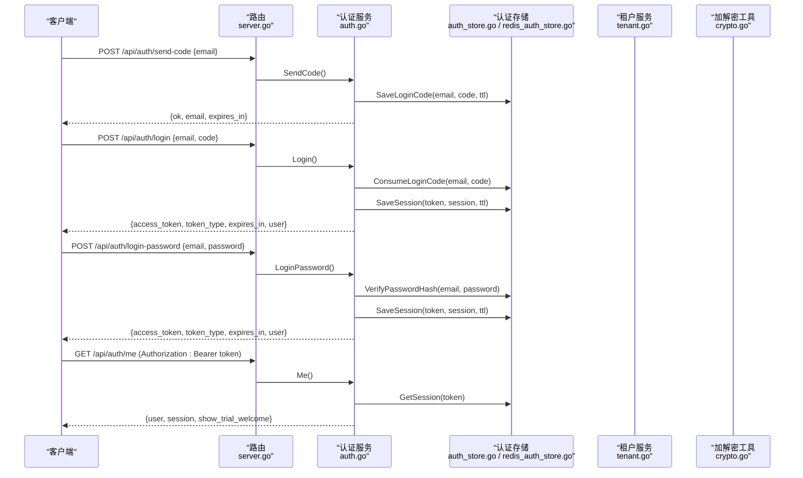
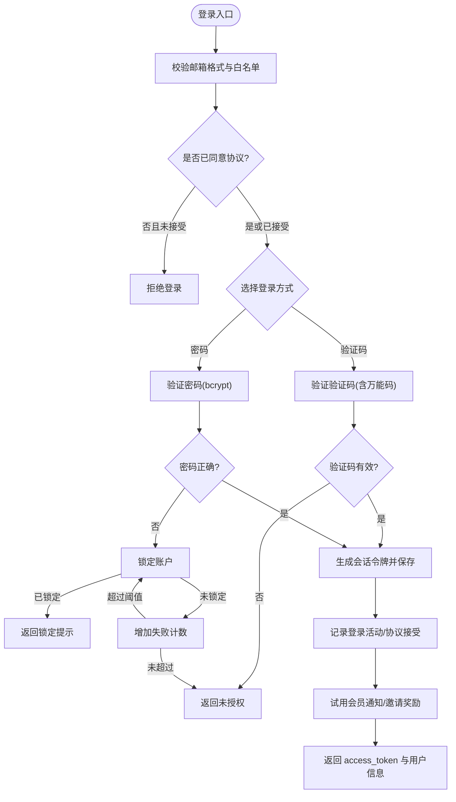
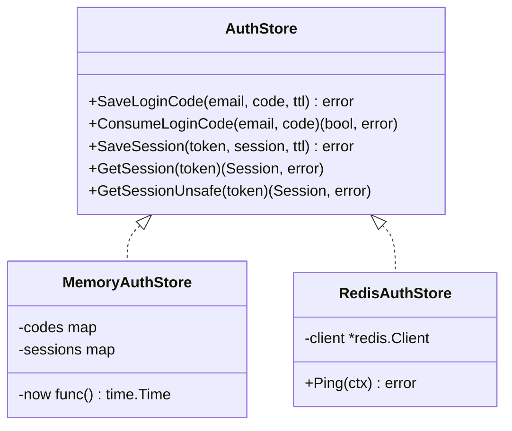
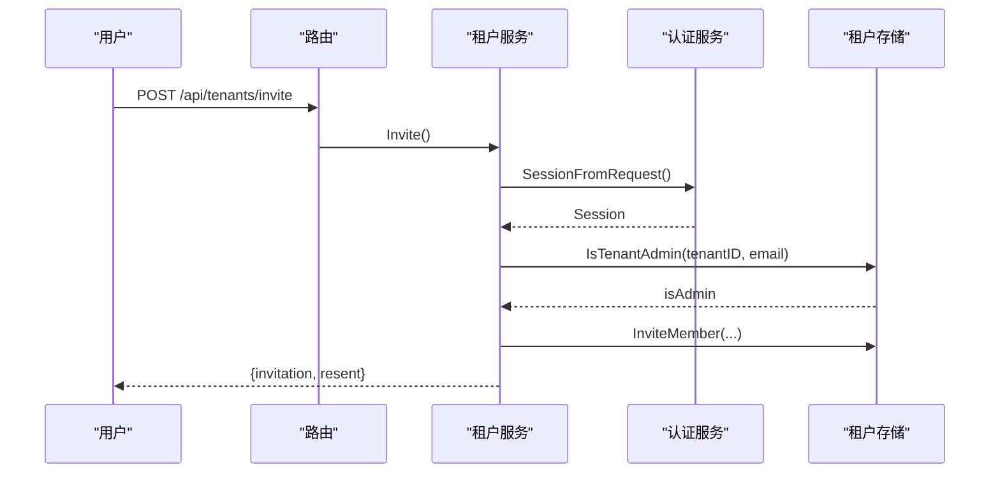
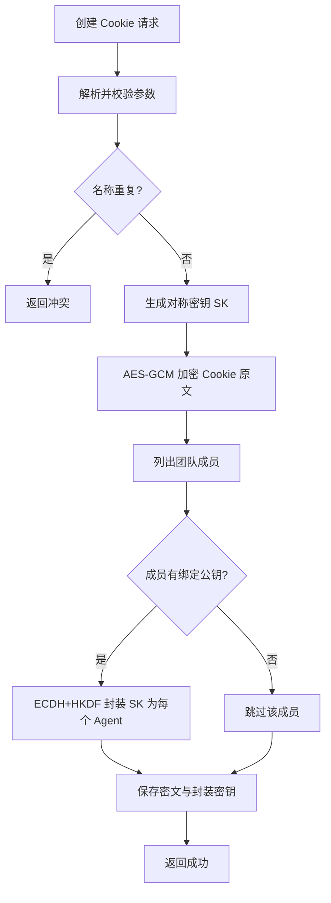
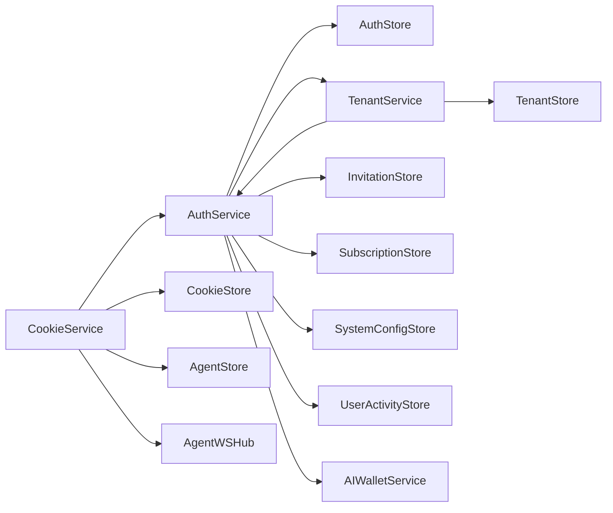

# 用户认证系统

<cite>
**本文引用的文件**
- [auth.go](file://goodhr5/cloud/backend/internal/httpapi/auth.go)
- [auth_store.go](file://goodhr5/cloud/backend/internal/httpapi/auth_store.go)
- [redis_auth_store.go](file://goodhr5/cloud/backend/internal/httpapi/redis_auth_store.go)
- [crypto.go](file://goodhr5/cloud/backend/internal/httpapi/crypto.go)
- [postgres_user.go](file://goodhr5/cloud/backend/internal/httpapi/postgres_user.go)
- [tenant.go](file://goodhr5/cloud/backend/internal/httpapi/tenant.go)
- [cookie.go](file://goodhr5/cloud/backend/internal/httpapi/cookie.go)
- [server.go](file://goodhr5/cloud/backend/internal/httpapi/server.go)
- [user_activity.go](file://goodhr5/cloud/backend/internal/httpapi/user_activity.go)
- [0001_initial_schema.sql](file://goodhr5/cloud/backend/db/migrations/0001_initial_schema.sql)
- [0004_tenants.sql](file://goodhr5/cloud/backend/db/migrations/0004_tenants.sql)
- [0076_user_password_hash.sql](file://goodhr5/cloud/backend/db/migrations/0076_user_password_hash.sql)
- [LoginForm.tsx](file://goodhr5/cloud/frontend-next/components/LoginForm.tsx)
</cite>

## 更新摘要
**变更内容**
- 新增密码登录功能，支持邮箱验证码与密码双登录方式
- 添加 password_hash 数据库字段用于存储 bcrypt 哈希密码
- 实现账户锁定机制防止暴力破解攻击
- 前端集成密码登录状态检查与锁定提示
- 增强安全策略包括密码强度验证和尝试次数限制

## 目录
1. [简介](#简介)
2. [项目结构](#项目结构)
3. [核心组件](#核心组件)
4. [架构总览](#架构总览)
5. [详细组件分析](#详细组件分析)
6. [依赖关系分析](#依赖关系分析)
7. [性能与安全考量](#性能与安全考量)
8. [故障排查指南](#故障排查指南)
9. [结论](#结论)
10. [附录：API 规范与示例](#附录api-规范与示例)

## 简介
本文件面向开发者，系统化说明 GoodHR 云端后端的用户认证体系。内容覆盖邮箱验证码登录、密码登录、会话管理、权限与租户隔离、Cookie 共享加密、以及安全最佳实践与防暴力破解策略。文档同时提供 API 接口规范、请求响应示例和错误处理机制，帮助快速集成与排障。

**更新** 新增了密码登录功能和账户锁定机制，现在支持两种登录方式：邮箱验证码登录和密码登录。

## 项目结构
认证相关代码集中在后端 HTTP API 模块中，采用"服务 + 存储"的分层设计：
- 服务层：AuthService、TenantService、CookieService 等负责业务编排与校验
- 存储层：AuthStore（内存/Redis）、TenantStore、CookieStore、AgentStore 等抽象持久化细节
- 路由层：Server 统一注册 /api/* 路由，将请求分发到对应服务方法
- 数据层：PostgreSQL 迁移脚本定义 users、tenants、local_agents、platform_accounts 等表

**图表来源**
- [server.go:124-200](file://goodhr5/cloud/backend/internal/httpapi/server.go#L124-L200)
- [auth.go:21-69](file://goodhr5/cloud/backend/internal/httpapi/auth.go#L21-L69)
- [tenant.go:14-23](file://goodhr5/cloud/backend/internal/httpapi/tenant.go#L14-L23)
- [cookie.go:15-27](file://goodhr5/cloud/backend/internal/httpapi/cookie.go#L15-L27)
- [auth_store.go:11-17](file://goodhr5/cloud/backend/internal/httpapi/auth_store.go#L11-L17)
- [redis_auth_store.go:12-24](file://goodhr5/cloud/backend/internal/httpapi/redis_auth_store.go#L12-L24)
- [crypto.go:22-33](file://goodhr5/cloud/backend/internal/httpapi/crypto.go#L22-L33)
- [0001_initial_schema.sql:8-13](file://goodhr5/cloud/backend/db/migrations/0001_initial_schema.sql#L8-L13)
- [0004_tenants.sql:2-7](file://goodhr5/cloud/backend/db/migrations/0004_tenants.sql#L2-L7)
- [0076_user_password_hash.sql:1-8](file://goodhr5/cloud/backend/db/migrations/0076_user_password_hash.sql#L1-L8)

章节来源
- [server.go:124-200](file://goodhr5/cloud/backend/internal/httpapi/server.go#L124-L200)
- [0001_initial_schema.sql:8-13](file://goodhr5/cloud/backend/db/migrations/0001_initial_schema.sql#L8-L13)
- [0004_tenants.sql:2-7](file://goodhr5/cloud/backend/db/migrations/0004_tenants.sql#L2-L7)
- [0076_user_password_hash.sql:1-8](file://goodhr5/cloud/backend/db/migrations/0076_user_password_hash.sql#L1-L8)

## 核心组件
- AuthService：实现发送验证码、验证码登录、密码登录、获取当前用户信息、协议同意状态、试用欢迎确认等；维护会话令牌与角色判定；支持万能验证码与邮箱域名白名单。
- AuthStore：抽象登录验证码与会话的存取；提供内存实现与 Redis 实现。
- TenantService：团队邀请、成员管理、管理员校验、Cookie 共享开关等。
- CookieService：平台 Cookie 的创建、更新、申领、释放、状态更新与删除；结合 Agent 公钥对数据进行端到端加密。
- Server：统一组装依赖并注册所有 HTTP 路由。

**更新** AuthService 现在支持密码登录功能，通过 bcrypt 哈希验证用户密码。

章节来源
- [auth.go:21-69](file://goodhr5/cloud/backend/internal/httpapi/auth.go#L21-L69)
- [auth_store.go:11-17](file://goodhr5/cloud/backend/internal/httpapi/auth_store.go#L11-L17)
- [redis_auth_store.go:12-24](file://goodhr5/cloud/backend/internal/httpapi/redis_auth_store.go#L12-L24)
- [tenant.go:14-23](file://goodhr5/cloud/backend/internal/httpapi/tenant.go#L14-L23)
- [cookie.go:15-27](file://goodhr5/cloud/backend/internal/httpapi/cookie.go#L15-L27)
- [server.go:46-121](file://goodhr5/cloud/backend/internal/httpapi/server.go#L46-L121)

## 架构总览
认证流程以"邮箱验证码 + 密码"双登录为核心，支持灵活的认证方式。登录成功后返回 access_token，后续请求通过 Authorization: Bearer <token> 进行身份校验。权限基于"超管 + 租户管理员 + 普通成员"三层模型，并通过租户上下文隔离数据访问。敏感数据（如 Cookie）在落库前使用对称密钥加密，并使用 Local Agent 的 ECDH 公钥对密钥进行封装，确保仅目标设备可解密。

**更新** 新增密码登录流程，支持用户选择验证码或密码方式进行认证。

**图表来源**
- [server.go:124-200](file://goodhr5/cloud/backend/internal/httpapi/server.go#L124-L200)
- [auth.go:71-214](file://goodhr5/cloud/backend/internal/httpapi/auth.go#L71-L214)
- [auth_store.go:45-98](file://goodhr5/cloud/backend/internal/httpapi/auth_store.go#L45-L98)
- [redis_auth_store.go:36-87](file://goodhr5/cloud/backend/internal/httpapi/redis_auth_store.go#L36-L87)
- [tenant.go:29-41](file://goodhr5/cloud/backend/internal/httpapi/tenant.go#L29-L41)
- [cookie.go:62-128](file://goodhr5/cloud/backend/internal/httpapi/cookie.go#L62-L128)
- [crypto.go:53-85](file://goodhr5/cloud/backend/internal/httpapi/crypto.go#L53-85)

## 详细组件分析

### 认证服务（AuthService）
- 功能要点
  - 发送验证码：校验邮箱格式与域名白名单，生成随机验证码并保存 TTL，发送邮件。
  - 验证码登录：校验协议同意状态，验证验证码（支持万能验证码），生成会话令牌并保存，记录登录活动，发放试用会员通知与邀请奖励。
  - 密码登录：验证用户密码（bcrypt 哈希比对），支持账户锁定机制防止暴力破解。
  - 当前用户：从请求头解析 Bearer Token，读取会话，返回公开用户信息与会话有效期。
  - 角色判定：超管 > 租户管理员 > 普通成员；用于前端展示与权限控制。
- 安全要点
  - 验证码一次性消费，防止重放。
  - 万能验证码基于服务器时区时间片段，便于调试但需受控启用。
  - 邮箱域名白名单限制注册入口。
  - 密码使用 bcrypt 哈希存储，支持盐值随机化。
  - 账户锁定机制：连续失败尝试后临时锁定账户。
- 复杂度与性能
  - 登录路径包含邮件发送、订阅通知、AI 钱包初始化等副作用操作，建议异步化或降级处理。

**更新** 新增密码登录功能，支持 bcrypt 密码验证和账户锁定机制。

**图表来源**
- [auth.go:121-214](file://goodhr5/cloud/backend/internal/httpapi/auth.go#L121-L214)
- [auth.go:304-329](file://goodhr5/cloud/backend/internal/httpapi/auth.go#L304-L329)
- [auth.go:381-419](file://goodhr5/cloud/backend/internal/httpapi/auth.go#L381-L419)

章节来源
- [auth.go:71-214](file://goodhr5/cloud/backend/internal/httpapi/auth.go#L71-L214)
- [auth.go:304-329](file://goodhr5/cloud/backend/internal/httpapi/auth.go#L304-L329)
- [auth.go:381-419](file://goodhr5/cloud/backend/internal/httpapi/auth.go#L381-L419)
- [auth.go:452-520](file://goodhr5/cloud/backend/internal/httpapi/auth.go#L452-L520)

### 认证存储（AuthStore）
- 内存实现（MemoryAuthStore）
  - 使用并发安全的 map 保存验证码与会话，按 TTL 过期清理。
  - 适合开发测试与单机部署。
- Redis 实现（RedisAuthStore）
  - 使用 Redis 键值存储验证码与会话，具备分布式能力与高可用。
  - 提供 Ping 健康检查。

**图表来源**
- [auth_store.go:11-17](file://goodhr5/cloud/backend/internal/httpapi/auth_store.go#L11-L17)
- [auth_store.go:25-43](file://goodhr5/cloud/backend/internal/httpapi/auth_store.go#L25-L43)
- [redis_auth_store.go:12-24](file://goodhr5/cloud/backend/internal/httpapi/redis_auth_store.go#L12-L24)

章节来源
- [auth_store.go:45-113](file://goodhr5/cloud/backend/internal/httpapi/auth_store.go#L45-L113)
- [redis_auth_store.go:36-102](file://goodhr5/cloud/backend/internal/httpapi/redis_auth_store.go#L36-L102)

### 租户与权限（TenantService）
- 功能要点
  - 成员列表、邀请加入、待处理邀请查询、接受/拒绝/重发邀请、修改角色、移除成员。
  - 管理员校验：所有写操作需团队管理员权限。
  - Cookie 共享开关：由管理员控制团队内是否允许共享 Cookie。
- 权限模型
  - 超管：全局配置与特殊能力。
  - 租户管理员：团队级资源管理与成员管理。
  - 普通成员：受限访问。

**图表来源**
- [tenant.go:67-125](file://goodhr5/cloud/backend/internal/httpapi/tenant.go#L67-L125)
- [tenant.go:358-376](file://goodhr5/cloud/backend/internal/httpapi/tenant.go#L358-L376)

章节来源
- [tenant.go:34-125](file://goodhr5/cloud/backend/internal/httpapi/tenant.go#L34-L125)
- [tenant.go:145-232](file://goodhr5/cloud/backend/internal/httpapi/tenant.go#L145-L232)
- [tenant.go:234-330](file://goodhr5/cloud/backend/internal/httpapi/tenant.go#L234-L330)
- [tenant.go:358-376](file://goodhr5/cloud/backend/internal/httpapi/tenant.go#L358-L376)

### Cookie 共享与加密（CookieService + crypto）
- 功能要点
  - 创建/更新 Cookie：校验重复名称、序列化 JSON、生成对称密钥并加密数据，为团队内已绑定设备的 Agent 公钥封装密钥。
  - 申领/释放：状态机控制 available/in_use/expired，避免并发冲突。
  - 状态更新：前端检测到平台登录过期时标记 expired。
- 加密方案
  - 对称加密：AES-256-GCM 加密 Cookie 原文。
  - 密钥封装：ECDH P-256 与 HKDF 派生包装密钥，使用 Local Agent 公钥加密对称密钥，仅目标设备可解密。
  - 数据库只保存密文与每台设备的加密密钥，降低泄露风险。

**图表来源**
- [cookie.go:62-128](file://goodhr5/cloud/backend/internal/httpapi/cookie.go#L62-L128)
- [cookie.go:244-284](file://goodhr5/cloud/backend/internal/httpapi/cookie.go#L244-L284)
- [crypto.go:28-85](file://goodhr5/cloud/backend/internal/httpapi/crypto.go#L28-L85)

章节来源
- [cookie.go:62-128](file://goodhr5/cloud/backend/internal/httpapi/cookie.go#L62-L128)
- [cookie.go:154-238](file://goodhr5/cloud/backend/internal/httpapi/cookie.go#L154-L238)
- [cookie.go:286-340](file://goodhr5/cloud/backend/internal/httpapi/cookie.go#L286-L340)
- [crypto.go:28-114](file://goodhr5/cloud/backend/internal/httpapi/crypto.go#L28-L114)

### 数据模型与持久化
- 用户表（users）：唯一邮箱作为账号标识，记录最近登录时间，新增 password_hash 字段用于存储 bcrypt 哈希密码。
- 租户表（tenants）：团队基本信息与所有者邮箱。
- 本地 Agent 表（local_agents）：记录用户绑定的本地程序机器码与版本。
- 平台账号映射（platform_accounts）：仅保存名称与本地 profile ID，不存真实 Cookie。

**更新** 新增 password_hash 字段支持密码登录功能。

章节来源
- [0001_initial_schema.sql:8-13](file://goodhr5/cloud/backend/db/migrations/0001_initial_schema.sql#L8-L13)
- [0001_initial_schema.sql:19-49](file://goodhr5/cloud/backend/db/migrations/0001_initial_schema.sql#L19-L49)
- [0004_tenants.sql:2-7](file://goodhr5/cloud/backend/db/migrations/0004_tenants.sql#L2-L7)
- [0076_user_password_hash.sql:1-8](file://goodhr5/cloud/backend/db/migrations/0076_user_password_hash.sql#L1-L8)
- [postgres_user.go:9-26](file://goodhr5/cloud/backend/internal/httpapi/postgres_user.go#L9-L26)

## 依赖关系分析
- 服务耦合
  - AuthService 依赖 Mailer、TenantStore、InvitationStore、SubscriptionStore、SystemConfigStore、UserActivityStore、AIWalletService。
  - TenantService 依赖 AuthService、TenantStore、Mailer。
  - CookieService 依赖 AuthService、CookieStore、TenantStore、AgentStore、AgentWSHub。
- 外部依赖
  - PostgreSQL：用户、租户、任务、日志等持久化。
  - Redis：分布式会话与验证码缓存。
  - 邮件服务：验证码与通知邮件。
  - 本地 Agent：上报公钥与机器码，参与 Cookie 共享。

**图表来源**
- [auth.go:21-69](file://goodhr5/cloud/backend/internal/httpapi/auth.go#L21-L69)
- [tenant.go:14-23](file://goodhr5/cloud/backend/internal/httpapi/tenant.go#L14-L23)
- [cookie.go:15-27](file://goodhr5/cloud/backend/internal/httpapi/cookie.go#L15-L27)

章节来源
- [auth.go:21-69](file://goodhr5/cloud/backend/internal/httpapi/auth.go#L21-L69)
- [tenant.go:14-23](file://goodhr5/cloud/backend/internal/httpapi/tenant.go#L14-L23)
- [cookie.go:15-27](file://goodhr5/cloud/backend/internal/httpapi/cookie.go#L15-L27)

## 性能与安全考量
- 性能
  - 登录路径包含邮件发送与订阅通知，建议异步执行或失败降级，避免阻塞主流程。
  - 使用 Redis 存储会话与验证码，提升并发与可扩展性。
  - Cookie 加密与密钥封装计算开销较大，建议在后台线程或队列中处理。
  - 密码哈希验证使用 bcrypt 算法，具有合理的计算成本防止暴力破解。
- 安全最佳实践
  - 验证码一次性消费，防止重放攻击。
  - 万能验证码仅在可控环境下启用，并限制偏移分钟数。
  - 邮箱域名白名单限制注册入口。
  - 会话令牌长度足够（32 字节随机），前缀区分，服务端校验有效性。
  - 敏感数据（Cookie）使用 AES-GCM 加密，密钥经 ECDH+HKDF 封装，仅目标设备可解密。
  - 最小权限原则：非管理员不可修改成员与团队设置。
  - 密码使用 bcrypt 哈希存储，支持盐值随机化和自适应成本因子。
  - 账户锁定机制：连续失败尝试后临时锁定账户，防止暴力破解。
- 防暴力破解
  - 验证码 TTL 短（5 分钟），且一次性消费。
  - 密码登录失败计数和账户锁定机制。
  - 建议增加 IP 级别限流与账户级别尝试次数限制（可在网关或中间件层实现）。
  - 登录失败返回通用错误消息，避免枚举邮箱。

**更新** 新增密码安全考虑和账户锁定机制。

## 故障排查指南
- 常见问题
  - 验证码错误或已过期：检查验证码是否已被消费或超过 TTL。
  - 会话无效或已过期：检查 Authorization 头是否正确携带 Bearer Token。
  - 邮箱域名不在白名单：检查系统配置中的邮箱域名白名单。
  - 无本地 Agent 公钥：Cookie 创建失败，需确保团队成员已绑定本地 Agent 并上报公钥。
  - 密码登录失败：检查 password_hash 字段是否正确设置，账户是否被锁定。
- 定位步骤
  - 查看路由注册与服务装配是否正确。
  - 检查存储层连接（PostgreSQL/Redis）与健康检查。
  - 核对租户管理员权限与成员状态。
  - 审查加密流程（公钥格式、ECDH/HKDF 派生）。
  - 检查密码哈希验证逻辑和账户锁定状态。

**更新** 新增密码登录相关的故障排查指导。

章节来源
- [auth.go:121-214](file://goodhr5/cloud/backend/internal/httpapi/auth.go#L121-L214)
- [auth.go:216-255](file://goodhr5/cloud/backend/internal/httpapi/auth.go#L216-L255)
- [auth.go:381-419](file://goodhr5/cloud/backend/internal/httpapi/auth.go#L381-L419)
- [cookie.go:105-128](file://goodhr5/cloud/backend/internal/httpapi/cookie.go#L105-L128)
- [redis_auth_store.go:26-34](file://goodhr5/cloud/backend/internal/httpapi/redis_auth_store.go#L26-L34)

## 结论
GoodHR 的用户认证系统以邮箱验证码为核心，现已扩展支持密码登录，结合服务端会话令牌与严格的权限模型，实现了简洁而安全的登录体验。通过租户隔离与 Cookie 共享加密，系统在多租户与多设备场景下具备良好的扩展性与安全性。新增的密码登录功能和账户锁定机制进一步增强了系统的安全性和用户体验。建议在生产环境启用 Redis 存储、严格配置邮箱白名单与万能验证码策略，并在网关层补充限流与风控措施。

**更新** 系统现在支持双登录方式，提供了更灵活和用户友好的认证体验。

## 附录：API 规范与示例

### 认证接口
- 发送验证码
  - 方法：POST
  - 路径：/api/auth/send-code
  - 请求体：{ "email": "用户邮箱" }
  - 响应：{ "ok": true, "email": "...", "expires_in": 秒数 }
  - 错误：400 非法邮箱、403 域名不在白名单、500 生成或保存失败、500 邮件发送失败
- 验证码登录
  - 方法：POST
  - 路径：/api/auth/login
  - 请求体：{ "email": "...", "code": "4位验证码", "inviter_id": "可选", "agreement_accepted": true/false }
  - 响应：{ "ok": true, "access_token": "...", "token_type": "Bearer", "expires_in": 秒数, "user": {...} }
  - 错误：400 非法参数、403 未同意协议、401 验证码错误或过期、500 内部错误
- **新增** 密码登录
  - 方法：POST
  - 路径：/api/auth/login-password
  - 请求体：{ "email": "...", "password": "用户密码", "inviter_id": "可选", "agreement_accepted": true/false }
  - 响应：{ "ok": true, "access_token": "...", "token_type": "Bearer", "expires_in": 秒数, "user": {...} }
  - 错误：400 非法参数、403 未同意协议、401 密码错误或账户锁定、500 内部错误
- **新增** 登录状态查询
  - 方法：GET
  - 路径：/api/auth/login-status?email=...
  - 响应：{ "ok": true, "status": { "has_password": true/false, "is_locked": true/false, "lock_remaining_sec": 数字 } }
  - 用途：前端根据此接口判断显示验证码登录还是密码登录界面
- 获取当前用户
  - 方法：GET
  - 路径：/api/auth/me
  - 请求头：Authorization: Bearer <token>
  - 响应：{ "ok": true, "user": {...}, "session": { "created_at": "...", "expires_at": "..." }, "show_trial_welcome": true/false }
  - 错误：401 会话无效或过期

**更新** 新增密码登录相关 API 接口。

章节来源
- [auth.go:71-119](file://goodhr5/cloud/backend/internal/httpapi/auth.go#L71-L119)
- [auth.go:121-214](file://goodhr5/cloud/backend/internal/httpapi/auth.go#L121-L214)
- [auth.go:216-255](file://goodhr5/cloud/backend/internal/httpapi/auth.go#L216-L255)

### 租户接口
- 邀请成员
  - 方法：POST
  - 路径：/api/tenants/invite
  - 请求体：{ "email": "...", "role": "admin|user" }
  - 响应：{ "ok": true, "invitation": {...}, "resent": false }
  - 错误：400 参数非法、409 已在团队、403 非管理员、502 邮件发送失败
- 待处理邀请
  - 方法：GET
  - 路径：/api/tenants/invitations/pending
  - 响应：{ "ok": true, "invitations": [...] }
- 接受/拒绝/重发/修改角色/取消
  - 方法：POST/PUT/DELETE
  - 路径：/api/tenants/invitations/{id}/accept|reject|resend|...
  - 响应：{ "ok": true }
  - 错误：404 邀请不存在、409 冲突、403 非管理员

章节来源
- [tenant.go:67-125](file://goodhr5/cloud/backend/internal/httpapi/tenant.go#L67-L125)
- [tenant.go:127-143](file://goodhr5/cloud/backend/internal/httpapi/tenant.go#L127-L143)
- [tenant.go:145-232](file://goodhr5/cloud/backend/internal/httpapi/tenant.go#L145-L232)

### Cookie 接口
- 创建 Cookie
  - 方法：POST
  - 路径：/api/cookies
  - 请求体：{ "platform_id": "...", "display_name": "...", "cookies": {...} }
  - 响应：{ "ok": true, "cookie": {...} }
  - 错误：400 参数非法、409 名称重复、409 无本地 Agent 公钥、500 加密失败
- 更新 Cookie
  - 方法：PUT
  - 路径：/api/cookies/{id}
  - 请求体：同创建
  - 响应：{ "ok": true, "cookie": {...} }
- 申领 Cookie
  - 方法：POST
  - 路径：/api/cookies/{id}/claim
  - 请求体：{ "position_id": "可选" }
  - 响应：{ "ok": true, "encrypted_data": "...", "encrypted_keys": {...} }
  - 错误：409 已过期/使用中
- 释放 Cookie
  - 方法：POST
  - 路径：/api/cookies/{id}/release
  - 响应：{ "ok": true }
- 状态更新
  - 方法：PUT
  - 路径：/api/cookies/{id}/status
  - 请求体：{ "status": "available|in_use|expired" }
  - 响应：{ "ok": true, "status": "..." }
- 删除
  - 方法：DELETE
  - 路径：/api/cookies/{id}
  - 响应：{ "ok": true }

章节来源
- [cookie.go:62-128](file://goodhr5/cloud/backend/internal/httpapi/cookie.go#L62-L128)
- [cookie.go:154-238](file://goodhr5/cloud/backend/internal/httpapi/cookie.go#L154-L238)
- [cookie.go:286-340](file://goodhr5/cloud/backend/internal/httpapi/cookie.go#L286-L340)
- [cookie.go:342-396](file://goodhr5/cloud/backend/internal/httpapi/cookie.go#L342-L396)

### 错误处理约定
- 统一使用 HTTP 状态码表达错误类型：
  - 400 参数非法
  - 401 未认证或会话失效
  - 403 权限不足
  - 404 资源不存在
  - 409 冲突（如名称重复、Cookie 使用中）
  - 500 内部错误
- 响应体通常包含 ok 字段与错误描述，便于前端统一处理。

**更新** 新增密码登录相关的错误处理，包括账户锁定提示。

章节来源
- [auth.go:71-214](file://goodhr5/cloud/backend/internal/httpapi/auth.go#L71-L214)
- [tenant.go:346-356](file://goodhr5/cloud/backend/internal/httpapi/tenant.go#L346-L356)
- [cookie.go:62-128](file://goodhr5/cloud/backend/internal/httpapi/cookie.go#L62-L128)