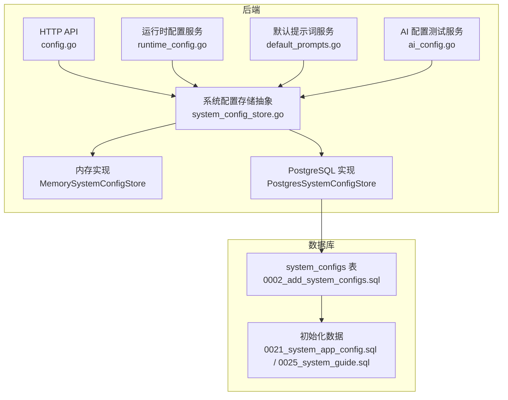
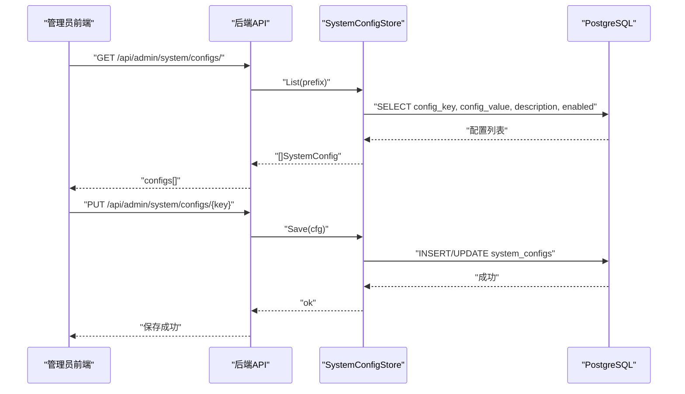
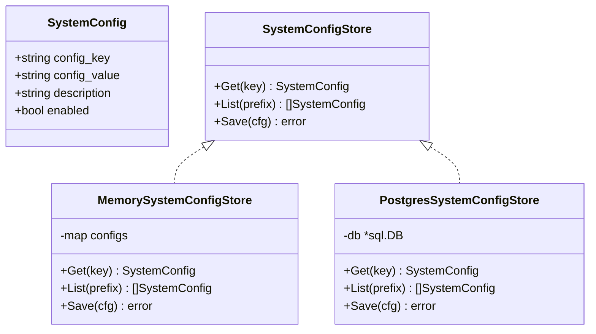
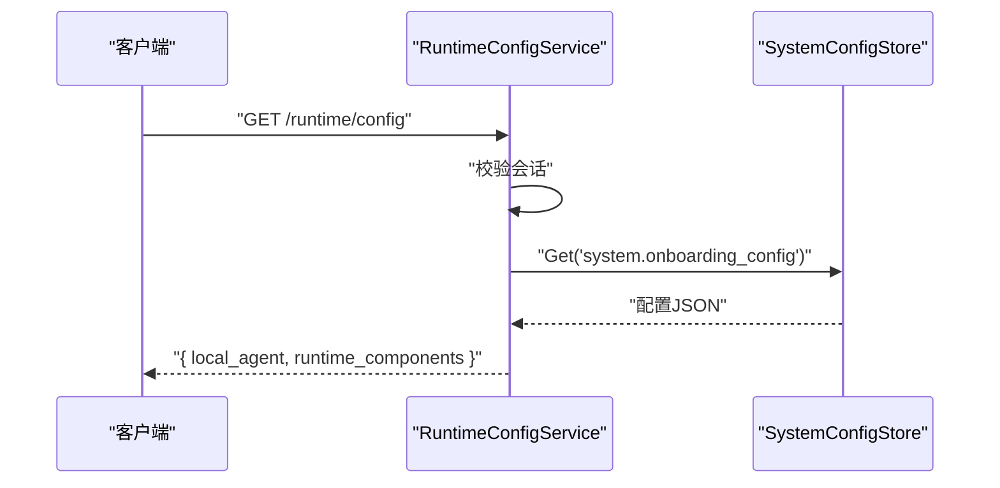
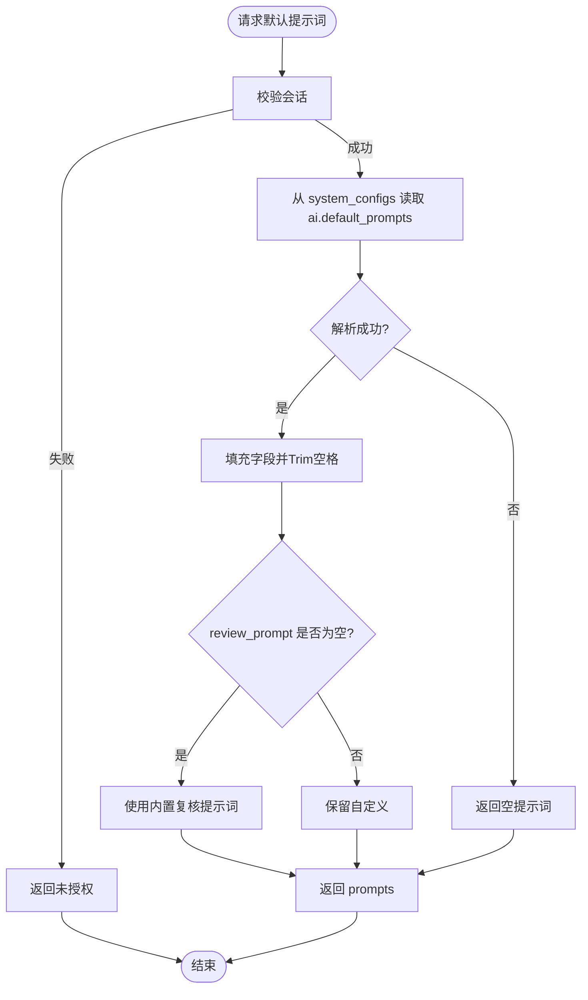
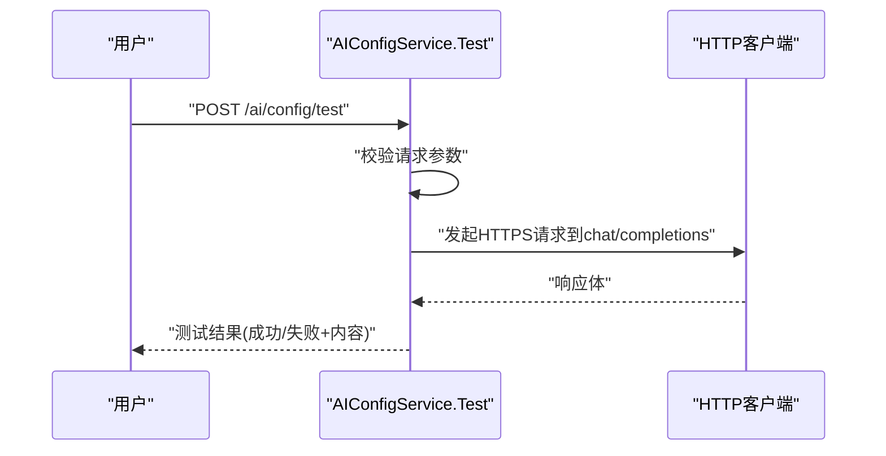
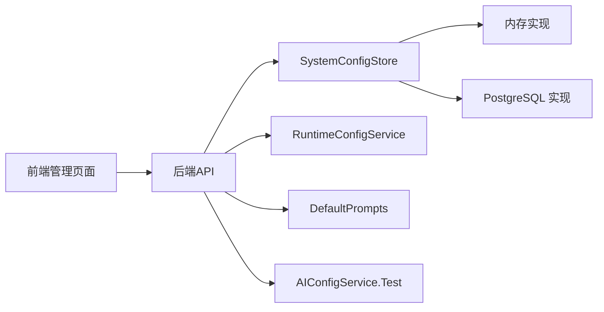

# 系统配置管理

<cite>
**本文引用的文件**
- [config.go](file://goodhr5/cloud/backend/internal/httpapi/config.go)
- [system_config_store.go](file://goodhr5/cloud/backend/internal/httpapi/system_config_store.go)
- [default_prompts.go](file://goodhr5/cloud/backend/internal/httpapi/default_prompts.go)
- [runtime_config.go](file://goodhr5/cloud/backend/internal/httpapi/runtime_config.go)
- [ai_config.go](file://goodhr5/cloud/backend/internal/httpapi/ai_config.go)
- [ai_config_store_pg.go](file://goodhr5/cloud/backend/internal/httpapi/ai_config_store_pg.go)
- [platform_account_store_pg.go](file://goodhr5/cloud/backend/internal/httpapi/platform_account_store_pg.go)
- [0002_add_system_configs.sql](file://goodhr5/cloud/backend/db/migrations/0002_add_system_configs.sql)
- [0015_system_default_prompts.down.sql](file://goodhr5/cloud/backend/db/migrations/0015_system_default_prompts.down.sql)
- [0021_system_app_config.sql](file://goodhr5/cloud/backend/db/migrations/0021_system_app_config.sql)
- [0025_system_guide.sql](file://goodhr5/cloud/backend/db/migrations/0025_system_guide.sql)
- [page.tsx](file://goodhr5/cloud/frontend-next/app/admin/system-config/page.tsx)
</cite>

## 目录
1. [简介](#简介)
2. [项目结构](#项目结构)
3. [核心组件](#核心组件)
4. [架构总览](#架构总览)
5. [详细组件分析](#详细组件分析)
6. [依赖关系分析](#依赖关系分析)
7. [性能与热更新](#性能与热更新)
8. [故障排查指南](#故障排查指南)
9. [结论](#结论)
10. [附录：API、数据结构与示例](#附录api数据结构与示例)

## 简介
本文件面向 GoodHR 5 云端后端的“系统配置管理”能力，覆盖以下目标：
- 系统参数配置、平台配置管理、默认提示词管理的实现机制
- 配置热更新、版本控制、权限验证
- 配置数据结构、验证规则、默认值管理
- 配置 API 接口、更新流程、回滚机制
- 实际配置示例与管理界面集成说明

该子系统以统一的 system_configs 表为核心，通过内存/PostgreSQL 双实现提供配置读写；前端提供超级管理员可视化编辑界面；运行时服务按键读取并下发给客户端或业务模块。

## 项目结构
后端采用“存储抽象 + 多实现”的设计：
- 配置存储抽象 SystemConfigStore（Get/List/Save）
- 内存实现 MemorySystemConfigStore（开发环境默认数据）
- PostgreSQL 实现 PostgresSystemConfigStore（生产持久化）
- 运行时配置服务 RuntimeConfigService（向已登录用户下发本地程序与运行组件配置）
- 默认提示词服务 default_prompts（从统一配置表加载 AI 默认提示词）
- 数据库迁移脚本维护 system_configs 表结构与初始数据

图表来源
- [config.go:205-210](file://goodhr5/cloud/backend/internal/httpapi/config.go#L205-L210)
- [system_config_store.go:19-27](file://goodhr5/cloud/backend/internal/httpapi/system_config_store.go#L19-L27)
- [runtime_config.go:20-38](file://goodhr5/cloud/backend/internal/httpapi/runtime_config.go#L20-L38)
- [default_prompts.go:36-56](file://goodhr5/cloud/backend/internal/httpapi/default_prompts.go#L36-L56)
- [ai_config.go:47-82](file://goodhr5/cloud/backend/internal/httpapi/ai_config.go#L47-L82)
- [0002_add_system_configs.sql:1-15](file://goodhr5/cloud/backend/db/migrations/0002_add_system_configs.sql#L1-L15)
- [0021_system_app_config.sql:1-24](file://goodhr5/cloud/backend/db/migrations/0021_system_app_config.sql#L1-L24)
- [0025_system_guide.sql:1-156](file://goodhr5/cloud/backend/db/migrations/0025_system_guide.sql#L1-L156)

章节来源
- [config.go:31-75](file://goodhr5/cloud/backend/internal/httpapi/config.go#L31-L75)
- [system_config_store.go:11-27](file://goodhr5/cloud/backend/internal/httpapi/system_config_store.go#L11-L27)
- [runtime_config.go:9-38](file://goodhr5/cloud/backend/internal/httpapi/runtime_config.go#L9-L38)
- [default_prompts.go:1-77](file://goodhr5/cloud/backend/internal/httpapi/default_prompts.go#L1-L77)
- [ai_config.go:1-82](file://goodhr5/cloud/backend/internal/httpapi/ai_config.go#L1-L82)
- [0002_add_system_configs.sql:1-15](file://goodhr5/cloud/backend/db/migrations/0002_add_system_configs.sql#L1-L15)
- [0021_system_app_config.sql:1-24](file://goodhr5/cloud/backend/db/migrations/0021_system_app_config.sql#L1-L24)
- [0025_system_guide.sql:1-156](file://goodhr5/cloud/backend/db/migrations/0025_system_guide.sql#L1-L156)

## 核心组件
- 系统配置存储抽象与实现
  - 接口：Get(key)、List(prefix)、Save(cfg)
  - 内存实现：提供开发默认配置（如公共系统配置、订阅套餐、新手引导、帮助中心等）
  - PostgreSQL 实现：基于 JSONB 的键值配置，支持启用/停用开关
- 运行时配置服务
  - 向已登录用户返回本地程序与运行组件配置（local_agent、runtime_components）
- 默认提示词服务
  - 从统一配置表 ai.default_prompts 读取筛选、打开详情、复核提示词，未设置时回退内置默认
- 配置初始化与迁移
  - 通过迁移脚本创建 system_configs 表并插入初始配置项
- 前端管理界面
  - 超级管理员可分类查看、校验 JSON、保存配置，支持撤销修改

章节来源
- [system_config_store.go:11-27](file://goodhr5/cloud/backend/internal/httpapi/system_config_store.go#L11-L27)
- [system_config_store.go:33-43](file://goodhr5/cloud/backend/internal/httpapi/system_config_store.go#L33-L43)
- [system_config_store.go:390-462](file://goodhr5/cloud/backend/internal/httpapi/system_config_store.go#L390-L462)
- [runtime_config.go:20-38](file://goodhr5/cloud/backend/internal/httpapi/runtime_config.go#L20-L38)
- [default_prompts.go:29-76](file://goodhr5/cloud/backend/internal/httpapi/default_prompts.go#L29-L76)
- [0002_add_system_configs.sql:1-15](file://goodhr5/cloud/backend/db/migrations/0002_add_system_configs.sql#L1-L15)
- [0021_system_app_config.sql:1-24](file://goodhr5/cloud/backend/db/migrations/0021_system_app_config.sql#L1-L24)
- [0025_system_guide.sql:1-156](file://goodhr5/cloud/backend/db/migrations/0025_system_guide.sql#L1-L156)
- [page.tsx:15-96](file://goodhr5/cloud/frontend-next/app/admin/system-config/page.tsx#L15-L96)

## 架构总览
系统配置管理由“统一存储 + 多场景消费”构成：
- 存储层：SystemConfigStore 抽象，内存/PG 双实现
- 服务层：运行时配置、默认提示词、AI 配置测试等
- 数据层：system_configs 表（JSONB），迁移脚本维护初始数据
- 前端层：超级管理员页面，分类展示与编辑 JSON 配置

图表来源
- [system_config_store.go:390-462](file://goodhr5/cloud/backend/internal/httpapi/system_config_store.go#L390-L462)
- [page.tsx:25-64](file://goodhr5/cloud/frontend-next/app/admin/system-config/page.tsx#L25-L64)

## 详细组件分析

### 系统配置存储（SystemConfigStore）
- 职责
  - Get：按 key 获取单条启用配置
  - List：按前缀列出所有启用配置
  - Save：保存或更新一条配置（JSONB）
- 内存实现
  - 启动时注入默认配置（公共系统配置、订阅套餐、新手引导、帮助中心、微信支付配置等）
  - 适合开发环境快速验证
- PostgreSQL 实现
  - 使用 JSONB 存储配置值，enabled 字段控制是否生效
  - 支持 Upsert（ON CONFLICT DO UPDATE）
- 错误处理
  - 找不到配置返回 ErrConfigNotFound
  - 列表查询保证空数组而非 null

图表来源
- [system_config_store.go:11-27](file://goodhr5/cloud/backend/internal/httpapi/system_config_store.go#L11-L27)
- [system_config_store.go:33-43](file://goodhr5/cloud/backend/internal/httpapi/system_config_store.go#L33-L43)
- [system_config_store.go:390-462](file://goodhr5/cloud/backend/internal/httpapi/system_config_store.go#L390-L462)

章节来源
- [system_config_store.go:11-27](file://goodhr5/cloud/backend/internal/httpapi/system_config_store.go#L11-L27)
- [system_config_store.go:33-43](file://goodhr5/cloud/backend/internal/httpapi/system_config_store.go#L33-L43)
- [system_config_store.go:390-462](file://goodhr5/cloud/backend/internal/httpapi/system_config_store.go#L390-L462)

### 运行时配置服务（RuntimeConfigService）
- 职责
  - 向已登录用户返回本地程序与运行组件配置（local_agent、runtime_components）
- 权限验证
  - 必须携带有效会话，否则返回未授权
- 数据来源
  - 从 system.onboarding_config 读取并下发

图表来源
- [runtime_config.go:20-38](file://goodhr5/cloud/backend/internal/httpapi/runtime_config.go#L20-L38)

章节来源
- [runtime_config.go:9-38](file://goodhr5/cloud/backend/internal/httpapi/runtime_config.go#L9-L38)

### 默认提示词管理（Default Prompts）
- 职责
  - 从 ai.default_prompts 读取筛选、打开详情、复核提示词
  - 若复核提示词为空，则回退内置默认
- 权限验证
  - 需要已登录会话
- 输出
  - 返回 prompts 对象供前端或模板使用

图表来源
- [default_prompts.go:29-76](file://goodhr5/cloud/backend/internal/httpapi/default_prompts.go#L29-L76)

章节来源
- [default_prompts.go:1-77](file://goodhr5/cloud/backend/internal/httpapi/default_prompts.go#L1-L77)

### AI 配置测试（AIConfigService.Test）
- 职责
  - 验证当前用户的 OpenAI 兼容配置是否可用
- 安全策略
  - 仅允许公网 HTTPS 地址，禁止内网和本地地址
  - 限制重定向次数
  - 超时控制
- 输入校验
  - 必填 base_url、model、api_key
  - URL 合法性检查

图表来源
- [ai_config.go:47-82](file://goodhr5/cloud/backend/internal/httpapi/ai_config.go#L47-L82)
- [ai_config.go:126-169](file://goodhr5/cloud/backend/internal/httpapi/ai_config.go#L126-L169)
- [ai_config.go:171-188](file://goodhr5/cloud/backend/internal/httpapi/ai_config.go#L171-L188)

章节来源
- [ai_config.go:1-200](file://goodhr5/cloud/backend/internal/httpapi/ai_config.go#L1-L200)

### 平台账号映射（PostgresPlatformAccountStore）
- 职责
  - 按用户和平台列出/保存/删除平台账号映射
- 并发与冲突
  - 唯一约束冲突返回冲突错误
- 超时
  - 所有数据库操作带上下文超时

章节来源
- [platform_account_store_pg.go:13-149](file://goodhr5/cloud/backend/internal/httpapi/platform_account_store_pg.go#L13-L149)

### 用户 AI 配置存储（PostgresAIConfigStore）
- 职责
  - 读取/保存指定用户的 AI 配置（base_url、model、api_key_encrypted、temperature、prompt_template、enabled）
- 幂等写入
  - ON CONFLICT DO UPDATE 确保唯一用户记录

章节来源
- [ai_config_store_pg.go:11-115](file://goodhr5/cloud/backend/internal/httpapi/ai_config_store_pg.go#L11-L115)

## 依赖关系分析
- 配置存储依赖
  - 内存实现无外部依赖
  - PostgreSQL 实现依赖数据库连接池与迁移
- 服务依赖
  - RuntimeConfigService 依赖 SystemConfigStore
  - DefaultPrompts 依赖 SystemConfigStore
  - AIConfigService.Test 依赖 HTTP 客户端与安全校验
- 前端依赖
  - 超级管理员页面调用后端配置接口进行读取与保存

图表来源
- [config.go:205-210](file://goodhr5/cloud/backend/internal/httpapi/config.go#L205-L210)
- [runtime_config.go:9-38](file://goodhr5/cloud/backend/internal/httpapi/runtime_config.go#L9-L38)
- [default_prompts.go:29-76](file://goodhr5/cloud/backend/internal/httpapi/default_prompts.go#L29-L76)
- [ai_config.go:47-82](file://goodhr5/cloud/backend/internal/httpapi/ai_config.go#L47-L82)
- [page.tsx:15-96](file://goodhr5/cloud/frontend-next/app/admin/system-config/page.tsx#L15-L96)

章节来源
- [config.go:205-210](file://goodhr5/cloud/backend/internal/httpapi/config.go#L205-L210)
- [runtime_config.go:9-38](file://goodhr5/cloud/backend/internal/httpapi/runtime_config.go#L9-L38)
- [default_prompts.go:29-76](file://goodhr5/cloud/backend/internal/httpapi/default_prompts.go#L29-L76)
- [ai_config.go:47-82](file://goodhr5/cloud/backend/internal/httpapi/ai_config.go#L47-L82)
- [page.tsx:15-96](file://goodhr5/cloud/frontend-next/app/admin/system-config/page.tsx#L15-L96)

## 性能与热更新
- 热更新机制
  - 配置保存在 system_configs 表中，读取即最新；无需重启服务
  - 前端保存后立即生效，后续读取均命中新值
- 缓存策略
  - 当前实现为直接读库；如需更高吞吐，可在服务层增加短期缓存（注意失效策略）
- 并发与锁
  - 写操作使用 UPSERT；避免重复键冲突
- 资源限制
  - AI 配置测试使用超时与公网白名单，防止滥用
- 建议优化
  - 对高频读取的配置键（如 system.app_config）可增加短 TTL 缓存
  - 对大 JSON 配置考虑分页或按需字段读取

[本节为通用指导，不直接分析具体文件]

## 故障排查指南
- 无法读取配置
  - 检查 enabled 是否为 true
  - 确认 key 是否存在且拼写正确
- 保存失败
  - 前端 JSON 校验失败会阻止提交
  - 后端保存异常需检查数据库连接与权限
- 默认提示词未生效
  - 检查 ai.default_prompts 是否存在且 enabled
  - 复核提示词为空时会回退内置默认
- AI 配置测试失败
  - 检查 base_url 是否为公网 HTTPS
  - 检查 model 与 api_key 是否正确
  - 关注超时与重定向限制

章节来源
- [system_config_store.go:390-462](file://goodhr5/cloud/backend/internal/httpapi/system_config_store.go#L390-L462)
- [default_prompts.go:29-76](file://goodhr5/cloud/backend/internal/httpapi/default_prompts.go#L29-L76)
- [ai_config.go:126-188](file://goodhr5/cloud/backend/internal/httpapi/ai_config.go#L126-L188)
- [page.tsx:59-64](file://goodhr5/cloud/frontend-next/app/admin/system-config/page.tsx#L59-L64)

## 结论
GoodHR 5 的系统配置管理以统一存储为中心，结合内存/PostgreSQL 双实现，满足开发与生产的不同需求。通过迁移脚本维护初始数据，前端提供可视化编辑能力，运行时服务按需读取并下发配置。默认提示词与运行时配置实现了灵活的热更新与权限控制，便于运维与产品迭代。

[本节为总结性内容，不直接分析具体文件]

## 附录：API、数据结构与示例

### 配置数据结构
- SystemConfig
  - config_key：配置键
  - config_value：JSONB 格式配置值
  - description：描述
  - enabled：是否启用
- PlatformConfig（平台配置）
  - id、name、open、domain、auth、public、card、actions、detail、position、extras、behavior
- ElementLocatorConfig（元素定位）
  - parent_classes、target_classes、find_attempts、find_interval_ms

章节来源
- [system_config_store.go:11-27](file://goodhr5/cloud/backend/internal/httpapi/system_config_store.go#L11-L27)
- [system_config_store.go:464-582](file://goodhr5/cloud/backend/internal/httpapi/system_config_store.go#L464-L582)

### 配置键与用途
- ai.default_prompts：AI 默认提示词（筛选、打开详情、复核）
- system.app_config：公共系统配置（公告、邮箱白名单、本地执行器版本要求等）
- system.subscription_plans：订阅套餐
- system.onboarding_config：本地程序与运行组件下载信息
- system.guide：帮助中心内容
- system.payment_wechat：微信支付配置

章节来源
- [system_config_store.go:45-187](file://goodhr5/cloud/backend/internal/httpapi/system_config_store.go#L45-L187)
- [0021_system_app_config.sql:1-24](file://goodhr5/cloud/backend/db/migrations/0021_system_app_config.sql#L1-L24)
- [0025_system_guide.sql:1-156](file://goodhr5/cloud/backend/db/migrations/0025_system_guide.sql#L1-L156)

### 权限验证
- 默认提示词接口：需要已登录会话
- 运行时配置接口：需要已登录会话
- AI 配置测试：需要已登录会话，并对请求进行严格校验

章节来源
- [default_prompts.go:59-76](file://goodhr5/cloud/backend/internal/httpapi/default_prompts.go#L59-L76)
- [runtime_config.go:20-38](file://goodhr5/cloud/backend/internal/httpapi/runtime_config.go#L20-L38)
- [ai_config.go:47-82](file://goodhr5/cloud/backend/internal/httpapi/ai_config.go#L47-L82)

### 更新流程
- 前端选择配置项 -> 编辑 JSON -> 保存 -> 后端校验并写入 system_configs -> 立即生效
- 支持撤销修改（恢复服务端原始值）

章节来源
- [page.tsx:25-64](file://goodhr5/cloud/frontend-next/app/admin/system-config/page.tsx#L25-L64)
- [system_config_store.go:447-462](file://goodhr5/cloud/backend/internal/httpapi/system_config_store.go#L447-L462)

### 回滚机制
- 数据库层面
  - 迁移脚本提供 down 文件用于回滚（例如移除 ai.default_prompts）
- 配置层面
  - 可通过再次保存旧值实现逻辑回滚
  - 建议在变更前后备份 system_configs 快照

章节来源
- [0015_system_default_prompts.down.sql:1-3](file://goodhr5/cloud/backend/db/migrations/0015_system_default_prompts.down.sql#L1-L3)

### 实际配置示例路径
- 公共系统配置示例：见内存默认值中的 system.app_config
- 订阅套餐示例：见内存默认值中的 system.subscription_plans
- 新手引导示例：见内存默认值中的 system.onboarding_config
- 帮助中心示例：见内存默认值中的 system.guide
- 微信支付配置示例：见内存默认值中的 system.payment_wechat

章节来源
- [system_config_store.go:45-187](file://goodhr5/cloud/backend/internal/httpapi/system_config_store.go#L45-L187)