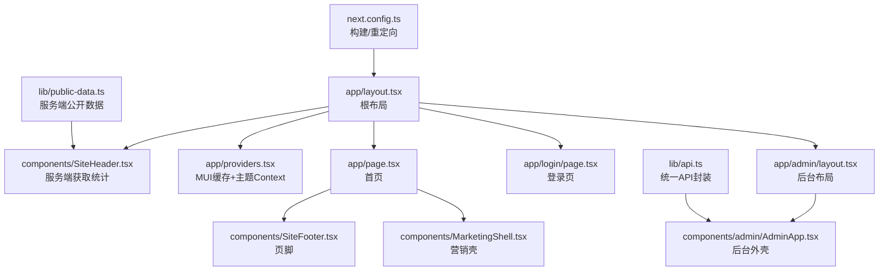
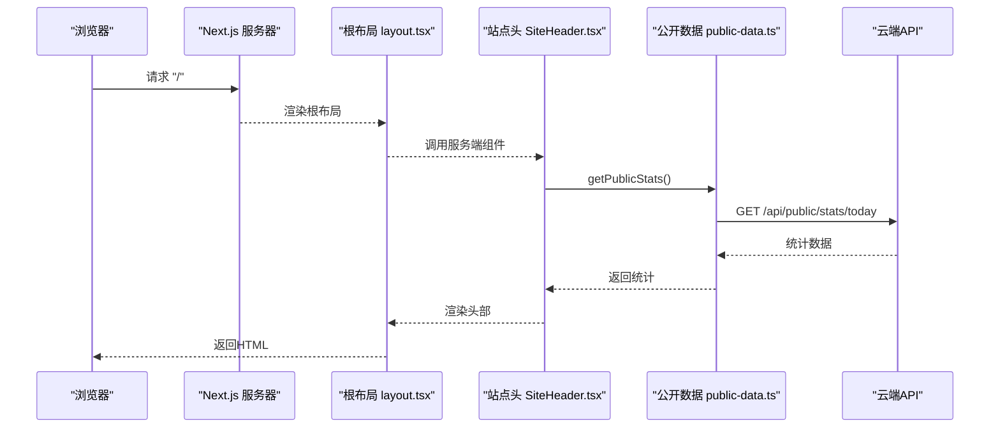
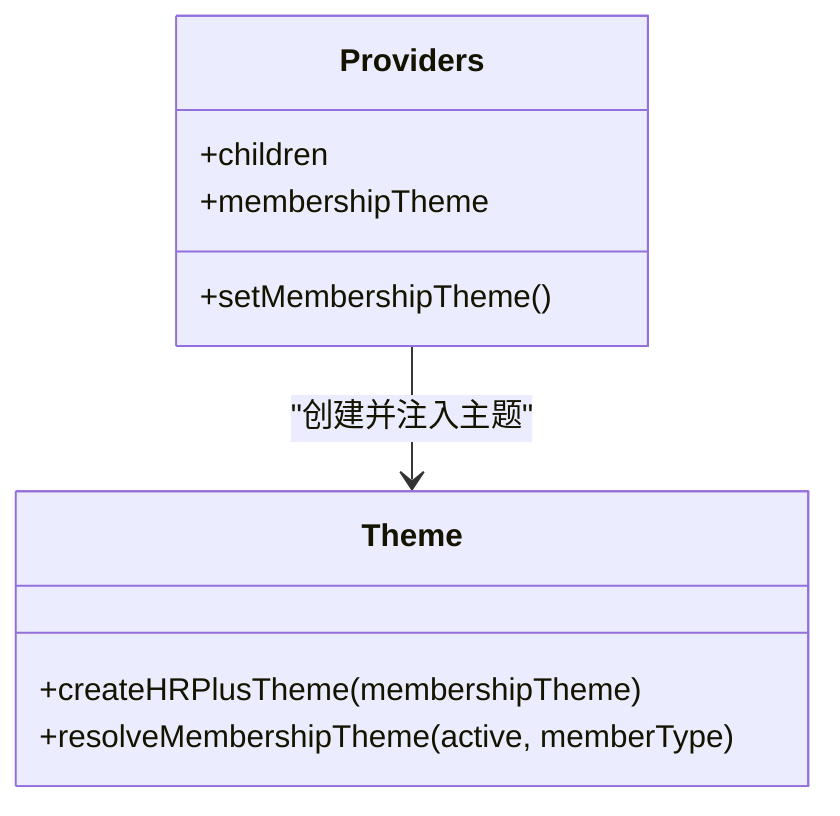
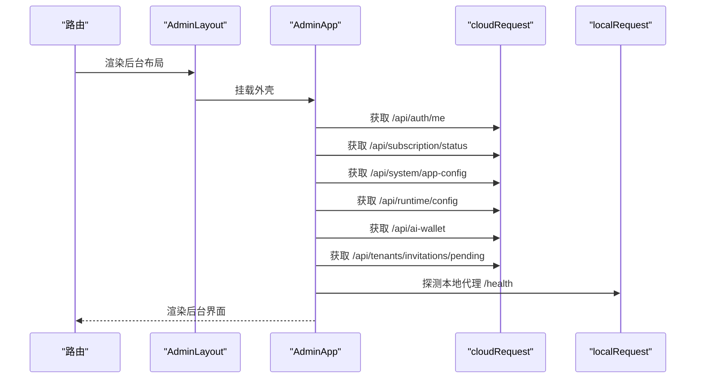
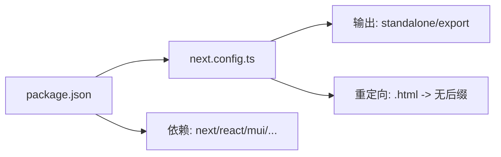

# Next.js应用架构

<cite>
**本文引用的文件**
- [next.config.ts](file://goodhr5/cloud/frontend-next/next.config.ts)
- [layout.tsx](file://goodhr5/cloud/frontend-next/app/layout.tsx)
- [page.tsx](file://goodhr5/cloud/frontend-next/app/page.tsx)
- [providers.tsx](file://goodhr5/cloud/frontend-next/app/providers.tsx)
- [theme.ts](file://goodhr5/cloud/frontend-next/app/theme.ts)
- [SiteHeader.tsx](file://goodhr5/cloud/frontend-next/components/SiteHeader.tsx)
- [SiteFooter.tsx](file://goodhr5/cloud/frontend-next/components/SiteFooter.tsx)
- [api.ts](file://goodhr5/cloud/frontend-next/lib/api.ts)
- [public-data.ts](file://goodhr5/cloud/frontend-next/lib/public-data.ts)
- [admin/layout.tsx](file://goodhr5/cloud/frontend-next/app/admin/layout.tsx)
- [AdminApp.tsx](file://goodhr5/cloud/frontend-next/components/admin/AdminApp.tsx)
- [MarketingShell.tsx](file://goodhr5/cloud/frontend-next/components/MarketingShell.tsx)
- [login/page.tsx](file://goodhr5/cloud/frontend-next/app/login/page.tsx)
- [package.json](file://goodhr5/cloud/frontend-next/package.json)
</cite>

## 目录
1. [简介](#简介)
2. [项目结构](#项目结构)
3. [核心组件](#核心组件)
4. [架构总览](#架构总览)
5. [详细组件分析](#详细组件分析)
6. [依赖关系分析](#依赖关系分析)
7. [性能考虑](#性能考虑)
8. [故障排查指南](#故障排查指南)
9. [结论](#结论)
10. [附录：扩展与最佳实践](#附录扩展与最佳实践)

## 简介
本仓库的 cloud/frontend-next 是一个基于 Next.js 16、React 19 和 MUI 的前端应用，包含官网营销页、登录页以及后台控制台。应用采用 App Router 路由组织页面，使用 React Context 进行全局状态管理（主题、后台上下文），通过统一的 API 封装访问云端服务，并支持静态导出与服务端渲染。样式体系基于 MUI 主题，提供按会员等级切换的主题能力。整体设计强调可维护性、可扩展性与 SEO/SSR 友好。

## 项目结构
前端采用 Next.js App Router 的分层组织方式：
- app：页面与布局（根布局、后台布局、各页面）
- components：共享 UI 组件（站点头尾、营销壳、登录表单等）与后台应用外壳
- lib：API 封装、公开数据获取、SEO 工具、订阅与用户流上报等
- public：静态资源
- next.config.ts：构建与重定向配置
- package.json：脚本与依赖

图表来源
- [layout.tsx:1-58](file://goodhr5/cloud/frontend-next/app/layout.tsx#L1-L58)
- [SiteHeader.tsx:1-11](file://goodhr5/cloud/frontend-next/components/SiteHeader.tsx#L1-L11)
- [providers.tsx:1-55](file://goodhr5/cloud/frontend-next/app/providers.tsx#L1-L55)
- [page.tsx:1-552](file://goodhr5/cloud/frontend-next/app/page.tsx#L1-L552)
- [SiteFooter.tsx:1-22](file://goodhr5/cloud/frontend-next/components/SiteFooter.tsx#L1-L22)
- [MarketingShell.tsx:1-32](file://goodhr5/cloud/frontend-next/components/MarketingShell.tsx#L1-L32)
- [login/page.tsx:1-49](file://goodhr5/cloud/frontend-next/app/login/page.tsx#L1-L49)
- [admin/layout.tsx:1-13](file://goodhr5/cloud/frontend-next/app/admin/layout.tsx#L1-L13)
- [AdminApp.tsx:1-800](file://goodhr5/cloud/frontend-next/components/admin/AdminApp.tsx#L1-L800)
- [api.ts:1-57](file://goodhr5/cloud/frontend-next/lib/api.ts#L1-L57)
- [public-data.ts:1-149](file://goodhr5/cloud/frontend-next/lib/public-data.ts#L1-L149)
- [next.config.ts:1-20](file://goodhr5/cloud/frontend-next/next.config.ts#L1-L20)

章节来源
- [next.config.ts:1-20](file://goodhr5/cloud/frontend-next/next.config.ts#L1-L20)
- [package.json:1-33](file://goodhr5/cloud/frontend-next/package.json#L1-L33)

## 核心组件
- 根布局（RootLayout）：定义全站 HTML 结构、SEO 元信息、结构化数据、全局 Providers 与第三方统计脚本注入。
- 主题与提供者（Providers + theme）：基于 MUI 的 AppRouterCacheProvider 与 ThemeProvider，使用 React Context 暴露会员主题切换能力。
- 站点头尾（SiteHeader/SiteFooter）：营销站点的导航与底部链接；头部在服务端拉取公开统计数据，减少客户端请求。
- 营销壳（MarketingShell）：为功能介绍、定价、视频等内页提供统一标题区与内容区布局。
- 登录页（LoginPage）：邮箱验证码登录入口，配合 LoginForm 完成认证流程。
- 后台布局与应用（AdminLayout + AdminApp）：后台路由的统一外壳，负责身份校验、菜单、通知、本地代理探测、订阅与系统配置加载等。

章节来源
- [layout.tsx:1-58](file://goodhr5/cloud/frontend-next/app/layout.tsx#L1-L58)
- [providers.tsx:1-55](file://goodhr5/cloud/frontend-next/app/providers.tsx#L1-L55)
- [theme.ts:1-128](file://goodhr5/cloud/frontend-next/app/theme.ts#L1-L128)
- [SiteHeader.tsx:1-11](file://goodhr5/cloud/frontend-next/components/SiteHeader.tsx#L1-L11)
- [SiteFooter.tsx:1-22](file://goodhr5/cloud/frontend-next/components/SiteFooter.tsx#L1-L22)
- [MarketingShell.tsx:1-32](file://goodhr5/cloud/frontend-next/components/MarketingShell.tsx#L1-L32)
- [login/page.tsx:1-49](file://goodhr5/cloud/frontend-next/app/login/page.tsx#L1-L49)
- [admin/layout.tsx:1-13](file://goodhr5/cloud/frontend-next/app/admin/layout.tsx#L1-L13)
- [AdminApp.tsx:1-800](file://goodhr5/cloud/frontend-next/components/admin/AdminApp.tsx#L1-L800)

## 架构总览
Next.js App Router 驱动的路由与渲染模型：
- 根布局负责全局 SEO、结构化数据与主题注入。
- 营销页以服务端渲染为主，结合静态导出优化部署。
- 后台控制台为客户端应用，集中处理鉴权、订阅、本地代理通信与业务交互。
- API 层统一封装错误与地址解析，屏蔽环境差异。

图表来源
- [layout.tsx:1-58](file://goodhr5/cloud/frontend-next/app/layout.tsx#L1-L58)
- [SiteHeader.tsx:1-11](file://goodhr5/cloud/frontend-next/components/SiteHeader.tsx#L1-L11)
- [public-data.ts:36-50](file://goodhr5/cloud/frontend-next/lib/public-data.ts#L36-L50)

## 详细组件分析

### 根布局与SEO
- 职责：设置 metadata、OpenGraph/Twitter 卡片、图标、robots 策略；注入结构化数据；挂载 Providers 与邀请捕获组件；插入百度统计脚本。
- 关键点：使用 Next Metadata API；将站点 URL、关键词、作者等信息集中管理；避免在首屏引入过多客户端逻辑。

章节来源
- [layout.tsx:1-58](file://goodhr5/cloud/frontend-next/app/layout.tsx#L1-L58)

### 主题与全局状态（React Context）
- 职责：提供 MUI 缓存与主题；通过 Context 暴露会员主题类型与切换方法；根据订阅状态动态切换主题。
- 关键点：MembershipTheme 枚举 free/plus/max；createHRPlusTheme 生成主题对象；useMembershipTheme 供子树消费。

图表来源
- [providers.tsx:1-55](file://goodhr5/cloud/frontend-next/app/providers.tsx#L1-L55)
- [theme.ts:1-128](file://goodhr5/cloud/frontend-next/app/theme.ts#L1-L128)

章节来源
- [providers.tsx:1-55](file://goodhr5/cloud/frontend-next/app/providers.tsx#L1-L55)
- [theme.ts:1-128](file://goodhr5/cloud/frontend-next/app/theme.ts#L1-L128)

### 站点头与公开数据
- 职责：在服务端读取公开统计，减少客户端网络开销；将数据传递给客户端组件渲染。
- 关键点：getPublicStats 使用 revalidate 控制缓存；失败时降级为空数据，不影响首屏。

章节来源
- [SiteHeader.tsx:1-11](file://goodhr5/cloud/frontend-next/components/SiteHeader.tsx#L1-L11)
- [public-data.ts:36-50](file://goodhr5/cloud/frontend-next/lib/public-data.ts#L36-L50)

### 营销壳与内页布局
- 职责：为 features/pricing/videos 等内页提供统一头部文案区与内容区；复用 SiteHeader/SiteFooter。
- 关键点：通过 props 传入 eyebrow/title/description，保持内页风格一致。

章节来源
- [MarketingShell.tsx:1-32](file://goodhr5/cloud/frontend-next/components/MarketingShell.tsx#L1-L32)

### 登录流程
- 职责：展示登录界面，引导用户输入邮箱获取验证码；成功后进入控制台或原目标页面。
- 关键点：与后端兼容现有会话机制；保留平台账号与浏览器数据在本地。

章节来源
- [login/page.tsx:1-49](file://goodhr5/cloud/frontend-next/app/login/page.tsx#L1-L49)

### 后台应用外壳（AdminApp）
- 职责：后台统一外壳，负责：
  - 身份校验与会话刷新（用户、订阅、AI钱包、系统配置、团队邀请）
  - 本地代理探测与绑定、运行组件检查
  - 全局通知与确认弹窗
  - 侧边栏菜单与权限过滤（超级管理员可见）
  - 顶部状态栏（打开浏览器、视频教程、订阅状态）
- 关键点：
  - 使用 useAdmin 自定义 Hook 暴露上下文值
  - 通过 cloudRequest/localRequest 与云端/本地代理通信
  - 使用 reportUserFlow 上报关键步骤

图表来源
- [admin/layout.tsx:1-13](file://goodhr5/cloud/frontend-next/app/admin/layout.tsx#L1-L13)
- [AdminApp.tsx:1-800](file://goodhr5/cloud/frontend-next/components/admin/AdminApp.tsx#L1-L800)

章节来源
- [admin/layout.tsx:1-13](file://goodhr5/cloud/frontend-next/app/admin/layout.tsx#L1-L13)
- [AdminApp.tsx:1-800](file://goodhr5/cloud/frontend-next/components/admin/AdminApp.tsx#L1-L800)

### 首页（营销落地页）
- 职责：展示产品价值、自动化场景、能力矩阵、FAQ与下载入口；注入结构化数据（SoftwareApplication、FAQPage）。
- 关键点：使用 MUI 组件与响应式布局；通过 SEO 工具函数生成页面元信息；集成 WorkflowBand 等子组件。

章节来源
- [page.tsx:1-552](file://goodhr5/cloud/frontend-next/app/page.tsx#L1-L552)

## 依赖关系分析
- 构建与输出：next.config.ts 根据环境变量决定输出模式（standalone/export），并配置图片优化与静态导出行为；同时配置 .html 到无后缀的重定向。
- 运行时依赖：Next.js、React、MUI 生态、CodeMirror、编辑器、二维码等。
- 脚本：dev/build/start 命令用于开发、构建与启动。

图表来源
- [package.json:1-33](file://goodhr5/cloud/frontend-next/package.json#L1-L33)
- [next.config.ts:1-20](file://goodhr5/cloud/frontend-next/next.config.ts#L1-L20)

章节来源
- [package.json:1-33](file://goodhr5/cloud/frontend-next/package.json#L1-L33)
- [next.config.ts:1-20](file://goodhr5/cloud/frontend-next/next.config.ts#L1-L20)

## 性能考虑
- 服务端渲染与缓存
  - 公开数据（如统计、套餐、视频）在服务端获取并使用 revalidate 控制缓存，降低重复请求。
  - 站点头在服务端拉取数据，减少客户端网络与渲染压力。
- 构建优化
  - 生产环境默认 standalone 输出，便于容器化部署；静态导出模式下关闭图片优化以提升兼容性。
  - 移除 poweredBy 响应头，减少指纹泄露。
- 客户端体验
  - 使用 MUI CacheProvider 提升 SSR 样式一致性。
  - 后台外壳按需加载本地代理状态，避免阻塞首屏。
- 建议
  - 对大体积组件使用动态导入。
  - 列表与长页面使用虚拟滚动或分页。
  - 图片使用 Next/Image 并合理设置尺寸与占位。

[本节为通用指导，不直接分析具体文件]

## 故障排查指南
- API 请求失败
  - 现象：提示“无法连接云端服务”或“云端返回的数据格式不正确”。
  - 原因：网络不可达或后端返回非 JSON。
  - 处理：检查 NEXT_PUBLIC_CLOUD_API_BASE 与环境变量；查看后端日志；重试。
- 登录态过期
  - 现象：提示“登录状态已过期，请重新登录”。
  - 原因：令牌失效或会话丢失。
  - 处理：重新登录；检查 localStorage 中的 TOKEN_KEY。
- 后台初始化失败
  - 现象：后台加载后提示“后台初始化失败，请检查网络后刷新页面”。
  - 原因：多个接口并发失败（auth/subscription/config/runtime/ai-wallet/invitations）。
  - 处理：逐个检查对应接口；确认本地代理是否可用；必要时重启服务。
- 本地代理未检测到
  - 现象：顶部状态显示异常或无法打开浏览器。
  - 原因：本地程序未运行或未绑定设备。
  - 处理：启动本地代理；执行设备绑定；检查健康检查与健康版本返回。

章节来源
- [api.ts:20-57](file://goodhr5/cloud/frontend-next/lib/api.ts#L20-L57)
- [AdminApp.tsx:453-526](file://goodhr5/cloud/frontend-next/components/admin/AdminApp.tsx#L453-L526)
- [AdminApp.tsx:272-331](file://goodhr5/cloud/frontend-next/components/admin/AdminApp.tsx#L272-L331)

## 结论
该 Next.js 应用以 App Router 为核心，结合 React Context 与 MUI 主题体系，实现了营销站与后台控制台的双端体验。通过统一 API 封装与服务端数据预取，兼顾了 SEO、性能与可维护性。后台外壳集中处理鉴权、订阅、本地代理与全局交互，具备良好的扩展性。建议在后续迭代中继续强化组件拆分、错误边界与监控埋点，进一步提升稳定性与可观测性。

[本节为总结，不直接分析具体文件]

## 附录：扩展与最佳实践

- 如何添加新页面
  - 在 app 目录下新增文件夹与 page.tsx，例如 app/new-feature/page.tsx。
  - 如需统一营销壳，可在页面中使用 MarketingShell 包裹内容。
  - 如需 SEO，使用 createPageMetadata 或直接在页面导出 metadata。
  - 参考路径：[page.tsx:25-39](file://goodhr5/cloud/frontend-next/app/page.tsx#L25-L39)、[MarketingShell.tsx:15-31](file://goodhr5/cloud/frontend-next/components/MarketingShell.tsx#L15-L31)

- 如何复用现有组件
  - 从 components 目录引入共享组件，如 SiteHeader、SiteFooter、BrandMark。
  - 后台页面可通过 useAdmin 获取全局状态与交互方法。
  - 参考路径：[SiteHeader.tsx:1-11](file://goodhr5/cloud/frontend-next/components/SiteHeader.tsx#L1-L11)、[AdminApp.tsx:153-158](file://goodhr5/cloud/frontend-next/components/admin/AdminApp.tsx#L153-L158)

- 如何接入新的 API
  - 在 lib/api.ts 中扩展 apiRequest 的错误映射或新增便捷方法。
  - 服务端数据获取放在 lib/public-data.ts，使用 revalidate 控制缓存。
  - 参考路径：[api.ts:20-57](file://goodhr5/cloud/frontend-next/lib/api.ts#L20-L57)、[public-data.ts:36-92](file://goodhr5/cloud/frontend-next/lib/public-data.ts#L36-L92)

- 如何扩展主题
  - 在 theme.ts 中增加 MembershipTheme 配色与 createHRPlusTheme 分支。
  - 在 providers.tsx 中通过 Context 暴露 setMembershipTheme，并在后台订阅状态变化时更新。
  - 参考路径：[theme.ts:20-64](file://goodhr5/cloud/frontend-next/app/theme.ts#L20-L64)、[providers.tsx:18-40](file://goodhr5/cloud/frontend-next/app/providers.tsx#L18-L40)

- 服务端渲染与客户端渲染的使用场景
  - 服务端渲染：首页、定价、视频等营销页，利于 SEO 与首屏性能。
  - 客户端渲染：后台控制台，需要频繁交互与实时状态。
  - 混合模式：站点头在服务端获取公开数据，再交给客户端组件渲染。
  - 参考路径：[SiteHeader.tsx:6-9](file://goodhr5/cloud/frontend-next/components/SiteHeader.tsx#L6-L9)、[AdminApp.tsx:453-526](file://goodhr5/cloud/frontend-next/components/admin/AdminApp.tsx#L453-L526)

- 性能优化策略
  - 使用 revalidate 缓存公开数据，减少重复请求。
  - 生产环境使用 standalone 输出，静态导出时关闭图片优化。
  - 后台外壳延迟加载本地代理状态，避免阻塞首屏。
  - 参考路径：[public-data.ts:36-92](file://goodhr5/cloud/frontend-next/lib/public-data.ts#L36-L92)、[next.config.ts:6-16](file://goodhr5/cloud/frontend-next/next.config.ts#L6-L16)