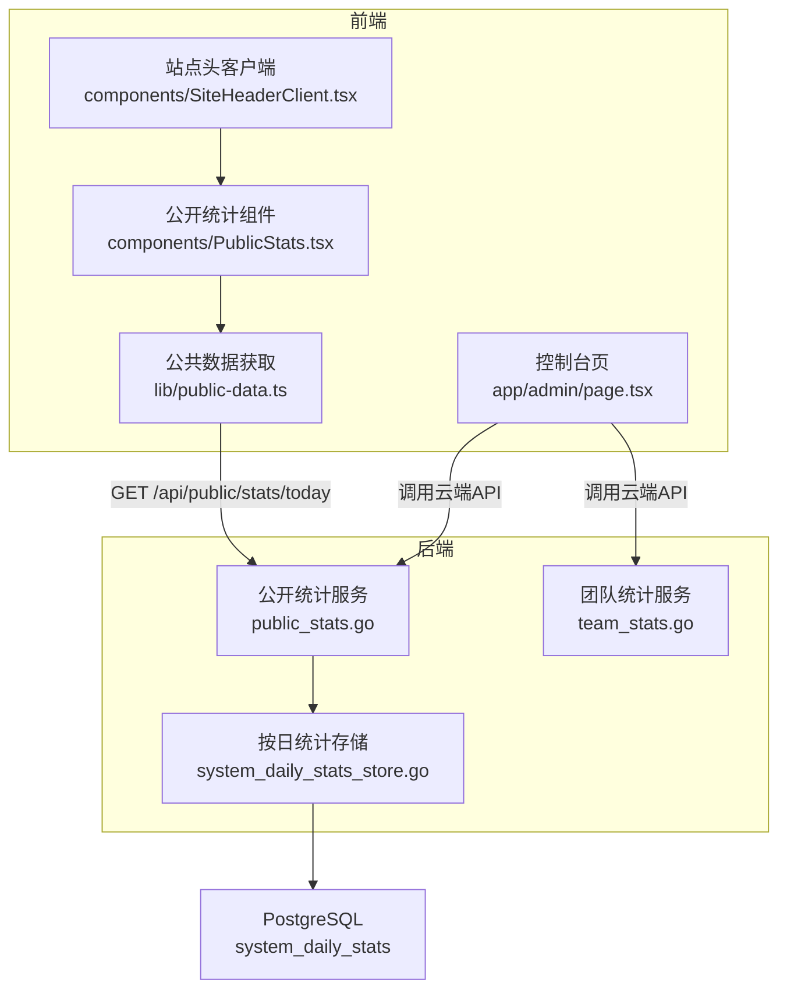
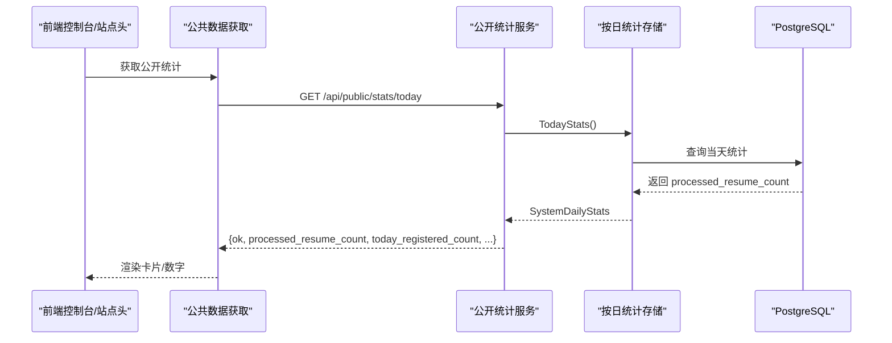
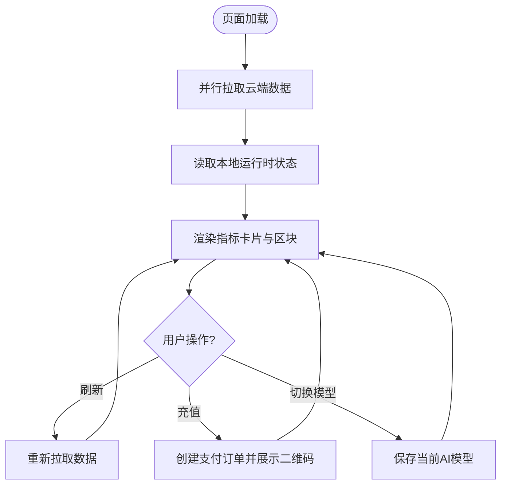
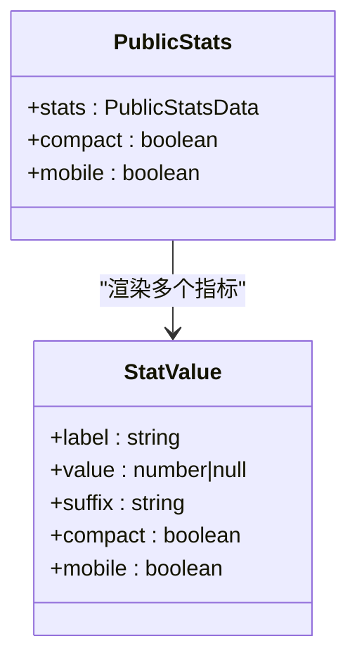
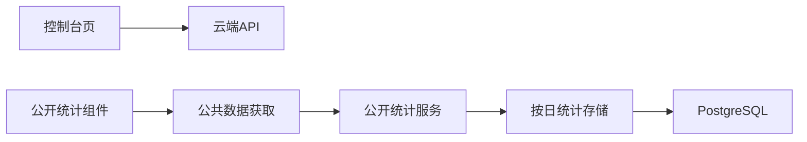

# 仪表盘统计

<cite>
**本文引用的文件**
- [frontend-next/components/PublicStats.tsx](file://goodhr5/cloud/frontend-next/components/PublicStats.tsx)
- [frontend-next/lib/public-data.ts](file://goodhr5/cloud/frontend-next/lib/public-data.ts)
- [frontend-next/components/SiteHeaderClient.tsx](file://goodhr5/cloud/frontend-next/components/SiteHeaderClient.tsx)
- [cloud/backend/internal/httpapi/public_stats.go](file://goodhr5/cloud/backend/internal/httpapi/public_stats.go)
- [cloud/backend/internal/httpapi/system_daily_stats_store.go](file://goodhr5/cloud/backend/internal/httpapi/system_daily_stats_store.go)
- [cloud/backend/internal/httpapi/team_stats.go](file://goodhr5/cloud/backend/internal/httpapi/team_stats.go)
- [frontend-next/app/admin/page.tsx](file://goodhr5/cloud/frontend-next/app/admin/page.tsx)
</cite>

## 目录
1. [简介](#简介)
2. [项目结构](#项目结构)
3. [核心组件](#核心组件)
4. [架构总览](#架构总览)
5. [详细组件分析](#详细组件分析)
6. [依赖关系分析](#依赖关系分析)
7. [性能与缓存](#性能与缓存)
8. [故障排查指南](#故障排查指南)
9. [结论](#结论)
10. [附录：扩展指南](#附录：扩展指南)

## 简介
本文件面向 HRPlus 云端的“仪表盘统计”能力，覆盖以下目标：
- 仪表盘的布局设计与数据展示组件
- 实时数据更新机制（服务端增量统计、前端定时刷新）
- 统计图表与可视化方案（用户增长、任务运行状态、平台使用情况）
- 数据获取接口、缓存策略与错误处理
- 如何添加新指标、自定义图表类型、实现数据筛选
- 响应式设计在不同设备上的表现

## 项目结构
本次文档聚焦于前后端协同的统计链路：
- 前端 Next.js 页面与组件负责渲染仪表盘、卡片、公开统计等
- 后端 Go HTTP API 提供团队统计、系统公开统计、按日统计存储
- 数据库层通过 PostgreSQL 持久化按日统计数据，并支持并发累加

**图示来源**
- [frontend-next/app/admin/page.tsx:101-191](file://goodhr5/cloud/frontend-next/app/admin/page.tsx#L101-L191)
- [frontend-next/components/PublicStats.tsx:1-24](file://goodhr5/cloud/frontend-next/components/PublicStats.tsx#L1-L24)
- [frontend-next/components/SiteHeaderClient.tsx:23-51](file://goodhr5/cloud/frontend-next/components/SiteHeaderClient.tsx#L23-L51)
- [frontend-next/lib/public-data.ts:36-50](file://goodhr5/cloud/frontend-next/lib/public-data.ts#L36-L50)
- [cloud/backend/internal/httpapi/public_stats.go:20-69](file://goodhr5/cloud/backend/internal/httpapi/public_stats.go#L20-L69)
- [cloud/backend/internal/httpapi/system_daily_stats_store.go:58-103](file://goodhr5/cloud/backend/internal/httpapi/system_daily_stats_store.go#L58-L103)

**章节来源**
- [frontend-next/app/admin/page.tsx:101-191](file://goodhr5/cloud/frontend-next/app/admin/page.tsx#L101-L191)
- [frontend-next/components/PublicStats.tsx:1-24](file://goodhr5/cloud/frontend-next/components/PublicStats.tsx#L1-L24)
- [frontend-next/components/SiteHeaderClient.tsx:23-51](file://goodhr5/cloud/frontend-next/components/SiteHeaderClient.tsx#L23-L51)
- [frontend-next/lib/public-data.ts:36-50](file://goodhr5/cloud/frontend-next/lib/public-data.ts#L36-L50)
- [cloud/backend/internal/httpapi/public_stats.go:20-69](file://goodhr5/cloud/backend/internal/httpapi/public_stats.go#L20-L69)
- [cloud/backend/internal/httpapi/system_daily_stats_store.go:58-103](file://goodhr5/cloud/backend/internal/httpapi/system_daily_stats_store.go#L58-L103)

## 核心组件
- 控制台仪表盘
  - 展示今日打招呼数、运行中岗位数、简历总数等关键指标
  - 使用网格布局与图标卡片，支持响应式列数变化
  - 数据来源：云端岗位列表、候选人总数、本地运行时健康检查
- 公开统计组件
  - 展示“今日处理简历”“今日注册”等公开指标
  - 通过服务端预取数据，失败时降级为占位显示
- 团队统计服务
  - 仅团队管理员可访问，聚合员工维度岗位运行与候选人事件
  - 支持周期选择：今天、本周、本月、上月、自定义日期范围

**章节来源**
- [frontend-next/app/admin/page.tsx:177-191](file://goodhr5/cloud/frontend-next/app/admin/page.tsx#L177-L191)
- [frontend-next/components/PublicStats.tsx:6-23](file://goodhr5/cloud/frontend-next/components/PublicStats.tsx#L6-L23)
- [cloud/backend/internal/httpapi/team_stats.go:25-66](file://goodhr5/cloud/backend/internal/httpapi/team_stats.go#L25-L66)

## 架构总览
从请求到渲染的关键路径如下：
- 控制台页在加载时并行拉取岗位、候选人、AI配置、钱包、用户流程等数据
- 公开统计由站点头或首页组件调用，服务端通过 Next.js ISR 缓存 300 秒
- 后端公开统计服务聚合用户注册、岗位打招呼、本地程序绑定、按日统计等
- 按日统计通过 Postgres 原子累加，避免并发写入竞争

**图示来源**
- [frontend-next/lib/public-data.ts:36-50](file://goodhr5/cloud/frontend-next/lib/public-data.ts#L36-L50)
- [cloud/backend/internal/httpapi/public_stats.go:20-69](file://goodhr5/cloud/backend/internal/httpapi/public_stats.go#L20-L69)
- [cloud/backend/internal/httpapi/system_daily_stats_store.go:87-103](file://goodhr5/cloud/backend/internal/httpapi/system_daily_stats_store.go#L87-L103)

## 详细组件分析

### 控制台仪表盘（admin 页）
- 布局与指标
  - 顶部指标卡片：今日打招呼、运行中岗位、简历数量
  - 网格布局根据屏幕宽度自适应列数
- 数据加载
  - 并行请求岗位列表、候选人总数、AI 配置、钱包、用户流程
  - 本地运行时状态通过健康检查与运行时接口合并
- 交互
  - 刷新按钮触发重新拉取
  - AI 余额充值弹窗与支付流程
  - 模型选择弹窗保存当前模型

**图示来源**
- [frontend-next/app/admin/page.tsx:122-175](file://goodhr5/cloud/frontend-next/app/admin/page.tsx#L122-L175)
- [frontend-next/app/admin/page.tsx:177-191](file://goodhr5/cloud/frontend-next/app/admin/page.tsx#L177-L191)

**章节来源**
- [frontend-next/app/admin/page.tsx:101-191](file://goodhr5/cloud/frontend-next/app/admin/page.tsx#L101-L191)

### 公开统计组件（PublicStats）
- 展示“今日处理简历”“今日注册”两个指标
- 支持紧凑模式与移动端尺寸适配
- 数值为空时显示占位符，保证界面稳定

**图示来源**
- [frontend-next/components/PublicStats.tsx:6-23](file://goodhr5/cloud/frontend-next/components/PublicStats.tsx#L6-L23)

**章节来源**
- [frontend-next/components/PublicStats.tsx:1-24](file://goodhr5/cloud/frontend-next/components/PublicStats.tsx#L1-L24)

### 站点头中的公开统计（SiteHeaderClient）
- 在头部区域以紧凑形式展示公开统计
- 移动端与桌面端分别展示不同布局
- 复用 PublicStats 组件保持一致性

**章节来源**
- [frontend-next/components/SiteHeaderClient.tsx:23-51](file://goodhr5/cloud/frontend-next/components/SiteHeaderClient.tsx#L23-L51)

### 公共数据获取（public-data）
- getPublicStats 在服务端发起请求，使用 Next.js ISR 缓存 300 秒
- 失败时返回空统计，不影响页面渲染
- 统一封装云端 API Base URL，支持环境变量覆盖

**章节来源**
- [frontend-next/lib/public-data.ts:36-50](file://goodhr5/cloud/frontend-next/lib/public-data.ts#L36-L50)
- [frontend-next/lib/public-data.ts:94-100](file://goodhr5/cloud/frontend-next/lib/public-data.ts#L94-L100)

### 后端公开统计服务（public_stats）
- 聚合多维度数据：用户注册、岗位打招呼、本地程序绑定、按日统计
- 任一依赖不可用时仍尽量返回可用字段，提升可用性
- 返回结构化 JSON，包含数值与格式化标签

**章节来源**
- [cloud/backend/internal/httpapi/public_stats.go:20-69](file://goodhr5/cloud/backend/internal/httpapi/public_stats.go#L20-L69)

### 按日统计存储（system_daily_stats_store）
- 内存与 Postgres 双实现，便于测试与生产部署
- 使用 UPSERT 原子累加当日已处理简历数，避免并发丢失
- TodayStats 在无记录时返回默认日期与零值，保证前端不报错

**章节来源**
- [cloud/backend/internal/httpapi/system_daily_stats_store.go:58-103](file://goodhr5/cloud/backend/internal/httpapi/system_daily_stats_store.go#L58-L103)

### 团队统计服务（team_stats）
- 权限校验：仅团队管理员可访问
- 时间范围解析：today、week、month、last_month、custom
- 聚合员工维度的岗位运行与候选人事件，计算总计

**章节来源**
- [cloud/backend/internal/httpapi/team_stats.go:25-66](file://goodhr5/cloud/backend/internal/httpapi/team_stats.go#L25-L66)
- [cloud/backend/internal/httpapi/team_stats.go:135-166](file://goodhr5/cloud/backend/internal/httpapi/team_stats.go#L135-L166)
- [cloud/backend/internal/httpapi/team_stats.go:168-204](file://goodhr5/cloud/backend/internal/httpapi/team_stats.go#L168-L204)

## 依赖关系分析
- 前端依赖
  - 控制台页依赖云端岗位、候选人、AI 配置、钱包、用户流程接口
  - 公开统计组件依赖公共数据获取模块
  - 站点头客户端复用公开统计组件
- 后端依赖
  - 公开统计服务依赖用户统计、岗位统计、本地程序绑定、按日统计存储
  - 按日统计存储依赖数据库（PostgreSQL）
- 外部依赖
  - Next.js ISR 缓存公开统计
  - 微信支付用于 AI 余额充值

**图示来源**
- [frontend-next/app/admin/page.tsx:122-175](file://goodhr5/cloud/frontend-next/app/admin/page.tsx#L122-L175)
- [frontend-next/lib/public-data.ts:36-50](file://goodhr5/cloud/frontend-next/lib/public-data.ts#L36-L50)
- [cloud/backend/internal/httpapi/public_stats.go:20-69](file://goodhr5/cloud/backend/internal/httpapi/public_stats.go#L20-L69)
- [cloud/backend/internal/httpapi/system_daily_stats_store.go:58-103](file://goodhr5/cloud/backend/internal/httpapi/system_daily_stats_store.go#L58-L103)

**章节来源**
- [frontend-next/app/admin/page.tsx:122-175](file://goodhr5/cloud/frontend-next/app/admin/page.tsx#L122-L175)
- [frontend-next/lib/public-data.ts:36-50](file://goodhr5/cloud/frontend-next/lib/public-data.ts#L36-L50)
- [cloud/backend/internal/httpapi/public_stats.go:20-69](file://goodhr5/cloud/backend/internal/httpapi/public_stats.go#L20-L69)
- [cloud/backend/internal/httpapi/system_daily_stats_store.go:58-103](file://goodhr5/cloud/backend/internal/httpapi/system_daily_stats_store.go#L58-L103)

## 性能与缓存
- 前端缓存
  - 公开统计使用 Next.js ISR，revalidate 为 300 秒，降低重复请求压力
  - 控制台页采用并行请求减少首屏等待时间
- 后端缓存
  - 按日统计通过数据库原子累加，避免频繁全量计算
  - 团队统计查询设置超时保护，防止慢查询阻塞
- 建议优化
  - 对高频指标增加 Redis 缓存层（如热门时段）
  - 对团队统计结果进行分页或增量更新
  - 前端对长列表使用虚拟滚动与懒加载

[本节为通用性能建议，不直接分析具体文件]

## 故障排查指南
- 公开统计为空或显示占位
  - 检查 Next.js ISR 是否生效，确认 revalidate 配置
  - 查看后端公开统计服务日志，定位依赖服务异常
  - 验证按日统计存储是否能正确读写数据库
- 团队统计无数据或权限错误
  - 确认当前用户是否为团队管理员
  - 检查时间范围参数是否正确解析
  - 核对数据库关联表是否有对应时间段的数据
- 控制台页加载缓慢
  - 检查并行请求是否全部成功
  - 关注本地运行时健康检查是否超时
  - 评估云端 API 响应时间与限流策略

**章节来源**
- [frontend-next/lib/public-data.ts:36-50](file://goodhr5/cloud/frontend-next/lib/public-data.ts#L36-L50)
- [cloud/backend/internal/httpapi/public_stats.go:20-69](file://goodhr5/cloud/backend/internal/httpapi/public_stats.go#L20-L69)
- [cloud/backend/internal/httpapi/system_daily_stats_store.go:87-103](file://goodhr5/cloud/backend/internal/httpapi/system_daily_stats_store.go#L87-L103)
- [cloud/backend/internal/httpapi/team_stats.go:25-66](file://goodhr5/cloud/backend/internal/httpapi/team_stats.go#L25-L66)

## 结论
HRPlus 的仪表盘统计通过前后端协作实现了高可用、易扩展的数据展示：
- 前端采用响应式布局与组件化设计，确保多端一致体验
- 后端通过服务拆分与存储抽象，保障统计准确性与可扩展性
- 通过 ISR 与数据库原子操作，兼顾性能与一致性
- 提供清晰的扩展点，便于新增指标与图表类型

[本节为总结性内容，不直接分析具体文件]

## 附录：扩展指南

### 添加新的统计指标
- 前端
  - 在控制台页新增指标卡片，复用网格布局与图标样式
  - 若为公开指标，可在 public-data 中添加获取函数并使用 ISR 缓存
- 后端
  - 在公开统计服务或团队统计服务中聚合新指标
  - 如需持久化，扩展按日统计存储或新增统计表
- 示例参考
  - 新增“今日活跃本地程序数”：在后端聚合 Agent 绑定计数，在前端卡片中展示

**章节来源**
- [frontend-next/app/admin/page.tsx:177-191](file://goodhr5/cloud/frontend-next/app/admin/page.tsx#L177-L191)
- [frontend-next/lib/public-data.ts:36-50](file://goodhr5/cloud/frontend-next/lib/public-data.ts#L36-L50)
- [cloud/backend/internal/httpapi/public_stats.go:20-69](file://goodhr5/cloud/backend/internal/httpapi/public_stats.go#L20-L69)

### 自定义图表类型
- 推荐方案
  - 使用成熟图表库（如 ECharts、Recharts）嵌入控制台页
  - 将后端聚合的时间序列数据作为图表数据源
- 数据接入
  - 新增后端接口返回时间序列（如每日岗位运行数、打招呼数）
  - 前端按需轮询或订阅 WebSocket 实现实时更新
- 注意事项
  - 控制数据粒度与频率，避免过大负载
  - 提供加载态与错误态，提升用户体验

[本节为概念性指导，不直接分析具体文件]

### 实现数据筛选功能
- 前端
  - 在团队统计页增加周期选择器（今天、本周、本月、上月、自定义）
  - 根据选择动态拼接查询参数并刷新数据
- 后端
  - 解析 period/start_date/end_date 参数，计算左闭右开区间
  - 对聚合查询增加索引优化，提升大表查询性能
- 示例参考
  - 团队统计服务已支持多种周期解析与自定义范围

**章节来源**
- [cloud/backend/internal/httpapi/team_stats.go:135-166](file://goodhr5/cloud/backend/internal/httpapi/team_stats.go#L135-L166)

### 响应式设计实践
- 布局
  - 使用网格与弹性布局，根据屏幕宽度调整列数与间距
  - 在小屏设备上优先展示核心指标，隐藏次要信息
- 组件
  - 公开统计组件支持 compact 与 mobile 模式，适配头部与侧边栏
  - 控制台页指标卡片在不同尺寸下保持可读性与可操作性
- 建议
  - 使用断点控制布局变化，避免过度缩放
  - 对长文本与数字进行截断或换行处理

**章节来源**
- [frontend-next/components/PublicStats.tsx:6-23](file://goodhr5/cloud/frontend-next/components/PublicStats.tsx#L6-L23)
- [frontend-next/app/admin/page.tsx:286-319](file://goodhr5/cloud/frontend-next/app/admin/page.tsx#L286-L319)