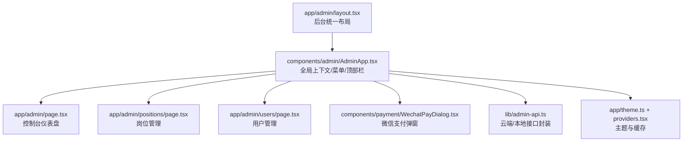
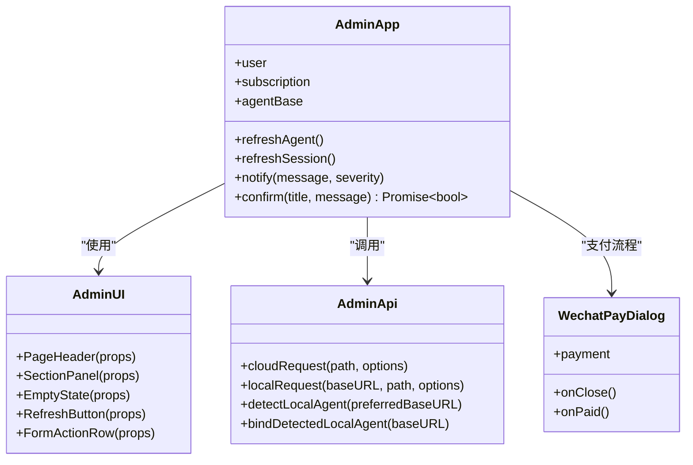
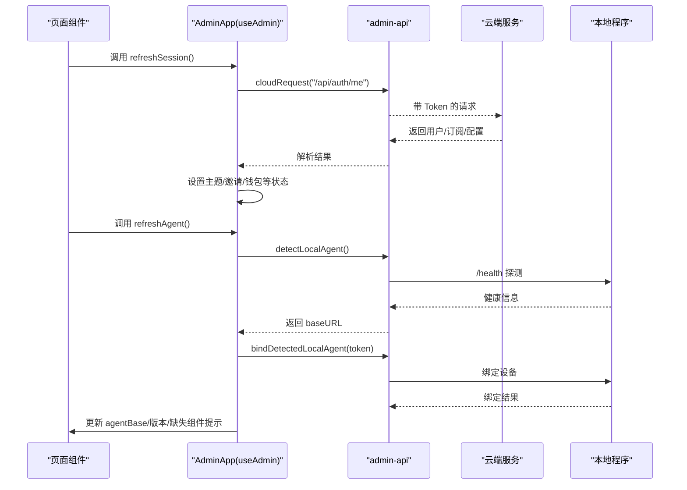
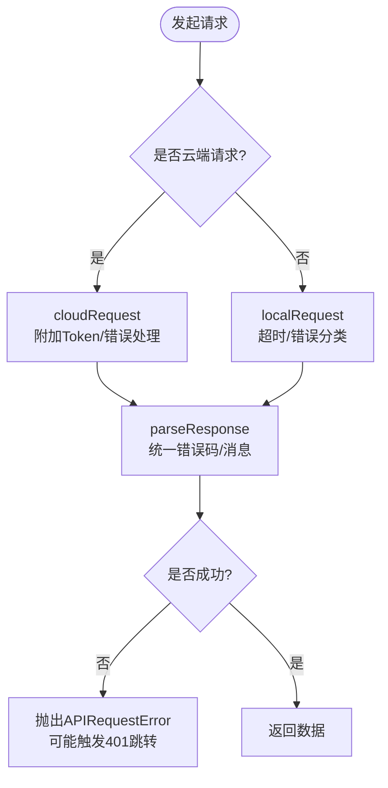

# 前端管理界面

<cite>
**本文引用的文件**
- [app/admin/layout.tsx](file://goodhr5/cloud/frontend-next/app/admin/layout.tsx)
- [app/admin/page.tsx](file://goodhr5/cloud/frontend-next/app/admin/page.tsx)
- [components/admin/AdminApp.tsx](file://goodhr5/cloud/frontend-next/components/admin/AdminApp.tsx)
- [components/admin/AdminUI.tsx](file://goodhr5/cloud/frontend-next/components/admin/AdminUI.tsx)
- [lib/admin-api.ts](file://goodhr5/cloud/frontend-next/lib/admin-api.ts)
- [components/payment/WechatPayDialog.tsx](file://goodhr5/cloud/frontend-next/components/payment/WechatPayDialog.tsx)
- [app/theme.ts](file://goodhr5/cloud/frontend-next/app/theme.ts)
- [app/providers.tsx](file://goodhr5/cloud/frontend-next/app/providers.tsx)
- [lib/subscription.ts](file://goodhr5/cloud/frontend-next/lib/subscription.ts)
- [app/admin/positions/page.tsx](file://goodhr5/cloud/frontend-next/app/admin/positions/page.tsx)
- [app/admin/users/page.tsx](file://goodhr5/cloud/frontend-next/app/admin/users/page.tsx)
- [package.json](file://goodhr5/cloud/frontend-next/package.json)
</cite>

## 目录
1. [简介](#简介)
2. [项目结构](#项目结构)
3. [核心组件与架构](#核心组件与架构)
4. [页面路由与导航](#页面路由与导航)
5. [状态管理与数据流](#状态管理与数据流)
6. [功能模块详解](#功能模块详解)
7. [API 集成与实时机制](#api-集成与实时机制)
8. [样式与主题规范](#样式与主题规范)
9. [响应式设计与可访问性](#响应式设计与可访问性)
10. [性能与优化建议](#性能与优化建议)
11. [故障排查指南](#故障排查指南)
12. [结论](#结论)

## 简介
本文档面向希望快速理解并扩展 HRPlus 管理后台的前端开发者。内容覆盖 Next.js App Router 架构、MUI 主题体系、全局上下文与状态管理、页面路由组织、组件复用策略，以及控制台仪表盘、用户管理、岗位配置、支付集成等关键功能的实现方式与最佳实践。同时提供 API 调用约定、错误处理、实时数据更新机制和常见问题排查方法。

## 项目结构
管理后台基于 Next.js App Router 构建，采用“按功能域划分”的目录组织：
- app/admin：后台路由入口与布局，包含控制台、岗位、简历、团队、订阅、系统配置等功能子目录
- components/admin：后台通用 UI 组件（对话框、卡片、表格、悬浮窗等）
- components/payment：支付相关组件（微信支付二维码弹窗）
- lib：统一 API 封装、订阅状态解析、平台登录与运行守卫等工具
- app/theme.ts、app/providers.tsx：全局主题与 MUI 缓存提供者

图表来源
- [app/admin/layout.tsx:1-13](file://goodhr5/cloud/frontend-next/app/admin/layout.tsx#L1-L13)
- [components/admin/AdminApp.tsx:224-800](file://goodhr5/cloud/frontend-next/components/admin/AdminApp.tsx#L224-L800)
- [app/admin/page.tsx:101-467](file://goodhr5/cloud/frontend-next/app/admin/page.tsx#L101-L467)
- [app/admin/positions/page.tsx:98-200](file://goodhr5/cloud/frontend-next/app/admin/positions/page.tsx#L98-L200)
- [app/admin/users/page.tsx:70-200](file://goodhr5/cloud/frontend-next/app/admin/users/page.tsx#L70-L200)
- [components/payment/WechatPayDialog.tsx:45-145](file://goodhr5/cloud/frontend-next/components/payment/WechatPayDialog.tsx#L45-L145)
- [lib/admin-api.ts:61-127](file://goodhr5/cloud/frontend-next/lib/admin-api.ts#L61-L127)
- [app/theme.ts:66-128](file://goodhr5/cloud/frontend-next/app/theme.ts#L66-L128)
- [app/providers.tsx:28-55](file://goodhr5/cloud/frontend-next/app/providers.tsx#L28-L55)

章节来源
- [app/admin/layout.tsx:1-13](file://goodhr5/cloud/frontend-next/app/admin/layout.tsx#L1-L13)
- [package.json:1-33](file://goodhr5/cloud/frontend-next/package.json#L1-L33)

## 核心组件与架构
- AdminApp：后台应用壳，负责身份校验、会话刷新、本地程序探测与绑定、全局通知与确认弹窗、侧边菜单渲染、顶部状态栏、会员主题切换等。通过 React Context 暴露 useAdmin 钩子供页面使用。
- AdminUI：页面级通用组件，包括 PageHeader、SectionPanel、EmptyState、RefreshButton、FormActionRow，保证后台页面风格一致。
- WechatPayDialog：展示微信支付二维码，轮询订单状态，支付成功后回调父组件刷新。
- admin-api：统一封装 cloudRequest/localRequest，处理鉴权、超时、错误码、401 跳转登录、本地程序端口探测与缓存。
- theme + providers：基于 MUI 创建明亮主题，支持免费版/Plus/Max 三种会员主题；AppRouterCacheProvider 注入服务端样式缓存。

图表来源
- [components/admin/AdminApp.tsx:77-158](file://goodhr5/cloud/frontend-next/components/admin/AdminApp.tsx#L77-L158)
- [components/admin/AdminUI.tsx:6-29](file://goodhr5/cloud/frontend-next/components/admin/AdminUI.tsx#L6-L29)
- [components/payment/WechatPayDialog.tsx:20-43](file://goodhr5/cloud/frontend-next/components/payment/WechatPayDialog.tsx#L20-L43)
- [lib/admin-api.ts:61-172](file://goodhr5/cloud/frontend-next/lib/admin-api.ts#L61-L172)

章节来源
- [components/admin/AdminApp.tsx:224-800](file://goodhr5/cloud/frontend-next/components/admin/AdminApp.tsx#L224-L800)
- [components/admin/AdminUI.tsx:1-30](file://goodhr5/cloud/frontend-next/components/admin/AdminUI.tsx#L1-L30)
- [components/payment/WechatPayDialog.tsx:1-145](file://goodhr5/cloud/frontend-next/components/payment/WechatPayDialog.tsx#L1-L145)
- [lib/admin-api.ts:1-377](file://goodhr5/cloud/frontend-next/lib/admin-api.ts#L1-L377)
- [app/theme.ts:1-128](file://goodhr5/cloud/frontend-next/app/theme.ts#L1-L128)
- [app/providers.tsx:1-55](file://goodhr5/cloud/frontend-next/app/providers.tsx#L1-L55)

## 页面路由与导航
- 路由根：app/admin 下的 layout.tsx 为所有后台页面挂载统一布局，禁止索引。
- 控制台：app/admin/page.tsx 展示概览指标、新手引导、本地程序状态、AI 余额与充值入口。
- 岗位管理：app/admin/positions/page.tsx 负责岗位模板的新增、编辑、启动、日志查看、浮动任务状态等。
- 用户管理：app/admin/users/page.tsx 仅超级管理员可见，支持搜索、分页、会员天数调整、AI 余额调整、设备解绑。
- 其他功能：邀请、邮件群发、激活码、支付记录、系统配置、个人配置、团队管理等均在 app/admin 下独立目录。

导航由 AdminApp 中的菜单组定义，支持分组、权限过滤（super_only）、移动端抽屉与桌面固定侧边栏。

章节来源
- [app/admin/layout.tsx:1-13](file://goodhr5/cloud/frontend-next/app/admin/layout.tsx#L1-L13)
- [components/admin/AdminApp.tsx:115-151](file://goodhr5/cloud/frontend-next/components/admin/AdminApp.tsx#L115-L151)
- [app/admin/page.tsx:101-467](file://goodhr5/cloud/frontend-next/app/admin/page.tsx#L101-L467)
- [app/admin/positions/page.tsx:98-200](file://goodhr5/cloud/frontend-next/app/admin/positions/page.tsx#L98-L200)
- [app/admin/users/page.tsx:70-200](file://goodhr5/cloud/frontend-next/app/admin/users/page.tsx#L70-L200)

## 状态管理与数据流
- 全局上下文：useAdmin 暴露 user、subscription、appConfig、onboardingConfig、agentBase、refreshAgent、refreshSession、notify、confirm。
- 会话刷新：refreshSession 并行请求用户信息、订阅状态、系统配置、运行时配置、AI 钱包、待接受团队邀请，并据此设置主题与提示。
- 本地程序连接：refreshAgent 探测本地程序端口，绑定设备，读取健康信息与运行组件状态，上报用户流程事件。
- 页面级状态：各页面通过 useState/useEffect 管理列表、表单、加载态、弹窗等，结合 AdminUI 组件保持 UI 一致性。

图表来源
- [components/admin/AdminApp.tsx:272-331](file://goodhr5/cloud/frontend-next/components/admin/AdminApp.tsx#L272-L331)
- [components/admin/AdminApp.tsx:453-500](file://goodhr5/cloud/frontend-next/components/admin/AdminApp.tsx#L453-L500)
- [lib/admin-api.ts:135-212](file://goodhr5/cloud/frontend-next/lib/admin-api.ts#L135-L212)
- [lib/admin-api.ts:164-172](file://goodhr5/cloud/frontend-next/lib/admin-api.ts#L164-L172)

章节来源
- [components/admin/AdminApp.tsx:224-800](file://goodhr5/cloud/frontend-next/components/admin/AdminApp.tsx#L224-L800)
- [lib/admin-api.ts:61-172](file://goodhr5/cloud/frontend-next/lib/admin-api.ts#L61-L172)

## 功能模块详解
### 控制台仪表盘
- 指标卡片：今日打招呼数、运行中岗位数、简历数量，来自云端岗位与候选人统计。
- 本地程序状态：显示已连接/未连接、版本、下载目录提示。
- AI 余额与模型选择：展示余额、当前模型、充值入口、模型切换保存。
- 新手引导：根据用户流程状态动态展示步骤进度与操作入口。

章节来源
- [app/admin/page.tsx:101-467](file://goodhr5/cloud/frontend-next/app/admin/page.tsx#L101-L467)
- [app/admin/page.tsx:469-772](file://goodhr5/cloud/frontend-next/app/admin/page.tsx#L469-L772)

### 岗位管理
- 岗位模板：新增/编辑/删除，支持筛选条件、岗位要求、打招呼逻辑与提示词配置。
- 平台登录检查：启动前校验招聘平台账号登录状态，必要时打开浏览器完成登录。
- 运行控制：开始/停止/重启岗位运行，查看实时日志与任务统计。
- 浮动任务窗：置顶小窗同步本地任务状态，便于监控执行进度。

章节来源
- [app/admin/positions/page.tsx:98-200](file://goodhr5/cloud/frontend-next/app/admin/positions/page.tsx#L98-L200)

### 用户管理（超级管理员）
- 用户列表：关键词搜索、分页、统计信息。
- 会员调整：增加/扣减会员天数，自动计算抵扣金额与升级报价。
- AI 余额调整：按元为单位增减用户 AI 余额。
- 设备解绑：解除用户占用的本地程序绑定，释放设备。

章节来源
- [app/admin/users/page.tsx:70-200](file://goodhr5/cloud/frontend-next/app/admin/users/page.tsx#L70-L200)
- [lib/subscription.ts:113-174](file://goodhr5/cloud/frontend-next/lib/subscription.ts#L113-L174)

### 支付集成（微信 Native 支付）
- 创建订单：控制台发起充值后调用云端接口创建支付订单。
- 二维码展示：WechatPayDialog 渲染二维码，轮询订单状态，支付成功后回调刷新。
- 错误处理：网络异常或查询失败时给出友好提示并继续重试。

章节来源
- [components/payment/WechatPayDialog.tsx:20-145](file://goodhr5/cloud/frontend-next/components/payment/WechatPayDialog.tsx#L20-L145)
- [app/admin/page.tsx:192-218](file://goodhr5/cloud/frontend-next/app/admin/page.tsx#L192-L218)

## API 集成与实时机制
- 云端接口：cloudRequest 统一携带 Authorization 头，处理 401 自动跳转登录，统一错误码与消息解析。
- 本地接口：localRequest 对本地程序发起请求，带超时控制与错误分类（超时/不可连接）。
- 本地程序探测：detectLocalAgent 支持端口优先级、缓存与去抖，避免重复 health 请求。
- 实时数据：
  - 控制台与岗位页通过 setInterval 轮询本地任务日志与状态。
  - 支付弹窗每 2.5 秒轮询订单状态直至支付成功。
  - 用户流程事件上报用于引导与阻塞提示。

图表来源
- [lib/admin-api.ts:61-119](file://goodhr5/cloud/frontend-next/lib/admin-api.ts#L61-L119)
- [lib/admin-api.ts:307-364](file://goodhr5/cloud/frontend-next/lib/admin-api.ts#L307-L364)

章节来源
- [lib/admin-api.ts:61-172](file://goodhr5/cloud/frontend-next/lib/admin-api.ts#L61-L172)
- [lib/admin-api.ts:307-364](file://goodhr5/cloud/frontend-next/lib/admin-api.ts#L307-L364)
- [app/admin/page.tsx:170-175](file://goodhr5/cloud/frontend-next/app/admin/page.tsx#L170-L175)
- [app/admin/positions/page.tsx:170-182](file://goodhr5/cloud/frontend-next/app/admin/positions/page.tsx#L170-L182)
- [components/payment/WechatPayDialog.tsx:61-93](file://goodhr5/cloud/frontend-next/components/payment/WechatPayDialog.tsx#L61-L93)

## 样式与主题规范
- 主题体系：createHRPlusTheme 生成明亮主题，支持 free/plus/max 三套配色；按钮圆角、字体、背景色统一。
- 全局提供者：Providers 注入 AppRouterCacheProvider 与 ThemeProvider，确保服务端渲染样式一致。
- 组件样式：AdminUI 提供标准区块与头部样式；页面内使用 MUI 的 Box/Stack/Chip/Typography 组合，遵循间距与字号规范。
- 定制方法：通过 membershipTheme 切换主题；在 createHRPlusTheme 中扩展组件样式覆盖；页面内使用 sx 进行局部微调。

章节来源
- [app/theme.ts:20-128](file://goodhr5/cloud/frontend-next/app/theme.ts#L20-L128)
- [app/providers.tsx:28-55](file://goodhr5/cloud/frontend-next/app/providers.tsx#L28-L55)
- [components/admin/AdminUI.tsx:6-29](file://goodhr5/cloud/frontend-next/components/admin/AdminUI.tsx#L6-L29)

## 响应式设计与可访问性
- 响应式布局：AdminApp 使用栅格与媒体查询适配移动端抽屉与桌面固定侧边栏；控制台指标卡片在不同屏幕宽度下自适应列数。
- 可访问性：关键交互元素具备 aria-label；图标按钮提供替代文本；颜色对比度遵循 MUI 默认语义。
- 交互反馈：统一使用 Snackbar 通知与确认弹窗，避免阻塞主线程。

章节来源
- [components/admin/AdminApp.tsx:563-800](file://goodhr5/cloud/frontend-next/components/admin/AdminApp.tsx#L563-L800)
- [app/admin/page.tsx:286-319](file://goodhr5/cloud/frontend-next/app/admin/page.tsx#L286-L319)

## 性能与优化建议
- 并发请求：使用 Promise.allSettled 并行获取多源数据，减少首屏等待时间。
- 本地程序探测缓存：detectLocalAgent 将最近一次探测结果缓存至 localStorage，降低重复 health 请求。
- 轮询节流：日志与任务状态轮询间隔合理设置，避免频繁请求造成性能抖动。
- 主题与样式缓存：AppRouterCacheProvider 提升 SSR 样式渲染性能。
- 建议：对大列表引入虚拟滚动；对图片资源启用懒加载；对复杂表单使用受控组件与防抖输入。

章节来源
- [lib/admin-api.ts:135-212](file://goodhr5/cloud/frontend-next/lib/admin-api.ts#L135-L212)
- [app/admin/page.tsx:122-147](file://goodhr5/cloud/frontend-next/app/admin/page.tsx#L122-L147)
- [app/admin/positions/page.tsx:170-182](file://goodhr5/cloud/frontend-next/app/admin/positions/page.tsx#L170-L182)
- [app/providers.tsx:42-55](file://goodhr5/cloud/frontend-next/app/providers.tsx#L42-L55)

## 故障排查指南
- 无法连接云端：检查网络与 TOKEN；cloudRequest 会抛出统一错误并提示重试。
- 401 未授权：自动清除本地 Token 并跳转登录页，重新登录后刷新会话。
- 本地程序不可用：detectLocalAgent 返回空 baseURL；检查本地程序是否启动、端口是否正确、防火墙是否放行。
- 设备绑定冲突：bindDetectedLocalAgent 返回 DEVICE_ALREADY_BOUND 时，需解绑后再试。
- 支付二维码无效：wechatPaymentFromResponse 校验 orderNo 与 codeURL，缺失则报错；检查云端订单创建是否成功。
- 轮询无结果：检查支付订单状态接口返回；确认 onPaid 回调未被提前清理。

章节来源
- [lib/admin-api.ts:307-364](file://goodhr5/cloud/frontend-next/lib/admin-api.ts#L307-L364)
- [lib/admin-api.ts:164-172](file://goodhr5/cloud/frontend-next/lib/admin-api.ts#L164-L172)
- [components/payment/WechatPayDialog.tsx:27-43](file://goodhr5/cloud/frontend-next/components/payment/WechatPayDialog.tsx#L27-L43)
- [components/payment/WechatPayDialog.tsx:61-93](file://goodhr5/cloud/frontend-next/components/payment/WechatPayDialog.tsx#L61-L93)

## 结论
该管理后台以 Next.js App Router 为核心，结合 MUI 主题与统一的 API 封装，构建了可扩展、易维护的前端架构。通过 AdminApp 提供的上下文能力，页面可以专注于业务逻辑与用户体验；通过 AdminUI 组件库，保证了后台界面的一致性与可复用性。支付、本地程序对接、实时数据更新等复杂场景均有清晰的实现路径与错误处理策略。开发者可在此基础上快速扩展新功能，并保持代码质量与用户体验。