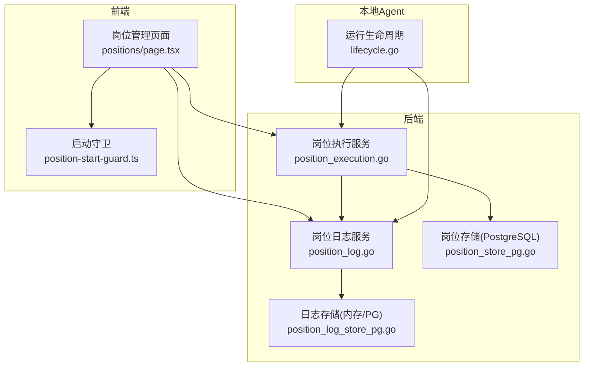
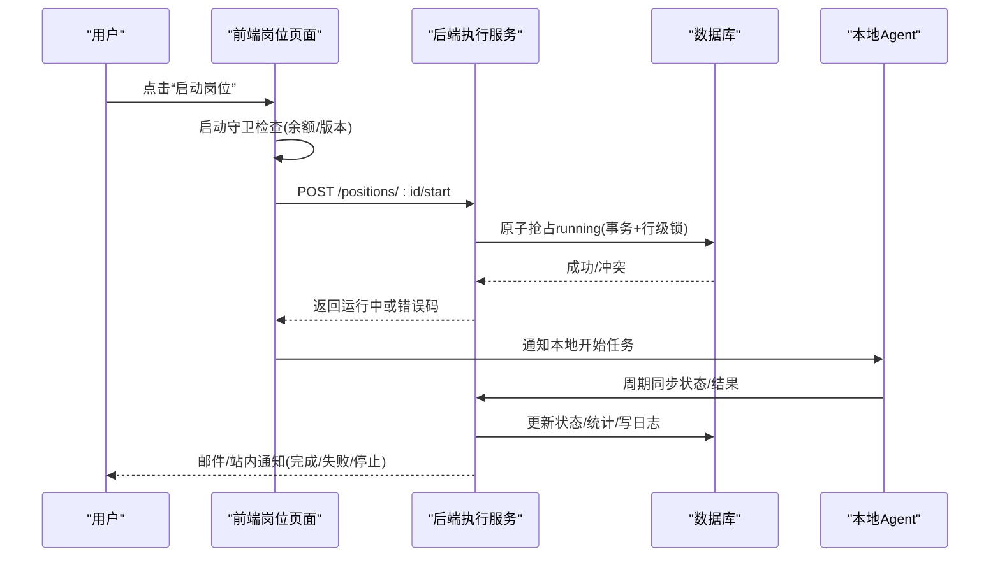
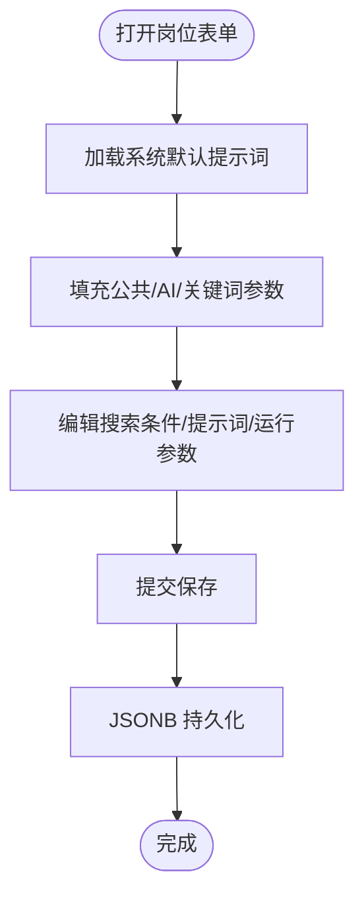
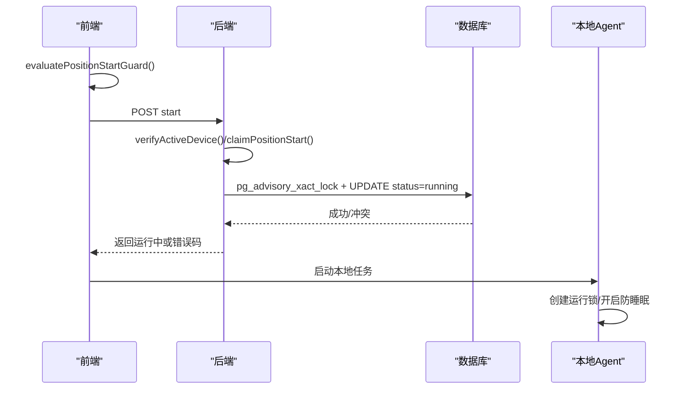
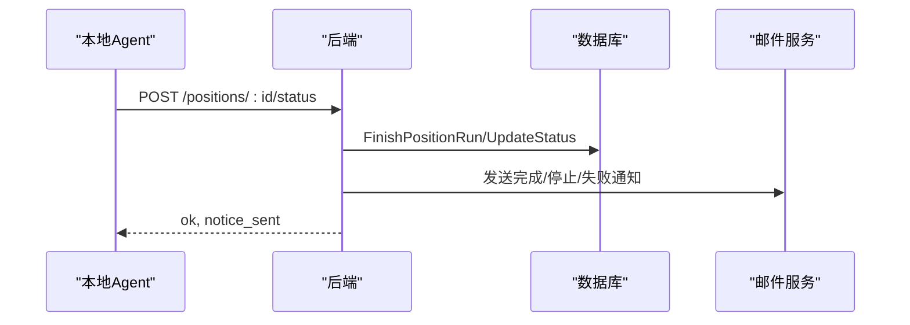
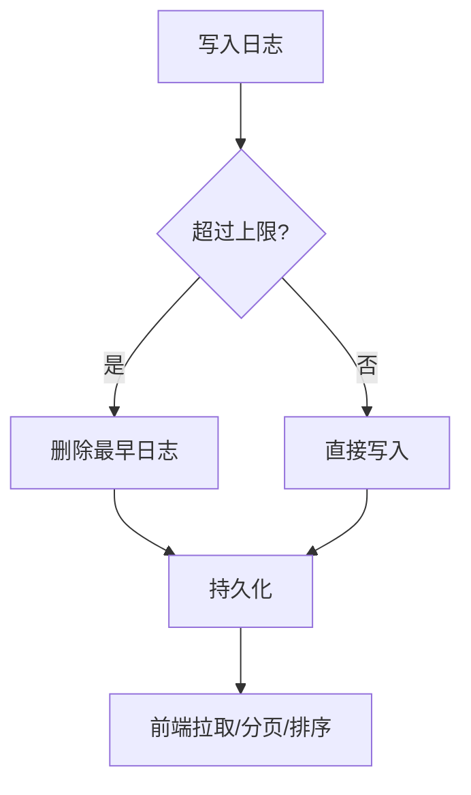
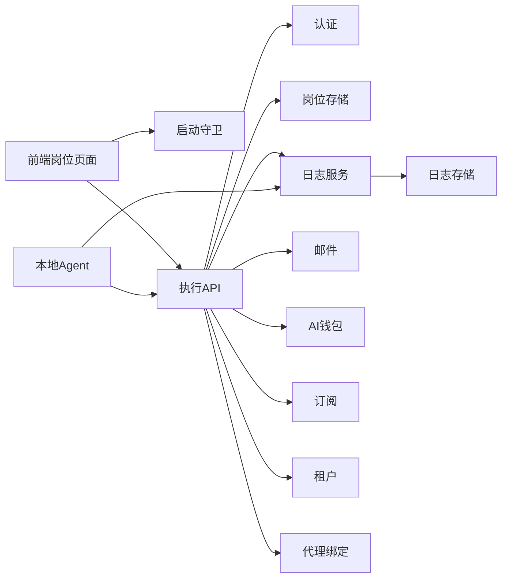

# 岗位配置管理

<cite>
**本文引用的文件**
- [position_execution.go](file://goodhr5/cloud/backend/internal/httpapi/position_execution.go)
- [position_log.go](file://goodhr5/cloud/backend/internal/httpapi/position_log.go)
- [position_store_pg.go](file://goodhr5/cloud/backend/internal/httpapi/position_store_pg.go)
- [position_log_store_pg.go](file://goodhr5/cloud/backend/internal/httpapi/position_log_store_pg.go)
- [position_start_guard.ts](file://goodhr5/cloud/frontend-next/lib/position-start-guard.ts)
- [positions/page.tsx](file://goodhr5/cloud/frontend-next/app/admin/positions/page.tsx)
- [0009_position_template_configs.sql](file://goodhr5/cloud/backend/db/migrations/0009_position_template_configs.sql)
- [0034_position_platform_id.sql](file://goodhr5/cloud/backend/db/migrations/0034_position_platform_id.sql)
- [0012_platform_locator_schema.sql](file://goodhr5/cloud/backend/db/migrations/0012_platform_locator_schema.sql)
- [lifecycle.go](file://goodhr5/local-agent-go/internal/positionrunner/lifecycle.go)
</cite>

## 目录
1. [简介](#简介)
2. [项目结构](#项目结构)
3. [核心组件](#核心组件)
4. [架构总览](#架构总览)
5. [详细组件分析](#详细组件分析)
6. [依赖关系分析](#依赖关系分析)
7. [性能与容量](#性能与容量)
8. [故障排查指南](#故障排查指南)
9. [结论](#结论)
10. [附录：平台配置示例](#附录平台配置示例)

## 简介
本文件面向“岗位配置管理”功能，覆盖从创建、编辑、启动、停止到监控、日志、异常处理的完整生命周期；详细说明岗位配置表单（搜索条件、AI 提示词、运行参数）、状态监控、执行日志、异常处理机制；提供不同招聘平台的岗位规则配置示例；解释岗位启动守卫机制与资源分配策略；并说明批量操作、模板管理与版本控制等高级能力。

## 项目结构
岗位配置管理涉及前后端协同：
- 前端 Next.js 管理页面负责岗位模板的新增、编辑、保存、启动/停止、日志查看、状态监控与启动前校验。
- 后端 Go API 负责岗位配置的持久化、启动守卫、状态同步、日志聚合与通知。
- 本地 Agent 负责实际浏览器自动化执行、运行锁、防休眠保护、进度上报与失败通知。

图表来源
- [positions/page.tsx:1-2027](file://goodhr5/cloud/frontend-next/app/admin/positions/page.tsx#L1-L2027)
- [position_start_guard.ts:1-110](file://goodhr5/cloud/frontend-next/lib/position-start-guard.ts#L1-L110)
- [position_execution.go:1-468](file://goodhr5/cloud/backend/internal/httpapi/position_execution.go#L1-L468)
- [position_log.go:1-303](file://goodhr5/cloud/backend/internal/httpapi/position_log.go#L1-L303)
- [position_store_pg.go:1-200](file://goodhr5/cloud/backend/internal/httpapi/position_store_pg.go#L1-L200)
- [position_log_store_pg.go:172-235](file://goodhr5/cloud/backend/internal/httpapi/position_log_store_pg.go#L172-L235)
- [lifecycle.go:40-71](file://goodhr5/local-agent-go/internal/positionrunner/lifecycle.go#L40-L71)

章节来源
- [positions/page.tsx:1-2027](file://goodhr5/cloud/frontend-next/app/admin/positions/page.tsx#L1-L2027)
- [position_execution.go:1-468](file://goodhr5/cloud/backend/internal/httpapi/position_execution.go#L1-L468)
- [position_log.go:1-303](file://goodhr5/cloud/backend/internal/httpapi/position_log.go#L1-L303)
- [position_store_pg.go:1-200](file://goodhr5/cloud/backend/internal/httpapi/position_store_pg.go#L1-L200)
- [position_log_store_pg.go:172-235](file://goodhr5/cloud/backend/internal/httpapi/position_log_store_pg.go#L172-L235)
- [lifecycle.go:40-71](file://goodhr5/local-agent-go/internal/positionrunner/lifecycle.go#L40-L71)

## 核心组件
- 岗位模板与配置
  - 公共参数、AI 专属参数、关键词模式参数分别以 JSONB 字段存储，支持多平台差异化配置。
- 启动守卫
  - 前端检查 AI 余额与本地程序版本；后端校验设备绑定、会员权限、AI 余额与账号并发限制。
- 执行与状态同步
  - 本地 Agent 启动后周期性同步状态；云端更新岗位状态、统计计数、发送完成/失败通知。
- 日志与监控
  - 日志按岗位维度写入与分页查询，自动裁剪旧日志；前端实时展示最新日志与汇总指标。
- 平台适配
  - 通过系统配置定义各平台元素定位、动作按钮、详情页行为等，便于扩展新平台。

章节来源
- [0009_position_template_configs.sql:1-10](file://goodhr5/cloud/backend/db/migrations/0009_position_template_configs.sql#L1-L10)
- [position_start_guard.ts:1-110](file://goodhr5/cloud/frontend-next/lib/position-start-guard.ts#L1-L110)
- [position_execution.go:49-91](file://goodhr5/cloud/backend/internal/httpapi/position_execution.go#L49-L91)
- [position_log.go:56-164](file://goodhr5/cloud/backend/internal/httpapi/position_log.go#L56-L164)
- [0012_platform_locator_schema.sql:1-88](file://goodhr5/cloud/backend/db/migrations/0012_platform_locator_schema.sql#L1-L88)

## 架构总览
岗位生命周期由前端触发、后端守卫、本地执行、云端同步闭环组成。

图表来源
- [position_execution.go:49-91](file://goodhr5/cloud/backend/internal/httpapi/position_execution.go#L49-L91)
- [position_store_pg.go:338-380](file://goodhr5/cloud/backend/internal/httpapi/position_store_pg.go#L338-L380)
- [lifecycle.go:40-71](file://goodhr5/local-agent-go/internal/positionrunner/lifecycle.go#L40-L71)

## 详细组件分析

### 岗位模板与配置表单
- 数据模型
  - 公共参数 common_config：基础筛选模式、详情模式、声音开关、思考开关、延迟等。
  - AI 参数 ai_config：岗位要求、过滤/打开详情/打招呼/评分提示词、阈值等。
  - 关键词参数 keyword_config：关键词匹配行为、详情打开概率等。
- 表单设计要点
  - 搜索条件：关键词、排除关键词、是否 AND 模式、匹配上限等。
  - AI 提示词：过滤、打开详情、打招呼、评分等提示词可独立配置，未填写时回退系统默认值。
  - 运行参数：声音、思考、扫描轮数、批次数、请求电话/微信/简历开关等。
  - 平台选择：platform_id 指定所属平台，影响默认行为与定位器。
- 保存与回显
  - 保存时将 JSON 序列化至对应 JSONB 列；读取时反序列化为对象供前端渲染。

图表来源
- [0009_position_template_configs.sql:1-10](file://goodhr5/cloud/backend/db/migrations/0009_position_template_configs.sql#L1-L10)
- [position_store_pg.go:111-200](file://goodhr5/cloud/backend/internal/httpapi/position_store_pg.go#L111-L200)
- [positions/page.tsx:299-329](file://goodhr5/cloud/frontend-next/app/admin/positions/page.tsx#L299-L329)

章节来源
- [0009_position_template_configs.sql:1-10](file://goodhr5/cloud/backend/db/migrations/0009_position_template_configs.sql#L1-L10)
- [position_store_pg.go:111-200](file://goodhr5/cloud/backend/internal/httpapi/position_store_pg.go#L111-L200)
- [positions/page.tsx:299-329](file://goodhr5/cloud/frontend-next/app/admin/positions/page.tsx#L299-L329)

### 启动守卫机制与资源分配
- 前端守卫
  - 若岗位使用 AI，则检查 AI 钱包余额不低于最低阈值；检查本地程序版本不低于要求版本；否则阻止启动并提示。
- 后端守卫
  - 校验登录会话、设备绑定、会员权限、自动回复权限、AI 余额；同一账号仅允许一个 running 岗位；通过后原子更新为 running。
- 资源分配
  - 通过数据库事务与 PG 应用级锁保证并发安全；本地 Agent 启动时建立运行锁与防休眠保护，避免重复启动与系统休眠导致中断。

图表来源
- [position_start_guard.ts:23-59](file://goodhr5/cloud/frontend-next/lib/position-start-guard.ts#L23-L59)
- [position_execution.go:215-275](file://goodhr5/cloud/backend/internal/httpapi/position_execution.go#L215-L275)
- [position_store_pg.go:338-380](file://goodhr5/cloud/backend/internal/httpapi/position_store_pg.go#L338-L380)
- [lifecycle.go:40-71](file://goodhr5/local-agent-go/internal/positionrunner/lifecycle.go#L40-L71)

章节来源
- [position_start_guard.ts:1-110](file://goodhr5/cloud/frontend-next/lib/position-start-guard.ts#L1-L110)
- [position_execution.go:215-275](file://goodhr5/cloud/backend/internal/httpapi/position_execution.go#L215-L275)
- [position_store_pg.go:338-380](file://goodhr5/cloud/backend/internal/httpapi/position_store_pg.go#L338-L380)
- [lifecycle.go:40-71](file://goodhr5/local-agent-go/internal/positionrunner/lifecycle.go#L40-L71)

### 执行与状态监控
- 状态同步
  - 本地 Agent 定期上报 running/completed/stopped 状态及本轮打招呼/跳过数量；后端根据状态变化更新数据库、追加日志、发送邮件通知。
- 前端监控
  - 列表页显示岗位状态、最近统计、展开日志；支持查看全部日志、复制日志、悬浮小窗跟踪任务进度。
- 通知
  - 完成/停止/失败均会发送邮件提醒，包含今日打招呼数、本轮统计与错误信息。

图表来源
- [position_execution.go:125-213](file://goodhr5/cloud/backend/internal/httpapi/position_execution.go#L125-L213)
- [position_log.go:123-164](file://goodhr5/cloud/backend/internal/httpapi/position_log.go#L123-L164)

章节来源
- [position_execution.go:125-213](file://goodhr5/cloud/backend/internal/httpapi/position_execution.go#L125-L213)
- [position_log.go:123-164](file://goodhr5/cloud/backend/internal/httpapi/position_log.go#L123-L164)
- [positions/page.tsx:977-1008](file://goodhr5/cloud/frontend-next/app/admin/positions/page.tsx#L977-L1008)

### 执行日志查看与异常处理
- 日志写入
  - 后端提供写入接口，按岗位和用户隔离；支持分页、时间范围过滤；写入前自动裁剪旧日志，保持单岗位日志量在阈值内。
- 日志展示
  - 前端按时间倒序展示，兼容新旧字段；支持全部日志导出与复制。
- 异常处理
  - 失败通知接口接收本地错误消息，归类原因并发送邮件；对“账号已在其他地方登录”等特殊错误将状态置为 stopped。

图表来源
- [position_log_store_pg.go:199-235](file://goodhr5/cloud/backend/internal/httpapi/position_log_store_pg.go#L199-L235)
- [position_log.go:70-121](file://goodhr5/cloud/backend/internal/httpapi/position_log.go#L70-L121)
- [position_execution.go:311-371](file://goodhr5/cloud/backend/internal/httpapi/position_execution.go#L311-L371)

章节来源
- [position_log_store_pg.go:199-235](file://goodhr5/cloud/backend/internal/httpapi/position_log_store_pg.go#L199-L235)
- [position_log.go:70-121](file://goodhr5/cloud/backend/internal/httpapi/position_log.go#L70-L121)
- [position_execution.go:311-371](file://goodhr5/cloud/backend/internal/httpapi/position_execution.go#L311-L371)

### 批量操作、模板管理与版本控制
- 批量操作
  - 前端支持批量启动/停止、批量展开日志、批量复制日志；列表页支持刷新、排序与筛选。
- 模板管理
  - 岗位即模板，支持新建、编辑、复制（通过表单复用）；公共/AI/关键词参数可独立维护，便于跨岗位复用。
- 版本控制
  - 前端启动守卫强制本地程序版本不低于要求版本；后端通过系统配置下发最低版本要求，确保兼容性。

章节来源
- [positions/page.tsx:1-2027](file://goodhr5/cloud/frontend-next/app/admin/positions/page.tsx#L1-L2027)
- [position_start_guard.ts:11-21](file://goodhr5/cloud/frontend-next/lib/position-start-guard.ts#L11-L21)

### 平台特定岗位规则示例
- Boss 直聘
  - platform_id 为 boss；详情模式固定 OCR；可通过系统配置定义卡片、动作按钮、详情页定位器。
- 智联招聘
  - platform_id 为 zhaopin；详情页行为需翻页关闭；动作按钮与详情目标通过系统配置声明。
- 猎聘猎头端
  - platform_id 为 hliepin；选择器随平台改版通过迁移脚本刷新；支持快捷搜索与隐藏已查看/已联系等选项。

章节来源
- [0034_position_platform_id.sql:1-11](file://goodhr5/cloud/backend/db/migrations/0034_position_platform_id.sql#L1-L11)
- [0012_platform_locator_schema.sql:1-88](file://goodhr5/cloud/backend/db/migrations/0012_platform_locator_schema.sql#L1-L88)
- [0065_refresh_hliepin_2026_selectors.sql:1-25](file://goodhr5/cloud/backend/db/migrations/0065_refresh_hliepin_2026_selectors.sql#L1-L25)

## 依赖关系分析
- 前端依赖
  - 岗位管理页面依赖启动守卫工具函数进行前置校验；依赖平台标识与图标用于 UI 展示。
- 后端依赖
  - 执行服务依赖认证、租户、账户、订阅、钱包、邮件、日志、用户流、代理等组件；存储层依赖 PostgreSQL。
- 本地 Agent 依赖
  - 运行生命周期依赖数据库、日志、通知、电源抑制等子系统。

图表来源
- [position_execution.go:21-47](file://goodhr5/cloud/backend/internal/httpapi/position_execution.go#L21-L47)
- [position_log.go:13-34](file://goodhr5/cloud/backend/internal/httpapi/position_log.go#L13-L34)
- [position_store_pg.go:13-21](file://goodhr5/cloud/backend/internal/httpapi/position_store_pg.go#L13-L21)

章节来源
- [position_execution.go:21-47](file://goodhr5/cloud/backend/internal/httpapi/position_execution.go#L21-L47)
- [position_log.go:13-34](file://goodhr5/cloud/backend/internal/httpapi/position_log.go#L13-L34)
- [position_store_pg.go:13-21](file://goodhr5/cloud/backend/internal/httpapi/position_store_pg.go#L13-L21)

## 性能与容量
- 日志裁剪
  - 写入前计算当前岗位日志数量，超过阈值则删除最早日志，避免无限增长。
- 并发控制
  - 使用 PG 应用级锁与事务原子更新 running 状态，防止同一账号并发启动多个岗位。
- 查询优化
  - 日志列表支持 since/before/limit 分页；默认限制与最大限制保护后端负载。
- 本地运行锁
  - 本地 Agent 启动时建立运行锁与防休眠保护，减少重复启动与系统休眠导致的失败。

章节来源
- [position_log_store_pg.go:199-235](file://goodhr5/cloud/backend/internal/httpapi/position_log_store_pg.go#L199-L235)
- [position_store_pg.go:338-380](file://goodhr5/cloud/backend/internal/httpapi/position_store_pg.go#L338-L380)
- [position_log.go:205-240](file://goodhr5/cloud/backend/internal/httpapi/position_log.go#L205-L240)
- [lifecycle.go:40-71](file://goodhr5/local-agent-go/internal/positionrunner/lifecycle.go#L40-L71)

## 故障排查指南
- 启动失败常见原因
  - 设备未绑定：返回 DEVICE_BINDING_REQUIRED，需刷新后台并完成设备绑定。
  - 会员/自动回复权限不足：返回 SUBSCRIPTION_REQUIRED 或 AUTO_REPLY_MAX_REQUIRED，需升级套餐。
  - AI 余额不足：返回 AI_BALANCE_INSUFFICIENT，需充值。
  - 并发冲突：返回 POSITION_TASK_CONFLICT，需先停止已有任务。
- 运行中异常
  - 本地 Agent 上报失败消息，后端归类原因并发送邮件；可在岗位日志中查看详细信息。
- 日志问题
  - 若日志缺失，确认是否被裁剪；可通过“查看全部日志”导出排查。
- 版本不兼容
  - 前端检测到本地程序版本过低，阻止启动并提示更新；请按提示更新本地程序后重试。

章节来源
- [position_execution.go:215-275](file://goodhr5/cloud/backend/internal/httpapi/position_execution.go#L215-L275)
- [position_execution.go:311-371](file://goodhr5/cloud/backend/internal/httpapi/position_execution.go#L311-L371)
- [position_log.go:205-240](file://goodhr5/cloud/backend/internal/httpapi/position_log.go#L205-L240)
- [position_start_guard.ts:23-59](file://goodhr5/cloud/frontend-next/lib/position-start-guard.ts#L23-L59)

## 结论
岗位配置管理通过“前端守卫 + 后端校验 + 本地执行 + 云端同步”的闭环实现稳定可靠的自动化招聘流程。模板化的 JSONB 配置使不同平台具备一致的扩展方式；启动守卫与并发控制保障资源合理分配；完善的日志与通知体系提升可观测性与可运维性。建议在生产环境结合平台配置变更与版本发布节奏，持续优化提示词与定位器，确保长期稳定性。

## 附录：平台配置示例
- Boss 直聘
  - 平台标识：boss
  - 详情模式：OCR
  - 元素定位：通过系统配置定义卡片、动作按钮、详情页目标
- 智联招聘
  - 平台标识：zhaopin
  - 详情页行为：需要翻页关闭
  - 动作与详情：通过系统配置声明
- 猎聘猎头端
  - 平台标识：hliepin
  - 选择器：随平台改版通过迁移脚本刷新
  - 快捷搜索：支持隐藏已查看/已联系/已获取联系方式等选项

章节来源
- [0034_position_platform_id.sql:1-11](file://goodhr5/cloud/backend/db/migrations/0034_position_platform_id.sql#L1-L11)
- [0012_platform_locator_schema.sql:1-88](file://goodhr5/cloud/backend/db/migrations/0012_platform_locator_schema.sql#L1-L88)
- [0065_refresh_hliepin_2026_selectors.sql:1-25](file://goodhr5/cloud/backend/db/migrations/0065_refresh_hliepin_2026_selectors.sql#L1-L25)