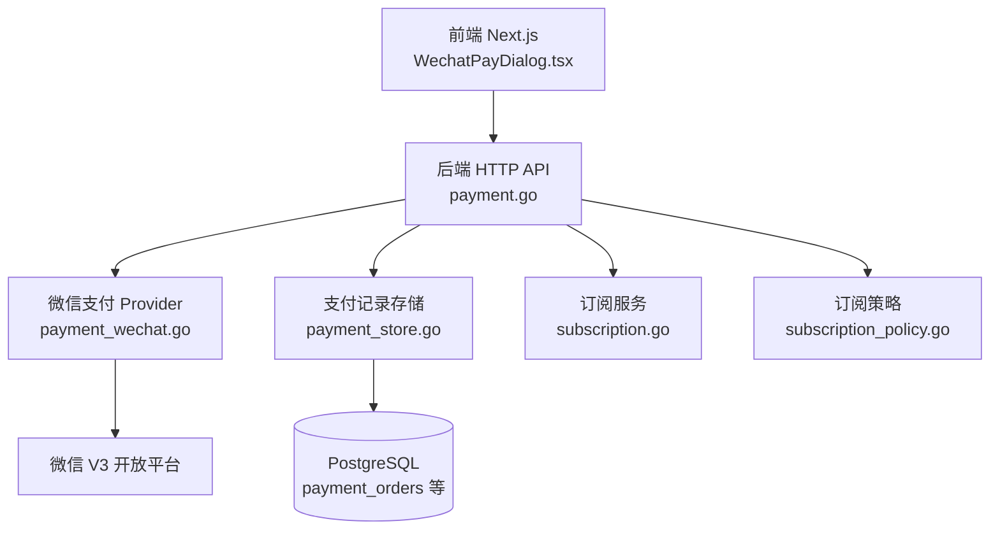
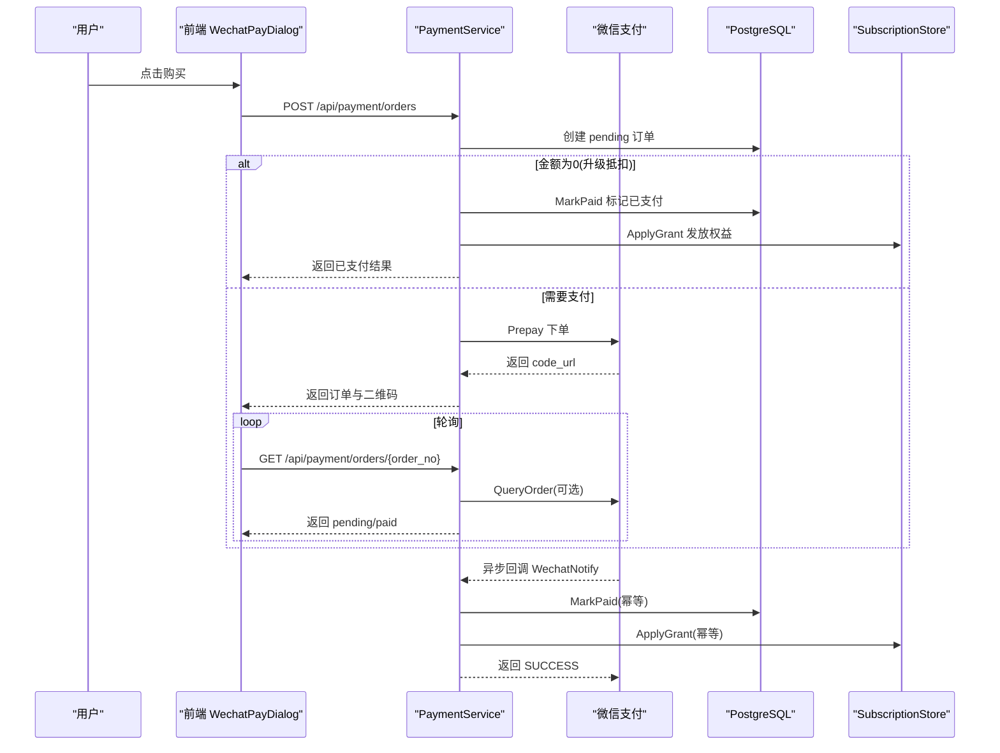
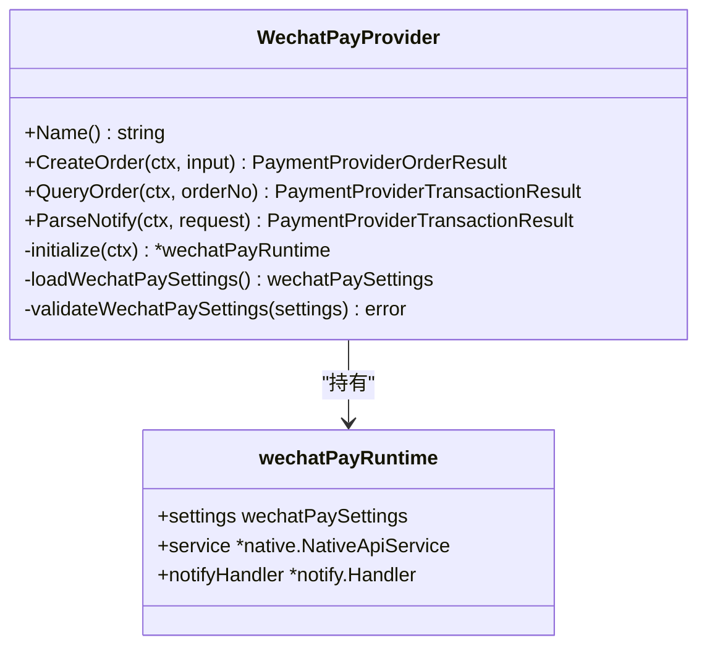
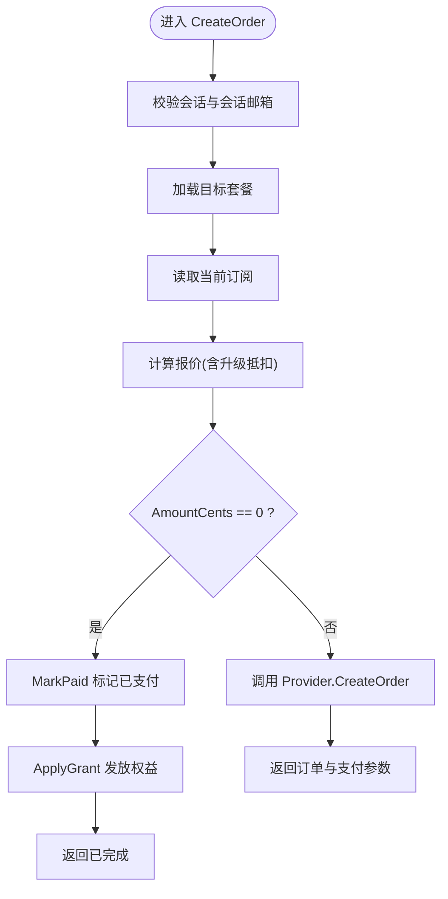
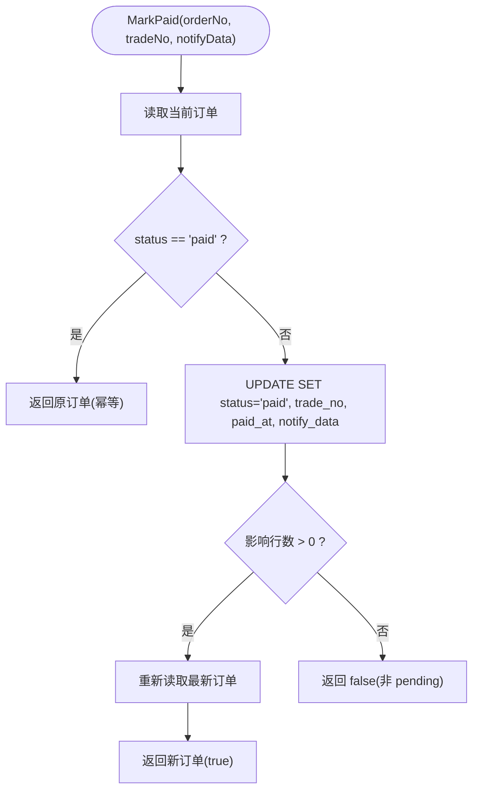
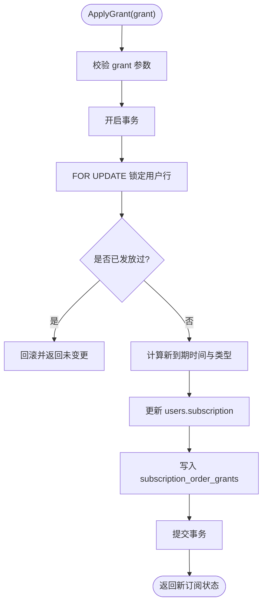
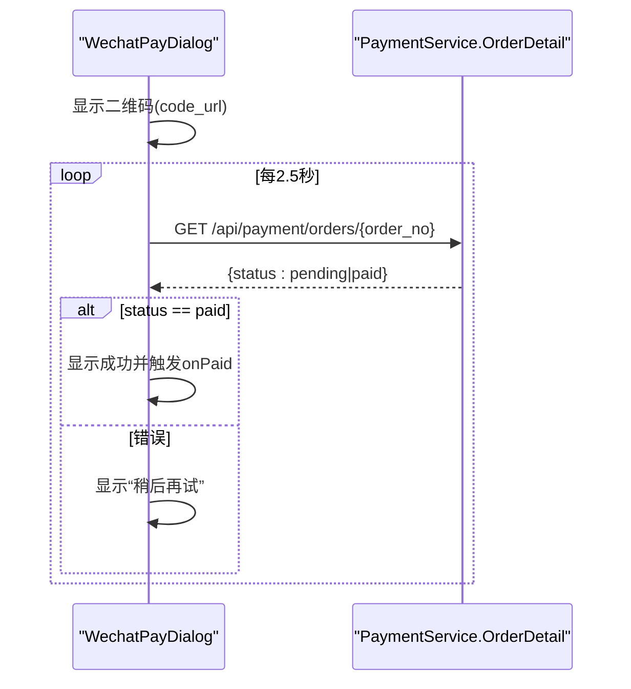
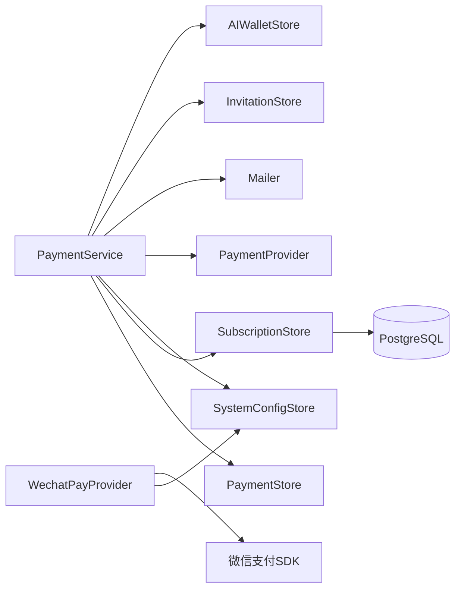

# 支付系统集成

<cite>
**本文引用的文件**
- [payment.go](file://goodhr5/cloud/backend/internal/httpapi/payment.go)
- [payment_wechat.go](file://goodhr5/cloud/backend/internal/httpapi/payment_wechat.go)
- [payment_store.go](file://goodhr5/cloud/backend/internal/httpapi/payment_store.go)
- [payment_provider.go](file://goodhr5/cloud/backend/internal/httpapi/payment_provider.go)
- [subscription.go](file://goodhr5/cloud/backend/internal/httpapi/subscription.go)
- [subscription_policy.go](file://goodhr5/cloud/backend/internal/httpapi/subscription_policy.go)
- [WechatPayDialog.tsx](file://goodhr5/cloud/frontend-next/components/payment/WechatPayDialog.tsx)
- [0023_payment_orders.sql](file://goodhr5/cloud/backend/db/migrations/0023_payment_orders.sql)
- [0074_wechat_payment_provider.sql](file://goodhr5/cloud/backend/db/migrations/0074_wechat_payment_provider.sql)
- [0075_system_payment_wechat.sql](file://goodhr5/cloud/backend/db/migrations/0075_system_payment_wechat.sql)
</cite>

## 目录
1. [简介](#简介)
2. [项目结构](#项目结构)
3. [核心组件](#核心组件)
4. [架构总览](#架构总览)
5. [详细组件分析](#详细组件分析)
6. [依赖关系分析](#依赖关系分析)
7. [性能与可靠性](#性能与可靠性)
8. [故障排查指南](#故障排查指南)
9. [结论](#结论)
10. [附录：API 与数据模型](#附录api-与数据模型)

## 简介
本文件面向“HRPlus”云端的支付系统集成，重点说明微信支付 Native 扫码支付的完整流程、订单创建、支付状态监听、回调处理机制；并覆盖订阅套餐管理、支付记录查询、退款能力现状与扩展建议。文档同时给出安全考虑、防重复提交与幂等性保证策略，提供前端对话框交互示例与不同支付方式集成要点，解释订阅策略控制（免费试用、付费升级、自动续费）以及失败处理、超时重试、错误提示等用户体验优化措施。

## 项目结构
后端采用 Go 语言 HTTP API，支付相关逻辑集中在 httpapi 包中：
- 统一支付服务与业务编排：payment.go
- 微信支付 Provider 实现：payment_wechat.go
- 支付记录存储抽象与内存/PostgreSQL 实现：payment_store.go
- 支付平台通用接口与数据结构：payment_provider.go
- 订阅管理与权限计算：subscription.go、subscription_policy.go
- 前端微信支付对话框：WechatPayDialog.tsx
- 数据库迁移：payment_orders 表及微信支付系统配置

图表来源
- [payment.go:68-189](file://goodhr5/cloud/backend/internal/httpapi/payment.go#L68-L189)
- [payment_wechat.go:69-137](file://goodhr5/cloud/backend/internal/httpapi/payment_wechat.go#L69-L137)
- [payment_store.go:13-50](file://goodhr5/cloud/backend/internal/httpapi/payment_store.go#L13-L50)
- [subscription.go:50-119](file://goodhr5/cloud/backend/internal/httpapi/subscription.go#L50-L119)
- [subscription_policy.go:45-142](file://goodhr5/cloud/backend/internal/httpapi/subscription_policy.go#L45-L142)
- [WechatPayDialog.tsx:45-93](file://goodhr5/cloud/frontend-next/components/payment/WechatPayDialog.tsx#L45-L93)

章节来源
- [payment.go:1-623](file://goodhr5/cloud/backend/internal/httpapi/payment.go#L1-L623)
- [payment_wechat.go:1-310](file://goodhr5/cloud/backend/internal/httpapi/payment_wechat.go#L1-L310)
- [payment_store.go:1-312](file://goodhr5/cloud/backend/internal/httpapi/payment_store.go#L1-L312)
- [payment_provider.go:1-70](file://goodhr5/cloud/backend/internal/httpapi/payment_provider.go#L1-L70)
- [subscription.go:1-506](file://goodhr5/cloud/backend/internal/httpapi/subscription.go#L1-L506)
- [subscription_policy.go:1-209](file://goodhr5/cloud/backend/internal/httpapi/subscription_policy.go#L1-L209)
- [WechatPayDialog.tsx:1-145](file://goodhr5/cloud/frontend-next/components/payment/WechatPayDialog.tsx#L1-L145)
- [0023_payment_orders.sql:1-48](file://goodhr5/cloud/backend/db/migrations/0023_payment_orders.sql#L1-L48)
- [0074_wechat_payment_provider.sql:1-6](file://goodhr5/cloud/backend/db/migrations/0074_wechat_payment_provider.sql#L1-L6)
- [0075_system_payment_wechat.sql:1-19](file://goodhr5/cloud/backend/db/migrations/0075_system_payment_wechat.sql#L1-L19)

## 核心组件
- PaymentService：统一编排订阅订单创建、AI 余额充值、支付记录查询、微信支付回调处理与到账权益发放。
- WechatPayProvider：封装微信支付 V3 Native 下单、主动查单、回调验签解密，配置从系统配置表读取并热更新。
- PaymentStore：定义支付记录持久化接口，提供内存与 PostgreSQL 两种实现，支持幂等 MarkPaid。
- SubscriptionService/Policy：订阅状态查询、套餐列表、权限计算、会员权益发放与幂等控制。
- WechatPayDialog：前端展示二维码、轮询订单状态、支付成功回调父页面刷新。

章节来源
- [payment.go:34-65](file://goodhr5/cloud/backend/internal/httpapi/payment.go#L34-L65)
- [payment_wechat.go:51-67](file://goodhr5/cloud/backend/internal/httpapi/payment_wechat.go#L51-L67)
- [payment_store.go:38-50](file://goodhr5/cloud/backend/internal/httpapi/payment_store.go#L38-L50)
- [subscription.go:18-48](file://goodhr5/cloud/backend/internal/httpapi/subscription.go#L18-L48)
- [subscription_policy.go:18-43](file://goodhr5/cloud/backend/internal/httpapi/subscription_policy.go#L18-L43)
- [WechatPayDialog.tsx:20-43](file://goodhr5/cloud/frontend-next/components/payment/WechatPayDialog.tsx#L20-L43)

## 架构总览
支付主流程（用户购买订阅）：
1. 前端调用后端创建订阅订单，后端校验套餐与当前订阅，计算实际应付金额，写入待支付订单。
2. 若金额为 0（如 Plus 升级 Max 的抵扣），直接标记已支付并应用权益。
3. 否则调用微信支付 Native 下单，返回二维码链接给前端。
4. 前端展示二维码并每 2.5 秒轮询订单详情，直到状态为已支付。
5. 微信支付异步回调通知后端，后端验签、校验金额与归属，标记订单已支付并应用权益。
6. 若为 AI 余额充值，则调整钱包余额；若为订阅，则延长或切换会员类型并发送邮件通知。

图表来源
- [payment.go:79-189](file://goodhr5/cloud/backend/internal/httpapi/payment.go#L79-L189)
- [payment.go:341-405](file://goodhr5/cloud/backend/internal/httpapi/payment.go#L341-L405)
- [payment_wechat.go:69-137](file://goodhr5/cloud/backend/internal/httpapi/payment_wechat.go#L69-L137)
- [payment_store.go:233-257](file://goodhr5/cloud/backend/internal/httpapi/payment_store.go#L233-L257)
- [subscription.go:401-459](file://goodhr5/cloud/backend/internal/httpapi/subscription.go#L401-L459)
- [WechatPayDialog.tsx:61-93](file://goodhr5/cloud/frontend-next/components/payment/WechatPayDialog.tsx#L61-L93)

## 详细组件分析

### 微信支付 Provider（Native）
- 配置热更新：每次请求前从 system.payment_wechat 读取配置，校验必填字段，生成签名指纹，变化时重建 SDK 客户端与回调处理器，修改后即时生效。
- 下单：调用 Native Prepay，设置 30 分钟过期时间，返回 code_url。
- 查单：按商户订单号查询交易状态，用于前端轮询时的兜底确认。
- 回调解析：使用官方 SDK 验签解密，校验 APPID、商户号、币种、交易类型、金额与流水号，转换为统一结果。

图表来源
- [payment_wechat.go:51-67](file://goodhr5/cloud/backend/internal/httpapi/payment_wechat.go#L51-L67)
- [payment_wechat.go:195-251](file://goodhr5/cloud/backend/internal/httpapi/payment_wechat.go#L195-L251)
- [payment_wechat.go:69-137](file://goodhr5/cloud/backend/internal/httpapi/payment_wechat.go#L69-L137)

章节来源
- [payment_wechat.go:1-310](file://goodhr5/cloud/backend/internal/httpapi/payment_wechat.go#L1-L310)

### 统一支付服务（PaymentService）
- 创建订阅订单：校验会话、加载套餐、计算报价（含 Plus→Max 升级抵扣）、写入 pending 订单、选择支付渠道。
- 零元订单：当 AmountCents 为 0（升级抵扣场景），直接 MarkPaid 并应用权益，立即完成。
- 发起支付：调用默认 Provider 创建第三方订单，返回订单与支付参数（code_url）。
- 支付记录查询：支持用户查看自己的订单、管理员查看所有订单；订单详情会主动查单以补偿未回调场景。
- 回调处理：验证 Provider、校验金额与归属、MarkPaid 幂等、应用权益（订阅或 AI 余额）。
- 邀请奖励：支付成功后根据配置向邀请人发放会员天数并邮件通知。

图表来源
- [payment.go:79-189](file://goodhr5/cloud/backend/internal/httpapi/payment.go#L79-L189)
- [payment.go:524-560](file://goodhr5/cloud/backend/internal/httpapi/payment.go#L524-L560)

章节来源
- [payment.go:68-189](file://goodhr5/cloud/backend/internal/httpapi/payment.go#L68-L189)
- [payment.go:261-339](file://goodhr5/cloud/backend/internal/httpapi/payment.go#L261-L339)
- [payment.go:341-485](file://goodhr5/cloud/backend/internal/httpapi/payment.go#L341-L485)

### 支付记录存储（PaymentStore）
- 内存实现：线程安全 map，支持 Create/ByOrderNo/ListByUser/ListAll/MarkPaid。
- PostgreSQL 实现：基于 payment_orders 表，MarkPaid 使用 UPDATE ... WHERE status='pending' 保证幂等；ListAll 限制 500 条避免大结果集。
- 安全 JSON：回调原始数据写入前做合法化，防止非法 JSON 破坏存储。

图表来源
- [payment_store.go:233-257](file://goodhr5/cloud/backend/internal/httpapi/payment_store.go#L233-L257)

章节来源
- [payment_store.go:13-50](file://goodhr5/cloud/backend/internal/httpapi/payment_store.go#L13-L50)
- [payment_store.go:137-312](file://goodhr5/cloud/backend/internal/httpapi/payment_store.go#L137-L312)
- [0023_payment_orders.sql:1-48](file://goodhr5/cloud/backend/db/migrations/0023_payment_orders.sql#L1-L48)

### 订阅管理与策略（SubscriptionService/Policy）
- 套餐配置：system.subscription_plans 必须包含 free、plus、max 三类，且价格与优惠合法。
- 权限计算：根据会员类型与到期时间计算 Active、RemainingDays、AllowAutoReply、Features。
- 权益发放：ApplyGrant 通过 order_no + grant_type 幂等发放，支持 Extend/Adjust/ReplaceFromNow 三种模式。
- 升级抵扣：Plus→Max 升级时，按剩余有效期折算抵扣金额，确保不超原价。

图表来源
- [subscription.go:401-459](file://goodhr5/cloud/backend/internal/httpapi/subscription.go#L401-L459)
- [subscription_policy.go:45-142](file://goodhr5/cloud/backend/internal/httpapi/subscription_policy.go#L45-L142)

章节来源
- [subscription.go:18-48](file://goodhr5/cloud/backend/internal/httpapi/subscription.go#L18-L48)
- [subscription.go:139-257](file://goodhr5/cloud/backend/internal/httpapi/subscription.go#L139-L257)
- [subscription_policy.go:18-43](file://goodhr5/cloud/backend/internal/httpapi/subscription_policy.go#L18-L43)
- [subscription_policy.go:111-142](file://goodhr5/cloud/backend/internal/httpapi/subscription_policy.go#L111-L142)

### 前端微信支付对话框（WechatPayDialog）
- 接收后端返回的 order_no 与 code_url，渲染二维码。
- 每 2.5 秒轮询订单详情，直到状态为 paid 或出现错误。
- 支付成功后调用 onPaid 回调，由父页面刷新或跳转。

图表来源
- [WechatPayDialog.tsx:61-93](file://goodhr5/cloud/frontend-next/components/payment/WechatPayDialog.tsx#L61-L93)
- [payment.go:295-339](file://goodhr5/cloud/backend/internal/httpapi/payment.go#L295-L339)

章节来源
- [WechatPayDialog.tsx:1-145](file://goodhr5/cloud/frontend-next/components/payment/WechatPayDialog.tsx#L1-L145)

## 依赖关系分析
- PaymentService 依赖：AuthService、PaymentStore、SubscriptionStore、SystemConfigStore、InvitationStore、Mailer、AIWalletStore、PaymentProvider 集合。
- WechatPayProvider 依赖：SystemConfigStore、微信支付官方 SDK。
- SubscriptionStore 依赖：数据库（users、subscription_order_grants）。
- 前端依赖：Next.js、MUI、qrcode.react、cloudRequest 工具。

图表来源
- [payment.go:34-65](file://goodhr5/cloud/backend/internal/httpapi/payment.go#L34-L65)
- [payment_wechat.go:51-67](file://goodhr5/cloud/backend/internal/httpapi/payment_wechat.go#L51-L67)
- [subscription.go:261-302](file://goodhr5/cloud/backend/internal/httpapi/subscription.go#L261-L302)

章节来源
- [payment.go:34-65](file://goodhr5/cloud/backend/internal/httpapi/payment.go#L34-L65)
- [payment_wechat.go:51-67](file://goodhr5/cloud/backend/internal/httpapi/payment_wechat.go#L51-L67)
- [subscription.go:261-302](file://goodhr5/cloud/backend/internal/httpapi/subscription.go#L261-L302)

## 性能与可靠性
- 幂等性保障
  - 订单 MarkPaid：仅允许 pending→paid 转换，重复回调不会二次发放权益。
  - 订阅权益发放：通过 order_no + grant_type 唯一键去重，数据库层事务+锁保护。
- 超时与重试
  - 订单过期时间：创建时设置 30 分钟过期，前端轮询期间可结合后端主动查单。
  - 前端轮询：2.5 秒间隔，错误时继续重试，避免网络抖动导致漏检。
- 配置热更新
  - 微信支付配置变更时，Provider 内部通过签名指纹判断是否需要重建客户端，无需重启服务。
- 可扩展性
  - 支付 Provider 抽象清晰，新增支付方式只需实现统一接口并注册到 PaymentService。

章节来源
- [payment_store.go:233-257](file://goodhr5/cloud/backend/internal/httpapi/payment_store.go#L233-L257)
- [subscription.go:401-459](file://goodhr5/cloud/backend/internal/httpapi/subscription.go#L401-L459)
- [payment_wechat.go:195-251](file://goodhr5/cloud/backend/internal/httpapi/payment_wechat.go#L195-L251)
- [WechatPayDialog.tsx:61-93](file://goodhr5/cloud/frontend-next/components/payment/WechatPayDialog.tsx#L61-L93)

## 故障排查指南
- 常见错误与定位
  - 会话无效：检查登录态与 Cookie/Token。
  - 套餐不存在：确认 system.subscription_plans 配置是否包含目标 plan_id。
  - 支付渠道未配置：检查 system.payment_wechat 是否填写完整且有效。
  - 回调失败：核对微信回调验签、APPID/商户号/币种/交易类型匹配。
  - 金额不一致：核对订单金额与回调金额是否一致。
- 日志与观测
  - 后端日志：关注“支付”相关日志，包括主动查单失败、回调处理失败、权益发放失败等。
  - 前端状态：对话框内 waiting/checking/paid/error 状态切换，便于定位轮询问题。
- 恢复策略
  - 未回调订单：前端轮询时会主动查单，必要时可在后台增加定时对账任务。
  - 重复回调：幂等机制确保不会重复发放权益。

章节来源
- [payment.go:341-405](file://goodhr5/cloud/backend/internal/httpapi/payment.go#L341-L405)
- [payment_wechat.go:119-137](file://goodhr5/cloud/backend/internal/httpapi/payment_wechat.go#L119-L137)
- [payment_store.go:233-257](file://goodhr5/cloud/backend/internal/httpapi/payment_store.go#L233-L257)
- [WechatPayDialog.tsx:61-93](file://goodhr5/cloud/frontend-next/components/payment/WechatPayDialog.tsx#L61-L93)

## 结论
该支付系统以清晰的 Provider 抽象与统一的 PaymentService 编排，实现了微信支付 Native 扫码支付的完整闭环。通过幂等设计、配置热更新、前端轮询与后端主动查单，兼顾了可靠性与用户体验。订阅策略支持免费试用、付费升级与权益发放，具备扩展至更多支付方式的基础。退款功能当前未实现，建议在现有框架上扩展退款 Provider 与订单生命周期管理。

## 附录：API 与数据模型

### 主要 API
- 创建订阅订单：POST /api/payment/orders
- 创建 AI 余额充值订单：POST /api/payment/ai-balance
- 查询我的订单：GET /api/payment/orders
- 查询全部订单（管理员）：GET /api/admin/payment/orders
- 订单详情：GET /api/payment/orders/{order_no}
- 微信支付回调：POST /api/payment/wechat/notify

章节来源
- [payment.go:68-189](file://goodhr5/cloud/backend/internal/httpapi/payment.go#L68-L189)
- [payment.go:191-259](file://goodhr5/cloud/backend/internal/httpapi/payment.go#L191-L259)
- [payment.go:261-339](file://goodhr5/cloud/backend/internal/httpapi/payment.go#L261-L339)
- [payment.go:341-362](file://goodhr5/cloud/backend/internal/httpapi/payment.go#L341-L362)

### 数据模型（payment_orders）
- 关键字段：order_no、user_email、plan_id、member_type、duration_days、original_amount_cents、discount_amount_cents、amount_cents、payment_provider、trade_no、status、paid_at、expired_at、notify_data。
- 索引：user_id+created_at、status、user_email。

章节来源
- [0023_payment_orders.sql:1-48](file://goodhr5/cloud/backend/db/migrations/0023_payment_orders.sql#L1-L48)
- [0074_wechat_payment_provider.sql:1-6](file://goodhr5/cloud/backend/db/migrations/0074_wechat_payment_provider.sql#L1-L6)
- [0075_system_payment_wechat.sql:1-19](file://goodhr5/cloud/backend/db/migrations/0075_system_payment_wechat.sql#L1-L19)

### 支付安全与合规
- 回调验签：使用微信支付官方 SDK 进行签名验证与响应体解密。
- 金额校验：回调中严格比对订单金额与回调金额。
- 归属校验：校验 APPID、商户号、币种、交易类型。
- 幂等控制：MarkPaid 与 ApplyGrant 双重幂等，避免重复到账。
- 敏感配置：微信支付密钥与证书通过系统配置保存，按需 Base64 或直接 PEM 文本，运行时动态加载。

章节来源
- [payment_wechat.go:119-137](file://goodhr5/cloud/backend/internal/httpapi/payment_wechat.go#L119-L137)
- [payment_wechat.go:253-283](file://goodhr5/cloud/backend/internal/httpapi/payment_wechat.go#L253-L283)
- [payment_store.go:233-257](file://goodhr5/cloud/backend/internal/httpapi/payment_store.go#L233-L257)
- [subscription.go:401-459](file://goodhr5/cloud/backend/internal/httpapi/subscription.go#L401-L459)

### 退款处理（现状与建议）
- 现状：代码库中未发现退款相关 API 与 Provider 实现。
- 建议：在 PaymentProvider 接口上新增 RefundOrder 方法，实现微信支付退款流程；在 PaymentService 中增加退款订单与状态机；在前端增加退款申请与管理界面；遵循幂等与审计要求。

章节来源
- [payment_provider.go:10-20](file://goodhr5/cloud/backend/internal/httpapi/payment_provider.go#L10-L20)

### 订阅策略控制
- 免费试用：新用户默认创建试用订阅，具有有限时长与基础权限。
- 付费升级：Plus→Max 升级时按剩余有效期折算抵扣，确保不超原价。
- 自动续费：当前未实现自动扣款；可通过外部定时任务或用户授权续订流程扩展。

章节来源
- [subscription.go:139-169](file://goodhr5/cloud/backend/internal/httpapi/subscription.go#L139-L169)
- [payment.go:524-560](file://goodhr5/cloud/backend/internal/httpapi/payment.go#L524-L560)
- [subscription_policy.go:111-142](file://goodhr5/cloud/backend/internal/httpapi/subscription_policy.go#L111-L142)

### 用户体验优化
- 失败提示：前端在轮询失败时显示友好提示，并继续重试。
- 超时处理：订单过期后前端提示重新下单；后端订单详情可主动查单补偿。
- 成功反馈：支付成功后立即展示成功状态并触发后续操作（如刷新页面）。

章节来源
- [WechatPayDialog.tsx:61-93](file://goodhr5/cloud/frontend-next/components/payment/WechatPayDialog.tsx#L61-L93)
- [payment.go:295-339](file://goodhr5/cloud/backend/internal/httpapi/payment.go#L295-L339)