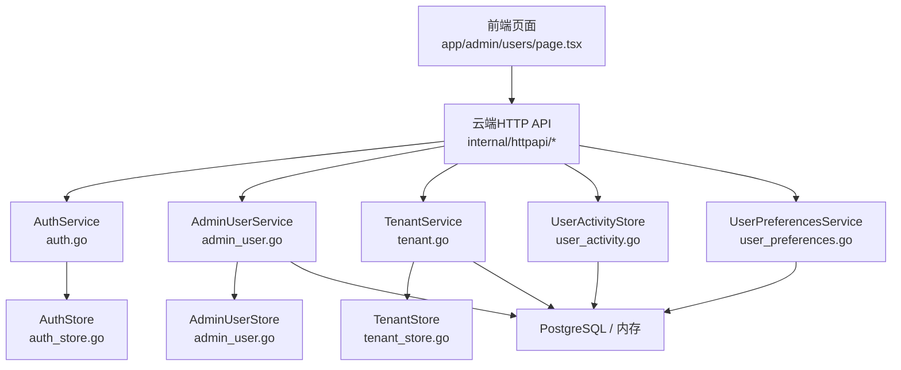
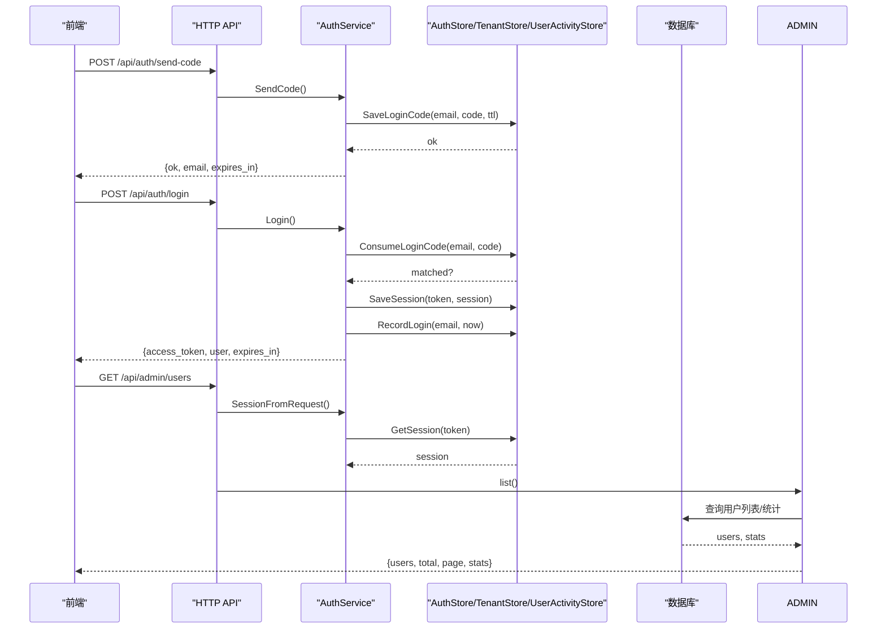
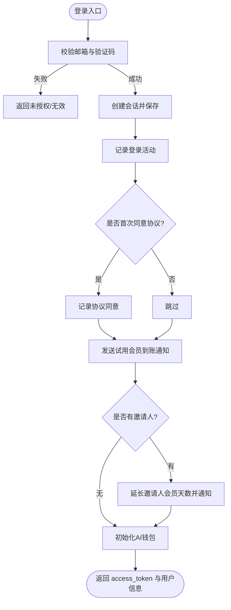
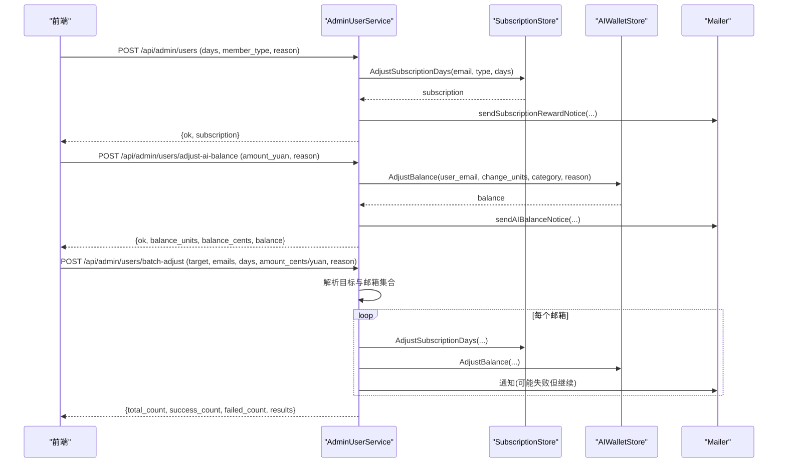
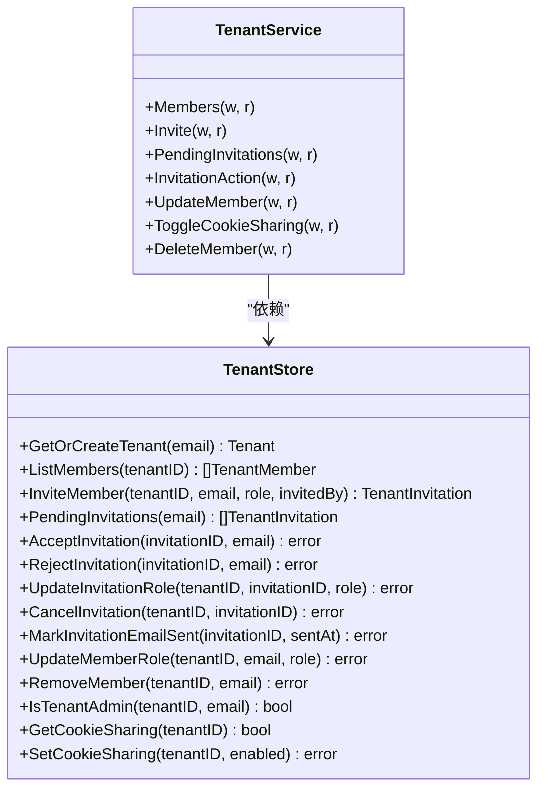
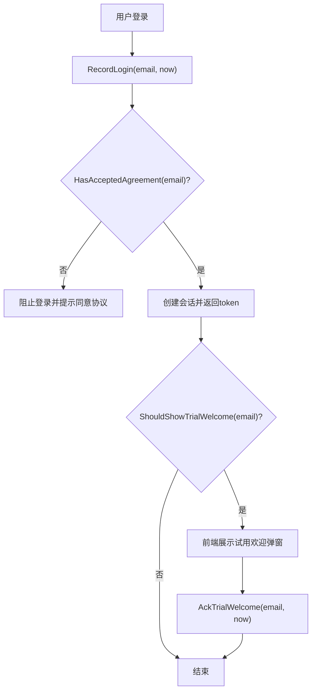
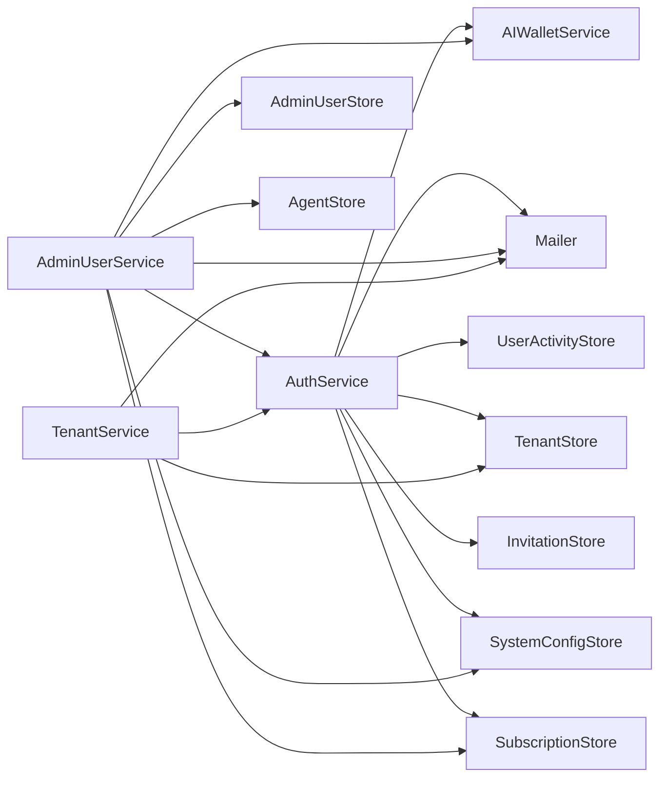

# 用户管理

<cite>
**本文引用的文件**
- [auth.go](file://goodhr5/cloud/backend/internal/httpapi/auth.go)
- [auth_store.go](file://goodhr5/cloud/backend/internal/httpapi/auth_store.go)
- [admin_user.go](file://goodhr5/cloud/backend/internal/httpapi/admin_user.go)
- [tenant.go](file://goodhr5/cloud/backend/internal/httpapi/tenant.go)
- [tenant_store.go](file://goodhr5/cloud/backend/internal/httpapi/tenant_store.go)
- [user_activity.go](file://goodhr5/cloud/backend/internal/httpapi/user_activity.go)
- [postgres_user.go](file://goodhr5/cloud/backend/internal/httpapi/postgres_user.go)
- [user_preferences.go](file://goodhr5/cloud/backend/internal/httpapi/user_preferences.go)
- [page.tsx](file://goodhr5/cloud/frontend-next/app/admin/users/page.tsx)
- [admin-api.ts](file://goodhr5/cloud/frontend-next/lib/admin-api.ts)
</cite>

## 目录
1. [简介](#简介)
2. [项目结构](#项目结构)
3. [核心组件](#核心组件)
4. [架构总览](#架构总览)
5. [详细组件分析](#详细组件分析)
6. [依赖关系分析](#依赖关系分析)
7. [性能与扩展性](#性能与扩展性)
8. [故障排查指南](#故障排查指南)
9. [结论](#结论)
10. [附录：API 参考与调用示例](#附录api-参考与调用示例)

## 简介
本文件面向 HRPlus 云端的“用户管理”能力，覆盖用户注册、登录验证、角色权限控制、用户列表展示与搜索、批量调整会员天数与 AI 余额、解绑本地程序设备、租户隔离与成员邀请、用户偏好设置、用户活动监控（登录时间、协议同意、试用欢迎弹窗）等。文档同时提供前后端交互流程、数据流与错误处理要点，并给出可直接使用的 API 调用示例路径。

## 项目结构
后端采用 Go 的 HTTP API 分层设计：认证服务、管理员用户管理、租户与成员、用户活动记录、用户偏好设置等模块通过 Store 接口抽象存储实现（内存/PostgreSQL），前端 Next.js 页面负责展示与交互，统一通过 admin-api.ts 发起请求。

图表来源
- [auth.go:21-68](file://goodhr5/cloud/backend/internal/httpapi/auth.go#L21-L68)
- [admin_user.go:114-127](file://goodhr5/cloud/backend/internal/httpapi/admin_user.go#L114-L127)
- [tenant.go:14-23](file://goodhr5/cloud/backend/internal/httpapi/tenant.go#L14-L23)
- [user_activity.go:11-23](file://goodhr5/cloud/backend/internal/httpapi/user_activity.go#L11-L23)
- [user_preferences.go:10-13](file://goodhr5/cloud/backend/internal/httpapi/user_preferences.go#L10-L13)
- [auth_store.go:11-23](file://goodhr5/cloud/backend/internal/httpapi/auth_store.go#L11-L23)
- [tenant_store.go:55-70](file://goodhr5/cloud/backend/internal/httpapi/tenant_store.go#L55-L70)

章节来源
- [auth.go:1-68](file://goodhr5/cloud/backend/internal/httpapi/auth.go#L1-L68)
- [admin_user.go:1-127](file://goodhr5/cloud/backend/internal/httpapi/admin_user.go#L1-L127)
- [tenant.go:1-23](file://goodhr5/cloud/backend/internal/httpapi/tenant.go#L1-L23)
- [user_activity.go:1-23](file://goodhr5/cloud/backend/internal/httpapi/user_activity.go#L1-L23)
- [user_preferences.go:1-13](file://goodhr5/cloud/backend/internal/httpapi/user_preferences.go#L1-L13)
- [auth_store.go:1-23](file://goodhr5/cloud/backend/internal/httpapi/auth_store.go#L1-L23)
- [tenant_store.go:1-70](file://goodhr5/cloud/backend/internal/httpapi/tenant_store.go#L1-L70)

## 核心组件
- 认证与会话：验证码登录、会话创建与校验、超管判定、邮箱白名单、万能验证码、邀请绑定奖励、AI 钱包初始化。
- 管理员用户管理：用户列表分页与搜索、统计信息、会员天数调整、AI 余额调整、批量调整、设备解绑。
- 租户与成员：团队创建/加入、成员邀请、待处理邀请、成员角色修改、移除成员、Cookie 共享开关。
- 用户活动：登录时间记录、协议同意状态、试用欢迎弹窗确认。
- 用户偏好：保存/读取用户行为参数（点击频率、滚动延迟、问候间隔等）。

章节来源
- [auth.go:71-214](file://goodhr5/cloud/backend/internal/httpapi/auth.go#L71-L214)
- [admin_user.go:129-397](file://goodhr5/cloud/backend/internal/httpapi/admin_user.go#L129-L397)
- [tenant.go:35-330](file://goodhr5/cloud/backend/internal/httpapi/tenant.go#L35-L330)
- [user_activity.go:11-171](file://goodhr5/cloud/backend/internal/httpapi/user_activity.go#L11-L171)
- [user_preferences.go:45-103](file://goodhr5/cloud/backend/internal/httpapi/user_preferences.go#L45-L103)

## 架构总览
用户管理的整体流程如下：
- 前端通过 admin-api.ts 统一封装请求，携带 Bearer Token 访问后端。
- 认证服务校验会话与权限，必要时联动租户、订阅、邮件、AI 钱包等子系统。
- 管理员操作由 AdminUserService 路由到具体业务逻辑，并通过 Store 层持久化。
- 租户服务维护团队与成员关系，支持邀请、角色变更、成员移除等。
- 用户活动与偏好分别独立存储，用于运营分析与个性化体验。

图表来源
- [auth.go:71-214](file://goodhr5/cloud/backend/internal/httpapi/auth.go#L71-L214)
- [auth_store.go:45-113](file://goodhr5/cloud/backend/internal/httpapi/auth_store.go#L45-L113)
- [admin_user.go:151-189](file://goodhr5/cloud/backend/internal/httpapi/admin_user.go#L151-L189)

## 详细组件分析

### 认证与会话（注册/登录/权限）
- 发送验证码：校验邮箱域名白名单，生成随机4位验证码，保存并发送邮件；可选调试模式返回验证码。
- 登录：校验验证码，创建会话，记录登录活动，首次登录可赠送试用会员并通知，绑定邀请人并发放奖励，初始化 AI 钱包。
- 当前用户信息：解析会话，返回公开用户信息与会话有效期，提示是否展示试用欢迎弹窗。
- 协议同意：登录前检查是否已同意使用协议；支持记录同意时间与试用欢迎弹窗确认。
- 权限判定：超管由配置注入；普通用户根据租户角色判断是否为管理员或成员。

图表来源
- [auth.go:121-214](file://goodhr5/cloud/backend/internal/httpapi/auth.go#L121-L214)
- [auth.go:331-450](file://goodhr5/cloud/backend/internal/httpapi/auth.go#L331-L450)
- [user_activity.go:115-171](file://goodhr5/cloud/backend/internal/httpapi/user_activity.go#L115-L171)

章节来源
- [auth.go:71-214](file://goodhr5/cloud/backend/internal/httpapi/auth.go#L71-L214)
- [auth.go:257-302](file://goodhr5/cloud/backend/internal/httpapi/auth.go#L257-L302)
- [auth.go:452-564](file://goodhr5/cloud/backend/internal/httpapi/auth.go#L452-L564)
- [user_activity.go:11-171](file://goodhr5/cloud/backend/internal/httpapi/user_activity.go#L11-L171)

### 管理员用户管理（列表/搜索/批量操作）
- 用户列表：分页、关键词搜索（邮箱/角色/状态/邀请人）、统计信息（今日注册数、设备绑定数）。
- 会员调整：按正负天数调整到期时间，支持指定会员类型（Plus/Max），发送通知邮件。
- AI 余额调整：以元为单位输入，转换为内部单位后写入流水并通知。
- 批量调整：支持“全部用户”或指定邮箱集合，分别调整会员天数与 AI 余额，返回逐条结果与错误信息。
- 设备解绑：解除用户当前占用的本地程序绑定，释放设备以便换绑其他账号。

图表来源
- [admin_user.go:191-397](file://goodhr5/cloud/backend/internal/httpapi/admin_user.go#L191-L397)

章节来源
- [admin_user.go:17-127](file://goodhr5/cloud/backend/internal/httpapi/admin_user.go#L17-L127)
- [admin_user.go:151-397](file://goodhr5/cloud/backend/internal/httpapi/admin_user.go#L151-L397)
- [admin_user.go:543-583](file://goodhr5/cloud/backend/internal/httpapi/admin_user.go#L543-L583)
- [admin_user.go:649-751](file://goodhr5/cloud/backend/internal/httpapi/admin_user.go#L649-L751)

### 租户与成员（邀请/角色/移除）
- 成员列表：返回当前租户成员、待处理邀请、今日打招呼次数、是否可管理。
- 邀请成员：管理员可邀请新成员并指定角色，发送团队邀请邮件，记录发送时间。
- 待处理邀请：当前用户可查看自己的待处理邀请。
- 邀请操作：接受/拒绝/重发/修改角色/取消。
- 成员角色修改与移除：管理员可修改成员角色或移除成员；移除时自动为用户创建个人租户并迁移数据。
- Cookie 共享：租户级开关，控制是否共享 Cookie。

图表来源
- [tenant.go:14-330](file://goodhr5/cloud/backend/internal/httpapi/tenant.go#L14-L330)
- [tenant_store.go:14-70](file://goodhr5/cloud/backend/internal/httpapi/tenant_store.go#L14-L70)

章节来源
- [tenant.go:35-330](file://goodhr5/cloud/backend/internal/httpapi/tenant.go#L35-L330)
- [tenant_store.go:97-399](file://goodhr5/cloud/backend/internal/httpapi/tenant_store.go#L97-L399)

### 用户活动监控（登录日志/协议同意/试用欢迎）
- 登录记录：每次登录更新最近登录时间。
- 协议同意：登录前检查是否已同意；支持记录同意时间。
- 试用欢迎弹窗：首次登录后判断是否需要展示弹框；用户确认后记录。

图表来源
- [user_activity.go:115-171](file://goodhr5/cloud/backend/internal/httpapi/user_activity.go#L115-L171)
- [auth.go:144-189](file://goodhr5/cloud/backend/internal/httpapi/auth.go#L144-L189)
- [auth.go:237-254](file://goodhr5/cloud/backend/internal/httpapi/auth.go#L237-L254)

章节来源
- [user_activity.go:11-171](file://goodhr5/cloud/backend/internal/httpapi/user_activity.go#L11-L171)
- [postgres_user.go:9-27](file://goodhr5/cloud/backend/internal/httpapi/postgres_user.go#L9-L27)

### 用户偏好设置（个性化参数）
- 获取偏好：若不存在则返回默认配置。
- 更新偏好：校验各项参数范围与合理性，保存到存储并返回最新配置。
- 字段包括：AI模型、点击频率、详情打开概率、滚动/停留/问候/休息等时间范围。

章节来源
- [user_preferences.go:45-103](file://goodhr5/cloud/backend/internal/httpapi/user_preferences.go#L45-L103)
- [user_preferences.go:118-184](file://goodhr5/cloud/backend/internal/httpapi/user_preferences.go#L118-L184)
- [user_preferences.go:191-219](file://goodhr5/cloud/backend/internal/httpapi/user_preferences.go#L191-L219)

### 前端用户管理页面
- 列表展示：表格与移动端卡片两种视图，显示邮箱、角色、状态、画像标签、会员、AI余额、注册时间、最近登录、本地程序状态、流程卡点。
- 搜索与分页：支持关键词搜索与每页数量切换。
- 操作：调整会员天数、调整AI余额、查看记录、解绑设备。
- 对话框：表单校验与确认，成功后刷新列表。

章节来源
- [page.tsx:71-197](file://goodhr5/cloud/frontend-next/app/admin/users/page.tsx#L71-L197)
- [page.tsx:262-432](file://goodhr5/cloud/frontend-next/app/admin/users/page.tsx#L262-L432)
- [page.tsx:712-744](file://goodhr5/cloud/frontend-next/app/admin/users/page.tsx#L712-L744)

## 依赖关系分析
- 认证服务依赖：邮件服务、租户存储、邀请存储、订阅存储、系统配置、用户活动存储、AI钱包、超管配置。
- 管理员用户管理依赖：认证服务、用户存储、订阅存储、系统配置、邮件、代理绑定存储、AI钱包存储。
- 租户服务依赖：认证服务、租户存储、邮件。
- 用户活动与偏好：通过 Postgres/Memory 存储实现，保证可扩展与测试友好。

图表来源
- [auth.go:21-68](file://goodhr5/cloud/backend/internal/httpapi/auth.go#L21-L68)
- [admin_user.go:114-127](file://goodhr5/cloud/backend/internal/httpapi/admin_user.go#L114-L127)
- [tenant.go:14-23](file://goodhr5/cloud/backend/internal/httpapi/tenant.go#L14-L23)

章节来源
- [auth.go:21-68](file://goodhr5/cloud/backend/internal/httpapi/auth.go#L21-L68)
- [admin_user.go:114-127](file://goodhr5/cloud/backend/internal/httpapi/admin_user.go#L114-L127)
- [tenant.go:14-23](file://goodhr5/cloud/backend/internal/httpapi/tenant.go#L14-L23)

## 性能与扩展性
- 列表查询：PostgreSQL 实现使用 LIMIT/OFFSET 分页，超时上下文保护，避免慢查询影响。
- 搜索条件：ILIKE 模糊匹配，注意大数据量下索引优化。
- 批量操作：逐条处理并记录错误，邮件发送失败不影响数据调整，提升鲁棒性。
- 缓存与探测：前端对本地程序端口探测进行短时缓存，减少重复健康检查。
- 扩展点：所有存储均通过接口抽象，便于替换为 Redis、消息队列或其他后端。

[本节为通用指导，不直接分析具体文件]

## 故障排查指南
- 登录失败：检查验证码是否过期、邮箱域名是否在白名单、是否已同意协议。
- 会话失效：前端在 401 时清除 token 并跳转登录；服务端会话过期会返回未授权。
- 批量调整部分失败：关注返回的 errors 数组，区分数据调整成功但通知失败的场景。
- 租户操作受限：非管理员无法修改成员或邀请；尝试移除团队所有者会被拒绝。
- 本地程序连接异常：检查设备绑定状态与解绑操作；确认本地程序端口探测与缓存。

章节来源
- [auth.go:71-214](file://goodhr5/cloud/backend/internal/httpapi/auth.go#L71-L214)
- [auth.go:452-564](file://goodhr5/cloud/backend/internal/httpapi/auth.go#L452-L564)
- [admin_user.go:319-397](file://goodhr5/cloud/backend/internal/httpapi/admin_user.go#L319-L397)
- [tenant.go:346-377](file://goodhr5/cloud/backend/internal/httpapi/tenant.go#L346-L377)
- [admin-api.ts:61-86](file://goodhr5/cloud/frontend-next/lib/admin-api.ts#L61-L86)
- [admin-api.ts:307-342](file://goodhr5/cloud/frontend-next/lib/admin-api.ts#L307-L342)

## 结论
HRPlus 的用户管理功能围绕“认证与会话、管理员操作、租户与成员、活动监控、偏好设置”五大模块构建，具备完善的权限控制、批量处理能力与可扩展的存储抽象。前端提供了直观的管理界面与统一的 API 封装，便于运维与运营高效完成用户生命周期管理与数据分析。

[本节为总结，不直接分析具体文件]

## 附录：API 参考与调用示例
以下列出用户管理相关的主要 API 与调用方式（基于前端实际调用路径与后端处理器）：

- 发送验证码
  - 方法：POST
  - 路径：/api/auth/send-code
  - 请求体：{ email }
  - 响应：{ ok, email, expires_in, debug_code? }
  - 前端调用位置：见 admin-api.ts 的请求封装与页面逻辑
  - 后端实现：SendCode
  - 章节来源
    - [auth.go:71-119](file://goodhr5/cloud/backend/internal/httpapi/auth.go#L71-L119)

- 登录
  - 方法：POST
  - 路径：/api/auth/login
  - 请求体：{ email, code, inviter_id?, agreement_accepted? }
  - 响应：{ ok, access_token, token_type, expires_in, user }
  - 前端调用位置：见 admin-api.ts 的请求封装
  - 后端实现：Login
  - 章节来源
    - [auth.go:121-214](file://goodhr5/cloud/backend/internal/httpapi/auth.go#L121-L214)

- 当前用户信息
  - 方法：GET
  - 路径：/api/auth/me
  - 响应：{ ok, user, session, show_trial_welcome }
  - 后端实现：Me
  - 章节来源
    - [auth.go:216-255](file://goodhr5/cloud/backend/internal/httpapi/auth.go#L216-L255)

- 协议同意状态
  - 方法：GET
  - 路径：/api/auth/agreement-status?email=...
  - 响应：{ ok, agreement_accepted }
  - 后端实现：AgreementStatus
  - 章节来源
    - [auth.go:257-278](file://goodhr5/cloud/backend/internal/httpapi/auth.go#L257-L278)

- 确认试用欢迎弹窗
  - 方法：POST
  - 路径：/api/auth/trial-welcome-ack
  - 响应：{ ok }
  - 后端实现：AckTrialWelcome
  - 章节来源
    - [auth.go:280-302](file://goodhr5/cloud/backend/internal/httpapi/auth.go#L280-L302)

- 管理员用户列表
  - 方法：GET
  - 路径：/api/admin/users?page=1&page_size=20&q=...
  - 响应：{ ok, users, total, page, page_size, stats }
  - 前端调用位置：UsersPage 的 load 函数
  - 后端实现：AdminUserService.list
  - 章节来源
    - [admin_user.go:151-189](file://goodhr5/cloud/backend/internal/httpapi/admin_user.go#L151-L189)
    - [page.tsx:85-111](file://goodhr5/cloud/frontend-next/app/admin/users/page.tsx#L85-L111)

- 调整会员天数
  - 方法：POST
  - 路径：/api/admin/users
  - 请求体：{ email, days, member_type, reason }
  - 响应：{ ok, subscription }
  - 前端调用位置：UsersPage 的 adjust 函数
  - 后端实现：AdminUserService.adjustSubscription
  - 章节来源
    - [admin_user.go:191-227](file://goodhr5/cloud/backend/internal/httpapi/admin_user.go#L191-L227)
    - [page.tsx:134-150](file://goodhr5/cloud/frontend-next/app/admin/users/page.tsx#L134-L150)

- 调整 AI 余额
  - 方法：POST
  - 路径：/api/admin/users/adjust-ai-balance
  - 请求体：{ email, amount_yuan, reason }
  - 响应：{ ok, balance_units, balance_cents, balance }
  - 前端调用位置：UsersPage 的 adjustBalance 函数
  - 后端实现：AdminUserService.AdjustAIBalance
  - 章节来源
    - [admin_user.go:266-317](file://goodhr5/cloud/backend/internal/httpapi/admin_user.go#L266-L317)
    - [page.tsx:152-164](file://goodhr5/cloud/frontend-next/app/admin/users/page.tsx#L152-L164)

- 批量调整
  - 方法：POST
  - 路径：/api/admin/users/batch-adjust
  - 请求体：{ target, emails, days, amount_cents|amount_yuan, reason }
  - 响应：{ ok, total_count, success_count, failed_count, results }
  - 后端实现：AdminUserService.BatchAdjust
  - 章节来源
    - [admin_user.go:319-397](file://goodhr5/cloud/backend/internal/httpapi/admin_user.go#L319-L397)

- 解绑设备
  - 方法：POST
  - 路径：/api/admin/users/unbind-agent
  - 请求体：{ email }
  - 响应：{ ok }
  - 前端调用位置：UsersPage 的 unbind 函数
  - 后端实现：AdminUserService.UnbindAgent
  - 章节来源
    - [admin_user.go:229-264](file://goodhr5/cloud/backend/internal/httpapi/admin_user.go#L229-L264)
    - [page.tsx:166-183](file://goodhr5/cloud/frontend-next/app/admin/users/page.tsx#L166-L183)

- 团队成员列表
  - 方法：GET
  - 路径：/api/tenants/members
  - 响应：{ ok, members, today_greeted_count, can_manage, tenant }
  - 后端实现：TenantService.Members
  - 章节来源
    - [tenant.go:35-65](file://goodhr5/cloud/backend/internal/httpapi/tenant.go#L35-L65)

- 邀请成员
  - 方法：POST
  - 路径：/api/tenants/invite
  - 请求体：{ email, role }
  - 响应：{ ok, invitation, resent }
  - 后端实现：TenantService.Invite
  - 章节来源
    - [tenant.go:67-125](file://goodhr5/cloud/backend/internal/httpapi/tenant.go#L67-L125)

- 待处理邀请
  - 方法：GET
  - 路径：/api/tenants/invitations/pending
  - 响应：{ ok, invitations }
  - 后端实现：TenantService.PendingInvitations
  - 章节来源
    - [tenant.go:127-143](file://goodhr5/cloud/backend/internal/httpapi/tenant.go#L127-L143)

- 邀请操作（接受/拒绝/重发/修改角色/取消）
  - 方法：POST/PUT/DELETE
  - 路径：/api/tenants/invitations/{id}/accept|reject|resend|role|cancel
  - 响应：{ ok }
  - 后端实现：TenantService.InvitationAction
  - 章节来源
    - [tenant.go:145-232](file://goodhr5/cloud/backend/internal/httpapi/tenant.go#L145-L232)

- 修改成员角色
  - 方法：PUT
  - 路径：/api/tenants/members/{email}
  - 请求体：{ role }
  - 响应：{ ok }
  - 后端实现：TenantService.UpdateMember
  - 章节来源
    - [tenant.go:234-271](file://goodhr5/cloud/backend/internal/httpapi/tenant.go#L234-L271)

- 移除成员
  - 方法：DELETE
  - 路径：/api/tenants/members/{email}
  - 响应：{ ok }
  - 后端实现：TenantService.DeleteMember
  - 章节来源
    - [tenant.go:299-330](file://goodhr5/cloud/backend/internal/httpapi/tenant.go#L299-L330)

- 切换 Cookie 共享
  - 方法：POST
  - 路径：/api/tenants/cookie-sharing
  - 请求体：{ enabled }
  - 响应：{ ok, enabled }
  - 后端实现：TenantService.ToggleCookieSharing
  - 章节来源
    - [tenant.go:273-297](file://goodhr5/cloud/backend/internal/httpapi/tenant.go#L273-L297)

- 用户偏好设置
  - 方法：GET/PUT
  - 路径：/api/user/preferences
  - 响应：{ ok, config }
  - 后端实现：UserPreferencesService.User / UpdateUser
  - 章节来源
    - [user_preferences.go:45-103](file://goodhr5/cloud/backend/internal/httpapi/user_preferences.go#L45-L103)