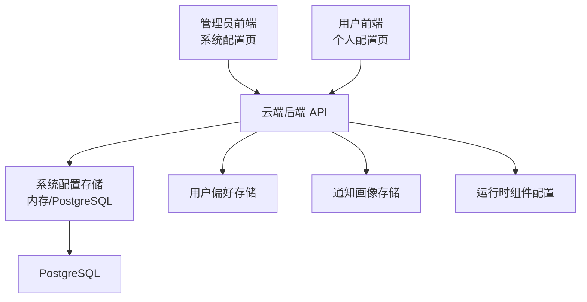
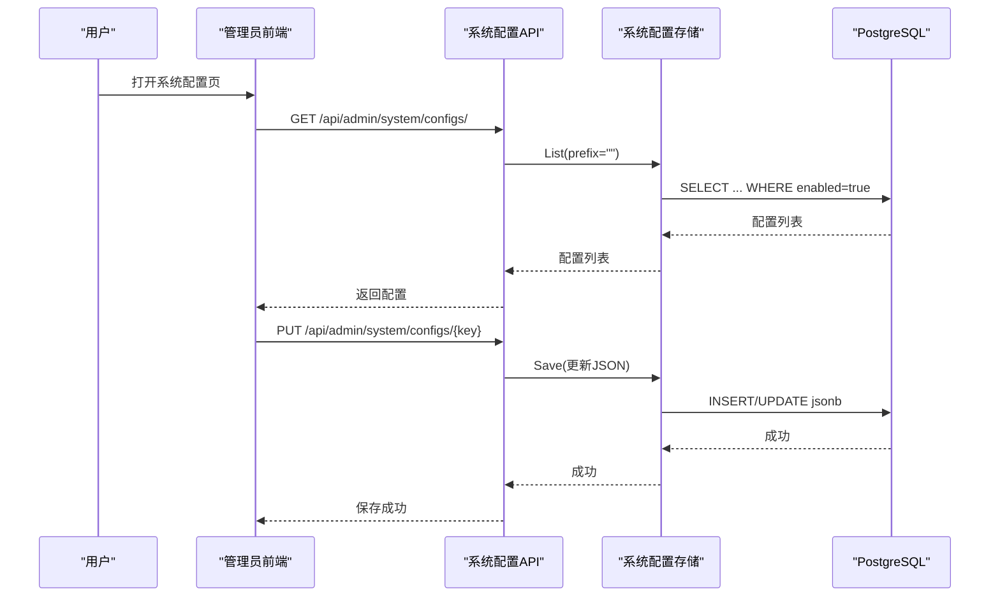
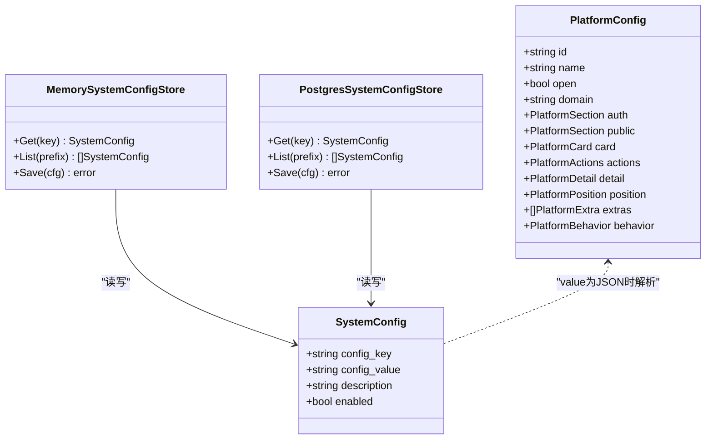
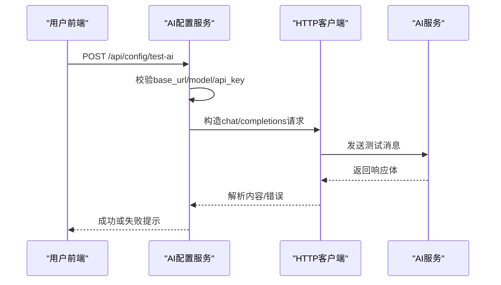
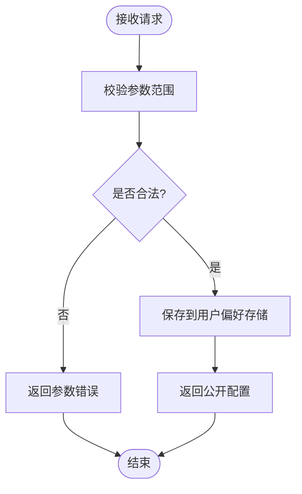
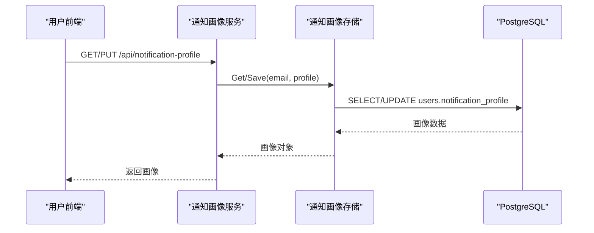
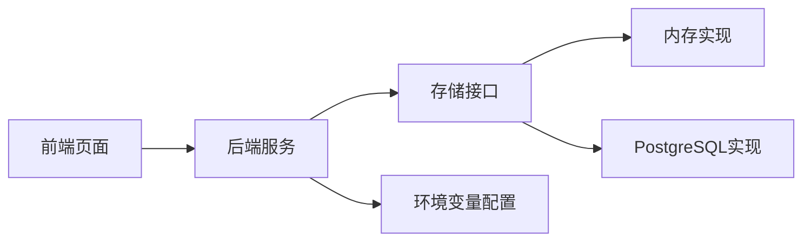

# 系统配置管理

<cite>
**本文引用的文件**
- [config.go](file://goodhr5/cloud/backend/internal/httpapi/config.go)
- [system_config_store.go](file://goodhr5/cloud/backend/internal/httpapi/system_config_store.go)
- [ai_config.go](file://goodhr5/cloud/backend/internal/httpapi/ai_config.go)
- [user_preferences.go](file://goodhr5/cloud/backend/internal/httpapi/user_preferences.go)
- [notification_profile.go](file://goodhr5/cloud/backend/internal/httpapi/notification_profile.go)
- [runtime_config.go](file://goodhr5/cloud/backend/internal/httpapi/runtime_config.go)
- [page.tsx（系统配置）](file://goodhr5/cloud/frontend-next/app/admin/system-config/page.tsx)
- [page.tsx（个人配置）](file://goodhr5/cloud/frontend-next/app/admin/personal-config/page.tsx)
- [0021_system_app_config.sql](file://goodhr5/cloud/backend/db/migrations/0021_system_app_config.sql)
- [0036_user_notification_profile.sql](file://goodhr5/cloud/backend/db/migrations/0036_user_notification_profile.sql)
- [0055_ai_wallet_and_builtin_ai.sql](file://goodhr5/cloud/backend/db/migrations/0055_ai_wallet_and_builtin_ai.sql)
</cite>

## 目录
1. [简介](#简介)
2. [项目结构](#项目结构)
3. [核心组件](#核心组件)
4. [架构总览](#架构总览)
5. [详细组件分析](#详细组件分析)
6. [依赖关系分析](#依赖关系分析)
7. [性能考虑](#性能考虑)
8. [故障排查指南](#故障排查指南)
9. [结论](#结论)
10. [附录](#附录)

## 简介
本文件系统性说明 GoodHR5 的配置管理能力，覆盖系统级配置与用户个人配置：
- 界面设计：超级管理员的系统配置编辑页、用户的个人 AI 与操作节奏配置页。
- 数据持久化：内存与 PostgreSQL 双实现；迁移脚本定义关键表结构。
- 配置验证：前端 JSON 校验、后端参数范围校验、AI 接口连通性校验与安全限制。
- 配置项说明：平台配置、AI 服务配置、通知画像、订阅支付、本地运行组件等。
- 热重载与版本管理：系统配置保存后即时生效；本地程序与运行组件版本由系统配置下发。
- 备份恢复：基于系统配置的键值导出与导入思路（结合数据库与前端导出）。
- 权限控制：仅超级管理员可编辑系统配置；用户只能读写自身配置；敏感字段脱敏或按需明文返回。
- 审计与日志：AI 测试请求记录、岗位运行日志、错误提示与状态反馈。

## 项目结构
配置能力横跨云端后端 API、前端管理页面与数据库迁移：
- 后端 API：提供系统配置、用户 AI 配置、用户偏好、通知画像、运行时组件配置等接口。
- 前端页面：超级管理员“系统配置”页按业务分类查看/编辑 JSON；用户“个人配置”页设置 AI 与行为节奏。
- 数据库：通过迁移脚本创建 system_configs、users.notification_profile、AI 钱包等结构。

**图表来源**
- [config.go:16-45](file://goodhr5/cloud/backend/internal/httpapi/config.go#L16-L45)
- [system_config_store.go:11-27](file://goodhr5/cloud/backend/internal/httpapi/system_config_store.go#L11-L27)
- [runtime_config.go:20-38](file://goodhr5/cloud/backend/internal/httpapi/runtime_config.go#L20-L38)

**章节来源**
- [config.go:16-45](file://goodhr5/cloud/backend/internal/httpapi/config.go#L16-L45)
- [system_config_store.go:11-27](file://goodhr5/cloud/backend/internal/httpapi/system_config_store.go#L11-L27)
- [runtime_config.go:20-38](file://goodhr5/cloud/backend/internal/httpapi/runtime_config.go#L20-L38)

## 核心组件
- 系统配置存储抽象与实现：支持 Get/List/Save，内存用于开发，PostgreSQL 用于生产。
- 用户 AI 配置服务：读取、保存、测试当前登录用户的 AI 接口，并返回有效配置。
- 用户偏好服务：保存点击频率、详情打开概率、各类延时与休息策略。
- 通知画像服务：维护用户邮件通知分组画像（角色、性别、平台、设备信息等）。
- 运行时组件配置：向已登录用户提供本地程序与运行组件下载信息。
- 环境变量配置：加载数据库、Redis、SMTP、超级管理员列表等运行期配置。

**章节来源**
- [system_config_store.go:11-27](file://goodhr5/cloud/backend/internal/httpapi/system_config_store.go#L11-L27)
- [ai_config.go:22-45](file://goodhr5/cloud/backend/internal/httpapi/ai_config.go#L22-L45)
- [user_preferences.go:10-43](file://goodhr5/cloud/backend/internal/httpapi/user_preferences.go#L10-L43)
- [notification_profile.go:18-45](file://goodhr5/cloud/backend/internal/httpapi/notification_profile.go#L18-L45)
- [runtime_config.go:9-18](file://goodhr5/cloud/backend/internal/httpapi/runtime_config.go#L9-L18)
- [config.go:16-45](file://goodhr5/cloud/backend/internal/httpapi/config.go#L16-L45)

## 架构总览
系统配置管理采用“前端页面 + 后端服务 + 存储层”的分层架构：
- 前端负责表单输入、JSON 校验、分类展示与操作反馈。
- 后端服务负责鉴权、参数校验、业务逻辑与调用存储。
- 存储层提供内存与 PostgreSQL 两种实现，保证开发与生产一致性。

**图表来源**
- [system_config_store.go:349-462](file://goodhr5/cloud/backend/internal/httpapi/system_config_store.go#L349-L462)
- [page.tsx（系统配置）:25-64](file://goodhr5/cloud/frontend-next/app/admin/system-config/page.tsx#L25-L64)

**章节来源**
- [system_config_store.go:349-462](file://goodhr5/cloud/backend/internal/httpapi/system_config_store.go#L349-L462)
- [page.tsx（系统配置）:25-64](file://goodhr5/cloud/frontend-next/app/admin/system-config/page.tsx#L25-L64)

## 详细组件分析

### 系统配置存储（SystemConfigStore）
- 职责：统一系统配置的读取、列出与保存；支持内存与 PostgreSQL 双实现。
- 数据结构：包含配置键、JSON 值、描述、启用标志。
- 默认配置：内置公共系统配置、订阅套餐、新手引导、邀请奖励、帮助中心、微信支付配置等。
- 平台配置模型：定义平台页面、元素定位、动作按钮、详情页、行为开关等结构化配置。

**图表来源**
- [system_config_store.go:11-27](file://goodhr5/cloud/backend/internal/httpapi/system_config_store.go#L11-L27)
- [system_config_store.go:33-43](file://goodhr5/cloud/backend/internal/httpapi/system_config_store.go#L33-L43)
- [system_config_store.go:380-462](file://goodhr5/cloud/backend/internal/httpapi/system_config_store.go#L380-L462)
- [system_config_store.go:464-581](file://goodhr5/cloud/backend/internal/httpapi/system_config_store.go#L464-L581)

**章节来源**
- [system_config_store.go:11-27](file://goodhr5/cloud/backend/internal/httpapi/system_config_store.go#L11-L27)
- [system_config_store.go:33-43](file://goodhr5/cloud/backend/internal/httpapi/system_config_store.go#L33-L43)
- [system_config_store.go:380-462](file://goodhr5/cloud/backend/internal/httpapi/system_config_store.go#L380-L462)
- [system_config_store.go:464-581](file://goodhr5/cloud/backend/internal/httpapi/system_config_store.go#L464-L581)

### 用户 AI 配置服务（AIConfigService）
- 功能：读取、保存、测试当前用户的 OpenAI 兼容 AI 配置；返回有效配置供岗位运行使用。
- 安全限制：测试接口仅允许公网 HTTPS，禁止内网与本机地址；重定向次数限制；超时保护。
- 密钥处理：前端显示脱敏 Key；本地 Agent 可通过查询参数获取明文 Key。
- 流程：前端提交 base_url/model/api_key -> 后端校验 -> 发起测试请求 -> 返回结果。

**图表来源**
- [ai_config.go:47-82](file://goodhr5/cloud/backend/internal/httpapi/ai_config.go#L47-L82)
- [ai_config.go:84-124](file://goodhr5/cloud/backend/internal/httpapi/ai_config.go#L84-L124)
- [ai_config.go:126-169](file://goodhr5/cloud/backend/internal/httpapi/ai_config.go#L126-L169)
- [ai_config.go:171-224](file://goodhr5/cloud/backend/internal/httpapi/ai_config.go#L171-L224)

**章节来源**
- [ai_config.go:22-45](file://goodhr5/cloud/backend/internal/httpapi/ai_config.go#L22-L45)
- [ai_config.go:47-82](file://goodhr5/cloud/backend/internal/httpapi/ai_config.go#L47-L82)
- [ai_config.go:84-124](file://goodhr5/cloud/backend/internal/httpapi/ai_config.go#L84-L124)
- [ai_config.go:126-169](file://goodhr5/cloud/backend/internal/httpapi/ai_config.go#L126-L169)
- [ai_config.go:171-224](file://goodhr5/cloud/backend/internal/httpapi/ai_config.go#L171-L224)
- [ai_config.go:265-340](file://goodhr5/cloud/backend/internal/httpapi/ai_config.go#L265-L340)
- [ai_config.go:342-397](file://goodhr5/cloud/backend/internal/httpapi/ai_config.go#L342-L397)
- [ai_config.go:414-461](file://goodhr5/cloud/backend/internal/httpapi/ai_config.go#L414-L461)

### 用户偏好服务（UserPreferencesService）
- 功能：保存点击频率、详情打开概率、滚动/查看详情/打招呼延时、休息策略等。
- 校验：确保数值范围合理、区间最小值不大于最大值。
- 输出：返回公开字段，避免泄露敏感信息。

**图表来源**
- [user_preferences.go:76-103](file://goodhr5/cloud/backend/internal/httpapi/user_preferences.go#L76-L103)
- [user_preferences.go:118-189](file://goodhr5/cloud/backend/internal/httpapi/user_preferences.go#L118-L189)
- [user_preferences.go:191-219](file://goodhr5/cloud/backend/internal/httpapi/user_preferences.go#L191-L219)

**章节来源**
- [user_preferences.go:10-43](file://goodhr5/cloud/backend/internal/httpapi/user_preferences.go#L10-L43)
- [user_preferences.go:76-103](file://goodhr5/cloud/backend/internal/httpapi/user_preferences.go#L76-L103)
- [user_preferences.go:118-189](file://goodhr5/cloud/backend/internal/httpapi/user_preferences.go#L118-L189)
- [user_preferences.go:191-219](file://goodhr5/cloud/backend/internal/httpapi/user_preferences.go#L191-L219)

### 通知画像服务（NotificationProfileService）
- 功能：维护用户邮件通知画像（完成状态、角色、性别、平台、设备信息等），用于后续通知策略。
- 校验：角色与性别限定枚举值；平台列表去重清理。
- 存储：内存用于开发，PostgreSQL 将画像以 JSONB 保存在用户表中。

**图表来源**
- [notification_profile.go:47-126](file://goodhr5/cloud/backend/internal/httpapi/notification_profile.go#L47-L126)
- [notification_profile.go:181-222](file://goodhr5/cloud/backend/internal/httpapi/notification_profile.go#L181-L222)

**章节来源**
- [notification_profile.go:18-45](file://goodhr5/cloud/backend/internal/httpapi/notification_profile.go#L18-L45)
- [notification_profile.go:47-126](file://goodhr5/cloud/backend/internal/httpapi/notification_profile.go#L47-L126)
- [notification_profile.go:128-149](file://goodhr5/cloud/backend/internal/httpapi/notification_profile.go#L128-L149)
- [notification_profile.go:181-222](file://goodhr5/cloud/backend/internal/httpapi/notification_profile.go#L181-L222)

### 运行时组件配置（RuntimeConfigService）
- 功能：向已登录用户返回本地程序与运行组件的版本、下载地址等信息。
- 数据来源：从系统配置中读取 onboarding_config 的 local_agent 与 runtime_components。

**章节来源**
- [runtime_config.go:9-18](file://goodhr5/cloud/backend/internal/httpapi/runtime_config.go#L9-L18)
- [runtime_config.go:20-38](file://goodhr5/cloud/backend/internal/httpapi/runtime_config.go#L20-L38)

### 环境变量与运行期配置（Config）
- 功能：从环境变量加载数据库 DSN、Redis、SMTP、超级管理员列表等。
- 工厂方法：根据环境创建不同存储实现（内存/PostgreSQL/Redis 缓存）。

**章节来源**
- [config.go:16-45](file://goodhr5/cloud/backend/internal/httpapi/config.go#L16-L45)
- [config.go:47-109](file://goodhr5/cloud/backend/internal/httpapi/config.go#L47-L109)
- [config.go:111-268](file://goodhr5/cloud/backend/internal/httpapi/config.go#L111-L268)

## 依赖关系分析
- 前端页面依赖后端 API：系统配置页调用管理员接口；个人配置页调用用户 AI 与偏好接口。
- 后端服务依赖存储抽象：系统配置、用户偏好、通知画像均通过接口解耦具体存储实现。
- 存储层依赖数据库：PostgreSQL 实现使用 SQL 查询与 JSONB 存储；内存实现用于开发调试。
- 环境变量驱动运行期行为：是否启用 Redis 缓存、是否连接真实 SMTP、是否启用数据库等。

**图表来源**
- [config.go:111-268](file://goodhr5/cloud/backend/internal/httpapi/config.go#L111-L268)
- [system_config_store.go:33-43](file://goodhr5/cloud/backend/internal/httpapi/system_config_store.go#L33-L43)
- [system_config_store.go:380-462](file://goodhr5/cloud/backend/internal/httpapi/system_config_store.go#L380-L462)

**章节来源**
- [config.go:111-268](file://goodhr5/cloud/backend/internal/httpapi/config.go#L111-L268)
- [system_config_store.go:33-43](file://goodhr5/cloud/backend/internal/httpapi/system_config_store.go#L33-L43)
- [system_config_store.go:380-462](file://goodhr5/cloud/backend/internal/httpapi/system_config_store.go#L380-L462)

## 性能考虑
- 存储选择：生产环境使用 PostgreSQL 保证持久性与并发；开发环境使用内存提升迭代速度。
- 缓存层：岗位日志等高频读写可使用 Redis 作为缓存层，降低数据库压力。
- 超时与限流：AI 测试请求设置统一超时，防止长时间阻塞；重定向次数限制避免循环跳转。
- JSON 校验：前端先做 JSON 语法校验，减少无效请求到后端。

[本节为通用指导，不直接分析具体文件]

## 故障排查指南
- AI 接口测试失败：检查 base_url 是否为公网 HTTPS、模型名称是否正确、API Key 是否有效；查看后端日志中的目标地址与状态码。
- 用户偏好保存失败：确认数值范围合法，尤其是延时区间的最小值不大于最大值。
- 通知画像保存失败：检查角色与性别是否在允许枚举范围内；平台列表是否重复。
- 系统配置保存失败：确认 JSON 格式正确；若涉及支付配置，确保所有必填字段完整。
- 运行时组件配置为空：确认系统配置中 onboarding_config 存在且启用。

**章节来源**
- [ai_config.go:47-82](file://goodhr5/cloud/backend/internal/httpapi/ai_config.go#L47-L82)
- [user_preferences.go:118-189](file://goodhr5/cloud/backend/internal/httpapi/user_preferences.go#L118-L189)
- [notification_profile.go:74-126](file://goodhr5/cloud/backend/internal/httpapi/notification_profile.go#L74-L126)
- [system_config_store.go:349-462](file://goodhr5/cloud/backend/internal/httpapi/system_config_store.go#L349-L462)

## 结论
GoodHR5 的配置管理体系通过清晰的前后端分层、统一的存储抽象与严格的参数校验，实现了系统级与用户级配置的可控、可观测与可扩展。管理员可在系统中集中维护平台、AI、订阅支付、本地组件等关键配置；用户可灵活调整 AI 接口与行为节奏，并通过内置 AI 快速上手。配合迁移脚本与默认配置，系统在开发与生产环境中保持一致的行为与数据结构。

[本节为总结，不直接分析具体文件]

## 附录

### 配置项与作用说明
- 公共系统配置：控制免费每日打招呼上限、邮箱域名白名单、公告与管理横幅等。
- 订阅套餐：定义会员类型、时长、价格、功能开关（如自动回复）。
- 新手引导与本地组件：提供本地程序与运行组件的版本、下载地址与说明。
- 邀请奖励：注册与付费奖励天数与活动文案。
- 帮助中心：系统指南卡片与章节，辅助用户理解系统。
- 微信支付配置：应用 ID、商户号、证书序列号、私钥、APIv3 密钥、公钥与回调地址。
- 平台配置：页面匹配、元素定位、动作按钮、详情页、行为开关等。
- 用户 AI 配置：BaseURL、模型、API Key、温度、提示模板、启用状态。
- 用户偏好：点击频率、详情打开概率、各类延时与休息策略。
- 通知画像：角色、性别、平台、操作系统、浏览器等。

**章节来源**
- [system_config_store.go:45-187](file://goodhr5/cloud/backend/internal/httpapi/system_config_store.go#L45-L187)
- [system_config_store.go:464-581](file://goodhr5/cloud/backend/internal/httpapi/system_config_store.go#L464-L581)
- [ai_config.go:29-36](file://goodhr5/cloud/backend/internal/httpapi/ai_config.go#L29-L36)
- [user_preferences.go:15-39](file://goodhr5/cloud/backend/internal/httpapi/user_preferences.go#L15-L39)
- [notification_profile.go:18-28](file://goodhr5/cloud/backend/internal/httpapi/notification_profile.go#L18-L28)

### 配置示例与动态调整
- 动态调整 AI 服务：在个人配置页填写 BaseURL、模型与 API Key，先测试再保存；岗位运行将优先使用用户配置。
- 动态调整行为节奏：修改点击频率、详情打开概率、延时区间与休息策略，使自动化更贴近人工操作。
- 动态调整平台行为：通过系统配置中的平台配置 JSON 调整页面匹配、元素定位与动作按钮。
- 动态调整订阅与支付：修改订阅套餐的功能开关与价格；更新微信支付配置后立即生效。

**章节来源**
- [page.tsx（个人配置）:70-165](file://goodhr5/cloud/frontend-next/app/admin/personal-config/page.tsx#L70-L165)
- [page.tsx（系统配置）:59-64](file://goodhr5/cloud/frontend-next/app/admin/system-config/page.tsx#L59-L64)
- [ai_config.go:265-340](file://goodhr5/cloud/backend/internal/httpapi/ai_config.go#L265-L340)
- [system_config_store.go:447-462](file://goodhr5/cloud/backend/internal/httpapi/system_config_store.go#L447-L462)

### 权限控制与安全性
- 管理员权限：仅超级管理员可访问系统配置页并编辑系统配置。
- 用户隔离：用户只能读取与保存自己的 AI 配置与偏好。
- 敏感字段保护：AI Key 默认脱敏显示；仅在特定场景（如本地 Agent 请求）返回明文。
- 网络限制：AI 测试接口仅允许公网 HTTPS，禁止内网与本机地址，限制重定向次数。

**章节来源**
- [page.tsx（系统配置）:69-72](file://goodhr5/cloud/frontend-next/app/admin/system-config/page.tsx#L69-L72)
- [ai_config.go:150-169](file://goodhr5/cloud/backend/internal/httpapi/ai_config.go#L150-L169)
- [ai_config.go:375-397](file://goodhr5/cloud/backend/internal/httpapi/ai_config.go#L375-L397)
- [ai_config.go:436-461](file://goodhr5/cloud/backend/internal/httpapi/ai_config.go#L436-L461)

### 热重载与版本管理
- 热重载：系统配置保存后即时生效，无需重启服务；运行时组件配置由系统配置下发。
- 版本管理：本地程序与运行组件版本、下载地址与说明由系统配置维护；前端据此提示更新。

**章节来源**
- [system_config_store.go:447-462](file://goodhr5/cloud/backend/internal/httpapi/system_config_store.go#L447-L462)
- [runtime_config.go:20-38](file://goodhr5/cloud/backend/internal/httpapi/runtime_config.go#L20-L38)

### 配置备份与恢复
- 备份：通过管理员系统配置页导出各键值的 JSON 内容；或通过数据库导出 system_configs 表。
- 恢复：将备份的 JSON 内容粘贴至对应配置项并保存；或在数据库中批量导入。

**章节来源**
- [page.tsx（系统配置）:25-64](file://goodhr5/cloud/frontend-next/app/admin/system-config/page.tsx#L25-L64)
- [system_config_store.go:349-462](file://goodhr5/cloud/backend/internal/httpapi/system_config_store.go#L349-L462)

### 配置变更审计与操作日志
- 审计：管理员在前端保存系统配置时会有成功/失败提示；后端对 AI 测试请求记录目标地址与耗时。
- 日志：岗位运行日志可查看启动、筛选、打招呼等步骤；本地程序日志与云端编排摘要共同辅助排查。

**章节来源**
- [ai_config.go:66-82](file://goodhr5/cloud/backend/internal/httpapi/ai_config.go#L66-L82)
- [system_config_store.go:447-462](file://goodhr5/cloud/backend/internal/httpapi/system_config_store.go#L447-L462)

### 数据库迁移与结构
- system_configs：存储系统级配置键值对，支持 JSONB 与启用标志。
- users.notification_profile：存储用户通知画像，便于邮件通知分组。
- AI 钱包与内置 AI：支持账户余额与内置 AI 配置切换。

**章节来源**
- [0021_system_app_config.sql](file://goodhr5/cloud/backend/db/migrations/0021_system_app_config.sql)
- [0036_user_notification_profile.sql](file://goodhr5/cloud/backend/db/migrations/0036_user_notification_profile.sql)
- [0055_ai_wallet_and_builtin_ai.sql](file://goodhr5/cloud/backend/db/migrations/0055_ai_wallet_and_builtin_ai.sql)