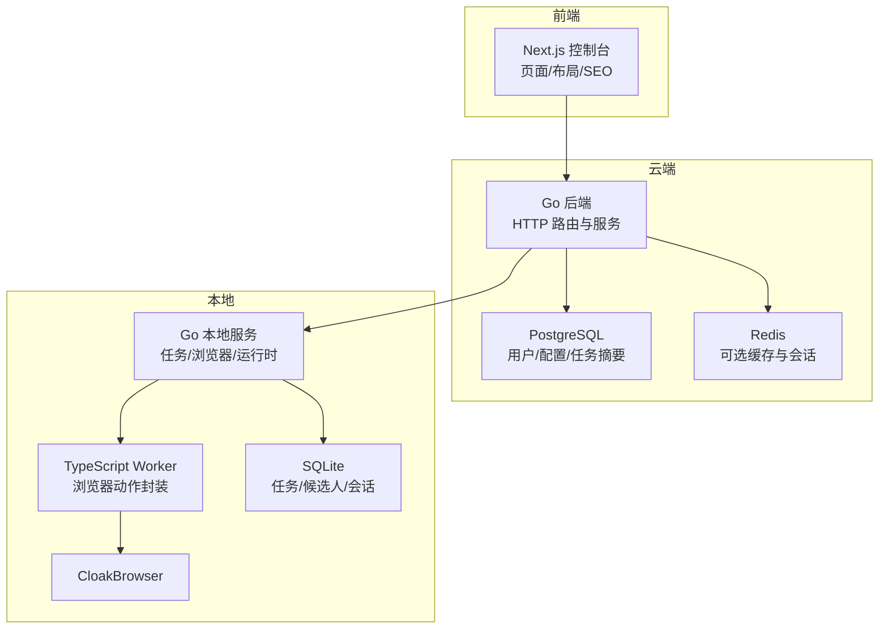
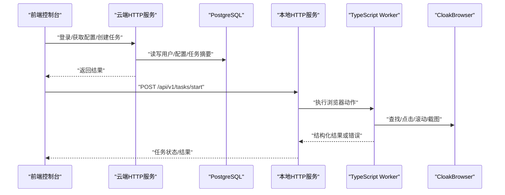
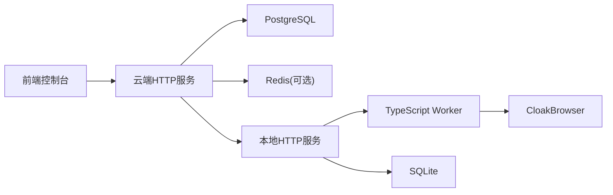

# 代码规范

<cite>
**本文引用的文件**
- [README.md](file://goodhr5/README.md)
- [development-standards.md](file://goodhr5/docs/development-standards.md)
- [AGENTS.md](file://goodhr5/local-agent-go-new/AGENTS.md)
- [main.go](file://goodhr5/cloud/backend/cmd/server/main.go)
- [server.go](file://goodhr5/cloud/backend/internal/httpapi/server.go)
- [go.mod](file://goodhr5/cloud/backend/go.mod)
- [0001_initial_schema.sql](file://goodhr5/cloud/backend/db/migrations/0001_initial_schema.sql)
- [001_initial.sql](file://goodhr5/local-agent-go-new/migrations/001_initial.sql)
- [package.json](file://goodhr5/cloud/frontend-next/package.json)
- [layout.tsx](file://goodhr5/cloud/frontend-next/app/layout.tsx)
- [main.ts](file://goodhr5/local-agent-go-new/worker/src/main.ts)
- [server.ts](file://goodhr5/local-agent-go-new/worker/src/http/server.ts)
- [logger.ts](file://goodhr5/local-agent-go-new/worker/src/logging/logger.ts)
- [worker-error.ts](file://goodhr5/local-agent-go-new/worker/src/errors/worker-error.ts)
- [error.go](file://goodhr5/local-agent-go-new/internal/browser/contract/error.go)
- [server.go](file://goodhr5/local-agent-go-new/internal/api/server.go)
</cite>

## 目录
1. [简介](#简介)
2. [项目结构](#项目结构)
3. [核心组件](#核心组件)
4. [架构总览](#架构总览)
5. [详细组件分析](#详细组件分析)
6. [依赖关系分析](#依赖关系分析)
7. [性能考虑](#性能考虑)
8. [故障排查指南](#故障排查指南)
9. [结论](#结论)
10. [附录](#附录)

## 简介
本规范面向 HRPlus 全栈工程，统一 Go、TypeScript/JavaScript、SQL 迁移与前后端协作的编码约定、模块边界、错误处理、日志标准、API 设计、代码审查清单与质量保证流程。目标是在云端后端、前端控制台、本地 Agent 与 Browser Worker 之间建立一致、可维护、可演进的工程基线。

## 项目结构
HRPlus 采用“云端 + 本地”的分层架构：
- 云端后端（Go）：提供认证、租户、岗位、支付、AI 配置、平台配置等 HTTP API，并管理数据库与缓存。
- 云端前端（Next.js）：管理控制台页面、SEO、主题与全局布局。
- 本地 Agent（Go）：对外暴露本地 HTTP 接口，编排任务生命周期、浏览器会话、运行时组件、存储与外部集成。
- Browser Worker（TypeScript）：封装 Playwright/CloakBrowser 原子能力与动作，供 Go 调用，禁止注入脚本到招聘页面。
- SQL 迁移：云端 PostgreSQL 与本地 SQLite 分别维护版本化迁移文件。

图表来源
- [server.go:124-212](file://goodhr5/cloud/backend/internal/httpapi/server.go#L124-L212)
- [server.go:111-120](file://goodhr5/local-agent-go-new/internal/api/server.go#L111-L120)
- [0001_initial_schema.sql:8-135](file://goodhr5/cloud/backend/db/migrations/0001_initial_schema.sql#L8-L135)
- [001_initial.sql:3-48](file://goodhr5/local-agent-go-new/migrations/001_initial.sql#L3-L48)

章节来源
- [README.md:1-22](file://goodhr5/README.md#L1-L22)
- [development-standards.md:7-14](file://goodhr5/docs/development-standards.md#L7-L14)

## 核心组件
- 云端 HTTP 服务：集中注册路由、统一响应与错误格式、CORS 中间件、健康检查与系统配置接口。
- 本地 HTTP 服务：强类型请求解析、限流与安全头、跨域白名单、任务启动/停止/状态查询、运行时与浏览器生命周期管理。
- Browser Worker：本机监听、优雅关闭、结构化日志、统一异常规范化。
- 数据层：云端 PostgreSQL 表结构与索引；本地 SQLite 任务、候选人、会话与迁移版本表。
- 前端控制台：根布局、SEO、站点元信息、第三方统计脚本挂载。

章节来源
- [server.go:124-212](file://goodhr5/cloud/backend/internal/httpapi/server.go#L124-L212)
- [server.go:261-277](file://goodhr5/cloud/backend/internal/httpapi/server.go#L261-L277)
- [server.go:304-340](file://goodhr5/local-agent-go-new/internal/api/server.go#L304-L340)
- [server.go:342-384](file://goodhr5/local-agent-go-new/internal/api/server.go#L342-L384)
- [main.ts:6-38](file://goodhr5/local-agent-go-new/worker/src/main.ts#L6-L38)
- [server.ts:7-41](file://goodhr5/local-agent-go-new/worker/src/http/server.ts#L7-L41)
- [0001_initial_schema.sql:8-135](file://goodhr5/cloud/backend/db/migrations/0001_initial_schema.sql#L8-L135)
- [001_initial.sql:3-48](file://goodhr5/local-agent-go-new/migrations/001_initial.sql#L3-L48)
- [layout.tsx:11-33](file://goodhr5/cloud/frontend-next/app/layout.tsx#L11-L33)

## 架构总览
云端与本地的职责边界清晰：云端负责业务数据与编排元信息，本地负责真实浏览器操作与本地持久化。Worker 仅暴露浏览器动作能力，不感知平台差异。

图表来源
- [server.go:124-212](file://goodhr5/cloud/backend/internal/httpapi/server.go#L124-L212)
- [server.go:163-184](file://goodhr5/local-agent-go-new/internal/api/server.go#L163-L184)
- [main.ts:6-38](file://goodhr5/local-agent-go-new/worker/src/main.ts#L6-L38)

## 详细组件分析

### Go 命名约定与文件组织
- 包与文件：每个文件顶部需有中文文件作用说明；导出函数/方法必须有标准中文注释；一个文件只负责一种明确能力，建议不超过 500 行。
- 命名风格：包名小写、文件名语义化；结构体字段使用 JSON tag 与驼峰命名；错误码使用稳定字符串常量。
- 模块化：云端按 cmd、internal/httpapi、store、config 拆分；本地按 api、flow、platform、browser、storage、integration、runtime、system 等职责拆分。
- 依赖方向：严格限制跨层调用，禁止反向依赖与同层套娃。

章节来源
- [development-standards.md:16-92](file://goodhr5/docs/development-standards.md#L16-L92)
- [AGENTS.md:96-119](file://goodhr5/local-agent-go-new/AGENTS.md#L96-L119)
- [AGENTS.md:465-473](file://goodhr5/local-agent-go-new/AGENTS.md#L465-L473)

### TypeScript/JavaScript 编码规范
- 严格模式：tsconfig 启用 strict；禁止 any；外部 JSON 从 unknown 开始，校验后进入业务。
- 协议一致性：HTTP action 必须定义独立请求/返回类型，字段使用 snake_case 与 Go 保持一致。
- 依赖锁定：提交 package-lock.json；生产环境运行编译产物，不使用 ts-node。
- 日志与错误：统一结构化日志字段；异常规范化为稳定错误码与中文消息。

章节来源
- [AGENTS.md:384-401](file://goodhr5/local-agent-go-new/AGENTS.md#L384-L401)
- [AGENTS.md:403-440](file://goodhr5/local-agent-go-new/AGENTS.md#L403-L440)
- [package.json:1-33](file://goodhr5/cloud/frontend-next/package.json#L1-L33)

### 组件设计模式与状态管理约定
- 云端：Server 聚合各 Service，通过构造函数注入依赖；路由集中注册，处理器保持单一职责。
- 本地：API Server 仅做参数解析与响应，业务编排由 flow/lifecycle 完成；Browser Client 与 Worker 通过强类型协议通信。
- 前端：根布局集中 SEO 与全局 Provider；页面级组件按功能拆分，避免在布局中承载业务逻辑。

章节来源
- [server.go:16-121](file://goodhr5/cloud/backend/internal/httpapi/server.go#L16-L121)
- [server.go:35-120](file://goodhr5/local-agent-go-new/internal/api/server.go#L35-L120)
- [layout.tsx:37-57](file://goodhr5/cloud/frontend-next/app/layout.tsx#L37-L57)

### SQL 迁移文件的命名与版本管理
- 云端 PostgreSQL：迁移文件以序号前缀命名，成对包含 .sql 与 .down.sql；初始 schema 定义用户、Agent、平台账号、岗位、任务与日志等表及索引。
- 本地 SQLite：迁移文件以序号前缀命名，包含 schema_migrations 版本表；定义任务、候选人、会话记录表。
- 规则：每次变更新增迁移文件，确保可回滚；迁移内容仅描述数据结构变化，不包含业务逻辑。

章节来源
- [0001_initial_schema.sql:1-135](file://goodhr5/cloud/backend/db/migrations/0001_initial_schema.sql#L1-L135)
- [001_initial.sql:1-48](file://goodhr5/local-agent-go-new/migrations/001_initial.sql#L1-L48)

### API 接口设计规范
- 云端：统一 JSON 响应与错误格式；健康检查、认证、租户、岗位、支付、AI 配置、平台配置等路由集中注册；CORS 允许必要头部与方法。
- 本地：强类型请求解析，拒绝未知字段；统一成功/错误响应结构；安全头与受限跨域白名单；路径参数与查询参数严格校验。
- 版本化：本地接口以 /api/v1 前缀区分版本；云端可按业务划分资源路径。

章节来源
- [server.go:124-212](file://goodhr5/cloud/backend/internal/httpapi/server.go#L124-L212)
- [server.go:261-277](file://goodhr5/cloud/backend/internal/httpapi/server.go#L261-L277)
- [server.go:304-340](file://goodhr5/local-agent-go-new/internal/api/server.go#L304-L340)
- [server.go:342-384](file://goodhr5/local-agent-go-new/internal/api/server.go#L342-L384)

### 错误处理策略
- 云端：writeError 统一返回 ok=false 与 error 字段；方法不允许时返回 method not allowed；配置缺失返回相应状态码。
- 本地：decodeJSON 拒绝未知字段并返回 INVALID_REQUEST；任务相关错误返回 TASK_NOT_FOUND/TASK_START_FAILED 等稳定码；统一 writeError 包装错误码与消息。
- Worker：normalizeWorkerError 将未知异常转换为 WorkerError，包含 code、message、action、step、trace_id、retryable、details；日志中输出标准化失败信息。

章节来源
- [server.go:271-277](file://goodhr5/cloud/backend/internal/httpapi/server.go#L271-L277)
- [server.go:163-184](file://goodhr5/local-agent-go-new/internal/api/server.go#L163-L184)
- [server.go:342-384](file://goodhr5/local-agent-go-new/internal/api/server.go#L342-L384)
- [worker-error.ts:73-128](file://goodhr5/local-agent-go-new/worker/src/errors/worker-error.ts#L73-L128)

### 日志记录标准
- Worker：结构化日志包含 trace_id、action、step、status、duration_ms、page_url、target_description、error_code；失败去重与限频；安全过滤敏感字段。
- 云端：启动时写入日志文件并输出到 stdout；关键步骤打印连接检查结果。
- 本地：HTTP 服务启动与关闭输出日志；诊断与健康接口返回运行时信息。

章节来源
- [logger.ts:73-124](file://goodhr5/local-agent-go-new/worker/src/logging/logger.ts#L73-L124)
- [main.go:14-52](file://goodhr5/cloud/backend/cmd/server/main.go#L14-L52)
- [server.go:122-135](file://goodhr5/local-agent-go-new/internal/api/server.go#L122-L135)

### 浏览器与 Worker 分层约束
- 零脚本注入：严禁 evaluate、addScriptTag、dispatchEvent 等注入方式；所有交互通过 Page/Locator、鼠标、键盘、真实滚轮与截图完成。
- 分层：原子能力层仅提供最小操作；封装能力层组合原子能力并显式组织步骤；Go 仅调用封装能力。
- 选择器：统一 SelectorSpec，支持 frames、parents、target、state、timeout、description；元素匹配失败返回详细诊断。

章节来源
- [AGENTS.md:3-9](file://goodhr5/local-agent-go-new/AGENTS.md#L3-L9)
- [AGENTS.md:261-345](file://goodhr5/local-agent-go-new/AGENTS.md#L261-L345)
- [AGENTS.md:346-383](file://goodhr5/local-agent-go-new/AGENTS.md#L346-L383)

### 模块化设计与依赖管理最佳实践
- 模块职责单一：云端按 cmd/httpapi/store/config 拆分；本地按 api/flow/platform/browser/storage/integration/runtime/system 拆分。
- 依赖方向强制：api -> flow -> platform/storage/integration/browser；platform 不得直连 SQLite/AI/云端；worker 不得出现平台名。
- 依赖锁定：Go 使用 go.mod 声明直接依赖；前端使用 package.json 与 lock 文件；本地 Worker 使用 TypeScript 编译产物。

章节来源
- [development-standards.md:7-14](file://goodhr5/docs/development-standards.md#L7-L14)
- [AGENTS.md:96-119](file://goodhr5/local-agent-go-new/AGENTS.md#L96-L119)
- [go.mod:1-18](file://goodhr5/cloud/backend/go.mod#L1-L18)
- [package.json:1-33](file://goodhr5/cloud/frontend-next/package.json#L1-L33)

## 依赖关系分析
云端与本地通过 HTTP 协作，Worker 作为浏览器能力的唯一出口；数据库与缓存作为持久化与加速层。

图表来源
- [server.go:124-212](file://goodhr5/cloud/backend/internal/httpapi/server.go#L124-L212)
- [server.go:111-120](file://goodhr5/local-agent-go-new/internal/api/server.go#L111-L120)
- [0001_initial_schema.sql:8-135](file://goodhr5/cloud/backend/db/migrations/0001_initial_schema.sql#L8-L135)
- [001_initial.sql:3-48](file://goodhr5/local-agent-go-new/migrations/001_initial.sql#L3-L48)

章节来源
- [go.mod:1-18](file://goodhr5/cloud/backend/go.mod#L1-L18)
- [package.json:1-33](file://goodhr5/cloud/frontend-next/package.json#L1-L33)

## 性能考虑
- 云端：合理设置缓存与索引；健康检查与配置接口轻量；大对象异步处理（如邮件恢复调度）。
- 本地：HTTP 超时与最大请求体限制；Worker 端口校验与优雅关闭；结构化日志减少 I/O 开销。
- 浏览器：避免重复查找，复用 element_ref；滚动使用真实滚轮；截图与 OCR 按需触发。

[本节为通用指导，不直接分析具体文件]

## 故障排查指南
- 选择器未找到：检查 SelectorSpec 的 frames、parents、target、state、timeout；查看日志中的 page_url、尝试的选择器与实际匹配数量。
- 任务启动失败：查看预检步骤结果，确认云端登录、会员、岗位配置、Profile、Worker、CloakBrowser、目录与 SQLite 状态。
- 浏览器操作失败：核对 Worker 日志的 action、step、error_code、details；确认未注入脚本且使用标准能力。
- 配置加载失败：检查系统配置键是否存在、JSON 是否合法；管理员更新配置时需验证特定键（如订阅计划、微信支付）。

章节来源
- [AGENTS.md:403-440](file://goodhr5/local-agent-go-new/AGENTS.md#L403-L440)
- [AGENTS.md:125-149](file://goodhr5/local-agent-go-new/AGENTS.md#L125-L149)
- [server.go:474-544](file://goodhr5/cloud/backend/internal/httpapi/server.go#L474-L544)

## 结论
本规范明确了 HRPlus 的全栈编码约定、模块边界、错误与日志标准、API 设计与迁移管理，并通过严格的依赖方向与 Worker 分层约束保障可维护性与可扩展性。建议在持续开发中遵循本规范，结合代码审查清单与质量保证流程，确保交付质量与长期演进能力。

## 附录

### 代码审查检查清单
- 代码是否放在正确目录，职责是否单一。
- 是否先搜索并复用已有能力。
- Worker 是否完全不含平台名与平台流程。
- Go 是否只调用 Worker 封装能力。
- 原子能力是否没有对外路由。
- 选择器是否使用统一 SelectorSpec。
- 编排是否在一个方法里平铺展示主要步骤。
- 是否避免同层 A->B->C->D 套娃。
- 请求与返回是否强类型。
- TypeScript 是否无 any。
- AI 固定提示词与动态内容是否分离。
- 所有异步边界是否统一捕获异常。
- 选择器找不到时是否返回详细诊断。
- 点击、输入、滚动是否记录详细步骤日志。
- Worker 源码是否完全没有页面脚本注入。
- 滚动是否只使用真实鼠标滚轮。
- 新文件与新方法是否有中文注释。
- 是否处理空值、超时、取消与页面关闭。
- 是否完成测试。
- 是否没有泄露 Token、Cookie 与代理密码。
- 是否按要求提交并推送。

章节来源
- [AGENTS.md:496-518](file://goodhr5/local-agent-go-new/AGENTS.md#L496-L518)

### 质量保证流程
- 每完成一个独立功能：更新进度文档、运行可用校验、单独 git commit、commit 仅包含相关文件。
- 数据边界：候选人详情、截图、OCR 原文、平台 cookie/profile 不进入云端数据库；本地文件读写限制在 agent_data 目录内。
- 提交流程：默认分支开发，完成后执行测试与中文提交。

章节来源
- [development-standards.md:93-107](file://goodhr5/docs/development-standards.md#L93-L107)