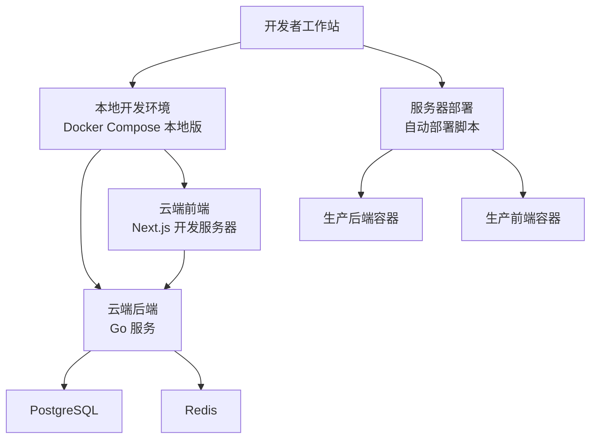
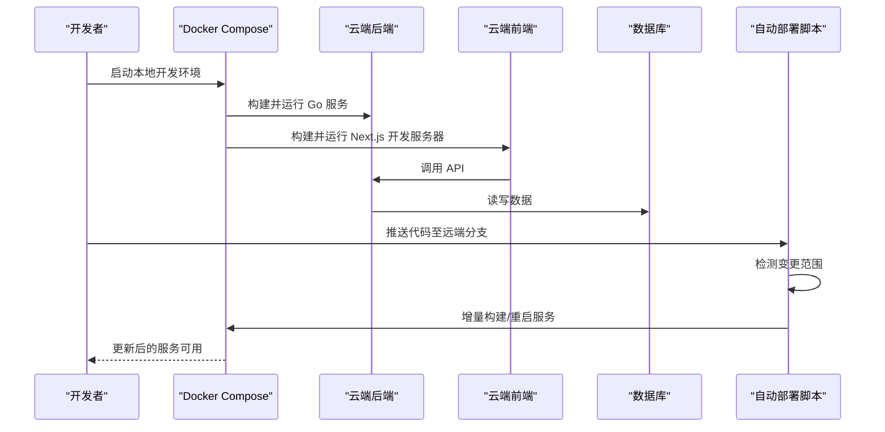
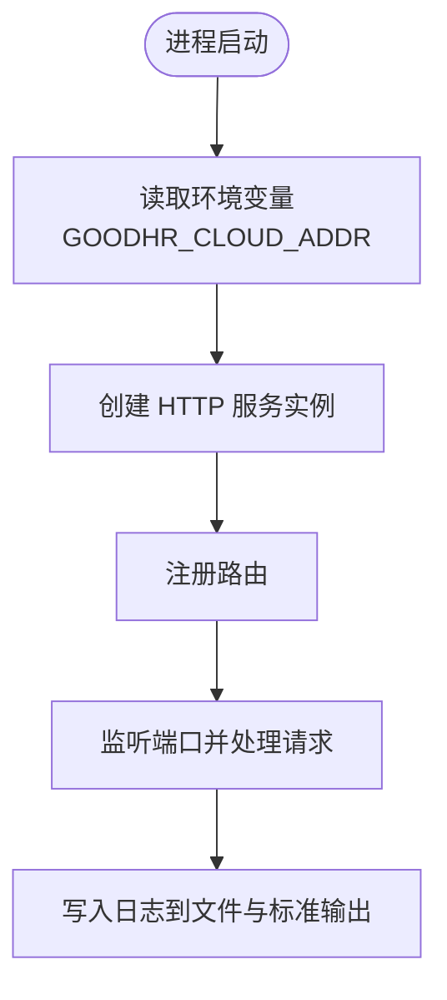
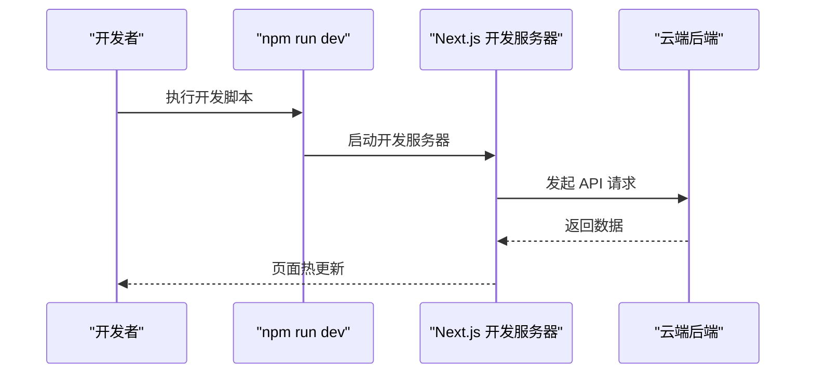
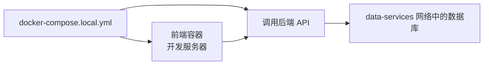
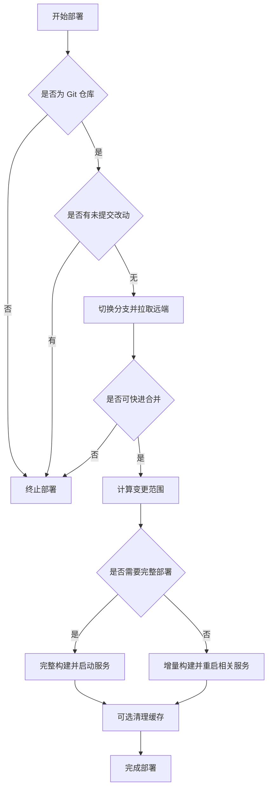
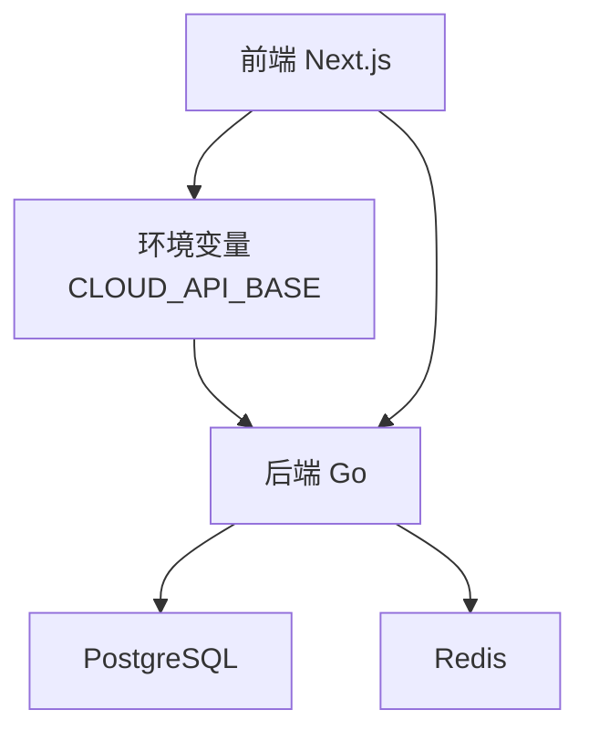

# 开发工作流程

<cite>
**本文引用的文件**
- [goodhr5/README.md](file://goodhr5/README.md)
- [goodhr5/docs/development-standards.md](file://goodhr5/docs/development-standards.md)
- [goodhr5/cloud/backend/.air.toml](file://goodhr5/cloud/backend/.air.toml)
- [goodhr5/cloud/frontend-next/package.json](file://goodhr5/cloud/frontend-next/package.json)
- [goodhr5/docker-compose.yml](file://goodhr5/docker-compose.yml)
- [goodhr5/docker-compose.local.yml](file://goodhr5/docker-compose.local.yml)
- [goodhr5/docker-compose.server.yml](file://goodhr5/docker-compose.server.yml)
- [goodhr5/auto_deploy.sh](file://goodhr5/auto_deploy.sh)
- [goodhr5/cloud/backend/Dockerfile](file://goodhr5/cloud/backend/Dockerfile)
- [goodhr5/cloud/frontend-next/Dockerfile.dev](file://goodhr5/cloud/frontend-next/Dockerfile.dev)
- [goodhr5/cloud/backend/cmd/server/main.go](file://goodhr5/cloud/backend/cmd/server/main.go)
</cite>

## 目录
1. [简介](#简介)
2. [项目结构](#项目结构)
3. [核心组件](#核心组件)
4. [架构总览](#架构总览)
5. [详细组件分析](#详细组件分析)
6. [依赖分析](#依赖分析)
7. [性能考虑](#性能考虑)
8. [故障排查指南](#故障排查指南)
9. [结论](#结论)
10. [附录](#附录)

## 简介
本规范面向 GoodHR 5 的全栈开发团队，覆盖从需求到发布的完整生命周期：需求分析、技术方案设计、代码实现、单元测试、集成测试、文档更新；并明确 Git 分支管理策略、提交信息规范、代码合并流程；提供热重载开发环境（Go Air、Next.js）配置与使用；说明构建脚本、打包发布流程、版本标签管理；以及持续集成与自动化测试执行建议。目标是让每位开发者在统一规范下高效协作，保证质量与可维护性。

## 项目结构
GoodHR 5 采用云端控制台 + 本地执行器的分层架构：
- 云端后端：Go 服务，负责认证、岗位运行元信息、配置、机器绑定与版本管理等。
- 云端前端：Next.js 控制台，负责用户操作、岗位编排与连接本地 Agent。
- 本地 Agent：运行在用户电脑上的程序，负责浏览器操控、截图、OCR 与本地数据持久化。
- 数据库与缓存：通过 Docker Compose 或服务器宿主机网络接入 PostgreSQL、Redis 等。

**图示来源**
- [goodhr5/docker-compose.local.yml:1-54](file://goodhr5/docker-compose.local.yml#L1-L54)
- [goodhr5/docker-compose.server.yml:1-12](file://goodhr5/docker-compose.server.yml#L1-L12)
- [goodhr5/auto_deploy.sh:1-173](file://goodhr5/auto_deploy.sh#L1-L173)

**章节来源**
- [goodhr5/README.md:1-22](file://goodhr5/README.md#L1-L22)

## 核心组件
- 云端后端入口：启动 HTTP 服务、读取环境变量、挂载路由、输出日志。
- 热重载开发：Go 使用 Air 监听源码变更并重启进程；Next.js 使用开发服务器提供模块热替换。
- 本地开发编排：Docker Compose 同时拉起后端与前端，挂载源码与缓存卷，复用外部 data-services 网络。
- 服务器部署：自动检测变更范围，增量构建与重启，支持完整重建与缓存清理。

**章节来源**
- [goodhr5/cloud/backend/cmd/server/main.go:1-53](file://goodhr5/cloud/backend/cmd/server/main.go#L1-L53)
- [goodhr5/cloud/backend/.air.toml:1-35](file://goodhr5/cloud/backend/.air.toml#L1-L35)
- [goodhr5/cloud/frontend-next/package.json:1-33](file://goodhr5/cloud/frontend-next/package.json#L1-L33)
- [goodhr5/docker-compose.local.yml:1-54](file://goodhr5/docker-compose.local.yml#L1-L54)
- [goodhr5/auto_deploy.sh:1-173](file://goodhr5/auto_deploy.sh#L1-L173)

## 架构总览
下图展示从开发者到生产环境的整体流转：本地开发通过 Docker Compose 启动前后端，服务端通过自动部署脚本根据变更范围进行增量构建与重启。

**图示来源**
- [goodhr5/docker-compose.local.yml:1-54](file://goodhr5/docker-compose.local.yml#L1-L54)
- [goodhr5/auto_deploy.sh:44-173](file://goodhr5/auto_deploy.sh#L44-L173)
- [goodhr5/cloud/backend/cmd/server/main.go:14-29](file://goodhr5/cloud/backend/cmd/server/main.go#L14-L29)

## 详细组件分析

### 云端后端（Go）
- 启动流程：读取监听地址与环境变量，初始化服务，注册路由，启动 HTTP 监听。
- 日志：将日志同时输出到标准输出与文件，便于容器与本地调试。
- 热重载：Air 配置排除测试文件，编译产物输出到 tmp 目录，快速重启。

**图示来源**
- [goodhr5/cloud/backend/cmd/server/main.go:14-29](file://goodhr5/cloud/backend/cmd/server/main.go#L14-L29)
- [goodhr5/cloud/backend/cmd/server/main.go:40-52](file://goodhr5/cloud/backend/cmd/server/main.go#L40-L52)

**章节来源**
- [goodhr5/cloud/backend/cmd/server/main.go:1-53](file://goodhr5/cloud/backend/cmd/server/main.go#L1-L53)
- [goodhr5/cloud/backend/.air.toml:1-35](file://goodhr5/cloud/backend/.air.toml#L1-L35)

### 云端前端（Next.js）
- 开发命令：通过 package.json 的 dev 脚本启动开发服务器，监听指定主机与端口。
- 环境变量：CLOUD_API_BASE、NEXT_PUBLIC_CLOUD_API_BASE、NEXT_PUBLIC_SITE_URL 用于区分后端地址与站点地址。
- 热更新：Webpack 与 Next.js 开发模式配合，实现模块级热替换。

**图示来源**
- [goodhr5/cloud/frontend-next/package.json:5-9](file://goodhr5/cloud/frontend-next/package.json#L5-L9)
- [goodhr5/docker-compose.local.yml:24-42](file://goodhr5/docker-compose.local.yml#L24-L42)

**章节来源**
- [goodhr5/cloud/frontend-next/package.json:1-33](file://goodhr5/cloud/frontend-next/package.json#L1-L33)
- [goodhr5/docker-compose.local.yml:24-42](file://goodhr5/docker-compose.local.yml#L24-L42)

### 本地开发编排（Docker Compose）
- 本地版 compose：挂载源码与缓存卷，启用 data-services 网络复用已有数据库服务。
- 环境变量：为前后端分别设置 API 与站点地址，确保本地联调顺畅。
- 依赖关系：前端依赖后端，启动顺序由 depends_on 控制。

**图示来源**
- [goodhr5/docker-compose.local.yml:1-54](file://goodhr5/docker-compose.local.yml#L1-L54)

**章节来源**
- [goodhr5/docker-compose.local.yml:1-54](file://goodhr5/docker-compose.local.yml#L1-L54)

### 服务器部署与自动更新
- 自动部署脚本：检查是否为 Git 仓库、是否存在未提交改动、是否可快进合并。
- 变更分类：根据变更文件路径判断是否需要重建镜像或仅重启服务。
- 构建与更新：优先增量构建，必要时完整构建；支持清理过期缓存。

**图示来源**
- [goodhr5/auto_deploy.sh:44-173](file://goodhr5/auto_deploy.sh#L44-L173)

**章节来源**
- [goodhr5/auto_deploy.sh:1-173](file://goodhr5/auto_deploy.sh#L1-L173)

### 构建与发布
- 后端镜像：基于 golang 基础镜像，设置 GOPROXY，下载依赖后运行服务。
- 前端开发镜像：基于 node 镜像，配置国内 npm 源，安装依赖并启动开发服务器。
- 生产编排：server compose 使用宿主网络以便访问本机数据库与缓存。

**章节来源**
- [goodhr5/cloud/backend/Dockerfile:1-8](file://goodhr5/cloud/backend/Dockerfile#L1-L8)
- [goodhr5/cloud/frontend-next/Dockerfile.dev:1-12](file://goodhr5/cloud/frontend-next/Dockerfile.dev#L1-L12)
- [goodhr5/docker-compose.server.yml:1-12](file://goodhr5/docker-compose.server.yml#L1-L12)

## 依赖分析
- 组件耦合：前端通过环境变量指向后端 API；后端依赖数据库与缓存；本地 Agent 与云端通过 API 交互（不在本节展开）。
- 外部依赖：PostgreSQL、Redis、Node.js、Go 工具链。
- 构建依赖：Go mod、npm/pnpm、Docker BuildKit。

**图示来源**
- [goodhr5/docker-compose.local.yml:9-18](file://goodhr5/docker-compose.local.yml#L9-L18)
- [goodhr5/docker-compose.local.yml:29-33](file://goodhr5/docker-compose.local.yml#L29-L33)

**章节来源**
- [goodhr5/docker-compose.local.yml:1-54](file://goodhr5/docker-compose.local.yml#L1-L54)

## 性能考虑
- 热重载优化：Air 排除测试文件与无关目录，减少编译时间；Next.js 开发模式启用 Webpack 热更新。
- 构建缓存：Docker 分层缓存、Go build cache、node_modules 与 .next 缓存卷。
- 增量部署：自动部署脚本按变更范围选择构建与服务重启，避免全量重建。
- 资源隔离：容器化部署限制资源使用，便于横向扩展。

[本节为通用指导，不直接分析具体文件]

## 故障排查指南
- 后端无法启动：检查环境变量 GOODHR_CLOUD_ADDR 与日志文件路径；确认端口未被占用。
- 前端无法联调：核对 CLOUD_API_BASE 与 NEXT_PUBLIC_CLOUD_API_BASE；确认后端已启动并可访问。
- 数据库连接失败：确认 data-services 网络存在且数据库服务可达；检查 DSN 配置。
- 部署失败：查看 auto_deploy.sh 日志；确认当前分支可快进合并且无未提交改动。

**章节来源**
- [goodhr5/cloud/backend/cmd/server/main.go:14-29](file://goodhr5/cloud/backend/cmd/server/main.go#L14-L29)
- [goodhr5/cloud/backend/cmd/server/main.go:40-52](file://goodhr5/cloud/backend/cmd/server/main.go#L40-L52)
- [goodhr5/docker-compose.local.yml:9-18](file://goodhr5/docker-compose.local.yml#L9-L18)
- [goodhr5/auto_deploy.sh:44-73](file://goodhr5/auto_deploy.sh#L44-L73)

## 结论
通过统一的开发规范、清晰的分层架构、完善的本地开发与服务器部署流程，GoodHR 5 能够保障团队协作效率与交付质量。建议在团队内严格执行本规范，并结合 CI/CD 进一步自动化测试与发布流程。

[本节为总结，不直接分析具体文件]

## 附录

### 新功能开发生命周期
- 需求分析：明确业务目标、数据边界与接口契约。
- 技术方案设计：划分模块职责，定义输入输出、错误处理与性能指标。
- 代码实现：遵循模块化与注释规范，新增小模块并在入口处组合。
- 单元测试：为关键函数与逻辑编写单测，覆盖正常与异常路径。
- 集成测试：在本地 Compose 环境中验证前后端与数据库交互。
- 文档更新：同步更新 docs/progress.md 与相关接口文档。

**章节来源**
- [goodhr5/docs/development-standards.md:1-107](file://goodhr5/docs/development-standards.md#L1-L107)

### Git 分支管理与提交规范
- 分支策略：功能分支命名如 feature/xxx；修复分支命名如 fix/xxx；发布分支命名如 release/vx.y.z。
- 提交流程：每个独立功能单独 commit，仅包含相关文件；提交前跑校验。
- 提交信息：使用“类型: 描述”格式，如 feat: 新增岗位运行状态查询；fix: 修复登录验证码校验。
- 合并流程：通过 Pull Request 评审，通过后快进合并至主分支。

**章节来源**
- [goodhr5/docs/development-standards.md:93-100](file://goodhr5/docs/development-standards.md#L93-L100)

### 热重载开发环境
- Go 热重载：使用 Air 监听 go/tpl/html 变更，编译产物输出到 tmp，快速重启。
- Next.js 热更新：通过 npm run dev 启动开发服务器，Webpack 与 Next.js 协同实现模块热替换。
- 本地编排：docker-compose.local.yml 挂载源码与缓存，启用 data-services 网络复用数据库。

**章节来源**
- [goodhr5/cloud/backend/.air.toml:1-35](file://goodhr5/cloud/backend/.air.toml#L1-L35)
- [goodhr5/cloud/frontend-next/package.json:5-9](file://goodhr5/cloud/frontend-next/package.json#L5-L9)
- [goodhr5/docker-compose.local.yml:1-54](file://goodhr5/docker-compose.local.yml#L1-L54)

### 构建脚本与发布流程
- 后端构建：Dockerfile 基于 golang 镜像，设置 GOPROXY，下载依赖并运行服务。
- 前端构建：Dockerfile.dev 基于 node 镜像，配置国内 npm 源，安装依赖并启动开发服务器。
- 发布流程：auto_deploy.sh 检测变更范围，增量构建与重启；支持完整构建与缓存清理。

**章节来源**
- [goodhr5/cloud/backend/Dockerfile:1-8](file://goodhr5/cloud/backend/Dockerfile#L1-L8)
- [goodhr5/cloud/frontend-next/Dockerfile.dev:1-12](file://goodhr5/cloud/frontend-next/Dockerfile.dev#L1-L12)
- [goodhr5/auto_deploy.sh:1-173](file://goodhr5/auto_deploy.sh#L1-L173)

### 版本标签管理
- 标签命名：release/vx.y.z 表示正式版本；tag 对应可复现构建。
- 标签创建：在稳定分支打 tag，附带变更摘要与影响范围。
- 回滚策略：通过回退到上一个稳定标签并重新部署。

[本节为通用指导，不直接分析具体文件]

### 持续集成与自动化测试
- CI 建议：在 Push/Pull Request 时触发构建与测试，包括 Go 单测、JS/TS 单测与 lint。
- 测试执行：本地先跑单测与集成测试，CI 中执行相同命令保证一致性。
- 报告与告警：生成测试报告并通知失败原因，便于快速定位问题。

[本节为通用指导，不直接分析具体文件]