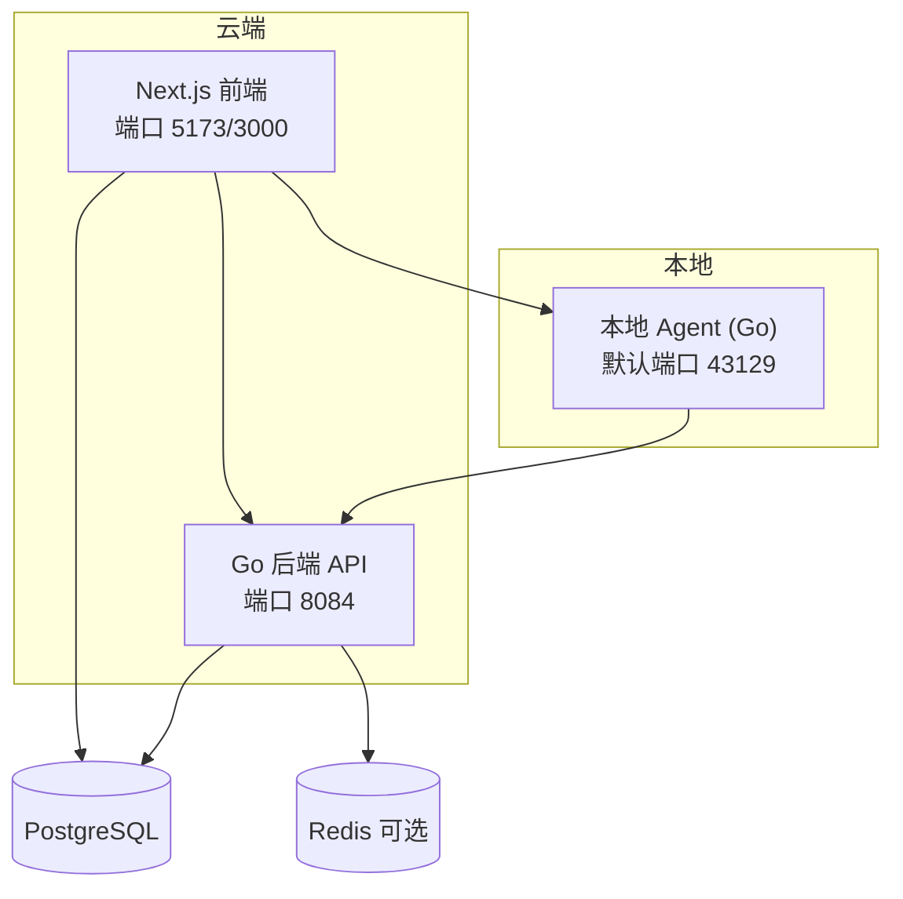
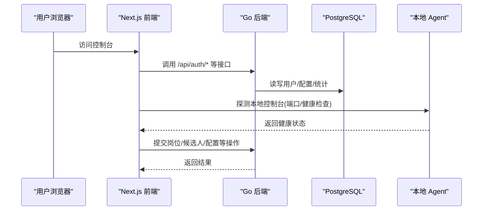
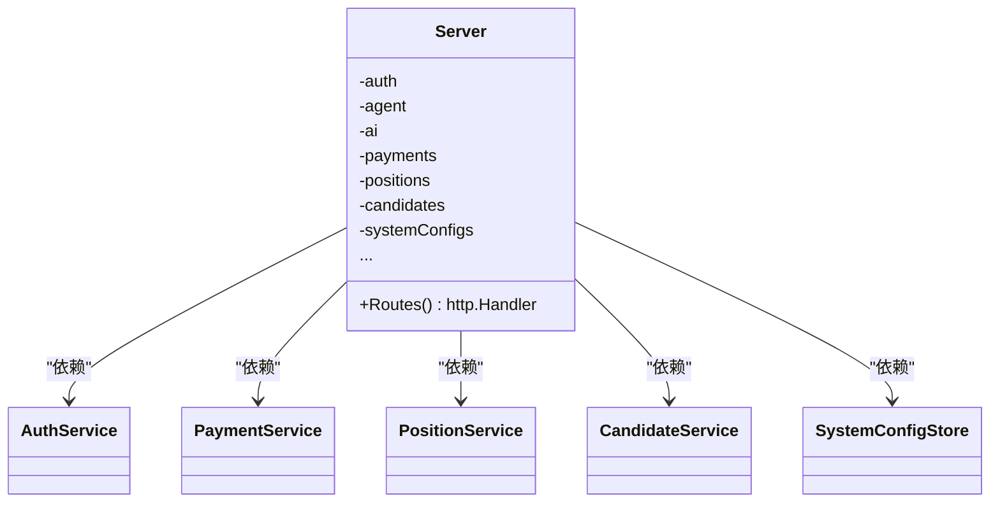
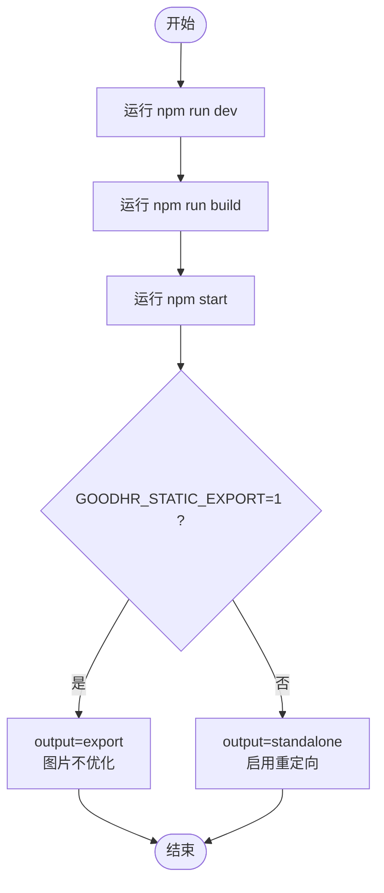
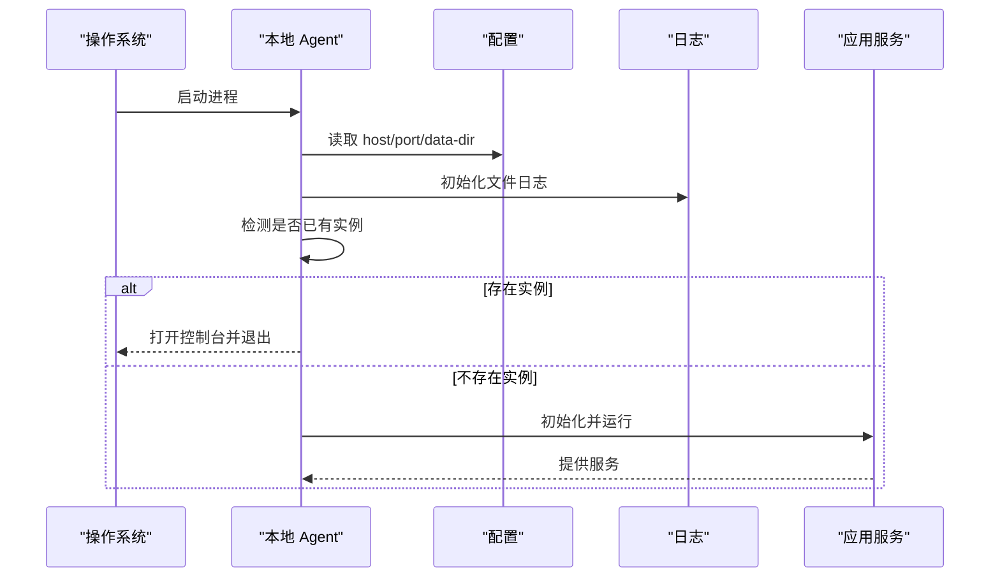
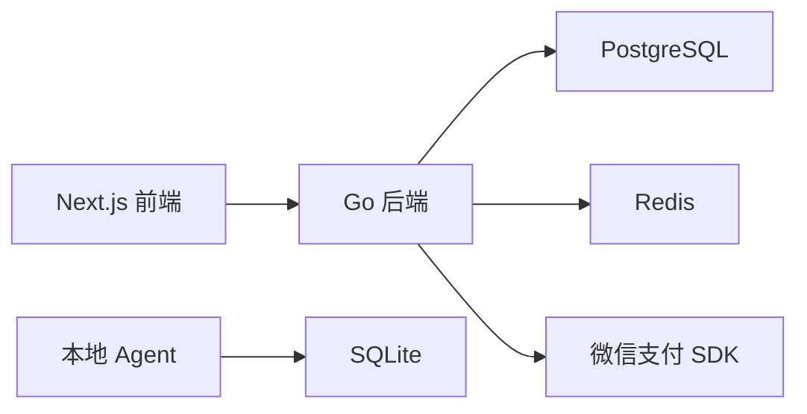

# 开发指南

<cite>
**本文引用的文件**
- [goodhr5/README.md](file://goodhr5/README.md)
- [docker-compose.yml](file://goodhr5/docker-compose.yml)
- [cloud/backend/go.mod](file://goodhr5/cloud/backend/go.mod)
- [cloud/frontend-next/package.json](file://goodhr5/cloud/frontend-next/package.json)
- [cloud/frontend-next/next.config.ts](file://goodhr5/cloud/frontend-next/next.config.ts)
- [cloud/backend/.air.toml](file://goodhr5/cloud/backend/.air.toml)
- [cloud/backend/internal/httpapi/server.go](file://goodhr5/cloud/backend/internal/httpapi/server.go)
- [local-agent-go/cmd/goodhr-local-agent/main.go](file://goodhr5/local-agent-go/cmd/goodhr-local-agent/main.go)
- [local-agent-go/scripts/build_go_binary.sh](file://goodhr5/local-agent-go/scripts/build_go_binary.sh)
- [local-agent-go-new/cmd/goodhr-local-agent/main.go](file://goodhr5/local-agent-go-new/cmd/goodhr-local-agent/main.go)
- [local-agent-go-new/scripts/build.sh](file://goodhr5/local-agent-go-new/scripts/build.sh)
- [auto_deploy.sh](file://goodhr5/auto_deploy.sh)
- [docs/development-standards.md](file://goodhr5/docs/development-standards.md)
</cite>

## 目录
1. [简介](#简介)
2. [项目结构](#项目结构)
3. [核心组件](#核心组件)
4. [架构总览](#架构总览)
5. [详细组件分析](#详细组件分析)
6. [依赖分析](#依赖分析)
7. [性能考虑](#性能考虑)
8. [故障排查指南](#故障排查指南)
9. [结论](#结论)
10. [附录](#附录)

## 简介
本指南面向 HRPlus 团队成员，提供统一的开发环境搭建、依赖安装、数据库初始化、代码规范、Go/TypeScript 工作流程、调试与测试方法、新功能开发流程、构建与发布、版本管理策略等。HRPlus 包含云端后端（Go）、云端前端（Next.js）、本地 Agent（Go）三部分，遵循“云端只保存用户、配置、岗位运行元信息和统计摘要；候选人详情、截图、OCR、平台 cookie/profile 仅保存在本地”的数据边界原则。

**章节来源**
- [goodhr5/README.md:1-22](file://goodhr5/README.md#L1-L22)

## 项目结构
- cloud/backend：Go 云端 API，负责登录、岗位运行元信息、配置、机器绑定和版本管理等。
- cloud/frontend-next：Next.js 前端，提供控制台与管理界面。
- local-agent-go / local-agent-go-new：本地执行器（Go），负责浏览器控制、平台页面操作、截图、OCR 和本地数据。
- docs：架构说明、接口草案与进度文档。
- docker-compose.*：本地与服务器部署编排。
- auto_deploy.sh：服务器自动部署脚本。

**图表来源**
- [docker-compose.yml:1-32](file://goodhr5/docker-compose.yml#L1-L32)
- [cloud/backend/internal/httpapi/server.go:124-200](file://goodhr5/cloud/backend/internal/httpapi/server.go#L124-L200)

**章节来源**
- [docker-compose.yml:1-32](file://goodhr5/docker-compose.yml#L1-L32)
- [cloud/backend/internal/httpapi/server.go:124-200](file://goodhr5/cloud/backend/internal/httpapi/server.go#L124-L200)

## 核心组件
- 云端后端服务：通过统一 Server 组装各业务模块并注册路由，包括认证、Agent 绑定、AI 配置、支付、订阅、岗位、候选人、系统配置等。
- 前端应用：Next.js 应用，支持静态导出或 standalone 输出，提供管理后台与用户界面。
- 本地 Agent：解析启动参数、加载配置、写入日志、启动内部服务并与云端交互。

**章节来源**
- [cloud/backend/internal/httpapi/server.go:16-120](file://goodhr5/cloud/backend/internal/httpapi/server.go#L16-L120)
- [cloud/frontend-next/package.json:1-33](file://goodhr5/cloud/frontend-next/package.json#L1-L33)
- [local-agent-go/cmd/goodhr-local-agent/main.go:18-62](file://goodhr5/local-agent-go/cmd/goodhr-local-agent/main.go#L18-L62)

## 架构总览
云端前后端通过 HTTP 通信，前端在开发时监听 5173，生产可通过环境变量切换为 3000；后端默认 8084。本地 Agent 默认监听本地端口（如 43129），由前端探测或通过 URL 参数传入。数据库使用 PostgreSQL，可选 Redis 用于缓存或会话。

**图表来源**
- [docker-compose.yml:10-27](file://goodhr5/docker-compose.yml#L10-L27)
- [cloud/backend/internal/httpapi/server.go:124-200](file://goodhr5/cloud/backend/internal/httpapi/server.go#L124-L200)
- [local-agent-go/cmd/goodhr-local-agent/main.go:18-62](file://goodhr5/local-agent-go/cmd/goodhr-local-agent/main.go#L18-L62)

## 详细组件分析

### 云端后端服务（Go）
- 服务装配：NewServer 从环境变量加载配置，初始化数据库连接、邮件服务、租户存储、认证存储、各类 Store 与服务实例，完成依赖注入。
- 路由注册：Routes 集中注册健康检查、认证、Agent 绑定、AI 配置、支付、订阅、岗位、候选人、系统配置等接口。
- 扩展点：新增业务模块应实现对应 Service/Store，并在 NewServer 中注入，在 Routes 中注册路由。

**图表来源**
- [cloud/backend/internal/httpapi/server.go:16-120](file://goodhr5/cloud/backend/internal/httpapi/server.go#L16-L120)
- [cloud/backend/internal/httpapi/server.go:124-200](file://goodhr5/cloud/backend/internal/httpapi/server.go#L124-L200)

**章节来源**
- [cloud/backend/internal/httpapi/server.go:16-120](file://goodhr5/cloud/backend/internal/httpapi/server.go#L16-L120)
- [cloud/backend/internal/httpapi/server.go:124-200](file://goodhr5/cloud/backend/internal/httpapi/server.go#L124-L200)

### 前端应用（Next.js）
- 开发脚本：npm run dev 启动开发服务器，监听 127.0.0.1:5173。
- 构建与启动：npm run build 生成产物；npm start 以 standalone 模式运行，监听 0.0.0.0。
- 构建行为：next.config.ts 根据环境变量 GOODHR_STATIC_EXPORT 切换 output 为 export 或 standalone，并处理图片优化与重定向。

**图表来源**
- [cloud/frontend-next/package.json:5-9](file://goodhr5/cloud/frontend-next/package.json#L5-L9)
- [cloud/frontend-next/next.config.ts:4-17](file://goodhr5/cloud/frontend-next/next.config.ts#L4-L17)

**章节来源**
- [cloud/frontend-next/package.json:1-33](file://goodhr5/cloud/frontend-next/package.json#L1-L33)
- [cloud/frontend-next/next.config.ts:1-20](file://goodhr5/cloud/frontend-next/next.config.ts#L1-L20)

### 本地 Agent（Go）
- 启动入口：解析 host/port/data-dir/version 等参数，加载配置，初始化日志，检测并复用已有实例，启动应用服务。
- 旧版本兼容：支持 restart 参数关闭旧进程并释放端口，确保单实例运行。
- 日志与配置：将日志输出到文件或标准错误，记录关键启动信息与配置。

**图表来源**
- [local-agent-go/cmd/goodhr-local-agent/main.go:18-62](file://goodhr5/local-agent-go/cmd/goodhr-local-agent/main.go#L18-L62)
- [local-agent-go-new/cmd/goodhr-local-agent/main.go:21-63](file://goodhr5/local-agent-go-new/cmd/goodhr-local-agent/main.go#L21-L63)

**章节来源**
- [local-agent-go/cmd/goodhr-local-agent/main.go:18-62](file://goodhr5/local-agent-go/cmd/goodhr-local-agent/main.go#L18-L62)
- [local-agent-go-new/cmd/goodhr-local-agent/main.go:21-63](file://goodhr5/local-agent-go-new/cmd/goodhr-local-agent/main.go#L21-L63)

## 依赖分析
- 后端依赖：PostgreSQL（lib/pq）、Redis（go-redis）、微信支付 SDK（wechatpay-go）。
- 前端依赖：Next.js、React、MUI、编辑器等。
- 本地 Agent：SQLite（modernc.org/sqlite）用于本地持久化。

**图表来源**
- [cloud/backend/go.mod:5-17](file://goodhr5/cloud/backend/go.mod#L5-L17)
- [cloud/frontend-next/package.json:10-31](file://goodhr5/cloud/frontend-next/package.json#L10-L31)
- [local-agent-go/go.mod:5-19](file://goodhr5/local-agent-go/go.mod#L5-L19)
- [local-agent-go-new/go.mod:5-17](file://goodhr5/local-agent-go-new/go.mod#L5-L17)

**章节来源**
- [cloud/backend/go.mod:1-18](file://goodhr5/cloud/backend/go.mod#L1-L18)
- [cloud/frontend-next/package.json:1-33](file://goodhr5/cloud/frontend-next/package.json#L1-L33)
- [local-agent-go/go.mod:1-20](file://goodhr5/local-agent-go/go.mod#L1-L20)
- [local-agent-go-new/go.mod:1-18](file://goodhr5/local-agent-go-new/go.mod#L1-L18)

## 性能考虑
- 后端：合理使用数据库连接池与索引；对热点查询增加缓存（Redis）；避免在请求路径中进行重型计算。
- 前端：按需引入组件与样式；利用 Next.js 的静态导出或 standalone 输出减少运行时开销；合理设置图片优化策略。
- 本地 Agent：控制并发与重试策略；避免频繁截图与 OCR；合理划分任务粒度，降低资源占用。

## 故障排查指南
- 后端无法启动：检查 .env 环境变量、PostgreSQL/Redis 连通性；查看 air 构建日志与 tmp 目录产物。
- 前端无法访问：确认端口冲突；检查 next.config.ts 的输出模式与环境变量；验证 CLOUD_API_BASE/NEXT_PUBLIC_*。
- 本地 Agent 端口占用：使用 restart 参数清理旧进程；检查端口占用情况；查看日志文件定位失败原因。
- 自动部署失败：检查 auto_deploy.sh 锁文件与日志；确认 Docker Compose 命令可用；核对变更范围分类逻辑。

**章节来源**
- [cloud/backend/.air.toml:5-22](file://goodhr5/cloud/backend/.air.toml#L5-L22)
- [cloud/frontend-next/next.config.ts:4-17](file://goodhr5/cloud/frontend-next/next.config.ts#L4-L17)
- [local-agent-go/cmd/goodhr-local-agent/main.go:28-37](file://goodhr5/local-agent-go/cmd/goodhr-local-agent/main.go#L28-L37)
- [auto_deploy.sh:119-172](file://goodhr5/auto_deploy.sh#L119-L172)

## 结论
HRPlus 采用清晰的三层架构：云端后端、云端前端、本地 Agent。通过统一的依赖注入与路由注册、标准化的构建与部署脚本、严格的代码规范与数据边界，团队可以高效协作、稳定迭代。建议在新功能开发中严格遵循模块化、注释规范、提交流程与测试验证，确保代码质量与可维护性。

## 附录

### 开发环境搭建步骤
- 前置条件
  - 安装 Go 1.24+（后端）、Node.js（前端）、Docker/Docker Compose（容器化）。
  - 准备 PostgreSQL 数据库；可选 Redis。
- 克隆仓库
  - 进入 goodhr5 目录。
- 启动后端
  - 方式一（容器）：docker compose up backend。
  - 方式二（本地）：cd cloud/backend && go mod download && air（热重载）。
- 启动前端
  - cd cloud/frontend-next && npm install && npm run dev。
- 启动本地 Agent
  - 编译并运行：参考本地 Agent 构建脚本。
- 数据库初始化
  - 使用 migrations 目录下的 SQL 文件按顺序执行（首次部署需创建初始 schema）。

**章节来源**
- [docker-compose.yml:1-32](file://goodhr5/docker-compose.yml#L1-L32)
- [cloud/backend/.air.toml:5-22](file://goodhr5/cloud/backend/.air.toml#L5-L22)
- [cloud/frontend-next/package.json:5-9](file://goodhr5/cloud/frontend-next/package.json#L5-L9)
- [local-agent-go/scripts/build_go_binary.sh:1-39](file://goodhr5/local-agent-go/scripts/build_go_binary.sh#L1-L39)
- [local-agent-go-new/scripts/build.sh:1-18](file://goodhr5/local-agent-go-new/scripts/build.sh#L1-L18)

### 依赖安装
- 后端：go mod download（或 go build 自动拉取）。
- 前端：npm install。
- 本地 Agent：根据平台选择构建脚本，必要时设置 GOPROXY/npm registry。

**章节来源**
- [cloud/backend/go.mod:1-18](file://goodhr5/cloud/backend/go.mod#L1-L18)
- [cloud/frontend-next/package.json:10-31](file://goodhr5/cloud/frontend-next/package.json#L10-L31)
- [local-agent-go-new/scripts/build.sh:8-17](file://goodhr5/local-agent-go-new/scripts/build.sh#L8-L17)

### 数据库初始化
- 首次部署：执行 initial schema 迁移文件。
- 后续升级：按编号顺序执行迁移文件（含 down 文件用于回滚）。
- 注意事项：确保数据库连接正确；迁移前备份数据。

**章节来源**
- [goodhr5/cloud/backend/db/migrations/0001_initial_schema.sql](file://goodhr5/cloud/backend/db/migrations/0001_initial_schema.sql)
- [goodhr5/cloud/backend/db/migrations/0001_initial_schema.down.sql](file://goodhr5/cloud/backend/db/migrations/0001_initial_schema.down.sql)

### 代码规范与命名约定
- 模块化：每个模块职责清晰，禁止大文件堆砌。
- 文件头注释：每个新增文件顶部写明用途。
- 方法注释：导出的函数/方法必须有中文注释。
- 调用点说明：关键调用处注明业务目的。
- 注释边界：解释业务目的，不重复字面含义；公共接口、跨模块、持久化、外部调用必须注释。
- 数据边界：敏感数据仅存本地；云端仅保存必要元信息。

**章节来源**
- [docs/development-standards.md:7-107](file://goodhr5/docs/development-standards.md#L7-L107)

### Go 开发工作流程
- 本地开发：使用 air 进行热重载；修改后自动重新构建并重启。
- 单元测试：编写 *_test.go；使用 testify 断言。
- 构建与发布：使用构建脚本交叉编译二进制；打包 Windows 安装器。

**章节来源**
- [cloud/backend/.air.toml:5-22](file://goodhr5/cloud/backend/.air.toml#L5-L22)
- [cloud/backend/go.mod:11-17](file://goodhr5/cloud/backend/go.mod#L11-L17)
- [local-agent-go/scripts/build_go_binary.sh:1-39](file://goodhr5/local-agent-go/scripts/build_go_binary.sh#L1-L39)

### TypeScript/Next.js 开发工作流程
- 开发：npm run dev；修改热更新。
- 构建：npm run build；根据环境变量选择输出模式。
- 启动：npm start；生产环境监听 0.0.0.0。

**章节来源**
- [cloud/frontend-next/package.json:5-9](file://goodhr5/cloud/frontend-next/package.json#L5-L9)
- [cloud/frontend-next/next.config.ts:4-17](file://goodhr5/cloud/frontend-next/next.config.ts#L4-L17)

### 调试技巧
- 后端：查看 air 构建日志；检查 tmp/main 产物；打印关键上下文。
- 前端：浏览器开发者工具；网络面板查看 API 响应；环境变量校验。
- 本地 Agent：查看日志文件；使用 health 接口探测；检查端口占用。

**章节来源**
- [cloud/backend/.air.toml:5-22](file://goodhr5/cloud/backend/.air.toml#L5-L22)
- [local-agent-go/cmd/goodhr-local-agent/main.go:64-86](file://goodhr5/local-agent-go/cmd/goodhr-local-agent/main.go#L64-L86)

### 测试编写方法
- 后端：使用 testify 编写单元与集成测试；覆盖关键业务逻辑。
- 前端：针对组件与工具函数编写测试用例；使用 Jest/Mocha（依据现有配置）。
- 本地 Agent：对浏览器动作、滚动、截图等编写测试；确保稳定性。

**章节来源**
- [cloud/backend/go.mod:14-14](file://goodhr5/cloud/backend/go.mod#L14-L14)
- [cloud/frontend-next/package.json:26-31](file://goodhr5/cloud/frontend-next/package.json#L26-L31)

### 新功能开发完整流程
- 需求分析：明确目标、影响范围、数据边界。
- 设计文档：更新 docs/progress.md 或相关设计文档；定义接口与模块拆分。
- 代码实现：遵循模块化与注释规范；新增 Service/Store/路由。
- 测试验证：编写并运行测试；本地联调；容器化验证。
- 文档更新：更新 README、API 文档、部署说明。
- 提交与合并：单独 commit；推送分支；发起 PR；评审通过后合并。

**章节来源**
- [docs/development-standards.md:93-107](file://goodhr5/docs/development-standards.md#L93-L107)

### 构建脚本使用方法
- 后端：air 热重载；go build 构建二进制。
- 前端：npm run dev/build/start。
- 本地 Agent：build_go_binary.sh 或 build.sh；Windows 安装器脚本。

**章节来源**
- [cloud/backend/.air.toml:5-22](file://goodhr5/cloud/backend/.air.toml#L5-L22)
- [cloud/frontend-next/package.json:5-9](file://goodhr5/cloud/frontend-next/package.json#L5-L9)
- [local-agent-go/scripts/build_go_binary.sh:1-39](file://goodhr5/local-agent-go/scripts/build_go_binary.sh#L1-L39)
- [local-agent-go-new/scripts/build.sh:1-18](file://goodhr5/local-agent-go-new/scripts/build.sh#L1-L18)

### 打包发布流程
- 后端：构建镜像（Dockerfile）；推送到镜像仓库；服务器部署。
- 前端：构建静态站点或 standalone；部署到 CDN/Nginx。
- 本地 Agent：交叉编译二进制；打包 Windows 安装器；分发安装包。

**章节来源**
- [docker-compose.yml:1-32](file://goodhr5/docker-compose.yml#L1-L32)
- [auto_deploy.sh:132-172](file://goodhr5/auto_deploy.sh#L132-L172)

### 版本管理策略
- 分支策略：main 为主分支；功能分支开发；PR 评审后合并。
- 提交规范：每次独立功能单独 commit；更新进度文档。
- 标签与发布：打 tag 标记版本；记录变更日志；灰度发布与回滚预案。

**章节来源**
- [docs/development-standards.md:93-107](file://goodhr5/docs/development-standards.md#L93-L107)
- [auto_deploy.sh:44-76](file://goodhr5/auto_deploy.sh#L44-L76)