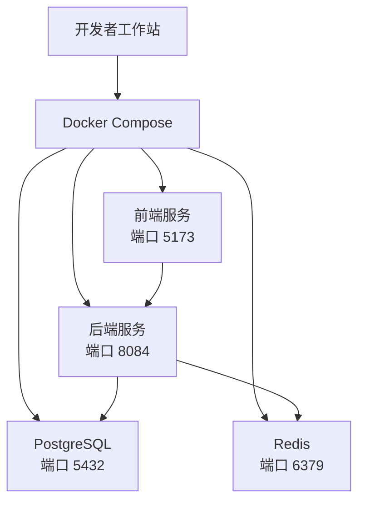
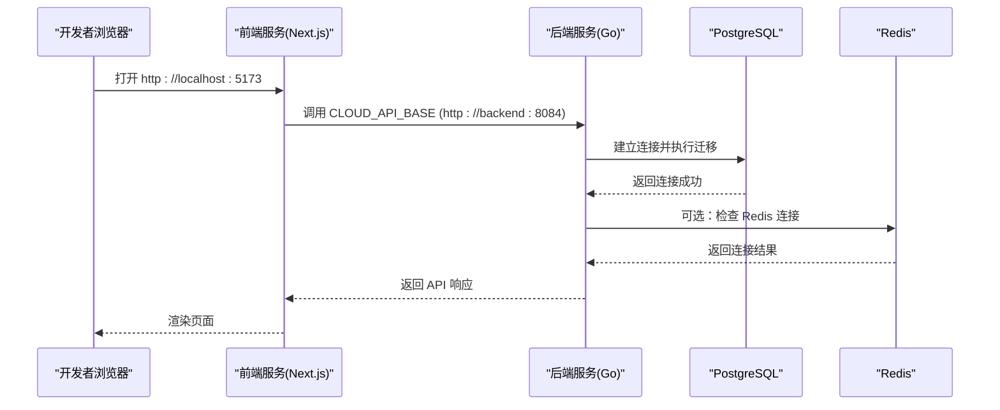
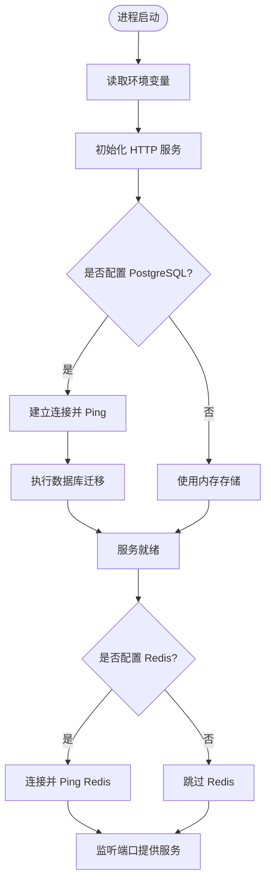
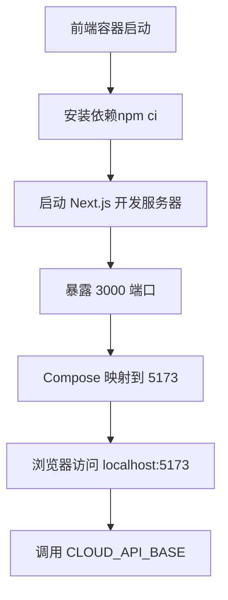
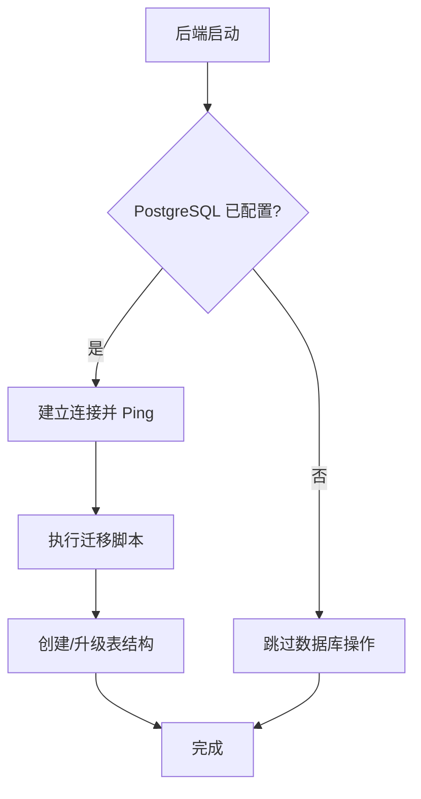
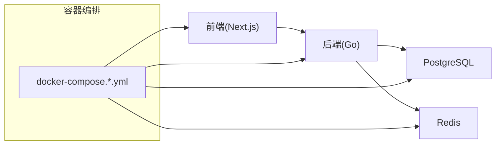

# 开发环境搭建

<cite>
**本文引用的文件**
- [README.md](file://goodhr5/README.md)
- [docker-compose.yml](file://goodhr5/docker-compose.yml)
- [docker-compose.local.yml](file://goodhr5/docker-compose.local.yml)
- [docker-compose.server.yml](file://goodhr5/docker-compose.server.yml)
- [docker-compose.local.windows.yml](file://goodhr5/docker-compose.local.windows.yml)
- [README_DOCKER.md](file://goodhr5/README_DOCKER.md)
- [Dockerfile.dev（后端）](file://goodhr5/cloud/backend/Dockerfile.dev)
- [Dockerfile.dev（前端）](file://goodhr5/cloud/frontend-next/Dockerfile.dev)
- [main.go](file://goodhr5/cloud/backend/cmd/server/main.go)
- [config.go](file://goodhr5/cloud/backend/internal/httpapi/config.go)
- [0001_initial_schema.sql](file://goodhr5/cloud/backend/db/migrations/0001_initial_schema.sql)
- [.air.local.toml](file://goodhr5/cloud/backend/.air.local.toml)
- [package.json（前端）](file://goodhr5/cloud/frontend-next/package.json)
- [go.mod（后端）](file://goodhr5/cloud/backend/go.mod)
</cite>

## 目录
1. [简介](#简介)
2. [项目结构](#项目结构)
3. [核心组件](#核心组件)
4. [架构总览](#架构总览)
5. [详细组件分析](#详细组件分析)
6. [依赖关系分析](#依赖关系分析)
7. [性能与可观测性建议](#性能与可观测性建议)
8. [故障排查指南](#故障排查指南)
9. [结论](#结论)
10. [附录：从零开始的环境搭建步骤](#附录从零开始的环境搭建步骤)

## 简介
本指南面向首次接触 GoodHR 5 的开发者，提供从零开始的本地开发环境搭建说明。内容涵盖 Go、Node.js、PostgreSQL、Redis 等依赖的安装与配置；Docker Compose 的使用与容器编排；数据库初始化、环境变量配置、本地服务启动流程；以及 Windows 与 Linux/macOS 的差异化和常见问题排查。

GoodHR 5 由云端后端（Go）、云端前端（Next.js）、本地 Agent（桌面端程序）组成。本地开发通常通过 Docker Compose 启动后端和前端，并复用外部或容器化的 PostgreSQL 与 Redis。

**章节来源**
- [README.md:1-22](file://goodhr5/README.md#L1-L22)

## 项目结构
仓库根目录下的 goodhr5 是主工程目录，包含：
- cloud/backend：Go 云端 API 服务
- cloud/frontend-next：Next.js 前端应用
- local-agent-go / local-agent-go：本地执行器（桌面端，不在容器中运行）
- docker-compose*.yml：不同场景的容器编排配置
- README_DOCKER.md：Docker 快速启动说明

**图示来源**
- [docker-compose.yml:1-32](file://goodhr5/docker-compose.yml#L1-L32)
- [docker-compose.local.yml:1-54](file://goodhr5/docker-compose.local.yml#L1-L54)
- [docker-compose.local.windows.yml:1-58](file://goodhr5/docker-compose.local.windows.yml#L1-L58)

**章节来源**
- [docker-compose.yml:1-32](file://goodhr5/docker-compose.yml#L1-L32)
- [docker-compose.local.yml:1-54](file://goodhr5/docker-compose.local.yml#L1-L54)
- [docker-compose.local.windows.yml:1-58](file://goodhr5/docker-compose.local.windows.yml#L1-L58)
- [README_DOCKER.md:1-46](file://goodhr5/README_DOCKER.md#L1-L46)

## 核心组件
- 云端后端（Go）
  - 入口：监听地址默认 :8084，支持日志文件输出路径配置
  - 配置加载：从环境变量读取 PostgreSQL、Redis、SMTP 等配置，自动创建连接并执行迁移
  - 存储层：根据是否配置 PostgreSQL/Redis 选择持久化或内存实现
- 云端前端（Next.js）
  - 开发服务器：默认监听 5173，构建时设置国内 npm 镜像加速
  - 环境变量：CLOUD_API_BASE、NEXT_PUBLIC_CLOUD_API_BASE、NEXT_PUBLIC_SITE_URL
- 数据层
  - PostgreSQL：初始表结构定义在迁移文件中，启动时自动执行迁移
  - Redis：可选缓存与会话存储，未配置时回退到内存实现

**章节来源**
- [main.go:14-30](file://goodhr5/cloud/backend/cmd/server/main.go#L14-L30)
- [config.go:31-75](file://goodhr5/cloud/backend/internal/httpapi/config.go#L31-L75)
- [config.go:77-101](file://goodhr5/cloud/backend/internal/httpapi/config.go#L77-L101)
- [config.go:103-268](file://goodhr5/cloud/backend/internal/httpapi/config.go#L103-L268)
- [Dockerfile.dev（前端）:1-12](file://goodhr5/cloud/frontend-next/Dockerfile.dev#L1-L12)
- [package.json（前端）:5-9](file://goodhr5/cloud/frontend-next/package.json#L5-L9)
- [0001_initial_schema.sql:1-135](file://goodhr5/cloud/backend/db/migrations/0001_initial_schema.sql#L1-L135)

## 架构总览
下图展示了本地开发时的请求流：浏览器访问前端，前端调用后端 API，后端连接 PostgreSQL 与 Redis，并在启动时执行数据库迁移。

**图示来源**
- [docker-compose.local.yml:5-22](file://goodhr5/docker-compose.local.yml#L5-L22)
- [docker-compose.local.yml:24-42](file://goodhr5/docker-compose.local.yml#L24-L42)
- [config.go:48-75](file://goodhr5/cloud/backend/internal/httpapi/config.go#L48-L75)
- [config.go:77-87](file://goodhr5/cloud/backend/internal/httpapi/config.go#L77-L87)

## 详细组件分析

### 后端服务（Go）
- 启动流程
  - 读取监听地址与环境变量
  - 初始化 HTTP 路由与服务
  - 写入日志到指定文件
- 配置加载
  - 从环境变量加载 PostgreSQL DSN、Redis 地址/密码/库号、SMTP 等
  - 若配置了 PostgreSQL，则建立连接池并执行迁移
  - 若配置了 Redis，则建立连接并校验；否则使用内存实现
- 热更新
  - 开发镜像安装 Air，监听 .go/.sql/.html 等变化并自动重启

**图示来源**
- [main.go:14-30](file://goodhr5/cloud/backend/cmd/server/main.go#L14-L30)
- [config.go:31-75](file://goodhr5/cloud/backend/internal/httpapi/config.go#L31-L75)
- [config.go:77-87](file://goodhr5/cloud/backend/internal/httpapi/config.go#L77-L87)
- [.air.local.toml:1-21](file://goodhr5/cloud/backend/.air.local.toml#L1-L21)

**章节来源**
- [main.go:14-30](file://goodhr5/cloud/backend/cmd/server/main.go#L14-L30)
- [config.go:31-75](file://goodhr5/cloud/backend/internal/httpapi/config.go#L31-L75)
- [config.go:77-101](file://goodhr5/cloud/backend/internal/httpapi/config.go#L77-L101)
- [.air.local.toml:1-21](file://goodhr5/cloud/backend/.air.local.toml#L1-L21)
- [Dockerfile.dev（后端）:1-14](file://goodhr5/cloud/backend/Dockerfile.dev#L1-L14)

### 前端服务（Next.js）
- 开发模式
  - 使用 Node 22 Alpine 镜像
  - 设置 npm 镜像为国内源，提升依赖安装速度
  - 暴露 3000 端口，Compose 映射到宿主机 5173
- 环境变量
  - CLOUD_API_BASE：后端 API 基础地址（容器内）
  - NEXT_PUBLIC_CLOUD_API_BASE：前端公开的后端地址（浏览器侧）
  - NEXT_PUBLIC_SITE_URL：站点地址

**图示来源**
- [Dockerfile.dev（前端）:1-12](file://goodhr5/cloud/frontend-next/Dockerfile.dev#L1-L12)
- [docker-compose.local.yml:24-42](file://goodhr5/docker-compose.local.yml#L24-L42)
- [package.json（前端）:5-9](file://goodhr5/cloud/frontend-next/package.json#L5-L9)

**章节来源**
- [Dockerfile.dev（前端）:1-12](file://goodhr5/cloud/frontend-next/Dockerfile.dev#L1-L12)
- [docker-compose.local.yml:24-42](file://goodhr5/docker-compose.local.yml#L24-L42)
- [package.json（前端）:5-9](file://goodhr5/cloud/frontend-next/package.json#L5-L9)

### 数据库与迁移
- 初始表结构
  - users、local_agents、platform_accounts、positions、user_ai_configs、task_runs、task_logs 等
  - 包含索引与注释，便于理解业务含义
- 自动迁移
  - 后端启动时检测 PostgreSQL 连接，成功后执行迁移脚本
  - 迁移失败会返回错误并阻止服务继续

**图示来源**
- [config.go:48-75](file://goodhr5/cloud/backend/internal/httpapi/config.go#L48-L75)
- [0001_initial_schema.sql:1-135](file://goodhr5/cloud/backend/db/migrations/0001_initial_schema.sql#L1-L135)

**章节来源**
- [config.go:48-75](file://goodhr5/cloud/backend/internal/httpapi/config.go#L48-L75)
- [0001_initial_schema.sql:1-135](file://goodhr5/cloud/backend/db/migrations/0001_initial_schema.sql#L1-L135)

## 依赖关系分析
- 后端依赖
  - PostgreSQL：lib/pq 驱动
  - Redis：go-redis/v9
  - 微信支付：wechatpay-go（支付相关功能）
- 前端依赖
  - Next.js、React、Material UI、编辑器等
- 容器编排
  - docker-compose.yml：通用编排
  - docker-compose.local.yml：本地开发，复用 data-services 网络中的数据库
  - docker-compose.local.windows.yml：Windows 专用，启用轮询以兼容挂载
  - docker-compose.server.yml：Linux 服务器部署，使用 host 网络

**图示来源**
- [go.mod（后端）:1-18](file://goodhr5/cloud/backend/go.mod#L1-L18)
- [docker-compose.yml:1-32](file://goodhr5/docker-compose.yml#L1-L32)
- [docker-compose.local.yml:1-54](file://goodhr5/docker-compose.local.yml#L1-L54)
- [docker-compose.local.windows.yml:1-58](file://goodhr5/docker-compose.local.windows.yml#L1-L58)
- [docker-compose.server.yml:1-12](file://goodhr5/docker-compose.server.yml#L1-L12)

**章节来源**
- [go.mod（后端）:1-18](file://goodhr5/cloud/backend/go.mod#L1-L18)
- [docker-compose.yml:1-32](file://goodhr5/docker-compose.yml#L1-L32)
- [docker-compose.local.yml:1-54](file://goodhr5/docker-compose.local.yml#L1-L54)
- [docker-compose.local.windows.yml:1-58](file://goodhr5/docker-compose.local.windows.yml#L1-L58)
- [docker-compose.server.yml:1-12](file://goodhr5/docker-compose.server.yml#L1-L12)

## 性能与可观测性建议
- 连接池与超时
  - 后端对 PostgreSQL 设置了最大连接数、空闲连接数与连接生命周期，避免资源耗尽
  - 连接 Ping 带超时，确保快速失败
- 日志
  - 后端将日志同时输出到标准输出与文件，便于容器日志采集与本地调试
- 缓存
  - 配置 Redis 可为岗位日志等热点数据提供缓存层，降低数据库压力
- 前端构建
  - 使用国内 npm 镜像加速依赖安装，减少冷启动时间

[本节为通用建议，不直接分析具体文件]

## 故障排查指南
- 无法连接 PostgreSQL
  - 检查 GOODHR_PG_DSN 是否正确，确认端口、用户名、密码、数据库名
  - 查看后端日志中“PostgreSQL 连接失败”或“自动迁移失败”的错误信息
  - 确认数据库服务可用且网络可达（容器内使用服务名，本地使用 127.0.0.1）
- 无法连接 Redis
  - 检查 GOODHR_REDIS_ADDR、GOODHR_REDIS_PASSWORD、GOODHR_REDIS_DB
  - 若未配置 Redis，后端会回退到内存实现，不影响基本功能
- 前端无法访问后端
  - 确认 CLOUD_API_BASE 指向容器内的 backend:8084
  - 确认 NEXT_PUBLIC_CLOUD_API_BASE 指向浏览器可访问的地址（如 http://localhost:8084）
- 热更新不生效（Windows）
  - 使用 docker-compose.local.windows.yml，Air 与前端均启用轮询模式
  - 确保 .air.local.toml 的 poll=true 与 include_ext 包含 .go/.sql/.html
- 端口冲突
  - 后端 8084、前端 5173、PostgreSQL 5432、Redis 6379 需未被占用
- 权限问题（Linux/macOS）
  - 确保有权限读写挂载目录与日志目录
- 依赖安装缓慢
  - 前端镜像已设置国内 npm 镜像；如需更快，可在本地也配置 npm 镜像

**章节来源**
- [config.go:48-75](file://goodhr5/cloud/backend/internal/httpapi/config.go#L48-L75)
- [config.go:77-87](file://goodhr5/cloud/backend/internal/httpapi/config.go#L77-L87)
- [docker-compose.local.yml:24-42](file://goodhr5/docker-compose.local.yml#L24-L42)
- [docker-compose.local.windows.yml:25-44](file://goodhr5/docker-compose.local.windows.yml#L25-L44)
- [.air.local.toml:1-21](file://goodhr5/cloud/backend/.air.local.toml#L1-L21)
- [README_DOCKER.md:28-35](file://goodhr5/README_DOCKER.md#L28-L35)

## 结论
通过 Docker Compose 与合理的环境变量配置，GoodHR 5 可以在 Windows、Linux 与 macOS 上快速搭建本地开发环境。后端自动执行数据库迁移，前端通过环境变量对接后端 API。遇到连接或热更新问题时，优先检查环境变量、网络连通性与平台差异配置。

[本节为总结，不直接分析具体文件]

## 附录：从零开始的环境搭建步骤

### 前置条件
- 操作系统：Windows 10+ 或 Linux/macOS
- 工具：
  - Docker 与 Docker Compose
  - Node.js 22（用于本地前端开发，可选）
  - Go 1.24（用于本地后端开发，可选）
  - 系统自带或容器化的 PostgreSQL、Redis（可选）

### 方式一：使用 Docker Compose 一键启动（推荐）
- 进入 goodhr5 目录
- 构建并启动服务
  - 参考快速启动命令与说明
- 访问地址
  - 后端：http://localhost:8084
  - 前端：http://localhost:5173
  - PostgreSQL：localhost:5432
  - Redis：localhost:6379
- 停止服务
  - 保留数据：停止但不删除卷
  - 删除数据：停止并删除卷

**章节来源**
- [README_DOCKER.md:5-26](file://goodhr5/README_DOCKER.md#L5-L26)
- [docker-compose.yml:1-32](file://goodhr5/docker-compose.yml#L1-L32)

### 方式二：本地开发（复用外部数据库）
- 使用本地开发编排
  - 该配置会启动后端与前端，并复用 data-services 网络中的数据库服务
- 环境变量
  - 后端：GOODHR_CLOUD_ADDR、GOODHR_PG_DSN
  - 前端：CLOUD_API_BASE、NEXT_PUBLIC_CLOUD_API_BASE、NEXT_PUBLIC_SITE_URL
- 热更新
  - 后端：Air 监听代码变化并自动重启
  - 前端：Next.js 开发服务器即时刷新

**章节来源**
- [docker-compose.local.yml:1-54](file://goodhr5/docker-compose.local.yml#L1-L54)
- [.air.local.toml:1-21](file://goodhr5/cloud/backend/.air.local.toml#L1-L21)
- [Dockerfile.dev（前端）:1-12](file://goodhr5/cloud/frontend-next/Dockerfile.dev#L1-L12)

### 方式三：Windows 专用本地开发
- 使用 Windows 专用编排
  - 启用轮询以兼容 Windows 目录挂载
  - 复用 data-services 网络中的 PostgreSQL
- 热更新
  - 后端：Air 轮询模式
  - 前端：WATCHPACK_POLLING 开启

**章节来源**
- [docker-compose.local.windows.yml:1-58](file://goodhr5/docker-compose.local.windows.yml#L1-L58)

### 方式四：Linux 服务器部署
- 使用 host 网络
  - 后端直接使用宿主机网络，方便访问本机 PostgreSQL 与 Redis
- 环境变量
  - 通过 env_file 注入后端所需环境变量

**章节来源**
- [docker-compose.server.yml:1-12](file://goodhr5/docker-compose.server.yml#L1-L12)

### 数据库初始化
- 首次启动会自动执行迁移脚本，创建必要表结构与索引
- 若使用外部数据库，请确保版本兼容并允许后端执行迁移

**章节来源**
- [config.go:48-75](file://goodhr5/cloud/backend/internal/httpapi/config.go#L48-L75)
- [0001_initial_schema.sql:1-135](file://goodhr5/cloud/backend/db/migrations/0001_initial_schema.sql#L1-L135)

### 环境变量配置清单
- 后端
  - GOODHR_CLOUD_ADDR：监听地址
  - GOODHR_PG_DSN：PostgreSQL 连接串
  - GOODHR_REDIS_ADDR：Redis 地址
  - GOODHR_REDIS_PASSWORD：Redis 密码
  - GOODHR_REDIS_DB：Redis 库号
  - GOODHR_SUPER_ADMINS：超级管理员邮箱列表
  - GOODHR_SMTP_*：邮件发送配置
  - GOODHR_UNIVERSAL_LOGIN_CODE_OFFSET_MINUTES：登录验证码偏移分钟
  - GOODHR_CLOUD_LOG_FILE：日志文件路径
- 前端
  - CLOUD_API_BASE：后端 API 基础地址（容器内）
  - NEXT_PUBLIC_CLOUD_API_BASE：浏览器可访问的后端地址
  - NEXT_PUBLIC_SITE_URL：站点地址

**章节来源**
- [config.go:31-45](file://goodhr5/cloud/backend/internal/httpapi/config.go#L31-L45)
- [docker-compose.local.yml:9-18](file://goodhr5/docker-compose.local.yml#L9-L18)
- [docker-compose.local.yml:29-33](file://goodhr5/docker-compose.local.yml#L29-L33)
- [README_DOCKER.md:28-35](file://goodhr5/README_DOCKER.md#L28-L35)

### 本地服务启动流程
- 启动顺序
  - 先启动数据层（PostgreSQL、Redis），或通过 Compose 一并启动
  - 启动后端，自动执行迁移
  - 启动前端，配置好 CLOUD_API_BASE
- 验证
  - 访问 http://localhost:5173，确认能调用 http://localhost:8084
  - 检查后端日志是否出现“listening on :8084”
  - 检查数据库表是否创建成功

**章节来源**
- [main.go:14-30](file://goodhr5/cloud/backend/cmd/server/main.go#L14-L30)
- [docker-compose.local.yml:5-42](file://goodhr5/docker-compose.local.yml#L5-L42)
- [README_DOCKER.md:14-20](file://goodhr5/README_DOCKER.md#L14-L20)