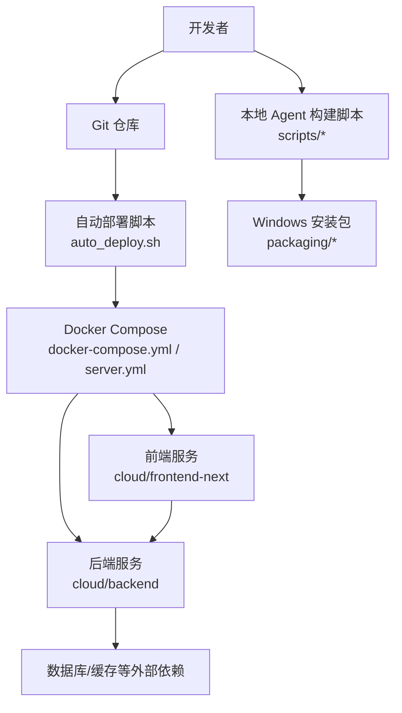
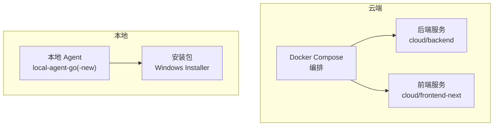
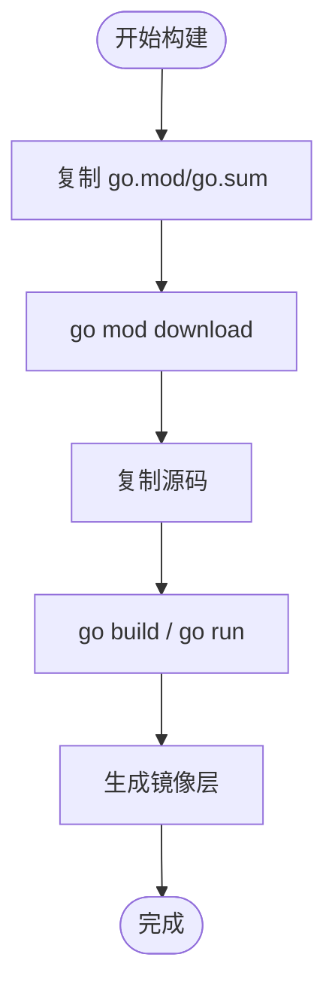
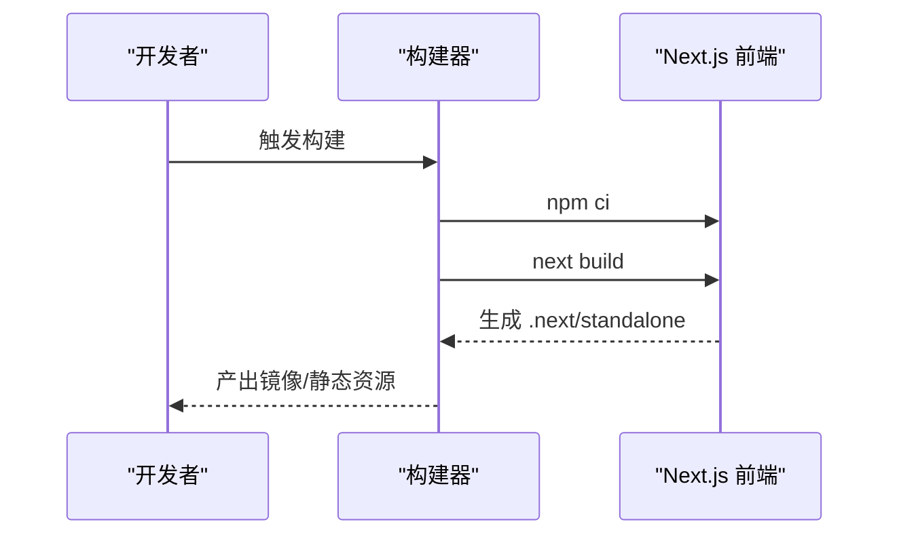
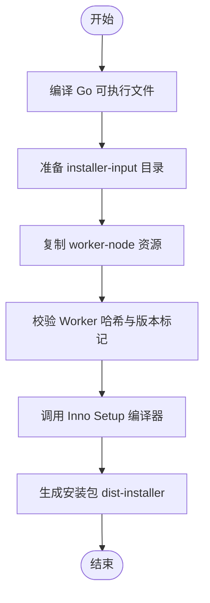
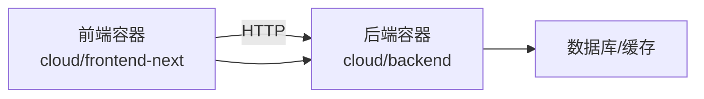
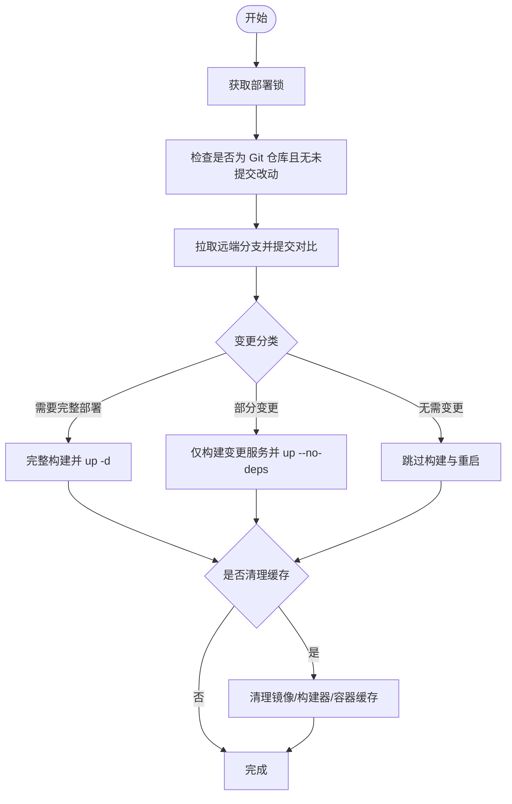
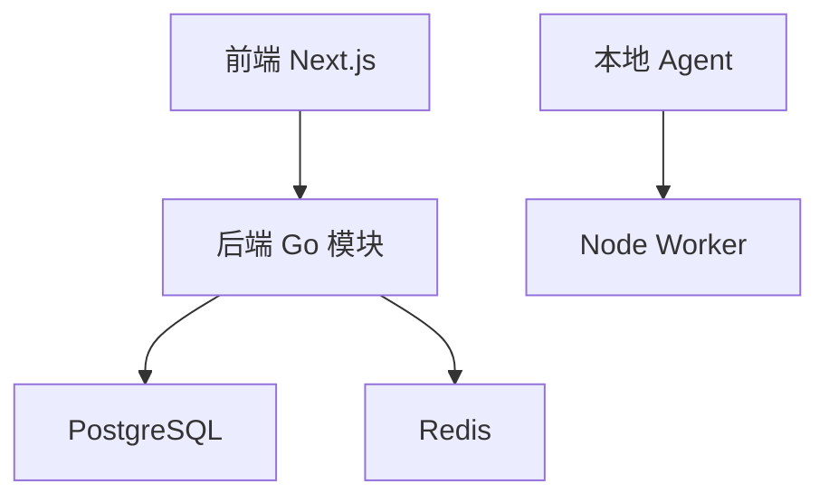

# 构建与部署

<cite>
**本文引用的文件**
- [Dockerfile](file://goodhr5/cloud/backend/Dockerfile)
- [.dockerignore（后端）](file://goodhr5/cloud/backend/.dockerignore)
- [go.mod（后端）](file://goodhr5/cloud/backend/go.mod)
- [Dockerfile（Next.js 前端）](file://goodhr5/cloud/frontend-next/Dockerfile)
- [.dockerignore（前端）](file://goodhr5/cloud/frontend-next/.dockerignore)
- [package.json（前端）](file://goodhr5/cloud/frontend-next/package.json)
- [next.config.ts（前端）](file://goodhr5/cloud/frontend-next/next.config.ts)
- [docker-compose.yml](file://goodhr5/docker-compose.yml)
- [docker-compose.server.yml](file://goodhr5/docker-compose.server.yml)
- [auto_deploy.sh](file://goodhr5/auto_deploy.sh)
- [build_go_binary.ps1（本地 Agent）](file://goodhr5/local-agent-go/scripts/build_go_binary.ps1)
- [build_go_binary.sh（本地 Agent）](file://goodhr5/local-agent-go/scripts/build_go_binary.sh)
- [build_windows_installer.ps1（Windows 安装包）](file://goodhr5/local-agent-go/packaging/build_windows_installer.ps1)
- [HRPlusLocalAgentGo.iss（Inno Setup 脚本）](file://goodhr5/local-agent-go/packaging/HRPlusLocalAgentGo.iss)
- [build.sh（新 Agent 构建）](file://goodhr5/local-agent-go-new/scripts/build.sh)
- [package-release.sh（新 Agent 发布包）](file://goodhr5/local-agent-go-new/scripts/package-release.sh)
</cite>

## 目录
1. [简介](#简介)
2. [项目结构](#项目结构)
3. [核心组件](#核心组件)
4. [架构总览](#架构总览)
5. [详细组件分析](#详细组件分析)
6. [依赖分析](#依赖分析)
7. [性能考虑](#性能考虑)
8. [故障排查指南](#故障排查指南)
9. [结论](#结论)
10. [附录](#附录)

## 简介
本文件面向 HRPlus 的构建与部署，覆盖以下范围：
- Go 后端服务的编译打包、二进制生成与依赖优化。
- Next.js 前端应用的构建配置、静态资源优化与生产部署。
- 本地 Agent 的跨平台编译、Windows 安装包制作与发布流程。
- Docker 镜像构建、多阶段构建优化与安全扫描建议。
- 自动化部署脚本使用、CI/CD 流水线建议、灰度发布策略。
- 回滚机制、监控告警与日志收集的配置方法。

## 项目结构
仓库采用“云端 + 本地”双端架构：
- 云端：Go 后端服务 + Next.js 前端应用，通过 Docker Compose 编排。
- 本地：Go 编写的本地 Agent，负责浏览器自动化与任务执行，提供 Windows 安装包与跨平台构建脚本。

**图示来源**
- [docker-compose.yml:1-32](file://goodhr5/docker-compose.yml#L1-L32)
- [docker-compose.server.yml:1-12](file://goodhr5/docker-compose.server.yml#L1-L12)
- [auto_deploy.sh:1-173](file://goodhr5/auto_deploy.sh#L1-L173)

**章节来源**
- [docker-compose.yml:1-32](file://goodhr5/docker-compose.yml#L1-L32)
- [docker-compose.server.yml:1-12](file://goodhr5/docker-compose.server.yml#L1-L12)
- [auto_deploy.sh:1-173](file://goodhr5/auto_deploy.sh#L1-L173)

## 核心组件
- Go 后端服务：基于 Go 1.24，使用 PostgreSQL 与 Redis，支持 WebSocket、支付集成等能力；提供 Dockerfile 与 .dockerignore 以优化构建上下文。
- Next.js 前端：使用 Node 22 环境，构建输出为 standalone 或静态导出模式，配合 .dockerignore 缩小构建上下文。
- 本地 Agent：提供跨平台构建脚本与 Windows 安装包制作，支持版本注入与产物校验。
- 自动化部署：基于 shell 脚本实现增量构建与按需重启，支持清理缓存与锁保护。

**章节来源**
- [Dockerfile:1-8](file://goodhr5/cloud/backend/Dockerfile#L1-L8)
- [.dockerignore（后端）:1-8](file://goodhr5/cloud/backend/.dockerignore#L1-L8)
- [go.mod（后端）:1-18](file://goodhr5/cloud/backend/go.mod#L1-L18)
- [Dockerfile（前端）:1-23](file://goodhr5/cloud/frontend-next/Dockerfile#L1-L23)
- [.dockerignore（前端）:1-10](file://goodhr5/cloud/frontend-next/.dockerignore#L1-L10)
- [package.json（前端）:1-33](file://goodhr5/cloud/frontend-next/package.json#L1-L33)
- [next.config.ts:1-20](file://goodhr5/cloud/frontend-next/next.config.ts#L1-L20)
- [build_go_binary.ps1:1-51](file://goodhr5/local-agent-go/scripts/build_go_binary.ps1#L1-L51)
- [build_go_binary.sh:1-39](file://goodhr5/local-agent-go/scripts/build_go_binary.sh#L1-L39)
- [build_windows_installer.ps1:1-159](file://goodhr5/local-agent-go/packaging/build_windows_installer.ps1#L1-L159)
- [HRPlusLocalAgentGo.iss:1-79](file://goodhr5/local-agent-go/packaging/HRPlusLocalAgentGo.iss#L1-L79)
- [build.sh（新 Agent）:1-18](file://goodhr5/local-agent-go-new/scripts/build.sh#L1-L18)
- [package-release.sh:1-60](file://goodhr5/local-agent-go-new/scripts/package-release.sh#L1-L60)

## 架构总览
云端服务通过 Docker Compose 编排，后端与前端分别独立构建与运行；本地 Agent 通过脚本进行跨平台编译与安装包制作。

**图示来源**
- [docker-compose.yml:1-32](file://goodhr5/docker-compose.yml#L1-L32)
- [docker-compose.server.yml:1-12](file://goodhr5/docker-compose.server.yml#L1-L12)
- [build_windows_installer.ps1:1-159](file://goodhr5/local-agent-go/packaging/build_windows_installer.ps1#L1-L159)

## 详细组件分析

### Go 后端服务构建与镜像优化
- 构建入口：使用 golang:1.24-alpine 基础镜像，设置 GOPROXY 加速依赖下载，先复制 go.mod/go.sum 并下载依赖，再复制源码构建。
- 构建上下文优化：通过 .dockerignore 排除 private-storage、tmp、日志与 Git 信息，减少镜像体积与构建时间。
- 依赖管理：go.mod 声明直接依赖与间接依赖，确保可重现构建。
- 运行方式：开发镜像默认以 go run 启动，生产可通过调整 CMD 为编译后的二进制。

**图示来源**
- [Dockerfile:1-8](file://goodhr5/cloud/backend/Dockerfile#L1-L8)
- [.dockerignore（后端）:1-8](file://goodhr5/cloud/backend/.dockerignore#L1-L8)
- [go.mod（后端）:1-18](file://goodhr5/cloud/backend/go.mod#L1-L18)

**章节来源**
- [Dockerfile:1-8](file://goodhr5/cloud/backend/Dockerfile#L1-L8)
- [.dockerignore（后端）:1-8](file://goodhr5/cloud/backend/.dockerignore#L1-L8)
- [go.mod（后端）:1-18](file://goodhr5/cloud/backend/go.mod#L1-L18)

### Next.js 前端构建配置与生产部署
- 构建环境：Node 22 Alpine，使用 npm ci 安装依赖，构建输出为 standalone 模式（生产），或通过环境变量切换为静态导出。
- 构建优化：.dockerignore 排除 node_modules、.next、turbo、日志等，避免上传无关文件；next.config.ts 关闭 poweredByHeader，并在静态导出时禁用图片优化。
- 运行方式：生产镜像仅复制必要文件，暴露端口并通过 node server.js 启动。

**图示来源**
- [Dockerfile（前端）:1-23](file://goodhr5/cloud/frontend-next/Dockerfile#L1-L23)
- [package.json（前端）:1-33](file://goodhr5/cloud/frontend-next/package.json#L1-L33)
- [next.config.ts:1-20](file://goodhr5/cloud/frontend-next/next.config.ts#L1-L20)

**章节来源**
- [Dockerfile（前端）:1-23](file://goodhr5/cloud/frontend-next/Dockerfile#L1-L23)
- [.dockerignore（前端）:1-10](file://goodhr5/cloud/frontend-next/.dockerignore#L1-L10)
- [package.json（前端）:1-33](file://goodhr5/cloud/frontend-next/package.json#L1-L33)
- [next.config.ts:1-20](file://goodhr5/cloud/frontend-next/next.config.ts#L1-L20)

### 本地 Agent 跨平台编译与 Windows 安装包
- 跨平台编译：提供 PowerShell 与 Bash 脚本，设置 GOOS/GOARCH 与 CGO_ENABLED=0，使用 -trimpath 与 -ldflags 注入版本与子系统标志，输出到 dist/bin。
- Windows 安装包：PowerShell 脚本调用 Inno Setup 编译器，准备 installer-input 目录，复制主程序与 worker-node 资源，校验哈希与版本标记，生成安装包至 dist-installer。
- Inno Setup 配置：定义安装路径、语言、删除旧 Worker、安装图标、快捷方式与安装后启动参数。

**图示来源**
- [build_go_binary.ps1:1-51](file://goodhr5/local-agent-go/scripts/build_go_binary.ps1#L1-L51)
- [build_go_binary.sh:1-39](file://goodhr5/local-agent-go/scripts/build_go_binary.sh#L1-L39)
- [build_windows_installer.ps1:1-159](file://goodhr5/local-agent-go/packaging/build_windows_installer.ps1#L1-L159)
- [HRPlusLocalAgentGo.iss:1-79](file://goodhr5/local-agent-go/packaging/HRPlusLocalAgentGo.iss#L1-L79)

**章节来源**
- [build_go_binary.ps1:1-51](file://goodhr5/local-agent-go/scripts/build_go_binary.ps1#L1-L51)
- [build_go_binary.sh:1-39](file://goodhr5/local-agent-go/scripts/build_go_binary.sh#L1-L39)
- [build_windows_installer.ps1:1-159](file://goodhr5/local-agent-go/packaging/build_windows_installer.ps1#L1-L159)
- [HRPlusLocalAgentGo.iss:1-79](file://goodhr5/local-agent-go/packaging/HRPlusLocalAgentGo.iss#L1-L79)

### 新 Agent 构建与发布包（macOS）
- 构建脚本：在 macOS 上先构建 TypeScript Worker，再编译 Go 主程序，支持自定义 npm 与 Go 代理。
- 发布包：生成包含主程序、Worker 编译产物与生产依赖的 zip 包，版本号校验，注入默认云地址与控制台地址。

**章节来源**
- [build.sh（新 Agent）:1-18](file://goodhr5/local-agent-go-new/scripts/build.sh#L1-L18)
- [package-release.sh:1-60](file://goodhr5/local-agent-go-new/scripts/package-release.sh#L1-L60)

### Docker Compose 编排与服务关系
- 开发环境：frontend 使用 Dockerfile.dev 并挂载源码与缓存卷，backend 挂载源码与 tmp 目录，便于热更新。
- 服务器环境：backend 使用 host 网络以便访问本机数据库与缓存，frontend 映射端口提供服务。

**图示来源**
- [docker-compose.yml:1-32](file://goodhr5/docker-compose.yml#L1-L32)
- [docker-compose.server.yml:1-12](file://goodhr5/docker-compose.server.yml#L1-L12)

**章节来源**
- [docker-compose.yml:1-32](file://goodhr5/docker-compose.yml#L1-L32)
- [docker-compose.server.yml:1-12](file://goodhr5/docker-compose.server.yml#L1-L12)

### 自动化部署脚本与增量更新
- 锁与日志：使用目录锁防止并发部署，记录带时间戳的部署日志。
- 变更检测：比较本地与远端提交，仅当可快进合并时才继续；根据变更文件分类决定是否需要重建镜像或仅重启服务。
- 构建与更新：首次或核心容器缺失时执行完整构建与 up；否则按变更范围构建并重启对应服务；支持清理过期缓存。

**图示来源**
- [auto_deploy.sh:1-173](file://goodhr5/auto_deploy.sh#L1-L173)

**章节来源**
- [auto_deploy.sh:1-173](file://goodhr5/auto_deploy.sh#L1-L173)

## 依赖分析
- 后端依赖：PostgreSQL 驱动、Redis 客户端、微信支付 SDK 等，通过 go.mod 管理；构建时使用 GOPROXY 加速。
- 前端依赖：Next.js、React、MUI 等，通过 package.json 管理；构建时使用 pnpm-lock.yaml 锁定版本。
- 本地 Agent：Go 主程序与 Node Worker 分离，Worker 由脚本构建并随安装包分发。

**图示来源**
- [go.mod（后端）:1-18](file://goodhr5/cloud/backend/go.mod#L1-L18)
- [package.json（前端）:1-33](file://goodhr5/cloud/frontend-next/package.json#L1-L33)
- [build_windows_installer.ps1:1-159](file://goodhr5/local-agent-go/packaging/build_windows_installer.ps1#L1-L159)

**章节来源**
- [go.mod（后端）:1-18](file://goodhr5/cloud/backend/go.mod#L1-L18)
- [package.json（前端）:1-33](file://goodhr5/cloud/frontend-next/package.json#L1-L33)
- [build_windows_installer.ps1:1-159](file://goodhr5/local-agent-go/packaging/build_windows_installer.ps1#L1-L159)

## 性能考虑
- 镜像分层优化：先复制依赖清单并下载依赖，再复制源码，充分利用 Docker 层缓存。
- 构建上下文裁剪：前后端均配置 .dockerignore，避免上传无用文件。
- 静态导出与运行时模式：前端可根据环境变量选择静态导出或 standalone 模式，平衡部署复杂度与性能。
- 增量部署：自动部署脚本根据变更范围最小化构建与重启开销。

[本节为通用指导，不直接分析具体文件]

## 故障排查指南
- 构建失败：检查 GOPROXY 与 npm 镜像源是否正确；确认 Docker 基础镜像可用；查看构建日志定位错误。
- 依赖冲突：核对 go.mod 与 package.json 的版本锁定文件；必要时重新生成 lock 文件。
- 端口占用：确认 docker-compose 端口映射未被占用；修改端口或停止冲突进程。
- 权限问题：Windows 安装包安装前会尝试终止旧进程；如遇文件占用，手动结束相关进程后重试。
- 部署锁：若 auto_deploy.sh 因异常退出导致锁残留，删除 .deploy.lock 目录后重试。

**章节来源**
- [build_go_binary.ps1:1-51](file://goodhr5/local-agent-go/scripts/build_go_binary.ps1#L1-L51)
- [build_windows_installer.ps1:1-159](file://goodhr5/local-agent-go/packaging/build_windows_installer.ps1#L1-L159)
- [auto_deploy.sh:1-173](file://goodhr5/auto_deploy.sh#L1-L173)

## 结论
本项目提供了完整的云端与本地构建与部署方案：
- 云端通过 Docker 多阶段构建与 Compose 编排，实现前后端解耦与快速迭代。
- 本地 Agent 提供跨平台编译与 Windows 安装包制作，确保用户侧交付质量。
- 自动化部署脚本支持增量更新与缓存清理，提升运维效率。
建议在 CI/CD 中引入镜像安全扫描与制品签名，结合灰度发布与回滚策略，进一步提升稳定性与安全性。

[本节为总结性内容，不直接分析具体文件]

## 附录

### CI/CD 流水线建议
- 触发条件：推送至 main 或指定发布分支时触发。
- 构建阶段：并行构建后端镜像、前端镜像与本地 Agent 安装包。
- 测试阶段：运行单元测试与集成测试，生成覆盖率报告。
- 扫描阶段：对镜像进行漏洞扫描，对安装包进行签名与完整性校验。
- 发布阶段：将制品推送到制品库，并更新部署脚本中的版本变量。

[本节为概念性内容，不直接分析具体文件]

### 灰度发布策略
- 蓝绿发布：同时运行两套环境，逐步切换流量。
- 金丝雀发布：先对小部分用户开放新版本，观察指标后再全量。
- 功能开关：通过配置中心或数据库配置控制新功能开关，降低风险。

[本节为概念性内容，不直接分析具体文件]

### 回滚机制
- 镜像回滚：保留历史镜像标签，快速回退到上一稳定版本。
- 数据回滚：谨慎操作，优先通过迁移脚本与备份恢复。
- 一键回滚：在部署脚本中增加回滚命令，支持按版本回退。

[本节为概念性内容，不直接分析具体文件]

### 监控告警与日志收集
- 指标采集：在后端与前端接入指标采集，暴露 Prometheus 接口。
- 日志聚合：统一日志格式，集中收集到日志系统，设置检索与告警规则。
- 健康检查：提供健康检查端点，用于负载均衡与健康探测。

[本节为概念性内容，不直接分析具体文件]