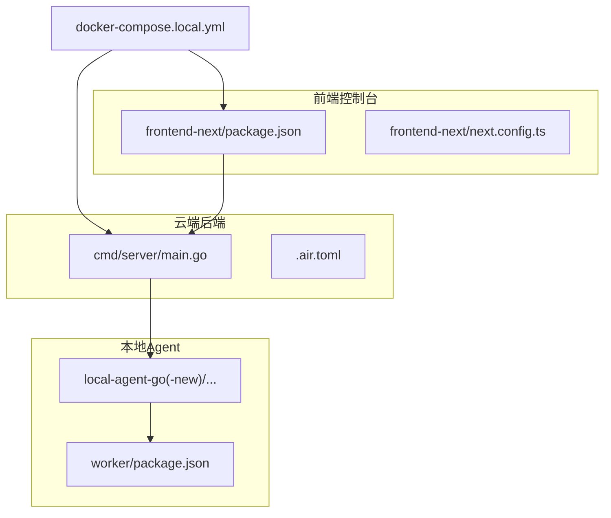
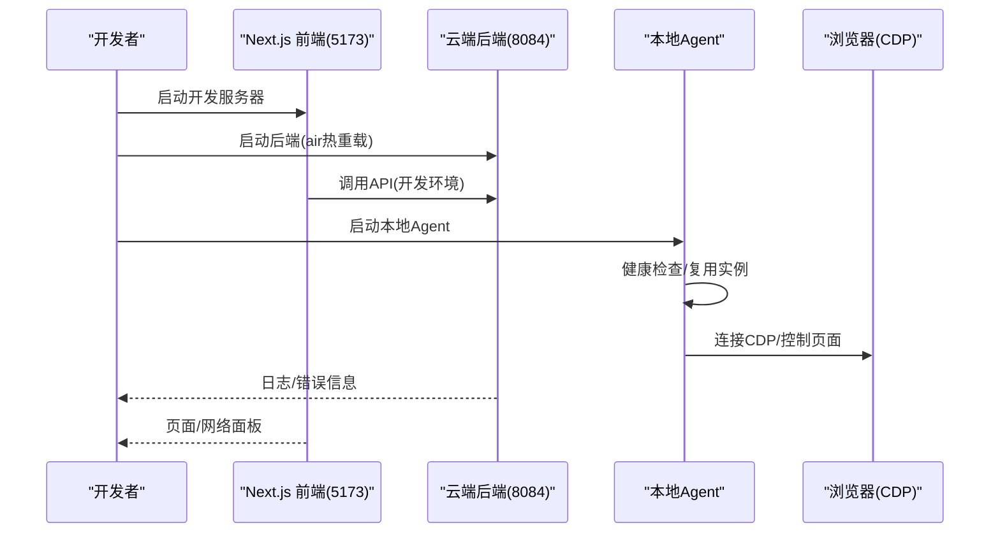
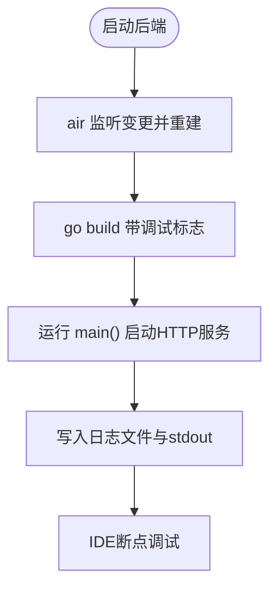
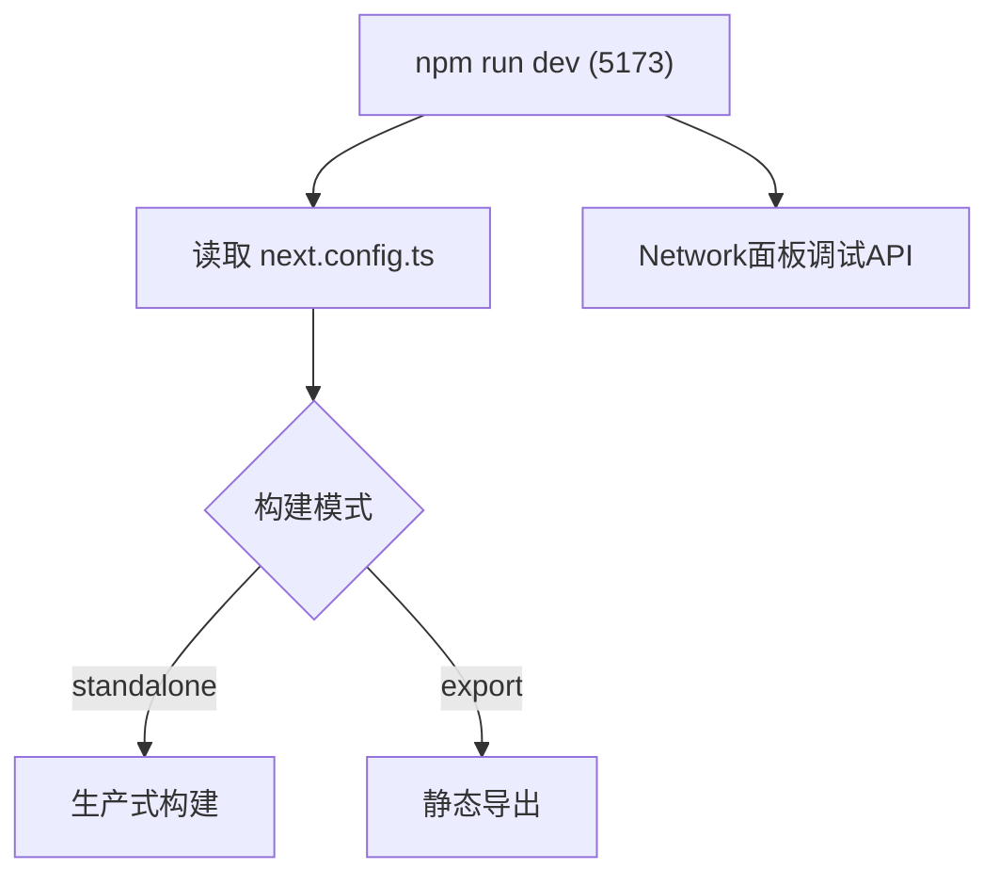
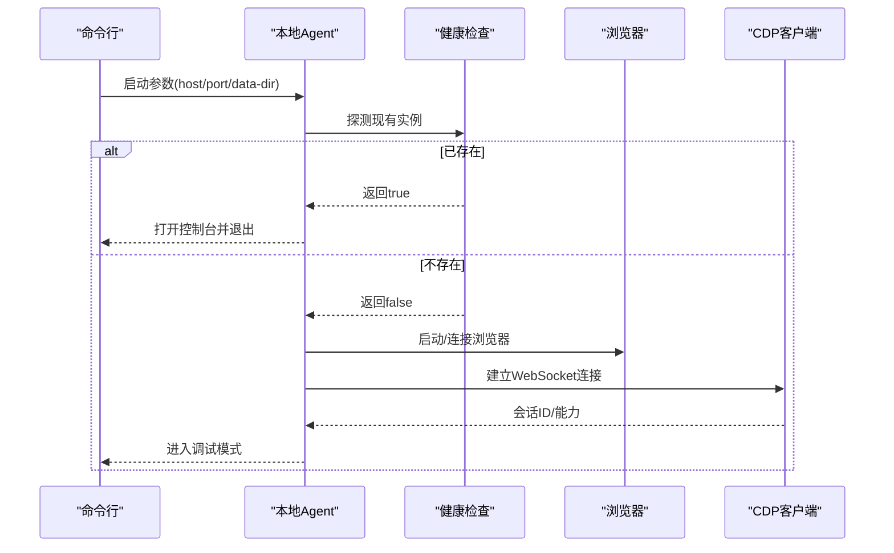
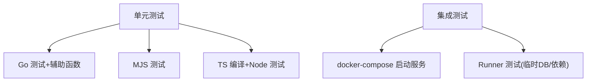
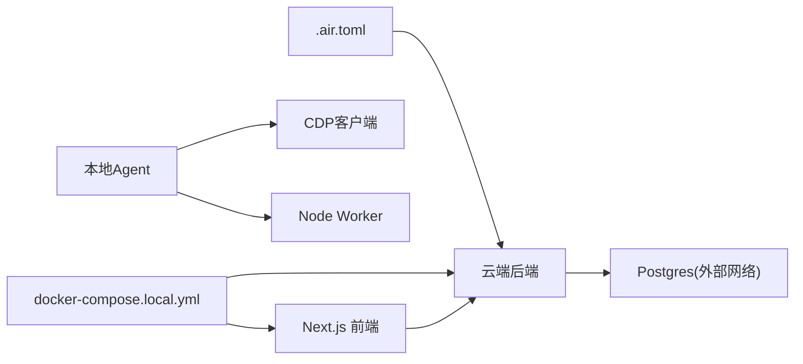

# 调试与测试

<cite>
**本文引用的文件**
- [main.go](file://goodhr5/cloud/backend/cmd/server/main.go)
- [.air.toml](file://goodhr5/cloud/backend/.air.toml)
- [docker-compose.local.yml](file://goodhr5/docker-compose.local.yml)
- [package.json](file://goodhr5/cloud/frontend-next/package.json)
- [next.config.ts](file://goodhr5/cloud/frontend-next/next.config.ts)
- [config_test.go](file://goodhr5/local-agent-go/internal/config/config_test.go)
- [diagnostics.go（旧本地Agent）](file://goodhr5/local-agent-go/internal/app/diagnostics.go)
- [diagnostics.go（新本地Agent）](file://goodhr5/local-agent-go/internal/api/diagnostics.go)
- [go_cdp.go](file://goodhr5/local-agent-go/internal/browser/go_cdp.go)
- [worker package.json](file://goodhr5/local-agent-go/worker/package.json)
- [test_helpers.go](file://goodhr5/cloud/backend/internal/httpapi/test_helpers.go)
- [runner_test.go](file://goodhr5/local-agent-go/internal/positionrunner/runner_test.go)
</cite>

## 目录
1. [简介](#简介)
2. [项目结构](#项目结构)
3. [核心组件](#核心组件)
4. [架构总览](#架构总览)
5. [详细组件分析](#详细组件分析)
6. [依赖关系分析](#依赖关系分析)
7. [性能考虑](#性能考虑)
8. [故障排查指南](#故障排查指南)
9. [结论](#结论)
10. [附录](#附录)

## 简介
本指南面向 GoodHR5 的 Go 后端、Next.js 前端、本地 Agent（含浏览器自动化与 CDP）以及 Worker，提供从开发到测试的全链路调试与测试方法。内容涵盖：
- Go 后端：热重载、断点调试、日志定位、单元测试与集成测试。
- Next.js 前端：开发模式、React DevTools、网络请求调试、构建产物差异。
- 本地 Agent：进程管理、浏览器 Profile 诊断、CDP 协议调试、Worker 测试。
- 测试策略：单元/集成/端到端测试组织方式、Mock 策略、数据准备。
- 性能与压力测试：工具推荐与实践建议。

## 项目结构
GoodHR5 包含三个主要可调试子系统：
- 云端后端（Go）：HTTP API 服务，使用 air 进行热重载，Docker Compose 编排本地开发环境。
- 前端控制台（Next.js）：开发端口 5173，支持独立构建与静态导出模式。
- 本地 Agent（Go + Node Worker）：负责浏览器自动化、平台任务执行、与云端通信；内置诊断能力与 CDP 客户端实现。

图表来源
- [main.go:14-30](file://goodhr5/cloud/backend/cmd/server/main.go#L14-L30)
- [.air.toml:5-21](file://goodhr5/cloud/backend/.air.toml#L5-L21)
- [package.json:5-9](file://goodhr5/cloud/frontend-next/package.json#L5-L9)
- [next.config.ts:4-17](file://goodhr5/cloud/frontend-next/next.config.ts#L4-L17)
- [docker-compose.local.yml:4-42](file://goodhr5/docker-compose.local.yml#L4-L42)

章节来源
- [main.go:14-30](file://goodhr5/cloud/backend/cmd/server/main.go#L14-L30)
- [.air.toml:5-21](file://goodhr5/cloud/backend/.air.toml#L5-L21)
- [package.json:5-9](file://goodhr5/cloud/frontend-next/package.json#L5-L9)
- [next.config.ts:4-17](file://goodhr5/cloud/frontend-next/next.config.ts#L4-L17)
- [docker-compose.local.yml:4-42](file://goodhr5/docker-compose.local.yml#L4-L42)

## 核心组件
- 云端后端入口：启动 HTTP 服务、配置日志输出路径与监听地址。
- 本地 Agent 入口：解析参数、健康检查复用实例、初始化应用并运行。
- 前端开发脚本：定义 dev/build/start 命令与端口。
- 本地开发编排：通过 Docker Compose 启动后端与前端，挂载源码以支持热更新。
- 诊断能力：扫描浏览器 Profile 锁文件、检查运行组件状态、生成处理建议。
- CDP 客户端：基于 WebSocket 的 Chrome DevTools Protocol 客户端实现，用于浏览器自动化调试。
- Worker 测试：Node 测试脚本与 TypeScript 编译流程。

章节来源
- [main.go:14-30](file://goodhr5/cloud/backend/cmd/server/main.go#L14-L30)
- [config_test.go:11-28](file://goodhr5/local-agent-go/internal/config/config_test.go#L11-L28)
- [package.json:5-9](file://goodhr5/cloud/frontend-next/package.json#L5-L9)
- [docker-compose.local.yml:4-42](file://goodhr5/docker-compose.local.yml#L4-L42)
- [diagnostics.go（新本地Agent）:18-46](file://goodhr5/local-agent-go/internal/api/diagnostics.go#L18-L46)
- [go_cdp.go:21-55](file://goodhr5/local-agent-go/internal/browser/go_cdp.go#L21-L55)
- [worker package.json:8-12](file://goodhr5/local-agent-go/worker/package.json#L8-L12)

## 架构总览
下图展示本地开发时各组件的交互：前端通过环境变量访问云端 API，后端通过 air 热重载，本地 Agent 通过健康检查避免重复启动，并通过 CDP 控制浏览器。

图表来源
- [docker-compose.local.yml:4-42](file://goodhr5/docker-compose.local.yml#L4-L42)
- [.air.toml:5-21](file://goodhr5/cloud/backend/.air.toml#L5-L21)
- [package.json:5-9](file://goodhr5/cloud/frontend-next/package.json#L5-L9)
- [go_cdp.go:21-55](file://goodhr5/local-agent-go/internal/browser/go_cdp.go#L21-L55)

## 详细组件分析

### 云端后端调试
- 热重载与断点
  - 使用 air 进行热重载，构建命令启用禁用优化标志以便调试。
  - 在 IDE 中设置断点后，修改代码将自动重建并重启进程。
- 日志与错误定位
  - 主程序将日志同时输出到标准输出与文件，便于容器或终端查看。
  - 可通过环境变量调整监听地址与日志路径。
- 单元测试与测试辅助
  - 提供统一的测试服务构造器，确保测试与服务装配一致。
  - 可在测试中注入系统配置，模拟真实运行环境。

图表来源
- [.air.toml:5-21](file://goodhr5/cloud/backend/.air.toml#L5-L21)
- [main.go:14-30](file://goodhr5/cloud/backend/cmd/server/main.go#L14-L30)
- [test_helpers.go:6-24](file://goodhr5/cloud/backend/internal/httpapi/test_helpers.go#L6-L24)

章节来源
- [.air.toml:5-21](file://goodhr5/cloud/backend/.air.toml#L5-L21)
- [main.go:14-30](file://goodhr5/cloud/backend/cmd/server/main.go#L14-L30)
- [test_helpers.go:6-24](file://goodhr5/cloud/backend/internal/httpapi/test_helpers.go#L6-L24)

### Next.js 前端调试
- 开发模式
  - 使用 npm scripts 启动开发服务器，默认监听 5173。
  - 通过 docker-compose 映射端口，便于跨进程调试。
- 构建产物差异
  - 根据环境变量切换 standalone 或 export 模式，影响图片优化与重定向行为。
- 网络请求调试
  - 浏览器开发者工具的 Network 面板观察对后端的请求与响应。
  - 结合环境变量 CLOUD_API_BASE/NEXT_PUBLIC_CLOUD_API_BASE 指向后端。

图表来源
- [package.json:5-9](file://goodhr5/cloud/frontend-next/package.json#L5-L9)
- [next.config.ts:4-17](file://goodhr5/cloud/frontend-next/next.config.ts#L4-L17)

章节来源
- [package.json:5-9](file://goodhr5/cloud/frontend-next/package.json#L5-L9)
- [next.config.ts:4-17](file://goodhr5/cloud/frontend-next/next.config.ts#L4-L17)

### 本地 Agent 调试
- 进程与健康检查
  - 启动时检测已有实例，避免重复占用端口；支持自动打开控制台。
  - 通过环境变量覆盖云端 API 与控制台地址，便于多环境调试。
- 浏览器 Profile 诊断
  - 扫描常见锁文件（如 SingletonLock），给出中文建议。
  - 检查运行组件是否就绪，提示安装或构建步骤。
- CDP 协议调试
  - 基于 WebSocket 的 CDP 客户端，支持发送方法与等待响应。
  - 可用于抓取页面事件、拦截请求、截图等。
- Worker 测试
  - 使用 Node 测试框架运行 TypeScript 测试，先编译再执行。

图表来源
- [config_test.go:11-28](file://goodhr5/local-agent-go/internal/config/config_test.go#L11-L28)
- [diagnostics.go（新本地Agent）:18-46](file://goodhr5/local-agent-go/internal/api/diagnostics.go#L18-L46)
- [go_cdp.go:21-55](file://goodhr5/local-agent-go/internal/browser/go_cdp.go#L21-L55)
- [worker package.json:8-12](file://goodhr5/local-agent-go/worker/package.json#L8-L12)

章节来源
- [config_test.go:11-28](file://goodhr5/local-agent-go/internal/config/config_test.go#L11-L28)
- [diagnostics.go（新本地Agent）:18-46](file://goodhr5/local-agent-go/internal/api/diagnostics.go#L18-L46)
- [go_cdp.go:21-55](file://goodhr5/local-agent-go/internal/browser/go_cdp.go#L21-L55)
- [worker package.json:8-12](file://goodhr5/local-agent-go/worker/package.json#L8-L12)

### 测试策略与实施
- 单元测试
  - 后端：使用 Go 原生 testing，配合测试辅助函数创建服务实例与注入配置。
  - 前端：MJS 测试文件验证主题、守卫逻辑等。
  - Worker：TypeScript 编译后运行 Node 测试，覆盖点击校验、滚动、导航等。
- 集成测试
  - 通过 docker-compose 启动后端与数据库，运行集成用例。
  - 本地 Agent 的 runner 测试使用临时目录与内存化依赖，加速执行。
- Mock 策略
  - 使用最小配置与选择器构造测试数据，隔离外部依赖。
  - 通过替换等待次数与延迟，提升测试稳定性与速度。

图表来源
- [test_helpers.go:6-24](file://goodhr5/cloud/backend/internal/httpapi/test_helpers.go#L6-L24)
- [runner_test.go:1557-1595](file://goodhr5/local-agent-go/internal/positionrunner/runner_test.go#L1557-L1595)
- [worker package.json:8-12](file://goodhr5/local-agent-go/worker/package.json#L8-L12)

章节来源
- [test_helpers.go:6-24](file://goodhr5/cloud/backend/internal/httpapi/test_helpers.go#L6-L24)
- [runner_test.go:1557-1595](file://goodhr5/local-agent-go/internal/positionrunner/runner_test.go#L1557-L1595)
- [worker package.json:8-12](file://goodhr5/local-agent-go/worker/package.json#L8-L12)

## 依赖关系分析
- 后端依赖 air 进行热重载，构建命令包含调试标志。
- 前端依赖 Next.js 构建配置，根据环境变量切换构建模式。
- 本地 Agent 依赖 CDP 客户端与 Worker，Worker 依赖 Playwright/CloakBrowser。
- Docker Compose 将前后端与外部数据服务网络连接起来。

图表来源
- [.air.toml:5-21](file://goodhr5/cloud/backend/.air.toml#L5-L21)
- [docker-compose.local.yml:4-42](file://goodhr5/docker-compose.local.yml#L4-L42)
- [go_cdp.go:21-55](file://goodhr5/local-agent-go/internal/browser/go_cdp.go#L21-L55)
- [worker package.json:14-18](file://goodhr5/local-agent-go/worker/package.json#L14-L18)

章节来源
- [.air.toml:5-21](file://goodhr5/cloud/backend/.air.toml#L5-L21)
- [docker-compose.local.yml:4-42](file://goodhr5/docker-compose.local.yml#L4-L42)
- [go_cdp.go:21-55](file://goodhr5/local-agent-go/internal/browser/go_cdp.go#L21-L55)
- [worker package.json:14-18](file://goodhr5/local-agent-go/worker/package.json#L14-L18)

## 性能考虑
- 后端性能分析与优化
  - 使用 pprof 采集 CPU/内存 profile，结合火焰图定位热点。
  - 在压测场景下关注数据库连接池、缓存命中率与并发限制。
- 前端性能分析
  - 使用 React Profiler 与 Performance 面板分析渲染瓶颈。
  - 针对大列表或复杂组件进行虚拟滚动与懒加载优化。
- 本地 Agent 与浏览器自动化
  - 减少不必要的截图与 DOM 查询，合并操作以降低 CDP 往返。
  - 合理设置超时与重试策略，避免阻塞与资源泄漏。
- 压力测试工具推荐
  - 后端：wrk、vegeta、k6。
  - 前端：Lighthouse CI、WebPageTest。
  - 浏览器自动化：Playwright Test、Selenium Grid。

[本节为通用指导，不直接分析具体文件]

## 故障排查指南
- 后端问题
  - 检查日志文件路径与权限，确认 stdout 与文件输出是否正常。
  - 使用 air 构建日志定位编译错误。
- 前端问题
  - 确认环境变量 CLOUD_API_BASE 与 NEXT_PUBLIC_CLOUD_API_BASE 指向正确后端。
  - 构建失败时清理 .next 与 node_modules 缓存。
- 本地 Agent 问题
  - 诊断 Profile 锁文件，若发现残留锁，关闭浏览器后重启 Agent。
  - 检查运行组件是否就绪，必要时重新安装或构建 Worker。
- CDP 调试
  - 通过 CDP 客户端捕获页面事件与网络请求，定位页面状态不一致问题。

章节来源
- [main.go:40-51](file://goodhr5/cloud/backend/cmd/server/main.go#L40-L51)
- [diagnostics.go（旧本地Agent）:133-177](file://goodhr5/local-agent-go/internal/app/diagnostics.go#L133-L177)
- [diagnostics.go（新本地Agent）:157-191](file://goodhr5/local-agent-go/internal/api/diagnostics.go#L157-L191)
- [go_cdp.go:21-55](file://goodhr5/local-agent-go/internal/browser/go_cdp.go#L21-L55)

## 结论
通过热重载、断点调试、日志与诊断能力，配合完善的单元测试、集成测试与浏览器自动化测试，GoodHR5 提供了从后端到前端再到本地 Agent 的全链路调试与测试支撑。建议在开发中持续使用 air、Docker Compose 与 CDP 工具链，结合性能分析与压力测试，保障系统的稳定性与可维护性。

[本节为总结，不直接分析具体文件]

## 附录
- 常用命令参考
  - 后端：使用 air 启动热重载；通过 go test 运行单测。
  - 前端：npm run dev 启动开发服务器；npm run build 构建产物。
  - 本地 Agent：按参数启动并复用实例；通过诊断接口获取建议。
  - Worker：npm run build && npm run test 执行测试。
- 环境变量要点
  - GOODHR_CLOUD_ADDR：后端监听地址。
  - GOODHR_CLOUD_LOG_FILE：后端日志文件路径。
  - GOODHR_CLOUD_API_BASE：本地 Agent 连接的云端 API。
  - GOODHR_CONSOLE_URL：本地控制台地址。
  - WATCHPACK_POLLING：前端开发模式下轮询开关。

[本节为补充说明，不直接分析具体文件]