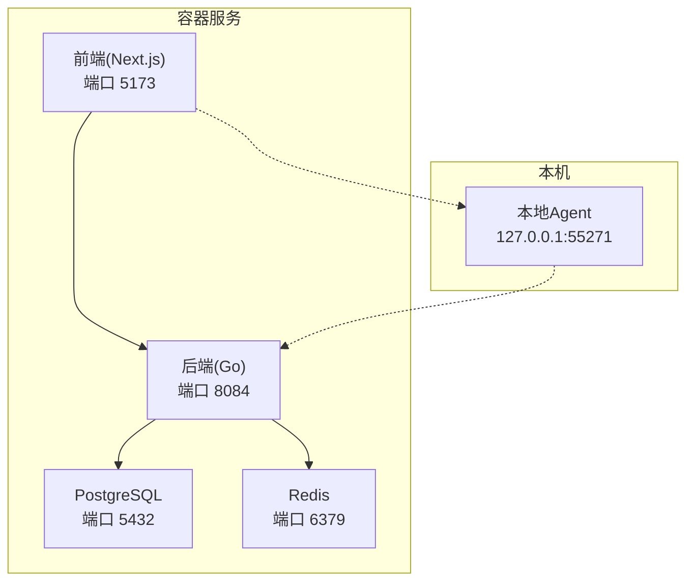
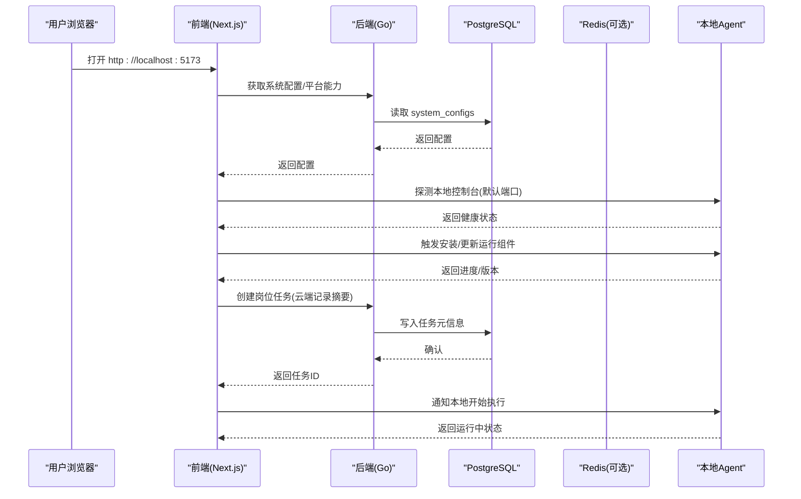
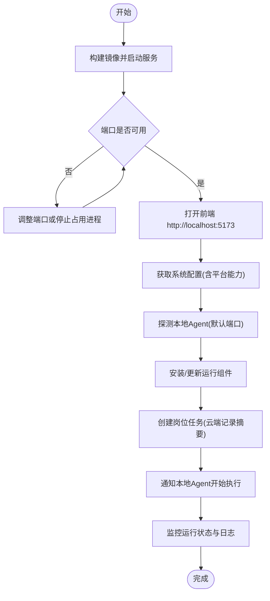
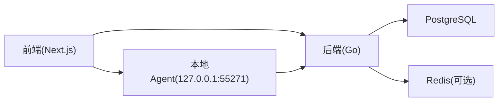

# 快速开始

<cite>
**本文引用的文件**
- [README.md](file://goodhr5/README.md)
- [README_DOCKER.md](file://goodhr5/README_DOCKER.md)
- [docker-compose.yml](file://goodhr5/docker-compose.yml)
- [docker-compose.local.yml](file://goodhr5/docker-compose.local.yml)
- [docker-compose.server.yml](file://goodhr5/docker-compose.server.yml)
- [main.go](file://goodhr5/cloud/backend/cmd/server/main.go)
- [config.go](file://goodhr5/cloud/backend/internal/httpapi/config.go)
- [runtime_config.go](file://goodhr5/cloud/backend/internal/httpapi/runtime_config.go)
- [0001_initial_schema.sql](file://goodhr5/cloud/backend/db/migrations/0001_initial_schema.sql)
- [0002_add_system_configs.sql](file://goodhr5/cloud/backend/db/migrations/0002_add_system_configs.sql)
- [0003_insert_platform_configs.sql](file://goodhr5/cloud/backend/db/migrations/0003_insert_platform_configs.sql)
- [local-agent-go README.md](file://goodhr5/local-agent-go/README.md)
</cite>

## 目录
1. [简介](#简介)
2. [项目结构](#项目结构)
3. [核心组件](#核心组件)
4. [架构总览](#架构总览)
5. [详细组件分析](#详细组件分析)
6. [依赖分析](#依赖分析)
7. [性能考虑](#性能考虑)
8. [故障排除指南](#故障排除指南)
9. [结论](#结论)
10. [附录](#附录)

## 简介
HRPlus 是“云端控制台 + 本地执行器”的招聘自动化系统。云端负责登录、岗位运行元信息、配置与机器绑定；本地 Agent 负责浏览器操作、截图、OCR 和本地数据。首次启动后，用户通过前端创建岗位任务，由本地 Agent 在用户电脑上执行，云端仅保存摘要与配置。

## 项目结构
- cloud/backend：Go 云端 API，监听端口默认 8084，自动执行数据库迁移并暴露 HTTP 路由。
- cloud/frontend-next：Next.js 前端开发镜像，默认映射到宿主机 5173。
- local-agent-go：本地 Agent（Go），默认监听 127.0.0.1:55271，提供健康检查、诊断、运行时安装与更新等接口。
- docker-compose.*：提供本地开发、复用外部数据库、服务器部署等多种编排方式。

图表来源
- [docker-compose.yml:1-32](file://goodhr5/docker-compose.yml#L1-L32)
- [docker-compose.local.yml:1-54](file://goodhr5/docker-compose.local.yml#L1-L54)
- [docker-compose.server.yml:1-12](file://goodhr5/docker-compose.server.yml#L1-L12)
- [main.go:14-29](file://goodhr5/cloud/backend/cmd/server/main.go#L14-L29)
- [local-agent-go README.md:42-75](file://goodhr5/local-agent-go/README.md#L42-L75)

章节来源
- [README.md:1-22](file://goodhr5/README.md#L1-L22)
- [README_DOCKER.md:1-46](file://goodhr5/README_DOCKER.md#L1-L46)

## 核心组件
- 后端服务：从环境变量加载配置，连接 PostgreSQL，自动执行迁移，可选接入 Redis 作为会话与缓存层。
- 前端服务：开发模式热重载，访问后端 API 获取系统配置与平台能力。
- 本地 Agent：提供健康检查、诊断、运行时组件安装、控制台更新、浏览器 Worker 管理、本地 SQLite 存储等能力。

章节来源
- [config.go:30-87](file://goodhr5/cloud/backend/internal/httpapi/config.go#L30-L87)
- [runtime_config.go:20-38](file://goodhr5/cloud/backend/internal/httpapi/runtime_config.go#L20-L38)
- [local-agent-go README.md:42-75](file://goodhr5/local-agent-go/README.md#L42-L75)

## 架构总览

图表来源
- [docker-compose.yml:10-27](file://goodhr5/docker-compose.yml#L10-L27)
- [config.go:47-87](file://goodhr5/cloud/backend/internal/httpapi/config.go#L47-L87)
- [runtime_config.go:20-38](file://goodhr5/cloud/backend/internal/httpapi/runtime_config.go#L20-L38)
- [local-agent-go README.md:42-75](file://goodhr5/local-agent-go/README.md#L42-L75)

## 详细组件分析

### 环境要求与前置准备
- Docker 与 Docker Compose：用于一键拉起前后端与依赖服务。
- 可选：已有 PostgreSQL 与 Redis 实例可复用，只需在环境变量中指向外部地址。
- 本地 Agent 需要桌面环境以运行 CloakBrowser，不放入容器。

章节来源
- [README_DOCKER.md:1-46](file://goodhr5/README_DOCKER.md#L1-L46)

### 使用 Docker Compose 快速启动
- 基础启动：构建镜像并以后台方式启动服务。
- 端口说明：后端 8084，前端 5173，PostgreSQL 5432，Redis 6379。
- 停止命令：保留数据或连同数据卷一起清理。

章节来源
- [README_DOCKER.md:3-26](file://goodhr5/README_DOCKER.md#L3-L26)
- [docker-compose.yml:1-32](file://goodhr5/docker-compose.yml#L1-L32)

### 本地开发模式（复用外部 data-services 网络）
- 适用于已存在 PostgreSQL/Redis 的开发环境。
- 后端通过环境变量连接外部数据库，前端通过环境变量访问后端。
- 支持热重载与增量缓存。

章节来源
- [docker-compose.local.yml:1-54](file://goodhr5/docker-compose.local.yml#L1-L54)

### 服务器部署模式（Linux）
- 后端使用 host 网络直接访问宿主机上的 PostgreSQL/Redis。
- 前端映射 5173 端口供访问。

章节来源
- [docker-compose.server.yml:1-12](file://goodhr5/docker-compose.server.yml#L1-L12)

### 环境变量与配置
- 后端监听地址：GOODHR_CLOUD_ADDR（默认 :8084）。
- 日志路径：GOODHR_CLOUD_LOG_FILE（默认 logs/backend.log）。
- 数据库 DSN：GOODHR_PG_DSN（未设置时后端不会连接数据库）。
- 认证与会话：GOODHR_REDIS_ADDR、GOODHR_REDIS_PASSWORD、GOODHR_REDIS_DB（未设置时使用内存实现）。
- 邮件发送：GOODHR_SMTP_HOST/PORT/USERNAME/PASSWORD/FROM（未设置时使用开发模式）。
- 超级管理员列表：GOODHR_SUPER_ADMINS（逗号分隔）。
- 通用验证码偏移分钟数：GOODHR_UNIVERSAL_LOGIN_CODE_OFFSET_MINUTES。

章节来源
- [main.go:14-29](file://goodhr5/cloud/backend/cmd/server/main.go#L14-L29)
- [config.go:30-87](file://goodhr5/cloud/backend/internal/httpapi/config.go#L30-L87)

### 数据库初始化与迁移
- 首次连接 PostgreSQL 后会自动执行迁移脚本，创建表结构与索引。
- 初始表包括用户、本地 Agent 绑定、平台账号映射、岗位配置、AI 配置、任务运行与日志等。
- 系统配置表用于存放平台选择器、引导配置等 JSON 配置。
- 预置 Boss 直聘与智联招聘等平台的选择器配置。

章节来源
- [config.go:47-74](file://goodhr5/cloud/backend/internal/httpapi/config.go#L47-L74)
- [0001_initial_schema.sql:1-135](file://goodhr5/cloud/backend/db/migrations/0001_initial_schema.sql#L1-L135)
- [0002_add_system_configs.sql:1-15](file://goodhr5/cloud/backend/db/migrations/0002_add_system_configs.sql#L1-L15)
- [0003_insert_platform_configs.sql:1-24](file://goodhr5/cloud/backend/db/migrations/0003_insert_platform_configs.sql#L1-L24)

### 首次启动流程（端到端）

图表来源
- [README_DOCKER.md:3-26](file://goodhr5/README_DOCKER.md#L3-L26)
- [runtime_config.go:20-38](file://goodhr5/cloud/backend/internal/httpapi/runtime_config.go#L20-L38)
- [local-agent-go README.md:42-75](file://goodhr5/local-agent-go/README.md#L42-L75)

### 本地 Agent 安装与连接
- 本地 Agent 默认监听 127.0.0.1:55271，提供 /health 健康检查与 /api/v1/diagnostics 诊断接口。
- 可通过命令行参数控制是否自动打开控制台与指定端口。
- 支持安装 Node Runtime、CloakBrowser、OCR 组件，以及更新本地控制台前端包。
- 开发阶段可安装本地 worker-node 进行调试。

章节来源
- [local-agent-go README.md:42-75](file://goodhr5/local-agent-go/README.md#L42-L75)
- [local-agent-go README.md:77-99](file://goodhr5/local-agent-go/README.md#L77-L99)

### 云端配置下发（运行时配置）
- 登录后前端调用后端接口获取运行时配置，包含本地程序与运行组件清单。
- 配置来源于系统配置表中的 onboarding_config，便于统一管理与灰度发布。

章节来源
- [runtime_config.go:20-38](file://goodhr5/cloud/backend/internal/httpapi/runtime_config.go#L20-L38)
- [0002_add_system_configs.sql:1-15](file://goodhr5/cloud/backend/db/migrations/0002_add_system_configs.sql#L1-L15)

## 依赖分析

图表来源
- [docker-compose.yml:1-32](file://goodhr5/docker-compose.yml#L1-L32)
- [docker-compose.local.yml:1-54](file://goodhr5/docker-compose.local.yml#L1-L54)
- [docker-compose.server.yml:1-12](file://goodhr5/docker-compose.server.yml#L1-L12)
- [config.go:47-87](file://goodhr5/cloud/backend/internal/httpapi/config.go#L47-L87)
- [local-agent-go README.md:42-75](file://goodhr5/local-agent-go/README.md#L42-L75)

章节来源
- [docker-compose.yml:1-32](file://goodhr5/docker-compose.yml#L1-L32)
- [docker-compose.local.yml:1-54](file://goodhr5/docker-compose.local.yml#L1-L54)
- [docker-compose.server.yml:1-12](file://goodhr5/docker-compose.server.yml#L1-L12)
- [config.go:47-87](file://goodhr5/cloud/backend/internal/httpapi/config.go#L47-L87)

## 性能考虑
- 数据库连接池：后端对 PostgreSQL 设置了最大连接数、空闲连接数与连接生命周期，避免资源耗尽。
- 会话与缓存：启用 Redis 后可提升会话共享与热点数据读取性能；未启用时回退到内存实现。
- 日志输出：后端同时输出到标准输出与文件，便于容器化日志收集与本地排查。

章节来源
- [config.go:47-74](file://goodhr5/cloud/backend/internal/httpapi/config.go#L47-L74)
- [config.go:77-87](file://goodhr5/cloud/backend/internal/httpapi/config.go#L77-L87)
- [main.go:40-51](file://goodhr5/cloud/backend/cmd/server/main.go#L40-L51)

## 故障排除指南
- 无法访问前端：确认端口 5173 未被占用；检查容器是否成功启动。
- 后端无法连接数据库：检查 GOODHR_PG_DSN 是否正确；查看后端日志中的连接错误提示。
- 会话或缓存异常：若启用 Redis，检查 GOODHR_REDIS_* 配置与连通性；否则将使用内存实现。
- 本地 Agent 无法启动：确认 127.0.0.1:55271 未被占用；使用 /health 与 /api/v1/diagnostics 检查状态。
- 运行组件安装失败：核对 manifest 中的 URL 与校验值；确保网络可达且磁盘空间充足。
- 平台选择器无效：检查 system_configs 中 platform.* 配置是否完整；必要时重新插入或更新。

章节来源
- [README_DOCKER.md:28-46](file://goodhr5/README_DOCKER.md#L28-L46)
- [config.go:47-87](file://goodhr5/cloud/backend/internal/httpapi/config.go#L47-L87)
- [local-agent-go README.md:42-75](file://goodhr5/local-agent-go/README.md#L42-L75)
- [0003_insert_platform_configs.sql:1-24](file://goodhr5/cloud/backend/db/migrations/0003_insert_platform_configs.sql#L1-L24)

## 结论
通过 Docker Compose 可在几分钟内启动 HRPlus 的前后端与依赖服务；配合本地 Agent 即可完成完整的岗位自动化执行链路。建议优先使用本地开发 compose 复用现有数据库，生产环境则采用 server 模式并配置 Redis 以提升稳定性与性能。

## 附录
- 常用命令
  - 构建并启动：参考快速启动说明。
  - 停止并保留数据：参考停止说明。
  - 停止并删除数据：参考停止说明。
- 关键端口
  - 前端：5173
  - 后端：8084
  - PostgreSQL：5432
  - Redis：6379
  - 本地 Agent：55271

章节来源
- [README_DOCKER.md:3-26](file://goodhr5/README_DOCKER.md#L3-L26)
- [docker-compose.yml:1-32](file://goodhr5/docker-compose.yml#L1-L32)
- [docker-compose.local.yml:1-54](file://goodhr5/docker-compose.local.yml#L1-L54)
- [docker-compose.server.yml:1-12](file://goodhr5/docker-compose.server.yml#L1-L12)
- [local-agent-go README.md:42-75](file://goodhr5/local-agent-go/README.md#L42-L75)