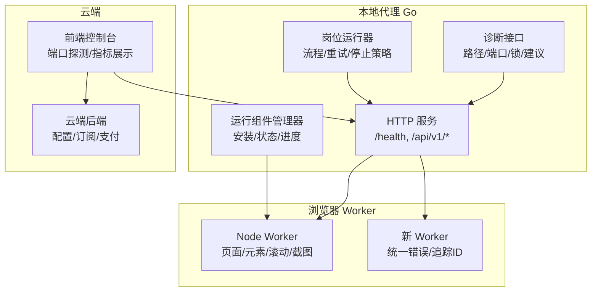
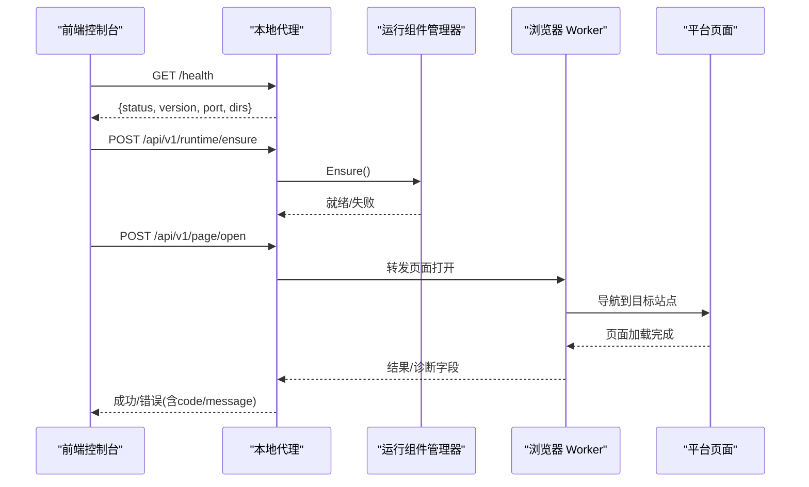
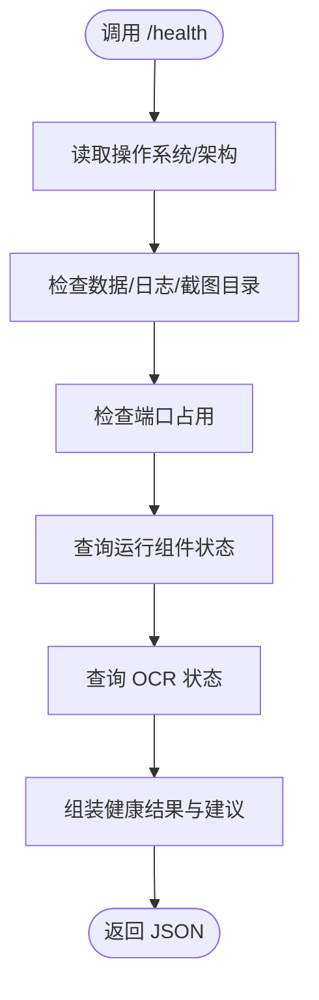
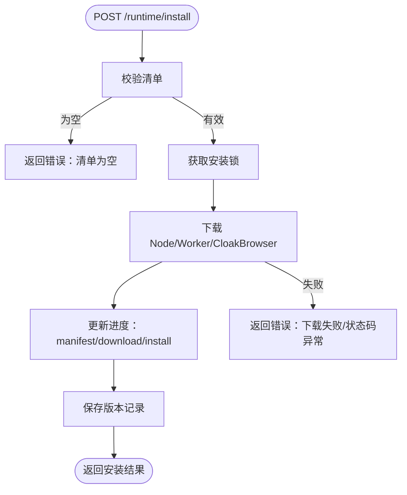
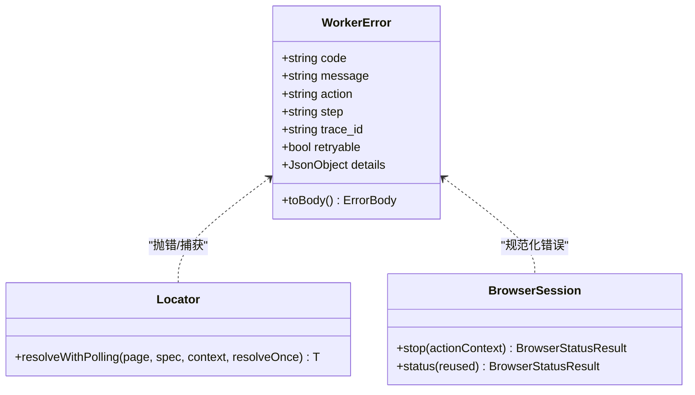
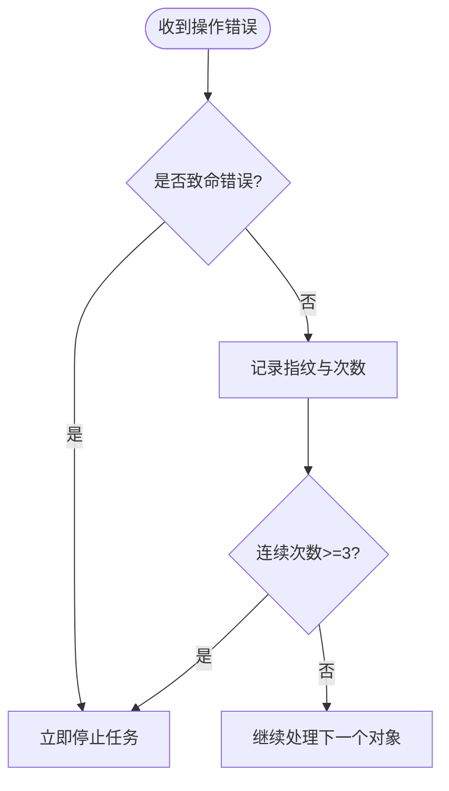
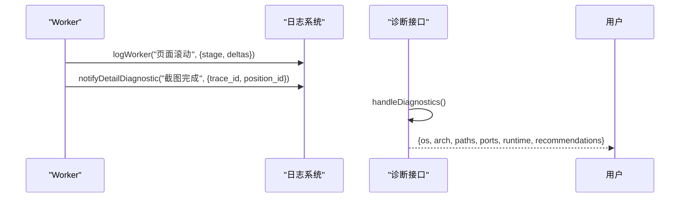
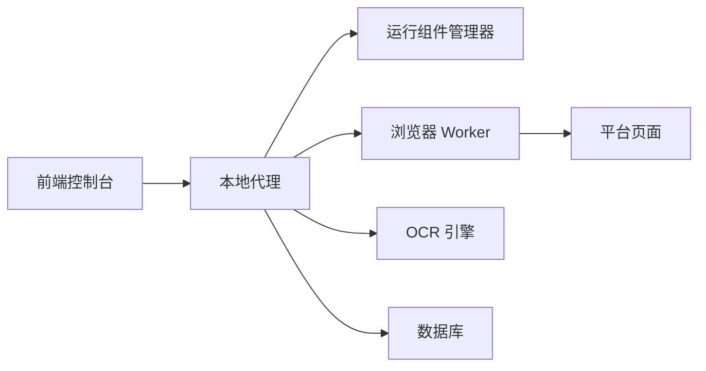

# 故障排除

<cite>
**本文引用的文件**
- [server.go](file://goodhr5/local-agent-go/internal/app/server.go)
- [diagnostics.go](file://goodhr5/local-agent-go/internal/app/diagnostics.go)
- [installer.go](file://goodhr5/local-agent-go/internal/runtime/installer.go)
- [manager.go](file://goodhr5/local-agent-go/internal/runtime/manager.go)
- [index.js](file://goodhr5/local-agent-go/worker-node/src/index.js)
- [browser-actions.test.js](file://goodhr5/local-agent-go/worker-node/src/browser-actions.test.js)
- [error_policy.go](file://goodhr5/local-agent-go/internal/positionrunner/error_policy.go)
- [main.go](file://goodhr5/local-agent-go/cmd/goodhr-local-agent/main.go)
- [windows_smoke_test.ps1](file://goodhr5/local-agent-go/scripts/windows_smoke_test.ps1)
- [server.go](file://goodhr5/local-agent-go/internal/api/server.go)
- [diagnostics.go](file://goodhr5/local-agent-go/internal/api/diagnostics.go)
- [installer.go](file://goodhr5/local-agent-go/internal/runtime/installer.go)
- [worker-error.ts](file://goodhr5/local-agent-go/worker/src/errors/worker-error.ts)
- [browser-session.ts](file://goodhr5/local-agent-go/worker/src/browser/session/browser-session.ts)
- [locator.ts](file://goodhr5/local-agent-go/worker/src/browser/primitives/locator.ts)
- [error_policy.go](file://goodhr5/local-agent-go/internal/flow/shared/error_policy.go)
- [admin-api.ts](file://goodhr5/cloud/frontend-next/lib/admin-api.ts)
</cite>

## 目录
1. [简介](#简介)
2. [项目结构](#项目结构)
3. [核心组件](#核心组件)
4. [架构总览](#架构总览)
5. [详细组件分析](#详细组件分析)
6. [依赖关系分析](#依赖关系分析)
7. [性能注意事项](#性能注意事项)
8. [故障排除指南](#故障排除指南)
9. [结论](#结论)
10. [附录](#附录)

## 简介
本故障排除文档面向 GoodHR5 本地代理与云端控制台的使用者与维护人员，聚焦安装部署、运行时错误、性能问题、浏览器自动化、平台适配、网络连接等常见场景。文档提供日志分析方法、诊断工具使用、监控指标解读、错误码对照、异常堆栈定位、性能瓶颈定位方法，并给出预防措施、最佳实践与应急响应流程，帮助用户自助解决问题。

## 项目结构
GoodHR5 包含本地代理（Go）与 Node Worker（浏览器自动化）、新架构的本地代理（Go + TypeScript Worker），以及云端前端与后端。本地代理负责进程管理、运行组件安装、健康检查、诊断接口、任务编排；Node Worker 负责浏览器会话、页面操作、截图、滚动、下载等；新架构引入更严格的请求校验、统一错误体、可观测性字段和更清晰的职责分层。

图表来源
- [server.go:117-168](file://goodhr5/local-agent-go/internal/app/server.go#L117-L168)
- [diagnostics.go:42-73](file://goodhr5/local-agent-go/internal/app/diagnostics.go#L42-L73)
- [server.go:137-161](file://goodhr5/local-agent-go/internal/api/server.go#L137-L161)
- [diagnostics.go:84-104](file://goodhr5/local-agent-go/internal/api/diagnostics.go#L84-L104)

章节来源
- [server.go:117-168](file://goodhr5/local-agent-go/internal/app/server.go#L117-L168)
- [server.go:137-161](file://goodhr5/local-agent-go/internal/api/server.go#L137-L161)

## 核心组件
- 本地代理 HTTP 服务：注册健康检查、诊断、运行组件安装、Worker 管理、页面操作转发等路由，统一响应格式。
- 运行组件管理器：负责 Node、Worker 构建产物、CloakBrowser 等的检测、下载、安装、进度上报与版本记录。
- 诊断接口：汇总 OS、架构、端口占用、路径可用性、Profile 锁、运行组件状态，并生成中文建议。
- 岗位运行器：执行候选人处理流程，具备连续错误计数与立即停止策略，避免无效循环。
- 浏览器 Worker：实现页面打开、点击、输入、滚动、截图、下载等操作，输出结构化诊断日志与错误。
- 新架构 Worker：统一错误类型、稳定错误码、追踪 ID、安全 JSON 值转换，提升跨语言错误传递能力。

章节来源
- [server.go:117-168](file://goodhr5/local-agent-go/internal/app/server.go#L117-L168)
- [installer.go:44-104](file://goodhr5/local-agent-go/internal/runtime/installer.go#L44-L104)
- [diagnostics.go:42-73](file://goodhr5/local-agent-go/internal/app/diagnostics.go#L42-L73)
- [error_policy.go:48-85](file://goodhr5/local-agent-go/internal/positionrunner/error_policy.go#L48-L85)
- [index.js:71-108](file://goodhr5/local-agent-go/worker-node/src/index.js#L71-L108)
- [worker-error.ts:5-27](file://goodhr5/local-agent-go/worker/src/errors/worker-error.ts#L5-L27)

## 架构总览
本地代理通过 HTTP 暴露健康与诊断接口，前端控制台定期探测本地程序端口并读取状态。岗位运行器协调 Worker 完成浏览器自动化任务，遇到网络或平台变化时利用错误策略快速降级或停止。新架构在 API 层增加强类型校验与安全头，减少误配与注入风险。

图表来源
- [server.go:170-191](file://goodhr5/local-agent-go/internal/app/server.go#L170-L191)
- [server.go:227-240](file://goodhr5/local-agent-go/internal/app/server.go#L227-L240)
- [server.go:649-668](file://goodhr5/local-agent-go/internal/app/server.go#L649-L668)
- [server.go:137-161](file://goodhr5/local-agent-go/internal/api/server.go#L137-L161)

## 详细组件分析

### 本地代理 HTTP 服务与健康检查
- 健康检查返回版本、端口、数据目录、日志目录、数据库路径、运行组件与 OCR 状态，便于快速判断服务是否可用。
- 诊断接口汇总路径、端口占用、Profile 锁、运行组件状态，并生成中文建议，辅助定位环境问题。
- 运行组件安装接口支持异步安装，返回进度阶段与消息，便于前端展示安装状态。

图表来源
- [server.go:170-191](file://goodhr5/local-agent-go/internal/app/server.go#L170-L191)
- [diagnostics.go:42-73](file://goodhr5/local-agent-go/internal/app/diagnostics.go#L42-L73)

章节来源
- [server.go:170-191](file://goodhr5/local-agent-go/internal/app/server.go#L170-L191)
- [diagnostics.go:42-73](file://goodhr5/local-agent-go/internal/app/diagnostics.go#L42-L73)

### 运行组件安装与进度
- 安装前检查清单，若为空则提示先填写下载地址。
- 安装过程分阶段更新进度，记录已安装与跳过组件，失败时返回具体错误信息。
- 版本记录持久化到 installed-components.json，便于后续升级与回滚。

图表来源
- [installer.go:44-104](file://goodhr5/local-agent-go/internal/runtime/installer.go#L44-L104)
- [manager.go:135-179](file://goodhr5/local-agent-go/internal/runtime/manager.go#L135-L179)
- [installer.go:146-181](file://goodhr5/local-agent-go/internal/runtime/installer.go#L146-L181)

章节来源
- [installer.go:44-104](file://goodhr5/local-agent-go/internal/runtime/installer.go#L44-L104)
- [manager.go:135-179](file://goodhr5/local-agent-go/internal/runtime/manager.go#L135-L179)
- [installer.go:146-181](file://goodhr5/local-agent-go/internal/runtime/installer.go#L146-L181)

### 浏览器自动化与 Worker 错误
- Worker 将未知异常统一转换为带稳定错误码的结构化错误，包含 action、step、trace_id、retryable、details。
- 选择器解析采用轮询与超时控制，对歧义元素直接抛出明确错误，避免静默失败。
- 浏览器关闭与状态查询均记录日志，失败时规范化错误并继续清理资源。

图表来源
- [worker-error.ts:5-27](file://goodhr5/local-agent-go/worker/src/errors/worker-error.ts#L5-L27)
- [worker-error.ts:38-71](file://goodhr5/local-agent-go/worker/src/errors/worker-error.ts#L38-L71)
- [locator.ts:225-266](file://goodhr5/local-agent-go/worker/src/browser/primitives/locator.ts#L225-L266)
- [browser-session.ts:157-194](file://goodhr5/local-agent-go/worker/src/browser/session/browser-session.ts#L157-L194)

章节来源
- [worker-error.ts:5-27](file://goodhr5/local-agent-go/worker/src/errors/worker-error.ts#L5-L27)
- [worker-error.ts:38-71](file://goodhr5/local-agent-go/worker/src/errors/worker-error.ts#L38-L71)
- [locator.ts:225-266](file://goodhr5/local-agent-go/worker/src/browser/primitives/locator.ts#L225-L266)
- [browser-session.ts:157-194](file://goodhr5/local-agent-go/worker/src/browser/session/browser-session.ts#L157-L194)

### 岗位运行错误策略
- 连续同类错误达到三次即停止当前任务，避免无效重试导致资源浪费。
- 成功一次后清零计数，保证恢复后继续执行。
- 对于浏览器不可用、页面关闭等致命错误立即停止任务。

图表来源
- [error_policy.go:16-47](file://goodhr5/local-agent-go/internal/flow/shared/error_policy.go#L16-L47)
- [error_policy.go:58-76](file://goodhr5/local-agent-go/internal/flow/shared/error_policy.go#L58-L76)
- [error_policy.go:48-85](file://goodhr5/local-agent-go/internal/positionrunner/error_policy.go#L48-L85)

章节来源
- [error_policy.go:16-47](file://goodhr5/local-agent-go/internal/flow/shared/error_policy.go#L16-L47)
- [error_policy.go:58-76](file://goodhr5/local-agent-go/internal/flow/shared/error_policy.go#L58-L76)
- [error_policy.go:48-85](file://goodhr5/local-agent-go/internal/positionrunner/error_policy.go#L48-L85)

### 日志与诊断
- Worker 日志包含时间戳、消息与附加字段，字段长度限制避免日志膨胀。
- 详情截图诊断为跨岗位日志检索提供 trace_id，便于关联请求与结果。
- 诊断接口返回路径、端口、锁文件、运行组件状态与中文建议，帮助快速定位问题。

图表来源
- [index.js:71-108](file://goodhr5/local-agent-go/worker-node/src/index.js#L71-L108)
- [index.js:101-118](file://goodhr5/local-agent-go/worker-node/src/index.js#L101-L118)
- [diagnostics.go:42-73](file://goodhr5/local-agent-go/internal/app/diagnostics.go#L42-L73)
- [diagnostics.go:84-104](file://goodhr5/local-agent-go/internal/api/diagnostics.go#L84-L104)

章节来源
- [index.js:71-108](file://goodhr5/local-agent-go/worker-node/src/index.js#L71-L108)
- [diagnostics.go:42-73](file://goodhr5/local-agent-go/internal/app/diagnostics.go#L42-L73)
- [diagnostics.go:84-104](file://goodhr5/local-agent-go/internal/api/diagnostics.go#L84-L104)

## 依赖关系分析
- 本地代理依赖运行组件管理器、Worker 管理器、OCR 引擎、数据库与岗位运行器。
- Worker 依赖浏览器驱动与平台页面，通过稳定错误码与追踪 ID 与上层交互。
- 前端控制台依赖本地代理健康接口进行端口探测，缓存最近成功端口以减少重复探测。

图表来源
- [server.go:117-168](file://goodhr5/local-agent-go/internal/app/server.go#L117-L168)
- [server.go:137-161](file://goodhr5/local-agent-go/internal/api/server.go#L137-L161)
- [admin-api.ts:174-212](file://goodhr5/cloud/frontend-next/lib/admin-api.ts#L174-L212)

章节来源
- [server.go:117-168](file://goodhr5/local-agent-go/internal/app/server.go#L117-L168)
- [admin-api.ts:174-212](file://goodhr5/cloud/frontend-next/lib/admin-api.ts#L174-L212)

## 性能注意事项
- 滚动到底部时使用真实滚轮逐步滚动，限制总时长与阈值，避免长时间阻塞。
- 选择器解析采用轮询与超时控制，减少等待时间并提高稳定性。
- 日志字段限制长度，防止日志过大影响写入性能。
- 安装进度分段更新，前端可实时反馈，降低用户感知延迟。

章节来源
- [index.js:1399-1419](file://goodhr5/local-agent-go/worker-node/src/index.js#L1399-L1419)
- [locator.ts:225-266](file://goodhr5/local-agent-go/worker/src/browser/primitives/locator.ts#L225-L266)
- [index.js:71-108](file://goodhr5/local-agent-go/worker-node/src/index.js#L71-L108)
- [installer.go:44-104](file://goodhr5/local-agent-go/internal/runtime/installer.go#L44-L104)

## 故障排除指南

### 安装部署问题
- 症状：无法启动本地代理或运行组件缺失。
- 排查步骤：
  - 调用 /health 确认服务状态与端口。
  - 调用 /api/v1/runtime/status 查看 Node、Worker、CloakBrowser 安装情况。
  - 调用 /api/v1/runtime/install 触发安装，观察进度阶段与消息。
  - 检查 logs 目录中的 local-agent.log，确认初始化与安装日志。
- 常见问题：
  - 运行组件清单为空：需先在系统配置中填写下载地址。
  - 下载失败：检查网络与服务器可达性，关注状态码与错误信息。
  - 端口冲突：更换端口或关闭占用进程。

章节来源
- [server.go:170-191](file://goodhr5/local-agent-go/internal/app/server.go#L170-L191)
- [server.go:227-240](file://goodhr5/local-agent-go/internal/app/server.go#L227-L240)
- [installer.go:44-104](file://goodhr5/local-agent-go/internal/runtime/installer.go#L44-L104)
- [main.go:39-62](file://goodhr5/local-agent-go/cmd/goodhr-local-agent/main.go#L39-L62)

### 运行时错误
- 症状：页面操作失败、元素未找到、滚动无效、截图失败。
- 排查步骤：
  - 查看 Worker 日志中的 trace_id 与 action/step，定位具体环节。
  - 检查浏览器状态与当前 URL，确认页面是否加载完成。
  - 使用诊断接口查看 Profile 锁与端口占用。
- 常见错误码：
  - ELEMENT_NOT_FOUND：元素未找到，检查选择器与页面结构。
  - SCROLL_NO_PROGRESS：滚动无进展，检查视口与滚动逻辑。
  - SCREENSHOT_FAILED：截图失败，检查权限与磁盘空间。
  - ACTION_TIMEOUT：操作超时，调整超时参数或网络环境。

章节来源
- [worker-error.ts:5-27](file://goodhr5/local-agent-go/worker/src/errors/worker-error.ts#L5-L27)
- [index.js:101-118](file://goodhr5/local-agent-go/worker-node/src/index.js#L101-L118)
- [diagnostics.go:42-73](file://goodhr5/local-agent-go/internal/app/diagnostics.go#L42-L73)

### 性能问题
- 症状：任务执行缓慢、滚动卡顿、截图耗时。
- 排查步骤：
  - 检查滚动参数与阈值，确保合理设置。
  - 查看 Worker 日志中的耗时字段，定位慢环节。
  - 检查磁盘 I/O 与网络延迟。
- 优化建议：
  - 减少不必要的截图与日志输出。
  - 调整选择器超时与轮询间隔。
  - 使用稳定的选择器与平台适配规则。

章节来源
- [index.js:1399-1419](file://goodhr5/local-agent-go/worker-node/src/index.js#L1399-L1419)
- [index.js:71-108](file://goodhr5/local-agent-go/worker-node/src/index.js#L71-L108)
- [locator.ts:225-266](file://goodhr5/local-agent-go/worker/src/browser/primitives/locator.ts#L225-L266)

### 浏览器自动化相关
- 症状：点击失败、输入失败、页面切换异常。
- 排查步骤：
  - 检查浏览器会话状态与当前页面 URL。
  - 查看元素可见性与启用状态。
  - 使用截图与诊断字段定位页面状态。
- 最佳实践：
  - 使用稳定选择器与文本点击。
  - 避免固定窗口尺寸，使用自适应视口。
  - 在关键操作前后记录诊断信息。

章节来源
- [browser-session.ts:157-194](file://goodhr5/local-agent-go/worker/src/browser/session/browser-session.ts#L157-L194)
- [browser-actions.test.js:1-22](file://goodhr5/local-agent-go/worker-node/src/browser-actions.test.js#L1-L22)
- [worker-error.ts:5-27](file://goodhr5/local-agent-go/worker/src/errors/worker-error.ts#L5-L27)

### 平台适配问题
- 症状：Boss/猎聘等平台页面结构变化导致操作失败。
- 排查步骤：
  - 检查平台配置与选择器规则。
  - 查看滚动与点击诊断，定位平台差异。
  - 更新平台规则或选择器。
- 最佳实践：
  - 使用平台专用稳定点击与滚动逻辑。
  - 在平台变更后及时验证与更新规则。

章节来源
- [index.js:1399-1419](file://goodhr5/local-agent-go/worker-node/src/index.js#L1399-L1419)
- [error_policy.go:48-85](file://goodhr5/local-agent-go/internal/positionrunner/error_policy.go#L48-L85)

### 网络连接问题
- 症状：无法连接云端、下载失败、订阅状态获取失败。
- 排查步骤：
  - 检查网络连通性与代理设置。
  - 查看云端接口返回的状态码与错误信息。
  - 重试机制与超时设置。
- 最佳实践：
  - 使用重试与退避策略。
  - 记录网络错误与重试次数。

章节来源
- [installer.go:146-181](file://goodhr5/local-agent-go/internal/runtime/installer.go#L146-L181)
- [server.go:603-647](file://goodhr5/local-agent-go/internal/app/server.go#L603-L647)

### 错误码对照表
- INVALID_REQUEST：请求格式不正确。
- BROWSER_NOT_RUNNING：浏览器未运行。
- PAGE_NOT_AVAILABLE：页面不可用。
- PAGE_CLOSED：页面已关闭。
- ELEMENT_NOT_FOUND：元素未找到。
- ELEMENT_AMBIGUOUS：元素歧义。
- ELEMENT_NOT_VISIBLE：元素不可见。
- ELEMENT_NOT_ENABLED：元素未启用。
- VIEWPORT_TOO_SMALL：视口过小。
- MOUSE_TARGET_OUTSIDE_VIEWPORT：鼠标目标在视口外。
- SCROLL_NO_PROGRESS：滚动无进展。
- CLICK_FAILED：点击失败。
- INPUT_FAILED：输入失败。
- SCROLL_FAILED：滚动失败。
- SCREENSHOT_FAILED：截图失败。
- DOWNLOAD_FAILED：下载失败。
- ACTION_TIMEOUT：操作超时。
- ACTION_CANCELLED：操作取消。
- INTERNAL_ERROR：内部错误。

章节来源
- [worker-error.ts:5-27](file://goodhr5/local-agent-go/worker/src/errors/worker-error.ts#L5-L27)

### 异常堆栈分析
- 使用 Worker 日志中的 error_name、error_message、error_stack 字段定位异常。
- 结合 trace_id 与 position_id 关联岗位运行日志。
- 关注 normalizeWorkerError 生成的 original_error 字段，保留原始异常信息。

章节来源
- [index.js:120-127](file://goodhr5/local-agent-go/worker-node/src/index.js#L120-L127)
- [worker-error.ts:73-105](file://goodhr5/local-agent-go/worker/src/errors/worker-error.ts#L73-L105)

### 性能瓶颈定位方法
- 使用 Worker 日志中的 request_elapsed_ms 与 handler_elapsed_ms 字段分析耗时。
- 检查滚动与选择器解析的超时与轮询设置。
- 监控磁盘 I/O 与网络延迟，优化大文件下载与截图。

章节来源
- [index.js:6774-6795](file://goodhr5/local-agent-go/worker-node/src/index.js#L6774-L6795)
- [locator.ts:225-266](file://goodhr5/local-agent-go/worker/src/browser/primitives/locator.ts#L225-L266)

### 预防措施与最佳实践
- 定期更新平台规则与选择器，适应页面变化。
- 使用稳定错误码与追踪 ID，便于问题定位。
- 限制日志字段长度，避免日志膨胀。
- 在安装与运行过程中提供进度与状态反馈。

章节来源
- [worker-error.ts:5-27](file://goodhr5/local-agent-go/worker/src/errors/worker-error.ts#L5-L27)
- [index.js:71-108](file://goodhr5/local-agent-go/worker-node/src/index.js#L71-L108)
- [installer.go:44-104](file://goodhr5/local-agent-go/internal/runtime/installer.go#L44-L104)

### 应急响应流程
- 发现异常：通过 /health 与 /api/v1/diagnostics 快速判断服务状态。
- 隔离问题：停止任务或浏览器会话，避免影响扩大。
- 收集证据：导出日志与诊断信息，记录 trace_id 与错误码。
- 修复与验证：修复配置或代码，重新运行并验证。
- 复盘改进：分析问题根因，更新规则与流程。

章节来源
- [server.go:170-191](file://goodhr5/local-agent-go/internal/app/server.go#L170-L191)
- [diagnostics.go:42-73](file://goodhr5/local-agent-go/internal/app/diagnostics.go#L42-L73)
- [error_policy.go:58-76](file://goodhr5/local-agent-go/internal/flow/shared/error_policy.go#L58-L76)

## 结论
GoodHR5 提供了完善的健康检查、诊断接口、运行组件管理与浏览器自动化能力。通过统一错误码、追踪 ID 与结构化日志，用户可以快速定位问题并进行修复。遵循最佳实践与应急流程，可以有效降低故障影响并提升系统稳定性。

## 附录
- 使用 Windows 冒烟测试脚本快速检查本地代理基础接口与诊断信息。
- 前端控制台自动探测本地代理端口并缓存结果，减少重复探测。

章节来源
- [windows_smoke_test.ps1:1-49](file://goodhr5/local-agent-go/scripts/windows_smoke_test.ps1#L1-L49)
- [admin-api.ts:174-212](file://goodhr5/cloud/frontend-next/lib/admin-api.ts#L174-L212)