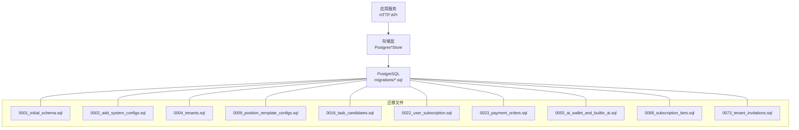
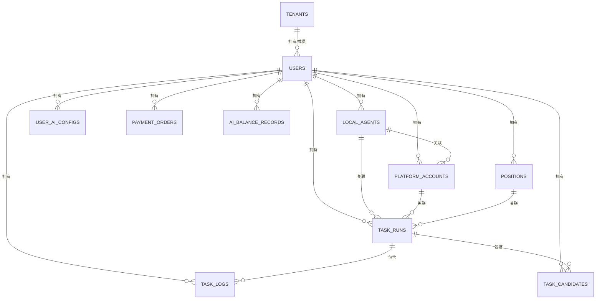
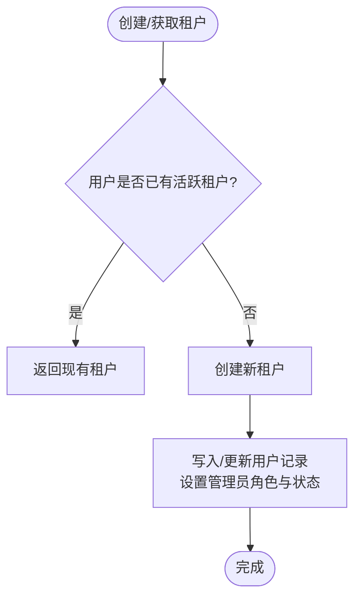
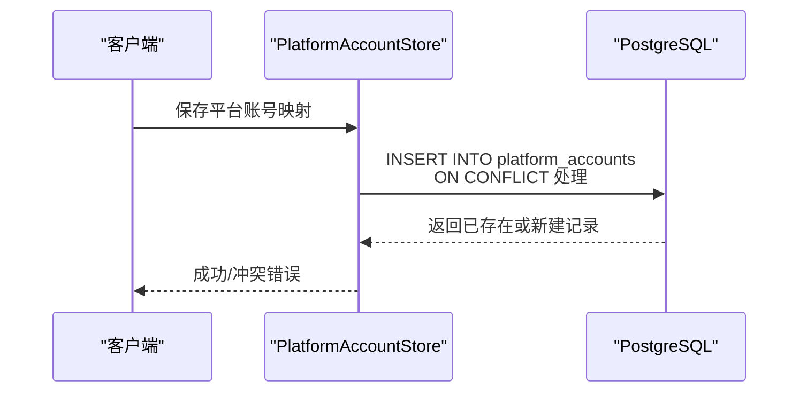
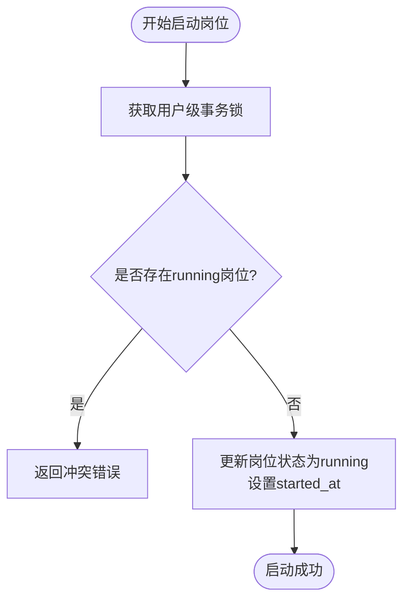
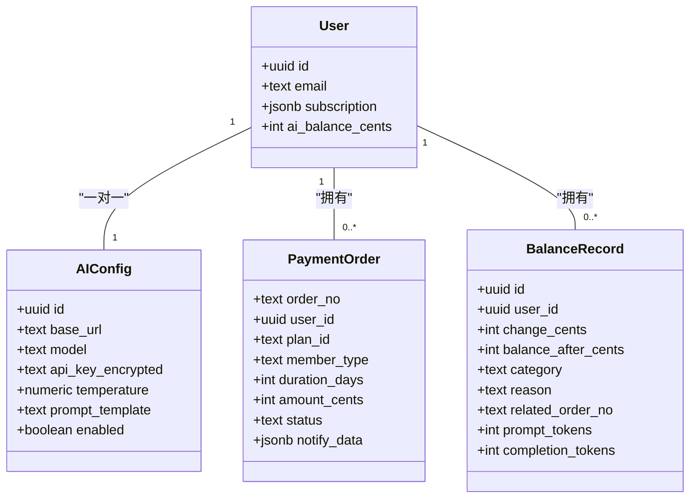
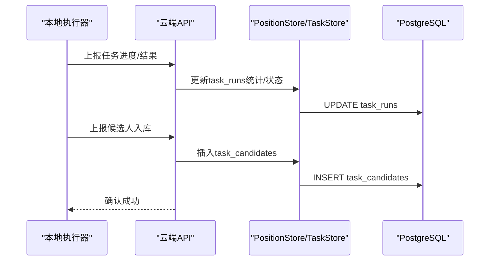
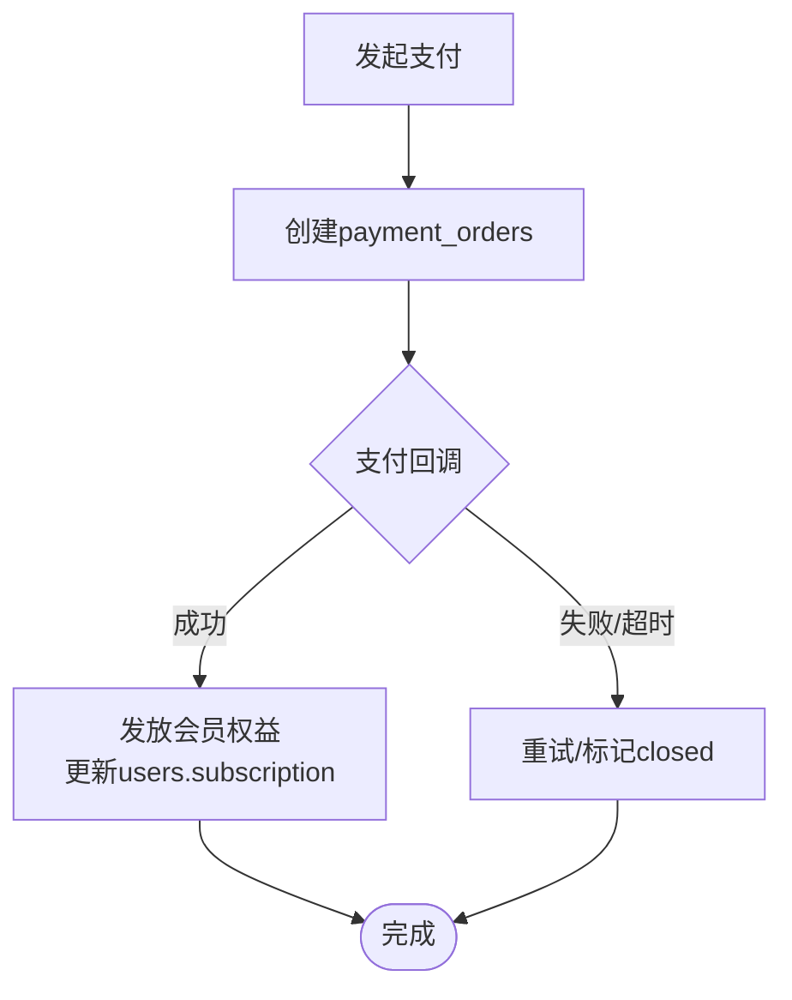
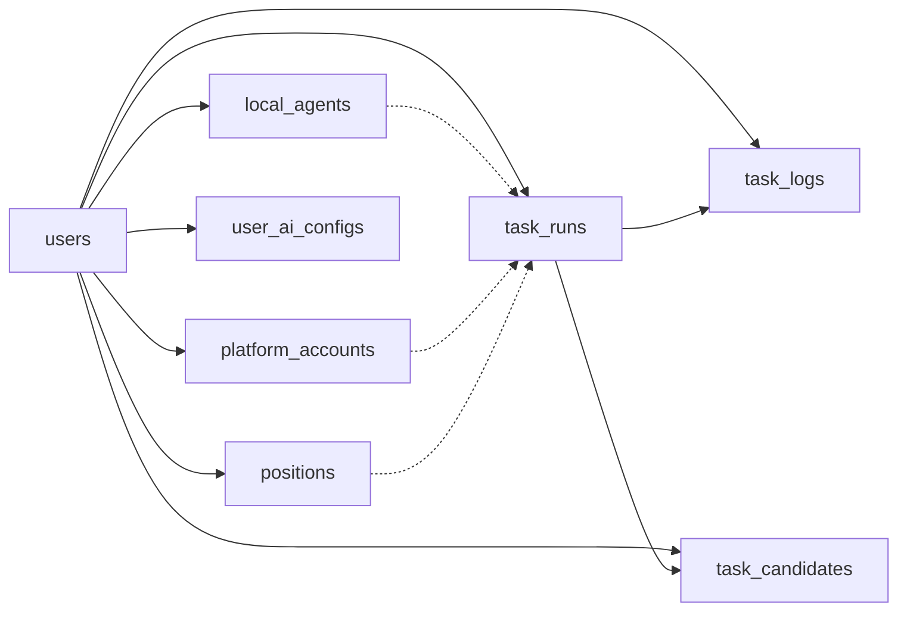

# 云端数据库设计

<cite>
**本文引用的文件**
- [0001_initial_schema.sql](file://goodhr5/cloud/backend/db/migrations/0001_initial_schema.sql)
- [0002_add_system_configs.sql](file://goodhr5/cloud/backend/db/migrations/0002_add_system_configs.sql)
- [0004_tenants.sql](file://goodhr5/cloud/backend/db/migrations/0004_tenants.sql)
- [0009_position_template_configs.sql](file://goodhr5/cloud/backend/db/migrations/0009_position_template_configs.sql)
- [0016_task_candidates.sql](file://goodhr5/cloud/backend/db/migrations/0016_task_candidates.sql)
- [0022_user_subscription.sql](file://goodhr5/cloud/backend/db/migrations/0022_user_subscription.sql)
- [0023_payment_orders.sql](file://goodhr5/cloud/backend/db/migrations/0023_payment_orders.sql)
- [0055_ai_wallet_and_builtin_ai.sql](file://goodhr5/cloud/backend/db/migrations/0055_ai_wallet_and_builtin_ai.sql)
- [0068_subscription_tiers.sql](file://goodhr5/cloud/backend/db/migrations/0068_subscription_tiers.sql)
- [0073_tenant_invitations.sql](file://goodhr5/cloud/backend/db/migrations/0073_tenant_invitations.sql)
- [tenant_store.go](file://goodhr5/cloud/backend/internal/httpapi/tenant_store.go)
- [platform_account_store_pg.go](file://goodhr5/cloud/backend/internal/httpapi/platform_account_store_pg.go)
- [position_store_pg.go](file://goodhr5/cloud/backend/internal/httpapi/position_store_pg.go)
- [ai_config_store_pg.go](file://goodhr5/cloud/backend/internal/httpapi/ai_config_store_pg.go)
</cite>

## 目录
1. [简介](#简介)
2. [项目结构](#项目结构)
3. [核心组件](#核心组件)
4. [架构总览](#架构总览)
5. [详细组件分析](#详细组件分析)
6. [依赖关系分析](#依赖关系分析)
7. [性能与查询优化](#性能与查询优化)
8. [故障排查指南](#故障排查指南)
9. [结论](#结论)
10. [附录](#附录)

## 简介
本文件面向云端 PostgreSQL 数据库，系统性梳理 HRPlus 的核心表结构与数据模型，覆盖用户认证、租户隔离、权限控制、平台账号映射、岗位配置、AI 配置、任务运行与日志、候选人入库、订阅与支付、内置 AI 钱包等关键业务域。文档同时给出实体关系、外键约束与级联策略、索引设计、迁移管理机制（版本化、回滚、增量），以及查询优化、性能调优与备份恢复建议，帮助读者快速理解并安全演进数据库设计。

## 项目结构
云端后端通过一系列按序号命名的 SQL 迁移文件管理数据库结构变更，Go 代码中的存储层实现负责读写这些表。核心路径如下：
- 数据库迁移：goodhr5/cloud/backend/db/migrations/*.sql
- 存储实现：goodhr5/cloud/backend/internal/httpapi/*_store_pg.go

图表来源
- [0001_initial_schema.sql:1-135](file://goodhr5/cloud/backend/db/migrations/0001_initial_schema.sql#L1-L135)
- [0002_add_system_configs.sql:1-15](file://goodhr5/cloud/backend/db/migrations/0002_add_system_configs.sql#L1-L15)
- [0004_tenants.sql:1-21](file://goodhr5/cloud/backend/db/migrations/0004_tenants.sql#L1-L21)
- [0009_position_template_configs.sql:1-10](file://goodhr5/cloud/backend/db/migrations/0009_position_template_configs.sql#L1-L10)
- [0016_task_candidates.sql:1-96](file://goodhr5/cloud/backend/db/migrations/0016_task_candidates.sql#L1-L96)
- [0022_user_subscription.sql:1-62](file://goodhr5/cloud/backend/db/migrations/0022_user_subscription.sql#L1-L62)
- [0023_payment_orders.sql:1-48](file://goodhr5/cloud/backend/db/migrations/0023_payment_orders.sql#L1-L48)
- [0055_ai_wallet_and_builtin_ai.sql:1-68](file://goodhr5/cloud/backend/db/migrations/0055_ai_wallet_and_builtin_ai.sql#L1-L68)
- [0068_subscription_tiers.sql:1-162](file://goodhr5/cloud/backend/db/migrations/0068_subscription_tiers.sql#L1-L162)
- [0073_tenant_invitations.sql:1-105](file://goodhr5/cloud/backend/db/migrations/0073_tenant_invitations.sql#L1-L105)

章节来源
- [0001_initial_schema.sql:1-135](file://goodhr5/cloud/backend/db/migrations/0001_initial_schema.sql#L1-L135)
- [tenant_store.go:218-250](file://goodhr5/cloud/backend/internal/httpapi/tenant_store.go#L218-L250)

## 核心组件
本节聚焦核心业务表及其职责：
- users：云端登录用户，支持租户归属、角色、状态、订阅信息、内置 AI 余额等。
- local_agents：本地 Agent 连接记录，绑定用户与机器，维护心跳与状态。
- platform_accounts：招聘平台账号映射，仅保存可见标识，不存敏感 cookie/profile。
- positions：岗位配置与筛选规则，包含关键词、模板参数、运行统计。
- user_ai_configs：用户自定义 AI 配置（模型、密钥、提示词等）。
- task_runs：云端任务元信息与摘要统计。
- task_logs：任务运行日志摘要。
- task_candidates：候选人结构化信息与 AI 评分结果。
- tenants / tenant_invitations：租户与团队邀请。
- system_configs：系统级配置（如套餐、引导文案等）。
- payment_orders / ai_balance_records：支付订单与内置 AI 余额流水。

章节来源
- [0001_initial_schema.sql:7-135](file://goodhr5/cloud/backend/db/migrations/0001_initial_schema.sql#L7-L135)
- [0004_tenants.sql:1-21](file://goodhr5/cloud/backend/db/migrations/0004_tenants.sql#L1-L21)
- [0009_position_template_configs.sql:1-10](file://goodhr5/cloud/backend/db/migrations/0009_position_template_configs.sql#L1-L10)
- [0016_task_candidates.sql:1-96](file://goodhr5/cloud/backend/db/migrations/0016_task_candidates.sql#L1-L96)
- [0022_user_subscription.sql:1-62](file://goodhr5/cloud/backend/db/migrations/0022_user_subscription.sql#L1-L62)
- [0023_payment_orders.sql:1-48](file://goodhr5/cloud/backend/db/migrations/0023_payment_orders.sql#L1-L48)
- [0055_ai_wallet_and_builtin_ai.sql:1-68](file://goodhr5/cloud/backend/db/migrations/0055_ai_wallet_and_builtin_ai.sql#L1-L68)
- [0068_subscription_tiers.sql:1-162](file://goodhr5/cloud/backend/db/migrations/0068_subscription_tiers.sql#L1-L162)
- [0073_tenant_invitations.sql:1-105](file://goodhr5/cloud/backend/db/migrations/0073_tenant_invitations.sql#L1-L105)

## 架构总览
云端数据库以“用户-租户”为边界，结合本地 Agent 与平台账号映射，形成“云端轻量持久化 + 本地重数据”的架构。云端只保留必要的元数据、统计与审计信息，避免在云端落盘浏览器态或隐私数据。

图表来源
- [0001_initial_schema.sql:7-135](file://goodhr5/cloud/backend/db/migrations/0001_initial_schema.sql#L7-L135)
- [0004_tenants.sql:1-21](file://goodhr5/cloud/backend/db/migrations/0004_tenants.sql#L1-L21)
- [0016_task_candidates.sql:1-96](file://goodhr5/cloud/backend/db/migrations/0016_task_candidates.sql#L1-L96)
- [0023_payment_orders.sql:1-48](file://goodhr5/cloud/backend/db/migrations/0023_payment_orders.sql#L1-L48)
- [0055_ai_wallet_and_builtin_ai.sql:1-68](file://goodhr5/cloud/backend/db/migrations/0055_ai_wallet_and_builtin_ai.sql#L1-L68)

## 详细组件分析

### 用户与租户体系
- users
  - 主键：UUID，默认随机生成。
  - 邮箱唯一，作为验证码登录的唯一账号。
  - 新增字段：tenant_id（所属租户）、role（admin/user）、invited_by（邀请人邮箱）、status（active/pending）、subscription（JSONB，会员类型与到期时间）、ai_balance_cents（内置 AI 余额，单位分）、tenant_joined_at（加入当前团队时间）。
  - 约束：邮箱唯一；租户外键级联删除；角色与状态使用文本枚举。
- tenants
  - 主键：UUID；name、owner_email、created_at。
  - 用于团队隔离与权限控制。
- tenant_invitations
  - 记录待处理的团队邀请，含被邀请人邮箱、角色、状态、发送与响应时间等。
  - 唯一索引限制同一邮箱在同一状态下仅一条待处理邀请。

图表来源
- [tenant_store.go:218-250](file://goodhr5/cloud/backend/internal/httpapi/tenant_store.go#L218-L250)
- [0004_tenants.sql:1-21](file://goodhr5/cloud/backend/db/migrations/0004_tenants.sql#L1-L21)
- [0073_tenant_invitations.sql:1-105](file://goodhr5/cloud/backend/db/migrations/0073_tenant_invitations.sql#L1-L105)

章节来源
- [0004_tenants.sql:1-21](file://goodhr5/cloud/backend/db/migrations/0004_tenants.sql#L1-L21)
- [0073_tenant_invitations.sql:1-105](file://goodhr5/cloud/backend/db/migrations/0073_tenant_invitations.sql#L1-L105)
- [tenant_store.go:218-250](file://goodhr5/cloud/backend/internal/httpapi/tenant_store.go#L218-L250)

### 本地 Agent 与平台账号映射
- local_agents
  - 记录本地 Agent 的连接信息：machine_id、agent_version、bind_status、last_seen_at。
  - 与 users 建立外键，级联删除；(user_id, machine_id) 唯一。
- platform_accounts
  - 仅保存平台标识、显示名、本地 profile ID 等可见信息，不保存 cookie/profile 原文。
  - 与 users、local_agents 建立外键，级联策略分别为 CASCADE 与 SET NULL。
  - (user_id, platform_id, local_profile_id) 唯一，防止重复映射。

图表来源
- [platform_account_store_pg.go:65-108](file://goodhr5/cloud/backend/internal/httpapi/platform_account_store_pg.go#L65-L108)
- [0001_initial_schema.sql:19-49](file://goodhr5/cloud/backend/db/migrations/0001_initial_schema.sql#L19-L49)

章节来源
- [0001_initial_schema.sql:19-49](file://goodhr5/cloud/backend/db/migrations/0001_initial_schema.sql#L19-L49)
- [platform_account_store_pg.go:23-108](file://goodhr5/cloud/backend/internal/httpapi/platform_account_store_pg.go#L23-L108)

### 岗位配置与运行统计
- positions
  - 保存岗位名称、关键词（正向/排除）、描述、打招呼话术、匹配模式、模板参数（common_config、ai_config、keyword_config）等。
  - 运行统计：match_limit、status、scanned_count、daily_greeted_count、daily_greeted_date、skipped_count、failed_count、enable_sound、enable_thinking、started_at、finished_at。
  - 与 users 外键级联删除。
- 运行控制
  - ClaimPositionStart：基于用户级事务锁检查并发，确保同一用户仅一个岗位 running。
  - FinishPositionRun：幂等结束运行，累加当日打招呼数。
  - IncrementPositionCounts/SyncPositionCounts：原子累加扫描/跳过/失败计数。

图表来源
- [position_store_pg.go:338-380](file://goodhr5/cloud/backend/internal/httpapi/position_store_pg.go#L338-L380)
- [0009_position_template_configs.sql:1-10](file://goodhr5/cloud/backend/db/migrations/0009_position_template_configs.sql#L1-L10)

章节来源
- [0001_initial_schema.sql:51-68](file://goodhr5/cloud/backend/db/migrations/0001_initial_schema.sql#L51-L68)
- [0009_position_template_configs.sql:1-10](file://goodhr5/cloud/backend/db/migrations/0009_position_template_configs.sql#L1-L10)
- [position_store_pg.go:23-109](file://goodhr5/cloud/backend/internal/httpapi/position_store_pg.go#L23-L109)
- [position_store_pg.go:313-466](file://goodhr5/cloud/backend/internal/httpapi/position_store_pg.go#L313-L466)

### AI 配置与内置钱包
- user_ai_configs
  - 用户自定义 AI 配置：base_url、model、加密后的 api_key_encrypted、temperature、prompt_template、enabled。
  - 与 users 一对一（user_id 唯一），级联删除。
- ai_balance_records
  - 内置 AI 余额变动流水：change_cents、balance_after_cents、category、reason、related_order_no、model_id、prompt_tokens、completion_tokens。
  - 与 users 外键级联删除。
- payment_orders
  - 支付订单：order_no、plan_id、member_type、duration_days、金额（原价/折扣/实付）、支付渠道、交易号、状态、回调数据等。
  - 与 users 外键级联删除。

图表来源
- [0001_initial_schema.sql:70-85](file://goodhr5/cloud/backend/db/migrations/0001_initial_schema.sql#L70-L85)
- [0023_payment_orders.sql:1-48](file://goodhr5/cloud/backend/db/migrations/0023_payment_orders.sql#L1-L48)
- [0055_ai_wallet_and_builtin_ai.sql:1-68](file://goodhr5/cloud/backend/db/migrations/0055_ai_wallet_and_builtin_ai.sql#L1-L68)
- [ai_config_store_pg.go:21-115](file://goodhr5/cloud/backend/internal/httpapi/ai_config_store_pg.go#L21-L115)

章节来源
- [0001_initial_schema.sql:70-85](file://goodhr5/cloud/backend/db/migrations/0001_initial_schema.sql#L70-L85)
- [0023_payment_orders.sql:1-48](file://goodhr5/cloud/backend/db/migrations/0023_payment_orders.sql#L1-L48)
- [0055_ai_wallet_and_builtin_ai.sql:1-68](file://goodhr5/cloud/backend/db/migrations/0055_ai_wallet_and_builtin_ai.sql#L1-L68)
- [ai_config_store_pg.go:21-115](file://goodhr5/cloud/backend/internal/httpapi/ai_config_store_pg.go#L21-L115)

### 任务运行、日志与候选人入库
- task_runs
  - 云端任务元信息：platform_id、mode、match_limit、status、统计计数、local_task_id、时间戳等。
  - 与 users、local_agents、platform_accounts、positions 建立外键，级联策略分别为 CASCADE、SET NULL、SET NULL、SET NULL。
- task_logs
  - 任务日志摘要：level、message、created_at。
  - 与 task_runs、users 外键级联删除。
- task_candidates
  - 候选人结构化信息与 AI 评分：基础信息、简历附件、多段 JSON 数组（经历、教育、证书、荣誉、项目经验、沟通记录）、AI 各阶段原因与分数、扩展字段 ext、关键时间戳。
  - 与 task_runs、users 外键级联删除。

图表来源
- [0001_initial_schema.sql:87-135](file://goodhr5/cloud/backend/db/migrations/0001_initial_schema.sql#L87-L135)
- [0016_task_candidates.sql:1-96](file://goodhr5/cloud/backend/db/migrations/0016_task_candidates.sql#L1-L96)

章节来源
- [0001_initial_schema.sql:87-135](file://goodhr5/cloud/backend/db/migrations/0001_initial_schema.sql#L87-L135)
- [0016_task_candidates.sql:1-96](file://goodhr5/cloud/backend/db/migrations/0016_task_candidates.sql#L1-L96)

### 订阅与支付
- users.subscription
  - JSONB 字段，包含 member_type（free/plus/max）与 expires_at。
  - 迁移中提供默认值与历史兼容升级逻辑。
- payment_orders
  - 订单状态机：pending/paid/closed；支持支付回调原始数据。
  - 升级订单字段：upgrade_from_member_type、upgrade_credit_cents。
- subscription_order_grants
  - 支付订单权益发放记录，防重放与幂等。

图表来源
- [0022_user_subscription.sql:1-62](file://goodhr5/cloud/backend/db/migrations/0022_user_subscription.sql#L1-L62)
- [0023_payment_orders.sql:1-48](file://goodhr5/cloud/backend/db/migrations/0023_payment_orders.sql#L1-L48)
- [0068_subscription_tiers.sql:1-162](file://goodhr5/cloud/backend/db/migrations/0068_subscription_tiers.sql#L1-L162)

章节来源
- [0022_user_subscription.sql:1-62](file://goodhr5/cloud/backend/db/migrations/0022_user_subscription.sql#L1-L62)
- [0023_payment_orders.sql:1-48](file://goodhr5/cloud/backend/db/migrations/0023_payment_orders.sql#L1-L48)
- [0068_subscription_tiers.sql:1-162](file://goodhr5/cloud/backend/db/migrations/0068_subscription_tiers.sql#L1-L162)

## 依赖关系分析
- 外键与级联
  - users 为根实体，多数业务表通过 user_id 关联，便于租户隔离与权限校验。
  - local_agents 与 platform_accounts、task_runs 采用 SET NULL 策略，保证本地设备下线不影响任务与账号映射的可用性。
  - task_runs 与 task_logs、task_candidates 采用 CASCADE，确保任务清理时日志与候选人记录同步清理。
- 索引策略
  - 高频查询列建立复合索引：如 task_runs(user_id, created_at DESC)、task_logs(task_id, created_at DESC)。
  - 业务唯一性约束：platform_accounts(user_id, platform_id, local_profile_id)、users(email)、system_configs(config_key)。
  - 团队邀请唯一性：tenant_invitations(invitee_email) WHERE status='pending'。

图表来源
- [0001_initial_schema.sql:7-135](file://goodhr5/cloud/backend/db/migrations/0001_initial_schema.sql#L7-L135)
- [0016_task_candidates.sql:1-96](file://goodhr5/cloud/backend/db/migrations/0016_task_candidates.sql#L1-L96)

章节来源
- [0001_initial_schema.sql:7-135](file://goodhr5/cloud/backend/db/migrations/0001_initial_schema.sql#L7-L135)
- [0016_task_candidates.sql:1-96](file://goodhr5/cloud/backend/db/migrations/0016_task_candidates.sql#L1-L96)

## 性能与查询优化
- 索引建议
  - 对高频过滤条件添加复合索引：如 task_runs(status)、task_candidates(platform_id, candidate_name)。
  - 对时间范围查询使用 created_at 倒序索引，提升分页与列表加载性能。
  - 团队邀请与用户列表查询利用 LOWER(invitee_email) 与状态条件组合索引。
- 查询优化
  - 使用 JOIN 时优先选择小表驱动大表，减少临时表与排序开销。
  - 对 JSONB 字段按需展开与索引（如 positions.common_config/ai_config/keyword_config 常用键可考虑 GIN 索引）。
  - 统计类查询（如今日打招呼总数）使用聚合函数并结合日期索引。
- 事务与锁
  - 岗位启动使用用户级事务锁（pg_advisory_xact_lock）避免并发冲突。
  - 支付回调与权益发放使用幂等记录（subscription_order_grants）防止重复发放。
- 备份与恢复
  - 定期全量备份与增量 WAL 归档，确保 RPO/RTO 目标。
  - 针对大表（task_candidates、task_logs）考虑分区与冷热分离，降低备份体积与恢复时间。
  - 迁移前进行快照备份，回滚时优先恢复至迁移前快照再执行 down 脚本。

[本节为通用指导，无需特定文件来源]

## 故障排查指南
- 常见错误
  - 唯一约束冲突：platform_accounts 重复映射、system_configs 键冲突等，需检查输入规范化与去重逻辑。
  - 并发冲突：岗位启动冲突（ErrPositionAlreadyRunning），需提示用户停止其他运行中的岗位。
  - 租户操作限制：团队所有者不可修改/移除，需在前端与后端共同校验。
- 定位方法
  - 查看存储层返回的错误码与异常类型（如 ErrNotFound、ErrConflict）。
  - 检查迁移脚本与当前数据库版本一致性，必要时执行 down 脚本回滚。
  - 通过日志摘要（task_logs.message）与候选人入库（task_candidates）定位问题环节。

章节来源
- [platform_account_store_pg.go:141-149](file://goodhr5/cloud/backend/internal/httpapi/platform_account_store_pg.go#L141-L149)
- [position_store_pg.go:338-380](file://goodhr5/cloud/backend/internal/httpapi/position_store_pg.go#L338-L380)
- [tenant_store.go:47-53](file://goodhr5/cloud/backend/internal/httpapi/tenant_store.go#L47-L53)

## 结论
本数据库设计围绕“用户-租户”边界，将敏感与运行时数据下沉到本地 Agent，云端仅保留必要元数据与统计，既保障隐私与性能，又满足多平台、多岗位、AI 辅助招聘的业务需求。通过严格的迁移管理与索引策略，系统在可扩展性与稳定性方面具备良好基础。后续可结合业务增长引入分区、物化视图与更细粒度的权限控制，进一步提升性能与管理效率。

[本节为总结性内容，无需特定文件来源]

## 附录
- 迁移管理机制
  - 版本控制：所有结构变更以编号迁移文件形式提交，按顺序执行。
  - 回滚策略：每个 up 脚本配套 down 脚本，回滚时按逆序执行。
  - 增量更新：通过 ALTER TABLE/INDEX 与 ON CONFLICT DO UPDATE 实现安全增量。
- 关键业务表设计思路
  - 用户认证：邮箱唯一、验证码登录、会话管理（内存/Redis 可选）。
  - 租户隔离：tenants + users.tenant_id，团队邀请流程完善协作体验。
  - 权限控制：users.role（admin/user）、团队角色与 Cookie 共享开关。
  - 平台账号映射：仅保存可见标识，避免敏感数据上云。
  - 岗位配置：关键词与模板参数灵活扩展，运行状态与统计原子更新。
  - AI 配置：用户自定义模型与提示词，内置钱包与余额流水透明计费。
  - 任务与日志：云端仅存摘要，详细数据留在本地，降低云端压力。
  - 订阅与支付：套餐配置集中管理，支付回调幂等处理，权益发放可追溯。

[本节为补充说明，无需特定文件来源]