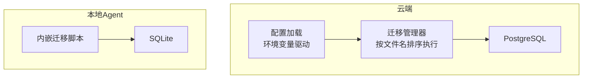
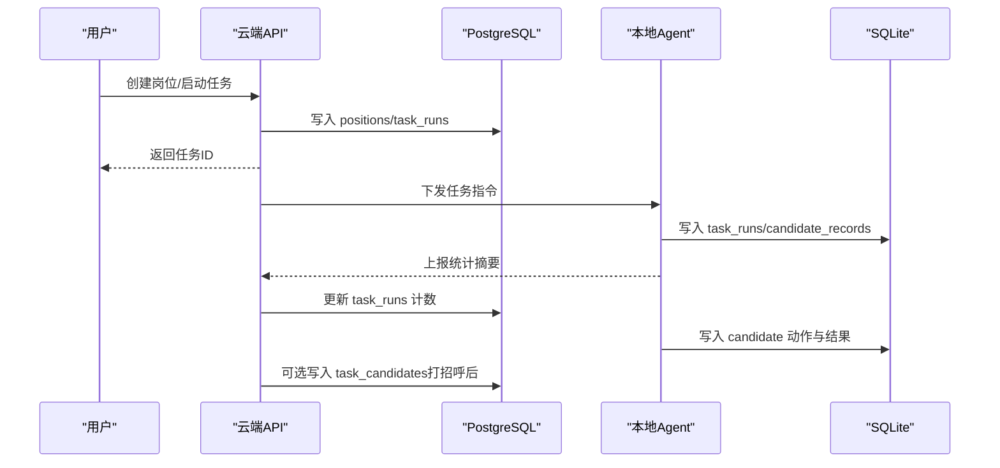
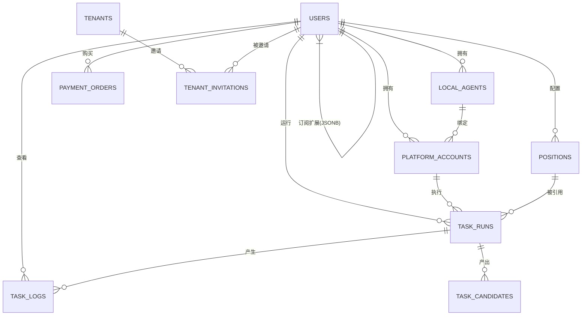
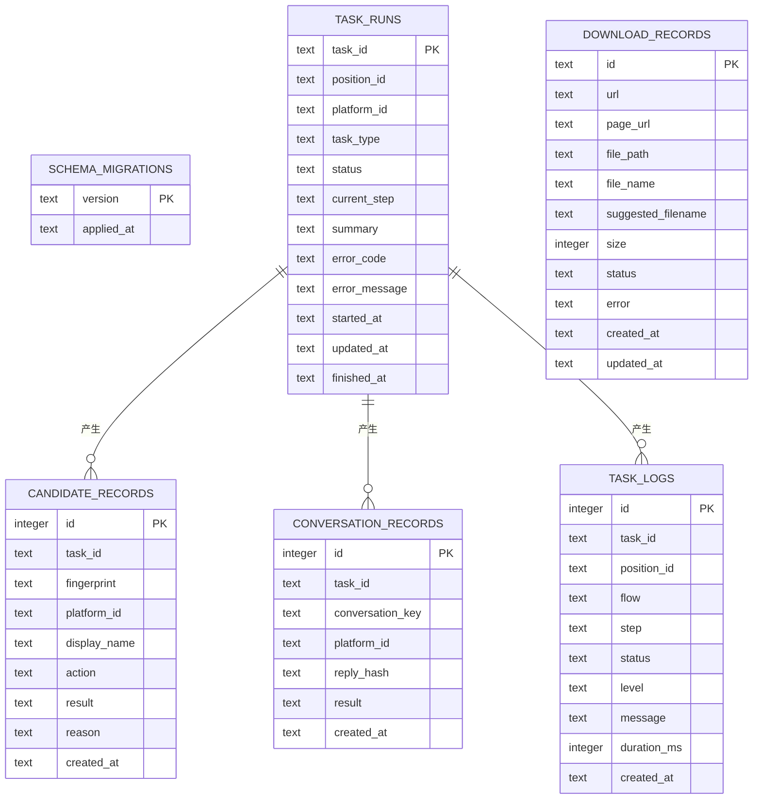
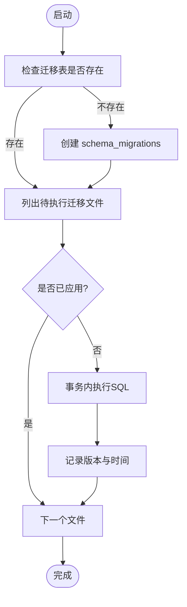
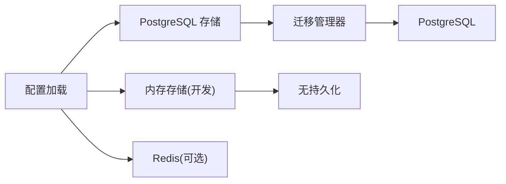

# 数据库设计

<cite>
**本文引用的文件**
- [0001_initial_schema.sql](file://goodhr5/cloud/backend/db/migrations/0001_initial_schema.sql)
- [0016_task_candidates.sql](file://goodhr5/cloud/backend/db/migrations/0016_task_candidates.sql)
- [0022_user_subscription.sql](file://goodhr5/cloud/backend/db/migrations/0022_user_subscription.sql)
- [0023_payment_orders.sql](file://goodhr5/cloud/backend/db/migrations/0023_payment_orders.sql)
- [0073_tenant_invitations.sql](file://goodhr5/cloud/backend/db/migrations/0073_tenant_invitations.sql)
- [0005_cookie_storage.sql](file://goodhr5/cloud/backend/db/migrations/0005_cookie_storage.sql)
- [auto_migrate.go](file://goodhr5/cloud/backend/internal/httpapi/auto_migrate.go)
- [config.go](file://goodhr5/cloud/backend/internal/httpapi/config.go)
- [system_config_store.go](file://goodhr5/cloud/backend/internal/httpapi/system_config_store.go)
- [cookie_store.go](file://goodhr5/cloud/backend/internal/httpapi/cookie_store.go)
- [agent_store_pg.go](file://goodhr5/cloud/backend/internal/httpapi/agent_store_pg.go)
- [001_initial.sql](file://goodhr5/local-agent-go-new/migrations/001_initial.sql)
- [002_download_records.sql](file://goodhr5/local-agent-go-new/migrations/002_download_records.sql)
- [003_task_logs.sql](file://goodhr5/local-agent-go-new/migrations/003_task_logs.sql)
- [embed.go](file://goodhr5/local-agent-go-new/migrations/embed.go)
- [store.go](file://goodhr5/local-agent-go-new/internal/storage/store.go)
- [db.go](file://goodhr5/local-agent-go/internal/localdb/db.go)
</cite>

## 目录
1. [简介](#简介)
2. [项目结构](#项目结构)
3. [核心组件](#核心组件)
4. [架构总览](#架构总览)
5. [详细组件分析](#详细组件分析)
6. [依赖关系分析](#依赖关系分析)
7. [性能与查询优化](#性能与查询优化)
8. [故障排查指南](#故障排查指南)
9. [结论](#结论)
10. [附录](#附录)

## 简介
本文件面向 HRPlus5 项目的数据库设计，覆盖云端 PostgreSQL 与本地 SQLite 两套存储的表结构、字段定义、索引策略、实体关系、外键约束与数据完整性规则；同时说明数据迁移管理机制、版本控制策略，以及关键业务表（用户、岗位、候选人、订单等）的设计思路与业务含义。文末提供查询优化建议、性能调优方案，以及备份恢复与安全加密等运维相关设计考虑。

## 项目结构
- 云端后端使用 PostgreSQL 作为主数据存储，通过 SQL 迁移脚本管理 schema 演进，并在服务启动时自动执行迁移。
- 本地 Agent 使用 SQLite 保存任务运行状态、候选人与对话记录、下载记录与步骤日志等，迁移脚本内嵌到二进制中并按版本顺序执行。
- 配置层根据环境变量决定是否启用 PostgreSQL/Redis，并创建对应的持久化存储实现。

图表来源
- [auto_migrate.go:13-55](file://goodhr5/cloud/backend/internal/httpapi/auto_migrate.go#L13-L55)
- [config.go:47-75](file://goodhr5/cloud/backend/internal/httpapi/config.go#L47-L75)
- [embed.go:1-9](file://goodhr5/local-agent-go-new/migrations/embed.go#L1-L9)
- [store.go:384-409](file://goodhr5/local-agent-go-new/internal/storage/store.go#L384-L409)

章节来源
- [config.go:47-75](file://goodhr5/cloud/backend/internal/httpapi/config.go#L47-L75)
- [auto_migrate.go:13-55](file://goodhr5/cloud/backend/internal/httpapi/auto_migrate.go#L13-L55)
- [embed.go:1-9](file://goodhr5/local-agent-go-new/migrations/embed.go#L1-L9)
- [store.go:384-409](file://goodhr5/local-agent-go-new/internal/storage/store.go#L384-L409)

## 核心组件
- 用户与会话：users 表承载云端登录用户，包含邮箱唯一标识、注册时间与最近登录时间。
- 本地代理绑定：local_agents 表记录用户绑定的本地 Agent 机器信息、版本与在线状态。
- 平台账号映射：platform_accounts 表维护招聘平台账号与本地 profile ID 的映射，不保存敏感 Cookie。
- 岗位配置：positions 表保存用户配置的招聘岗位、关键词筛选与问候语等。
- 任务运行：task_runs 表记录云端侧的任务元信息与统计摘要（扫描数、打招呼数、失败数等）。
- 任务日志：task_logs 表记录任务运行日志摘要。
- 候选人入库：task_candidates 表保存打招呼后入库的候选人结构化信息与 AI 评分结果。
- 订阅与支付：users.subscription JSONB 记录订阅信息；payment_orders 表记录支付订单与回调数据。
- 团队邀请：tenant_invitations 表记录团队成员邀请流程与状态。
- Cookie 加密存储：cookie_data 表以加密方式保存 Cookie，支持多租户共享开关。

章节来源
- [0001_initial_schema.sql:7-134](file://goodhr5/cloud/backend/db/migrations/0001_initial_schema.sql#L7-L134)
- [0016_task_candidates.sql:4-96](file://goodhr5/cloud/backend/db/migrations/0016_task_candidates.sql#L4-L96)
- [0022_user_subscription.sql:1-62](file://goodhr5/cloud/backend/db/migrations/0022_user_subscription.sql#L1-L62)
- [0023_payment_orders.sql:1-48](file://goodhr5/cloud/backend/db/migrations/0023_payment_orders.sql#L1-L48)
- [0073_tenant_invitations.sql:1-105](file://goodhr5/cloud/backend/db/migrations/0073_tenant_invitations.sql#L1-L105)
- [0005_cookie_storage.sql:1-1](file://goodhr5/cloud/backend/db/migrations/0005_cookie_storage.sql#L1-L1)

## 架构总览
云端 PostgreSQL 负责跨设备、跨会话的业务数据持久化；本地 SQLite 负责单机任务执行过程中的临时与审计数据。两者通过云端 API 协同：云端仅保留必要元数据与统计摘要，敏感数据（Cookie、完整候选人详情、截图、OCR 原文）留在本地 Agent。

图表来源
- [0001_initial_schema.sql:51-134](file://goodhr5/cloud/backend/db/migrations/0001_initial_schema.sql#L51-L134)
- [001_initial.sql:8-47](file://goodhr5/local-agent-go-new/migrations/001_initial.sql#L8-L47)
- [0016_task_candidates.sql:4-96](file://goodhr5/cloud/backend/db/migrations/0016_task_candidates.sql#L4-L96)

## 详细组件分析

### 云端 PostgreSQL 表结构与关系
- users：用户主表，email 唯一，用于验证码登录。
- local_agents：用户与本地 Agent 的绑定关系，含 machine_id、agent_version、bind_status、last_seen_at。
- platform_accounts：平台账号映射，关联用户与本地 Agent，避免重复绑定。
- positions：岗位配置，keywords/exclude_keywords 为 JSONB 数组，is_and_mode 控制匹配模式。
- task_runs：任务运行记录，关联用户、本地 Agent、平台账号、岗位，统计扫描/打招呼/跳过/失败数量。
- task_logs：任务日志摘要，关联任务与用户。
- task_candidates：候选人入库表，保存结构化信息与 AI 评分，JSONB 字段存储经历、证书、荣誉、项目经验等。
- payment_orders：支付订单表，记录套餐、金额、支付渠道、交易号、状态与回调原始数据。
- tenant_invitations：团队邀请表，记录邀请角色、状态、发送与响应时间。
- cookie_data：加密 Cookie 存储，支持多租户共享开关。

图表来源
- [0001_initial_schema.sql:7-134](file://goodhr5/cloud/backend/db/migrations/0001_initial_schema.sql#L7-L134)
- [0016_task_candidates.sql:4-96](file://goodhr5/cloud/backend/db/migrations/0016_task_candidates.sql#L4-L96)
- [0023_payment_orders.sql:1-48](file://goodhr5/cloud/backend/db/migrations/0023_payment_orders.sql#L1-L48)
- [0073_tenant_invitations.sql:12-47](file://goodhr5/cloud/backend/db/migrations/0073_tenant_invitations.sql#L12-L47)
- [0005_cookie_storage.sql:1-1](file://goodhr5/cloud/backend/db/migrations/0005_cookie_storage.sql#L1-L1)

章节来源
- [0001_initial_schema.sql:7-134](file://goodhr5/cloud/backend/db/migrations/0001_initial_schema.sql#L7-L134)
- [0016_task_candidates.sql:4-96](file://goodhr5/cloud/backend/db/migrations/0016_task_candidates.sql#L4-L96)
- [0023_payment_orders.sql:1-48](file://goodhr5/cloud/backend/db/migrations/0023_payment_orders.sql#L1-L48)
- [0073_tenant_invitations.sql:12-47](file://goodhr5/cloud/backend/db/migrations/0073_tenant_invitations.sql#L12-L47)
- [0005_cookie_storage.sql:1-1](file://goodhr5/cloud/backend/db/migrations/0005_cookie_storage.sql#L1-L1)

### 本地 SQLite 表结构与关系
- schema_migrations：记录已执行的迁移版本与时间。
- task_runs：本地任务编号、岗位编号、平台编号、任务类型、当前步骤、摘要、错误码与时间戳。
- candidate_records：去重指纹、平台编号、动作与结果、原因。
- conversation_records：会话去重标识、回复哈希与结果。
- download_records：浏览器下载记录，便于去重提示与历史查询。
- task_logs：任务步骤日志，包含流程、步骤、状态、级别、消息与耗时。

图表来源
- [001_initial.sql:3-47](file://goodhr5/local-agent-go-new/migrations/001_initial.sql#L3-L47)
- [002_download_records.sql:1-20](file://goodhr5/local-agent-go-new/migrations/002_download_records.sql#L1-L20)
- [003_task_logs.sql:1-18](file://goodhr5/local-agent-go-new/migrations/003_task_logs.sql#L1-L18)

章节来源
- [001_initial.sql:3-47](file://goodhr5/local-agent-go-new/migrations/001_initial.sql#L3-L47)
- [002_download_records.sql:1-20](file://goodhr5/local-agent-go-new/migrations/002_download_records.sql#L1-L20)
- [003_task_logs.sql:1-18](file://goodhr5/local-agent-go-new/migrations/003_task_logs.sql#L1-L18)

### 数据迁移管理与版本控制
- 云端 PostgreSQL：
  - 迁移脚本位于 db/migrations，按文件名排序执行，跳过 .down.sql。
  - 启动时检查 schema_migrations 表，若为空且检测到旧库则标记当前迁移为已应用，避免重复覆盖系统配置。
  - 每次成功执行迁移后记录文件名与时间。
- 本地 SQLite：
  - 迁移脚本内嵌到二进制中，启动时读取并逐个执行未应用的迁移。
  - 在事务中执行 SQL 并记录 schema_migrations 的版本与时间，确保幂等与一致性。

图表来源
- [auto_migrate.go:13-55](file://goodhr5/cloud/backend/internal/httpapi/auto_migrate.go#L13-L55)
- [auto_migrate.go:57-116](file://goodhr5/cloud/backend/internal/httpapi/auto_migrate.go#L57-L116)
- [store.go:384-409](file://goodhr5/local-agent-go-new/internal/storage/store.go#L384-L409)

章节来源
- [auto_migrate.go:13-55](file://goodhr5/cloud/backend/internal/httpapi/auto_migrate.go#L13-L55)
- [auto_migrate.go:57-116](file://goodhr5/cloud/backend/internal/httpapi/auto_migrate.go#L57-L116)
- [store.go:384-409](file://goodhr5/local-agent-go-new/internal/storage/store.go#L384-L409)

### 关键业务表设计思路与业务含义
- 用户（users）：以邮箱为唯一标识进行验证码登录；subscription JSONB 记录会员类型与到期时间；tenant_joined_at 记录加入团队时间。
- 岗位（positions）：支持正向/排除关键词与 AND 模式，便于灵活筛选候选人；greet_message 用于自动化打招呼。
- 候选人（task_candidates）：结构化字段覆盖基本信息、期望薪资、教育、经历、证书、荣誉、项目经验、沟通记录；AI 评分与原因贯穿详情、打招呼、复核阶段；ext 容纳平台个性化信息。
- 订单（payment_orders）：记录套餐、原价、折扣、实付、支付渠道、交易号、状态、过期时间与回调原始数据，便于对账与审计。
- 团队邀请（tenant_invitations）：支持 admin/user 角色，pending/accepted/rejected/canceled 状态机，邮件发送与响应时间追踪。
- Cookie（cookie_data）：加密存储字节数据与密钥映射，支持多租户共享开关，保障敏感数据安全。

章节来源
- [0001_initial_schema.sql:7-134](file://goodhr5/cloud/backend/db/migrations/0001_initial_schema.sql#L7-L134)
- [0016_task_candidates.sql:4-96](file://goodhr5/cloud/backend/db/migrations/0016_task_candidates.sql#L4-L96)
- [0022_user_subscription.sql:1-62](file://goodhr5/cloud/backend/db/migrations/0022_user_subscription.sql#L1-L62)
- [0023_payment_orders.sql:1-48](file://goodhr5/cloud/backend/db/migrations/0023_payment_orders.sql#L1-L48)
- [0073_tenant_invitations.sql:12-47](file://goodhr5/cloud/backend/db/migrations/0073_tenant_invitations.sql#L12-L47)
- [0005_cookie_storage.sql:1-1](file://goodhr5/cloud/backend/db/migrations/0005_cookie_storage.sql#L1-L1)

## 依赖关系分析
- 配置层根据环境变量决定使用 PostgreSQL/Redis 或内存实现，统一通过 Store 接口抽象。
- 迁移管理器在连接建立后自动执行迁移，保证 schema 一致。
- Cookie 存储通过加密数据与密钥映射实现多租户共享，降低敏感信息泄露风险。
- 本地 Agent 的 SQLite 迁移内嵌，避免外部依赖，提升部署稳定性。

图表来源
- [config.go:47-75](file://goodhr5/cloud/backend/internal/httpapi/config.go#L47-L75)
- [config.go:119-276](file://goodhr5/cloud/backend/internal/httpapi/config.go#L119-L276)
- [auto_migrate.go:13-55](file://goodhr5/cloud/backend/internal/httpapi/auto_migrate.go#L13-L55)

章节来源
- [config.go:47-75](file://goodhr5/cloud/backend/internal/httpapi/config.go#L47-L75)
- [config.go:119-276](file://goodhr5/cloud/backend/internal/httpapi/config.go#L119-L276)
- [auto_migrate.go:13-55](file://goodhr5/cloud/backend/internal/httpapi/auto_migrate.go#L13-L55)

## 性能与查询优化
- 索引策略
  - 云端：为高频查询列建立复合索引，如 task_runs(user_id, created_at DESC)、task_logs(task_id, created_at DESC)、task_candidates(platform_id, candidate_name)。
  - 本地：为 task_runs(position_id, started_at)、download_records(created_at DESC)、task_logs(position_id, id DESC) 建立索引以提升列表与历史查询性能。
- 查询优化建议
  - 使用分页与过滤条件减少全表扫描，优先利用复合索引。
  - 对 JSONB 字段采用合适的路径表达式与GIN索引（如 keywords、work_experiences），但需评估写入开销。
  - 对大表（task_candidates、task_logs）定期归档与清理，避免热表膨胀。
- 连接池与超时
  - 云端 PostgreSQL 连接池设置最大连接数、空闲连接数与生命周期，避免资源耗尽。
  - 迁移与查询设置合理超时，防止阻塞。
- 缓存与异步
  - 岗位日志可结合 Redis 做热点缓存，降低数据库压力。
  - 统计类指标可异步聚合，避免同步写入影响主流程。

章节来源
- [0001_initial_schema.sql:129-134](file://goodhr5/cloud/backend/db/migrations/0001_initial_schema.sql#L129-L134)
- [0016_task_candidates.sql:90-96](file://goodhr5/cloud/backend/db/migrations/0016_task_candidates.sql#L90-L96)
- [002_download_records.sql:17-20](file://goodhr5/local-agent-go-new/migrations/002_download_records.sql#L17-L20)
- [003_task_logs.sql:16-18](file://goodhr5/local-agent-go-new/migrations/003_task_logs.sql#L16-L18)
- [config.go:58-75](file://goodhr5/cloud/backend/internal/httpapi/config.go#L58-L75)

## 故障排查指南
- 迁移失败
  - 云端：检查 schema_migrations 表是否记录失败迁移；确认迁移文件顺序与幂等性；查看日志输出。
  - 本地：确认内嵌迁移文件可读；检查事务回滚与错误信息。
- 连接问题
  - 云端：验证 DSN、网络连通性与权限；检查连接池配置与超时。
  - 本地：确认数据目录可写、SQLite 文件可用。
- Cookie 解密失败
  - 检查 encrypted_keys 映射是否正确；确认 Agent 私钥与公钥配对；核对租户共享开关。
- 候选人入库异常
  - 核对 task_candidates 必填字段与 JSONB 结构；检查 AI 评分字段是否为空；确认 task_id 与 user_id 外键有效。

章节来源
- [auto_migrate.go:13-55](file://goodhr5/cloud/backend/internal/httpapi/auto_migrate.go#L13-L55)
- [store.go:384-409](file://goodhr5/local-agent-go-new/internal/storage/store.go#L384-L409)
- [cookie_store.go:148-184](file://goodhr5/cloud/backend/internal/httpapi/cookie_store.go#L148-L184)
- [db.go:22-42](file://goodhr5/local-agent-go/internal/localdb/db.go#L22-L42)

## 结论
HRPlus5 的数据库设计遵循“云端集中、本地隔离”的原则：云端 PostgreSQL 聚焦账户、配置、任务元数据与统计摘要，本地 SQLite 承担任务执行过程的详细记录与审计。通过严格的迁移管理与索引策略，系统在可扩展性与性能之间取得平衡。安全方面，Cookie 等敏感数据采用加密存储与密钥映射，配合多租户共享开关，降低泄露风险。未来可进一步引入 JSONB 索引、冷热数据分离与更细粒度的访问控制，以支撑更大规模的使用场景。

## 附录
- 备份与恢复
  - 云端 PostgreSQL：定期逻辑备份（pg_dump）与物理备份（WAL），制定恢复演练计划。
  - 本地 SQLite：复制数据库文件与 WAL 文件，注意进程关闭与锁冲突。
- 安全与加密
  - Cookie 加密：使用随机对称密钥加密数据，并用接收方公钥加密密钥，实现多租户共享。
  - 传输安全：HTTPS 与 TLS 连接数据库，限制最小协议版本与密码套件。
  - 访问控制：最小权限原则，按角色分配数据库访问权限。
- 监控与告警
  - 监控迁移执行、慢查询、连接池使用率与磁盘空间。
  - 对支付订单状态变更、候选人入库失败等关键事件设置告警。