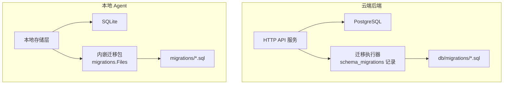
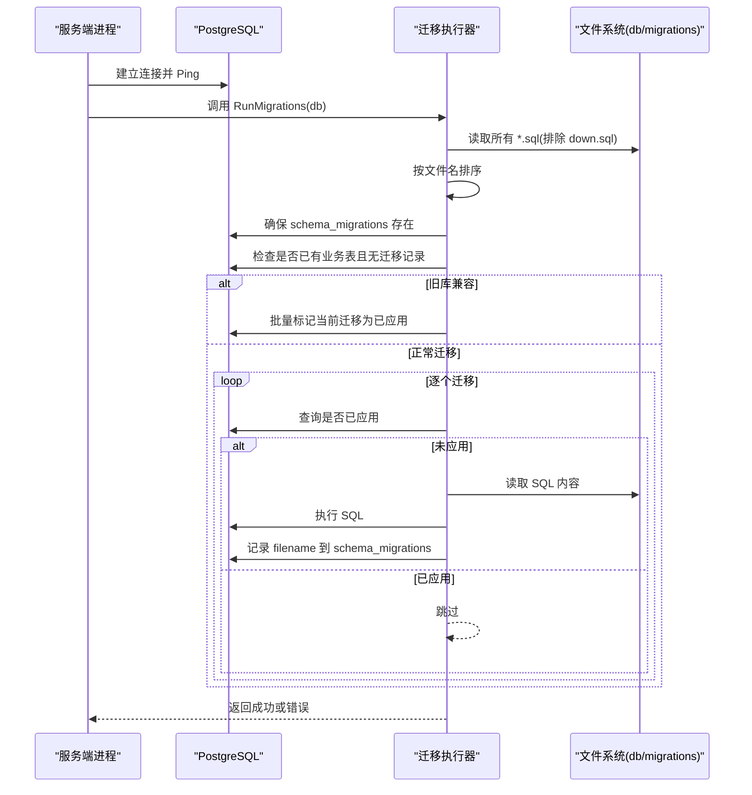
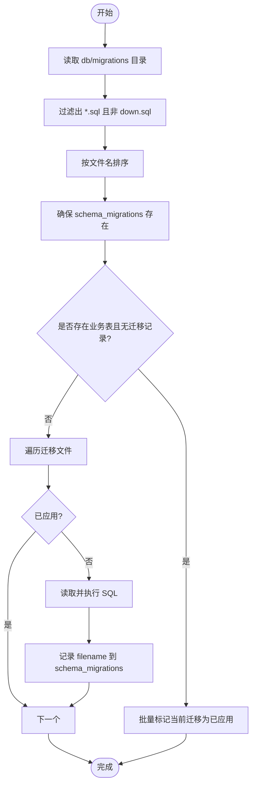
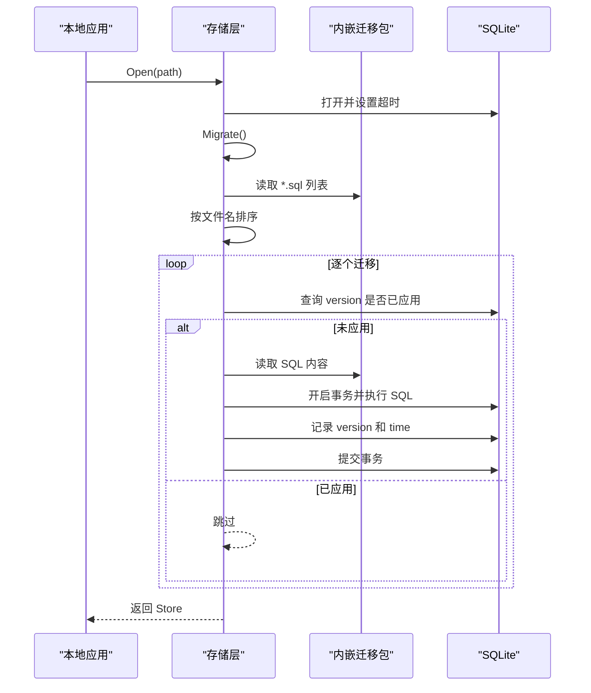
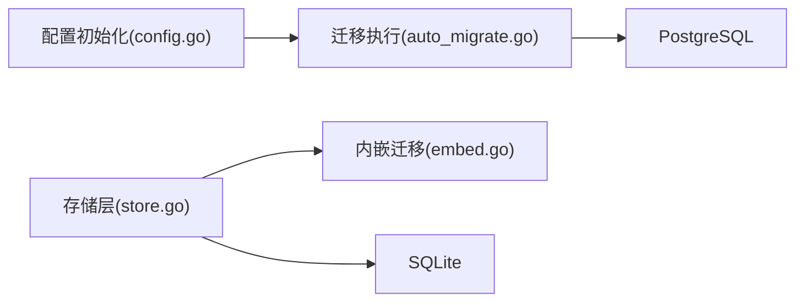

# 数据迁移管理

<cite>
**本文引用的文件**
- [auto_migrate.go](file://goodhr5/cloud/backend/internal/httpapi/auto_migrate.go)
- [config.go](file://goodhr5/cloud/backend/internal/httpapi/config.go)
- [0001_initial_schema.sql](file://goodhr5/cloud/backend/db/migrations/0001_initial_schema.sql)
- [0001_initial_schema.down.sql](file://goodhr5/cloud/backend/db/migrations/0001_initial_schema.down.sql)
- [0002_add_system_configs.sql](file://goodhr5/cloud/backend/db/migrations/0002_add_system_configs.sql)
- [embed.go](file://goodhr5/local-agent-go/migrations/embed.go)
- [store.go](file://goodhr5/local-agent-go/internal/storage/store.go)
- [001_initial.sql](file://goodhr5/local-agent-go/migrations/001_initial.sql)
- [002_download_records.sql](file://goodhr5/local-agent-go/migrations/002_download_records.sql)
</cite>

## 目录
1. [简介](#简介)
2. [项目结构](#项目结构)
3. [核心组件](#核心组件)
4. [架构总览](#架构总览)
5. [详细组件分析](#详细组件分析)
6. [依赖关系分析](#依赖关系分析)
7. [性能考虑](#性能考虑)
8. [故障排查指南](#故障排查指南)
9. [结论](#结论)
10. [附录](#附录)

## 简介
本文件面向 GoodHR 5 的数据迁移管理，覆盖云端 PostgreSQL 与本地 SQLite 两套数据库的迁移机制。重点说明：
- 迁移文件命名规范、版本号管理与执行顺序控制
- 迁移文件结构（up/down 脚本）编写规范
- 自动迁移的实现原理（检测、执行、回滚策略）
- 生产环境安全部署流程（备份、监控、验证）
- 常见问题排查（并发冲突、数据损坏、版本不一致）
- 最佳实践与故障恢复指南

## 项目结构
- 云端后端使用 Go 程序启动时自动对 PostgreSQL 执行 SQL 迁移，迁移脚本集中存放于 db/migrations 目录，并通过 schema_migrations 表记录已执行的迁移文件名。
- 新本地 Agent 使用内嵌的 SQLite 迁移脚本，通过 embed 机制将 .sql 文件打包进二进制，在应用启动时按文件名排序依次执行，并在 schema_migrations 表中记录版本号与时间戳。

图表来源
- [auto_migrate.go:13-55](file://goodhr5/cloud/backend/internal/httpapi/auto_migrate.go#L13-L55)
- [embed.go:1-10](file://goodhr5/local-agent-go/migrations/embed.go#L1-L10)
- [store.go:64-109](file://goodhr5/local-agent-go/internal/storage/store.go#L64-L109)

章节来源
- [auto_migrate.go:13-55](file://goodhr5/cloud/backend/internal/httpapi/auto_migrate.go#L13-L55)
- [store.go:64-109](file://goodhr5/local-agent-go/internal/storage/store.go#L64-L109)

## 核心组件
- 云端 PostgreSQL 自动迁移
  - 入口：服务配置阶段建立数据库连接后调用迁移函数
  - 迁移目录：db/migrations，仅扫描以 .sql 结尾且非 down.sql 的文件
  - 版本记录：schema_migrations(filename, applied_at)，用于幂等执行
  - 旧库兼容：若检测到已有业务表但无迁移记录，则批量标记当前迁移为已应用，避免重复执行
- 本地 SQLite 自动迁移
  - 入口：Store.Open 打开 SQLite 后调用 Migrate
  - 迁移资源：通过 embed 将 migrations/*.sql 内嵌到二进制中
  - 版本记录：schema_migrations(version, applied_at)，按文件名排序执行未应用的迁移
  - 事务保障：每个迁移在事务中执行，失败回滚并返回错误

章节来源
- [config.go:60-75](file://goodhr5/cloud/backend/internal/httpapi/config.go#L60-L75)
- [auto_migrate.go:13-55](file://goodhr5/cloud/backend/internal/httpapi/auto_migrate.go#L13-L55)
- [store.go:64-109](file://goodhr5/local-agent-go/internal/storage/store.go#L64-L109)
- [store.go:384-410](file://goodhr5/local-agent-go/internal/storage/store.go#L384-L410)

## 架构总览

图表来源
- [config.go:60-75](file://goodhr5/cloud/backend/internal/httpapi/config.go#L60-L75)
- [auto_migrate.go:13-55](file://goodhr5/cloud/backend/internal/httpapi/auto_migrate.go#L13-L55)
- [auto_migrate.go:57-116](file://goodhr5/cloud/backend/internal/httpapi/auto_migrate.go#L57-L116)

## 详细组件分析

### 云端 PostgreSQL 自动迁移
- 文件扫描与排序
  - 仅收集以 .sql 结尾且不以 .down.sql 结尾的文件名，随后按字符串排序保证执行顺序
- 版本表与幂等性
  - 创建 schema_migrations 表（filename 主键），插入时使用“忽略冲突”策略，确保幂等
- 旧库兼容
  - 若 schema_migrations 为空且信息架构中存在已知业务表，则认为已运行过的旧库，直接批量标记当前迁移为已应用，避免破坏现有数据
- 执行流程
  - 对每个未应用的迁移，读取 SQL 并执行，成功后记录 filename

图表来源
- [auto_migrate.go:13-55](file://goodhr5/cloud/backend/internal/httpapi/auto_migrate.go#L13-L55)
- [auto_migrate.go:57-116](file://goodhr5/cloud/backend/internal/httpapi/auto_migrate.go#L57-L116)

章节来源
- [auto_migrate.go:13-55](file://goodhr5/cloud/backend/internal/httpapi/auto_migrate.go#L13-L55)
- [auto_migrate.go:57-116](file://goodhr5/cloud/backend/internal/httpapi/auto_migrate.go#L57-L116)

### 本地 SQLite 自动迁移
- 内嵌迁移资源
  - 使用 embed 将 migrations/*.sql 打包进二进制，避免外部路径依赖
- 迁移执行
  - 启动时读取内嵌目录，筛选 .sql 文件并按文件名排序
  - 对每个未应用的迁移，在事务中执行 SQL，成功后写入 schema_migrations(version, applied_at)
- 特殊处理
  - 首次迁移（001_initial.sql）强制执行，后续迁移根据 version 判断是否已应用

图表来源
- [embed.go:1-10](file://goodhr5/local-agent-go/migrations/embed.go#L1-L10)
- [store.go:64-109](file://goodhr5/local-agent-go/internal/storage/store.go#L64-L109)
- [store.go:384-410](file://goodhr5/local-agent-go/internal/storage/store.go#L384-L410)

章节来源
- [embed.go:1-10](file://goodhr5/local-agent-go/migrations/embed.go#L1-L10)
- [store.go:64-109](file://goodhr5/local-agent-go/internal/storage/store.go#L64-L109)
- [store.go:384-410](file://goodhr5/local-agent-go/internal/storage/store.go#L384-L410)

### 迁移文件命名规范与版本管理
- 云端 PostgreSQL
  - 命名格式：NNNN_description.sql（例如 0001_initial_schema.sql）
  - 回滚脚本：NNNN_description.down.sql（可选，供手动回滚使用）
  - 版本顺序：由文件名前缀数字决定，代码按字符串排序执行
  - 版本记录：schema_migrations.filename 字段记录已执行文件名
- 本地 SQLite
  - 命名格式：NNN_description.sql（例如 001_initial.sql）
  - 版本顺序：同样按文件名排序
  - 版本记录：schema_migrations.version 字段记录已执行文件名

章节来源
- [auto_migrate.go:13-55](file://goodhr5/cloud/backend/internal/httpapi/auto_migrate.go#L13-L55)
- [store.go:90-109](file://goodhr5/local-agent-go/internal/storage/store.go#L90-L109)

### up 与 down 脚本编写规范
- up 脚本（推荐）
  - 幂等设计：优先使用 CREATE TABLE IF NOT EXISTS、ALTER TABLE ... ADD COLUMN IF NOT EXISTS 等语句
  - 索引与注释：为高频查询列添加索引；使用 COMMENT 描述表和字段含义
  - 数据变更：谨慎更新历史数据，必要时分批执行并记录日志
- down 脚本（可选）
  - 用途：用于手动回滚或测试环境清理
  - 顺序：删除对象时应遵循外键依赖逆序，先删子表再删父表
  - 示例参考：初始表的 down 脚本按依赖逆序 DROP TABLE

章节来源
- [0001_initial_schema.sql:1-135](file://goodhr5/cloud/backend/db/migrations/0001_initial_schema.sql#L1-L135)
- [0001_initial_schema.down.sql:1-11](file://goodhr5/cloud/backend/db/migrations/0001_initial_schema.down.sql#L1-L11)
- [0002_add_system_configs.sql:1-15](file://goodhr5/cloud/backend/db/migrations/0002_add_system_configs.sql#L1-L15)

### 自动迁移机制实现原理
- 迁移检测
  - 云端：读取 schema_migrations 表判断是否已执行；若为空且存在业务表，则视为旧库并批量标记
  - 本地：读取 schema_migrations 表判断 version 是否已应用
- 执行顺序控制
  - 两者均按文件名排序执行，确保严格递增顺序
- 执行与记录
  - 云端：读取 SQL 文本并执行，成功后插入 filename
  - 本地：在事务中执行 SQL，成功后插入 version 与时间戳
- 回滚策略
  - 自动迁移不执行 down 脚本；如需回滚，需手动执行对应的 .down.sql 或使用数据库工具回滚事务（本地 SQLite 支持事务回滚）

章节来源
- [auto_migrate.go:57-116](file://goodhr5/cloud/backend/internal/httpapi/auto_migrate.go#L57-L116)
- [store.go:384-410](file://goodhr5/local-agent-go/internal/storage/store.go#L384-L410)

### 生产环境安全部署流程
- 迁移前
  - 备份：对 PostgreSQL 进行全量或增量备份；对本地 SQLite 文件进行快照备份
  - 预检：确认数据库连接可用；检查 schema_migrations 当前状态
- 迁移中
  - 单实例执行：确保同一时刻只有一个进程执行迁移，避免并发冲突
  - 监控：观察迁移日志与数据库慢查询；关注错误码与异常堆栈
- 迁移后
  - 验证：核对关键表结构与索引是否存在；抽样查询业务数据一致性
  - 回滚预案：准备 down 脚本或备份恢复方案，出现严重问题时快速回退

[本节为通用指导，不直接引用具体文件]

### 常见迁移问题排查
- 并发冲突
  - 现象：PostgreSQL 锁等待或 SQLite busy
  - 排查：确认只允许单一迁移进程；检查是否有长事务阻塞；调整 SQLite busy_timeout
- 数据损坏
  - 现象：迁移执行时报语法错误或约束冲突
  - 排查：检查 up 脚本幂等性；核对字段类型与默认值；必要时从备份恢复
- 版本不一致
  - 现象：本地与云端 schema_migrations 记录不一致导致重复或遗漏
  - 排查：对比实际已执行迁移与代码中迁移文件列表；修复脏数据后重新执行

章节来源
- [store.go:64-88](file://goodhr5/local-agent-go/internal/storage/store.go#L64-L88)
- [auto_migrate.go:13-55](file://goodhr5/cloud/backend/internal/httpapi/auto_migrate.go#L13-L55)

## 依赖关系分析

图表来源
- [config.go:60-75](file://goodhr5/cloud/backend/internal/httpapi/config.go#L60-L75)
- [auto_migrate.go:13-55](file://goodhr5/cloud/backend/internal/httpapi/auto_migrate.go#L13-L55)
- [embed.go:1-10](file://goodhr5/local-agent-go/migrations/embed.go#L1-L10)
- [store.go:64-109](file://goodhr5/local-agent-go/internal/storage/store.go#L64-L109)

章节来源
- [config.go:60-75](file://goodhr5/cloud/backend/internal/httpapi/config.go#L60-L75)
- [auto_migrate.go:13-55](file://goodhr5/cloud/backend/internal/httpapi/auto_migrate.go#L13-L55)
- [embed.go:1-10](file://goodhr5/local-agent-go/migrations/embed.go#L1-L10)
- [store.go:64-109](file://goodhr5/local-agent-go/internal/storage/store.go#L64-L109)

## 性能考虑
- 云端 PostgreSQL
  - 迁移期间避免大事务长时间持有锁；对大批量数据变更建议分批提交
  - 合理设计索引，避免频繁重建；DDL 尽量幂等以减少重试成本
- 本地 SQLite
  - 设置 busy_timeout 降低写入竞争；保持单连接写入（已设置 MaxOpenConns=1）
  - 迁移在事务中执行，失败自动回滚，减少部分执行带来的不一致

[本节为通用指导，不直接引用具体文件]

## 故障排查指南
- 云端 PostgreSQL
  - 连接失败：检查数据库地址、端口、认证信息与网络连通性
  - 迁移失败：查看日志中的迁移文件名与错误信息；核对 SQL 语法与权限
  - 旧库兼容：若误判为旧库，检查 schema_migrations 是否为空及业务表是否存在
- 本地 SQLite
  - 文件锁定：确保没有其他进程占用 SQLite 文件；检查并发写入
  - 迁移失败：查看事务回滚后的错误信息；核对 schema_migrations 中 version 记录
  - 数据不一致：比对任务与候选人摘要表的结构与索引

章节来源
- [config.go:60-75](file://goodhr5/cloud/backend/internal/httpapi/config.go#L60-L75)
- [auto_migrate.go:57-116](file://goodhr5/cloud/backend/internal/httpapi/auto_migrate.go#L57-L116)
- [store.go:64-109](file://goodhr5/local-agent-go/internal/storage/store.go#L64-L109)
- [store.go:384-410](file://goodhr5/local-agent-go/internal/storage/store.go#L384-L410)

## 结论
GoodHR 5 的迁移体系在云端与本地两端均采用“文件驱动 + 版本记录”的模式，通过文件名排序保证执行顺序，借助 schema_migrations 实现幂等执行。云端提供旧库兼容逻辑，本地通过内嵌资源与事务保障提升可移植性与可靠性。生产部署应配合备份、监控与验证流程，并制定回滚预案，以确保数据安全与服务稳定。

[本节为总结性内容，不直接引用具体文件]

## 附录
- 示例迁移文件参考
  - 云端初始表结构：[0001_initial_schema.sql](file://goodhr5/cloud/backend/db/migrations/0001_initial_schema.sql)
  - 云端系统配置扩展：[0002_add_system_configs.sql](file://goodhr5/cloud/backend/db/migrations/0002_add_system_configs.sql)
  - 本地初始结构：[001_initial.sql](file://goodhr5/local-agent-go/migrations/001_initial.sql)
  - 本地下载记录扩展：[002_download_records.sql](file://goodhr5/local-agent-go/migrations/002_download_records.sql)

章节来源
- [0001_initial_schema.sql:1-135](file://goodhr5/cloud/backend/db/migrations/0001_initial_schema.sql#L1-L135)
- [0002_add_system_configs.sql:1-15](file://goodhr5/cloud/backend/db/migrations/0002_add_system_configs.sql#L1-L15)
- [001_initial.sql:1-48](file://goodhr5/local-agent-go/migrations/001_initial.sql#L1-L48)
- [002_download_records.sql:1-20](file://goodhr5/local-agent-go/migrations/002_download_records.sql#L1-L20)